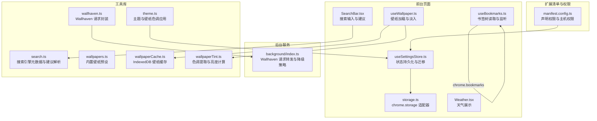
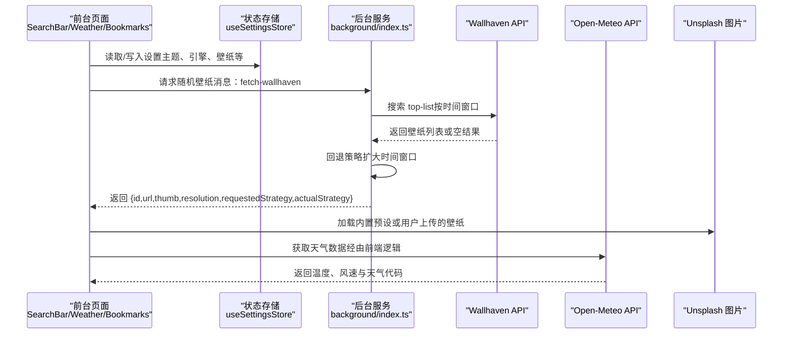
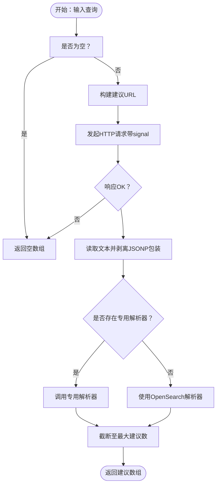
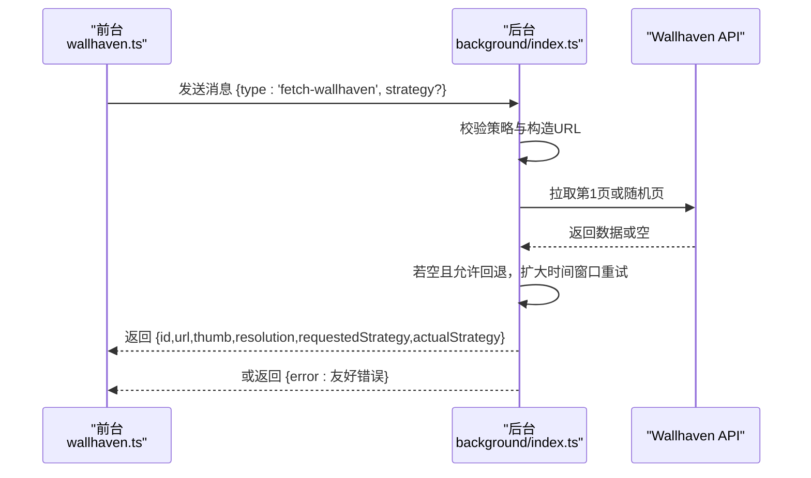
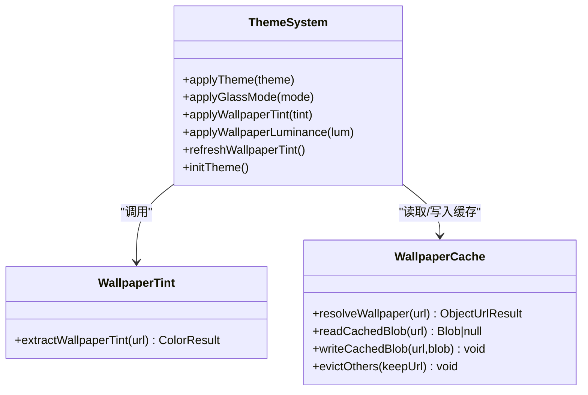
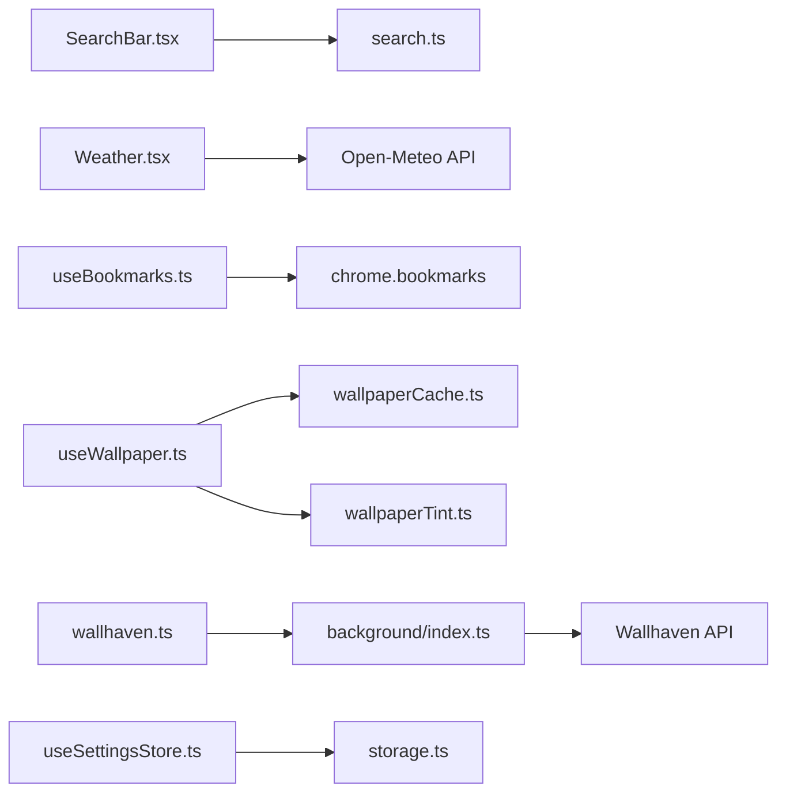

# API 参考文档

<cite>
**本文引用的文件**
- [README.md](file://README.md)
- [manifest.config.ts](file://manifest.config.ts)
- [src/lib/search.ts](file://src/lib/search.ts)
- [src/lib/wallpapers.ts](file://src/lib/wallpapers.ts)
- [src/lib/wallhaven.ts](file://src/lib/wallhaven.ts)
- [src/lib/theme.ts](file://src/lib/theme.ts)
- [src/lib/useWallpaper.ts](file://src/lib/useWallpaper.ts)
- [src/lib/wallpaperCache.ts](file://src/lib/wallpaperCache.ts)
- [src/lib/wallpaperTint.ts](file://src/lib/wallpaperTint.ts)
- [src/store/storage.ts](file://src/store/storage.ts)
- [src/store/useSettingsStore.ts](file://src/store/useSettingsStore.ts)
- [src/components/widgets/SearchBar/SearchBar.tsx](file://src/components/widgets/SearchBar/SearchBar.tsx)
- [src/components/widgets/Weather/Weather.tsx](file://src/components/widgets/Weather/Weather.tsx)
- [src/components/widgets/Bookmarks/useBookmarks.ts](file://src/components/widgets/Bookmarks/useBookmarks.ts)
- [src/background/index.ts](file://src/background/index.ts)
</cite>

## 目录

1. [简介](#简介)
2. [项目结构](#项目结构)
3. [核心组件](#核心组件)
4. [架构总览](#架构总览)
5. [详细组件分析](#详细组件分析)
6. [依赖分析](#依赖分析)
7. [性能考量](#性能考量)
8. [故障排查指南](#故障排查指南)
9. [结论](#结论)
10. [附录](#附录)

## 简介

本文件为 Tab 项目的完整 API 参考文档，覆盖以下方面：

- Chrome 扩展 API 集成：chrome.storage、chrome.bookmarks、chrome.runtime 等
- 外部服务 API 集成：搜索引擎建议与搜索、天气服务、壁纸服务（Unsplash、Wallhaven）
- 自定义 API 接口设计与实现：搜索建议、天气查询、壁纸获取
- 参数规范、返回值格式与错误处理
- 版本管理、向后兼容与迁移指南
- 调用示例与集成要点
- 性能考虑与限制条件

## 项目结构

该项目为基于 React + Vite 的 Chrome 新标签页扩展，采用模块化组织：

- src/newtab：入口页面与 React 根节点
- src/components/widgets：各小部件（搜索栏、时钟、快捷方式、天气、待办、书签）
- src/components/settings：设置抽屉与相关配置项
- src/store：状态存储（Zustand + chrome.storage 适配）
- src/lib：通用工具库（搜索、主题、壁纸、缓存等）

图表来源

- [manifest.config.ts:1-38](file://manifest.config.ts#L1-L38)
- [src/store/useSettingsStore.ts:1-89](file://src/store/useSettingsStore.ts#L1-L89)
- [src/store/storage.ts:1-63](file://src/store/storage.ts#L1-L63)
- [src/components/widgets/SearchBar/SearchBar.tsx:1-116](file://src/components/widgets/SearchBar/SearchBar.tsx#L1-L116)
- [src/components/widgets/Bookmarks/useBookmarks.ts:1-55](file://src/components/widgets/Bookmarks/useBookmarks.ts#L1-L55)
- [src/components/widgets/Weather/Weather.tsx:1-81](file://src/components/widgets/Weather/Weather.tsx#L1-L81)
- [src/lib/search.ts:1-109](file://src/lib/search.ts#L1-L109)
- [src/lib/wallpapers.ts:1-69](file://src/lib/wallpapers.ts#L1-L69)
- [src/lib/wallhaven.ts:1-43](file://src/lib/wallhaven.ts#L1-L43)
- [src/lib/theme.ts:1-123](file://src/lib/theme.ts#L1-L123)
- [src/lib/useWallpaper.ts:1-110](file://src/lib/useWallpaper.ts#L1-L110)
- [src/lib/wallpaperCache.ts:1-94](file://src/lib/wallpaperCache.ts#L1-L94)
- [src/lib/wallpaperTint.ts:1-163](file://src/lib/wallpaperTint.ts#L1-L163)
- [src/background/index.ts:1-174](file://src/background/index.ts#L1-L174)

章节来源

- [README.md:54-68](file://README.md#L54-L68)
- [manifest.config.ts:1-38](file://manifest.config.ts#L1-L38)

## 核心组件

- 状态存储与本地持久化：通过 Zustand 结合自定义 StateStorage，统一在扩展环境使用 chrome.storage.local，在非扩展环境回退到 localStorage。支持水合（hydration）、远程同步与迁移。
- 主题与壁纸系统：动态应用明暗主题、玻璃模式、减少动效；根据壁纸提取主色调与相对亮度，驱动 UI 对比度与样式变量。
- 搜索引擎集成：统一的引擎元数据与建议解析，支持 Google、Bing、百度、DuckDuckGo；自动处理 JSONP 包装与不同响应结构。
- 天气展示：基于 Open-Meteo 提供的天气数据进行图标与文本映射，定位不可用时提供默认城市提示。
- 壁纸系统：内置 Unsplash 预设；支持 Wallhaven 随机壁纸请求（通过后台转发以规避跨域与 Cookie 限制）；带 IndexedDB 缓存与对象 URL 管理。

章节来源

- [src/store/storage.ts:1-63](file://src/store/storage.ts#L1-L63)
- [src/store/useSettingsStore.ts:1-89](file://src/store/useSettingsStore.ts#L1-L89)
- [src/lib/theme.ts:1-123](file://src/lib/theme.ts#L1-L123)
- [src/lib/search.ts:1-109](file://src/lib/search.ts#L1-L109)
- [src/components/widgets/Weather/Weather.tsx:1-81](file://src/components/widgets/Weather/Weather.tsx#L1-L81)
- [src/lib/wallpapers.ts:1-69](file://src/lib/wallpapers.ts#L1-L69)
- [src/lib/wallhaven.ts:1-43](file://src/lib/wallhaven.ts#L1-L43)
- [src/lib/wallpaperCache.ts:1-94](file://src/lib/wallpaperCache.ts#L1-L94)
- [src/lib/useWallpaper.ts:1-110](file://src/lib/useWallpaper.ts#L1-L110)

## 架构总览

下图展示了扩展的前台页面、后台服务与外部服务之间的交互关系：

图表来源

- [src/components/widgets/SearchBar/SearchBar.tsx:1-116](file://src/components/widgets/SearchBar/SearchBar.tsx#L1-L116)
- [src/components/widgets/Weather/Weather.tsx:1-81](file://src/components/widgets/Weather/Weather.tsx#L1-L81)
- [src/lib/wallhaven.ts:1-43](file://src/lib/wallhaven.ts#L1-L43)
- [src/background/index.ts:1-174](file://src/background/index.ts#L1-L174)

## 详细组件分析

### Chrome 扩展 API 集成

- 权限与主机权限
  - 权限：storage、bookmarks、unlimitedStorage、tabs、geolocation
  - 主机权限：搜索引擎建议与搜索、天气、图标、Unsplash、Wallhaven、IP 地址反查等
- chrome.storage
  - 通过自定义 StateStorage 将 Zustand 的持久化统一到 chrome.storage.local 或 localStorage
  - 支持注册水合回调与远程变更监听，确保多新标签页同步
- chrome.bookmarks
  - 读取书签树并监听变化事件，标准化为内部 BookmarkNode 结构
- chrome.runtime
  - 向后台转发 Wallhaven 请求，接收异步响应并做错误映射

章节来源

- [manifest.config.ts:21-36](file://manifest.config.ts#L21-L36)
- [src/store/storage.ts:1-63](file://src/store/storage.ts#L1-L63)
- [src/components/widgets/Bookmarks/useBookmarks.ts:1-55](file://src/components/widgets/Bookmarks/useBookmarks.ts#L1-L55)
- [src/lib/wallhaven.ts:14-42](file://src/lib/wallhaven.ts#L14-L42)
- [src/background/index.ts:132-173](file://src/background/index.ts#L132-L173)

### 外部服务 API 集成

- 搜索引擎 API
  - 支持 Google、Bing、百度、DuckDuckGo 的搜索与建议
  - 建议接口统一解析，部分服务需处理 JSONP 包装
- 天气服务 API
  - 使用 Open-Meteo（无需密钥），返回温度、风速与天气代码
  - 前台组件根据天气代码映射图标与中文描述
- 壁纸服务 API
  - 内置 Unsplash 预设
  - Wallhaven 随机壁纸：通过后台转发，按时间窗口搜索并回退策略

章节来源

- [src/lib/search.ts:40-86](file://src/lib/search.ts#L40-L86)
- [src/lib/search.ts:88-109](file://src/lib/search.ts#L88-L109)
- [src/components/widgets/Weather/Weather.tsx:14-31](file://src/components/widgets/Weather/Weather.tsx#L14-L31)
- [src/lib/wallpapers.ts:13-68](file://src/lib/wallpapers.ts#L13-L68)
- [src/background/index.ts:51-111](file://src/background/index.ts#L51-L111)

### 自定义 API 接口设计与实现

#### 搜索 API

- 功能概述
  - 根据当前选择的搜索引擎生成搜索 URL，并在输入时异步拉取建议
- 关键函数与行为
  - ENGINES：定义引擎元数据（名称、占位符、搜索与建议 URL、host）
  - fetchSuggestions：调用建议接口，解析响应，返回字符串数组
  - unwrapJsonp：剥离 JSONP 包装
  - openSearchParser：解析 OpenSearch 格式
- 参数与返回
  - 输入：engine（枚举）、query（字符串，可为空）、signal（可选取消信号）
  - 输出：Promise<string[]>；异常或非 OK 状态返回空数组
- 错误处理
  - 捕获网络与解析异常，AbortError 视为正常取消
- 性能与限制
  - 建议防抖延迟约 150ms；对百度建议响应提供专用解析器
  - 建议数量上限常量控制返回长度

图表来源

- [src/lib/search.ts:88-109](file://src/lib/search.ts#L88-L109)
- [src/lib/search.ts:16-38](file://src/lib/search.ts#L16-L38)
- [src/lib/search.ts:40-86](file://src/lib/search.ts#L40-L86)

章节来源

- [src/lib/search.ts:1-109](file://src/lib/search.ts#L1-L109)
- [src/components/widgets/SearchBar/SearchBar.tsx:20-32](file://src/components/widgets/SearchBar/SearchBar.tsx#L20-L32)

#### 天气查询 API

- 功能概述
  - 展示温度、风速与天气现象；定位不可用时显示默认城市并标注
- 数据映射
  - 天气代码映射图标与中文标签
- 错误与加载状态
  - 加载中显示“加载中…”，错误显示“无法获取天气”
- 集成要点
  - 天气数据来源于 Open-Meteo；组件负责 UI 渲染与本地化文案

章节来源

- [src/components/widgets/Weather/Weather.tsx:1-81](file://src/components/widgets/Weather/Weather.tsx#L1-L81)

#### 壁纸获取 API

- 功能概述
  - 支持内置 Unsplash 预设与 Wallhaven 随机壁纸
  - 前台通过消息请求后台，后台执行跨域与限流策略，返回壁纸信息
- 前台封装
  - fetchRandomWallhaven：发送消息并校验响应结构，返回标准化结果
- 后台实现
  - 支持时间窗口：1d、3d、1w、1M、3M、6M、1y；若目标窗口无结果则回退到更宽窗口
  - 限流与超时：429 映射为友好错误；请求超时约 10 秒
  - 响应字段：id、url、thumb、resolution、requestedStrategy、actualStrategy
- 错误处理
  - 运行时错误与响应校验失败均转换为标准错误对象

图表来源

- [src/lib/wallhaven.ts:14-42](file://src/lib/wallhaven.ts#L14-L42)
- [src/background/index.ts:132-173](file://src/background/index.ts#L132-L173)

章节来源

- [src/lib/wallhaven.ts:1-43](file://src/lib/wallhaven.ts#L1-L43)
- [src/background/index.ts:1-174](file://src/background/index.ts#L1-L174)

### 状态存储与版本管理

- 存储适配
  - 在扩展环境使用 chrome.storage.local；在非扩展环境回退 localStorage
  - 支持注册水合回调与远程变更监听
- 状态模型
  - 主题、玻璃模式、搜索引擎、壁纸、壁纸色调与亮度、遮罩强度、编辑模式、减少动效
- 迁移策略
  - 版本 1→2：新增壁纸遮罩强度默认值
  - 版本 2→3：引入二值壁纸暗度标记（null 表示未知）
  - 版本 3→4：替换为连续亮度值（0..1），并删除旧字段
- 同步机制
  - 多新标签页共享同一存储，变更时触发水合重载

章节来源

- [src/store/storage.ts:1-63](file://src/store/storage.ts#L1-L63)
- [src/store/useSettingsStore.ts:10-31](file://src/store/useSettingsStore.ts#L10-L31)
- [src/store/useSettingsStore.ts:62-82](file://src/store/useSettingsStore.ts#L62-L82)

### 主题与壁纸系统

- 主题与模式
  - applyTheme：根据设置或系统偏好切换明/暗/系统
  - applyGlassMode：切换玻璃模式
  - applyReduceMotion：尊重系统减少动效偏好
- 壁纸色调与亮度
  - 提取算法：对图像进行降采样、颜色量化、加权统计，计算平均亮度与主色调
  - 应用：设置 CSS 自定义属性与分类类名，驱动 UI 对比度
- 壁纸加载与缓存
  - resolveWallpaper：优先从 IndexedDB 缓存读取，否则下载并缓存
  - useWallpaper：负责跨层淡入、对象 URL 生命周期管理与内存回收

图表来源

- [src/lib/theme.ts:5-123](file://src/lib/theme.ts#L5-L123)
- [src/lib/wallpaperTint.ts:43-163](file://src/lib/wallpaperTint.ts#L43-L163)
- [src/lib/wallpaperCache.ts:75-94](file://src/lib/wallpaperCache.ts#L75-L94)

章节来源

- [src/lib/theme.ts:1-123](file://src/lib/theme.ts#L1-L123)
- [src/lib/wallpaperTint.ts:1-163](file://src/lib/wallpaperTint.ts#L1-L163)
- [src/lib/wallpaperCache.ts:1-94](file://src/lib/wallpaperCache.ts#L1-L94)
- [src/lib/useWallpaper.ts:1-110](file://src/lib/useWallpaper.ts#L1-L110)

## 依赖分析

- 组件耦合
  - SearchBar 依赖 ENGINES 与 fetchSuggestions；Suggestions 依赖其渲染
  - Weather 依赖 useWeather（天气数据获取逻辑未在仓库中直接出现，但组件已定义）
  - Bookmarks 依赖 chrome.bookmarks API 并监听变更
  - 壁纸相关：useWallpaper 依赖 wallpaperCache 与 wallpaperTint
- 外部依赖
  - 搜索引擎与天气服务均为第三方 API；壁纸服务包含 Unsplash 与 Wallhaven
- 版本与兼容
  - manifest 声明 Manifest V3 与所需权限
  - Zustand 持久化中间件配合迁移策略保证跨版本兼容

图表来源

- [src/components/widgets/SearchBar/SearchBar.tsx:1-116](file://src/components/widgets/SearchBar/SearchBar.tsx#L1-L116)
- [src/components/widgets/Weather/Weather.tsx:1-81](file://src/components/widgets/Weather/Weather.tsx#L1-L81)
- [src/components/widgets/Bookmarks/useBookmarks.ts:1-55](file://src/components/widgets/Bookmarks/useBookmarks.ts#L1-L55)
- [src/lib/search.ts:1-109](file://src/lib/search.ts#L1-L109)
- [src/lib/wallhaven.ts:1-43](file://src/lib/wallhaven.ts#L1-L43)
- [src/background/index.ts:1-174](file://src/background/index.ts#L1-L174)
- [src/lib/useWallpaper.ts:1-110](file://src/lib/useWallpaper.ts#L1-L110)
- [src/lib/wallpaperCache.ts:1-94](file://src/lib/wallpaperCache.ts#L1-L94)
- [src/lib/wallpaperTint.ts:1-163](file://src/lib/wallpaperTint.ts#L1-L163)
- [src/store/useSettingsStore.ts:1-89](file://src/store/useSettingsStore.ts#L1-L89)
- [src/store/storage.ts:1-63](file://src/store/storage.ts#L1-L63)

章节来源

- [manifest.config.ts:1-38](file://manifest.config.ts#L1-L38)
- [src/store/useSettingsStore.ts:1-89](file://src/store/useSettingsStore.ts#L1-L89)

## 性能考量

- 搜索建议
  - 输入防抖约 150ms，避免频繁请求
  - 建议数量上限控制，降低渲染压力
- 壁纸加载
  - IndexedDB 缓存命中时直接返回对象 URL，避免重复下载
  - 对象 URL 在不再使用时及时撤销，防止内存泄漏
  - 跨层淡入动画仅在图片加载成功后触发
- 色调提取
  - 降采样至 64×64，颜色量化减少计算量
  - 结果与进行中请求缓存，避免重复计算
- 后台请求
  - 超时控制约 10 秒；429 限流映射为友好错误
  - 时间窗口回退策略提升成功率

章节来源

- [src/components/widgets/SearchBar/SearchBar.tsx:20-32](file://src/components/widgets/SearchBar/SearchBar.tsx#L20-L32)
- [src/lib/search.ts:4-4](file://src/lib/search.ts#L4-L4)
- [src/lib/useWallpaper.ts:18-28](file://src/lib/useWallpaper.ts#L18-L28)
- [src/lib/useWallpaper.ts:54-90](file://src/lib/useWallpaper.ts#L54-L90)
- [src/lib/wallpaperCache.ts:75-94](file://src/lib/wallpaperCache.ts#L75-L94)
- [src/lib/wallpaperTint.ts:17-17](file://src/lib/wallpaperTint.ts#L17-L17)
- [src/background/index.ts:24-25](file://src/background/index.ts#L24-L25)
- [src/background/index.ts:67-73](file://src/background/index.ts#L67-L73)

## 故障排查指南

- 搜索建议不返回
  - 检查网络与 hosts 权限；确认引擎建议 URL 是否可用
  - 百度建议需专用解析器；JSONP 包装会被自动剥离
- 天气无法获取
  - 确认网络可达 Open-Meteo；组件会在错误时显示提示
- 壁纸加载失败
  - 检查 Unsplash 链接有效性；查看对象 URL 撤销逻辑是否触发
  - IndexedDB 写入失败为可忽略错误，不影响回退
- Wallhaven 请求失败
  - 后台会将 429 映射为“请求过于频繁”；超时为“请求超时，请稍后再试”
  - 若当前时间窗口无结果，后台会自动回退到更宽窗口
- chrome.storage 错误
  - 设置存储/删除时会记录 lastError；检查权限与 hosts 配置

章节来源

- [src/lib/search.ts:88-109](file://src/lib/search.ts#L88-L109)
- [src/components/widgets/Weather/Weather.tsx:39-44](file://src/components/widgets/Weather/Weather.tsx#L39-L44)
- [src/lib/useWallpaper.ts:73-86](file://src/lib/useWallpaper.ts#L73-L86)
- [src/lib/wallpaperCache.ts:42-46](file://src/lib/wallpaperCache.ts#L42-L46)
- [src/background/index.ts:113-121](file://src/background/index.ts#L113-L121)
- [src/background/index.ts:148-150](file://src/background/index.ts#L148-L150)
- [src/store/storage.ts:18-30](file://src/store/storage.ts#L18-L30)

## 结论

本项目通过清晰的模块划分与完善的错误处理，实现了稳定的 Chrome 扩展 API 集成与外部服务对接。状态持久化与迁移策略确保了跨版本兼容性；主题与壁纸系统提供了良好的视觉体验与性能优化。建议在生产环境中持续关注外部服务稳定性与限流策略，并保持对 manifest 权限与 hosts 的最小化配置。

## 附录

### 版本管理、向后兼容与迁移指南

- 迁移版本
  - v1 → v2：新增壁纸遮罩强度字段，默认值 0.25
  - v2 → v3：引入二值壁纸暗度标记（null 表示未知）
  - v3 → v4：替换为连续亮度值（0..1），删除旧字段
- 迁移实现
  - 使用 Zustand 持久化中间件的 migrate 回调逐版本修复
- 建议
  - 升级前备份用户配置；升级后验证主题与壁纸亮度显示

章节来源

- [src/store/useSettingsStore.ts:62-82](file://src/store/useSettingsStore.ts#L62-L82)

### 调用示例与集成要点

- 搜索建议
  - 调用路径：[src/lib/search.ts:88-109](file://src/lib/search.ts#L88-L109)
  - 入参：引擎标识、查询字符串、可选 AbortSignal
  - 出参：字符串数组
- 壁纸获取（Wallhaven）
  - 前台封装：[src/lib/wallhaven.ts:14-42](file://src/lib/wallhaven.ts#L14-L42)
  - 后台转发：[src/background/index.ts:132-173](file://src/background/index.ts#L132-L173)
  - 入参：可选时间窗口（1d/1w/1M/1y）
  - 出参：标准化壁纸信息或错误
- 主题与壁纸
  - 初始化与订阅：[src/lib/theme.ts:68-122](file://src/lib/theme.ts#L68-L122)
  - 色调提取：[src/lib/wallpaperTint.ts:43-163](file://src/lib/wallpaperTint.ts#L43-L163)
  - 加载与缓存：[src/lib/useWallpaper.ts:11-110](file://src/lib/useWallpaper.ts#L11-L110)、[src/lib/wallpaperCache.ts:75-94](file://src/lib/wallpaperCache.ts#L75-L94)

章节来源

- [src/lib/search.ts:88-109](file://src/lib/search.ts#L88-L109)
- [src/lib/wallhaven.ts:14-42](file://src/lib/wallhaven.ts#L14-L42)
- [src/background/index.ts:132-173](file://src/background/index.ts#L132-L173)
- [src/lib/theme.ts:68-122](file://src/lib/theme.ts#L68-L122)
- [src/lib/wallpaperTint.ts:43-163](file://src/lib/wallpaperTint.ts#L43-L163)
- [src/lib/useWallpaper.ts:11-110](file://src/lib/useWallpaper.ts#L11-L110)
- [src/lib/wallpaperCache.ts:75-94](file://src/lib/wallpaperCache.ts#L75-L94)
