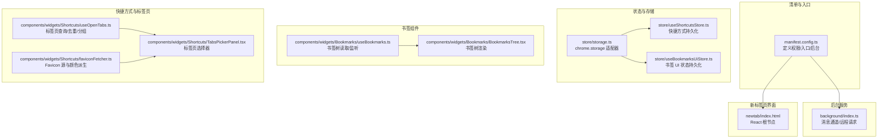
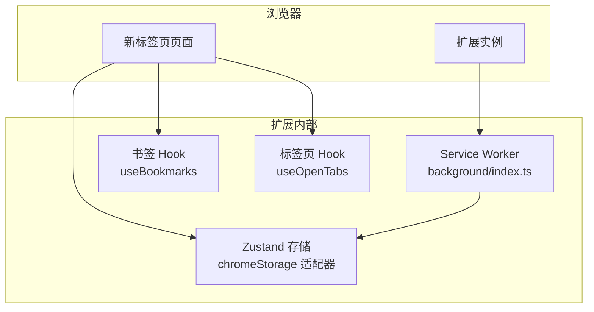
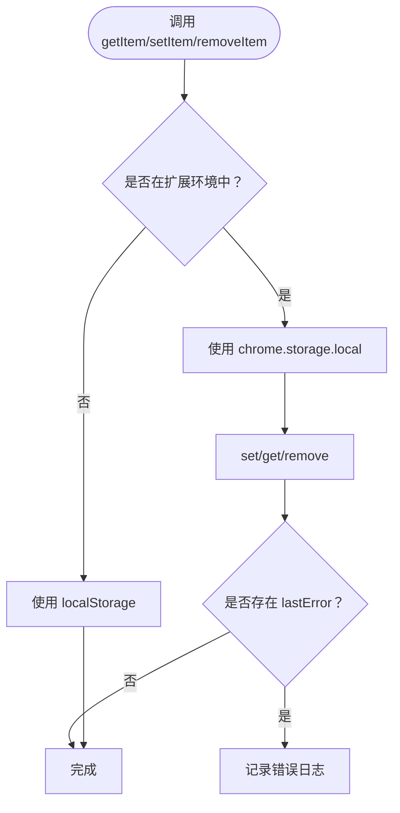
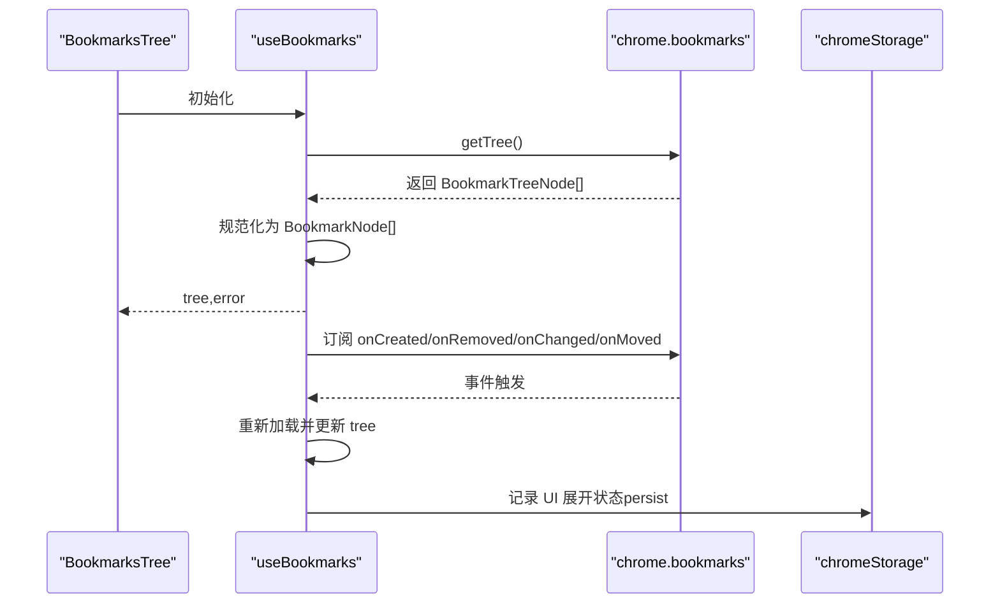
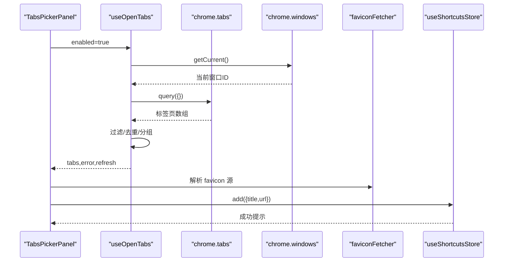
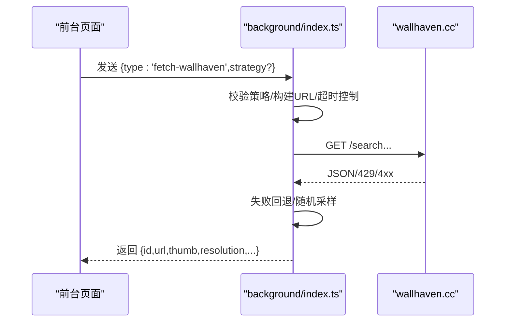
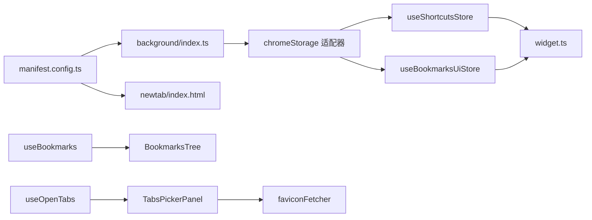

# Chrome 扩展 API

<cite>
**本文引用的文件**
- [manifest.config.ts](file://manifest.config.ts)
- [src/background/index.ts](file://src/background/index.ts)
- [src/store/storage.ts](file://src/store/storage.ts)
- [src/store/useShortcutsStore.ts](file://src/store/useShortcutsStore.ts)
- [src/store/useBookmarksUiStore.ts](file://src/store/useBookmarksUiStore.ts)
- [src/components/widgets/Bookmarks/useBookmarks.ts](file://src/components/widgets/Bookmarks/useBookmarks.ts)
- [src/components/widgets/Bookmarks/BookmarksTree.tsx](file://src/components/widgets/Bookmarks/BookmarksTree.tsx)
- [src/components/widgets/Shortcuts/useOpenTabs.ts](file://src/components/widgets/Shortcuts/useOpenTabs.ts)
- [src/components/widgets/Shortcuts/TabsPickerPanel.tsx](file://src/components/widgets/Shortcuts/TabsPickerPanel.tsx)
- [src/components/widgets/Shortcuts/faviconFetcher.ts](file://src/components/widgets/Shortcuts/faviconFetcher.ts)
- [src/types/widget.ts](file://src/types/widget.ts)
- [src/lib/logger.ts](file://src/lib/logger.ts)
- [README.md](file://README.md)
</cite>

## 目录

1. [简介](#简介)
2. [项目结构](#项目结构)
3. [核心组件](#核心组件)
4. [架构总览](#架构总览)
5. [详细组件分析](#详细组件分析)
6. [依赖关系分析](#依赖关系分析)
7. [性能考量](#性能考量)
8. [故障排查指南](#故障排查指南)
9. [结论](#结论)
10. [附录](#附录)

## 简介

本文件面向 Chrome 扩展开发者，系统性梳理本项目中对以下 API 的集成与使用：

- chrome.storage：本地存储、会话存储与同步存储的适配与跨页面同步
- chrome.bookmarks：书签树读取、变更监听与 UI 展示
- chrome.tabs：打开新标签页、标签页列表与选择器
- manifest.json（通过 Vite 插件生成）：权限声明、入口页覆盖与后台脚本配置
- 调试与最佳实践：日志控制、错误处理、性能优化与开发调试技巧

本项目采用 MV3 Service Worker 后台脚本与 React 新标签页界面，结合 Zustand 持久化存储与自定义 chrome.storage 适配器，实现跨页面状态同步与本地持久化。

## 项目结构

项目采用按功能模块组织的前端工程结构，重点模块如下：

- src/background：MV3 Service Worker 后台逻辑（消息通道、远程资源拉取）
- src/store：Zustand 状态管理与 chrome.storage 适配器
- src/components/widgets：各小部件（书签、快捷方式、时钟、搜索等）
- src/lib：通用工具（日志、主题、搜索、图标抓取等）
- manifest.config.ts：通过 defineManifest 定义扩展清单（权限、入口页、后台脚本）

图表来源

- [manifest.config.ts:1-38](file://manifest.config.ts#L1-L38)
- [src/background/index.ts:1-174](file://src/background/index.ts#L1-L174)
- [src/store/storage.ts:1-63](file://src/store/storage.ts#L1-L63)
- [src/store/useShortcutsStore.ts:1-54](file://src/store/useShortcutsStore.ts#L1-L54)
- [src/store/useBookmarksUiStore.ts:1-34](file://src/store/useBookmarksUiStore.ts#L1-L34)
- [src/components/widgets/Bookmarks/useBookmarks.ts:1-55](file://src/components/widgets/Bookmarks/useBookmarks.ts#L1-L55)
- [src/components/widgets/Bookmarks/BookmarksTree.tsx:1-88](file://src/components/widgets/Bookmarks/BookmarksTree.tsx#L1-L88)
- [src/components/widgets/Shortcuts/useOpenTabs.ts:1-176](file://src/components/widgets/Shortcuts/useOpenTabs.ts#L1-L176)
- [src/components/widgets/Shortcuts/TabsPickerPanel.tsx:1-288](file://src/components/widgets/Shortcuts/TabsPickerPanel.tsx#L1-L288)
- [src/components/widgets/Shortcuts/faviconFetcher.ts:1-42](file://src/components/widgets/Shortcuts/faviconFetcher.ts#L1-L42)

章节来源

- [README.md:54-68](file://README.md#L54-L68)
- [manifest.config.ts:1-38](file://manifest.config.ts#L1-L38)

## 核心组件

- chrome.storage 适配器：统一 localStorage 与 chrome.storage.local 的读写接口，并提供跨页面同步回调注册与监听
- 快捷方式存储：基于 Zustand + persist，使用 chrome.storage 适配器进行本地持久化
- 书签存储：基于 Zustand + persist，保存书签展开状态等 UI 状态
- 书签读取与监听：使用 chrome.bookmarks API 获取树形结构，订阅变更事件自动刷新
- 标签页查询与选择器：使用 chrome.tabs 查询当前窗口所有标签页，去重与分组展示，支持从选择器批量添加为快捷方式
- 后台消息通道：在 MV3 Service Worker 中处理远程请求（如随机壁纸），向前台返回结果

章节来源

- [src/store/storage.ts:1-63](file://src/store/storage.ts#L1-L63)
- [src/store/useShortcutsStore.ts:1-54](file://src/store/useShortcutsStore.ts#L1-L54)
- [src/store/useBookmarksUiStore.ts:1-34](file://src/store/useBookmarksUiStore.ts#L1-L34)
- [src/components/widgets/Bookmarks/useBookmarks.ts:1-55](file://src/components/widgets/Bookmarks/useBookmarks.ts#L1-L55)
- [src/components/widgets/Shortcuts/useOpenTabs.ts:1-176](file://src/components/widgets/Shortcuts/useOpenTabs.ts#L1-L176)
- [src/background/index.ts:123-173](file://src/background/index.ts#L123-L173)

## 架构总览

下图展示了扩展的运行时架构：清单声明权限与入口；后台 Service Worker 提供消息通道与远程能力；新标签页页面通过 hooks 与组件访问 Chrome API 并与状态存储交互。

图表来源

- [manifest.config.ts:9-21](file://manifest.config.ts#L9-L21)
- [src/background/index.ts:132-173](file://src/background/index.ts#L132-L173)
- [src/store/storage.ts:6-32](file://src/store/storage.ts#L6-L32)
- [src/components/widgets/Bookmarks/useBookmarks.ts:20-51](file://src/components/widgets/Bookmarks/useBookmarks.ts#L20-L51)
- [src/components/widgets/Shortcuts/useOpenTabs.ts:98-155](file://src/components/widgets/Shortcuts/useOpenTabs.ts#L98-L155)

## 详细组件分析

### chrome.storage 适配器与持久化

- 统一接口：在非扩展环境下回退到 localStorage，扩展环境下使用 chrome.storage.local
- 错误处理：写入/删除后检查 chrome.runtime.lastError 并记录日志
- 跨页面同步：注册键名对应的回调，监听 chrome.storage.onChanged，触发对应 store 的 rehydrate
- 注水控制：通过 Zustand persist 的 skipHydration 与 registerHydration 控制初始化时机

图表来源

- [src/store/storage.ts:6-32](file://src/store/storage.ts#L6-L32)
- [src/store/storage.ts:53-62](file://src/store/storage.ts#L53-L62)

章节来源

- [src/store/storage.ts:1-63](file://src/store/storage.ts#L1-L63)
- [src/store/useShortcutsStore.ts:23-50](file://src/store/useShortcutsStore.ts#L23-L50)
- [src/store/useBookmarksUiStore.ts:10-29](file://src/store/useBookmarksUiStore.ts#L10-L29)

### 书签集成（chrome.bookmarks）

- 数据模型：将 chrome.bookmarks.BookmarkTreeNode 规范化为 BookmarkNode（含 id/title/url/children）
- 加载与监听：首次加载后订阅 onCreated/onRemoved/onChanged/onMoved，自动刷新树
- 错误处理：捕获 chrome.runtime.lastError 并通过日志输出
- UI 展示：BookmarksTree 渲染目录与链接，支持展开/折叠与深度缩进

图表来源

- [src/components/widgets/Bookmarks/useBookmarks.ts:20-51](file://src/components/widgets/Bookmarks/useBookmarks.ts#L20-L51)
- [src/components/widgets/Bookmarks/BookmarksTree.tsx:56-87](file://src/components/widgets/Bookmarks/BookmarksTree.tsx#L56-L87)
- [src/store/useBookmarksUiStore.ts:10-33](file://src/store/useBookmarksUiStore.ts#L10-L33)

章节来源

- [src/components/widgets/Bookmarks/useBookmarks.ts:1-55](file://src/components/widgets/Bookmarks/useBookmarks.ts#L1-L55)
- [src/components/widgets/Bookmarks/BookmarksTree.tsx:1-88](file://src/components/widgets/Bookmarks/BookmarksTree.tsx#L1-L88)
- [src/store/useBookmarksUiStore.ts:1-34](file://src/store/useBookmarksUiStore.ts#L1-L34)

### 标签页与快捷方式（chrome.tabs）

- 标签页查询：使用 chrome.tabs.query 获取全部标签页，结合 chrome.windows.getCurrent 获取当前窗口 ID
- 过滤与去重：排除特定协议与无效条目，按规范化 URL 去重，优先保留标题更长且位于当前窗口的条目
- 分组与刷新：按 windowId 分组显示；仅在标题/URL/Favicon 或状态完成时触发防抖刷新
- 选择器：TabsPickerPanel 支持搜索、全选、批量添加为快捷方式；添加时仅保存 title/url，图标在渲染时动态解析
- Favicon 解析：优先使用 chrome://favicon2，其次 DuckDuckGo 与 Google，最后回退到首字母与派生色彩

图表来源

- [src/components/widgets/Shortcuts/TabsPickerPanel.tsx:21-110](file://src/components/widgets/Shortcuts/TabsPickerPanel.tsx#L21-L110)
- [src/components/widgets/Shortcuts/useOpenTabs.ts:98-155](file://src/components/widgets/Shortcuts/useOpenTabs.ts#L98-L155)
- [src/components/widgets/Shortcuts/faviconFetcher.ts:3-26](file://src/components/widgets/Shortcuts/faviconFetcher.ts#L3-L26)
- [src/store/useShortcutsStore.ts:23-50](file://src/store/useShortcutsStore.ts#L23-L50)

章节来源

- [src/components/widgets/Shortcuts/useOpenTabs.ts:1-176](file://src/components/widgets/Shortcuts/useOpenTabs.ts#L1-L176)
- [src/components/widgets/Shortcuts/TabsPickerPanel.tsx:1-288](file://src/components/widgets/Shortcuts/TabsPickerPanel.tsx#L1-L288)
- [src/components/widgets/Shortcuts/faviconFetcher.ts:1-42](file://src/components/widgets/Shortcuts/faviconFetcher.ts#L1-L42)
- [src/types/widget.ts:1-6](file://src/types/widget.ts#L1-L6)

### 后台消息通道（MV3 Service Worker）

- 单一职责：接收前台消息，执行远程请求（如随机壁纸），返回结构化响应
- 请求策略：按 topRange 顺序尝试，若空结果则回退到更宽的时间范围
- 超时与限流：AbortController 控制超时，429 映射为友好错误
- 消息保持：异步响应需返回 true 以保持消息通道

图表来源

- [src/background/index.ts:123-173](file://src/background/index.ts#L123-L173)

章节来源

- [src/background/index.ts:1-174](file://src/background/index.ts#L1-L174)

## 依赖关系分析

- 权限与入口：manifest.config.ts 声明 storage、bookmarks、unlimitedStorage、tabs、geolocation 等权限，并将新标签页覆盖至 src/newtab/index.html
- 后台脚本：MV3 类型为 module 的 service_worker，路径指向 src/background/index.ts
- 组件与 Hook：书签与标签页组件依赖对应 hooks；hooks 依赖 chrome.\* API；存储层依赖 chromeStorage 适配器
- 类型与常量：widget.ts 定义快捷方式类型与小部件标识，被多个组件与存储使用

图表来源

- [manifest.config.ts:1-38](file://manifest.config.ts#L1-L38)
- [src/store/storage.ts:1-63](file://src/store/storage.ts#L1-L63)
- [src/store/useShortcutsStore.ts:1-54](file://src/store/useShortcutsStore.ts#L1-L54)
- [src/store/useBookmarksUiStore.ts:1-34](file://src/store/useBookmarksUiStore.ts#L1-L34)
- [src/components/widgets/Bookmarks/useBookmarks.ts:1-55](file://src/components/widgets/Bookmarks/useBookmarks.ts#L1-L55)
- [src/components/widgets/Bookmarks/BookmarksTree.tsx:1-88](file://src/components/widgets/Bookmarks/BookmarksTree.tsx#L1-L88)
- [src/components/widgets/Shortcuts/useOpenTabs.ts:1-176](file://src/components/widgets/Shortcuts/useOpenTabs.ts#L1-L176)
- [src/components/widgets/Shortcuts/TabsPickerPanel.tsx:1-288](file://src/components/widgets/Shortcuts/TabsPickerPanel.tsx#L1-L288)
- [src/components/widgets/Shortcuts/faviconFetcher.ts:1-42](file://src/components/widgets/Shortcuts/faviconFetcher.ts#L1-L42)
- [src/types/widget.ts:1-34](file://src/types/widget.ts#L1-L34)

章节来源

- [manifest.config.ts:1-38](file://manifest.config.ts#L1-L38)
- [src/types/widget.ts:1-34](file://src/types/widget.ts#L1-L34)

## 性能考量

- 标签页刷新防抖：useOpenTabs 对高频变更事件进行 150ms 防抖，减少不必要的重渲染与查询
- 去重与分组：按规范化 URL 去重，避免重复渲染；按窗口分组提升可读性
- Favicon 回退链：优先使用浏览器内置 favicon，其次第三方服务，最后回退到首字母与派生色彩，降低失败率
- 存储同步：chrome.storage.onChanged 仅针对 local 区域，避免无关变更导致的重渲染
- 远程请求超时与回退：后台消息通道设置超时与回退策略，避免长时间阻塞

章节来源

- [src/components/widgets/Shortcuts/useOpenTabs.ts:96-155](file://src/components/widgets/Shortcuts/useOpenTabs.ts#L96-L155)
- [src/components/widgets/Shortcuts/faviconFetcher.ts:13-26](file://src/components/widgets/Shortcuts/faviconFetcher.ts#L13-L26)
- [src/store/storage.ts:53-62](file://src/store/storage.ts#L53-L62)
- [src/background/index.ts:141-111](file://src/background/index.ts#L141-L111)

## 故障排查指南

- 书签加载失败：检查 chrome.runtime.lastError 并通过日志输出；确认 manifest 权限包含 bookmarks
- 标签页读取失败：检查 chrome.runtime.lastError；确认 tabs 权限与用户授权
- 存储写入失败：检查 chrome.runtime.lastError；确认 storage/unlimitedStorage 权限
- 日志级别控制：通过 logger 工具调整最小日志级别，便于开发调试
- 开发模式验证：新标签页无书签数据属正常（开发环境），可在扩展页面手动添加测试书签

章节来源

- [src/components/widgets/Bookmarks/useBookmarks.ts:28-38](file://src/components/widgets/Bookmarks/useBookmarks.ts#L28-L38)
- [src/components/widgets/Shortcuts/useOpenTabs.ts:106-114](file://src/components/widgets/Shortcuts/useOpenTabs.ts#L106-L114)
- [src/store/storage.ts:18-30](file://src/store/storage.ts#L18-L30)
- [src/lib/logger.ts:14-34](file://src/lib/logger.ts#L14-L34)
- [README.md:67-72](file://README.md#L67-L72)

## 结论

本项目通过清晰的模块划分与统一的 chrome.storage 适配器，实现了：

- 本地持久化与跨页面同步
- 书签树的读取、监听与 UI 展示
- 标签页查询、去重、分组与快捷方式批量导入
- MV3 Service Worker 的消息通道与远程能力
  配合完善的错误处理与性能优化策略，为 Chrome 扩展开发提供了良好的参考范式。

## 附录

### manifest.json 关键配置说明

- manifest_version: 3
- chrome_url_overrides.newtab: 指定新标签页入口 HTML
- background.service_worker: 指定 MV3 Service Worker 入口
- permissions: storage、bookmarks、unlimitedStorage、tabs、geolocation
- host_permissions: 搜索建议与天气、壁纸等外部资源域名白名单

章节来源

- [manifest.config.ts:4-37](file://manifest.config.ts#L4-L37)

### API 调用示例与最佳实践

- chrome.storage.local
  - 读取：getItem(name) -> string|null
  - 写入：setItem(name, value) -> Promise<void>
  - 删除：removeItem(name) -> Promise<void>
  - 监听：chrome.storage.onChanged.addListener(handler)
- chrome.bookmarks
  - 读取树：getTree(callback) -> void
  - 监听：onCreated/onRemoved/onChanged/onMoved.addListener(handler)
- chrome.tabs
  - 查询：query(queryInfo, callback) -> void
  - 当前窗口：getCurrent(callback) -> void
- MV3 Service Worker 消息
  - runtime.onMessage.addListener(handler)
  - handler 返回 true 以保持通道开放

章节来源

- [src/store/storage.ts:6-32](file://src/store/storage.ts#L6-L32)
- [src/components/widgets/Bookmarks/useBookmarks.ts:27-49](file://src/components/widgets/Bookmarks/useBookmarks.ts#L27-L49)
- [src/components/widgets/Shortcuts/useOpenTabs.ts:104-114](file://src/components/widgets/Shortcuts/useOpenTabs.ts#L104-L114)
- [src/background/index.ts:132-173](file://src/background/index.ts#L132-L173)

### 调试技巧

- 使用浏览器扩展页面查看后台脚本日志与网络请求
- 通过 logger.setLoggerMinLevel 将日志级别降至 debug，便于定位问题
- 在新标签页中临时添加测试书签与标签页，验证读取与去重逻辑
- 对高频事件（如 tabs.onUpdated）使用防抖策略，避免过度刷新

章节来源

- [src/lib/logger.ts:32-34](file://src/lib/logger.ts#L32-L34)
- [README.md:41-52](file://README.md#L41-L52)
