# 书签 API

<cite>
**本文档引用的文件**
- [BookmarksTree.tsx](file://src/components/widgets/Bookmarks/BookmarksTree.tsx)
- [useBookmarks.ts](file://src/components/widgets/Bookmarks/useBookmarks.ts)
- [useBookmarksUiStore.ts](file://src/store/useBookmarksUiStore.ts)
- [manifest.config.ts](file://manifest.config.ts)
- [storage.ts](file://src/store/storage.ts)
- [logger.ts](file://src/lib/logger.ts)
- [DashboardGrid.tsx](file://src/components/layout/DashboardGrid.tsx)
- [App.tsx](file://src/newtab/App.tsx)
</cite>

## 目录

1. [简介](#简介)
2. [项目结构](#项目结构)
3. [核心组件](#核心组件)
4. [架构概览](#架构概览)
5. [详细组件分析](#详细组件分析)
6. [依赖关系分析](#依赖关系分析)
7. [性能考虑](#性能考虑)
8. [故障排除指南](#故障排除指南)
9. [结论](#结论)

## 简介

本项目实现了 Chrome 书签 API 的完整集成，为用户提供了直观的书签树形浏览体验。该功能通过 React Hooks 和 Chrome 扩展 API 实现，支持动态书签树渲染、节点展开/折叠、实时书签变更监听以及本地状态持久化。

主要特性包括：

- 完整的 Chrome 书签 API 集成
- 响应式树形结构渲染
- 实时书签变更同步
- 本地状态持久化存储
- 错误处理和边界情况管理

## 项目结构

书签功能在项目中的组织结构如下：

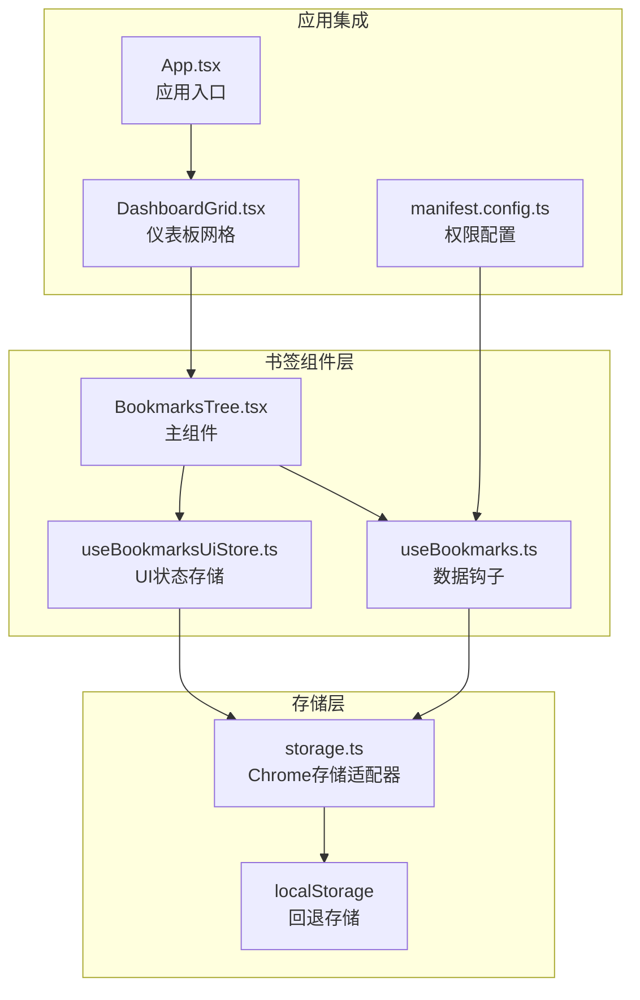

**图表来源**

- [BookmarksTree.tsx:1-110](file://src/components/widgets/Bookmarks/BookmarksTree.tsx#L1-L110)
- [useBookmarks.ts:1-55](file://src/components/widgets/Bookmarks/useBookmarks.ts#L1-L55)
- [useBookmarksUiStore.ts:1-34](file://src/store/useBookmarksUiStore.ts#L1-L34)

**章节来源**

- [BookmarksTree.tsx:1-110](file://src/components/widgets/Bookmarks/BookmarksTree.tsx#L1-L110)
- [useBookmarks.ts:1-55](file://src/components/widgets/Bookmarks/useBookmarks.ts#L1-L55)
- [useBookmarksUiStore.ts:1-34](file://src/store/useBookmarksUiStore.ts#L1-L34)

## 核心组件

### 数据模型定义

书签数据采用统一的接口定义，确保类型安全和一致性：

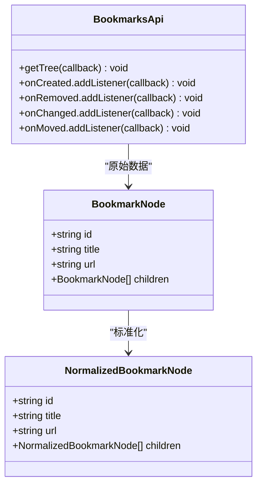

**图表来源**

- [useBookmarks.ts:4-18](file://src/components/widgets/Bookmarks/useBookmarks.ts#L4-L18)

### 组件层次结构

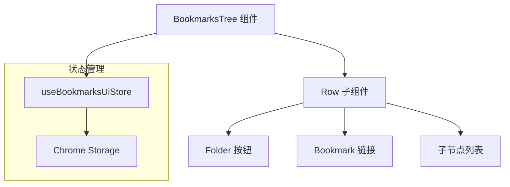

**图表来源**

- [BookmarksTree.tsx:7-54](file://src/components/widgets/Bookmarks/BookmarksTree.tsx#L7-L54)
- [useBookmarksUiStore.ts:10-30](file://src/store/useBookmarksUiStore.ts#L10-L30)

**章节来源**

- [useBookmarks.ts:4-18](file://src/components/widgets/Bookmarks/useBookmarks.ts#L4-L18)
- [BookmarksTree.tsx:7-54](file://src/components/widgets/Bookmarks/BookmarksTree.tsx#L7-L54)

## 架构概览

书签系统的整体架构采用分层设计，确保关注点分离和可维护性：

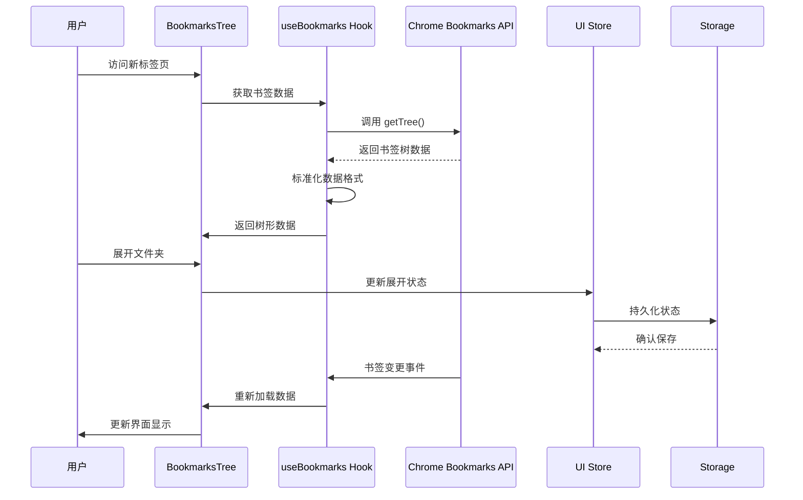

**图表来源**

- [useBookmarks.ts:24-51](file://src/components/widgets/Bookmarks/useBookmarks.ts#L24-L51)
- [BookmarksTree.tsx:56-109](file://src/components/widgets/Bookmarks/BookmarksTree.tsx#L56-L109)

## 详细组件分析

### BookmarksTree 主组件

BookmarksTree 是书签功能的主容器组件，负责整体布局和错误处理：

#### 渲染流程

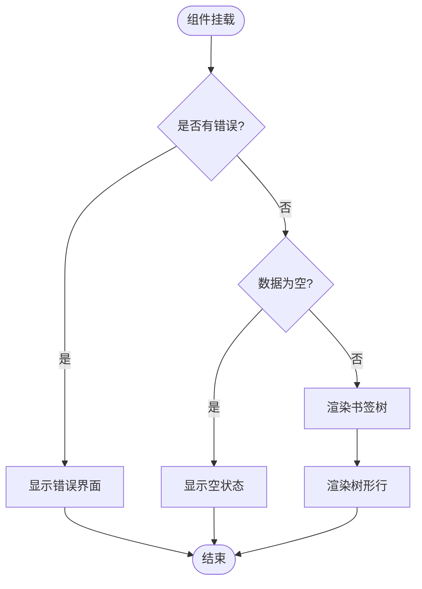

**图表来源**

- [BookmarksTree.tsx:56-109](file://src/components/widgets/Bookmarks/BookmarksTree.tsx#L56-L109)

#### 错误处理机制

组件实现了多层次的错误处理：

1. **API 调用错误**：捕获 Chrome 运行时错误
2. **权限错误**：检测书签访问权限
3. **空数据处理**：优雅处理无书签数据的情况

**章节来源**

- [BookmarksTree.tsx:56-109](file://src/components/widgets/Bookmarks/BookmarksTree.tsx#L56-L109)

### useBookmarks 数据钩子

useBookmarks 是核心的数据获取和管理钩子，负责与 Chrome 书签 API 的交互：

#### 数据获取流程

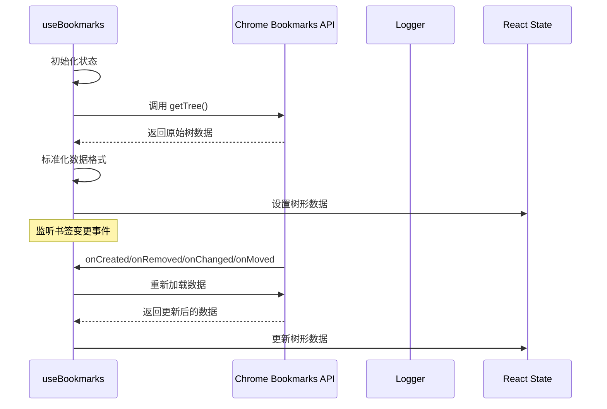

**图表来源**

- [useBookmarks.ts:24-51](file://src/components/widgets/Bookmarks/useBookmarks.ts#L24-L51)

#### 数据标准化过程

钩子实现了从 Chrome API 原始数据到内部统一格式的转换：

**章节来源**

- [useBookmarks.ts:11-18](file://src/components/widgets/Bookmarks/useBookmarks.ts#L11-L18)
- [useBookmarks.ts:24-51](file://src/components/widgets/Bookmarks/useBookmarks.ts#L24-L51)

### UI 状态管理

useBookmarksUiStore 使用 Zustand 实现轻量级状态管理，专门处理书签 UI 的交互状态：

#### 状态持久化策略

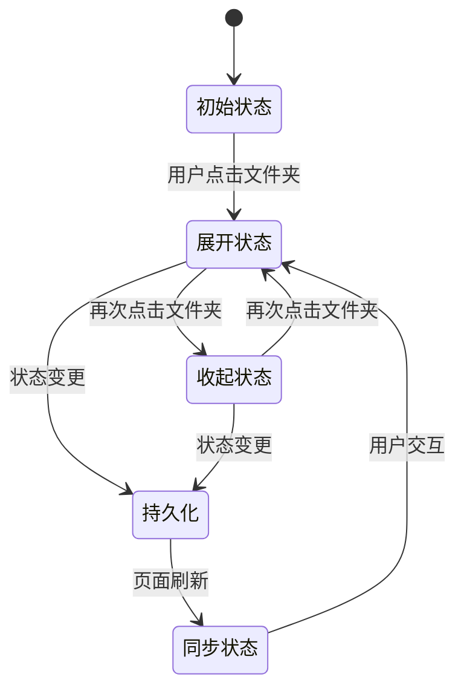

**图表来源**

- [useBookmarksUiStore.ts:10-30](file://src/store/useBookmarksUiStore.ts#L10-L30)

**章节来源**

- [useBookmarksUiStore.ts:10-30](file://src/store/useBookmarksUiStore.ts#L10-L30)

### 应用集成

书签组件作为独立的小部件集成到仪表板系统中：

#### 组件注册

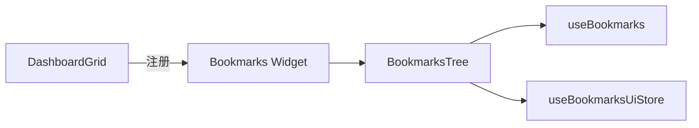

**图表来源**

- [DashboardGrid.tsx:24-31](file://src/components/layout/DashboardGrid.tsx#L24-L31)

**章节来源**

- [DashboardGrid.tsx:24-31](file://src/components/layout/DashboardGrid.tsx#L24-L31)

## 依赖关系分析

书签功能的依赖关系清晰明确，遵循单一职责原则：

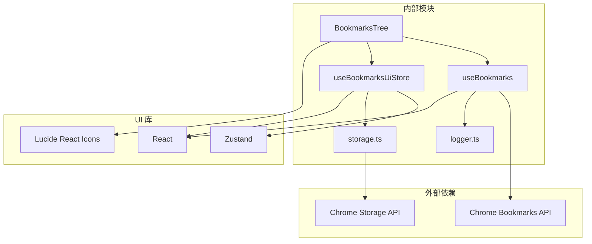

**图表来源**

- [BookmarksTree.tsx:1-6](file://src/components/widgets/Bookmarks/BookmarksTree.tsx#L1-L6)
- [useBookmarks.ts:1-3](file://src/components/widgets/Bookmarks/useBookmarks.ts#L1-L3)
- [useBookmarksUiStore.ts:1-4](file://src/store/useBookmarksUiStore.ts#L1-L4)

### 关键依赖说明

| 依赖项               | 用途                   | 版本要求   | 备注                  |
| -------------------- | ---------------------- | ---------- | --------------------- |
| Chrome Bookmarks API | 书签数据获取和事件监听 | Chrome 89+ | 必需权限              |
| Chrome Storage API   | 本地状态持久化         | Chrome 89+ | 可回退到 localStorage |
| React                | UI 渲染框架            | 18.2+      | 使用函数组件和 Hooks  |
| Zustand              | 状态管理               | 4.3+       | 轻量级替代 Redux      |
| Lucide React         | 图标库                 | 0.330+     | 用于文件夹和书签图标  |

**章节来源**

- [manifest.config.ts:21](file://manifest.config.ts#L21)
- [storage.ts:4](file://src/store/storage.ts#L4)

## 性能考虑

### 缓存策略

书签数据采用多层缓存机制以提升性能：

1. **内存缓存**：React 组件状态缓存当前书签树
2. **本地持久化**：Zustand 持久化存储 UI 展开状态
3. **自动刷新**：Chrome 书签事件触发的增量更新

### 优化技术

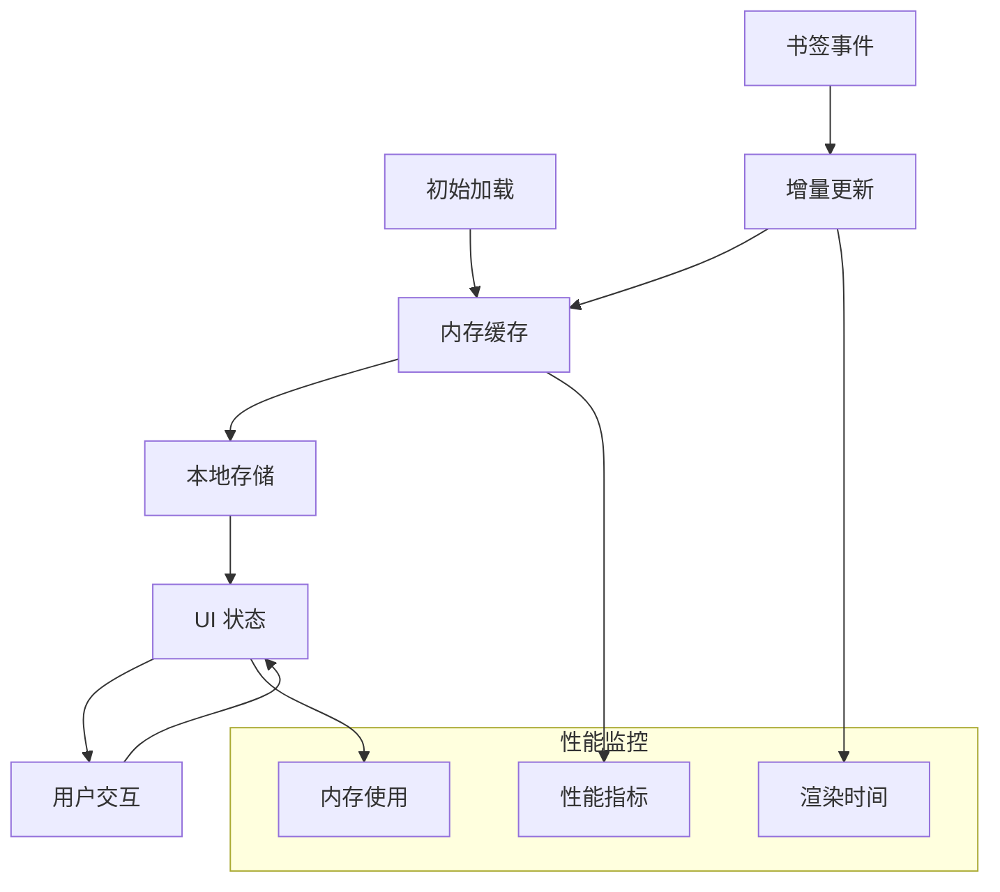

**图表来源**

- [useBookmarks.ts:43-50](file://src/components/widgets/Bookmarks/useBookmarks.ts#L43-L50)
- [useBookmarksUiStore.ts:10-30](file://src/store/useBookmarksUiStore.ts#L10-L30)

### 最佳实践

1. **懒加载**：使用 React.lazy 延迟加载重型依赖
2. **记忆化**：使用 memo 优化子组件渲染
3. **事件去抖**：避免频繁的书签 API 调用
4. **错误边界**：使用 ErrorBoundary 防止单个组件崩溃影响整个应用

**章节来源**

- [BookmarksTree.tsx:7](file://src/components/widgets/Bookmarks/BookmarksTree.tsx#L7)
- [DashboardGrid.tsx:20-22](file://src/components/layout/DashboardGrid.tsx#L20-L22)

## 故障排除指南

### 常见问题及解决方案

#### 权限问题

**症状**：书签加载失败，显示权限错误提示

**原因分析**：

- 未授予 `bookmarks` 权限
- Chrome 扩展权限被用户拒绝

**解决步骤**：

1. 检查 manifest 文件中的权限声明
2. 在 Chrome 扩展页面确认权限状态
3. 重新安装或重新授权扩展

#### 数据加载失败

**症状**：书签树显示为空或报错

**排查方法**：

1. 检查 Chrome 运行时错误日志
2. 验证书签 API 可用性
3. 确认网络连接正常

#### UI 状态不同步

**症状**：书签展开状态在页面刷新后丢失

**解决方案**：

1. 检查 Chrome Storage API 可用性
2. 验证持久化存储配置
3. 确认跨页面同步机制

### 调试工具

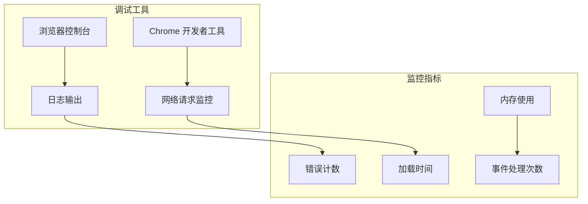

**图表来源**

- [logger.ts:20-35](file://src/lib/logger.ts#L20-L35)

**章节来源**

- [logger.ts:20-35](file://src/lib/logger.ts#L20-L35)
- [useBookmarks.ts:29-33](file://src/components/widgets/Bookmarks/useBookmarks.ts#L29-L33)

## 结论

本项目的书签 API 集成展现了现代 Chrome 扩展开发的最佳实践：

### 技术优势

1. **架构清晰**：分层设计确保代码可维护性和可测试性
2. **性能优化**：多层缓存和增量更新机制
3. **用户体验**：响应式设计和流畅的交互体验
4. **错误处理**：完善的错误捕获和用户友好的提示

### 功能完整性

- ✅ 完整的 Chrome 书签 API 集成
- ✅ 实时书签变更监听
- ✅ 本地状态持久化
- ✅ 错误处理和边界情况管理
- ✅ 性能优化和缓存策略

### 改进建议

1. **搜索功能**：可以添加书签搜索和过滤功能
2. **排序选项**：支持按名称、时间等多维度排序
3. **批量操作**：支持书签的批量选择和操作
4. **键盘导航**：增强键盘快捷键支持

该实现为 Chrome 扩展开发提供了优秀的参考模板，展示了如何在受限的扩展环境中实现复杂的功能需求。
