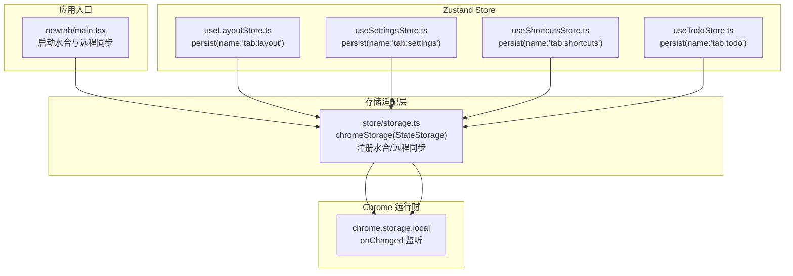
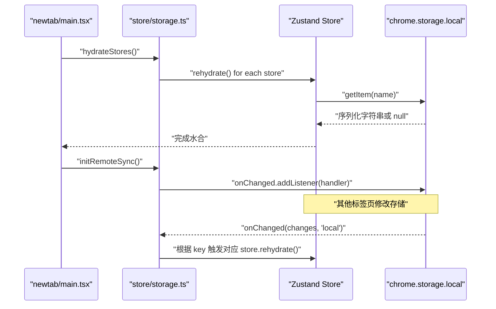
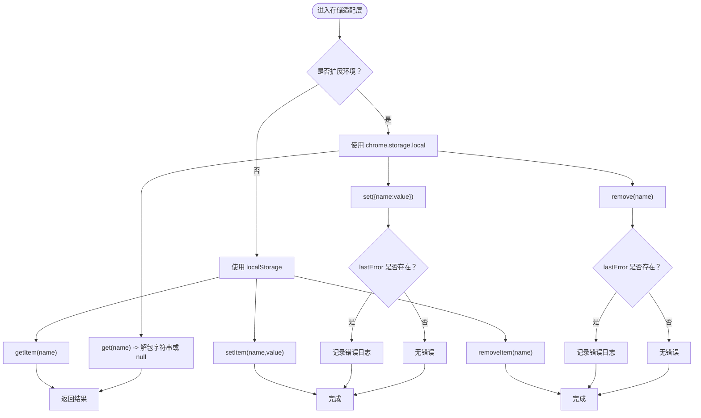
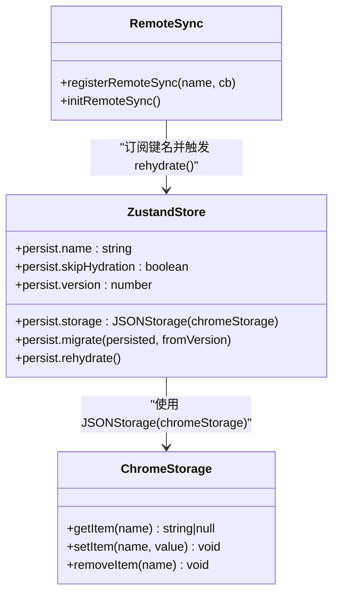
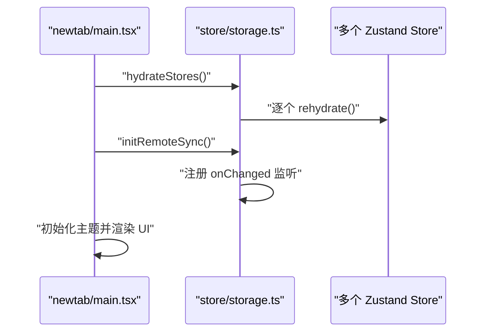
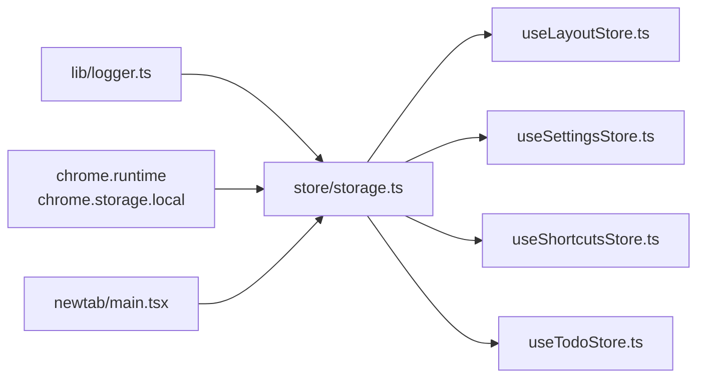

# 存储 API

<cite>
**本文引用的文件**
- [src/store/storage.ts](file://src/store/storage.ts)
- [src/store/useLayoutStore.ts](file://src/store/useLayoutStore.ts)
- [src/store/useSettingsStore.ts](file://src/store/useSettingsStore.ts)
- [src/store/useShortcutsStore.ts](file://src/store/useShortcutsStore.ts)
- [src/store/useTodoStore.ts](file://src/store/useTodoStore.ts)
- [src/newtab/main.tsx](file://src/newtab/main.tsx)
- [src/background/index.ts](file://src/background/index.ts)
- [src/lib/logger.ts](file://src/lib/logger.ts)
- [package.json](file://package.json)
</cite>

## 目录

1. [简介](#简介)
2. [项目结构](#项目结构)
3. [核心组件](#核心组件)
4. [架构总览](#架构总览)
5. [详细组件分析](#详细组件分析)
6. [依赖关系分析](#依赖关系分析)
7. [性能考量](#性能考量)
8. [故障排查指南](#故障排查指南)
9. [结论](#结论)
10. [附录](#附录)

## 简介

本文件系统性梳理 Chrome 扩展中基于 chrome.storage.local 的存储方案，重点覆盖以下方面：

- chrome.storage.local 的异步读写与错误处理
- Zustand 持久化中间件与自定义 StateStorage 的集成
- 跨标签页状态同步与远程变更监听
- 存储键命名规范、数据序列化与版本迁移
- 性能优化、调试技巧、容量限制与备份恢复策略

## 项目结构

与存储相关的关键模块如下：

- 存储适配层：提供统一的 StateStorage 接口，兼容扩展环境与开发环境（回退到 localStorage）
- Zustand Store：布局、设置、快捷方式、待办等多份独立持久化状态
- 应用入口：在新标签页页面启动时完成水合与远程同步初始化
- 后台脚本：与存储无直接耦合，但为扩展功能提供消息通道

图表来源

- [src/newtab/main.tsx:11-26](file://src/newtab/main.tsx#L11-L26)
- [src/store/storage.ts:6-32](file://src/store/storage.ts#L6-L32)
- [src/store/useLayoutStore.ts:32-54](file://src/store/useLayoutStore.ts#L32-L54)
- [src/store/useSettingsStore.ts:35-84](file://src/store/useSettingsStore.ts#L35-L84)
- [src/store/useShortcutsStore.ts:23-50](file://src/store/useShortcutsStore.ts#L23-L50)
- [src/store/useTodoStore.ts:20-55](file://src/store/useTodoStore.ts#L20-L55)

章节来源

- [src/newtab/main.tsx:1-29](file://src/newtab/main.tsx#L1-L29)
- [src/store/storage.ts:1-63](file://src/store/storage.ts#L1-L63)

## 核心组件

- chromeStorage(StateStorage)：封装 getItem/setItem/removeItem，自动区分扩展环境与开发环境；在扩展环境中记录 chrome.runtime.lastError 并通过日志工具输出
- 注册水合/远程同步：集中管理各 Store 的 rehydrate 回调，并按存储键名订阅 chrome.storage.local 的 onChanged 事件
- 各 Store 的 persist 配置：指定存储键名、JSON 序列化存储器、跳过初始水合、版本号与迁移逻辑

章节来源

- [src/store/storage.ts:6-32](file://src/store/storage.ts#L6-L32)
- [src/store/storage.ts:34-62](file://src/store/storage.ts#L34-L62)
- [src/store/useLayoutStore.ts:32-54](file://src/store/useLayoutStore.ts#L32-L54)
- [src/store/useSettingsStore.ts:35-84](file://src/store/useSettingsStore.ts#L35-L84)
- [src/store/useShortcutsStore.ts:23-50](file://src/store/useShortcutsStore.ts#L23-L50)
- [src/store/useTodoStore.ts:20-55](file://src/store/useTodoStore.ts#L20-L55)

## 架构总览

下图展示从应用启动到状态持久化的完整流程，以及跨标签页同步路径。

图表来源

- [src/newtab/main.tsx:11-26](file://src/newtab/main.tsx#L11-L26)
- [src/store/storage.ts:41-62](file://src/store/storage.ts#L41-L62)
- [src/store/useLayoutStore.ts:56-58](file://src/store/useLayoutStore.ts#L56-L58)
- [src/store/useSettingsStore.ts:87-89](file://src/store/useSettingsStore.ts#L87-L89)
- [src/store/useShortcutsStore.ts:52-54](file://src/store/useShortcutsStore.ts#L52-L54)
- [src/store/useTodoStore.ts:57-59](file://src/store/useTodoStore.ts#L57-L59)

## 详细组件分析

### 存储适配层（chromeStorage 与同步机制）

- 异步读写：getItem 使用 chrome.storage.local.get(name)，返回值解包后作为字符串；setItem/removeItem 均为异步
- 错误处理：在扩展环境下，若 chrome.runtime.lastError 存在，则通过日志工具输出错误信息
- 环境降级：当非扩展环境（如开发）时，自动回退到 localStorage
- 水合注册：通过 registerHydration 将各 Store 的 rehydrate 回调收集，统一执行
- 远程同步：通过 registerRemoteSync 以存储键名为映射注册回调；initRemoteSync 在扩展环境中监听 chrome.storage.onChanged，匹配键名后触发对应回调

图表来源

- [src/store/storage.ts:6-32](file://src/store/storage.ts#L6-L32)
- [src/lib/logger.ts:20-35](file://src/lib/logger.ts#L20-L35)

章节来源

- [src/store/storage.ts:1-63](file://src/store/storage.ts#L1-L63)
- [src/lib/logger.ts:1-35](file://src/lib/logger.ts#L1-L35)

### Zustand Store 与 chromeStorage 的集成

- 统一存储器：各 Store 使用 createJSONStorage(() => chromeStorage) 将 JSON 序列化后的字符串存入存储
- 键命名规范：每个 Store 通过 persist.name 指定唯一键名，如 'tab:layout'、'tab:settings'、'tab:shortcuts'、'tab:todo'
- 初始水合：skipHydration: true，避免 SSR 或首屏渲染时提前访问存储；在应用启动后统一调用 hydrateStores()
- 版本与迁移：各 Store 定义 version 与 migrate，用于未来数据结构演进时的平滑迁移
- 跨标签页同步：通过 registerRemoteSync(name, () => store.persist.rehydrate()) 订阅对应键名的远程变更

图表来源

- [src/store/useLayoutStore.ts:32-54](file://src/store/useLayoutStore.ts#L32-L54)
- [src/store/useSettingsStore.ts:35-84](file://src/store/useSettingsStore.ts#L35-L84)
- [src/store/useShortcutsStore.ts:23-50](file://src/store/useShortcutsStore.ts#L23-L50)
- [src/store/useTodoStore.ts:20-55](file://src/store/useTodoStore.ts#L20-L55)
- [src/store/storage.ts:49-62](file://src/store/storage.ts#L49-L62)

章节来源

- [src/store/useLayoutStore.ts:1-58](file://src/store/useLayoutStore.ts#L1-L58)
- [src/store/useSettingsStore.ts:1-89](file://src/store/useSettingsStore.ts#L1-L89)
- [src/store/useShortcutsStore.ts:1-54](file://src/store/useShortcutsStore.ts#L1-L54)
- [src/store/useTodoStore.ts:1-59](file://src/store/useTodoStore.ts#L1-L59)

### 应用启动与初始化流程

- 在 newtab/main.tsx 中，先执行 hydrateStores() 完成所有 Store 的水合，再初始化远程同步 initRemoteSync()
- 初始化完成后，再进行主题初始化与 UI 渲染

图表来源

- [src/newtab/main.tsx:11-26](file://src/newtab/main.tsx#L11-L26)
- [src/store/storage.ts:41-62](file://src/store/storage.ts#L41-L62)

章节来源

- [src/newtab/main.tsx:1-29](file://src/newtab/main.tsx#L1-L29)

### 数据迁移与版本控制

- 设置 Store 的 migrate 包含版本演进逻辑：v1→v2 新增壁纸遮罩参数；v2→v3 引入壁纸明暗标记；v3→v4 将二值标记替换为连续亮度值
- 其他 Store 当前 migrate 返回原数据，便于后续扩展

章节来源

- [src/store/useSettingsStore.ts:62-82](file://src/store/useSettingsStore.ts#L62-L82)

## 依赖关系分析

- 存储适配层依赖：
  - 日志工具：用于输出错误信息
  - 浏览器运行时 API：chrome.storage.local 与 chrome.runtime.lastError
- Store 依赖：
  - Zustand 持久化中间件：createJSONStorage、persist
  - 自定义存储器：chromeStorage
- 应用入口依赖：
  - 存储初始化函数：hydrateStores、initRemoteSync

图表来源

- [src/lib/logger.ts:20-35](file://src/lib/logger.ts#L20-L35)
- [src/store/storage.ts:1-63](file://src/store/storage.ts#L1-L63)
- [src/store/useLayoutStore.ts:1-58](file://src/store/useLayoutStore.ts#L1-L58)
- [src/store/useSettingsStore.ts:1-89](file://src/store/useSettingsStore.ts#L1-L89)
- [src/store/useShortcutsStore.ts:1-54](file://src/store/useShortcutsStore.ts#L1-L54)
- [src/store/useTodoStore.ts:1-59](file://src/store/useTodoStore.ts#L1-L59)
- [src/newtab/main.tsx:1-29](file://src/newtab/main.tsx#L1-L29)

章节来源

- [src/store/storage.ts:1-63](file://src/store/storage.ts#L1-L63)
- [src/lib/logger.ts:1-35](file://src/lib/logger.ts#L1-L35)
- [src/newtab/main.tsx:1-29](file://src/newtab/main.tsx#L1-L29)

## 性能考量

- 异步 I/O：chrome.storage.local 为异步接口，避免阻塞主线程；在应用启动阶段集中执行水合，减少多次 I/O
- 批量水合：通过集中调用 hydrateStores() 并行触发各 Store 的 rehydrate，提升启动效率
- 变更监听：仅监听 'local' 区域的变更，过滤无关键，降低回调触发频率
- 序列化开销：JSON 序列化/反序列化成本较低，但应避免存储超大对象；必要时拆分键或压缩数据
- 版本迁移：仅在版本升级时执行迁移逻辑，避免每次启动都进行昂贵计算

## 故障排查指南

- 扩展环境错误检测
  - 在 setItem/removeItem 后检查 chrome.runtime.lastError，若存在则通过日志工具输出错误信息
  - 确认 chrome.storage.onChanged 可用且只监听 'local' 区域
- 开发环境回退
  - 若非扩展环境，自动回退到 localStorage；确保开发与生产行为一致
- 调试技巧
  - 使用浏览器开发者工具的“扩展”面板查看存储键值变化
  - 在 onChange 回调中加入日志，确认跨标签页同步是否生效
  - 对关键写入点增加 try/catch 并记录上下文，定位异常原因
- 常见问题
  - 存储键冲突：确保每个 Store 的 persist.name 唯一
  - 数据不一致：确认所有标签页均注册了相同的远程同步回调
  - 迁移失败：检查 migrate 函数的边界条件与默认值设置

章节来源

- [src/store/storage.ts:12-31](file://src/store/storage.ts#L12-L31)
- [src/store/storage.ts:53-62](file://src/store/storage.ts#L53-L62)
- [src/lib/logger.ts:20-35](file://src/lib/logger.ts#L20-L35)

## 结论

该实现以最小侵入的方式将 chrome.storage.local 与 Zustand 持久化中间件结合，提供了：

- 明确的异步读写与错误处理
- 跨标签页状态同步能力
- 清晰的键命名与版本迁移策略
- 可扩展的性能与调试机制

建议在后续迭代中：

- 为大型数据引入分片存储或外部缓存
- 增加存储容量监控与告警
- 补充备份/恢复 API 与导出导入功能

## 附录

### 存储键命名规范

- 建议格式：'命名空间:实体标识符'
- 示例：'tab:layout'、'tab:settings'、'tab:shortcuts'、'tab:todo'
- 原则：唯一性、可读性、可维护性

章节来源

- [src/store/useLayoutStore.ts:47](file://src/store/useLayoutStore.ts#L47)
- [src/store/useSettingsStore.ts:58](file://src/store/useSettingsStore.ts#L58)
- [src/store/useShortcutsStore.ts:43](file://src/store/useShortcutsStore.ts#L43)
- [src/store/useTodoStore.ts:48](file://src/store/useTodoStore.ts#L48)

### 数据序列化与版本迁移

- 序列化：使用 JSON.stringify/parse，由 createJSONStorage 自动处理
- 版本：每个 Store 维护 version 字段
- 迁移：通过 migrate(persisted, fromVersion) 处理字段演进与默认值填充

章节来源

- [src/store/useSettingsStore.ts:62-82](file://src/store/useSettingsStore.ts#L62-L82)

### 调用示例（步骤说明）

- 初始化
  - 在应用启动时调用 hydrateStores() 完成水合
  - 调用 initRemoteSync() 启用跨标签页同步
- 写入/删除
  - 通过对应 Store 的 action 修改状态，底层自动调用 chrome.storage.local.set/remove
- 监听远程变更
  - 在注册时传入的回调会自动在其他标签页修改存储后被触发

章节来源

- [src/newtab/main.tsx:11-26](file://src/newtab/main.tsx#L11-L26)
- [src/store/storage.ts:41-62](file://src/store/storage.ts#L41-L62)

### 存储容量限制与备份恢复策略

- 容量限制
  - chrome.storage.local 单键大小限制约 8KB，总容量限制约 5-10MB（不同浏览器可能差异）
- 备份/恢复
  - 建议在后台脚本或专用页面提供导出/导入功能，将所有键值序列化为 JSON 文件
  - 导入时按键名逐一写入，注意分批处理以避免超时
- 数据迁移
  - 通过 persist.version 与 migrate 逐步演进数据结构，保持向后兼容

章节来源

- [src/background/index.ts:1-174](file://src/background/index.ts#L1-L174)
