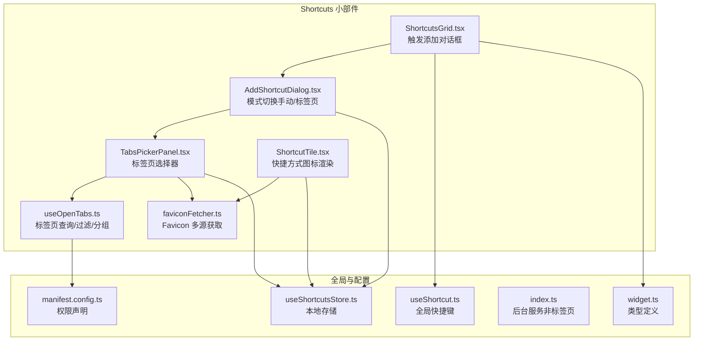
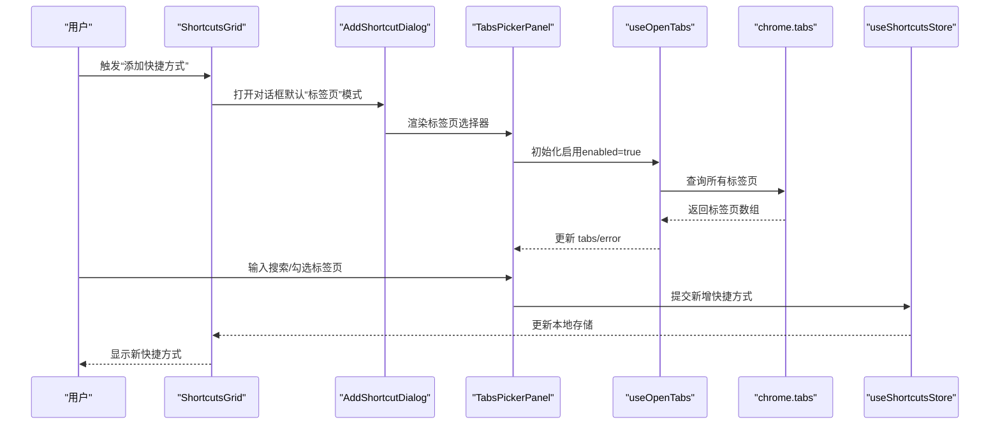
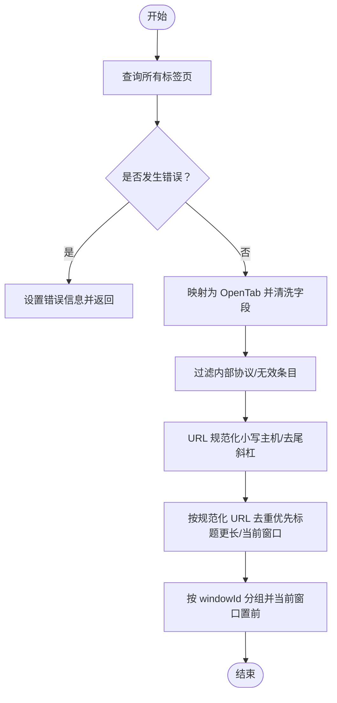
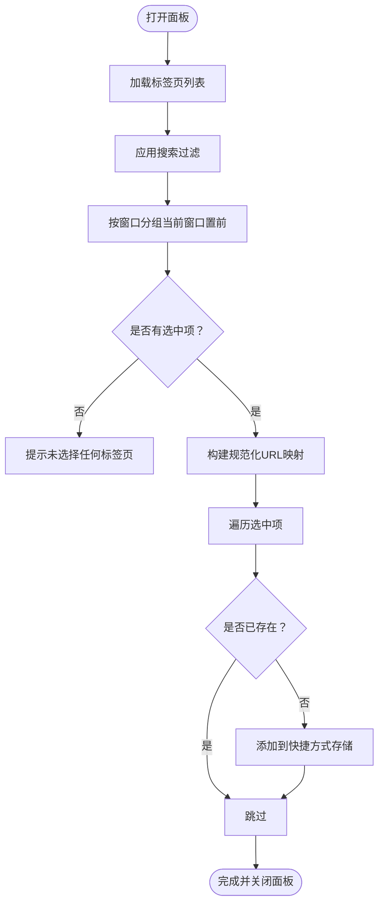
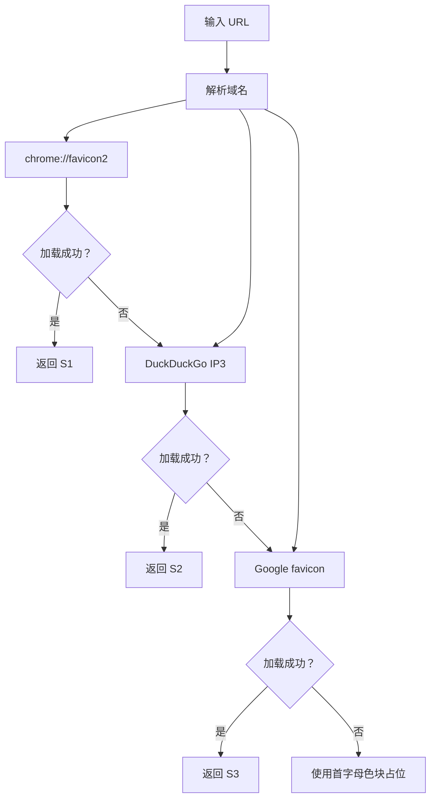
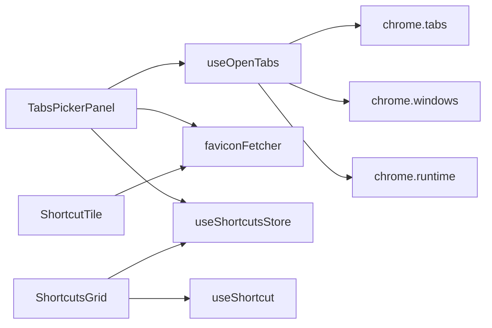

# 标签页 API

<cite>
**本文引用的文件**
- [TabsPickerPanel.tsx](file://src/components/widgets/Shortcuts/TabsPickerPanel.tsx)
- [useOpenTabs.ts](file://src/components/widgets/Shortcuts/useOpenTabs.ts)
- [faviconFetcher.ts](file://src/components/widgets/Shortcuts/faviconFetcher.ts)
- [AddShortcutDialog.tsx](file://src/components/widgets/Shortcuts/AddShortcutDialog.tsx)
- [ShortcutTile.tsx](file://src/components/widgets/Shortcuts/ShortcutTile.tsx)
- [ShortcutsGrid.tsx](file://src/components/widgets/Shortcuts/ShortcutsGrid.tsx)
- [useShortcut.ts](file://src/lib/useShortcut.ts)
- [useShortcutsStore.ts](file://src/store/useShortcutsStore.ts)
- [manifest.config.ts](file://manifest.config.ts)
- [index.ts](file://src/background/index.ts)
- [widget.ts](file://src/types/widget.ts)
- [README.md](file://README.md)
</cite>

## 目录

1. [简介](#简介)
2. [项目结构](#项目结构)
3. [核心组件](#核心组件)
4. [架构总览](#架构总览)
5. [组件详解](#组件详解)
6. [依赖关系分析](#依赖关系分析)
7. [性能与优化](#性能与优化)
8. [故障排查指南](#故障排查指南)
9. [结论](#结论)
10. [附录](#附录)

## 简介

本文件系统性梳理了 Chrome 扩展中“标签页 API”的集成与使用，重点覆盖以下方面：

- 如何通过 chrome.tabs 查询当前打开的标签页，并进行过滤与去重
- 标签页选择器面板的实现：列表渲染、筛选、分组、选择与提交
- Favicon 获取机制与多源回退策略
- 权限声明与使用限制
- 常见标签页操作（查询、激活、关闭、新建）的实践路径
- 事件监听、性能优化与错误处理策略

## 项目结构

与标签页 API 相关的核心文件集中在“Shortcuts”小部件与工具函数中，配合全局快捷键与存储层协同工作。

**图表来源**

- [ShortcutsGrid.tsx:1-38](file://src/components/widgets/Shortcuts/ShortcutsGrid.tsx#L1-L38)
- [AddShortcutDialog.tsx:1-115](file://src/components/widgets/Shortcuts/AddShortcutDialog.tsx#L1-L115)
- [TabsPickerPanel.tsx:1-288](file://src/components/widgets/Shortcuts/TabsPickerPanel.tsx#L1-L288)
- [useOpenTabs.ts:1-176](file://src/components/widgets/Shortcuts/useOpenTabs.ts#L1-L176)
- [faviconFetcher.ts:1-42](file://src/components/widgets/Shortcuts/faviconFetcher.ts#L1-L42)
- [ShortcutTile.tsx:1-79](file://src/components/widgets/Shortcuts/ShortcutTile.tsx#L1-L79)
- [useShortcut.ts:1-49](file://src/lib/useShortcut.ts#L1-L49)
- [useShortcutsStore.ts:1-54](file://src/store/useShortcutsStore.ts#L1-L54)
- [manifest.config.ts:1-38](file://manifest.config.ts#L1-L38)
- [index.ts:1-174](file://src/background/index.ts#L1-L174)
- [widget.ts:1-34](file://src/types/widget.ts#L1-L34)

**章节来源**

- [ShortcutsGrid.tsx:1-38](file://src/components/widgets/Shortcuts/ShortcutsGrid.tsx#L1-L38)
- [AddShortcutDialog.tsx:1-115](file://src/components/widgets/Shortcuts/AddShortcutDialog.tsx#L1-L115)
- [TabsPickerPanel.tsx:1-288](file://src/components/widgets/Shortcuts/TabsPickerPanel.tsx#L1-L288)
- [useOpenTabs.ts:1-176](file://src/components/widgets/Shortcuts/useOpenTabs.ts#L1-L176)
- [faviconFetcher.ts:1-42](file://src/components/widgets/Shortcuts/faviconFetcher.ts#L1-L42)
- [ShortcutTile.tsx:1-79](file://src/components/widgets/Shortcuts/ShortcutTile.tsx#L1-L79)
- [useShortcut.ts:1-49](file://src/lib/useShortcut.ts#L1-L49)
- [useShortcutsStore.ts:1-54](file://src/store/useShortcutsStore.ts#L1-L54)
- [manifest.config.ts:1-38](file://manifest.config.ts#L1-L38)
- [index.ts:1-174](file://src/background/index.ts#L1-L174)
- [widget.ts:1-34](file://src/types/widget.ts#L1-L34)

## 核心组件

- 标签页查询与状态管理：useOpenTabs 提供标签页列表、错误状态与刷新能力，并订阅标签页事件以增量更新
- 标签页选择器面板：TabsPickerPanel 负责展示、筛选、分组、选择与提交
- Favicon 获取：faviconFetcher 提供多源回退与占位色块/首字母
- 快捷方式存储：useShortcutsStore 持久化快捷方式数据
- 全局快捷键：useShortcut 提供跨页面的键盘拦截与派发
- 类型与入口：widget.ts 定义快捷方式结构；manifest.config.ts 声明权限

**章节来源**

- [useOpenTabs.ts:1-176](file://src/components/widgets/Shortcuts/useOpenTabs.ts#L1-L176)
- [TabsPickerPanel.tsx:1-288](file://src/components/widgets/Shortcuts/TabsPickerPanel.tsx#L1-L288)
- [faviconFetcher.ts:1-42](file://src/components/widgets/Shortcuts/faviconFetcher.ts#L1-L42)
- [useShortcutsStore.ts:1-54](file://src/store/useShortcutsStore.ts#L1-L54)
- [useShortcut.ts:1-49](file://src/lib/useShortcut.ts#L1-L49)
- [widget.ts:1-34](file://src/types/widget.ts#L1-L34)

## 架构总览

下图展示了从用户触发到标签页选择、数据持久化的端到端流程。

**图表来源**

- [ShortcutsGrid.tsx:1-38](file://src/components/widgets/Shortcuts/ShortcutsGrid.tsx#L1-L38)
- [AddShortcutDialog.tsx:1-115](file://src/components/widgets/Shortcuts/AddShortcutDialog.tsx#L1-L115)
- [TabsPickerPanel.tsx:1-288](file://src/components/widgets/Shortcuts/TabsPickerPanel.tsx#L1-L288)
- [useOpenTabs.ts:1-176](file://src/components/widgets/Shortcuts/useOpenTabs.ts#L1-L176)
- [useShortcutsStore.ts:1-54](file://src/store/useShortcutsStore.ts#L1-L54)

## 组件详解

### useOpenTabs：标签页查询、过滤与分组

- 查询与刷新
  - 通过 chrome.windows.getCurrent 获取当前窗口 ID，再调用 chrome.tabs.query 查询全部标签页
  - 使用防抖节流（约 150ms）合并短时间内多次变更，避免频繁查询
- 过滤与清洗
  - 排除内部协议（如 chrome:、chrome-extension:、devtools:、about:、file: 等）
  - 对 URL 进行规范化（小写主机名、去除多余尾随斜杠、保留查询与哈希）
  - 去重策略：按规范化 URL 去重，优先保留标题更长的条目；若标题长度相同则优先当前窗口
- 分组与排序
  - 按 windowId 分组，当前窗口置前
- 事件监听
  - 监听 onUpdated（仅当 url/title/favIconUrl 或完成加载状态变化时触发刷新）
  - 监听 onCreated/onRemoved 触发刷新
- 错误处理
  - 通过 chrome.runtime.lastError 捕获并返回错误信息

**图表来源**

- [useOpenTabs.ts:80-176](file://src/components/widgets/Shortcuts/useOpenTabs.ts#L80-L176)

**章节来源**

- [useOpenTabs.ts:1-176](file://src/components/widgets/Shortcuts/useOpenTabs.ts#L1-L176)

### TabsPickerPanel：标签页选择器面板

- 功能要点
  - 支持搜索（按标题或 URL 匹配）
  - 分组显示（当前窗口优先），支持“全选可添加”与“刷新”
  - 选择状态基于规范化 URL 键值，跨刷新保持
  - 提交时仅新增未存在的快捷方式，避免重复
- 渲染细节
  - 每个标签页行包含：复选框、Favicon、标题与主机名、已添加提示
  - 已添加项禁用勾选
- 提交流程
  - 构建“规范化 URL -> 标签页对象”的映射
  - 遍历当前选中的键，过滤已存在项后逐条添加
  - 成功后清空选中并关闭面板

**图表来源**

- [TabsPickerPanel.tsx:1-288](file://src/components/widgets/Shortcuts/TabsPickerPanel.tsx#L1-L288)
- [useOpenTabs.ts:1-176](file://src/components/widgets/Shortcuts/useOpenTabs.ts#L1-L176)
- [useShortcutsStore.ts:1-54](file://src/store/useShortcutsStore.ts#L1-L54)

**章节来源**

- [TabsPickerPanel.tsx:1-288](file://src/components/widgets/Shortcuts/TabsPickerPanel.tsx#L1-L288)

### faviconFetcher：Favicon 获取与回退策略

- 多源回退
  - 优先使用 chrome://favicon2 的动态图标
  - 其次使用 DuckDuckGo 的 IP3 图标
  - 最后使用 Google 的 favicon 服务
- 回退机制
  - 当前源加载失败时，自动切换到下一个可用源
- 占位方案
  - 若所有源均不可用，使用标题首字母的大号色块作为占位

**图表来源**

- [faviconFetcher.ts:1-42](file://src/components/widgets/Shortcuts/faviconFetcher.ts#L1-L42)
- [TabsPickerPanel.tsx:257-288](file://src/components/widgets/Shortcuts/TabsPickerPanel.tsx#L257-L288)
- [ShortcutTile.tsx:1-79](file://src/components/widgets/Shortcuts/ShortcutTile.tsx#L1-L79)

**章节来源**

- [faviconFetcher.ts:1-42](file://src/components/widgets/Shortcuts/faviconFetcher.ts#L1-L42)
- [TabsPickerPanel.tsx:257-288](file://src/components/widgets/Shortcuts/TabsPickerPanel.tsx#L257-L288)
- [ShortcutTile.tsx:1-79](file://src/components/widgets/Shortcuts/ShortcutTile.tsx#L1-L79)

### 快捷方式存储与类型

- 类型定义：Shortcut 包含 id、title、url、iconUrl（可选）
- 存储策略：使用持久化存储，支持本地同步与迁移
- 默认项：内置常用站点作为示例

**章节来源**

- [widget.ts:1-34](file://src/types/widget.ts#L1-L34)
- [useShortcutsStore.ts:1-54](file://src/store/useShortcutsStore.ts#L1-L54)

### 全局快捷键与触发链路

- 全局快捷键：useShortcut 提供跨页面按键拦截，排除编辑类输入元素与组合键冲突
- 触发“从打开的标签页添加”：在快捷方式网格中绑定 Shift+T，打开“标签页”模式的对话框

**章节来源**

- [useShortcut.ts:1-49](file://src/lib/useShortcut.ts#L1-L49)
- [ShortcutsGrid.tsx:1-38](file://src/components/widgets/Shortcuts/ShortcutsGrid.tsx#L1-L38)
- [README.md:41-53](file://README.md#L41-L53)

## 依赖关系分析

- 组件耦合
  - TabsPickerPanel 依赖 useOpenTabs（数据）、faviconFetcher（图标）、useShortcutsStore（提交）
  - ShortcutTile 依赖 faviconFetcher（图标）
  - ShortcutsGrid 依赖 useShortcut（快捷键）、useShortcutsStore（渲染）
- 外部依赖
  - chrome.tabs（查询、事件）
  - chrome.windows（获取当前窗口）
  - chrome.runtime（lastError）

**图表来源**

- [TabsPickerPanel.tsx:1-288](file://src/components/widgets/Shortcuts/TabsPickerPanel.tsx#L1-L288)
- [useOpenTabs.ts:1-176](file://src/components/widgets/Shortcuts/useOpenTabs.ts#L1-L176)
- [ShortcutTile.tsx:1-79](file://src/components/widgets/Shortcuts/ShortcutTile.tsx#L1-L79)
- [ShortcutsGrid.tsx:1-38](file://src/components/widgets/Shortcuts/ShortcutsGrid.tsx#L1-L38)
- [useShortcut.ts:1-49](file://src/lib/useShortcut.ts#L1-L49)
- [useShortcutsStore.ts:1-54](file://src/store/useShortcutsStore.ts#L1-L54)

**章节来源**

- [TabsPickerPanel.tsx:1-288](file://src/components/widgets/Shortcuts/TabsPickerPanel.tsx#L1-L288)
- [useOpenTabs.ts:1-176](file://src/components/widgets/Shortcuts/useOpenTabs.ts#L1-L176)
- [ShortcutTile.tsx:1-79](file://src/components/widgets/Shortcuts/ShortcutTile.tsx#L1-L79)
- [ShortcutsGrid.tsx:1-38](file://src/components/widgets/Shortcuts/ShortcutsGrid.tsx#L1-L38)
- [useShortcut.ts:1-49](file://src/lib/useShortcut.ts#L1-L49)
- [useShortcutsStore.ts:1-54](file://src/store/useShortcutsStore.ts#L1-L54)

## 性能与优化

- 查询与刷新
  - 使用防抖（约 150ms）合并高频变更，减少 chrome.tabs.query 调用次数
  - 仅在必要字段（url/title/favIconUrl/status=complete）变化时触发刷新
- 渲染优化
  - 使用 useMemo 缓存规范化 URL、分组结果与选择集合
  - 列表项使用稳定 key（windowId-id/url），降低重排成本
- 图标加载
  - 多源回退与 onError 自动切换，避免单点失败导致整页卡顿
  - 占位色块与首字母在回退链耗尽时快速渲染
- 存储与同步
  - 使用持久化存储，避免每次重新计算与网络请求

**章节来源**

- [useOpenTabs.ts:96-155](file://src/components/widgets/Shortcuts/useOpenTabs.ts#L96-L155)
- [TabsPickerPanel.tsx:41-49](file://src/components/widgets/Shortcuts/TabsPickerPanel.tsx#L41-L49)
- [TabsPickerPanel.tsx:257-288](file://src/components/widgets/Shortcuts/TabsPickerPanel.tsx#L257-L288)
- [ShortcutTile.tsx:13-22](file://src/components/widgets/Shortcuts/ShortcutTile.tsx#L13-L22)

## 故障排查指南

- 无法读取标签页
  - 检查 chrome.tabs.query 是否可用与 chrome.runtime.lastError 是否存在
  - 确认扩展权限包含 tabs
- 选择器为空或不更新
  - 确认 enabled 参数为 true，且面板处于激活状态
  - 检查 onUpdated/onCreated/onRemoved 事件是否正常注册与注销
- Favicon 加载失败
  - 确认 URL 合法且域名可解析
  - 检查回退链是否被正确触发（chrome://favicon2 -> DuckDuckGo -> Google）
- 重复添加快捷方式
  - 确认规范化 URL 去重逻辑生效（同一站点不同路径视为相同）
- 快捷键无效
  - 检查 useShortcut 的拦截条件（排除输入框、组合键冲突）
  - 确认快捷键未被浏览器或系统占用

**章节来源**

- [useOpenTabs.ts:102-115](file://src/components/widgets/Shortcuts/useOpenTabs.ts#L102-L115)
- [useOpenTabs.ts:132-155](file://src/components/widgets/Shortcuts/useOpenTabs.ts#L132-L155)
- [faviconFetcher.ts:13-26](file://src/components/widgets/Shortcuts/faviconFetcher.ts#L13-L26)
- [TabsPickerPanel.tsx:28-31](file://src/components/widgets/Shortcuts/TabsPickerPanel.tsx#L28-L31)
- [useShortcut.ts:21-47](file://src/lib/useShortcut.ts#L21-L47)

## 结论

该实现以 useOpenTabs 为核心，围绕 chrome.tabs API 构建了完整的标签页查询、过滤、分组与事件驱动刷新机制；结合 TabsPickerPanel 提供直观的交互体验；faviconFetcher 实现稳健的图标回退策略；最终通过 useShortcutsStore 将用户选择持久化。整体设计兼顾可用性与性能，具备良好的扩展性与可维护性。

## 附录

### 权限要求与使用限制

- 权限声明
  - tabs：用于查询与监听标签页状态
  - storage、unlimitedStorage：用于本地持久化
  - bookmarks：用于书签相关功能（与标签页 API 无直接关系）
  - geolocation：用于天气等位置相关功能（与标签页 API 无直接关系）
- 主机权限
  - 包含 DuckDuckGo、Google 等图标服务域名，确保 Favicon 回退链可用

**章节来源**

- [manifest.config.ts:21-37](file://manifest.config.ts#L21-L37)

### 标签页操作示例（实践路径）

- 查询所有标签页
  - 路径参考：[useOpenTabs.ts:102-115](file://src/components/widgets/Shortcuts/useOpenTabs.ts#L102-L115)
- 激活指定标签页
  - 参考：在 TabsPickerPanel 中可基于选中项调用 chrome.tabs.update(id, { active: true })
- 关闭指定标签页
  - 参考：在 TabsPickerPanel 中可基于选中项调用 chrome.tabs.remove(id)
- 创建新标签页
  - 参考：在 TabsPickerPanel 中可基于选中项调用 chrome.tabs.create({ url })
- 监听标签页事件
  - 参考：useOpenTabs 中对 onUpdated/onCreated/onRemoved 的订阅与清理

**章节来源**

- [useOpenTabs.ts:102-115](file://src/components/widgets/Shortcuts/useOpenTabs.ts#L102-L115)
- [TabsPickerPanel.tsx:91-110](file://src/components/widgets/Shortcuts/TabsPickerPanel.tsx#L91-L110)
