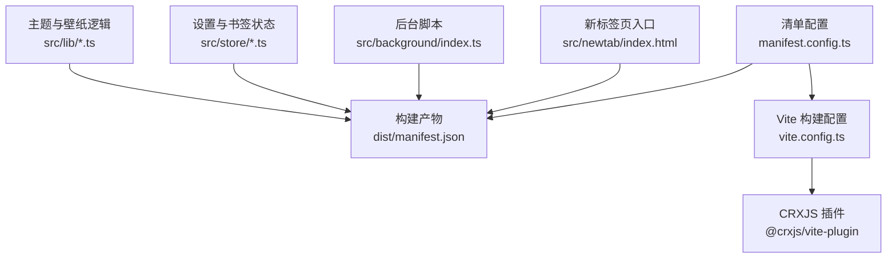
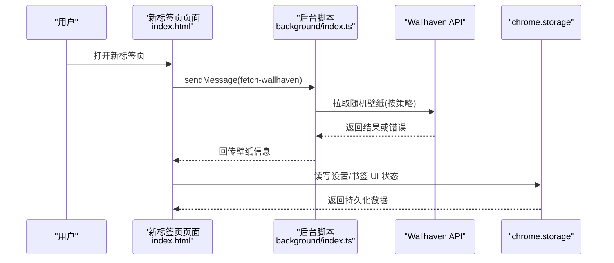
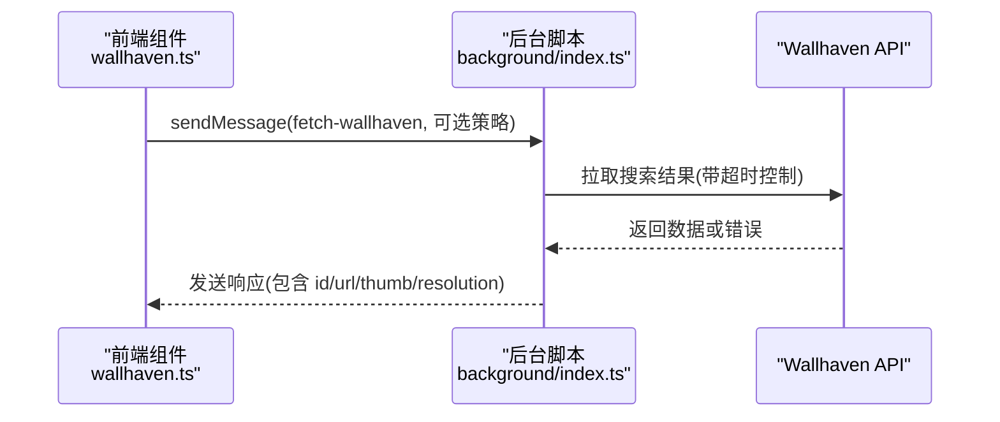
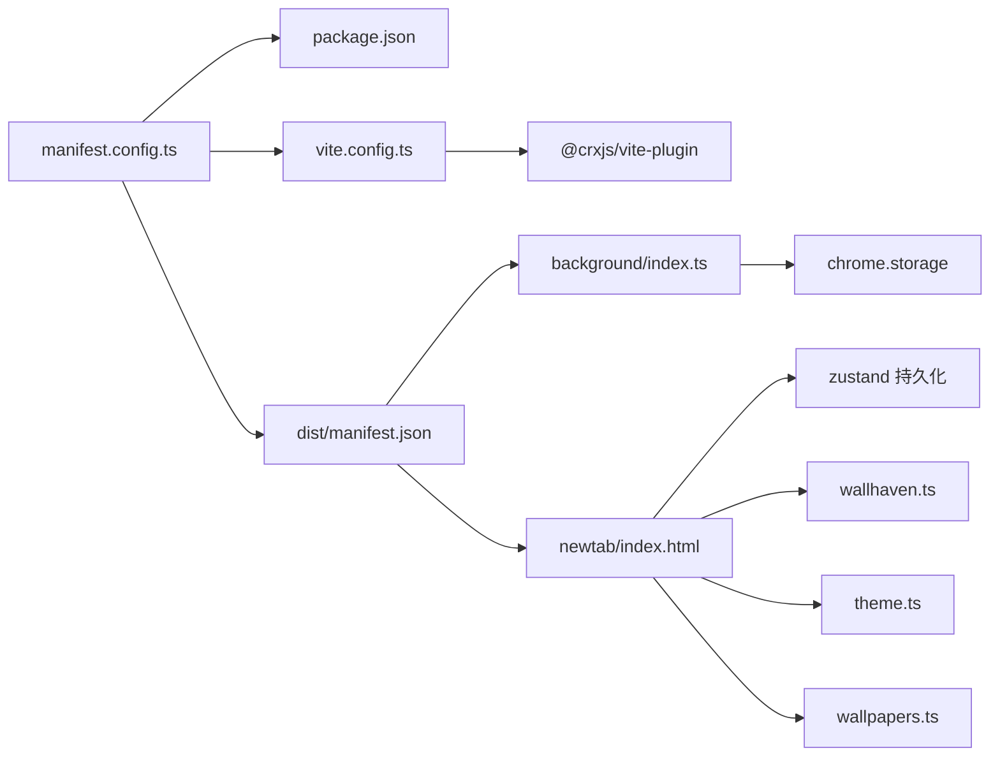

# 清单配置

<cite>
**本文引用的文件**
- [manifest.config.ts](file://manifest.config.ts)
- [dist/manifest.json](file://dist/manifest.json)
- [package.json](file://package.json)
- [vite.config.ts](file://vite.config.ts)
- [src/background/index.ts](file://src/background/index.ts)
- [src/newtab/index.html](file://src/newtab/index.html)
- [src/store/storage.ts](file://src/store/storage.ts)
- [src/store/useBookmarksUiStore.ts](file://src/store/useBookmarksUiStore.ts)
- [src/store/useSettingsStore.ts](file://src/store/useSettingsStore.ts)
- [src/components/widgets/Bookmarks/useBookmarks.ts](file://src/components/widgets/Bookmarks/useBookmarks.ts)
- [src/components/widgets/SearchBar/SearchBar.tsx](file://src/components/widgets/SearchBar/SearchBar.tsx)
- [src/components/widgets/Weather/useWeather.ts](file://src/components/widgets/Weather/useWeather.ts)
- [src/lib/wallhaven.ts](file://src/lib/wallhaven.ts)
- [src/lib/theme.ts](file://src/lib/theme.ts)
- [src/lib/wallpapers.ts](file://src/lib/wallpapers.ts)
</cite>

## 目录

1. [简介](#简介)
2. [项目结构](#项目结构)
3. [核心组件](#核心组件)
4. [架构总览](#架构总览)
5. [详细组件分析](#详细组件分析)
6. [依赖分析](#依赖分析)
7. [性能考量](#性能考量)
8. [故障排查指南](#故障排查指南)
9. [结论](#结论)
10. [附录](#附录)

## 简介

本文件系统性梳理该 Chrome 扩展的清单配置与运行机制，围绕 manifest.json 的各项字段进行逐项解析，涵盖扩展基本信息、权限声明、资源文件与后台脚本配置；详解权限（storage、bookmarks、tabs、geolocation）的作用与使用场景；说明打包与版本管理、更新机制；给出内容安全策略（CSP）的配置建议与安全注意事项；并提供最佳实践、常见错误与调试方法，以及发布前的配置检查清单与兼容性要求。

## 项目结构

该扩展采用 Vite + CRXJS 插件进行构建，清单通过 TypeScript 配置文件生成，最终产物为 dist/manifest.json。新标签页页面位于 src/newtab/index.html，后台脚本为 MV3 模块化 service worker。状态持久化通过 zustand 结合自定义存储适配器访问 chrome.storage。

图表来源

- [manifest.config.ts:1-38](file://manifest.config.ts#L1-L38)
- [dist/manifest.json:1-41](file://dist/manifest.json#L1-L41)
- [vite.config.ts:1-46](file://vite.config.ts#L1-L46)

章节来源

- [manifest.config.ts:1-38](file://manifest.config.ts#L1-L38)
- [dist/manifest.json:1-41](file://dist/manifest.json#L1-L41)
- [vite.config.ts:1-46](file://vite.config.ts#L1-L46)

## 核心组件

- 清单生成与版本来源：清单由 manifest.config.ts 定义，版本号来自 package.json 的 version 字段。
- 新标签页覆盖：通过 chrome_url_overrides.newtab 指向 src/newtab/index.html。
- 后台脚本：MV3 service_worker 类型，入口为 src/background/index.ts。
- 图标与尺寸：icons 映射了 16/48/128 尺寸图标路径。
- 权限与主机权限：permissions 包含 storage、bookmarks、unlimitedStorage、tabs、geolocation；host_permissions 列举了搜索建议、天气、反向地理编码、Unsplash、Wallhaven 等站点通配符。

章节来源

- [manifest.config.ts:4-37](file://manifest.config.ts#L4-L37)
- [package.json:4](file://package.json#L4)
- [dist/manifest.json:6-39](file://dist/manifest.json#L6-L39)

## 架构总览

下图展示从用户打开新标签页到后台脚本与外部服务交互的整体流程，体现清单中权限与主机权限如何支撑功能实现。

图表来源

- [src/newtab/index.html:1-14](file://src/newtab/index.html#L1-L14)
- [src/background/index.ts:132-173](file://src/background/index.ts#L132-L173)
- [src/lib/wallhaven.ts:14-42](file://src/lib/wallhaven.ts#L14-L42)
- [src/store/storage.ts:6-32](file://src/store/storage.ts#L6-L32)

## 详细组件分析

### 清单字段与配置要点

- manifest_version：固定为 3。
- name/description/version：名称、描述、版本均来源于 manifest.config.ts 或 package.json。
- chrome_url_overrides.newtab：指向新标签页入口 HTML。
- background.service_worker/type：MV3 模块化 service worker。
- icons：提供多尺寸图标路径。
- permissions：storage、bookmarks、unlimitedStorage、tabs、geolocation。
- host_permissions：列举搜索建议、天气、反向地理编码、Unsplash、Wallhaven 等站点通配符。

章节来源

- [manifest.config.ts:4-37](file://manifest.config.ts#L4-L37)
- [dist/manifest.json:1-41](file://dist/manifest.json#L1-L41)

### 权限详解与使用场景

- storage
  - 作用：读写本地持久化数据，用于保存设置、书签 UI 展开状态等。
  - 使用示例：设置状态持久化、书签 UI 状态持久化、主题与壁纸缓存。
  - 参考实现：状态存储适配器、设置与书签 UI 的持久化中间件。
- bookmarks
  - 作用：读取浏览器书签树，支持书签组件展示与同步。
  - 使用示例：书签树获取、事件监听（新增/删除/变更/移动）。
- tabs
  - 作用：与标签页交互（如在新标签页中打开链接），本仓库未直接调用，但保留权限。
- geolocation
  - 作用：获取用户位置，用于天气组件的定位与反向地理编码。
  - 使用示例：getCurrentPosition 获取经纬度，再调用反向地理编码服务。

章节来源

- [src/store/storage.ts:6-32](file://src/store/storage.ts#L6-L32)
- [src/store/useSettingsStore.ts:35-84](file://src/store/useSettingsStore.ts#L35-L84)
- [src/store/useBookmarksUiStore.ts:10-30](file://src/store/useBookmarksUiStore.ts#L10-L30)
- [src/components/widgets/Bookmarks/useBookmarks.ts:20-54](file://src/components/widgets/Bookmarks/useBookmarks.ts#L20-L54)
- [src/components/widgets/Weather/useWeather.ts:97-113](file://src/components/widgets/Weather/useWeather.ts#L97-L113)

### 资源文件与打包配置

- 新标签页入口：src/newtab/index.html，作为 chrome_url_overrides.newtab 的目标。
- 后台脚本：src/background/index.ts，作为 service_worker 入口。
- 图标：icons 下的 16/48/128 路径。
- 构建工具链：Vite + CRXJS 插件，使用 defineManifest 生成清单，自动注入版本号与资源路径。
- 开发服务器：绑定 127.0.0.1，确保 CRXJS 开发模式可访问。

章节来源

- [src/newtab/index.html:1-14](file://src/newtab/index.html#L1-L14)
- [src/background/index.ts:1-174](file://src/background/index.ts#L1-L174)
- [manifest.config.ts:16-20](file://manifest.config.ts#L16-L20)
- [vite.config.ts:1-46](file://vite.config.ts#L1-L46)

### 版本管理与更新机制

- 版本来源：清单中的 version 字段来自 package.json 的 version。
- 更新策略：清单未显式声明 update_url，因此默认遵循 Chrome Web Store 的更新机制（若发布至商店）。本地开发与测试可通过重新安装或启用“允许代理解析”进行更新验证。
- 迁移与持久化：设置与书签 UI 的持久化中间件包含版本迁移逻辑，确保升级后数据兼容。

章节来源

- [package.json:4](file://package.json#L4)
- [manifest.config.ts:7](file://manifest.config.ts#L7)
- [src/store/useSettingsStore.ts:62-82](file://src/store/useSettingsStore.ts#L62-L82)
- [src/store/useBookmarksUiStore.ts:22-28](file://src/store/useBookmarksUiStore.ts#L22-L28)

### 内容安全策略（CSP）

- 当前清单未显式声明 csp 字段，表示使用默认策略。
- 建议在 MV3 中明确声明 CSP，限制脚本执行来源与内联脚本，避免 eval 与 unsafe-inline，仅允许必要的外链资源。
- 对于动态加载的图片（如 Unsplash、Wallhaven），应确保 host_permissions 与 CSP 协同，避免跨域与内联脚本被阻断。

章节来源

- [dist/manifest.json:1-41](file://dist/manifest.json#L1-L41)

### 后台脚本与消息通信

- 后台脚本负责处理高复杂度或受限环境的任务（如 Wallhaven 随机壁纸拉取），并通过 runtime.onMessage 接收前端消息，返回结构化结果。
- 前端通过 chrome.runtime.sendMessage 与后台通信，实现跨上下文的数据交换。

图表来源

- [src/lib/wallhaven.ts:14-42](file://src/lib/wallhaven.ts#L14-L42)
- [src/background/index.ts:132-173](file://src/background/index.ts#L132-L173)

### 主题与壁纸模块

- 主题应用：根据设置切换明暗模式、玻璃模式、减少动画，并基于壁纸提取色调与亮度。
- 壁纸预设：内置多组 Unsplash 预设，支持缩略图与原图链接。
- 动态色调：壁纸变化时进行去抖提取，避免频繁解码与重绘。

章节来源

- [src/lib/theme.ts:5-135](file://src/lib/theme.ts#L5-L135)
- [src/lib/wallpapers.ts:1-69](file://src/lib/wallpapers.ts#L1-L69)

## 依赖分析

- 清单依赖：manifest.config.ts 依赖 package.json 提供版本信息；Vite 配置依赖 CRXJS 插件生成最终清单。
- 运行时依赖：后台脚本依赖 fetch 与消息通道；前端组件依赖 zustand 持久化与 chrome.\* API。
- 外部服务：天气组件依赖 Open-Meteo 与 BigDataCloud；搜索建议依赖 Google/Bing/Baidu/DuckDuckGo；壁纸依赖 Unsplash/Wallhaven。

图表来源

- [manifest.config.ts:1-38](file://manifest.config.ts#L1-L38)
- [package.json:1-56](file://package.json#L1-L56)
- [vite.config.ts:1-46](file://vite.config.ts#L1-L46)
- [dist/manifest.json:1-41](file://dist/manifest.json#L1-L41)
- [src/background/index.ts:1-174](file://src/background/index.ts#L1-L174)
- [src/newtab/index.html:1-14](file://src/newtab/index.html#L1-L14)
- [src/lib/wallhaven.ts:1-43](file://src/lib/wallhaven.ts#L1-L43)
- [src/lib/theme.ts:1-135](file://src/lib/theme.ts#L1-L135)
- [src/lib/wallpapers.ts:1-69](file://src/lib/wallpapers.ts#L1-L69)

章节来源

- [manifest.config.ts:1-38](file://manifest.config.ts#L1-L38)
- [package.json:1-56](file://package.json#L1-L56)
- [vite.config.ts:1-46](file://vite.config.ts#L1-L46)
- [dist/manifest.json:1-41](file://dist/manifest.json#L1-L41)

## 性能考量

- 后台脚本职责分离：将需要跨域、Cookie/CORS 的请求放在后台脚本中，避免在新标签页中处理复杂网络请求。
- 缓存与迁移：设置与书签 UI 的持久化包含版本迁移，减少升级后的回退成本。
- 壁纸提取去抖：对快速切换壁纸的场景进行去抖处理，降低 CPU 与内存压力。
- 分包策略：Vite 配置将 React/Zustand 等第三方库单独分包，降低应用代码改动导致的缓存失效。

章节来源

- [src/background/index.ts:1-174](file://src/background/index.ts#L1-L174)
- [src/store/useSettingsStore.ts:62-82](file://src/store/useSettingsStore.ts#L62-L82)
- [src/lib/theme.ts:99-107](file://src/lib/theme.ts#L99-L107)
- [vite.config.ts:14-33](file://vite.config.ts#L14-L33)

## 故障排查指南

- 清单字段缺失或拼写错误：检查 manifest.config.ts 与 dist/manifest.json 是否一致；确认 permissions/host_permissions 是否覆盖所需域名。
- 权限不足：若出现 chrome.storage/bookmarks/tabs/geolocation 访问失败，确认清单中对应权限已声明且用户授权。
- 后台脚本未生效：确认 background.type 为 module，service_worker 路径正确；查看浏览器扩展页面的后台脚本是否加载成功。
- 外链请求失败：核对 host_permissions 是否包含目标域名；检查 CSP 是否阻止了必要的资源加载。
- 消息通信异常：检查前端 sendMessage 与后台 onMessage 的类型匹配与错误处理。
- 开发服务器无法访问：确认 vite.server.host 绑定为 127.0.0.1，端口与 HMR 配置一致。

章节来源

- [manifest.config.ts:4-37](file://manifest.config.ts#L4-L37)
- [dist/manifest.json:1-41](file://dist/manifest.json#L1-L41)
- [src/store/storage.ts:6-32](file://src/store/storage.ts#L6-L32)
- [src/components/widgets/Bookmarks/useBookmarks.ts:20-54](file://src/components/widgets/Bookmarks/useBookmarks.ts#L20-L54)
- [src/components/widgets/Weather/useWeather.ts:97-113](file://src/components/widgets/Weather/useWeather.ts#L97-L113)
- [src/lib/wallhaven.ts:14-42](file://src/lib/wallhaven.ts#L14-L42)
- [vite.config.ts:34-44](file://vite.config.ts#L34-L44)

## 结论

该扩展通过 MV3 清单与 CRXJS 工具链实现了清晰的权限边界与模块化后台脚本，结合 zustand 持久化与主题/壁纸模块，提供了良好的用户体验。建议在生产环境中补充明确的 CSP、严格核验权限与主机权限范围，并完善版本迁移与错误上报机制。

## 附录

### 清单字段对照表

- manifest_version：3
- name：来自 manifest.config.ts
- version：来自 package.json
- description：来自 manifest.config.ts
- chrome_url_overrides.newtab：指向新标签页入口
- background.service_worker：指向后台脚本入口
- background.type：module
- icons：16/48/128
- permissions：storage、bookmarks、unlimitedStorage、tabs、geolocation
- host_permissions：搜索建议、天气、反向地理编码、Unsplash、Wallhaven 等

章节来源

- [manifest.config.ts:4-37](file://manifest.config.ts#L4-L37)
- [dist/manifest.json:1-41](file://dist/manifest.json#L1-L41)
- [package.json:4](file://package.json#L4)

### 最佳实践

- 权限最小化：仅声明必要权限，避免过度申请。
- 明确 CSP：限定脚本来源，禁用 unsafe-inline 与 eval。
- 主机权限精确化：尽量使用具体域名而非通配符，降低风险面。
- 版本迁移：为持久化数据设计迁移策略，保证升级兼容。
- 错误处理：统一捕获 runtime.lastError 并记录日志。

### 常见错误与修复

- 权限未授权：在扩展管理页检查权限状态并引导用户授权。
- host_permissions 不匹配：核对域名白名单，修正通配符或添加缺失域名。
- 后台脚本不加载：确认 service_worker 路径与 type 正确，清除缓存后重装。
- 消息通信失败：校验消息类型与响应结构，处理 runtime.lastError。

### 发布前配置检查清单

- 清单字段完整且与构建产物一致
- 权限与主机权限覆盖所有外部服务
- CSP 明确且不过度宽松
- 版本号与变更日志一致
- 本地与商店两种更新路径验证
- 多设备/多浏览器兼容性测试
