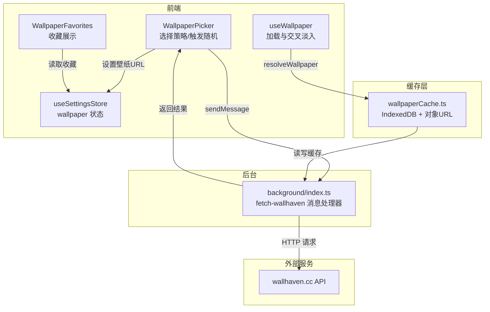
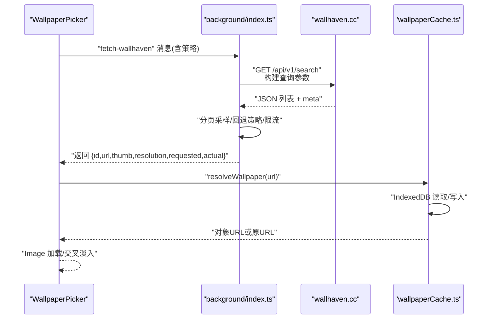
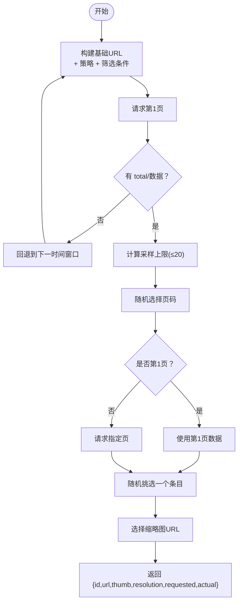
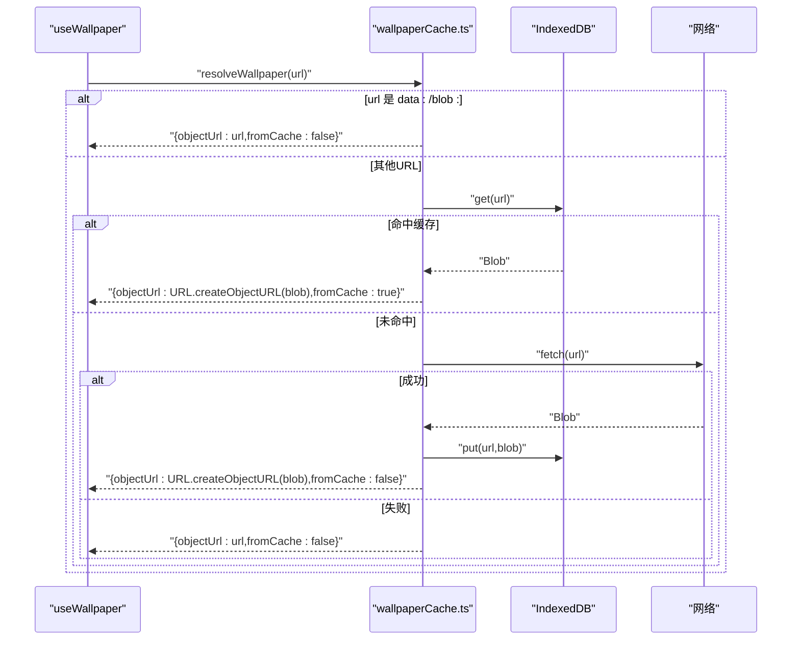
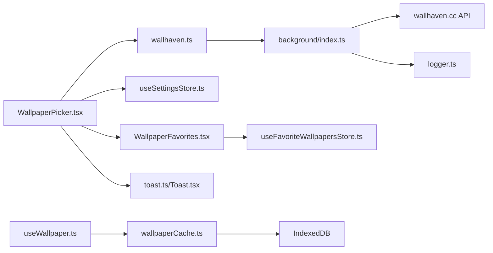

# Wallhaven API

<cite>
**本文引用的文件**
- [wallhaven.ts](file://src/lib/wallhaven.ts)
- [index.ts](file://src/background/index.ts)
- [wallpaperCache.ts](file://src/lib/wallpaperCache.ts)
- [useWallpaper.ts](file://src/lib/useWallpaper.ts)
- [WallpaperPicker.tsx](file://src/components/settings/WallpaperPicker.tsx)
- [WallpaperFavorites.tsx](file://src/components/settings/WallpaperFavorites.tsx)
- [useFavoriteWallpapersStore.ts](file://src/store/useFavoriteWallpapersStore.ts)
- [useSettingsStore.ts](file://src/store/useSettingsStore.ts)
- [manifest.config.ts](file://manifest.config.ts)
- [logger.ts](file://src/lib/logger.ts)
- [toast.ts](file://src/lib/toast.ts)
- [Toast.tsx](file://src/components/ui/Toast.tsx)
</cite>

## 目录

1. [简介](#简介)
2. [项目结构](#项目结构)
3. [核心组件](#核心组件)
4. [架构总览](#架构总览)
5. [详细组件分析](#详细组件分析)
6. [依赖关系分析](#依赖关系分析)
7. [性能考量](#性能考量)
8. [故障排除指南](#故障排除指南)
9. [结论](#结论)
10. [附录](#附录)

## 简介

本文件面向 Wallhaven API 在扩展中的集成与使用，系统性梳理从“随机壁纸”到“缓存与内存管理”的完整链路。内容涵盖：

- API 认证与访问：通过 Manifest 声明主机权限，后台脚本负责跨域与限流处理
- 图片搜索与分类：基于 Wallhaven 榜单接口，按时间窗口与分辨率筛选
- 数据解析：从响应中抽取图片 URL、缩略图、分辨率等元数据
- 缓存系统：IndexedDB 对象存储 + 对象 URL 管理，结合内存优化策略
- 错误处理与用户反馈：统一错误映射、友好提示与日志记录
- 使用示例与最佳实践：策略选择、收藏与随机推荐流程

## 项目结构

与 Wallhaven 集成相关的核心文件分布如下：

- 前端交互与状态：WallpaperPicker、useWallpaper、useSettingsStore
- 后台服务与 API：background 脚本（消息通道、请求构建、限流与回退）
- 缓存与资源加载：wallpaperCache（IndexedDB + 对象 URL）
- 收藏与持久化：useFavoriteWallpapersStore、WallpaperFavorites
- 权限与日志：manifest.config.ts、logger、toast

图表来源

- [WallpaperPicker.tsx:1-162](file://src/components/settings/WallpaperPicker.tsx#L1-162)
- [useWallpaper.ts:1-110](file://src/lib/useWallpaper.ts#L1-110)
- [index.ts:132-173](file://src/background/index.ts#L132-L173)
- [wallpaperCache.ts:75-94](file://src/lib/wallpaperCache.ts#L75-L94)

章节来源

- [WallpaperPicker.tsx:1-162](file://src/components/settings/WallpaperPicker.tsx#L1-162)
- [useWallpaper.ts:1-110](file://src/lib/useWallpaper.ts#L1-110)
- [index.ts:1-174](file://src/background/index.ts#L1-L174)
- [wallpaperCache.ts:1-94](file://src/lib/wallpaperCache.ts#L1-L94)
- [manifest.config.ts:32-36](file://manifest.config.ts#L32-L36)

## 核心组件

- 前端随机请求封装：提供策略枚举与结果类型，通过消息通道调用后台脚本
- 后台脚本：构建查询参数、分页采样、回退策略、限流与错误映射
- 缓存与对象 URL：IndexedDB 存储二进制数据，生成对象 URL 供图片加载
- 壁纸加载 Hook：负责交叉淡入、对象 URL 生命周期与内存回收
- 收藏与设置：收藏持久化、壁纸 URL 状态管理

章节来源

- [wallhaven.ts:1-43](file://src/lib/wallhaven.ts#L1-L43)
- [index.ts:1-174](file://src/background/index.ts#L1-L174)
- [wallpaperCache.ts:1-94](file://src/lib/wallpaperCache.ts#L1-L94)
- [useWallpaper.ts:1-110](file://src/lib/useWallpaper.ts#L1-L110)
- [useSettingsStore.ts:1-89](file://src/store/useSettingsStore.ts#L1-L89)
- [useFavoriteWallpapersStore.ts:1-51](file://src/store/useFavoriteWallpapersStore.ts#L1-L51)

## 架构总览

Wallhaven 集成采用“前台消息 + 后台脚本 + 缓存层”的三层架构：

- 前台负责 UI 与用户交互，通过 chrome.runtime.sendMessage 触发后台任务
- 后台脚本在 MV3 Service Worker 中运行，具备更好的同源/跨域访问能力
- 缓存层在前台侧提供对象 URL 加速与本地存储兜底

图表来源

- [WallpaperPicker.tsx:79-102](file://src/components/settings/WallpaperPicker.tsx#L79-L102)
- [wallhaven.ts:14-42](file://src/lib/wallhaven.ts#L14-L42)
- [index.ts:132-173](file://src/background/index.ts#L132-L173)
- [wallpaperCache.ts:75-94](file://src/lib/wallpaperCache.ts#L75-L94)

## 详细组件分析

### 前端随机请求封装（wallhaven.ts）

- 功能：定义策略类型与结果结构；通过消息通道向后台发送请求
- 关键点：
  - 策略类型：'1d' | '1w' | '1M' | '1y'
  - 结果字段：id、url、thumb、resolution、requestedStrategy、actualStrategy
  - 参数校验与错误透传，保证调用方能获得一致的错误体验

章节来源

- [wallhaven.ts:1-43](file://src/lib/wallhaven.ts#L1-L43)

### 后台脚本（background/index.ts）

- 功能：作为 MV3 Service Worker，处理 fetch-wallhaven 消息，调用 Wallhaven API 并返回结果
- 查询参数与筛选：
  - categories=111（仅壁纸）、purity=100（过滤 NSFW）
  - sorting=toplist、order=desc、topRange=策略、atleast=1920x1080、ratios=16x9/16x10/21x9
- 分页与采样：
  - 读取 meta.total 或 data 长度判断是否有结果
  - 最多采样前 20 页，随机选择一页进行请求
- 回退策略：
  - 当窄时间窗口无结果时，按 1d→1w→1M→1y 顺序回退
- 错误处理：
  - 429 映射为 RATE_LIMITED
  - 超时使用 AbortController 控制
  - 友好错误文案映射

图表来源

- [index.ts:51-98](file://src/background/index.ts#L51-L98)
- [index.ts:100-111](file://src/background/index.ts#L100-L111)
- [index.ts:144-162](file://src/background/index.ts#L144-L162)

章节来源

- [index.ts:1-174](file://src/background/index.ts#L1-L174)

### 壁纸缓存与对象 URL（wallpaperCache.ts）

- 功能：以 IndexedDB 存储 Blob，提供 resolveWallpaper 统一入口
- 存储模型：数据库名 tab-wallpaper-cache，对象存储名为 blobs，版本号 1
- 主要方法：
  - readCachedBlob(url)：读取缓存
  - writeCachedBlob(url,blob)：写入缓存（忽略配额/DB 异常）
  - evictOthers(keepUrl)：清理其他键，仅保留当前壁纸
  - resolveWallpaper(url)：优先命中缓存生成对象 URL；否则下载后写入缓存并返回对象 URL
- 行为细节：
  - data: 和 blob: URL 不走缓存，直接返回
  - 下载失败或非 2xx 时回退为原 URL
  - 对象 URL 由调用方负责撤销，避免内存泄漏

图表来源

- [wallpaperCache.ts:75-94](file://src/lib/wallpaperCache.ts#L75-L94)

章节来源

- [wallpaperCache.ts:1-94](file://src/lib/wallpaperCache.ts#L1-L94)

### 壁纸加载 Hook（useWallpaper.ts）

- 功能：负责壁纸的交叉淡入、对象 URL 生命周期管理与内存回收
- 关键行为：
  - 切换壁纸时先清空 loadedUrl，再异步加载新对象 URL
  - 对于 blob: 对象 URL 进行跟踪并在卸载时撤销
  - 仅保留当前壁纸在 IndexedDB，避免长期累积
- 与缓存配合：通过 resolveWallpaper 统一入口，确保缓存命中与对象 URL 复用

章节来源

- [useWallpaper.ts:1-110](file://src/lib/useWallpaper.ts#L1-L110)

### 前端交互与收藏（WallpaperPicker.tsx、WallpaperFavorites.tsx、useFavoriteWallpapersStore.ts）

- WallpaperPicker：
  - 提供策略按钮（日榜/周榜/月榜/年榜）
  - 触发随机请求，支持超时保护（Promise.race）
  - 收集最近一次成功结果用于收藏按钮可用性判断
- WallpaperFavorites：
  - 展示收藏项，支持移除与直接设为壁纸
- useFavoriteWallpapersStore：
  - 收藏项结构包含 id、url、thumb、resolution、source、strategy
  - 限制最大收藏数，去重并按添加时间排序

章节来源

- [WallpaperPicker.tsx:1-162](file://src/components/settings/WallpaperPicker.tsx#L1-L162)
- [WallpaperFavorites.tsx:1-64](file://src/components/settings/WallpaperFavorites.tsx#L1-L64)
- [useFavoriteWallpapersStore.ts:1-51](file://src/store/useFavoriteWallpapersStore.ts#L1-L51)

### 设置与状态（useSettingsStore.ts）

- 管理壁纸 URL、亮度、遮罩等全局设置
- 默认壁纸来自内置预设

章节来源

- [useSettingsStore.ts:1-89](file://src/store/useSettingsStore.ts#L1-L89)

### 权限与日志（manifest.config.ts、logger.ts、toast.ts、Toast.tsx）

- manifest.config.ts：声明对 wallhaven.cc 及其静态资源域名的 host 权限
- logger.ts：统一日志输出，错误级别始终输出
- toast.ts、Toast.tsx：全局通知与 UI 展示

章节来源

- [manifest.config.ts:32-36](file://manifest.config.ts#L32-L36)
- [logger.ts:1-34](file://src/lib/logger.ts#L1-L34)
- [toast.ts:1-9](file://src/lib/toast.ts#L1-L9)
- [Toast.tsx:1-61](file://src/components/ui/Toast.tsx#L1-L61)

## 依赖关系分析

图表来源

- [WallpaperPicker.tsx:1-162](file://src/components/settings/WallpaperPicker.tsx#L1-L162)
- [wallhaven.ts:1-43](file://src/lib/wallhaven.ts#L1-L43)
- [index.ts:1-174](file://src/background/index.ts#L1-L174)
- [useWallpaper.ts:1-110](file://src/lib/useWallpaper.ts#L1-L110)
- [wallpaperCache.ts:1-94](file://src/lib/wallpaperCache.ts#L1-L94)
- [useSettingsStore.ts:1-89](file://src/store/useSettingsStore.ts#L1-L89)
- [useFavoriteWallpapersStore.ts:1-51](file://src/store/useFavoriteWallpapersStore.ts#L1-L51)
- [WallpaperFavorites.tsx:1-64](file://src/components/settings/WallpaperFavorites.tsx#L1-L64)
- [logger.ts:1-34](file://src/lib/logger.ts#L1-L34)
- [toast.ts:1-9](file://src/lib/toast.ts#L1-L9)
- [Toast.tsx:1-61](file://src/components/ui/Toast.tsx#L1-L61)

章节来源

- [WallpaperPicker.tsx:1-162](file://src/components/settings/WallpaperPicker.tsx#L1-L162)
- [wallhaven.ts:1-43](file://src/lib/wallhaven.ts#L1-L43)
- [index.ts:1-174](file://src/background/index.ts#L1-L174)
- [useWallpaper.ts:1-110](file://src/lib/useWallpaper.ts#L1-L110)
- [wallpaperCache.ts:1-94](file://src/lib/wallpaperCache.ts#L1-L94)
- [useSettingsStore.ts:1-89](file://src/store/useSettingsStore.ts#L1-L89)
- [useFavoriteWallpapersStore.ts:1-51](file://src/store/useFavoriteWallpapersStore.ts#L1-L51)
- [WallpaperFavorites.tsx:1-64](file://src/components/settings/WallpaperFavorites.tsx#L1-L64)
- [logger.ts:1-34](file://src/lib/logger.ts#L1-L34)
- [toast.ts:1-9](file://src/lib/toast.ts#L1-L9)
- [Toast.tsx:1-61](file://src/components/ui/Toast.tsx#L1-L61)

## 性能考量

- 网络层
  - 分页采样上限 20，避免全量扫描
  - 回退策略减少空结果概率，提升成功率
  - 超时控制与限流（429）保障稳定性
- 缓存层
  - IndexedDB 存储二进制，命中后直接生成对象 URL，避免重复下载
  - 写入为异步“尽力而为”，忽略配额/DB 错误，不影响主流程
  - 仅保留当前壁纸，定期清理，控制存储占用
- 内存层
  - 对象 URL 由 useWallpaper 跟踪并在卸载时撤销，防止内存泄漏
  - 切换壁纸采用交叉淡入，避免闪烁与重复创建
- 前端交互
  - 随机请求带超时保护，避免 UI 卡顿
  - 收藏项数量上限控制，避免状态膨胀

[本节为通用性能建议，不直接分析具体文件]

## 故障排除指南

- 常见错误与处理
  - 请求超时：检查网络与超时阈值（10 秒），适当放宽或重试
  - 频繁请求被限流：利用回退策略或降低请求频率
  - 空结果：确认筛选条件（分辨率、比例、时间窗口）是否过严
  - 缓存写入失败：忽略配额/DB 错误属预期行为，不影响回退路径
- 日志与提示
  - 使用 logger 输出错误级别日志，便于定位问题
  - 通过 Toast 展示友好提示，帮助用户理解当前状态
- 清理与恢复
  - 清理 IndexedDB 中的历史缓存，重新触发缓存填充
  - 重置壁纸设置，重新应用默认预设

章节来源

- [index.ts:113-121](file://src/background/index.ts#L113-L121)
- [wallpaperCache.ts:41-47](file://src/lib/wallpaperCache.ts#L41-L47)
- [logger.ts:1-34](file://src/lib/logger.ts#L1-L34)
- [toast.ts:1-9](file://src/lib/toast.ts#L1-L9)
- [Toast.tsx:1-61](file://src/components/ui/Toast.tsx#L1-L61)

## 结论

该实现以 MV3 Service Worker 为核心，结合 IndexedDB 缓存与对象 URL 管理，提供了稳定、可扩展的 Wallhaven 壁纸随机获取与加载方案。通过策略回退、分页采样与限流控制，有效提升了成功率与用户体验；通过对象 URL 生命周期管理与缓存清理，兼顾了性能与内存安全。

[本节为总结性内容，不直接分析具体文件]

## 附录

### API 请求参数与响应格式

- 请求地址
  - https://wallhaven.cc/api/v1/search
- 查询参数
  - categories=111（仅壁纸）
  - purity=100（过滤 NSFW）
  - sorting=toplist、order=desc
  - topRange=策略（1d/3d/1w/1M/3M/6M/1y）
  - atleast=1920x1080（最小分辨率）
  - ratios=16x9,16x10,21x9（宽高比）
- 响应字段
  - data[].id、data[].path（原图 URL）
  - data[].thumbs.large/original/small（缩略图）
  - data[].resolution 或 data[].dimension_x/dimension_y
  - meta.total、meta.last_page
- 前端期望响应
  - id、url、thumb、resolution、requestedStrategy、actualStrategy

章节来源

- [index.ts:51-63](file://src/background/index.ts#L51-L63)
- [index.ts:42-45](file://src/background/index.ts#L42-L45)
- [wallhaven.ts:5-12](file://src/lib/wallhaven.ts#L5-L12)

### 错误处理机制

- 后台错误映射
  - 429 → RATE_LIMITED
  - 非 2xx → 抛出错误
  - 超时 → AbortController 中断
- 前端错误映射
  - AbortError → “请求超时，请稍后再试”
  - RATE_LIMITED → “请求过于频繁，请稍后再试”
  - 其他 → 原始错误消息或“unknown”

章节来源

- [index.ts:65-74](file://src/background/index.ts#L65-L74)
- [index.ts:113-121](file://src/background/index.ts#L113-L121)
- [wallhaven.ts:16-30](file://src/lib/wallhaven.ts#L16-L30)

### 使用示例与最佳实践

- 选择策略
  - 日榜/周榜/月榜/年榜，根据可用性自动回退
- 随机推荐
  - 触发随机请求，等待结果后设置壁纸
  - 若 requested 与 actual 不一致，提示用户已切换
- 收藏管理
  - 将当前壁纸加入收藏，支持移除与直接设为壁纸
- 性能优化
  - 合理设置分辨率与比例，减少无效请求
  - 利用缓存与对象 URL，避免重复下载与内存泄漏
  - 控制收藏数量，保持状态简洁

章节来源

- [WallpaperPicker.tsx:18-30](file://src/components/settings/WallpaperPicker.tsx#L18-L30)
- [WallpaperPicker.tsx:79-102](file://src/components/settings/WallpaperPicker.tsx#L79-L102)
- [useFavoriteWallpapersStore.ts:15-32](file://src/store/useFavoriteWallpapersStore.ts#L15-L32)
- [useWallpaper.ts:18-20](file://src/lib/useWallpaper.ts#L18-L20)
- [wallpaperCache.ts:49-68](file://src/lib/wallpaperCache.ts#L49-L68)
