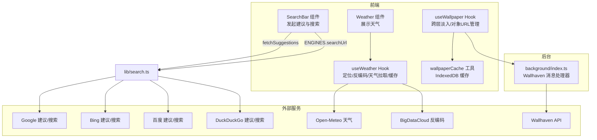
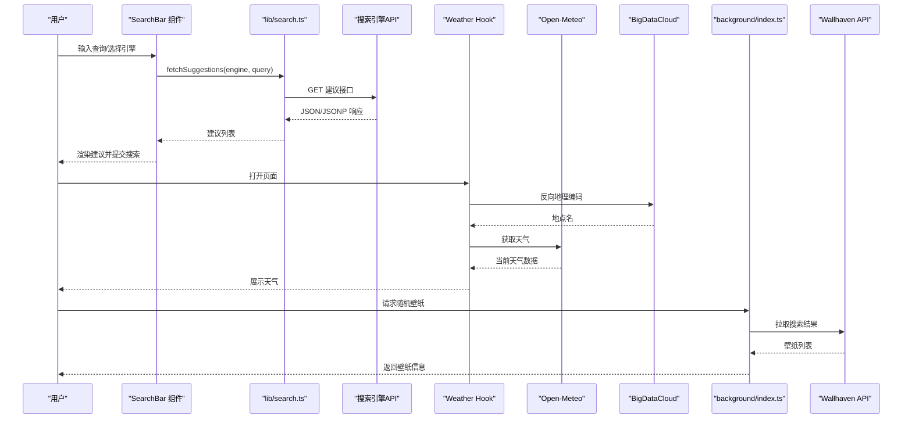
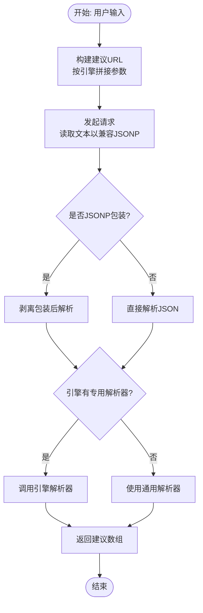
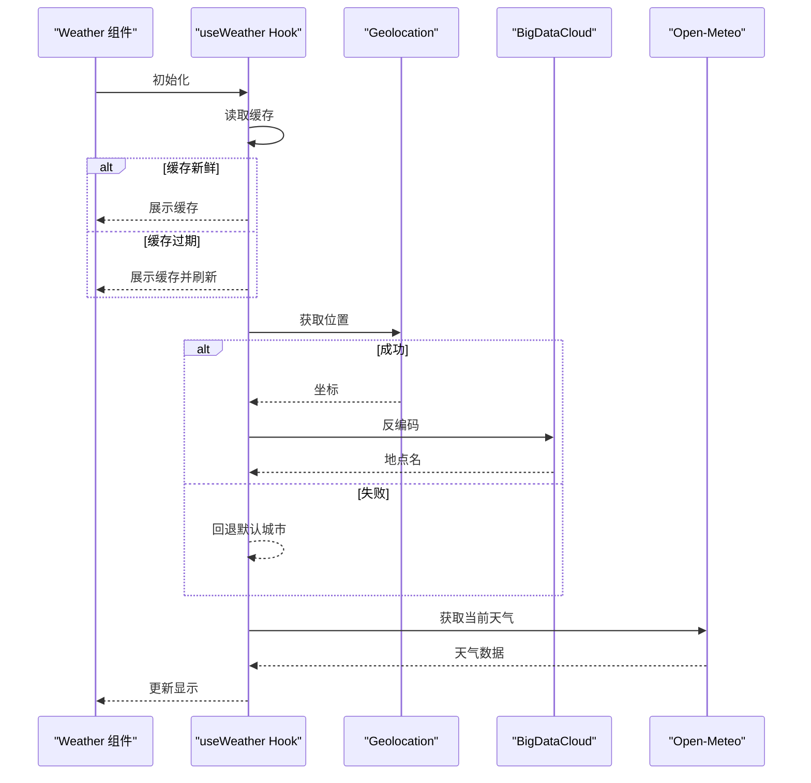
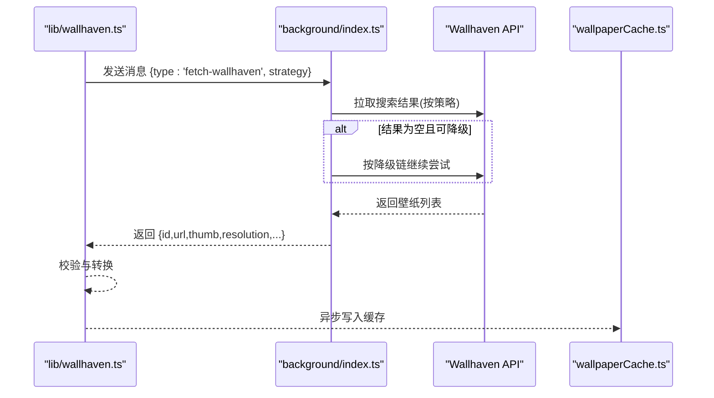
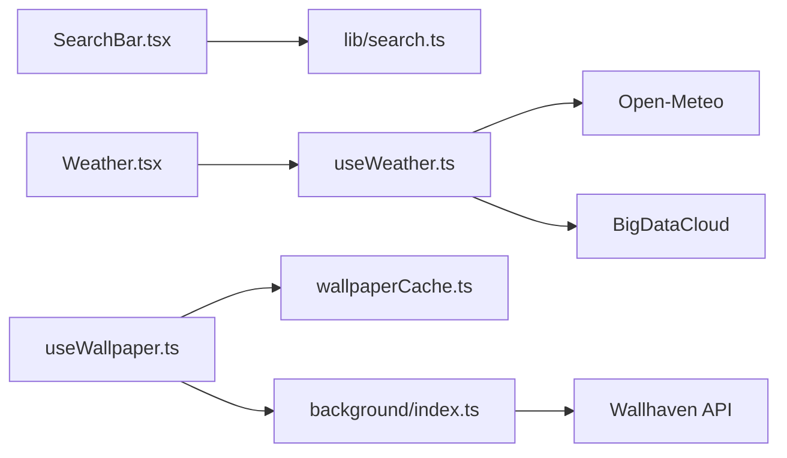

# 外部服务 API

<cite>
**本文引用的文件**
- [src/lib/search.ts](file://src/lib/search.ts)
- [src/components/widgets/SearchBar/SearchBar.tsx](file://src/components/widgets/SearchBar/SearchBar.tsx)
- [src/components/widgets/SearchBar/Suggestions.tsx](file://src/components/widgets/SearchBar/Suggestions.tsx)
- [src/components/widgets/Weather/useWeather.ts](file://src/components/widgets/Weather/useWeather.ts)
- [src/components/widgets/Weather/Weather.tsx](file://src/components/widgets/Weather/Weather.tsx)
- [src/background/index.ts](file://src/background/index.ts)
- [src/lib/wallhaven.ts](file://src/lib/wallhaven.ts)
- [src/lib/wallpaperCache.ts](file://src/lib/wallpaperCache.ts)
- [src/lib/useWallpaper.ts](file://src/lib/useWallpaper.ts)
- [src/lib/wallpapers.ts](file://src/lib/wallpapers.ts)
- [src/store/useSettingsStore.ts](file://src/store/useSettingsStore.ts)
- [src/lib/logger.ts](file://src/lib/logger.ts)
- [package.json](file://package.json)
</cite>

## 目录

1. [简介](#简介)
2. [项目结构](#项目结构)
3. [核心组件](#核心组件)
4. [架构总览](#架构总览)
5. [详细组件分析](#详细组件分析)
6. [依赖关系分析](#依赖关系分析)
7. [性能考量](#性能考量)
8. [故障排除指南](#故障排除指南)
9. [结论](#结论)
10. [附录](#附录)

## 简介

本文件系统性梳理本项目对外部服务 API 的集成与使用，覆盖以下方面：

- 搜索引擎 API：Google、Bing、百度、DuckDuckGo 的搜索与建议功能，含请求格式、响应解析与错误处理策略
- 天气服务 API：基于 Open-Meteo 的天气数据获取、BigDataCloud 的地理反向编码、定位与缓存策略
- 壁纸服务 API：Wallhaven 随机壁纸抓取、消息通道通信、降级策略与本地缓存

文档同时提供 API 请求格式、响应数据结构、密钥管理建议、请求频率限制与缓存策略，并给出集成示例与故障排除指引。

## 项目结构

围绕外部服务 API 的关键模块分布如下：

- 搜索引擎：lib 层定义引擎元信息与建议请求，SearchBar 组件触发建议与提交搜索
- 天气服务：Weather 组件与自定义 Hook 负责定位、反向地理编码、天气拉取与缓存
- 壁纸服务：background 中通过消息通道调用 Wallhaven API，前端通过消息助手封装响应

图表来源

- [src/components/widgets/SearchBar/SearchBar.tsx:1-116](file://src/components/widgets/SearchBar/SearchBar.tsx#L1-L116)
- [src/lib/search.ts:1-109](file://src/lib/search.ts#L1-L109)
- [src/components/widgets/Weather/useWeather.ts:1-192](file://src/components/widgets/Weather/useWeather.ts#L1-L192)
- [src/background/index.ts:1-174](file://src/background/index.ts#L1-L174)
- [src/lib/wallpaperCache.ts:1-94](file://src/lib/wallpaperCache.ts#L1-L94)
- [src/lib/useWallpaper.ts:1-110](file://src/lib/useWallpaper.ts#L1-L110)

章节来源

- [src/components/widgets/SearchBar/SearchBar.tsx:1-116](file://src/components/widgets/SearchBar/SearchBar.tsx#L1-L116)
- [src/lib/search.ts:1-109](file://src/lib/search.ts#L1-L109)
- [src/components/widgets/Weather/useWeather.ts:1-192](file://src/components/widgets/Weather/useWeather.ts#L1-L192)
- [src/background/index.ts:1-174](file://src/background/index.ts#L1-L174)
- [src/lib/wallpaperCache.ts:1-94](file://src/lib/wallpaperCache.ts#L1-L94)
- [src/lib/useWallpaper.ts:1-110](file://src/lib/useWallpaper.ts#L1-L110)

## 核心组件

- 搜索引擎集成（lib/search.ts）
  - 定义引擎元信息（名称、占位符、搜索与建议 URL 构造函数、可选解析器）
  - 提供统一建议请求函数，支持 JSONP 包装剥离与各引擎解析差异
- 天气服务（components/widgets/Weather）
  - useWeather：定位、反向地理编码、天气拉取、缓存与刷新
  - Weather：UI 展示与图标映射
- 壁纸服务（background + lib）
  - background：Wallhaven API 消息处理器，带降级链与超时控制
  - lib/wallhaven：前端消息封装与响应校验
  - lib/wallpaperCache：IndexedDB 图片缓存与对象 URL 解析
  - lib/useWallpaper：跨层淡入动画与对象 URL 生命周期管理

章节来源

- [src/lib/search.ts:1-109](file://src/lib/search.ts#L1-L109)
- [src/components/widgets/Weather/useWeather.ts:1-192](file://src/components/widgets/Weather/useWeather.ts#L1-L192)
- [src/components/widgets/Weather/Weather.tsx:1-81](file://src/components/widgets/Weather/Weather.tsx#L1-L81)
- [src/background/index.ts:1-174](file://src/background/index.ts#L1-L174)
- [src/lib/wallhaven.ts:1-43](file://src/lib/wallhaven.ts#L1-L43)
- [src/lib/wallpaperCache.ts:1-94](file://src/lib/wallpaperCache.ts#L1-L94)
- [src/lib/useWallpaper.ts:1-110](file://src/lib/useWallpaper.ts#L1-L110)

## 架构总览

下图展示从用户输入到外部服务返回的关键交互路径与错误处理策略。

图表来源

- [src/components/widgets/SearchBar/SearchBar.tsx:1-116](file://src/components/widgets/SearchBar/SearchBar.tsx#L1-L116)
- [src/lib/search.ts:88-109](file://src/lib/search.ts#L88-L109)
- [src/components/widgets/Weather/useWeather.ts:68-129](file://src/components/widgets/Weather/useWeather.ts#L68-L129)
- [src/background/index.ts:132-173](file://src/background/index.ts#L132-L173)

## 详细组件分析

### 搜索引擎 API 集成

- 支持引擎
  - Google、Bing、百度、DuckDuckGo
- 请求与解析
  - 建议请求：统一入口函数，按引擎构造 URL；对百度等返回 JSONP 包装进行剥离；若引擎未提供解析器则采用通用解析
  - 搜索跳转：根据当前引擎配置构造搜索 URL
- 错误处理
  - 建议请求在异常或中断时返回空列表并记录警告
- 性能与体验
  - 输入去抖与 AbortController 控制并发请求
  - 建议列表最大条数限制

图表来源

- [src/lib/search.ts:88-109](file://src/lib/search.ts#L88-L109)
- [src/lib/search.ts:16-38](file://src/lib/search.ts#L16-L38)
- [src/lib/search.ts:40-86](file://src/lib/search.ts#L40-L86)

章节来源

- [src/lib/search.ts:1-109](file://src/lib/search.ts#L1-L109)
- [src/components/widgets/SearchBar/SearchBar.tsx:1-116](file://src/components/widgets/SearchBar/SearchBar.tsx#L1-L116)
- [src/components/widgets/SearchBar/Suggestions.tsx:1-40](file://src/components/widgets/SearchBar/Suggestions.tsx#L1-L40)

### 天气服务 API 使用

- 地理位置获取
  - 优先使用浏览器 Geolocation API；失败则回退至默认城市
- 反向地理编码
  - BigDataCloud 免费接口，按经纬度四舍五入到约 1km 粒度缓存地点名
- 天气数据请求
  - Open-Meteo 当前天气接口，解析温度、风速、天气代码、昼夜状态
- 缓存与刷新
  - 使用 Chrome Storage 或 localStorage 存储缓存条目；stale-while-revalidate 策略
  - 新标签页可见时主动刷新；定时刷新间隔固定
- 错误处理
  - 定位失败、反编码失败、网络错误均记录并提示

图表来源

- [src/components/widgets/Weather/useWeather.ts:97-129](file://src/components/widgets/Weather/useWeather.ts#L97-L129)
- [src/components/widgets/Weather/useWeather.ts:38-61](file://src/components/widgets/Weather/useWeather.ts#L38-L61)

章节来源

- [src/components/widgets/Weather/useWeather.ts:1-192](file://src/components/widgets/Weather/useWeather.ts#L1-L192)
- [src/components/widgets/Weather/Weather.tsx:1-81](file://src/components/widgets/Weather/Weather.tsx#L1-L81)

### 壁纸服务 API 集成

- 前端消息封装
  - 通过 chrome.runtime.sendMessage 触发后台任务，等待响应并做基础校验
- 后台消息处理器
  - 限定允许的 topRange；构建 Wallhaven 搜索 URL；处理 429 限流
  - 若请求为空，按预设链路降级扩大时间窗口；设置超时控制
- 响应数据结构
  - 返回 id、url、thumb、resolution、requestedStrategy、actualStrategy
- 本地图片缓存
  - IndexedDB 存储 Blob；resolveWallpaper 优先命中缓存并生成对象 URL
  - 跨层淡入动画与对象 URL 生命周期管理，避免内存泄漏

图表来源

- [src/lib/wallhaven.ts:14-42](file://src/lib/wallhaven.ts#L14-L42)
- [src/background/index.ts:132-173](file://src/background/index.ts#L132-L173)
- [src/lib/wallpaperCache.ts:75-93](file://src/lib/wallpaperCache.ts#L75-L93)

章节来源

- [src/background/index.ts:1-174](file://src/background/index.ts#L1-L174)
- [src/lib/wallhaven.ts:1-43](file://src/lib/wallhaven.ts#L1-L43)
- [src/lib/wallpaperCache.ts:1-94](file://src/lib/wallpaperCache.ts#L1-L94)
- [src/lib/useWallpaper.ts:1-110](file://src/lib/useWallpaper.ts#L1-L110)
- [src/lib/wallpapers.ts:1-69](file://src/lib/wallpapers.ts#L1-L69)

## 依赖关系分析

- 模块耦合
  - SearchBar 依赖 lib/search.ts 提供的引擎元信息与建议函数
  - Weather 组件依赖 useWeather Hook，后者依赖 Open-Meteo 与 BigDataCloud
  - 壁纸相关模块通过 background 消息通道解耦前端与 Wallhaven API
- 外部依赖
  - Open-Meteo、BigDataCloud、Wallhaven、Google/Bing/百度/DuckDuckGo
  - 浏览器 Geolocation、IndexedDB、chrome.storage

图表来源

- [src/components/widgets/SearchBar/SearchBar.tsx:1-116](file://src/components/widgets/SearchBar/SearchBar.tsx#L1-L116)
- [src/lib/search.ts:1-109](file://src/lib/search.ts#L1-L109)
- [src/components/widgets/Weather/Weather.tsx:1-81](file://src/components/widgets/Weather/Weather.tsx#L1-L81)
- [src/components/widgets/Weather/useWeather.ts:1-192](file://src/components/widgets/Weather/useWeather.ts#L1-L192)
- [src/lib/useWallpaper.ts:1-110](file://src/lib/useWallpaper.ts#L1-L110)
- [src/lib/wallpaperCache.ts:1-94](file://src/lib/wallpaperCache.ts#L1-L94)
- [src/background/index.ts:1-174](file://src/background/index.ts#L1-L174)

章节来源

- [src/components/widgets/SearchBar/SearchBar.tsx:1-116](file://src/components/widgets/SearchBar/SearchBar.tsx#L1-L116)
- [src/lib/search.ts:1-109](file://src/lib/search.ts#L1-L109)
- [src/components/widgets/Weather/Weather.tsx:1-81](file://src/components/widgets/Weather/Weather.tsx#L1-L81)
- [src/components/widgets/Weather/useWeather.ts:1-192](file://src/components/widgets/Weather/useWeather.ts#L1-L192)
- [src/lib/useWallpaper.ts:1-110](file://src/lib/useWallpaper.ts#L1-L110)
- [src/lib/wallpaperCache.ts:1-94](file://src/lib/wallpaperCache.ts#L1-L94)
- [src/background/index.ts:1-174](file://src/background/index.ts#L1-L174)

## 性能考量

- 搜索建议
  - 输入去抖与 AbortController，避免频繁请求与资源浪费
  - 建议列表上限控制，减少渲染压力
- 天气服务
  - stale-while-revalidate：先展示缓存再刷新，降低感知延迟
  - 缓存键按经纬度四舍五入，减少微小移动导致的缓存失效
  - 刷新周期固定，可见时才刷新，减少无效请求
- 壁纸服务
  - IndexedDB 缓存图片 Blob，命中即返回对象 URL，避免重复下载
  - 后台消息通道避免前台跨域/同源限制带来的额外开销
  - 降级链与超时控制，提升成功率与稳定性

[本节为通用性能讨论，无需列出具体文件来源]

## 故障排除指南

- 搜索建议无返回
  - 检查网络连通与目标引擎可用性
  - 百度可能返回 JSONP 包装，确认剥离逻辑正常
  - 建议请求被中断或抛错时会返回空列表，属预期行为
- 天气数据加载失败
  - 定位失败或权限拒绝：检查浏览器定位权限与网络
  - 反向地理编码失败：接口不可用或返回异常，回退至默认城市
  - Open-Meteo 接口异常：检查 HTTP 状态码与网络状况
- 壁纸获取失败
  - Wallhaven 429 限流：检查降级链是否生效，适当放宽策略
  - 超时：确认 REQUEST_TIMEOUT_MS 内完成请求
  - 响应校验失败：确认返回字段完整与类型正确
- 日志与调试
  - 使用统一日志工具输出警告与错误，便于定位问题
  - 在开发环境可调整日志级别以便排查

章节来源

- [src/lib/search.ts:95-108](file://src/lib/search.ts#L95-L108)
- [src/components/widgets/Weather/useWeather.ts:165-168](file://src/components/widgets/Weather/useWeather.ts#L165-L168)
- [src/background/index.ts:67-74](file://src/background/index.ts#L67-L74)
- [src/background/index.ts:113-121](file://src/background/index.ts#L113-L121)
- [src/lib/logger.ts:1-35](file://src/lib/logger.ts#L1-L35)

## 结论

本项目对外部服务 API 的集成遵循“前端轻量、后台强能力”的设计思路：

- 搜索引擎：统一抽象与解析，兼顾多引擎差异
- 天气服务：定位、反编码、缓存与刷新策略完备
- 壁纸服务：消息通道解耦、降级链与缓存优化并重

通过合理的错误处理、缓存与性能策略，系统在可用性与用户体验之间取得良好平衡。

[本节为总结性内容，无需列出具体文件来源]

## 附录

### API 请求与响应要点

- 搜索引擎建议
  - 请求：GET 建议接口（按引擎构造）
  - 响应：数组形式的建议字符串；部分引擎返回 JSONP 包装需剥离
  - 错误：网络异常或中断返回空列表
- 天气服务
  - 请求：GET Open-Meteo 当前天气接口（经纬度）
  - 响应：包含温度、风速、天气代码、昼夜状态等字段
  - 反编码：GET BigDataCloud 反编码接口（经纬度）
- 壁纸服务
  - 请求：POST/GET Wallhaven 搜索接口（分类、净化、排序、时间窗口等）
  - 响应：包含 id、url、thumb、resolution 等字段
  - 降级：按策略链路扩大时间窗口直至命中

章节来源

- [src/lib/search.ts:88-109](file://src/lib/search.ts#L88-L109)
- [src/components/widgets/Weather/useWeather.ts:115-129](file://src/components/widgets/Weather/useWeather.ts#L115-L129)
- [src/background/index.ts:51-63](file://src/background/index.ts#L51-L63)
- [src/lib/wallhaven.ts:14-42](file://src/lib/wallhaven.ts#L14-L42)

### 密钥管理、频率限制与缓存策略

- 密钥管理
  - 本项目未使用需要密钥的外部服务；如接入需密钥的服务，建议通过扩展后台或受控环境注入，避免硬编码
- 频率限制
  - 建议请求：输入去抖与 AbortController 控制并发
  - 天气服务：固定刷新周期与可见时刷新，避免过度请求
  - Wallhaven：内置 429 限流处理与降级链
- 缓存策略
  - 搜索建议：不持久化，仅内存缓存
  - 天气：Chrome Storage/localStorage 缓存条目，stale-while-revalidate
  - 壁纸：IndexedDB 缓存图片 Blob，resolveWallpaper 优先命中

章节来源

- [src/components/widgets/SearchBar/SearchBar.tsx:20-32](file://src/components/widgets/SearchBar/SearchBar.tsx#L20-L32)
- [src/components/widgets/Weather/useWeather.ts:176-187](file://src/components/widgets/Weather/useWeather.ts#L176-L187)
- [src/background/index.ts:67-74](file://src/background/index.ts#L67-L74)
- [src/lib/wallpaperCache.ts:75-93](file://src/lib/wallpaperCache.ts#L75-L93)

### 集成示例与最佳实践

- 搜索引擎
  - 在设置中切换引擎，SearchBar 自动使用对应 ENGINES 元信息
  - 建议请求在输入变更后延时触发，避免频繁请求
- 天气服务
  - 优先使用定位与反编码，失败回退默认城市
  - 缓存条目包含时间戳，结合刷新策略保证时效性
- 壁纸服务
  - 通过消息通道请求壁纸，后台负责降级与超时
  - 使用 resolveWallpaper 获取对象 URL 并进行跨层淡入

章节来源

- [src/store/useSettingsStore.ts:6-31](file://src/store/useSettingsStore.ts#L6-L31)
- [src/components/widgets/SearchBar/SearchBar.tsx:1-116](file://src/components/widgets/SearchBar/SearchBar.tsx#L1-L116)
- [src/components/widgets/Weather/useWeather.ts:131-192](file://src/components/widgets/Weather/useWeather.ts#L131-L192)
- [src/lib/wallhaven.ts:14-42](file://src/lib/wallhaven.ts#L14-L42)
- [src/lib/useWallpaper.ts:54-93](file://src/lib/useWallpaper.ts#L54-L93)
