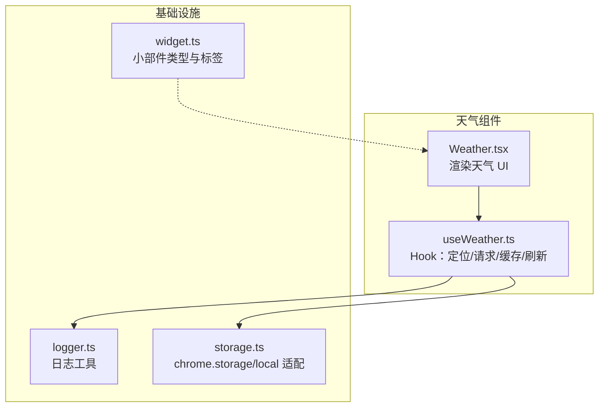
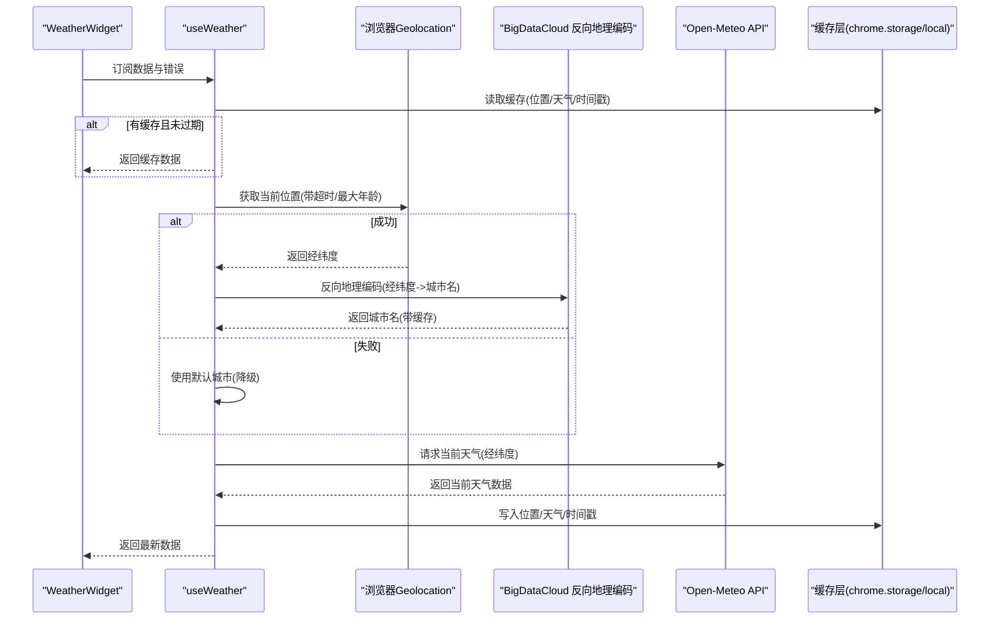
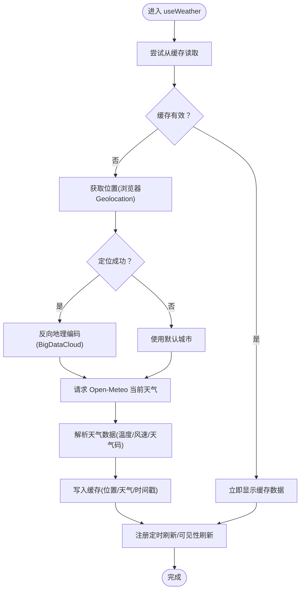
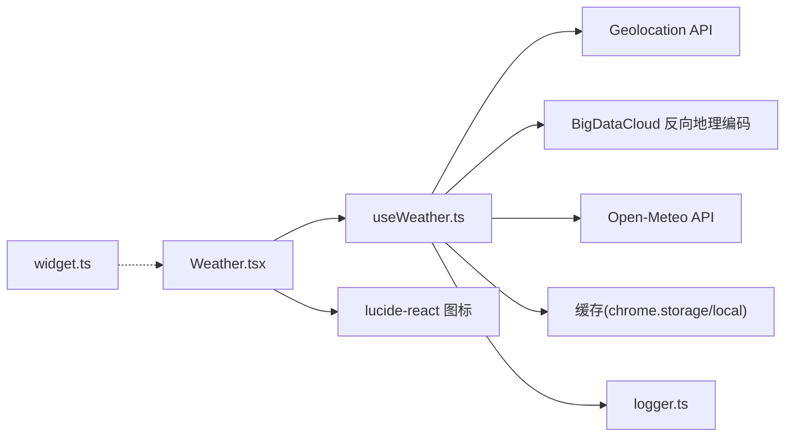

# 天气服务 API

<cite>
**本文引用的文件**
- [Weather.tsx](file://src/components/widgets/Weather/Weather.tsx)
- [useWeather.ts](file://src/components/widgets/Weather/useWeather.ts)
- [logger.ts](file://src/lib/logger.ts)
- [storage.ts](file://src/store/storage.ts)
- [widget.ts](file://src/types/widget.ts)
- [README.md](file://README.md)
- [package.json](file://package.json)
</cite>

## 目录

1. [简介](#简介)
2. [项目结构](#项目结构)
3. [核心组件](#核心组件)
4. [架构总览](#架构总览)
5. [详细组件分析](#详细组件分析)
6. [依赖关系分析](#依赖关系分析)
7. [性能考量](#性能考量)
8. [故障排查指南](#故障排查指南)
9. [结论](#结论)
10. [附录](#附录)

## 简介

本文件面向“天气服务 API”在本项目中的集成与使用，重点覆盖以下方面：

- Open-Meteo API 的调用与数据解析（当前天气、温度、风速、天气现象代码）
- 地理位置获取、经纬度坐标转换与反向地理编码
- 缓存策略与刷新机制（含过期时间、后台刷新）
- 天气图标映射与本地化标签
- 错误处理与降级逻辑（定位失败时回退到默认城市）
- 与扩展存储系统的交互（chrome.storage/local 或 localStorage）

本项目为 Chrome 新标签页扩展，天气组件以 React Hook 形式提供，UI 展示采用图标与中文标签映射。

章节来源

- [README.md:11](file://README.md#L11)

## 项目结构

与天气服务直接相关的文件位于 widgets/Weather 目录，配合日志、存储与类型定义共同构成完整链路。

图表来源

- [Weather.tsx:1-81](file://src/components/widgets/Weather/Weather.tsx#L1-L81)
- [useWeather.ts:1-192](file://src/components/widgets/Weather/useWeather.ts#L1-L192)
- [logger.ts:1-35](file://src/lib/logger.ts#L1-L35)
- [storage.ts:1-63](file://src/store/storage.ts#L1-L63)
- [widget.ts:1-34](file://src/types/widget.ts#L1-L34)

章节来源

- [Weather.tsx:1-81](file://src/components/widgets/Weather/Weather.tsx#L1-L81)
- [useWeather.ts:1-192](file://src/components/widgets/Weather/useWeather.ts#L1-L192)
- [logger.ts:1-35](file://src/lib/logger.ts#L1-L35)
- [storage.ts:1-63](file://src/store/storage.ts#L1-L63)
- [widget.ts:1-34](file://src/types/widget.ts#L1-L34)

## 核心组件

- WeatherWidget：负责渲染天气 UI，包含温度、风速、天气现象图标与中文标签，并在错误或加载状态时给出提示。
- useWeather：核心 Hook，负责：
  - 获取用户位置（优先浏览器地理定位，失败则回退默认城市）
  - 反向地理编码（BigDataCloud）获取城市名
  - 调用 Open-Meteo API 获取当前天气
  - 缓存位置、天气与时间戳，支持“先显示旧值再刷新”的刷新策略
  - 周期性刷新与页面可见性事件触发刷新
  - 统一错误处理与降级

章节来源

- [Weather.tsx:36-80](file://src/components/widgets/Weather/Weather.tsx#L36-L80)
- [useWeather.ts:131-192](file://src/components/widgets/Weather/useWeather.ts#L131-L192)

## 架构总览

天气服务的整体调用链如下：

图表来源

- [useWeather.ts:97-129](file://src/components/widgets/Weather/useWeather.ts#L97-L129)
- [useWeather.ts:140-174](file://src/components/widgets/Weather/useWeather.ts#L140-L174)

## 详细组件分析

### WeatherWidget（UI 渲染）

- 功能要点
  - 将天气现象代码映射为图标与中文标签
  - 展示温度（整数）、风速（km/h）、位置名称与是否回退标记
  - 错误态与加载态的无障碍提示
- 数据来源
  - 来自 useWeather 返回的 WeatherData 结构

章节来源

- [Weather.tsx:36-80](file://src/components/widgets/Weather/Weather.tsx#L36-L80)

### useWeather（Hook 实现）

- 数据模型
  - GeocodeResult：反向地理编码返回的地点信息
  - WeatherData：当前天气数据（location、temperature、windspeed、weatherCode、isDay、isFallback）
  - LocResult：带 isFallback 的位置结果
  - CacheEntry：缓存项（位置、天气、时间戳）
- 关键流程
  - 读取缓存：若缓存存在且未过期，立即返回；否则继续网络请求
  - 获取位置：优先浏览器 Geolocation，失败回退默认城市
  - 反向地理编码：BigDataCloud 接口，按城市/地区/国家回退命名
  - 请求天气：Open-Meteo 当前天气接口
  - 写入缓存：保存位置、天气与时间戳
  - 刷新策略：周期性刷新 + 页面可见性事件触发刷新
- 错误处理
  - 定位失败、反向地理编码失败、网络请求失败均进行降级与错误提示
  - 中止控制器用于避免卸载组件后的副作用

图表来源

- [useWeather.ts:140-174](file://src/components/widgets/Weather/useWeather.ts#L140-L174)
- [useWeather.ts:115-129](file://src/components/widgets/Weather/useWeather.ts#L115-L129)
- [useWeather.ts:97-113](file://src/components/widgets/Weather/useWeather.ts#L97-L113)
- [useWeather.ts:68-95](file://src/components/widgets/Weather/useWeather.ts#L68-L95)

章节来源

- [useWeather.ts:11-28](file://src/components/widgets/Weather/useWeather.ts#L11-L28)
- [useWeather.ts:30-34](file://src/components/widgets/Weather/useWeather.ts#L30-L34)
- [useWeather.ts:38-61](file://src/components/widgets/Weather/useWeather.ts#L38-L61)
- [useWeather.ts:68-95](file://src/components/widgets/Weather/useWeather.ts#L68-L95)
- [useWeather.ts:97-129](file://src/components/widgets/Weather/useWeather.ts#L97-L129)
- [useWeather.ts:131-192](file://src/components/widgets/Weather/useWeather.ts#L131-L192)

### 天气图标与本地化映射

- 图标映射：根据 weatherCode 分段映射到不同图标
- 标签映射：根据 weatherCode 分段映射到中文描述
- 查找算法：线性查找第一个满足条件的分段，未命中返回默认项

章节来源

- [Weather.tsx:4-31](file://src/components/widgets/Weather/Weather.tsx#L4-L31)

### 缓存策略与刷新机制

- 缓存键
  - 天气缓存键：tab:weather-cache
  - 反向地理编码缓存键：tab:geocode-cache
- 缓存条目
  - CacheEntry：包含位置、天气、时间戳
- 过期与刷新
  - FRESH_MS：缓存新鲜度阈值
  - REFRESH_MS：刷新周期
  - stale-while-revalidate：先显示缓存，再异步刷新
- 存储后端
  - 优先 chrome.storage.local（扩展环境）
  - 否则回退 localStorage（非扩展环境）
- 地理编码缓存键精度
  - 将经纬度四舍五入到小数点后两位，降低微小移动导致的缓存失效

章节来源

- [useWeather.ts:30-34](file://src/components/widgets/Weather/useWeather.ts#L30-L34)
- [useWeather.ts:38-61](file://src/components/widgets/Weather/useWeather.ts#L38-L61)
- [useWeather.ts:64-66](file://src/components/widgets/Weather/useWeather.ts#L64-L66)
- [useWeather.ts:140-174](file://src/components/widgets/Weather/useWeather.ts#L140-L174)

### 地理位置与反向地理编码

- 浏览器定位
  - 超时 4 秒，最大年龄 1 小时
  - 失败时记录警告并回退默认城市
- 反向地理编码
  - BigDataCloud 免费接口，支持 CORS
  - 回退顺序：城市 -> 地区 -> 国家 -> “当前位置”
  - 缓存键按经纬度精度计算，避免频繁请求
- 默认城市
  - 北京（经纬度固定），用于定位失败时的降级

章节来源

- [useWeather.ts:97-113](file://src/components/widgets/Weather/useWeather.ts#L97-L113)
- [useWeather.ts:68-95](file://src/components/widgets/Weather/useWeather.ts#L68-L95)
- [useWeather.ts:30](file://src/components/widgets/Weather/useWeather.ts#L30)

### Open-Meteo API 请求与响应

- 请求地址
  - https://api.open-meteo.com/v1/forecast?latitude={lat}&longitude={lon}&current_weather=true
- 响应字段
  - current_weather.temperature（摄氏度）
  - current_weather.windspeed（公里/小时）
  - current_weather.weathercode（天气现象代码）
  - current_weather.is_day（白天/夜晚标识）
- 数据解析
  - 温度四舍五入为整数
  - 风速保留原始数值
  - 天气码用于 UI 映射
  - is_day 用于夜间样式判断（本组件未直接使用）

章节来源

- [useWeather.ts:115-129](file://src/components/widgets/Weather/useWeather.ts#L115-L129)

### 错误处理与降级

- 定位失败：使用默认城市并标记 isFallback
- 反向地理编码失败：返回“当前位置”，并记录警告
- 网络请求失败：抛出错误并显示错误信息
- 组件卸载：通过 AbortController 中止请求，避免内存泄漏
- UI 降级：错误态显示“无法获取天气”，加载态显示“加载中…”

章节来源

- [useWeather.ts:97-113](file://src/components/widgets/Weather/useWeather.ts#L97-L113)
- [useWeather.ts:68-95](file://src/components/widgets/Weather/useWeather.ts#L68-L95)
- [useWeather.ts:115-129](file://src/components/widgets/Weather/useWeather.ts#L115-L129)
- [Weather.tsx:39-53](file://src/components/widgets/Weather/Weather.tsx#L39-L53)

## 依赖关系分析

- 外部依赖
  - lucide-react：天气图标库
  - 浏览器原生 Geolocation API
  - BigDataCloud 反向地理编码服务
  - Open-Meteo 当前天气 API
- 内部依赖
  - 日志工具：统一警告与错误输出
  - 存储适配：chrome.storage/local 与 localStorage 的统一封装
  - 类型定义：小部件 ID 与标签

图表来源

- [useWeather.ts:36-61](file://src/components/widgets/Weather/useWeather.ts#L36-L61)
- [Weather.tsx:1](file://src/components/widgets/Weather/Weather.tsx#L1)
- [widget.ts:16-23](file://src/types/widget.ts#L16-L23)

章节来源

- [package.json:18-26](file://package.json#L18-L26)
- [logger.ts:1-35](file://src/lib/logger.ts#L1-L35)
- [storage.ts:1-32](file://src/store/storage.ts#L1-L32)
- [widget.ts:16-23](file://src/types/widget.ts#L16-L23)

## 性能考量

- 缓存与刷新
  - 使用“先显示缓存再刷新”的策略，减少首屏等待
  - 缓存新鲜度阈值与刷新周期可平衡实时性与网络开销
- 地理编码缓存
  - 按经纬度精度缓存，避免微小移动导致的重复请求
- 存储后端选择
  - 扩展环境优先 chrome.storage.local，非扩展环境回退 localStorage
- 组件卸载与中止
  - 使用 AbortController 避免卸载后副作用
- UI 渲染
  - 数字使用等宽字体，便于对齐
  - 仅在必要时重渲染（React Hook 状态管理）

章节来源

- [useWeather.ts:30-34](file://src/components/widgets/Weather/useWeather.ts#L30-L34)
- [useWeather.ts:64-66](file://src/components/widgets/Weather/useWeather.ts#L64-L66)
- [useWeather.ts:140-174](file://src/components/widgets/Weather/useWeather.ts#L140-L174)
- [useWeather.ts:182-187](file://src/components/widgets/Weather/useWeather.ts#L182-L187)

## 故障排查指南

- 无法获取天气
  - 检查网络连通性与 Open-Meteo API 可用性
  - 查看控制台日志（warn/error）确认具体错误
- 定位失败
  - 确认浏览器允许位置权限
  - 检查浏览器 Geolocation API 是否可用
  - 若失败，组件会回退到默认城市并标记 isFallback
- 反向地理编码失败
  - BigDataCloud 接口可能临时不可用
  - 组件会回退到“当前位置”，并记录警告
- UI 不更新
  - 确认定时刷新与可见性事件是否生效
  - 检查缓存是否过期或被清理
- 存储异常
  - 扩展环境使用 chrome.storage.local，非扩展环境使用 localStorage
  - 若存储失败，组件会忽略并继续运行

章节来源

- [useWeather.ts:165-168](file://src/components/widgets/Weather/useWeather.ts#L165-L168)
- [useWeather.ts:97-113](file://src/components/widgets/Weather/useWeather.ts#L97-L113)
- [useWeather.ts:68-95](file://src/components/widgets/Weather/useWeather.ts#L68-L95)
- [logger.ts:20-30](file://src/lib/logger.ts#L20-L30)

## 结论

本天气服务通过最小化的外部依赖与清晰的模块职责，实现了从定位、反向地理编码到天气数据获取与 UI 展示的完整闭环。其缓存与刷新策略兼顾了用户体验与资源消耗，错误处理与降级逻辑确保了稳定性。对于需要扩展功能（如手动位置设置、单位转换、本地化增强）的场景，可在现有 Hook 基础上进行增量扩展。

## 附录

### API 请求与响应摘要

- 请求
  - 方法：GET
  - 地址：https://api.open-meteo.com/v1/forecast
  - 查询参数：
    - latitude：纬度
    - longitude：经度
    - current_weather：true
- 响应字段（current_weather）
  - temperature：温度（摄氏度）
  - windspeed：风速（公里/小时）
  - weathercode：天气现象代码
  - is_day：白天/夜晚标识（1/0）

章节来源

- [useWeather.ts:115-129](file://src/components/widgets/Weather/useWeather.ts#L115-L129)

### 缓存键与策略

- 天气缓存键：tab:weather-cache
- 地理编码缓存键：tab:geocode-cache
- 缓存条目：位置、天气、时间戳
- 新鲜度阈值：FRESH_MS（15 分钟）
- 刷新周期：REFRESH_MS（15 分钟）
- 缓存键精度：经纬度保留两位小数

章节来源

- [useWeather.ts:30-34](file://src/components/widgets/Weather/useWeather.ts#L30-L34)
- [useWeather.ts:24-28](file://src/components/widgets/Weather/useWeather.ts#L24-L28)
- [useWeather.ts:64-66](file://src/components/widgets/Weather/useWeather.ts#L64-L66)

### 单位与本地化

- 单位
  - 温度：摄氏度（整数）
  - 风速：公里/小时（保留原始值）
- 本地化
  - 天气现象标签：中文
  - 反向地理编码语言：zh（简体中文）

章节来源

- [Weather.tsx:67-73](file://src/components/widgets/Weather/Weather.tsx#L67-L73)
- [useWeather.ts:75-77](file://src/components/widgets/Weather/useWeather.ts#L75-L77)

### 集成示例（步骤说明）

- 在组件中引入 WeatherWidget 或直接使用 useWeather Hook
- 在需要的地方渲染 WeatherWidget 或消费 useWeather 返回的数据
- 如需手动位置设置，可在现有 Hook 基础上扩展输入参数并更新缓存

章节来源

- [Weather.tsx:36-80](file://src/components/widgets/Weather/Weather.tsx#L36-L80)
- [useWeather.ts:131-192](file://src/components/widgets/Weather/useWeather.ts#L131-L192)
