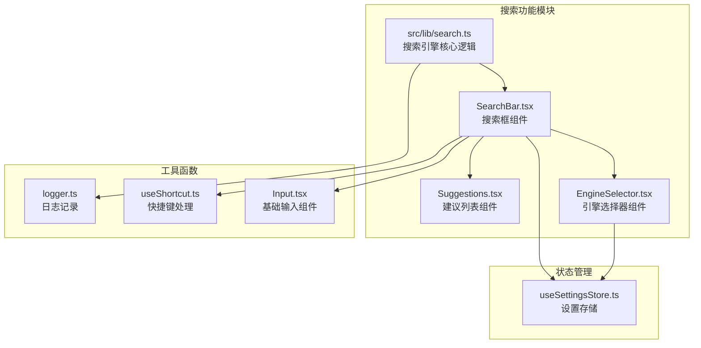
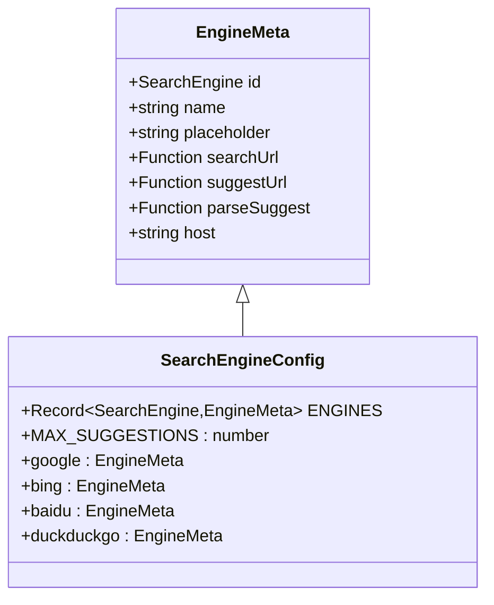
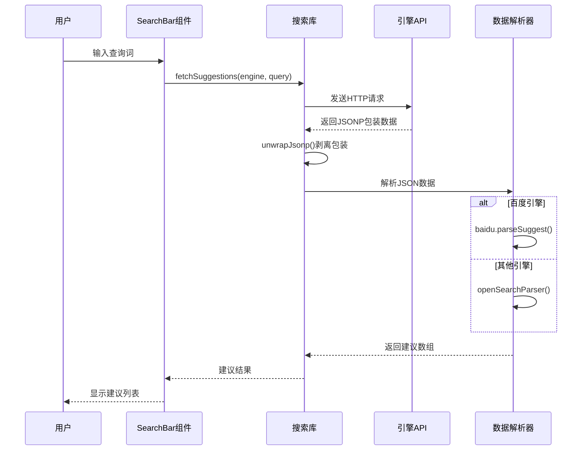
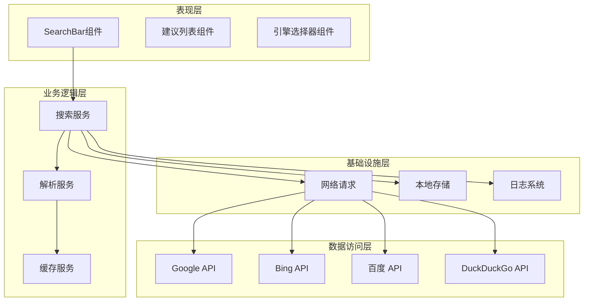
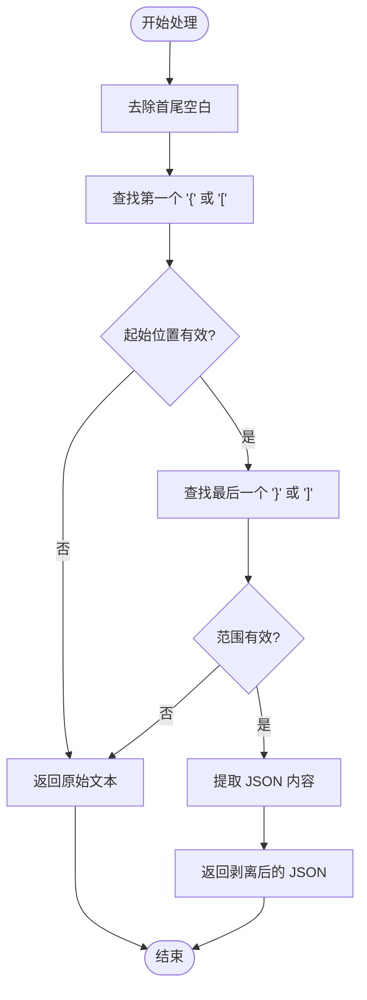
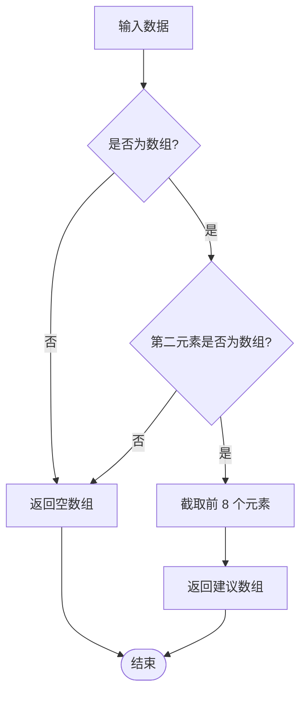
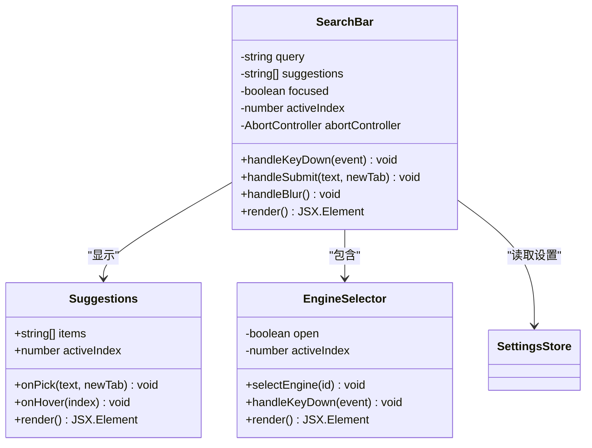
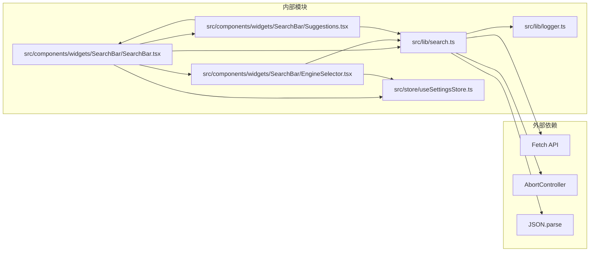

# 搜索引擎 API

<cite>
**本文档引用的文件**
- [src/lib/search.ts](file://src/lib/search.ts)
- [src/lib/search.test.ts](file://src/lib/search.test.ts)
- [src/components/widgets/SearchBar/SearchBar.tsx](file://src/components/widgets/SearchBar/SearchBar.tsx)
- [src/components/widgets/SearchBar/Suggestions.tsx](file://src/components/widgets/SearchBar/Suggestions.tsx)
- [src/components/widgets/SearchBar/EngineSelector.tsx](file://src/components/widgets/SearchBar/EngineSelector.tsx)
- [src/store/useSettingsStore.ts](file://src/store/useSettingsStore.ts)
- [src/lib/logger.ts](file://src/lib/logger.ts)
- [src/lib/useShortcut.ts](file://src/lib/useShortcut.ts)
- [src/components/ui/Input.tsx](file://src/components/ui/Input.tsx)
</cite>

## 目录

1. [简介](#简介)
2. [项目结构](#项目结构)
3. [核心组件](#核心组件)
4. [架构概览](#架构概览)
5. [详细组件分析](#详细组件分析)
6. [依赖关系分析](#依赖关系分析)
7. [性能考虑](#性能考虑)
8. [故障排除指南](#故障排除指南)
9. [结论](#结论)

## 简介

本项目实现了四大主流搜索引擎（Google、Bing、百度、DuckDuckGo）的 API 集成，提供了完整的搜索框功能，包括实时搜索建议、搜索引擎切换、键盘导航和无障碍支持。该系统采用模块化设计，支持 JSONP 包装内容剥离、OpenSearch 格式解析和特定搜索引擎的数据结构处理。

## 项目结构

搜索引擎功能主要分布在以下模块中：



**图表来源**

- [src/lib/search.ts:1-109](file://src/lib/search.ts#L1-L109)
- [src/components/widgets/SearchBar/SearchBar.tsx:1-116](file://src/components/widgets/SearchBar/SearchBar.tsx#L1-L116)
- [src/components/widgets/SearchBar/EngineSelector.tsx:1-118](file://src/components/widgets/SearchBar/EngineSelector.tsx#L1-L118)

**章节来源**

- [src/lib/search.ts:1-109](file://src/lib/search.ts#L1-L109)
- [src/store/useSettingsStore.ts:1-89](file://src/store/useSettingsStore.ts#L1-L89)

## 核心组件

### 搜索引擎元数据管理

系统通过统一的引擎配置管理四大搜索引擎：



**图表来源**

- [src/lib/search.ts:6-14](file://src/lib/search.ts#L6-L14)
- [src/lib/search.ts:40-86](file://src/lib/search.ts#L40-L86)

### 建议获取流程



**图表来源**

- [src/lib/search.ts:88-108](file://src/lib/search.ts#L88-L108)
- [src/lib/search.ts:21-38](file://src/lib/search.ts#L21-L38)
- [src/lib/search.ts:16-19](file://src/lib/search.ts#L16-L19)

**章节来源**

- [src/lib/search.ts:1-109](file://src/lib/search.ts#L1-L109)

## 架构概览

系统采用分层架构设计，确保各组件职责清晰分离：



**图表来源**

- [src/components/widgets/SearchBar/SearchBar.tsx:1-116](file://src/components/widgets/SearchBar/SearchBar.tsx#L1-L116)
- [src/lib/search.ts:1-109](file://src/lib/search.ts#L1-L109)

## 详细组件分析

### 搜索引擎配置与 URL 构建

#### Google 搜索引擎集成

Google 提供了成熟的搜索建议 API 和搜索接口：

**搜索 URL 构建规则：**

- 基础 URL: `https://www.google.com/search`
- 查询参数: `q`（编码后的查询词）
- 编码要求: 使用 `encodeURIComponent` 处理特殊字符

**自动建议 API：**

- API 端点: `https://suggestqueries.google.com/complete/search`
- 参数: `client=chrome`, `q`（查询词）
- 响应格式: OpenSearch 标准格式

**章节来源**

- [src/lib/search.ts:41-49](file://src/lib/search.ts#L41-L49)

#### Bing 搜索引擎集成

Bing 使用 OpenSearch 规范提供搜索建议：

**搜索 URL 构建规则：**

- 基础 URL: `https://www.bing.com/search`
- 查询参数: `q`（查询词）

**自动建议 API：**

- API 端点: `https://api.bing.com/osjson.aspx`
- 参数: `query`（查询词）
- 响应格式: OpenSearch 标准格式

**章节来源**

- [src/lib/search.ts:50-58](file://src/lib/search.ts#L50-L58)

#### 百度搜索引擎特殊处理

百度提供了独特的搜索建议 API，需要特殊的解析逻辑：

**搜索 URL 构建规则：**

- 基础 URL: `https://www.baidu.com/s`
- 查询参数: `wd`（查询词）

**自动建议 API：**

- API 端点: `https://www.baidu.com/sugrec`
- 参数: `prod=pc&from=pc_web&wd`（查询词）
- 响应格式: 百度自定义 JSON 结构

**特殊解析逻辑：**

- 数据结构: `{ g: [{ q: string }, ...] }`
- 过滤规则: 只保留 `q` 属性为字符串的有效项
- 限制数量: 最多返回 8 个建议

**章节来源**

- [src/lib/search.ts:59-76](file://src/lib/search.ts#L59-L76)

#### DuckDuckGo 搜索引擎集成

DuckDuckGo 提供开源的搜索建议 API：

**搜索 URL 构建规则：**

- 基础 URL: `https://duckduckgo.com/`
- 查询参数: `q`（查询词）

**自动建议 API：**

- API 端点: `https://duckduckgo.com/ac/`
- 参数: `q`（查询词）, `type=list`
- 响应格式: JSON 数组格式

**章节来源**

- [src/lib/search.ts:77-86](file://src/lib/search.ts#L77-L86)

### JSONP 包装内容剥离处理

系统实现了智能的 JSONP 包装内容剥离功能：



**图表来源**

- [src/lib/search.ts:21-38](file://src/lib/search.ts#L21-L38)

**章节来源**

- [src/lib/search.ts:21-38](file://src/lib/search.ts#L21-L38)

### OpenSearch 格式解析逻辑

系统支持标准的 OpenSearch 建议格式：



**图表来源**

- [src/lib/search.ts:16-19](file://src/lib/search.ts#L16-L19)

**章节来源**

- [src/lib/search.ts:16-19](file://src/lib/search.ts#L16-L19)

### 搜索框组件实现

搜索框组件提供了完整的用户交互体验：



**图表来源**

- [src/components/widgets/SearchBar/SearchBar.tsx:9-116](file://src/components/widgets/SearchBar/SearchBar.tsx#L9-L116)
- [src/components/widgets/SearchBar/Suggestions.tsx:11-40](file://src/components/widgets/SearchBar/Suggestions.tsx#L11-L40)
- [src/components/widgets/SearchBar/EngineSelector.tsx:9-118](file://src/components/widgets/SearchBar/EngineSelector.tsx#L9-L118)

**章节来源**

- [src/components/widgets/SearchBar/SearchBar.tsx:1-116](file://src/components/widgets/SearchBar/SearchBar.tsx#L1-L116)

### 搜索引擎切换机制

引擎选择器组件实现了直观的搜索引擎切换功能：

**键盘导航支持：**

- 上下箭头键：在引擎列表中循环导航
- Enter/Space：选择当前高亮的引擎
- Escape：关闭下拉菜单

**无障碍支持：**

- ARIA 属性：`aria-expanded`, `aria-haspopup`, `aria-selected`
- 键盘可访问性：完整的键盘操作支持
- 状态同步：与全局设置状态保持同步

**章节来源**

- [src/components/widgets/SearchBar/EngineSelector.tsx:1-118](file://src/components/widgets/SearchBar/EngineSelector.tsx#L1-L118)

### 搜索框占位符国际化

系统支持多语言占位符显示：

**当前支持的语言：**

- 中文：Google 搜索、必应搜索、百度搜索
- 英文：DuckDuckGo

**实现方式：**

- 通过引擎配置中的 `placeholder` 字段定义
- 动态根据当前选中的搜索引擎更新占位符
- 支持中英文混合界面

**章节来源**

- [src/lib/search.ts:44,53,62,80:44-80](file://src/lib/search.ts#L44-L80)

### 建议结果过滤逻辑

系统实现了智能的建议结果过滤机制：

**过滤规则：**

1. **空查询过滤**：空字符串或仅包含空白字符的查询返回空数组
2. **长度限制**：最多返回 8 个建议结果
3. **数据类型验证**：确保返回的建议都是字符串类型
4. **异常处理**：网络错误、解析失败等情况返回空数组

**章节来源**

- [src/lib/search.ts:4,88-108:4-108](file://src/lib/search.ts#L4-L108)

## 依赖关系分析

系统采用松耦合的设计模式，各组件间依赖关系清晰：



**图表来源**

- [src/lib/search.ts:1-109](file://src/lib/search.ts#L1-L109)
- [src/components/widgets/SearchBar/SearchBar.tsx:1-116](file://src/components/widgets/SearchBar/SearchBar.tsx#L1-L116)

**章节来源**

- [src/lib/search.ts:1-109](file://src/lib/search.ts#L1-L109)
- [src/store/useSettingsStore.ts:1-89](file://src/store/useSettingsStore.ts#L1-L89)

## 性能考虑

### 请求去抖优化

系统实现了智能的请求去抖机制：

- **延迟时间**：150ms 的防抖延迟
- **取消机制**：新的查询会自动取消之前的请求
- **内存管理**：及时清理定时器和 AbortController

### 建议数量限制

为了提升性能和用户体验：

- **最大建议数**：8 个建议
- **早期截断**：解析过程中就进行数量限制
- **内存优化**：避免加载过多的建议数据

### 缓存策略

虽然当前实现没有显式的缓存机制，但系统设计支持未来添加缓存：

- **请求去抖**：天然的缓存效果
- **状态持久化**：使用 Zustand 的持久化存储
- **扩展点**：可以在 `fetchSuggestions` 函数中添加缓存逻辑

## 故障排除指南

### 常见问题诊断

**问题 1：搜索建议不显示**

- 检查网络连接是否正常
- 验证搜索引擎 API 是否可达
- 查看浏览器控制台是否有 CORS 错误

**问题 2：建议结果为空**

- 确认查询词不是空字符串
- 检查搜索引擎是否支持建议功能
- 验证响应数据格式是否正确

**问题 3：百度建议解析失败**

- 确认百度 API 返回的数据结构
- 检查 `parseSuggest` 函数的过滤逻辑
- 验证 `q` 字段的数据类型

### 调试技巧

**启用详细日志：**

```typescript
import { setLoggerMinLevel } from '@/lib/logger'
setLoggerMinLevel('debug')
```

**测试建议：**

- 使用单元测试验证各个解析函数
- 测试边界情况（空数据、错误数据、特殊字符）
- 验证不同搜索引擎的兼容性

**章节来源**

- [src/lib/search.test.ts:1-99](file://src/lib/search.test.ts#L1-L99)
- [src/lib/logger.ts:1-35](file://src/lib/logger.ts#L1-L35)

## 结论

该搜索引擎 API 集成系统展现了优秀的工程实践：

**设计优势：**

- **模块化架构**：清晰的职责分离和依赖关系
- **可扩展性**：易于添加新的搜索引擎支持
- **健壮性**：完善的错误处理和边界条件检查
- **用户体验**：流畅的交互和无障碍支持

**技术亮点：**

- 智能的 JSONP 包装内容剥离
- 标准化的 OpenSearch 格式支持
- 特定搜索引擎的数据结构处理
- 完整的键盘导航和无障碍功能

**改进建议：**

- 添加请求缓存机制以提升性能
- 实现更详细的错误报告和监控
- 支持自定义搜索引擎配置
- 增加搜索历史和热门搜索功能

该系统为构建现代化的搜索体验提供了坚实的基础，其设计原则和实现细节可以作为类似项目的参考模板。
