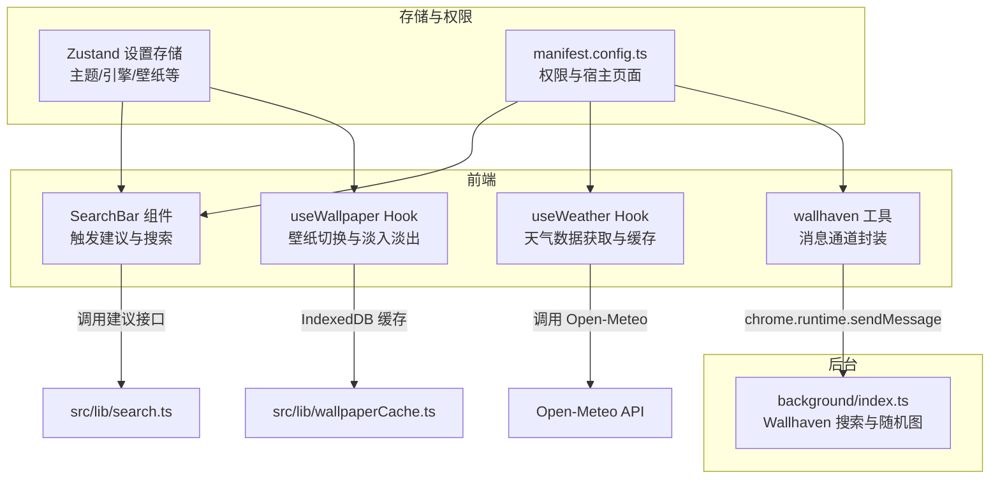
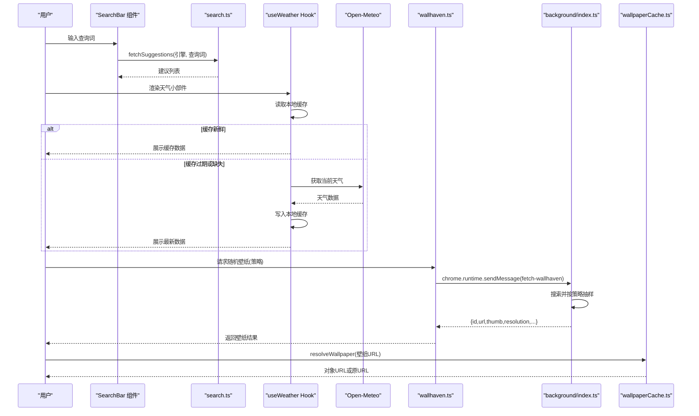
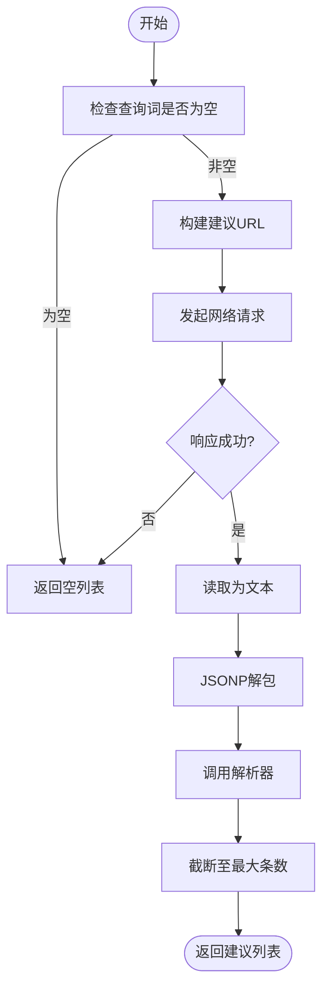
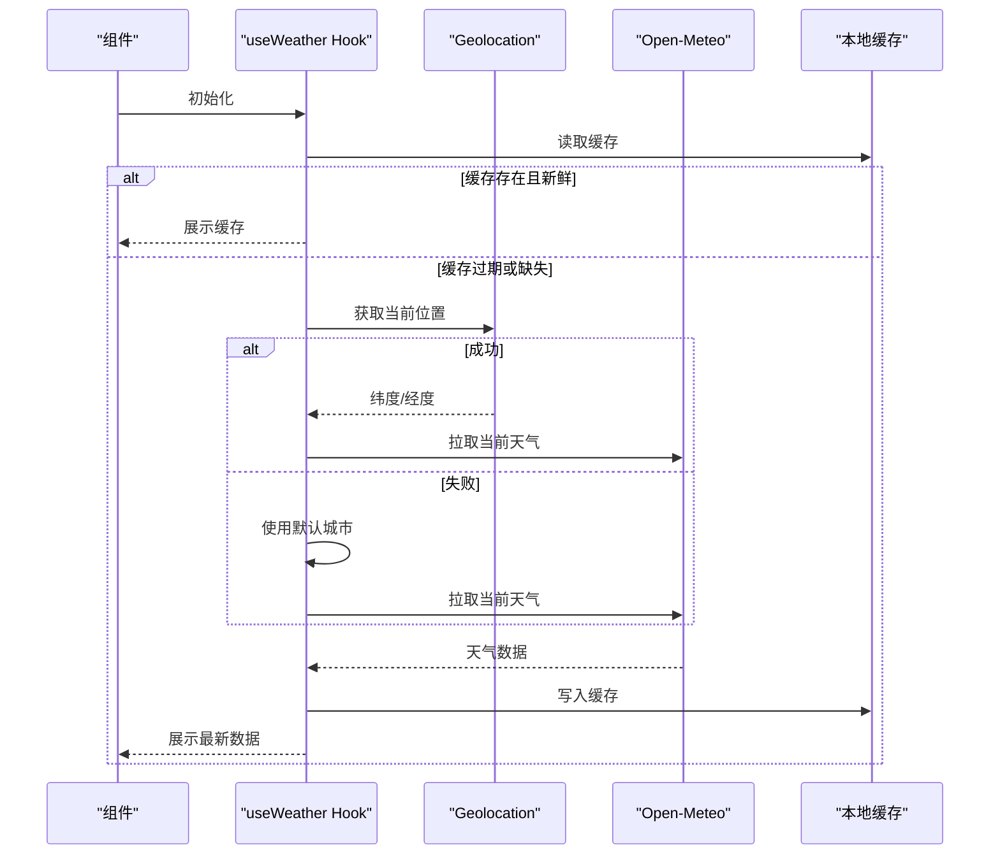
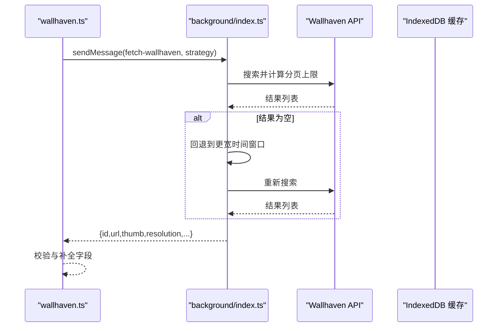
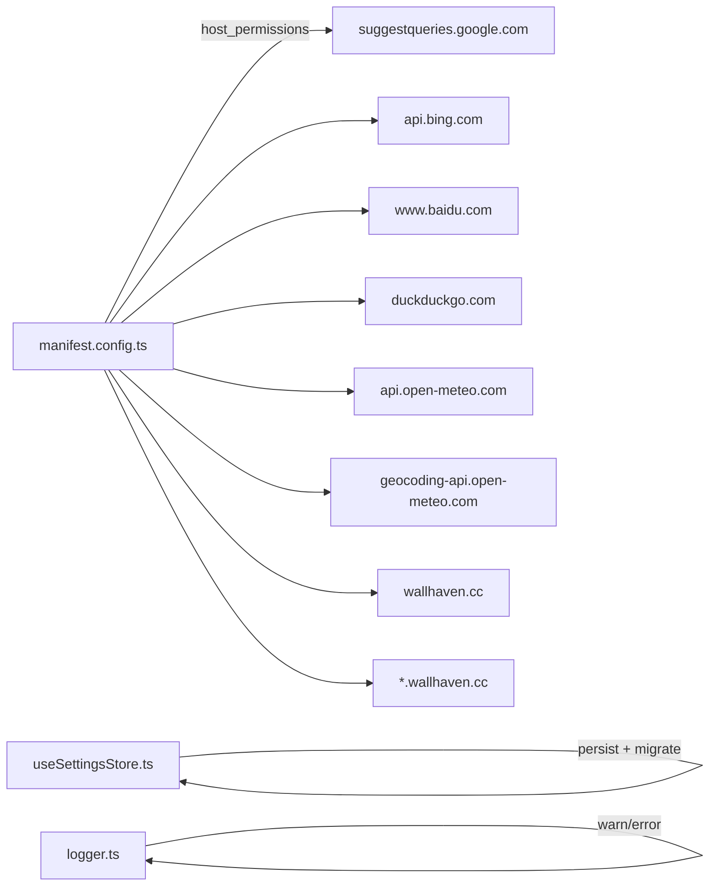

# 自定义 API 接口

<cite>
**本文引用的文件**
- [src/lib/search.ts](file://src/lib/search.ts)
- [src/components/widgets/SearchBar/SearchBar.tsx](file://src/components/widgets/SearchBar/SearchBar.tsx)
- [src/components/widgets/SearchBar/Suggestions.tsx](file://src/components/widgets/SearchBar/Suggestions.tsx)
- [src/store/useSettingsStore.ts](file://src/store/useSettingsStore.ts)
- [src/background/index.ts](file://src/background/index.ts)
- [src/lib/wallhaven.ts](file://src/lib/wallhaven.ts)
- [src/lib/wallpaperCache.ts](file://src/lib/wallpaperCache.ts)
- [src/lib/wallpapers.ts](file://src/lib/wallpapers.ts)
- [src/lib/useWallpaper.ts](file://src/lib/useWallpaper.ts)
- [src/components/widgets/Weather/Weather.tsx](file://src/components/widgets/Weather/Weather.tsx)
- [src/components/widgets/Weather/useWeather.ts](file://src/components/widgets/Weather/useWeather.ts)
- [src/lib/logger.ts](file://src/lib/logger.ts)
- [manifest.config.ts](file://manifest.config.ts)
- [package.json](file://package.json)
</cite>

## 目录

1. [简介](#简介)
2. [项目结构](#项目结构)
3. [核心组件](#核心组件)
4. [架构总览](#架构总览)
5. [详细组件分析](#详细组件分析)
6. [依赖关系分析](#依赖关系分析)
7. [性能考量](#性能考量)
8. [故障排查指南](#故障排查指南)
9. [结论](#结论)
10. [附录](#附录)

## 简介

本文件面向扩展开发者与集成者，系统化梳理本仓库中的“自定义 API 接口”能力，重点覆盖以下三类接口：

- 搜索建议 API：支持多搜索引擎（Google、Bing、百度、DuckDuckGo），统一建议解析与缓存策略，具备 JSONP 解包与跨引擎解析器适配。
- 天气查询 API：基于 Open-Meteo 的公开天气接口，提供位置反向地理编码、本地缓存与过期刷新机制，支持降级与错误提示。
- 壁纸获取 API：通过墙纸主题随机选择与分页抽样，结合后台消息通道与 IndexedDB 缓存，提供高性能的壁纸加载与跨域访问。

同时，文档给出接口规范、请求参数、响应格式、错误码与状态码、版本管理与迁移策略，并提供调用示例与集成要点。

## 项目结构

该扩展采用 MV3 架构，前端页面位于新标签页入口，后台脚本运行在服务工作线程中以绕过部分跨域限制；状态管理使用 Zustand，UI 组件通过 React Hooks 调用底层工具函数与后台消息通道。

图表来源

- [src/components/widgets/SearchBar/SearchBar.tsx:1-116](file://src/components/widgets/SearchBar/SearchBar.tsx#L1-L116)
- [src/lib/search.ts:1-109](file://src/lib/search.ts#L1-L109)
- [src/components/widgets/Weather/useWeather.ts:1-174](file://src/components/widgets/Weather/useWeather.ts#L1-L174)
- [src/lib/wallpaperCache.ts:1-94](file://src/lib/wallpaperCache.ts#L1-L94)
- [src/lib/wallhaven.ts:1-43](file://src/lib/wallhaven.ts#L1-L43)
- [src/background/index.ts:1-174](file://src/background/index.ts#L1-L174)
- [manifest.config.ts:1-38](file://manifest.config.ts#L1-L38)

章节来源

- [manifest.config.ts:1-38](file://manifest.config.ts#L1-L38)
- [package.json:1-56](file://package.json#L1-L56)

## 核心组件

- 搜索建议模块：提供多引擎建议拉取、JSONP 解包、统一解析器与最大返回条数控制。
- 天气模块：提供位置获取、反向地理编码、Open-Meteo 数据拉取、本地缓存与过期刷新。
- 壁纸模块：提供预设壁纸、随机墙纸（Wallhaven）获取、IndexedDB 缓存与对象 URL 管理、跨域图片加载与内存回收。

章节来源

- [src/lib/search.ts:1-109](file://src/lib/search.ts#L1-L109)
- [src/components/widgets/Weather/useWeather.ts:1-174](file://src/components/widgets/Weather/useWeather.ts#L1-L174)
- [src/lib/wallhaven.ts:1-43](file://src/lib/wallhaven.ts#L1-L43)
- [src/lib/wallpaperCache.ts:1-94](file://src/lib/wallpaperCache.ts#L1-L94)
- [src/lib/wallpapers.ts:1-69](file://src/lib/wallpapers.ts#L1-L69)
- [src/lib/useWallpaper.ts:1-110](file://src/lib/useWallpaper.ts#L1-L110)

## 架构总览

下图展示三大接口在前端与后台之间的交互路径、数据流向与关键错误处理点。

图表来源

- [src/components/widgets/SearchBar/SearchBar.tsx:1-116](file://src/components/widgets/SearchBar/SearchBar.tsx#L1-L116)
- [src/lib/search.ts:88-109](file://src/lib/search.ts#L88-L109)
- [src/components/widgets/Weather/useWeather.ts:131-174](file://src/components/widgets/Weather/useWeather.ts#L131-L174)
- [src/lib/wallhaven.ts:14-43](file://src/lib/wallhaven.ts#L14-L43)
- [src/background/index.ts:132-173](file://src/background/index.ts#L132-L173)
- [src/lib/wallpaperCache.ts:75-94](file://src/lib/wallpaperCache.ts#L75-L94)

## 详细组件分析

### 搜索建议 API

- 设计目标
  - 支持多搜索引擎（Google、Bing、百度、DuckDuckGo）。
  - 统一建议返回格式与最大条数限制。
  - 兼容不同响应格式（OpenSearch、JSONP 包裹、特定字段映射）。
- 关键实现
  - 引擎元数据：包含引擎标识、占位符、搜索 URL、建议 URL、可选解析器与主机名。
  - 建议解析器：
    - 默认解析器：从二维数组中提取建议文本。
    - 百度解析器：从 g 数组中过滤字符串字段。
  - JSONP 解包：自动识别包裹并提取 JSON。
  - 建议拉取：根据引擎与查询词构造 URL，读取文本并解析，返回字符串数组。
- 性能与体验
  - 防抖延迟与 AbortController 控制并发请求。
  - 最大建议条数限制，避免 UI 过载。
- 错误处理
  - 网络错误、解析失败、JSONP 解包失败均回退为空列表。
  - 中断请求不抛错，直接返回空列表。

图表来源

- [src/lib/search.ts:88-109](file://src/lib/search.ts#L88-L109)

章节来源

- [src/lib/search.ts:1-109](file://src/lib/search.ts#L1-L109)
- [src/components/widgets/SearchBar/SearchBar.tsx:20-32](file://src/components/widgets/SearchBar/SearchBar.tsx#L20-L32)
- [src/components/widgets/SearchBar/Suggestions.tsx:1-40](file://src/components/widgets/SearchBar/Suggestions.tsx#L1-L40)
- [src/store/useSettingsStore.ts:1-89](file://src/store/useSettingsStore.ts#L1-L89)

### 天气查询 API

- 接口规范
  - 基础地址：Open-Meteo 当前天气接口
  - 参数
    - 纬度：latitude
    - 经度：longitude
    - current_weather：true
  - 响应字段
    - location：地点名称
    - temperature：摄氏温度（整数）
    - windspeed：风速（km/h）
    - weatherCode：天气现象代码
    - isDay：昼夜状态
    - isFallback：是否使用默认城市
  - 更新机制
    - 本地缓存键：固定键名
    - 新鲜期：15 分钟内视为新鲜
    - 刷新周期：15 分钟
    - 采用“缓存优先 + 后台刷新”的策略
  - 降级策略
    - 地理定位失败时使用默认城市（北京）
- 错误码与状态码
  - HTTP 200：成功
  - HTTP 非 200：返回错误信息
  - 定位失败：使用默认城市并标记 isFallback
- 调用示例（集成要点）
  - 前端通过 useWeather Hook 使用，无需手动传参。
  - 反向地理编码与缓存读写封装在 Hook 内部。

图表来源

- [src/components/widgets/Weather/useWeather.ts:97-174](file://src/components/widgets/Weather/useWeather.ts#L97-L174)
- [src/components/widgets/Weather/Weather.tsx:1-80](file://src/components/widgets/Weather/Weather.tsx#L1-L80)

章节来源

- [src/components/widgets/Weather/useWeather.ts:1-174](file://src/components/widgets/Weather/useWeather.ts#L1-L174)
- [src/components/widgets/Weather/Weather.tsx:1-80](file://src/components/widgets/Weather/Weather.tsx#L1-L80)

### 壁纸获取 API

- 接口规范
  - 前端通过 wallhaven 工具发起消息请求，后台执行 Wallhaven 搜索与随机抽样。
  - 策略（TopRange）：1d、1w、1M、1y（内部支持更细粒度范围，前端暴露 4 种）
  - 响应字段
    - id：壁纸 ID
    - url：原图地址
    - thumb：缩略图地址
    - resolution：分辨率
    - requestedStrategy：请求策略
    - actualStrategy：实际策略（可能因为空结果而回退）
- 后台实现要点
  - 构建基础查询 URL（分类、纯净度、排序、分辨率等）
  - 首页计数与最多采样页数限制
  - 策略回退链：窄窗口无结果则放宽到更宽窗口
  - 超时控制与友好错误提示
- 前端消费流程
  - 通过 chrome.runtime.sendMessage 发送消息
  - 校验响应结构，填充缩略图与分辨率字段
  - 返回标准化结果给调用方
- 壁纸加载与缓存
  - resolveWallpaper：优先命中 IndexedDB 缓存，否则下载并写入缓存，生成对象 URL
  - evictOthers：仅保留当前壁纸的缓存条目，避免无限增长
  - useWallpaper：负责跨层淡入淡出与内存回收

图表来源

- [src/lib/wallhaven.ts:14-43](file://src/lib/wallhaven.ts#L14-L43)
- [src/background/index.ts:51-173](file://src/background/index.ts#L51-L173)

章节来源

- [src/lib/wallhaven.ts:1-43](file://src/lib/wallhaven.ts#L1-L43)
- [src/background/index.ts:1-174](file://src/background/index.ts#L1-L174)
- [src/lib/wallpaperCache.ts:1-94](file://src/lib/wallpaperCache.ts#L1-L94)
- [src/lib/useWallpaper.ts:1-110](file://src/lib/useWallpaper.ts#L1-L110)
- [src/lib/wallpapers.ts:1-69](file://src/lib/wallpapers.ts#L1-L69)

## 依赖关系分析

- 权限与宿主
  - manifest 声明了对多个外部域名的 host 权限，确保建议、天气与壁纸接口可正常访问。
- 存储与同步
  - 设置存储使用持久化中间件，包含版本迁移逻辑，保证设置项向后兼容。
- 日志与调试
  - logger 提供分级日志输出，便于在开发与生产环境间切换。

图表来源

- [manifest.config.ts:22-36](file://manifest.config.ts#L22-L36)
- [src/store/useSettingsStore.ts:57-84](file://src/store/useSettingsStore.ts#L57-L84)
- [src/lib/logger.ts:1-35](file://src/lib/logger.ts#L1-L35)

章节来源

- [manifest.config.ts:1-38](file://manifest.config.ts#L1-L38)
- [src/store/useSettingsStore.ts:1-89](file://src/store/useSettingsStore.ts#L1-L89)
- [src/lib/logger.ts:1-35](file://src/lib/logger.ts#L1-L35)

## 性能考量

- 搜索建议
  - 防抖与 AbortController：减少无效请求与资源浪费。
  - 建议数量上限：控制渲染成本。
  - JSONP 解包：兼容性与稳定性兼顾。
- 天气数据
  - 本地缓存与“新鲜期 + 刷新期”策略：降低重复请求与网络开销。
  - 降级策略：定位失败时快速回退默认城市。
- 壁纸加载
  - IndexedDB 缓存：避免重复下载，提升二次打开速度。
  - 对象 URL 管理：及时撤销，防止内存泄漏。
  - 跨域加载：统一通过后台消息通道，规避 CORS 限制。

[本节为通用性能指导，不直接分析具体文件，故无章节来源]

## 故障排查指南

- 搜索建议无结果
  - 检查网络连通性与对应搜索引擎的 host 权限。
  - 观察日志输出，确认是否触发 JSONP 解包或解析器分支。
- 天气数据加载失败
  - 检查 Open-Meteo 接口可用性与地理定位权限。
  - 查看本地缓存是否被清理或损坏。
- 壁纸随机获取失败
  - 后台日志会记录“空结果回退”与友好错误信息。
  - 确认策略参数是否在允许范围内。
- 壁纸闪烁或内存占用高
  - 检查对象 URL 是否正确撤销。
  - 确认仅保留当前壁纸的缓存条目。

章节来源

- [src/lib/logger.ts:1-35](file://src/lib/logger.ts#L1-L35)
- [src/background/index.ts:113-121](file://src/background/index.ts#L113-L121)
- [src/lib/wallhaven.ts:16-31](file://src/lib/wallhaven.ts#L16-L31)
- [src/lib/wallpaperCache.ts:49-68](file://src/lib/wallpaperCache.ts#L49-L68)

## 结论

本项目通过清晰的模块划分与后台消息通道，实现了稳定、可扩展的自定义 API 能力：

- 搜索建议：多引擎统一接入与解析，兼顾兼容性与性能。
- 天气查询：本地缓存与降级策略保障用户体验。
- 壁纸获取：后台代理 + IndexedDB 缓存，兼顾跨域与性能。
  配合 manifest 权限与设置存储的版本迁移机制，整体具备良好的向后兼容性与可维护性。

[本节为总结性内容，不直接分析具体文件，故无章节来源]

## 附录

### 接口规范与调用示例

- 搜索建议 API
  - 方法：GET
  - URL：由引擎元数据决定（见引擎表）
  - 参数
    - q：查询词
    - client 或 query 等（依引擎而定）
  - 响应：字符串数组（最多 8 条）
  - 示例（路径参考）
    - [建议拉取实现:88-109](file://src/lib/search.ts#L88-L109)
    - [引擎元数据与解析器:40-86](file://src/lib/search.ts#L40-L86)

- 天气查询 API
  - 方法：GET
  - URL：https://api.open-meteo.com/v1/forecast
  - 参数
    - latitude：纬度
    - longitude：经度
    - current_weather：true
  - 响应字段
    - location：地点名称
    - temperature：摄氏温度（整数）
    - windspeed：风速（km/h）
    - weatherCode：天气现象代码
    - isDay：昼夜状态
    - isFallback：是否使用默认城市
  - 示例（路径参考）
    - [天气数据拉取:115-129](file://src/components/widgets/Weather/useWeather.ts#L115-L129)
    - [缓存与刷新策略:140-174](file://src/components/widgets/Weather/useWeather.ts#L140-L174)

- 壁纸获取 API
  - 方法：chrome.runtime.sendMessage（消息通道）
  - 消息类型：fetch-wallhaven
  - 参数
    - strategy：1d、1w、1M、1y
  - 响应字段
    - id：壁纸 ID
    - url：原图地址
    - thumb：缩略图地址
    - resolution：分辨率
    - requestedStrategy：请求策略
    - actualStrategy：实际策略
  - 示例（路径参考）
    - [前端消息封装:14-43](file://src/lib/wallhaven.ts#L14-L43)
    - [后台实现与回退策略:51-173](file://src/background/index.ts#L51-L173)

### 错误码与状态码

- 搜索建议
  - 网络/解析异常：返回空列表
  - JSONP 解包失败：返回空列表
- 天气查询
  - HTTP 非 200：返回错误信息
  - 定位失败：使用默认城市并标记 isFallback
- 壁纸获取
  - 空结果回退：返回友好提示
  - 超时/限流：返回友好提示

章节来源

- [src/lib/search.ts:95-108](file://src/lib/search.ts#L95-L108)
- [src/components/widgets/Weather/useWeather.ts:115-129](file://src/components/widgets/Weather/useWeather.ts#L115-L129)
- [src/background/index.ts:65-74](file://src/background/index.ts#L65-L74)
- [src/lib/wallhaven.ts:16-31](file://src/lib/wallhaven.ts#L16-L31)

### API 版本管理、向后兼容与迁移

- 设置存储版本
  - 当前版本号：4
  - 迁移规则
    - v1 → v2：新增壁纸遮罩值（wallpaperDimming）
    - v2 → v3：引入二值壁纸暗度（wallpaperIsDark），默认未知
    - v3 → v4：将二值暗度替换为连续亮度值（wallpaperLuminance）
- 迁移策略
  - 通过 persist 的 migrate 回调进行数据转换，保证旧版本数据平滑升级。
- 建议
  - 新增设置项时，遵循现有迁移模式，提供默认值与回退逻辑。

章节来源

- [src/store/useSettingsStore.ts:62-82](file://src/store/useSettingsStore.ts#L62-L82)

### 调用示例与集成要点

- 搜索建议
  - 在输入框变更时触发防抖请求，使用 AbortController 取消上一次请求。
  - 参考路径：[搜索栏组件:20-32](file://src/components/widgets/SearchBar/SearchBar.tsx#L20-L32)，[建议列表渲染:11-39](file://src/components/widgets/SearchBar/Suggestions.tsx#L11-L39)
- 天气查询
  - 直接使用 useWeather Hook，无需手动传参；Hook 内部处理缓存与刷新。
  - 参考路径：[useWeather Hook:131-174](file://src/components/widgets/Weather/useWeather.ts#L131-L174)
- 壁纸获取
  - 通过 wallhaven 工具发起消息请求，后台完成搜索与回退策略。
  - 参考路径：[wallhaven 工具:14-43](file://src/lib/wallhaven.ts#L14-L43)，[后台实现:132-173](file://src/background/index.ts#L132-L173)
