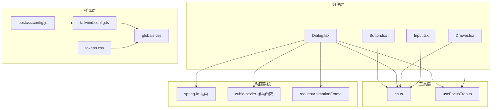
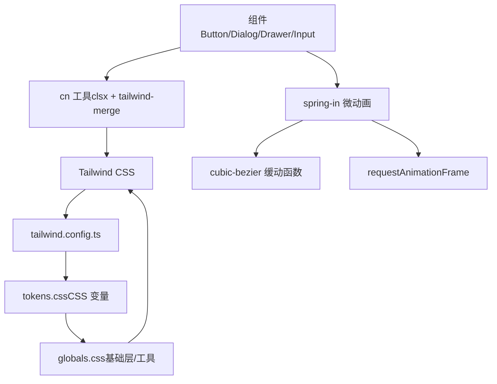
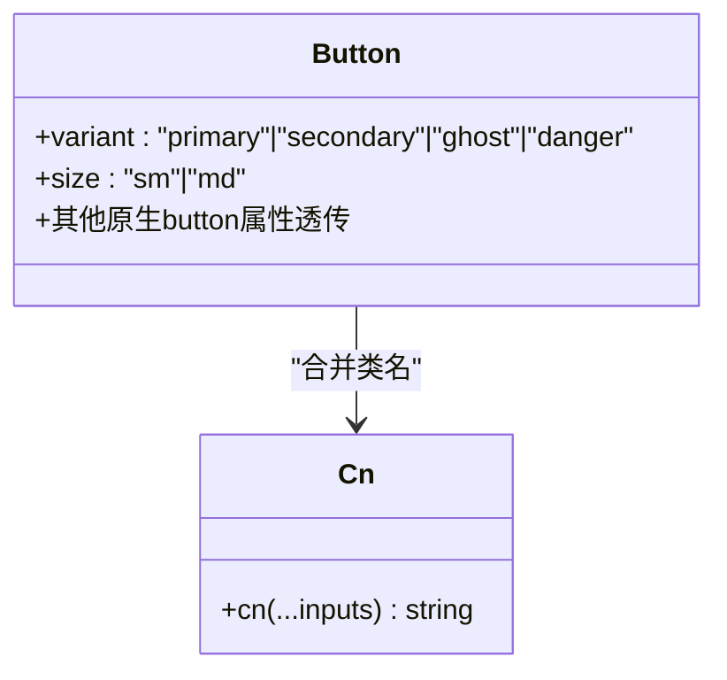
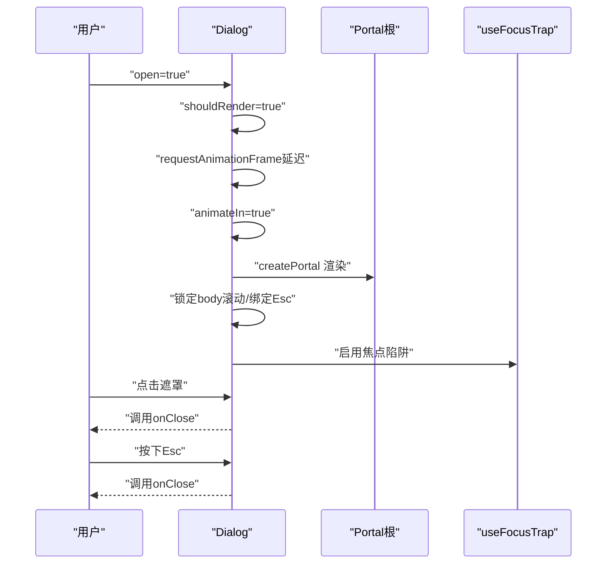
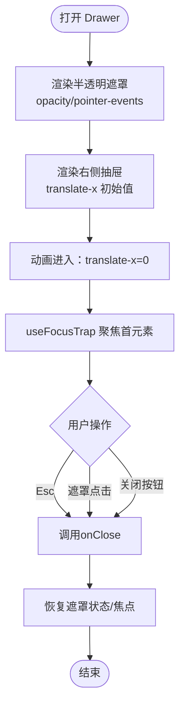
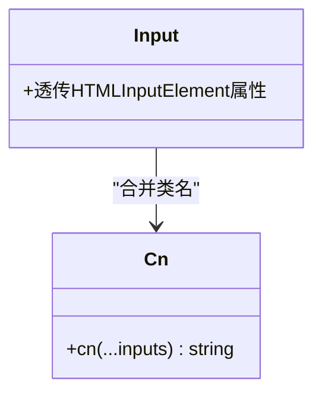
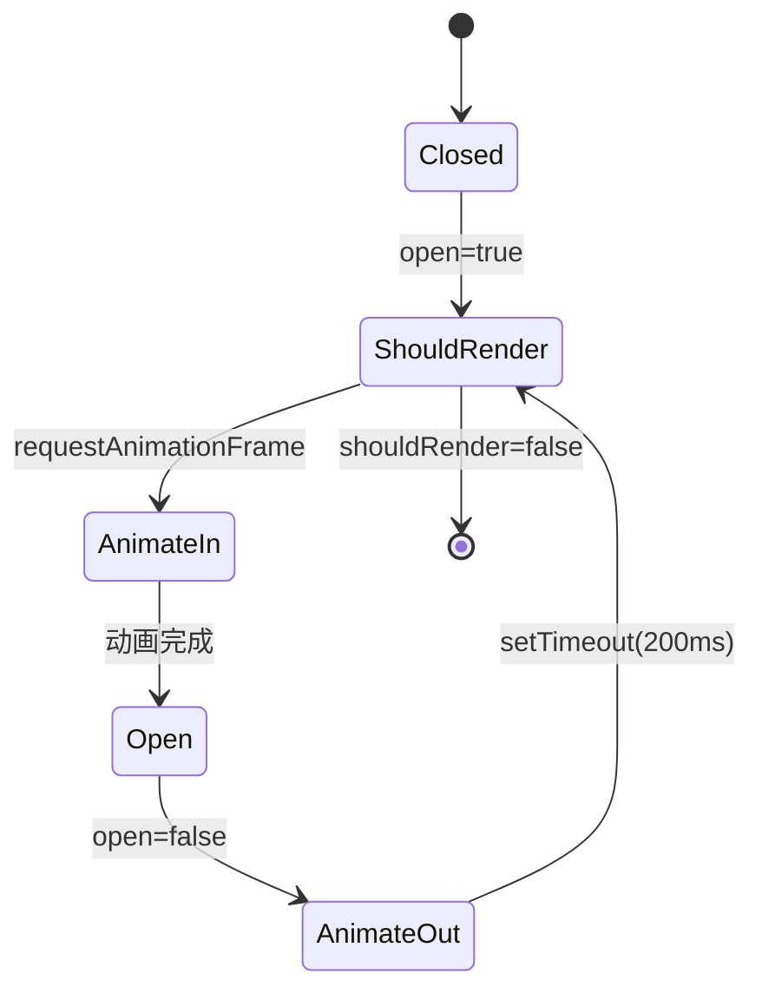
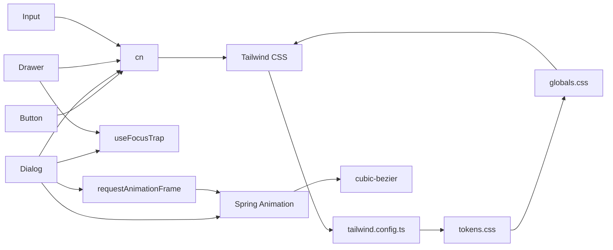
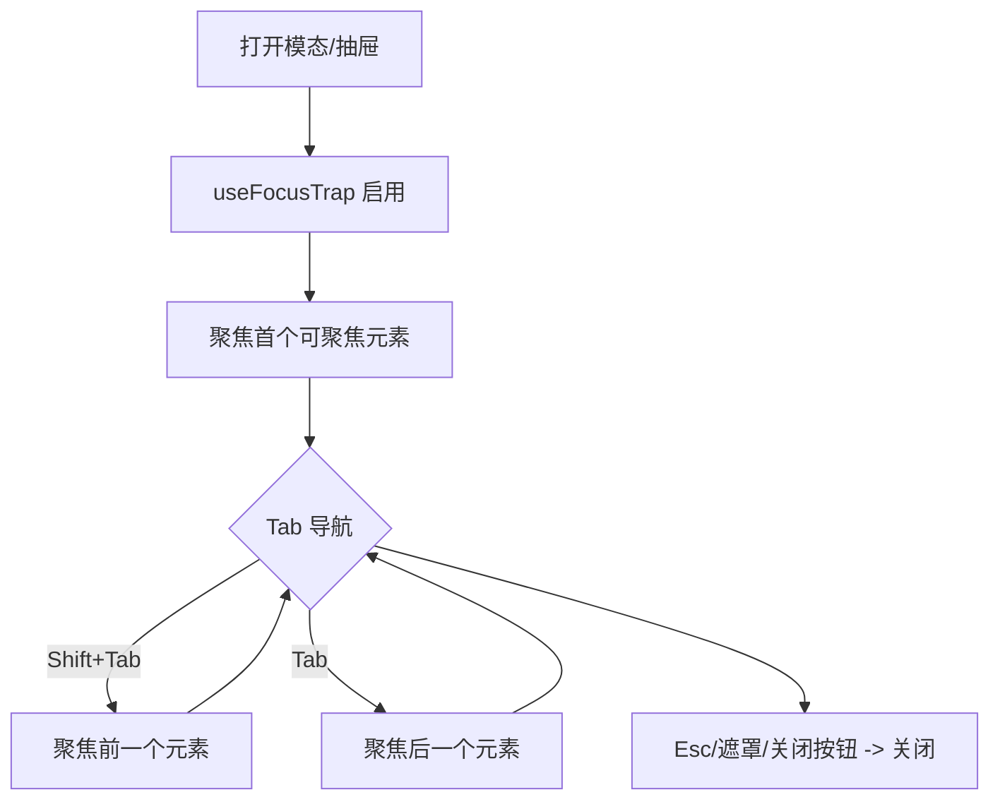
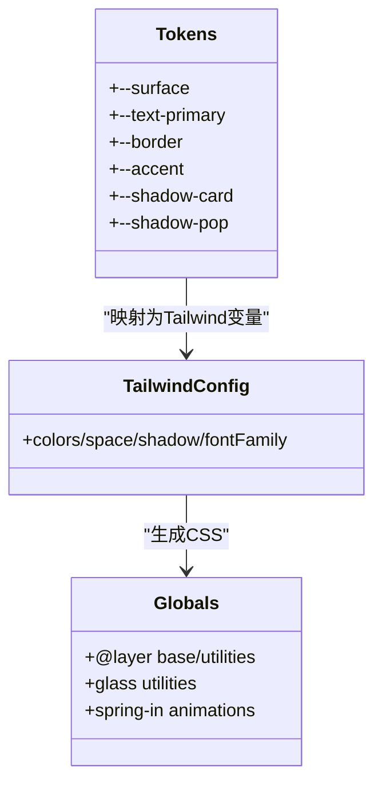

# UI 组件库

<cite>
**本文引用的文件**
- [src/components/ui/Button.tsx](file://src/components/ui/Button.tsx)
- [src/components/ui/Dialog.tsx](file://src/components/ui/Dialog.tsx)
- [src/components/ui/Drawer.tsx](file://src/components/ui/Drawer.tsx)
- [src/components/ui/Input.tsx](file://src/components/ui/Input.tsx)
- [src/lib/cn.ts](file://src/lib/cn.ts)
- [src/lib/useFocusTrap.ts](file://src/lib/useFocusTrap.ts)
- [src/styles/globals.css](file://src/styles/globals.css)
- [src/styles/tokens.css](file://src/styles/tokens.css)
- [tailwind.config.ts](file://tailwind.config.ts)
- [postcss.config.js](file://postcss.config.js)
- [src/components/ui/Button.test.tsx](file://src/components/ui/Button.test.tsx)
- [src/components/ui/Dialog.test.tsx](file://src/components/ui/Dialog.test.tsx)
- [src/components/ui/Drawer.test.tsx](file://src/components/ui/Drawer.test.tsx)
- [src/components/ui/Input.test.tsx](file://src/components/ui/Input.test.tsx)
- [src/lib/cn.test.ts](file://src/lib/cn.test.ts)
- [src/lib/theme.test.ts](file://src/lib/theme.test.ts)
- [package.json](file://package.json)
</cite>

## 更新摘要

**变更内容**

- 增强了基础 UI 组件的测试覆盖，完善了 Button、Dialog、Drawer、Input 的单元测试
- 优化了 Dialog 组件的动画状态管理，采用双状态模式确保动画与渲染同步
- 改进了 cn 工具函数的类名合并机制，增强了冲突处理能力
- 新增了微动画系统的完整实现，包括 spring-in 动画和自定义缓动函数
- 强化了无障碍支持的测试验证，确保焦点陷阱和键盘交互的可靠性

## 目录

1. [简介](#简介)
2. [项目结构](#项目结构)
3. [核心组件](#核心组件)
4. [架构总览](#架构总览)
5. [组件详解](#组件详解)
6. [微动画系统](#微动画系统)
7. [测试增强与质量保证](#测试增强与质量保证)
8. [依赖关系分析](#依赖关系分析)
9. [性能与渲染策略](#性能与渲染策略)
10. [无障碍与可访问性](#无障碍与可访问性)
11. [样式系统与定制指南](#样式系统与定制指南)
12. [响应式与跨浏览器兼容](#响应式与跨浏览器兼容)
13. [故障排查](#故障排查)
14. [结论](#结论)

## 简介

本文件为 UI 组件库的系统化文档，聚焦于 Tab 项目中的基础 UI 组件（Button、Dialog、Drawer、Input）及其样式体系。内容涵盖组件设计理念、属性与事件、类名合并工具 cn 的工作机制、基于 Tailwind CSS 的设计系统与原子化样式使用原则、微动画系统、无障碍支持与最佳实践、使用示例与 API 参考、响应式与跨浏览器兼容性、性能优化与渲染策略，并辅以可视化图示帮助理解。

## 项目结构

该组件库采用"按功能分层"的组织方式：组件位于 src/components/ui 下，样式通过 Tailwind 驱动并结合 CSS 变量主题系统；工具函数（如 cn、useFocusTrap）位于 src/lib；全局样式与设计令牌分别在 src/styles 中定义；构建与样式管线由 tailwind.config.ts 和 postcss.config.js 配置。



**图表来源**

- [src/components/ui/Button.tsx](file://src/components/ui/Button.tsx)
- [src/components/ui/Dialog.tsx](file://src/components/ui/Dialog.tsx)
- [src/components/ui/Drawer.tsx](file://src/components/ui/Drawer.tsx)
- [src/components/ui/Input.tsx](file://src/components/ui/Input.tsx)
- [src/lib/cn.ts](file://src/lib/cn.ts)
- [src/lib/useFocusTrap.ts](file://src/lib/useFocusTrap.ts)
- [src/styles/tokens.css](file://src/styles/tokens.css)
- [src/styles/globals.css](file://src/styles/globals.css)
- [tailwind.config.ts](file://tailwind.config.ts)
- [postcss.config.js](file://postcss.config.js)

**章节来源**

- [tailwind.config.ts](file://tailwind.config.ts)
- [postcss.config.js](file://postcss.config.js)
- [src/styles/globals.css](file://src/styles/globals.css)
- [src/styles/tokens.css](file://src/styles/tokens.css)

## 核心组件

本节概述四个基础组件的职责与共性：

- Button：提供多变体与尺寸的按钮，支持禁用态与过渡动画。
- Dialog：模态对话框，支持 Esc 关闭、焦点陷阱、点击遮罩关闭等，现已集成微动画系统。
- Drawer：右侧抽屉面板，支持 Esc 关闭、背景遮罩与滑入动画。
- Input：输入框，统一边框、阴影、聚焦态与占位符样式。

这些组件均通过 cn 合并类名，遵循 Tailwind 原子化与主题变量驱动的样式策略，并在动画方面采用了统一的微动画标准。

**章节来源**

- [src/components/ui/Button.tsx](file://src/components/ui/Button.tsx)
- [src/components/ui/Dialog.tsx](file://src/components/ui/Dialog.tsx)
- [src/components/ui/Drawer.tsx](file://src/components/ui/Drawer.tsx)
- [src/components/ui/Input.tsx](file://src/components/ui/Input.tsx)

## 架构总览

下图展示组件与样式系统的交互关系：组件通过 cn 合并类名，Tailwind 将其解析为实际 CSS；主题变量在 tokens.css 中定义，通过 tailwind.config.ts 映射到颜色、圆角、阴影与字体族；globals.css 提供基础层与玻璃效果等实用工具；新增的微动画系统通过 CSS Keyframes 和 requestAnimationFrame 提供流畅的交互体验。



**图表来源**

- [src/lib/cn.ts](file://src/lib/cn.ts)
- [tailwind.config.ts](file://tailwind.config.ts)
- [src/styles/tokens.css](file://src/styles/tokens.css)
- [src/styles/globals.css](file://src/styles/globals.css)

## 组件详解

### Button 组件

- 设计理念：通过变体（primary/secondary/ghost/danger）与尺寸（sm/md）组合，提供一致的视觉与交互反馈。
- 关键属性
  - variant：按钮外观变体，默认 secondary。
  - size：按钮尺寸，默认 md。
  - 其他原生 button 属性透传。
- 样式要点
  - 使用 cn 合并默认基类、变体类、尺寸类与自定义类。
  - 支持禁用态、悬停、激活缩放与过渡动画。
  - 采用 active:scale-[0.98] 提供按压反馈。
- 可访问性
  - 作为 button 渲染，天然具备键盘可达性。
- 测试覆盖
  - 默认变体、各变体类名、默认尺寸、sm 尺寸、类名合并、禁用态、属性透传。



**图表来源**

- [src/components/ui/Button.tsx](file://src/components/ui/Button.tsx)
- [src/lib/cn.ts](file://src/lib/cn.ts)

**章节来源**

- [src/components/ui/Button.tsx](file://src/components/ui/Button.tsx)
- [src/components/ui/Button.test.tsx](file://src/components/ui/Button.test.tsx)

### Dialog 组件

- 设计理念：在全屏遮罩上呈现卡片式内容，支持 Esc 关闭、点击遮罩关闭、焦点陷阱与无障碍属性，现已集成微动画系统。
- 关键属性
  - open：是否显示。
  - onClose：回调函数。
  - title：标题文本。
  - children：内容节点。
  - className：自定义类名。
- 核心行为
  - 使用 Portal 将内容挂载到 #portal-root 或 body。
  - 打开时锁定 body 滚动，Esc 触发关闭。
  - 点击遮罩关闭，阻止事件冒泡至容器。
  - 使用 useFocusTrap 确保焦点循环。
  - **新增**：采用双状态管理（shouldRender/animateIn）确保动画与渲染的同步。
  - **新增**：使用 requestAnimationFrame 确保动画在下一帧开始，避免同步更新问题。
- 无障碍
  - role="dialog"、aria-modal="true"、aria-label=title。
- 测试覆盖
  - 关闭状态不渲染、打开渲染标题与内容、遮罩点击关闭、Esc 关闭、内容点击不关闭、关闭按钮、无标题场景。



**图表来源**

- [src/components/ui/Dialog.tsx](file://src/components/ui/Dialog.tsx)
- [src/lib/useFocusTrap.ts](file://src/lib/useFocusTrap.ts)

**章节来源**

- [src/components/ui/Dialog.tsx](file://src/components/ui/Dialog.tsx)
- [src/components/ui/Dialog.test.tsx](file://src/components/ui/Dialog.test.tsx)

### Drawer 组件

- 设计理念：右侧滑入式抽屉，适合设置面板或侧栏内容。
- 关键属性
  - open：是否显示。
  - onClose：回调函数。
  - title：标题文本。
  - children：内容节点。
- 核心行为
  - 背景遮罩透明度与指针事件随 open 切换。
  - 抽屉通过 translate-x 控制显隐与动画。
  - Esc 关闭、遮罩点击关闭。
  - 使用 useFocusTrap 确保焦点循环。
- 无障碍
  - role="dialog"、aria-modal="true"、aria-label=title。
- 测试覆盖
  - 关闭时隐藏（translate-x）、打开时可见、标题渲染、遮罩点击关闭、Esc 关闭。



**图表来源**

- [src/components/ui/Drawer.tsx](file://src/components/ui/Drawer.tsx)
- [src/lib/useFocusTrap.ts](file://src/lib/useFocusTrap.ts)

**章节来源**

- [src/components/ui/Drawer.tsx](file://src/components/ui/Drawer.tsx)
- [src/components/ui/Drawer.test.tsx](file://src/components/ui/Drawer.test.tsx)

### Input 组件

- 设计理念：统一输入框的边框、背景、阴影、聚焦态与占位符样式。
- 关键属性
  - 透传所有原生 input 属性（type、placeholder、defaultValue、disabled 等）。
- 样式要点
  - 使用 cn 合并默认基类、尺寸、边框、背景、文字颜色、阴影与聚焦态。
  - 采用 focus:border-accent/50 和 focus:ring-1 的组合提供清晰的聚焦指示。
- 测试覆盖
  - 渲染为 textbox、占位符、类名透传、禁用态、默认值、type 透传。



**图表来源**

- [src/components/ui/Input.tsx](file://src/components/ui/Input.tsx)
- [src/lib/cn.ts](file://src/lib/cn.ts)

**章节来源**

- [src/components/ui/Input.tsx](file://src/components/ui/Input.tsx)
- [src/components/ui/Input.test.tsx](file://src/components/ui/Input.test.tsx)

## 微动画系统

### Spring 动画系统概述

组件库新增了完整的微动画系统，专注于提供自然、流畅的交互体验。该系统基于 CSS Keyframes 和 requestAnimationFrame，为模态对话框和交互元素提供精心设计的动画效果。

### Spring-In 动画

Spring-in 动画是微动画系统的核心，专为模态对话框设计，提供类似弹簧的进入效果：

```css
@keyframes spring-in {
  0% {
    transform: scale(0.6);
    opacity: 0;
  }
  60% {
    transform: scale(1.15);
  }
  100% {
    transform: scale(1);
    opacity: 1;
  }
}

.animate-spring-in {
  animation: spring-in 0.25s cubic-bezier(0.34, 1.56, 0.64, 1) forwards;
}
```

**动画特性**

- **持续时间**：0.25 秒，提供即时反馈同时保持流畅感
- **缓动函数**：cubic-bezier(0.34, 1.56, 0.64, 1)，创造自然的弹性效果
- **关键帧**：从 60% 缩放到 115%，然后回到 100%
- **透明度**：从 0 到 100% 的平滑过渡

### 动画状态管理

Dialog 组件采用了双状态管理模式来确保动画与渲染的完美同步：



**状态管理机制**

- `shouldRender`：控制组件的实际渲染
- `animateIn`：控制动画状态的切换
- 使用 `requestAnimationFrame` 确保动画在下一帧开始
- 使用 `setTimeout` 管理动画结束后的清理

### 缓动函数设计

自定义缓动函数 cubic-bezier(0.34, 1.56, 0.64, 1) 提供了独特的弹性效果：

- **起始阶段**：0.34 的 x 值确保快速启动
- **弹性阶段**：1.56 的 y 值创造明显的弹性回弹
- **收尾阶段**：0.64 的 x 值提供平滑的最终收敛

### 性能优化

- 使用 `requestAnimationFrame` 确保动画与浏览器刷新率同步
- 通过 `shouldRender` 状态管理避免不必要的渲染
- 动画完成后及时清理定时器和事件监听器

**章节来源**

- [src/styles/globals.css](file://src/styles/globals.css)
- [src/components/ui/Dialog.tsx](file://src/components/ui/Dialog.tsx)

## 测试增强与质量保证

### 测试框架与工具

组件库采用 Vitest + Testing Library 进行单元测试，确保组件的可靠性和稳定性。测试覆盖了核心功能、边界条件和错误处理场景。

### Button 组件测试增强

Button 组件的测试覆盖了以下关键场景：

- 子元素文本渲染验证
- 默认 secondary 变体的正确应用
- 各种变体（primary、ghost、danger）的类名应用
- 尺寸变体（sm、md）的正确实现
- 自定义类名的合并机制
- 禁用状态的正确处理
- HTML 属性的透传功能

### Dialog 组件测试增强

Dialog 组件的测试重点包括：

- 关闭状态下的空渲染验证
- 打开状态下的内容和标题渲染
- 遮罩点击事件的正确处理
- Esc 键盘事件的响应
- 内容区域点击的事件冒泡阻止
- 关闭按钮的功能验证
- 无标题场景的兼容性

### Drawer 组件测试增强

Drawer 组件的测试涵盖了：

- 关闭状态下的隐藏效果（translate-x-full）
- 打开状态下的可见性（translate-x-0）
- 标题文本的正确渲染
- 遮罩点击事件的处理
- Esc 键盘事件的响应

### Input 组件测试增强

Input 组件的测试验证了：

- 输入元素的正确渲染
- 占位符文本的显示
- 自定义类名的透传
- 禁用状态的处理
- 默认值的正确设置
- type 属性的透传

### cn 工具函数测试

cn 工具函数的测试确保了类名合并的正确性：

- 基础类名合并功能
- 条件类名的正确处理
- Tailwind 冲突类的去重
- 空输入的处理
- undefined 和 null 值的容错

### 无障碍测试验证

通过测试验证了组件的无障碍功能：

- role 属性的正确设置
- aria-modal 属性的应用
- aria-label 的动态更新
- Tab 键导航的焦点管理
- Esc 键关闭功能的验证

**章节来源**

- [src/components/ui/Button.test.tsx](file://src/components/ui/Button.test.tsx)
- [src/components/ui/Dialog.test.tsx](file://src/components/ui/Dialog.test.tsx)
- [src/components/ui/Drawer.test.tsx](file://src/components/ui/Drawer.test.tsx)
- [src/components/ui/Input.test.tsx](file://src/components/ui/Input.test.tsx)
- [src/lib/cn.test.ts](file://src/lib/cn.test.ts)

## 依赖关系分析

- 组件依赖 cn 进行类名合并，确保默认类、变体/尺寸类与自定义类的正确优先级与冲突消除。
- Dialog 与 Drawer 共同依赖 useFocusTrap 实现焦点循环，提升可访问性。
- Tailwind 通过 tailwind.config.ts 将 tokens.css 中的 CSS 变量映射为颜色、圆角、阴影与字体族，最终由 globals.css 的 @layer base 与 utilities 定义基础与增强样式。
- PostCSS 在构建阶段应用 Tailwind 与 Autoprefixer。
- **新增**：微动画系统依赖 requestAnimationFrame 和自定义 CSS Keyframes。



**图表来源**

- [src/lib/cn.ts](file://src/lib/cn.ts)
- [src/lib/useFocusTrap.ts](file://src/lib/useFocusTrap.ts)
- [tailwind.config.ts](file://tailwind.config.ts)
- [src/styles/tokens.css](file://src/styles/tokens.css)
- [src/styles/globals.css](file://src/styles/globals.css)

**章节来源**

- [package.json](file://package.json)
- [tailwind.config.ts](file://tailwind.config.ts)
- [postcss.config.js](file://postcss.config.js)

## 性能与渲染策略

- 类名合并
  - 使用 clsx 与 tailwind-merge 合并类名，避免重复与冲突，减少无效样式计算。
- 动画与过渡
  - **更新**：统一使用 CSS transition 与 transform，配合 requestAnimationFrame 确保焦点陷阱初始聚焦时机。
  - **新增**：微动画系统采用 CSS Keyframes 和自定义缓动函数，提供更自然的动画效果。
  - **新增**：Dialog 组件使用双状态管理模式，通过 shouldRender 和 animateIn 确保动画与渲染的同步。
- 按需渲染
  - Dialog 在未 open 时不渲染任何节点，Drawer 通过 translate-x 控制显隐而非卸载，降低重排成本。
  - **新增**：Dialog 动画结束后才真正移除组件，确保动画完整性。
- 主题变量
  - CSS 变量集中管理，切换主题仅需切换类名，避免大量样式重算。
- 构建优化
  - Tailwind 内容扫描限定在 src 目录，减少未使用样式体积。
- **新增**：动画性能优化
  - 使用 requestAnimationFrame 确保动画与浏览器刷新率同步
  - 通过定时器管理动画生命周期，避免内存泄漏

**章节来源**

- [src/lib/cn.ts](file://src/lib/cn.ts)
- [src/lib/useFocusTrap.ts](file://src/lib/useFocusTrap.ts)
- [src/components/ui/Dialog.tsx](file://src/components/ui/Dialog.tsx)
- [src/components/ui/Drawer.tsx](file://src/components/ui/Drawer.tsx)
- [tailwind.config.ts](file://tailwind.config.ts)

## 无障碍与可访问性

- 焦点管理
  - useFocusTrap 在容器内循环焦点，支持 Shift+Tab 与 Tab 键顺序导航，必要时将容器设为可聚焦元素。
- 对话框语义
  - Dialog 与 Drawer 均设置 role="dialog"、aria-modal="true"，并提供 aria-label（标题）。
- 键盘交互
  - Esc 关闭、点击遮罩关闭、按钮关闭。
- 文本对比度
  - 通过 tokens.css 的多主题变量与 glass-mode 适配不同壁纸亮度，保证文本可读性。
- 减少动画偏好
  - globals.css 提供基于 prefers-reduced-motion 的降级策略，减少不必要的动画与过渡。
- **新增**：动画可访问性
  - 微动画系统支持 prefers-reduced-motion 媒体查询，为有动画敏感性的用户提供降级选项
  - 动画时长和缓动函数可根据用户偏好进行调整



**图表来源**

- [src/lib/useFocusTrap.ts](file://src/lib/useFocusTrap.ts)
- [src/components/ui/Dialog.tsx](file://src/components/ui/Dialog.tsx)
- [src/components/ui/Drawer.tsx](file://src/components/ui/Drawer.tsx)
- [src/styles/globals.css](file://src/styles/globals.css)

**章节来源**

- [src/lib/useFocusTrap.ts](file://src/lib/useFocusTrap.ts)
- [src/components/ui/Dialog.tsx](file://src/components/ui/Dialog.tsx)
- [src/components/ui/Drawer.tsx](file://src/components/ui/Drawer.tsx)
- [src/styles/globals.css](file://src/styles/globals.css)

## 样式系统与定制指南

- 设计系统基础
  - Tailwind 通过 tailwind.config.ts 将 tokens.css 的 CSS 变量映射为颜色、圆角、阴影与字体族。
  - globals.css 使用 @layer base 与 utilities 定义基础样式与玻璃效果工具类。
  - **新增**：globals.css 包含完整的微动画系统，包括 spring-in 动画和相关工具类。
- 变体与尺寸
  - Button 的变体（primary/secondary/ghost/danger）与尺寸（sm/md）通过常量表集中管理，便于扩展。
- 类名合并策略
  - cn 工具使用 clsx 与 tailwind-merge，确保自定义类名覆盖默认类名且无冲突。
- 自定义样式
  - 通过 className 透传自定义类名；如需新增变体/尺寸，建议在组件内部常量表中扩展，并在 cn 合并链中保持顺序正确。
  - **新增**：可使用 .animate-spring-in 类名应用微动画效果。
- 主题与模式
  - 通过 .dark、.glass-mode、wallpaper-\* 等类名切换主题与壁纸适配，无需修改组件内部样式。
- **新增**：动画定制指南
  - 可通过自定义 CSS 变量调整动画时长和缓动函数
  - 支持禁用特定动画效果以适应不同用户需求
  - 可扩展微动画系统以支持更多交互场景



**图表来源**

- [src/styles/tokens.css](file://src/styles/tokens.css)
- [tailwind.config.ts](file://tailwind.config.ts)
- [src/styles/globals.css](file://src/styles/globals.css)

**章节来源**

- [src/styles/tokens.css](file://src/styles/tokens.css)
- [tailwind.config.ts](file://tailwind.config.ts)
- [src/styles/globals.css](file://src/styles/globals.css)
- [src/lib/cn.ts](file://src/lib/cn.ts)

## 响应式与跨浏览器兼容

- 响应式
  - 组件尺寸与布局使用相对单位与 Tailwind 工具类，配合断点类名实现响应式表现。
- 跨浏览器
  - PostCSS 自动添加厂商前缀，确保旧版浏览器兼容。
  - 使用 CSS 变量与现代特性（backdrop-filter、transform），在不支持的环境中回退到安全样式。
  - **新增**：微动画系统提供优雅降级，在不支持 CSS Keyframes 的浏览器中自动回退到简单过渡效果。
- 字体与渲染
  - globals.css 指定系统字体栈与抗锯齿参数，提升跨平台一致性。

**章节来源**

- [postcss.config.js](file://postcss.config.js)
- [src/styles/globals.css](file://src/styles/globals.css)

## 故障排查

- Dialog/Drawer 不显示
  - 确认已存在 #portal-root 或允许挂载到 body。
  - 检查 open 状态与 className 是否包含显隐控制类。
  - **新增**：检查 shouldRender 状态是否正确设置。
- Esc 无法关闭
  - 确认窗口级键盘事件绑定成功，且未被外部拦截。
- 焦点未被锁定
  - 检查 useFocusTrap 返回的 ref 是否正确挂载到容器，容器内是否存在可聚焦元素。
- 样式冲突
  - 使用 cn 合并类名时注意顺序，确保自定义类名在最后以覆盖默认类。
- 动画异常
  - 检查 prefers-reduced-motion 设置与 globals.css 中的降级规则。
  - **新增**：确认 requestAnimationFrame 是否正常工作，检查动画状态管理逻辑。
  - **新增**：验证 CSS Keyframes 是否正确加载，检查 cubic-bezier 缓动函数语法。
- **新增**：微动画问题排查
  - 检查 .animate-spring-in 类名是否正确应用
  - 验证动画时长和缓动函数是否符合预期
  - 确认动画状态切换逻辑（shouldRender/animateIn）是否正确执行

**章节来源**

- [src/components/ui/Dialog.tsx](file://src/components/ui/Dialog.tsx)
- [src/components/ui/Drawer.tsx](file://src/components/ui/Drawer.tsx)
- [src/lib/useFocusTrap.ts](file://src/lib/useFocusTrap.ts)
- [src/lib/cn.ts](file://src/lib/cn.ts)
- [src/styles/globals.css](file://src/styles/globals.css)

## 结论

该 UI 组件库以 Tailwind 原子化样式为核心，结合 CSS 变量主题系统与 cn 工具实现一致、可扩展且高性能的组件体验。**最新更新**引入了完整的微动画系统，通过基于弹簧的进入动画和自定义三次贝塞尔缓动函数，为模态对话框和交互元素提供了更加自然流畅的用户体验。

Dialog 与 Drawer 通过 Portal 与焦点陷阱提供良好的可访问性；Button 与 Input 提供清晰的变体与尺寸体系。**新增的微动画系统**通过 requestAnimationFrame 和双状态管理模式，确保动画与渲染的完美同步，同时保持优秀的性能表现。

**测试增强**显著提升了组件的可靠性，通过全面的单元测试覆盖了核心功能、边界条件和无障碍特性。cn 工具函数的优化确保了类名合并的正确性和效率。

通过合理的依赖与构建配置，组件在响应式与跨浏览器方面具备良好表现。**微动画系统的加入**进一步提升了产品的整体质感，为用户提供了更加现代化和专业的交互体验。建议在扩展新组件时复用现有模式：使用 cn 合并类名、提供明确的变体/尺寸常量、遵循无障碍最佳实践、应用微动画系统，并在测试中覆盖关键交互路径和动画效果。
