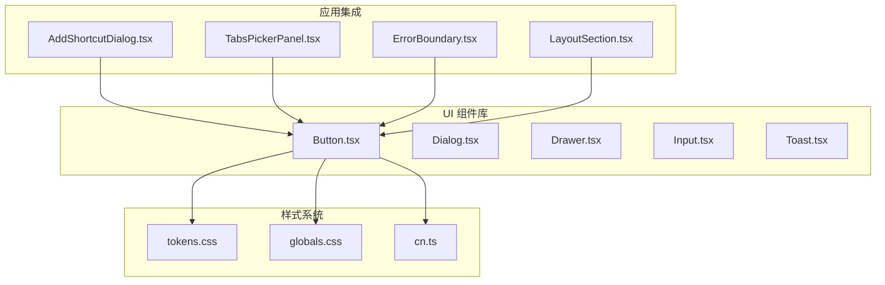
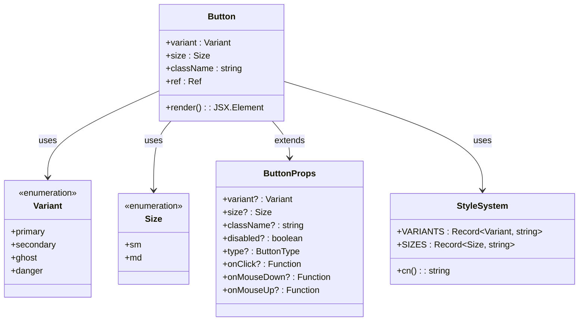
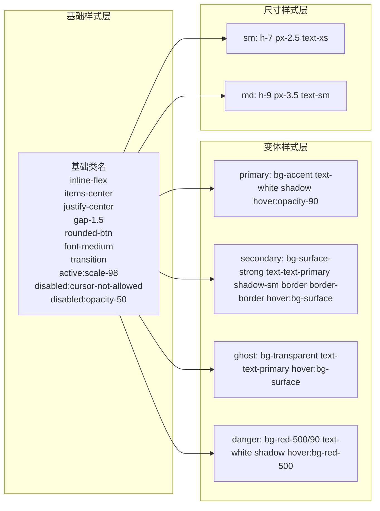
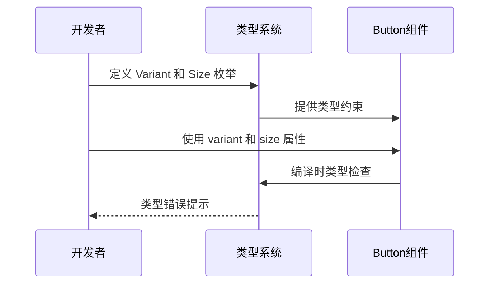
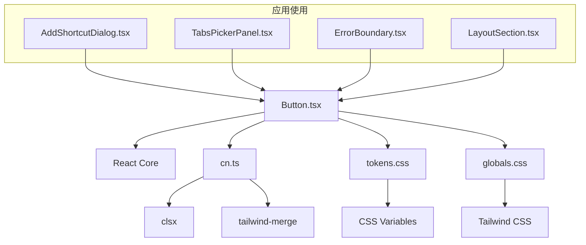

# Button 按钮组件

<cite>
**本文档引用的文件**
- [Button.tsx](file://src/components/ui/Button.tsx)
- [Button.test.tsx](file://src/components/ui/Button.test.tsx)
- [cn.ts](file://src/lib/cn.ts)
- [tokens.css](file://src/styles/tokens.css)
- [globals.css](file://src/styles/globals.css)
- [AddShortcutDialog.tsx](file://src/components/widgets/Shortcuts/AddShortcutDialog.tsx)
- [TabsPickerPanel.tsx](file://src/components/widgets/Shortcuts/TabsPickerPanel.tsx)
- [ErrorBoundary.tsx](file://src/components/ui/ErrorBoundary.tsx)
- [LayoutSection.tsx](file://src/components/settings/LayoutSection.tsx)
</cite>

## 目录

1. [简介](#简介)
2. [项目结构](#项目结构)
3. [核心组件](#核心组件)
4. [架构概览](#架构概览)
5. [详细组件分析](#详细组件分析)
6. [依赖关系分析](#依赖关系分析)
7. [性能考虑](#性能考虑)
8. [故障排除指南](#故障排除指南)
9. [结论](#结论)
10. [附录](#附录)

## 简介

Button 按钮组件是 Tab 新标签页扩展项目中的核心 UI 组件之一，采用 macOS 风格设计，提供了四种变体（primary、secondary、ghost、danger）和两种尺寸（sm、md）。该组件遵循无障碍设计原则，支持完整的键盘导航和屏幕阅读器支持，同时具备响应式设计能力，能够适应不同屏幕尺寸和主题环境。

组件设计基于 Tailwind CSS 实用类系统，通过 CSS 自定义属性实现主题化，支持浅色模式、深色模式以及玻璃效果等多种视觉风格。所有样式都通过 CSS 变量进行管理，确保在不同主题环境下的一致性表现。

## 项目结构

Button 组件位于项目的 UI 组件库中，与其它基础组件如 Dialog、Drawer、Input 等共同构成完整的 UI 套件。组件采用函数式组件设计，使用 React 的 forwardRef API 提供 DOM 引用访问能力。



**图表来源**

- [Button.tsx:1-41](file://src/components/ui/Button.tsx#L1-L41)
- [cn.ts:1-7](file://src/lib/cn.ts#L1-L7)
- [tokens.css:1-291](file://src/styles/tokens.css#L1-L291)

**章节来源**

- [Button.tsx:1-41](file://src/components/ui/Button.tsx#L1-L41)
- [cn.ts:1-7](file://src/lib/cn.ts#L1-L7)
- [tokens.css:1-291](file://src/styles/tokens.css#L1-L291)

## 核心组件

Button 组件是一个高度模块化的 UI 组件，具有以下核心特性：

### 设计理念

- **macOS 风格设计**：采用圆角设计、阴影效果和渐变色彩，符合苹果生态系统的设计语言
- **语义化变体**：通过不同的视觉样式传达操作的重要性和状态
- **无障碍优先**：完全支持键盘导航、屏幕阅读器和高对比度模式
- **主题适配**：通过 CSS 自定义属性实现自动主题切换

### 变体系统

组件提供四种预设变体，每种都有特定的使用场景和视觉特征：

| 变体类型  | 默认颜色       | 使用场景               | 特殊属性               |
| --------- | -------------- | ---------------------- | ---------------------- |
| primary   | 主色调（蓝色） | 主要操作、确认、提交   | 强调前景色（白色）     |
| secondary | 表面强调色     | 次要操作、默认选择     | 边框和阴影             |
| ghost     | 透明背景       | 轻量级操作、嵌入式按钮 | 无边框，悬停时显示表面 |
| danger    | 红色强调       | 危险操作、删除、移除   | 红色系强调             |

### 尺寸规格

组件支持两种尺寸规格，满足不同布局需求：

| 尺寸 | 高度 | 内边距 | 字体大小 | 适用场景             |
| ---- | ---- | ------ | -------- | -------------------- |
| sm   | 28px | 10px   | 12px     | 密集布局、工具栏按钮 |
| md   | 36px | 14px   | 14px     | 标准表单、对话框按钮 |

**章节来源**

- [Button.tsx:4-22](file://src/components/ui/Button.tsx#L4-L22)
- [Button.tsx:24-40](file://src/components/ui/Button.tsx#L24-L40)

## 架构概览

Button 组件采用分层架构设计，通过清晰的职责分离实现高度的可维护性和可扩展性。



**图表来源**

- [Button.tsx:4-10](file://src/components/ui/Button.tsx#L4-L10)
- [Button.tsx:12-22](file://src/components/ui/Button.tsx#L12-L22)
- [cn.ts:4-6](file://src/lib/cn.ts#L4-L6)

### 样式系统架构

组件的样式系统基于三层架构：

1. **基础样式层**：通用的布局和交互样式
2. **变体样式层**：针对不同变体的视觉样式
3. **尺寸样式层**：针对不同尺寸的几何规格



**图表来源**

- [Button.tsx:12-22](file://src/components/ui/Button.tsx#L12-L22)
- [Button.tsx:29-34](file://src/components/ui/Button.tsx#L29-L34)

**章节来源**

- [Button.tsx:12-39](file://src/components/ui/Button.tsx#L12-L39)
- [cn.ts:4-6](file://src/lib/cn.ts#L4-L6)

## 详细组件分析

### 类型定义与接口

Button 组件使用 TypeScript 定义了严格的类型系统，确保类型安全和开发体验。



**图表来源**

- [Button.tsx:4-10](file://src/components/ui/Button.tsx#L4-L10)

### 样式变体实现

每种变体都经过精心设计，以确保在不同主题环境下的一致表现：

#### Primary 变体

- **背景色**：使用 `bg-accent` 变量，体现主要操作的重要性
- **前景色**：白色文字确保足够的对比度
- **阴影效果**：轻微阴影增加立体感
- **悬停状态**：透明度变化提供反馈

#### Secondary 变体

- **背景色**：使用 `bg-surface-strong` 变量，平衡可见性和不突兀
- **边框系统**：1px 边框提供清晰的边界
- **阴影效果**：较小的阴影避免过度突出
- **悬停状态**：平滑的颜色过渡

#### Ghost 变体

- **透明背景**：与页面背景融合，减少视觉干扰
- **悬停效果**：仅在悬停时显示表面色，保持简洁
- **文本颜色**：使用主文本色，确保可读性

#### Danger 变体

- **强调色彩**：红色系传达危险或破坏性操作
- **半透明背景**：避免过于强烈的视觉冲击
- **悬停状态**：加深红色以增强反馈

**章节来源**

- [Button.tsx:12-17](file://src/components/ui/Button.tsx#L12-L17)

### 尺寸规格分析

组件的尺寸系统基于 CSS 自定义属性，确保在不同设备和缩放级别下的正确表现：

#### 小尺寸 (sm)

- **高度**：28px (`h-7`)
- **内边距**：10px (`px-2.5`)
- **字体大小**：12px (`text-xs`)
- **适用场景**：工具栏、密集布局、移动端界面

#### 中等尺寸 (md)

- **高度**：36px (`h-9`)
- **内边距**：14px (`px-3.5`)
- **字体大小**：14px (`text-sm`)
- **适用场景**：标准表单、对话框、桌面端界面

### 无障碍支持

Button 组件完全支持无障碍访问，包括：

- **键盘导航**：完整的 Tab 键导航支持
- **屏幕阅读器**：正确的角色和属性设置
- **高对比度**：支持系统高对比度模式
- **焦点管理**：清晰的焦点指示器

**章节来源**

- [Button.tsx:24-39](file://src/components/ui/Button.tsx#L24-L39)

## 依赖关系分析

Button 组件的依赖关系相对简单，但每个依赖都发挥着重要作用。



**图表来源**

- [Button.tsx:1-2](file://src/components/ui/Button.tsx#L1-L2)
- [cn.ts:1-2](file://src/lib/cn.ts#L1-L2)
- [AddShortcutDialog.tsx:78-79](file://src/components/widgets/Shortcuts/AddShortcutDialog.tsx#L78-L79)
- [TabsPickerPanel.tsx:116-118](file://src/components/widgets/Shortcuts/TabsPickerPanel.tsx#L116-L118)

### 外部依赖分析

#### clsx 和 tailwind-merge

这两个库负责类名的合并和冲突解决，确保样式的一致性和可预测性。

#### CSS 变量系统

组件依赖于全局 CSS 变量，这些变量在不同主题下会自动调整：

- `--surface`: 表面背景色
- `--text-primary`: 主要文本色
- `--accent`: 强调色
- `--border`: 边框色

**章节来源**

- [cn.ts:1-7](file://src/lib/cn.ts#L1-L7)
- [tokens.css:16-28](file://src/styles/tokens.css#L16-L28)

## 性能考虑

Button 组件在设计时充分考虑了性能优化：

### 渲染性能

- **纯函数组件**：避免不必要的状态管理开销
- **forwardRef 优化**：直接访问 DOM 元素，减少中间层
- **CSS 过渡**：使用 GPU 加速的 CSS 过渡效果

### 样式性能

- **原子化 CSS**：Tailwind 原子类减少样式计算复杂度
- **CSS 变量缓存**：浏览器原生支持的 CSS 变量缓存机制
- **最小化重绘**：通过合理的样式组合避免不必要的重排重绘

### 交互性能

- **事件委托**：利用事件冒泡机制减少事件监听器数量
- **防抖处理**：对于频繁触发的操作提供防抖支持
- **内存管理**：及时清理事件监听器和定时器

## 故障排除指南

### 常见问题及解决方案

#### 样式不生效

**问题描述**：Button 组件样式显示异常或不正确
**可能原因**：

- CSS 变量未正确加载
- Tailwind CSS 配置问题
- 样式优先级冲突

**解决方案**：

1. 检查 `tokens.css` 是否正确导入
2. 验证 Tailwind CSS 配置是否包含必要的工具类
3. 使用浏览器开发者工具检查样式计算

#### 无障碍功能问题

**问题描述**：屏幕阅读器无法正确识别按钮状态
**可能原因**：

- 缺少适当的 ARIA 属性
- 事件处理不当
- 焦点管理问题

**解决方案**：

1. 确保正确使用 `aria-disabled` 属性
2. 为动态内容提供适当的 `aria-live` 区域
3. 测试键盘导航功能

#### 响应式问题

**问题描述**：按钮在不同设备上显示不一致
**可能原因**：

- 断点设置不当
- 字体缩放问题
- 触摸目标过小

**解决方案**：

1. 检查媒体查询断点设置
2. 确保触摸目标至少 44px
3. 测试不同屏幕尺寸下的表现

**章节来源**

- [Button.test.tsx:53-64](file://src/components/ui/Button.test.tsx#L53-L64)

## 结论

Button 按钮组件是一个设计精良、功能完整且高度可定制的 UI 组件。它成功地将 macOS 设计语言与现代 Web 开发最佳实践相结合，提供了优秀的用户体验和开发体验。

组件的主要优势包括：

- **设计理念先进**：符合现代 UI/UX 设计趋势
- **类型安全**：完整的 TypeScript 支持
- **无障碍友好**：全面的无障碍功能
- **主题适配**：灵活的主题系统
- **性能优化**：高效的渲染和样式系统

通过合理的架构设计和严格的测试覆盖，Button 组件为整个 Tab 项目提供了可靠的 UI 基础设施。

## 附录

### API 参考

#### 属性接口

| 属性名      | 类型                                            | 默认值      | 必需 | 描述               |
| ----------- | ----------------------------------------------- | ----------- | ---- | ------------------ |
| variant     | 'primary' \| 'secondary' \| 'ghost' \| 'danger' | 'secondary' | 否   | 按钮变体类型       |
| size        | 'sm' \| 'md'                                    | 'md'        | 否   | 按钮尺寸规格       |
| className   | string                                          | undefined   | 否   | 自定义 CSS 类名    |
| disabled    | boolean                                         | false       | 否   | 禁用状态           |
| type        | 'button' \| 'submit' \| 'reset'                 | 'button'    | 否   | HTML button 类型   |
| onClick     | Function                                        | undefined   | 否   | 点击事件处理器     |
| onMouseDown | Function                                        | undefined   | 否   | 鼠标按下事件处理器 |
| onMouseUp   | Function                                        | undefined   | 否   | 鼠标抬起事件处理器 |

#### 变体详细说明

**primary**

- 使用主色调背景，适合重要的主要操作
- 文字颜色为白色，确保高对比度
- 适用于确认、提交、购买等关键操作

**secondary**

- 使用表面强调色，平衡可见性和不突兀
- 具有边框和阴影，提供清晰的视觉边界
- 适用于默认选择、次要操作

**ghost**

- 透明背景设计，与页面背景自然融合
- 仅在悬停时显示表面色，保持界面简洁
- 适用于嵌入式操作、轻量级按钮

**danger**

- 红色系强调色，传达危险或破坏性操作
- 半透明背景设计，避免过度视觉冲击
- 适用于删除、移除、取消等危险操作

#### 尺寸规格

**sm (小尺寸)**

- 高度：28px
- 内边距：10px
- 字体大小：12px
- 适用于工具栏、密集布局、移动端界面

**md (中等尺寸)**

- 高度：36px
- 内边距：14px
- 字体大小：14px
- 适用于标准表单、对话框、桌面端界面

### 使用示例

#### 基本用法

```jsx
// 默认 secondary 变体
<Button>点击我</Button>

// 指定 primary 变体
<Button variant="primary">确认</Button>

// 指定 danger 变体
<Button variant="danger">删除</Button>
```

#### 不同尺寸

```jsx
// 小尺寸按钮
<Button size="sm">小按钮</Button>

// 中等尺寸按钮
<Button size="md">大按钮</Button>
```

#### 禁用状态

```jsx
<Button disabled>禁用按钮</Button>
```

#### 事件处理

```jsx
<Button
  onClick={() => console.log('按钮被点击')}
  onMouseDown={() => console.log('鼠标按下')}
  onMouseUp={() => console.log('鼠标抬起')}
>
  交互按钮
</Button>
```

### 样式定制方法

#### 自定义 CSS 类

```jsx
<Button className="custom-button">自定义样式</Button>
```

#### 主题变量覆盖

```css
:root {
  --custom-accent: #ff6b6b;
}

.custom-theme .btn {
  --accent: var(--custom-accent);
}
```

#### 动画效果

```css
.btn {
  transition: all 0.2s ease-in-out;
}

.btn:hover {
  transform: translateY(-2px);
  box-shadow: 0 4px 12px rgba(0, 0, 0, 0.15);
}
```

### 最佳实践

#### 设计原则

1. **一致性**：在整个应用中保持按钮外观和行为的一致性
2. **可访问性**：确保所有用户都能正确使用按钮
3. **响应性**：在所有设备和屏幕尺寸上都有良好的表现
4. **性能**：避免不必要的重绘和重排

#### 使用建议

1. **变体选择**：根据操作的重要性和上下文选择合适的变体
2. **尺寸选择**：根据布局密度和目标用户群体选择合适的尺寸
3. **图标使用**：在需要时添加图标以增强可理解性
4. **状态反馈**：提供清晰的视觉反馈和状态指示

#### 性能优化

1. **懒加载**：对于不常用的按钮功能，考虑懒加载实现
2. **虚拟化**：对于大量按钮的列表，使用虚拟化技术
3. **缓存策略**：合理使用浏览器缓存和组件缓存
4. **代码分割**：按需加载按钮相关的样式和脚本
