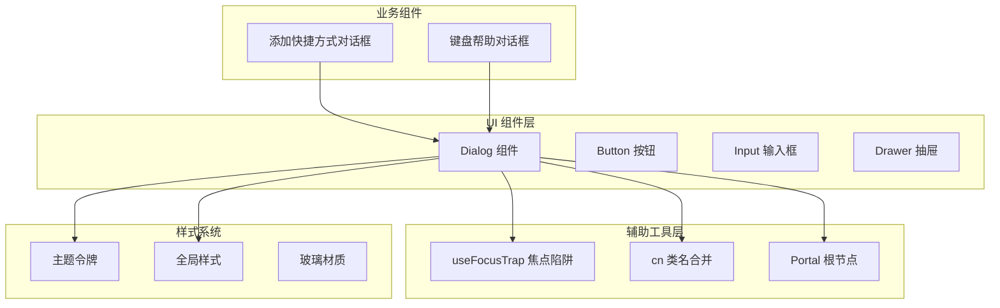
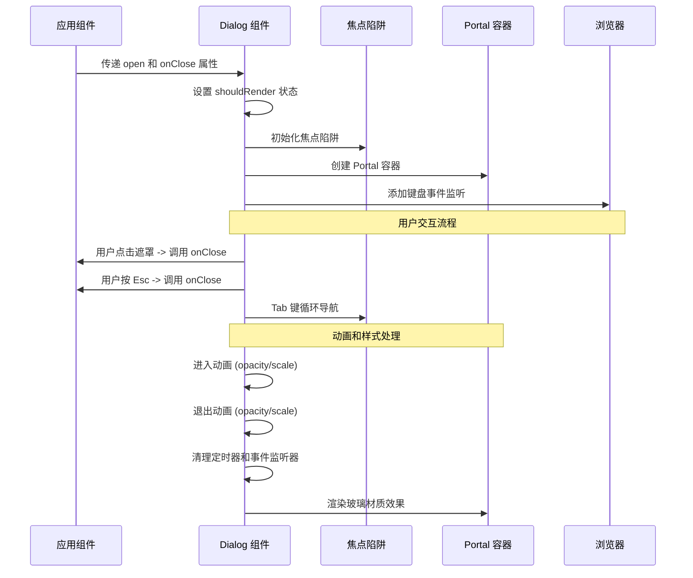
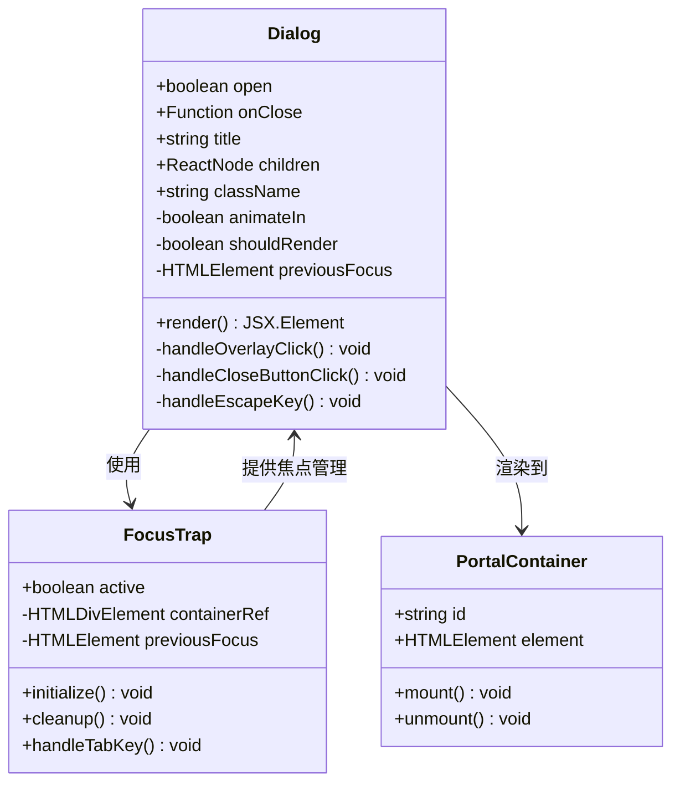
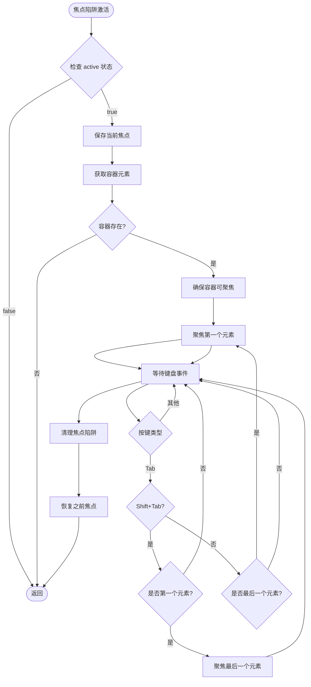
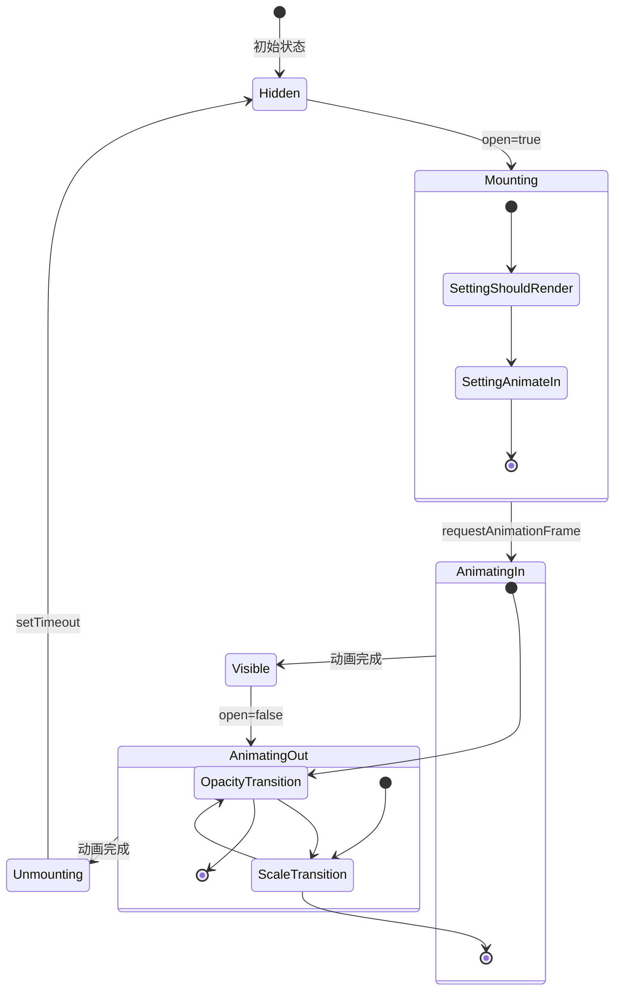
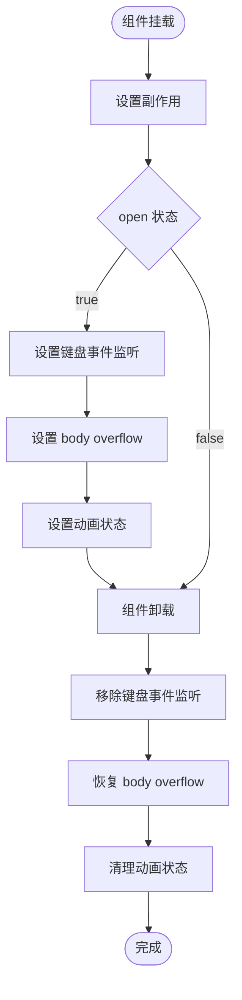
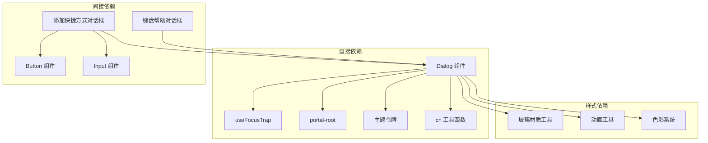

# Dialog 对话框组件

<cite>
**本文档引用的文件**
- [Dialog.tsx](file://src/components/ui/Dialog.tsx)
- [Dialog.test.tsx](file://src/components/ui/Dialog.test.tsx)
- [useFocusTrap.ts](file://src/lib/useFocusTrap.ts)
- [AddShortcutDialog.tsx](file://src/components/widgets/Shortcuts/AddShortcutDialog.tsx)
- [cn.ts](file://src/lib/cn.ts)
- [tokens.css](file://src/styles/tokens.css)
- [globals.css](file://src/styles/globals.css)
- [index.html](file://src/newtab/index.html)
</cite>

## 更新摘要

**变更内容**

- 更新了 Dialog 组件的动画状态管理系统，包含复杂的进入/退出动画状态同步机制
- 新增了内存泄漏预防机制，包括 requestAnimationFrame 和 setTimeout 的清理
- 增强了焦点陷阱的动画清理功能
- 更新了组件的状态管理逻辑，确保动画和渲染的正确同步

## 目录

1. [简介](#简介)
2. [项目结构](#项目结构)
3. [核心组件](#核心组件)
4. [架构概览](#架构概览)
5. [详细组件分析](#详细组件分析)
6. [依赖关系分析](#依赖关系分析)
7. [性能考量](#性能考量)
8. [故障排除指南](#故障排除指南)
9. [结论](#结论)
10. [附录](#附录)

## 简介

Dialog 对话框组件是本项目中的核心交互组件，用于实现模态对话框的完整功能。该组件提供了完整的焦点管理、键盘导航、动画效果和无障碍支持，确保用户在各种场景下都能获得一致且可访问的体验。

组件采用 Portal 技术将对话框渲染到页面根节点之外的独立容器中，避免了层级问题和样式冲突。通过精心设计的动画系统和玻璃材质效果，为用户提供现代化的视觉体验。

**更新** 组件经过完全重构，现在包含复杂的动画状态管理和内存泄漏预防机制，确保动画流畅性和资源安全性。

## 项目结构

Dialog 组件位于 UI 组件库中，与焦点陷阱、样式系统和其他辅助工具协同工作：



**图表来源**

- [Dialog.tsx:1-94](file://src/components/ui/Dialog.tsx#L1-L94)
- [useFocusTrap.ts:1-71](file://src/lib/useFocusTrap.ts#L1-L71)
- [AddShortcutDialog.tsx:1-115](file://src/components/widgets/Shortcuts/AddShortcutDialog.tsx#L1-L115)

**章节来源**

- [Dialog.tsx:1-94](file://src/components/ui/Dialog.tsx#L1-L94)
- [index.html:10](file://src/newtab/index.html#L10)

## 核心组件

Dialog 组件实现了以下核心功能：

### 主要特性

- **模态对话框管理**：通过 open 属性控制显示/隐藏状态
- **焦点陷阱机制**：确保键盘导航被限制在对话框内部
- **背景遮罩系统**：提供半透明遮罩层和模糊效果
- **动画过渡效果**：平滑的进入/退出动画，包含复杂的动画状态管理
- **键盘导航支持**：Esc 键关闭、Tab 键循环导航
- **无障碍兼容**：ARIA 属性和语义化标记
- **内存泄漏预防**：自动清理事件监听器和定时器

### API 接口

组件提供简洁而强大的 API 接口：

| 属性名    | 类型       | 必需 | 默认值    | 描述                   |
| --------- | ---------- | ---- | --------- | ---------------------- |
| open      | boolean    | 是   | -         | 控制对话框的显示状态   |
| onClose   | () => void | 是   | -         | 对话框关闭时的回调函数 |
| title     | string     | 否   | undefined | 对话框标题文本         |
| children  | ReactNode  | 是   | -         | 对话框内容区域         |
| className | string     | 否   | undefined | 自定义样式类名         |

**章节来源**

- [Dialog.tsx:7-13](file://src/components/ui/Dialog.tsx#L7-L13)
- [Dialog.tsx:15-94](file://src/components/ui/Dialog.tsx#L15-L94)

## 架构概览

Dialog 组件采用模块化设计，各部分职责清晰分离。经过重构后，组件现在包含更复杂的动画状态管理和内存泄漏预防机制：



**图表来源**

- [Dialog.tsx:15-94](file://src/components/ui/Dialog.tsx#L15-L94)
- [useFocusTrap.ts:6-71](file://src/lib/useFocusTrap.ts#L6-L71)

## 详细组件分析

### Dialog 组件实现

Dialog 组件是整个模态对话框系统的核心，负责协调所有交互逻辑。经过重构后，组件现在包含复杂的动画状态管理和内存泄漏预防机制：



**图表来源**

- [Dialog.tsx:15-94](file://src/components/ui/Dialog.tsx#L15-L94)
- [useFocusTrap.ts:6-71](file://src/lib/useFocusTrap.ts#L6-L71)

### 焦点陷阱机制

焦点陷阱是 Dialog 组件的核心安全特性，确保键盘导航被限制在对话框内部。经过重构后，焦点陷阱现在包含更好的动画清理功能：



**图表来源**

- [useFocusTrap.ts:10-71](file://src/lib/useFocusTrap.ts#L10-L71)

### 动画系统设计

Dialog 组件实现了多层次的动画效果，提供流畅的用户体验。经过重构后，动画系统现在包含复杂的进入/退出状态管理和内存泄漏预防机制：



**更新** 动画系统现在包含两个关键状态：`shouldRender`（控制组件是否渲染）和 `animateIn`（控制动画状态），确保动画和渲染的正确同步。

**图表来源**

- [Dialog.tsx:17-41](file://src/components/ui/Dialog.tsx#L17-L41)

### 内存泄漏预防机制

组件现在包含完整的内存泄漏预防机制，确保资源得到正确清理：



**更新** 新增了完整的内存泄漏预防机制，包括键盘事件监听器清理、body overflow 恢复和动画状态清理。

**图表来源**

- [Dialog.tsx:43-53](file://src/components/ui/Dialog.tsx#L43-L53)

### 样式系统集成

组件深度集成了项目的样式系统，支持多种主题和材质效果：

| 样式类                | 功能描述     | 变量依赖                         |
| --------------------- | ------------ | -------------------------------- |
| backdrop-blur-md      | 中等模糊背景 | --blur-widget                    |
| backdrop-blur-sm      | 小模糊背景   | --blur-widget                    |
| backdrop-blur-glass   | 玻璃材质效果 | --blur-widget, --saturate-widget |
| opacity-100/opacity-0 | 透明度控制   | 动画状态                         |
| scale-100/scale-95    | 缩放控制     | 动画状态                         |
| shadow-pop            | 弹出阴影效果 | --shadow-pop                     |
| rounded-card          | 圆角卡片样式 | --radius-card                    |

**章节来源**

- [Dialog.tsx:61-77](file://src/components/ui/Dialog.tsx#L61-L77)
- [tokens.css:111-127](file://src/styles/tokens.css#L111-L127)

## 依赖关系分析

### 组件间依赖关系

Dialog 组件与其他组件形成了清晰的依赖层次。经过重构后，依赖关系更加清晰：



**图表来源**

- [Dialog.tsx:1-5](file://src/components/ui/Dialog.tsx#L1-L5)
- [AddShortcutDialog.tsx:1-7](file://src/components/widgets/Shortcuts/AddShortcutDialog.tsx#L1-L7)

### 外部依赖分析

组件使用的外部库和工具：

| 依赖项         | 版本     | 用途          | 重要性   |
| -------------- | -------- | ------------- | -------- |
| react          | 最新版本 | React 核心库  | 核心依赖 |
| lucide-react   | 最新版本 | 图标库        | UI 增强  |
| clsx           | 最新版本 | 类名合并      | 工具函数 |
| tailwind-merge | 最新版本 | Tailwind 合并 | 样式优化 |

**章节来源**

- [Dialog.tsx:1-5](file://src/components/ui/Dialog.tsx#L1-L5)
- [cn.ts:1-7](file://src/lib/cn.ts#L1-L7)

## 性能考量

Dialog 组件在设计时充分考虑了性能优化。经过重构后，性能优化策略更加完善：

### 渲染优化策略

- **条件渲染**：未渲染时返回 null，避免不必要的 DOM 元素
- **Portal 技术**：减少 DOM 层级，提高渲染效率
- **requestAnimationFrame**：确保动画在下一帧开始，避免阻塞
- **setTimeout 延迟**：优雅地处理退出动画后的卸载
- **状态同步**：通过 `shouldRender` 和 `animateIn` 状态确保动画和渲染的正确同步

### 内存管理

- **事件监听器清理**：组件卸载时自动移除键盘事件监听
- **焦点状态恢复**：确保焦点回到之前的元素
- **定时器清理**：防止内存泄漏
- **动画清理**：确保动画状态正确重置

### 动画性能

- **硬件加速**：使用 transform 和 opacity 属性
- **CSS 过渡**：利用浏览器优化的 CSS 动画
- **变量控制**：通过 CSS 变量实现主题切换的性能优化
- **状态管理**：避免不必要的状态更新和重渲染

**更新** 新增了状态同步机制和完整的内存泄漏预防机制，确保组件的长期稳定运行。

## 故障排除指南

### 常见问题及解决方案

#### 问题：对话框无法关闭

**症状**：点击遮罩或按 Esc 键无法关闭对话框
**可能原因**：

- onClose 回调函数未正确传递
- 事件冒泡阻止了默认行为
- Portal 根节点不存在

**解决方案**：

1. 确保传入正确的 onClose 函数
2. 检查事件处理逻辑
3. 验证 HTML 中存在 #portal-root 元素

#### 问题：焦点无法正确管理

**症状**：Tab 键可以跳出对话框范围
**可能原因**：

- 焦点陷阱初始化失败
- 容器元素不可聚焦
- 事件监听器未正确绑定

**解决方案**：

1. 确保容器元素有 tabindex 属性
2. 检查焦点陷阱的初始化时机
3. 验证事件监听器的绑定状态

#### 问题：动画效果异常

**症状**：对话框出现闪烁或动画不流畅
**可能原因**：

- requestAnimationFrame 使用不当
- CSS 变量更新时机问题
- 浏览器兼容性问题
- 状态同步问题

**解决方案**：

1. 确保动画状态的正确切换
2. 检查 CSS 变量的定义和使用
3. 测试不同浏览器的兼容性
4. 验证 `shouldRender` 和 `animateIn` 状态的同步

#### 问题：内存泄漏

**症状**：长时间使用后出现性能下降
**可能原因**：

- 事件监听器未正确清理
- 定时器未正确清理
- 动画状态未正确重置

**解决方案**：

1. 确保所有副作用都有正确的清理函数
2. 检查 useEffect 返回的清理函数
3. 验证所有定时器和事件监听器都被正确移除

**章节来源**

- [Dialog.test.tsx:16-92](file://src/components/ui/Dialog.test.tsx#L16-L92)

## 结论

Dialog 对话框组件是一个设计精良、功能完整的模态对话框解决方案。经过完全重构后，组件在保持原有功能的基础上，新增了复杂的动画状态管理和内存泄漏预防机制，进一步提升了组件的稳定性和性能。

组件的主要优势包括：

- **完整的无障碍支持**：符合 WCAG 标准
- **智能的焦点管理**：防止键盘导航逃逸
- **流畅的动画体验**：提供现代化的视觉反馈，包含复杂的动画状态管理
- **灵活的主题系统**：支持多种外观风格
- **健壮的内存管理**：确保组件长期稳定运行
- **完整的生命周期管理**：自动清理资源，防止内存泄漏

通过合理的架构设计和严格的测试覆盖，Dialog 组件为整个应用提供了可靠的对话框基础。

## 附录

### 实际使用示例

#### 基础用法

```typescript
// 在应用中使用 Dialog 组件
function MyComponent() {
  const [isOpen, setIsOpen] = useState(false);

  return (
    <>
      <button onClick={() => setIsOpen(true)}>
        打开对话框
      </button>
      <Dialog
        open={isOpen}
        onClose={() => setIsOpen(false)}
        title="确认操作"
      >
        <p>确定要执行此操作吗？</p>
      </Dialog>
    </>
  );
}
```

#### 复杂表单示例

```typescript
// 使用 Dialog 构建复杂表单
function AddShortcutDialog({ open, onClose }) {
  const [title, setTitle] = useState('');
  const [url, setUrl] = useState('');

  const handleSubmit = () => {
    // 处理表单提交逻辑
    onClose();
  };

  return (
    <Dialog open={open} onClose={onClose} title="添加快捷方式">
      <div className="space-y-4">
        <Input
          value={title}
          onChange={(e) => setTitle(e.target.value)}
          placeholder="输入快捷方式名称"
        />
        <Input
          value={url}
          onChange={(e) => setUrl(e.target.value)}
          placeholder="输入网址"
        />
        <div className="flex justify-end gap-2">
          <Button onClick={onClose}>取消</Button>
          <Button onClick={handleSubmit} variant="primary">添加</Button>
        </div>
      </div>
    </Dialog>
  );
}
```

### 最佳实践

#### 焦点管理最佳实践

1. **自动聚焦**：对话框打开时自动聚焦到第一个可交互元素
2. **循环导航**：Tab 键在对话框内循环，不跳出边界
3. **Esc 键处理**：提供明确的关闭方式
4. **焦点恢复**：关闭时恢复到之前的焦点位置

#### 无障碍设计最佳实践

1. **ARIA 属性**：正确设置 role="dialog" 和 aria-modal
2. **标题语义**：为对话框提供清晰的标题
3. **键盘可达**：确保所有功能都可通过键盘访问
4. **颜色对比**：保证足够的颜色对比度

#### 性能优化最佳实践

1. **条件渲染**：仅在需要时渲染对话框
2. **事件清理**：及时清理事件监听器
3. **动画优化**：使用硬件加速的 CSS 属性
4. **样式缓存**：复用样式类，避免重复计算
5. **状态同步**：确保动画状态和渲染状态的正确同步

#### 安全性考虑

1. **XSS 防护**：对用户输入进行适当的验证和转义
2. **CSRF 保护**：在表单提交时包含必要的安全令牌
3. **权限控制**：确保用户有权执行对话框中的操作
4. **数据验证**：在客户端和服务器端都进行数据验证
5. **内存管理**：确保所有资源得到正确清理，防止内存泄漏

#### 动画状态管理最佳实践

1. **状态同步**：确保 `shouldRender` 和 `animateIn` 状态的正确同步
2. **动画清理**：确保动画完成后正确清理状态
3. **资源管理**：及时清理定时器和事件监听器
4. **性能监控**：监控动画性能，避免过度重绘
