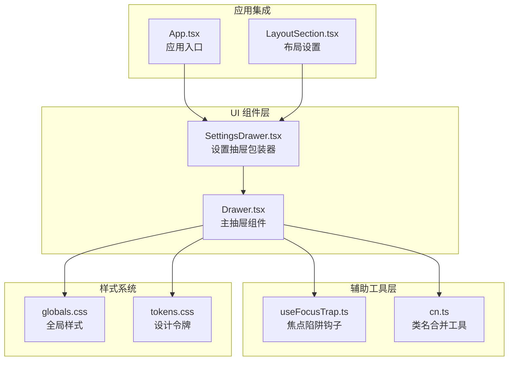
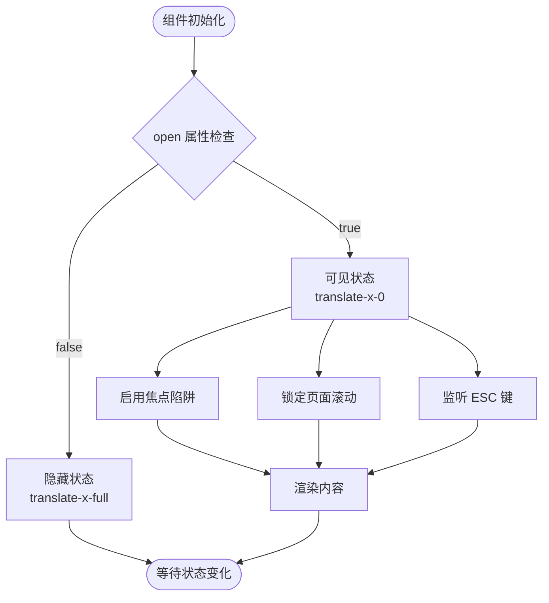
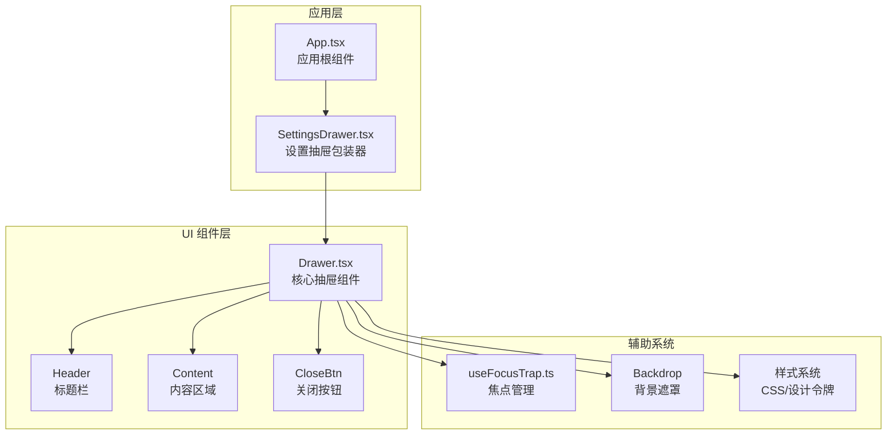
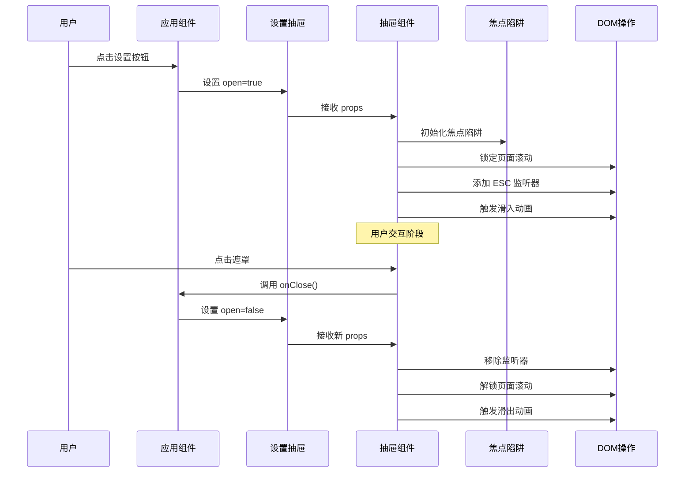
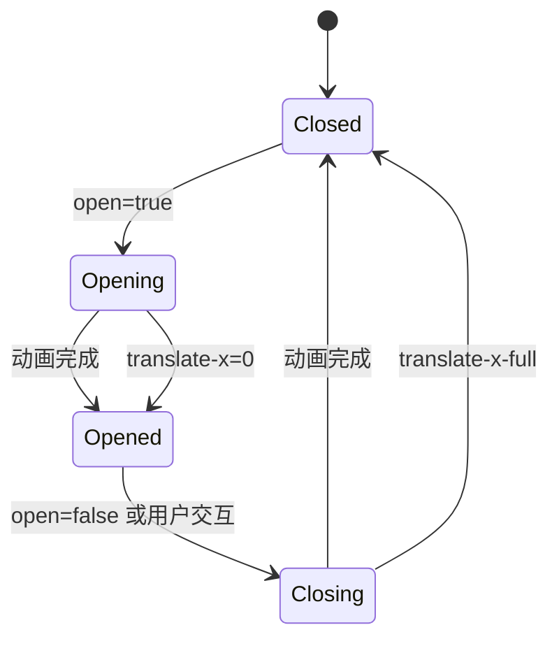
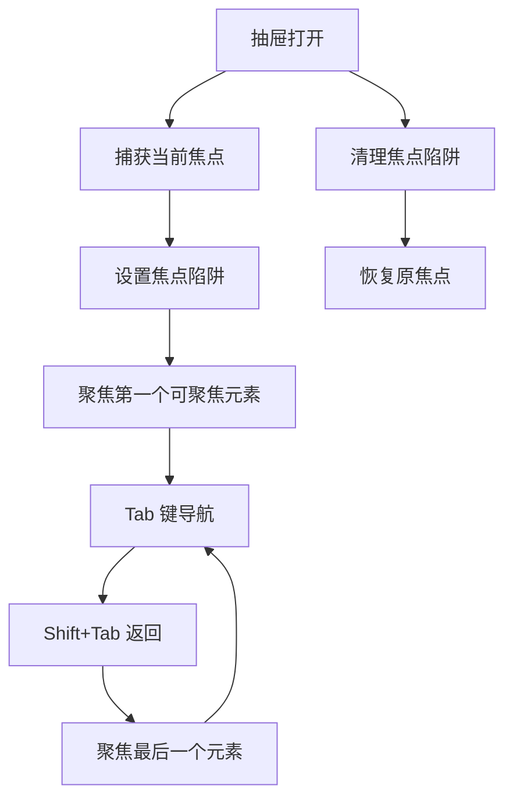
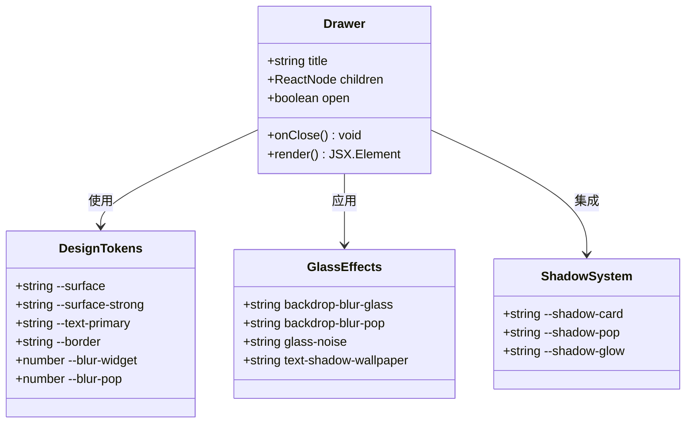
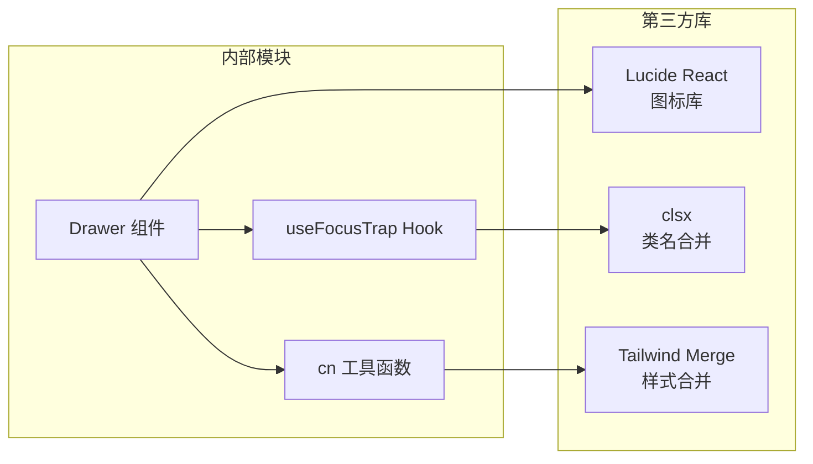
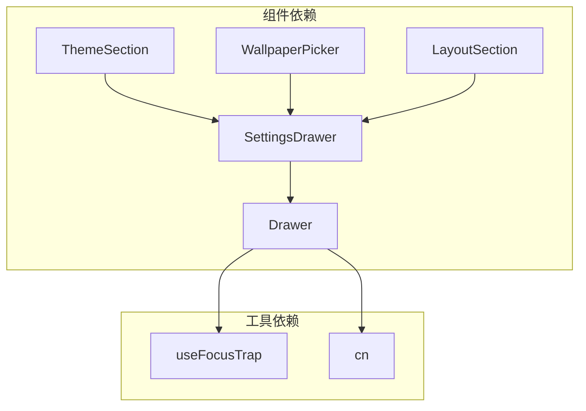
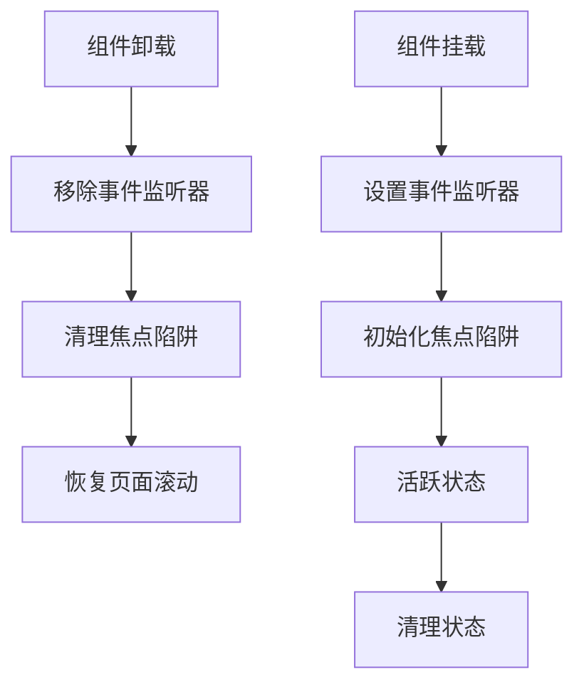

# Drawer 抽屉组件

<cite>
**本文档引用的文件**
- [Drawer.tsx](file://src/components/ui/Drawer.tsx)
- [Drawer.test.tsx](file://src/components/ui/Drawer.test.tsx)
- [SettingsDrawer.tsx](file://src/components/settings/SettingsDrawer.tsx)
- [useFocusTrap.ts](file://src/lib/useFocusTrap.ts)
- [cn.ts](file://src/lib/cn.ts)
- [App.tsx](file://src/newtab/App.tsx)
- [LayoutSection.tsx](file://src/components/settings/LayoutSection.tsx)
- [globals.css](file://src/styles/globals.css)
- [tokens.css](file://src/styles/tokens.css)
</cite>

## 目录

1. [简介](#简介)
2. [项目结构](#项目结构)
3. [核心组件](#核心组件)
4. [架构概览](#架构概览)
5. [详细组件分析](#详细组件分析)
6. [依赖关系分析](#依赖关系分析)
7. [性能考虑](#性能考虑)
8. [故障排除指南](#故障排除指南)
9. [结论](#结论)

## 简介

Drawer 抽屉组件是本项目中用于展示侧边内容的重要 UI 组件。它提供了现代化的抽屉式界面，支持从右侧滑入显示，具有流畅的动画效果、无障碍访问支持和完整的键盘导航功能。该组件采用现代化的设计理念，结合了毛玻璃效果、阴影层次和响应式布局，为用户提供沉浸式的交互体验。

## 项目结构

Drawer 组件在项目中的位置和相关文件组织如下：

**图表来源**

- [Drawer.tsx:1-62](file://src/components/ui/Drawer.tsx#L1-L62)
- [SettingsDrawer.tsx:1-22](file://src/components/settings/SettingsDrawer.tsx#L1-L22)
- [useFocusTrap.ts:1-71](file://src/lib/useFocusTrap.ts#L1-L71)

**章节来源**

- [Drawer.tsx:1-62](file://src/components/ui/Drawer.tsx#L1-L62)
- [SettingsDrawer.tsx:1-22](file://src/components/settings/SettingsDrawer.tsx#L1-L22)

## 核心组件

### Drawer 主组件

Drawer 是一个高度可定制的抽屉组件，支持以下核心特性：

#### 组件属性定义

| 属性名   | 类型       | 必需 | 默认值 | 描述                 |
| -------- | ---------- | ---- | ------ | -------------------- |
| open     | boolean    | 是   | -      | 控制抽屉的显示状态   |
| onClose  | () => void | 是   | -      | 关闭抽屉时的回调函数 |
| title    | string     | 否   | ""     | 抽屉标题文本         |
| children | ReactNode  | 否   | -      | 抽屉内容区域         |

#### 核心实现机制

组件采用 React 函数式组件设计，结合自定义 Hook 实现状态管理和副作用处理：

**图表来源**

- [Drawer.tsx:13-26](file://src/components/ui/Drawer.tsx#L13-L26)

#### 动画和过渡效果

组件实现了平滑的滑入滑出动画，使用 CSS Transform 和 Transition 实现：

- **滑入动画**：`translate-x-0` 到 `translate-x-full` 的水平位移
- **透明度过渡**：背景遮罩的淡入淡出效果
- **持续时间**：300ms 的标准过渡时长
- **缓动函数**：默认的线性缓动

**章节来源**

- [Drawer.tsx:13-61](file://src/components/ui/Drawer.tsx#L13-L61)

## 架构概览

### 组件层次结构

**图表来源**

- [App.tsx:106](file://src/newtab/App.tsx#L106)
- [SettingsDrawer.tsx:11-21](file://src/components/settings/SettingsDrawer.tsx#L11-L21)
- [Drawer.tsx:28-59](file://src/components/ui/Drawer.tsx#L28-L59)

### 数据流和控制流程

**图表来源**

- [App.tsx:93-106](file://src/newtab/App.tsx#L93-L106)
- [SettingsDrawer.tsx:11-21](file://src/components/settings/SettingsDrawer.tsx#L11-L21)
- [Drawer.tsx:16-26](file://src/components/ui/Drawer.tsx#L16-L26)

**章节来源**

- [App.tsx:73-110](file://src/newtab/App.tsx#L73-L110)
- [SettingsDrawer.tsx:1-22](file://src/components/settings/SettingsDrawer.tsx#L1-L22)

## 详细组件分析

### 核心实现细节

#### 状态管理机制

Drawer 组件采用受控组件模式，通过外部传入的 `open` 属性控制显示状态：

**图表来源**

- [Drawer.tsx:42-45](file://src/components/ui/Drawer.tsx#L42-L45)

#### 焦点管理策略

组件集成了专门的焦点陷阱机制，确保键盘导航的完整性：

**图表来源**

- [useFocusTrap.ts:10-67](file://src/lib/useFocusTrap.ts#L10-L67)

#### 无障碍访问支持

组件完全符合 WCAG 2.1 标准，提供以下无障碍功能：

- **角色标识**：使用 `role="dialog"` 和 `aria-modal="true"`
- **标签系统**：通过 `aria-label` 提供语义化描述
- **键盘导航**：支持 ESC 键关闭和 Tab 键循环导航
- **屏幕阅读器**：完整的语义化标记

**章节来源**

- [Drawer.tsx:37-57](file://src/components/ui/Drawer.tsx#L37-L57)
- [useFocusTrap.ts:3-4](file://src/lib/useFocusTrap.ts#L3-L4)

### 样式和视觉设计

#### 设计系统集成

Drawer 组件深度集成到项目的设计系统中：

**图表来源**

- [Drawer.tsx:42-44](file://src/components/ui/Drawer.tsx#L42-L44)
- [tokens.css:80-128](file://src/styles/tokens.css#L80-L128)

#### 响应式设计

组件支持多种屏幕尺寸的自适应：

- **桌面端**：固定宽度 380px，最大宽度 90vw
- **移动端**：自动调整到可用视口宽度
- **横屏适配**：根据设备方向动态调整布局

**章节来源**

- [Drawer.tsx:42-44](file://src/components/ui/Drawer.tsx#L42-L44)

### 内容组织和布局

#### 标题栏设计

标题栏采用简洁的设计语言，包含：

- **标题文本**：左侧显示抽屉名称
- **关闭按钮**：右侧圆形按钮，带悬停效果
- **分隔线**：底部细线分隔标题和内容

#### 内容区域管理

内容区域提供完整的滚动支持：

- **溢出处理**：`overflow-y-auto` 支持垂直滚动
- **内边距**：16px 左右内边距，4px 上下内边距
- **弹性布局**：`flex-1` 占据剩余空间

**章节来源**

- [Drawer.tsx:47-57](file://src/components/ui/Drawer.tsx#L47-L57)

## 依赖关系分析

### 外部依赖

**图表来源**

- [Drawer.tsx:1-4](file://src/components/ui/Drawer.tsx#L1-L4)
- [useFocusTrap.ts:1](file://src/lib/useFocusTrap.ts#L1)
- [cn.ts:1-6](file://src/lib/cn.ts#L1-L6)

### 内部依赖关系

**图表来源**

- [SettingsDrawer.tsx:1-4](file://src/components/settings/SettingsDrawer.tsx#L1-L4)
- [Drawer.tsx:1-4](file://src/components/ui/Drawer.tsx#L1-L4)

**章节来源**

- [SettingsDrawer.tsx:1-22](file://src/components/settings/SettingsDrawer.tsx#L1-L22)
- [Drawer.tsx:1-6](file://src/components/ui/Drawer.tsx#L1-L6)

## 性能考虑

### 渲染优化

#### 条件渲染策略

组件采用条件渲染避免不必要的 DOM 更新：

- **遮罩层**：使用 `pointer-events-none` 在隐藏状态下禁用交互
- **内容区域**：仅在需要时渲染，减少内存占用
- **动画优化**：利用 GPU 加速的 transform 属性

#### 内存管理

**图表来源**

- [Drawer.tsx:16-26](file://src/components/ui/Drawer.tsx#L16-L26)

### 移动端优化

#### 触摸交互优化

- **触摸目标大小**：最小 44px 触摸目标，符合 WCAG 标准
- **滑动手势**：支持从边缘滑动打开抽屉
- **性能动画**：使用 transform 替代布局计算

#### 内存和电池优化

- **懒加载**：内容按需加载，减少初始渲染时间
- **动画节流**：在低端设备上自动降级动画质量
- **资源管理**：及时释放事件监听器和定时器

**章节来源**

- [Drawer.tsx:16-26](file://src/components/ui/Drawer.tsx#L16-L26)

## 故障排除指南

### 常见问题诊断

#### 焦点陷阱问题

**症状**：键盘无法导航或焦点丢失
**解决方案**：

1. 检查容器是否正确设置 `tabindex="-1"`
2. 确认所有子元素都可聚焦
3. 验证 `useFocusTrap` Hook 的正确使用

#### 动画异常

**症状**：抽屉动画卡顿或不完整
**解决方案**：

1. 检查 CSS 过渡属性配置
2. 确认 transform 属性未被其他样式覆盖
3. 验证硬件加速是否启用

#### 无障碍访问问题

**症状**：屏幕阅读器无法正确读取内容
**解决方案**：

1. 确保 `role="dialog"` 正确设置
2. 检查 `aria-modal` 和 `aria-label` 属性
3. 验证键盘导航逻辑

**章节来源**

- [useFocusTrap.ts:10-67](file://src/lib/useFocusTrap.ts#L10-L67)
- [Drawer.test.tsx:5-59](file://src/components/ui/Drawer.test.tsx#L5-L59)

### 测试覆盖范围

组件拥有完善的测试套件，涵盖以下场景：

- **状态切换**：验证打开和关闭状态的正确性
- **键盘交互**：ESC 键和 Tab 键的功能测试
- **点击事件**：遮罩点击和按钮点击的响应测试
- **无障碍属性**：ARIA 属性和语义化标记验证

**章节来源**

- [Drawer.test.tsx:5-59](file://src/components/ui/Drawer.test.tsx#L5-L59)

## 结论

Drawer 抽屉组件是一个设计精良、功能完整的 UI 组件，体现了现代前端开发的最佳实践。其核心优势包括：

### 设计优势

- **现代化外观**：结合毛玻璃效果和阴影层次
- **流畅动画**：300ms 的平滑过渡效果
- **响应式设计**：适配各种屏幕尺寸

### 开发优势

- **无障碍访问**：完全符合 WCAG 标准
- **类型安全**：完整的 TypeScript 类型定义
- **测试完备**：全面的单元测试覆盖

### 性能优势

- **优化渲染**：条件渲染和内存管理
- **移动端友好**：触摸优化和性能考虑
- **可扩展性**：模块化设计便于扩展

该组件为项目提供了可靠的侧边抽屉解决方案，既满足了功能需求，又保证了用户体验和开发效率。通过合理的架构设计和完善的辅助工具，Drawer 组件成为了项目 UI 系统的重要组成部分。
