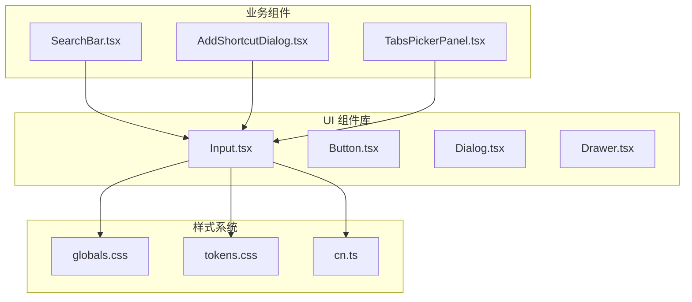
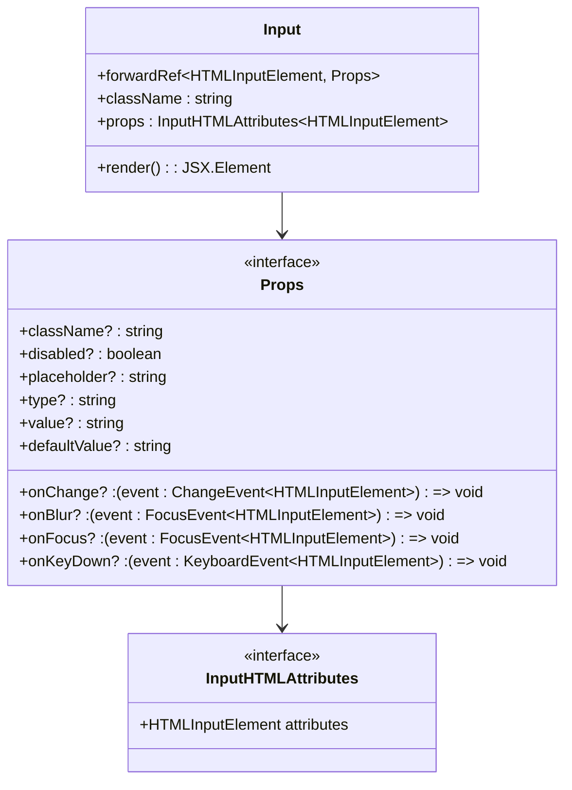
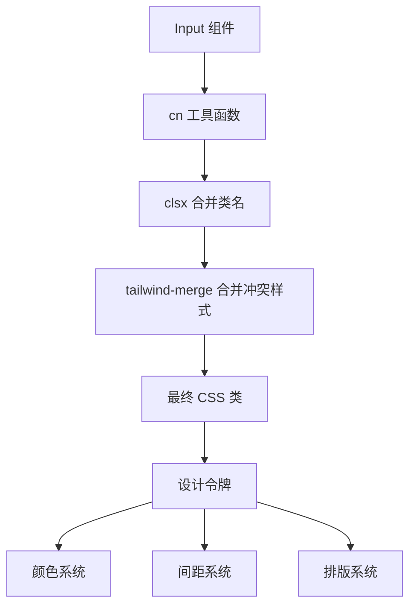
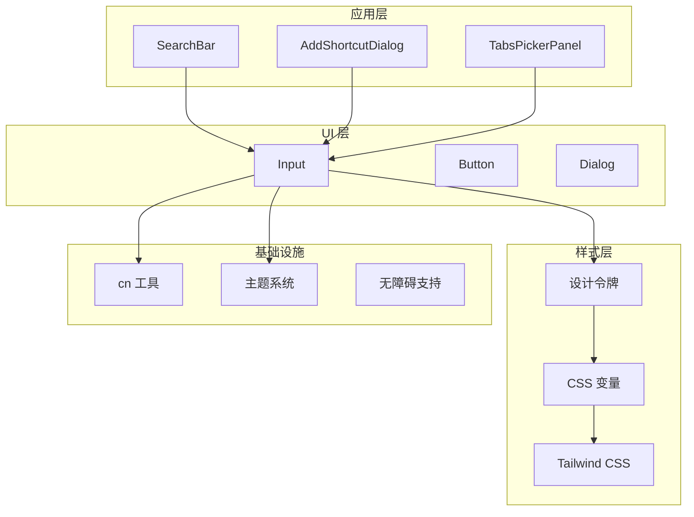
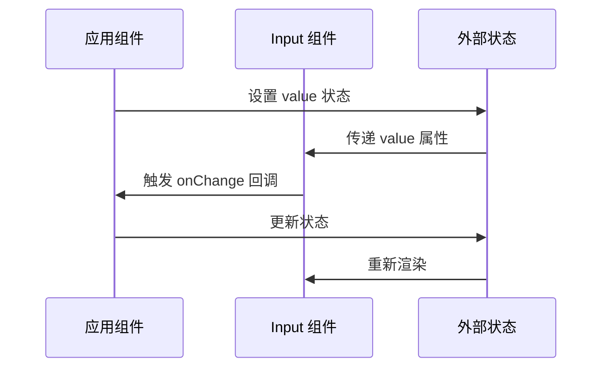
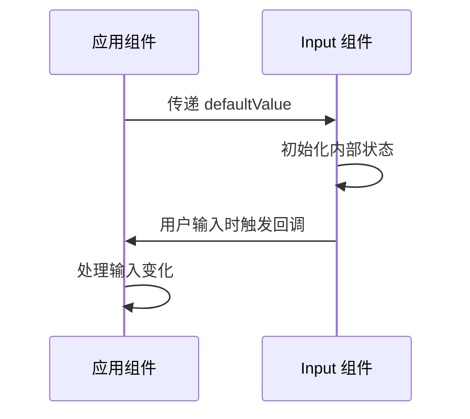
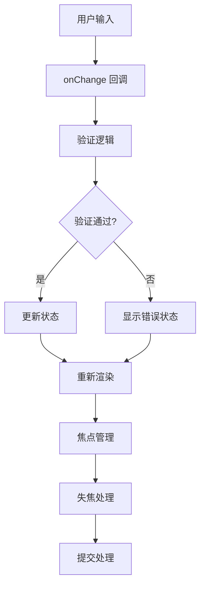
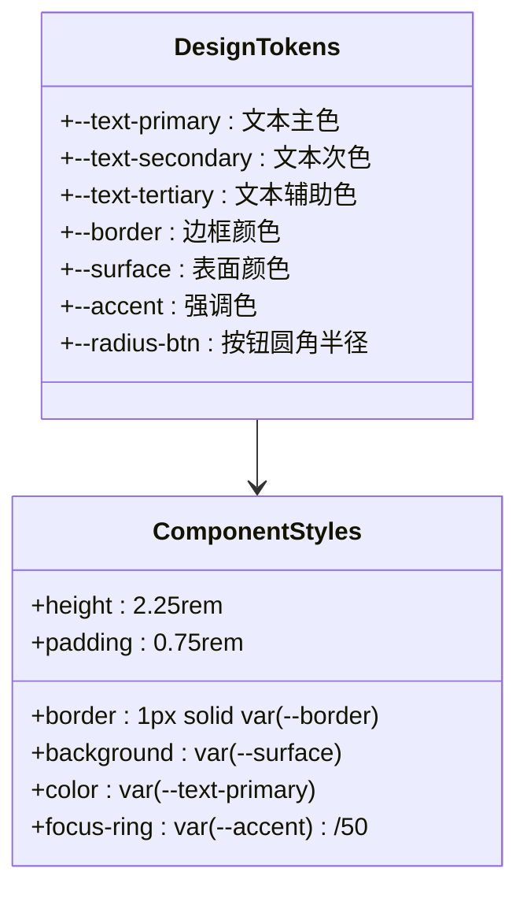
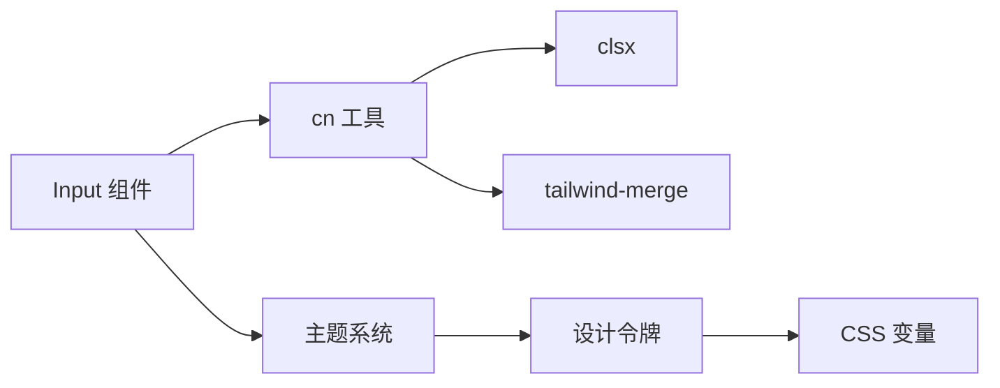

# Input 输入组件

<cite>
**本文档引用的文件**
- [Input.tsx](file://src/components/ui/Input.tsx)
- [Input.test.tsx](file://src/components/ui/Input.test.tsx)
- [cn.ts](file://src/lib/cn.ts)
- [AddShortcutDialog.tsx](file://src/components/widgets/Shortcuts/AddShortcutDialog.tsx)
- [TabsPickerPanel.tsx](file://src/components/widgets/Shortcuts/TabsPickerPanel.tsx)
- [SearchBar.tsx](file://src/components/widgets/SearchBar/SearchBar.tsx)
- [globals.css](file://src/styles/globals.css)
- [tokens.css](file://src/styles/tokens.css)
</cite>

## 目录

1. [简介](#简介)
2. [项目结构](#项目结构)
3. [核心组件](#核心组件)
4. [架构概览](#架构概览)
5. [详细组件分析](#详细组件分析)
6. [依赖关系分析](#依赖关系分析)
7. [性能考虑](#性能考虑)
8. [故障排除指南](#故障排除指南)
9. [结论](#结论)
10. [附录](#附录)

## 简介

Input 输入组件是 Tab 新标签页应用中的基础 UI 组件，提供了简洁而功能完整的文本输入能力。该组件基于原生 HTML input 元素构建，采用现代化的设计系统和响应式交互模式，支持受控和非受控两种使用模式。

本组件专注于提供一致的用户体验，通过精心设计的样式系统和无障碍支持，确保在各种使用场景下都能提供优秀的输入体验。组件支持多种输入类型、占位符处理、禁用状态以及丰富的键盘交互功能。

## 项目结构

Input 组件位于 UI 组件库中，与项目的其他组件形成清晰的层次结构：



**图表来源**

- [Input.tsx:1-21](file://src/components/ui/Input.tsx#L1-L21)
- [globals.css:1-158](file://src/styles/globals.css#L1-L158)
- [tokens.css:1-291](file://src/styles/tokens.css#L1-L291)

**章节来源**

- [Input.tsx:1-21](file://src/components/ui/Input.tsx#L1-L21)
- [globals.css:1-158](file://src/styles/globals.css#L1-L158)
- [tokens.css:1-291](file://src/styles/tokens.css#L1-L291)

## 核心组件

### 组件定义与类型系统

Input 组件采用 TypeScript 和 React 的 forwardRef 模式实现，提供了完整的类型安全性和性能优化：



**图表来源**

- [Input.tsx:4-20](file://src/components/ui/Input.tsx#L4-L20)

### 样式系统集成

组件通过 cn 工具函数集成 Tailwind CSS 和自定义设计令牌：



**图表来源**

- [Input.tsx:13-16](file://src/components/ui/Input.tsx#L13-L16)
- [cn.ts:4-6](file://src/lib/cn.ts#L4-L6)

**章节来源**

- [Input.tsx:1-21](file://src/components/ui/Input.tsx#L1-L21)
- [cn.ts:1-7](file://src/lib/cn.ts#L1-L7)

## 架构概览

Input 组件在整个应用架构中扮演着基础输入层的角色，与上层业务组件形成松耦合的关系：



**图表来源**

- [Input.tsx:1-21](file://src/components/ui/Input.tsx#L1-L21)
- [SearchBar.tsx:9-115](file://src/components/widgets/SearchBar/SearchBar.tsx#L9-L115)
- [AddShortcutDialog.tsx:24-87](file://src/components/widgets/Shortcuts/AddShortcutDialog.tsx#L24-L87)
- [TabsPickerPanel.tsx:21-201](file://src/components/widgets/Shortcuts/TabsPickerPanel.tsx#L21-L201)

## 详细组件分析

### 状态管理机制

Input 组件支持两种状态管理模式：

#### 受控模式（Controlled）

在受控模式下，组件的状态完全由外部 props 控制：



**图表来源**

- [AddShortcutDialog.tsx:59-75](file://src/components/widgets/Shortcuts/AddShortcutDialog.tsx#L59-L75)
- [TabsPickerPanel.tsx:132-138](file://src/components/widgets/Shortcuts/TabsPickerPanel.tsx#L132-L138)

#### 非受控模式（Uncontrolled）

在非受控模式下，组件维护自己的内部状态：



**图表来源**

- [Input.test.tsx:27-31](file://src/components/ui/Input.test.tsx#L27-L31)

### 验证机制

虽然 Input 组件本身不包含内置的验证逻辑，但通过事件回调可以轻松集成各种验证方案：



**图表来源**

- [AddShortcutDialog.tsx:37-42](file://src/components/widgets/Shortcuts/AddShortcutDialog.tsx#L37-L42)

### 用户交互处理

组件支持丰富的用户交互模式：

#### 键盘交互

- Enter 键触发提交操作
- Tab 键进行焦点切换
- Esc 键关闭对话框
- 方向键用于列表导航

#### 焦点管理

- 自动聚焦支持
- 失焦延迟处理
- 焦点状态指示

**章节来源**

- [Input.tsx:1-21](file://src/components/ui/Input.tsx#L1-L21)
- [AddShortcutDialog.tsx:69-75](file://src/components/widgets/Shortcuts/AddShortcutDialog.tsx#L69-L75)
- [SearchBar.tsx:50-63](file://src/components/widgets/SearchBar/SearchBar.tsx#L50-L63)

### 样式定制系统

Input 组件采用设计令牌驱动的样式系统：



**图表来源**

- [tokens.css:1-291](file://src/styles/tokens.css#L1-L291)
- [Input.tsx:13-16](file://src/components/ui/Input.tsx#L13-L16)

### 无障碍支持

组件实现了完整的无障碍功能：

- ARIA 角色支持（textbox）
- 语义化标签关联
- 键盘导航支持
- 屏幕阅读器兼容性

**章节来源**

- [Input.test.tsx:6-9](file://src/components/ui/Input.test.tsx#L6-L9)
- [SearchBar.tsx:80-86](file://src/components/widgets/SearchBar/SearchBar.tsx#L80-L86)

## 依赖关系分析

### 内部依赖



**图表来源**

- [Input.tsx:1-2](file://src/components/ui/Input.tsx#L1-L2)
- [cn.ts:1-2](file://src/lib/cn.ts#L1-L2)

### 外部依赖

组件依赖于以下关键库：

- **React**: 基础框架和 hooks
- **clsx**: 条件类名合并
- **tailwind-merge**: Tailwind CSS 类名冲突解决

**章节来源**

- [Input.tsx:1-2](file://src/components/ui/Input.tsx#L1-L2)
- [cn.ts:1-2](file://src/lib/cn.ts#L1-L2)

## 性能考虑

### 渲染优化

- 使用 forwardRef 减少不必要的组件包装
- 通过 cn 工具函数优化类名合并
- 避免在渲染过程中创建新的对象

### 样式性能

- 使用 CSS 变量减少样式计算开销
- Tailwind JIT 编译优化
- 最小化的样式重绘区域

### 交互性能

- 节流和防抖策略
- 事件委托优化
- DOM 操作最小化

## 故障排除指南

### 常见问题

#### 样式不生效

- 检查 CSS 变量是否正确配置
- 确认 Tailwind CSS 配置完整
- 验证 cn 工具函数的使用

#### 焦点问题

- 确保 autoFocus 属性正确使用
- 检查焦点管理逻辑
- 验证键盘事件处理

#### 无障碍问题

- 确认 ARIA 属性正确设置
- 检查标签关联
- 验证键盘导航

**章节来源**

- [Input.test.tsx:16-25](file://src/components/ui/Input.test.tsx#L16-L25)
- [Input.tsx:13-16](file://src/components/ui/Input.tsx#L13-L16)

## 结论

Input 输入组件是一个设计精良的基础 UI 组件，它成功地平衡了简洁性与功能性。通过采用现代的开发实践和设计系统，该组件为整个应用提供了可靠且一致的输入体验。

组件的主要优势包括：

- **类型安全**: 完整的 TypeScript 支持
- **样式灵活**: 基于设计令牌的样式系统
- **无障碍友好**: 完整的无障碍支持
- **性能优化**: 前沿的渲染和样式优化技术
- **易于扩展**: 清晰的接口设计便于功能扩展

## 附录

### API 参考

#### 属性 (Props)

| 属性名       | 类型                           | 必需 | 默认值 | 描述                 |
| ------------ | ------------------------------ | ---- | ------ | -------------------- |
| className    | string                         | 否   | -      | 自定义 CSS 类名      |
| disabled     | boolean                        | 否   | false  | 禁用输入框           |
| placeholder  | string                         | 否   | -      | 占位符文本           |
| type         | string                         | 否   | 'text' | 输入类型             |
| value        | string                         | 否   | -      | 受控模式下的值       |
| defaultValue | string                         | 否   | -      | 非受控模式下的默认值 |
| onChange     | (event: ChangeEvent) => void   | 否   | -      | 值变化回调           |
| onBlur       | (event: FocusEvent) => void    | 否   | -      | 失焦回调             |
| onFocus      | (event: FocusEvent) => void    | 否   | -      | 获得焦点回调         |
| onKeyDown    | (event: KeyboardEvent) => void | 否   | -      | 键盘按键回调         |

#### 事件回调

- **onChange**: 当输入值发生变化时触发
- **onBlur**: 当输入框失去焦点时触发
- **onFocus**: 当输入框获得焦点时触发
- **onKeyDown**: 当按下键盘按键时触发

#### 使用示例

**受控模式示例**

```typescript
// 在表单中使用受控模式
const [value, setValue] = useState('');

return (
  <Input
    value={value}
    onChange={(e) => setValue(e.target.value)}
    placeholder="请输入内容"
  />
);
```

**非受控模式示例**

```typescript
// 使用 defaultValue 进行非受控模式
return (
  <Input
    defaultValue="初始值"
    placeholder="请输入内容"
  />
);
```

**表单集成示例**

```typescript
// 在表单中集成 Input 组件
const handleSubmit = () => {
  // 验证逻辑
  if (!validateInput(value)) {
    return
  }

  // 提交处理
  submitForm(value)
}
```

**章节来源**

- [Input.tsx:4-20](file://src/components/ui/Input.tsx#L4-L20)
- [AddShortcutDialog.tsx:59-75](file://src/components/widgets/Shortcuts/AddShortcutDialog.tsx#L59-L75)
- [TabsPickerPanel.tsx:132-138](file://src/components/widgets/Shortcuts/TabsPickerPanel.tsx#L132-L138)
