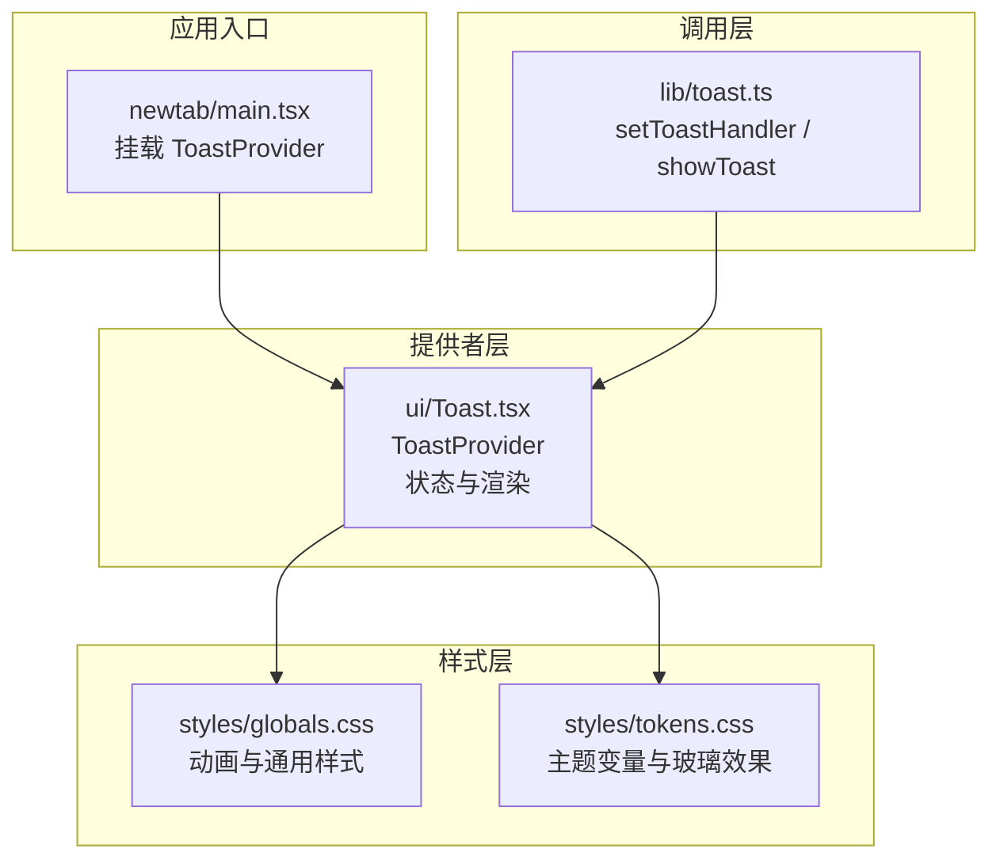
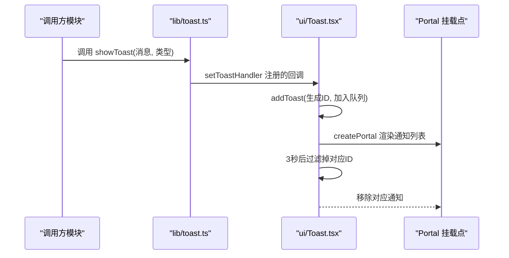
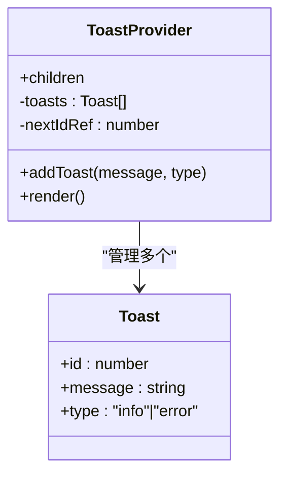
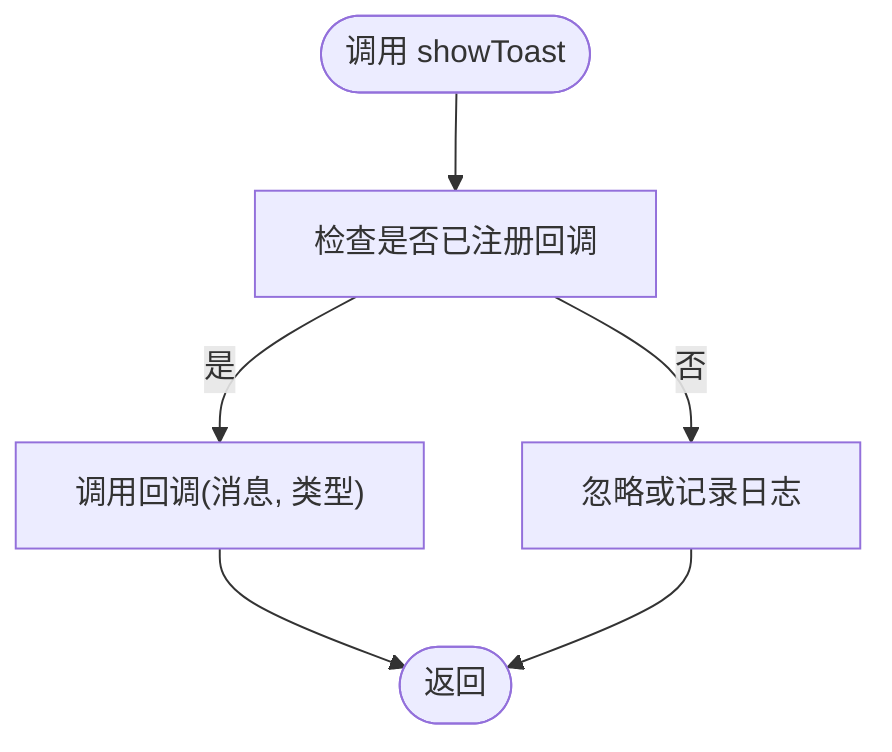
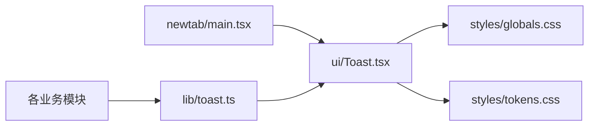

# Toast 通知组件

<cite>
**本文档引用的文件**
- [src/components/ui/Toast.tsx](file://src/components/ui/Toast.tsx)
- [src/lib/toast.ts](file://src/lib/toast.ts)
- [src/newtab/main.tsx](file://src/newtab/main.tsx)
- [src/components/settings/LayoutSection.tsx](file://src/components/settings/LayoutSection.tsx)
- [src/components/settings/WallpaperPicker.tsx](file://src/components/settings/WallpaperPicker.tsx)
- [src/components/widgets/Shortcuts/TabsPickerPanel.tsx](file://src/components/widgets/Shortcuts/TabsPickerPanel.tsx)
- [src/styles/globals.css](file://src/styles/globals.css)
- [src/styles/tokens.css](file://src/styles/tokens.css)
</cite>

## 目录

1. [简介](#简介)
2. [项目结构](#项目结构)
3. [核心组件](#核心组件)
4. [架构总览](#架构总览)
5. [详细组件分析](#详细组件分析)
6. [依赖关系分析](#依赖关系分析)
7. [性能考量](#性能考量)
8. [故障排查指南](#故障排查指南)
9. [结论](#结论)
10. [附录](#附录)

## 简介

本文件系统性地介绍 Toast 通知组件的设计与实现，涵盖通知系统的架构、消息队列与显示策略、视觉样式与交互行为、触发机制与生命周期（自动消失与手动关闭）、消息管理与优先级处理、用户体验考虑、完整 API 参考、使用示例、最佳实践以及性能与内存管理策略。该组件采用全局事件式调用与 Portal 渲染，确保在应用任意位置均可可靠展示通知。

## 项目结构

Toast 组件由三层构成：

- 全局调用层：通过轻量的全局函数暴露统一入口，屏蔽底层实现细节。
- 提供者层：负责状态管理、消息队列与渲染挂载点。
- 样式层：基于主题变量与玻璃效果，提供一致的视觉风格。

图表来源

- [src/newtab/main.tsx:11-25](file://src/newtab/main.tsx#L11-L25)
- [src/lib/toast.ts:1-10](file://src/lib/toast.ts#L1-L10)
- [src/components/ui/Toast.tsx:13-61](file://src/components/ui/Toast.tsx#L13-L61)
- [src/styles/globals.css:140-158](file://src/styles/globals.css#L140-L158)
- [src/styles/tokens.css:1-47](file://src/styles/tokens.css#L1-L47)

章节来源

- [src/newtab/main.tsx:11-25](file://src/newtab/main.tsx#L11-L25)
- [src/lib/toast.ts:1-10](file://src/lib/toast.ts#L1-L10)
- [src/components/ui/Toast.tsx:13-61](file://src/components/ui/Toast.tsx#L13-L61)
- [src/styles/globals.css:140-158](file://src/styles/globals.css#L140-L158)
- [src/styles/tokens.css:1-47](file://src/styles/tokens.css#L1-L47)

## 核心组件

- ToastProvider：全局通知容器，维护消息队列、生成唯一 ID、调度自动消失、渲染到 Portal 挂载点。
- 全局调用接口：setToastHandler 注册回调；showToast 触发通知。

关键特性

- 消息类型：支持信息型与错误型两类。
- 自动消失：默认 3 秒后自动移除。
- 手动关闭：每条通知右侧提供关闭按钮。
- Portal 渲染：渲染到页面根节点下的专用挂载点，避免层级与定位问题。
- 动画与样式：基于主题变量与玻璃模糊效果，区分信息与错误两种视觉风格。

章节来源

- [src/components/ui/Toast.tsx:7-11](file://src/components/ui/Toast.tsx#L7-L11)
- [src/components/ui/Toast.tsx:17-23](file://src/components/ui/Toast.tsx#L17-L23)
- [src/components/ui/Toast.tsx:30-59](file://src/components/ui/Toast.tsx#L30-L59)
- [src/lib/toast.ts:3-9](file://src/lib/toast.ts#L3-L9)

## 架构总览

Toast 采用“发布-订阅”式的全局调用模式：上层模块仅需导入全局函数即可触发通知；提供者负责接收、排队与渲染。Portal 将通知从组件树中抽离，直接挂载到页面根部，保证在任何路由与层级下都能稳定显示。

图表来源

- [src/lib/toast.ts:7-9](file://src/lib/toast.ts#L7-L9)
- [src/components/ui/Toast.tsx:17-23](file://src/components/ui/Toast.tsx#L17-L23)
- [src/components/ui/Toast.tsx:30-59](file://src/components/ui/Toast.tsx#L30-L59)

## 详细组件分析

### ToastProvider 组件

职责与流程

- 状态管理：维护通知数组，使用自增 ID 标识每条消息。
- 生命周期：添加后延时触发自动移除。
- 渲染策略：使用 Portal 渲染到页面根部，定位在右下角，垂直堆叠。
- 交互行为：每条通知提供关闭按钮，点击立即移除。

视觉样式

- 信息型：浅色背景与边框，强调文本颜色。
- 错误型：红色系边框与背景，突出警示。
- 玻璃模糊与阴影：通过主题变量与工具类实现一致的视觉风格。

图表来源

- [src/components/ui/Toast.tsx:7-11](file://src/components/ui/Toast.tsx#L7-L11)
- [src/components/ui/Toast.tsx:13-61](file://src/components/ui/Toast.tsx#L13-L61)

章节来源

- [src/components/ui/Toast.tsx:13-61](file://src/components/ui/Toast.tsx#L13-L61)

### 全局调用接口

- setToastHandler(fn)：注册提供者的回调，使全局函数可以转发到具体实现。
- showToast(message, type)：对外暴露的统一入口，内部调用已注册的回调。

图表来源

- [src/lib/toast.ts:3-9](file://src/lib/toast.ts#L3-L9)

章节来源

- [src/lib/toast.ts:1-10](file://src/lib/toast.ts#L1-L10)

### 使用示例与场景

- 设置面板：导入失败、收藏状态提示等。
- 壁纸选择器：随机壁纸策略切换提示、错误提示。
- 快捷方式面板：批量添加结果反馈。

章节来源

- [src/components/settings/LayoutSection.tsx:145-146](file://src/components/settings/LayoutSection.tsx#L145-L146)
- [src/components/settings/WallpaperPicker.tsx:89-98](file://src/components/settings/WallpaperPicker.tsx#L89-L98)
- [src/components/widgets/Shortcuts/TabsPickerPanel.tsx:103-107](file://src/components/widgets/Shortcuts/TabsPickerPanel.tsx#L103-L107)

## 依赖关系分析

- 应用入口依赖提供者：在根组件中包裹 ToastProvider，确保全局可用。
- 调用层依赖提供者：通过 setToastHandler 注册回调，形成解耦。
- 提供者依赖样式层：使用主题变量与工具类实现一致的视觉风格。
- 使用方依赖调用层：通过 showToast 发起通知，无需关心实现细节。

图表来源

- [src/newtab/main.tsx:19-22](file://src/newtab/main.tsx#L19-L22)
- [src/lib/toast.ts:3-9](file://src/lib/toast.ts#L3-L9)
- [src/components/ui/Toast.tsx:30-59](file://src/components/ui/Toast.tsx#L30-L59)
- [src/styles/globals.css:140-158](file://src/styles/globals.css#L140-L158)
- [src/styles/tokens.css:1-47](file://src/styles/tokens.css#L1-L47)

章节来源

- [src/newtab/main.tsx:19-22](file://src/newtab/main.tsx#L19-L22)
- [src/lib/toast.ts:3-9](file://src/lib/toast.ts#L3-L9)
- [src/components/ui/Toast.tsx:30-59](file://src/components/ui/Toast.tsx#L30-L59)
- [src/styles/globals.css:140-158](file://src/styles/globals.css#L140-L158)
- [src/styles/tokens.css:1-47](file://src/styles/tokens.css#L1-L47)

## 性能考量

- 渲染优化
  - 使用 Portal 将通知渲染到页面根部，减少层级对定位与合成的影响。
  - 通知列表为简单列表，每次更新仅针对队列变化，复杂度与通知数量线性相关。
- 动画与视觉
  - 使用 CSS 动画与过渡，避免 JavaScript 驱动的逐帧动画，降低主线程压力。
  - 主题变量驱动的颜色与阴影，减少重复计算。
- 内存管理
  - 自动消失机制确保通知在过期后被清理，避免无限增长。
  - 手动关闭即时移除，防止冗余状态持有。
- 用户偏好
  - 支持“减少动画”偏好，通过媒体查询与类名控制，降低动画开销。

章节来源

- [src/components/ui/Toast.tsx:20-22](file://src/components/ui/Toast.tsx#L20-L22)
- [src/styles/globals.css:62-81](file://src/styles/globals.css#L62-L81)
- [src/styles/globals.css:140-158](file://src/styles/globals.css#L140-L158)
- [src/styles/tokens.css:1-47](file://src/styles/tokens.css#L1-L47)

## 故障排查指南

- 通知不显示
  - 确认应用入口已包裹 ToastProvider。
  - 确认 Portal 挂载点存在（组件会回退到 body）。
- 无法触发
  - 确认已调用 setToastHandler 注册回调。
  - 确认调用 showToast 时传入了正确的参数。
- 通知不消失
  - 检查自动消失逻辑是否被覆盖或中断。
  - 确认未手动阻止状态更新。
- 视觉异常
  - 检查主题变量与工具类是否正确引入。
  - 确认“减少动画”偏好导致的动画被禁用。

章节来源

- [src/newtab/main.tsx:19-22](file://src/newtab/main.tsx#L19-L22)
- [src/components/ui/Toast.tsx:25-28](file://src/components/ui/Toast.tsx#L25-L28)
- [src/components/ui/Toast.tsx:20-22](file://src/components/ui/Toast.tsx#L20-L22)
- [src/styles/globals.css:140-158](file://src/styles/globals.css#L140-L158)

## 结论

Toast 通知组件通过简洁的全局接口与稳定的提供者实现，实现了跨模块的一致通知体验。其基于 Portal 的渲染策略、主题化的视觉风格与自动消失机制，兼顾了可用性与性能。建议在需要即时反馈的用户操作中广泛使用，并遵循本文的最佳实践以获得更佳的用户体验。

## 附录

### API 参考

- setToastHandler(fn)
  - 作用：注册全局回调，使 showToast 生效。
  - 参数：fn 接收 (message: string, type?: 'info' | 'error')。
  - 注意：应在应用启动阶段调用一次，通常在入口文件中完成。
- showToast(message, type='info')
  - 作用：触发一条通知。
  - 参数：message 为要显示的文本；type 为 'info' 或 'error'。
  - 行为：调用已注册的回调，将通知加入队列并安排自动消失。

章节来源

- [src/lib/toast.ts:3-9](file://src/lib/toast.ts#L3-L9)

### 视觉样式与交互

- 位置与布局：右下角固定定位，垂直堆叠，间距统一。
- 信息型：浅色背景与边框，强调文本颜色。
- 错误型：红色系边框与背景，突出警示。
- 关闭按钮：每条通知右侧提供，点击立即移除。
- 动画：进入动画与主题变量配合，错误类型具备不同视觉强调。

章节来源

- [src/components/ui/Toast.tsx:34-54](file://src/components/ui/Toast.tsx#L34-L54)
- [src/styles/globals.css:140-158](file://src/styles/globals.css#L140-L158)
- [src/styles/tokens.css:1-47](file://src/styles/tokens.css#L1-L47)

### 使用示例与最佳实践

- 示例场景
  - 导入/导出配置：导入失败时使用错误类型提示。
  - 随机壁纸：策略切换或错误时使用信息/错误类型提示。
  - 批量添加快捷方式：根据添加数量与结果使用信息类型提示。
- 最佳实践
  - 保持消息简短明确，避免长篇幅文本。
  - 错误类型用于异常或失败场景，信息类型用于成功或中性反馈。
  - 避免在同一时间大量触发通知，以免造成视觉干扰。
  - 在需要持久化提示的场景，考虑使用模态对话框而非 Toast。

章节来源

- [src/components/settings/LayoutSection.tsx:145-146](file://src/components/settings/LayoutSection.tsx#L145-L146)
- [src/components/settings/WallpaperPicker.tsx:89-98](file://src/components/settings/WallpaperPicker.tsx#L89-L98)
- [src/components/widgets/Shortcuts/TabsPickerPanel.tsx:103-107](file://src/components/widgets/Shortcuts/TabsPickerPanel.tsx#L103-L107)
