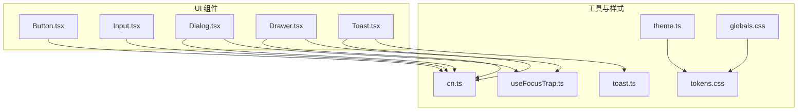
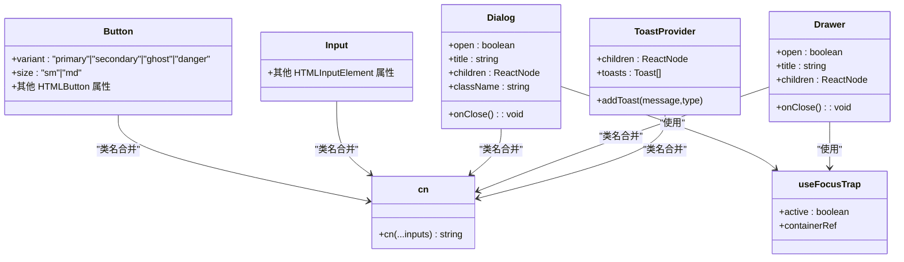
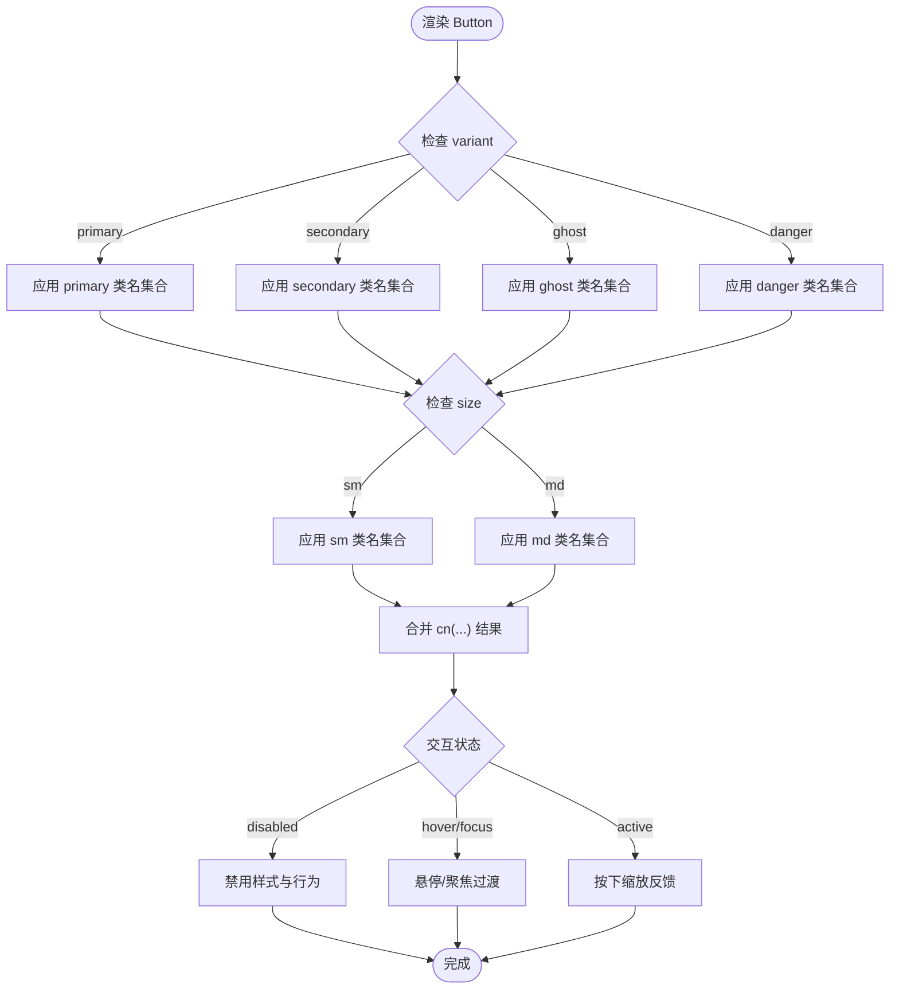
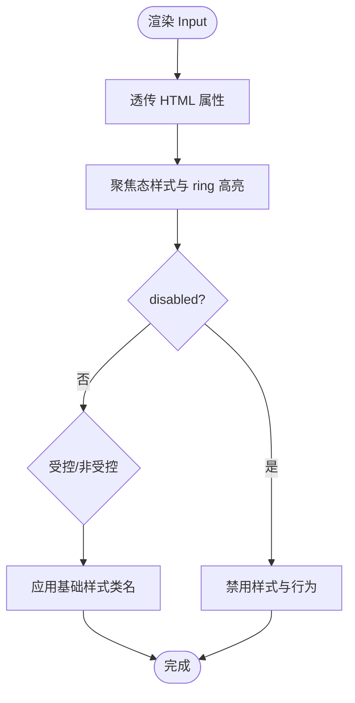
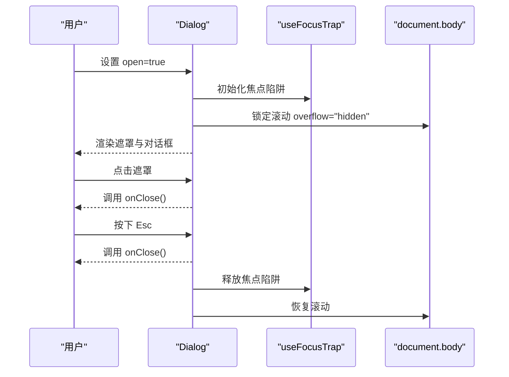
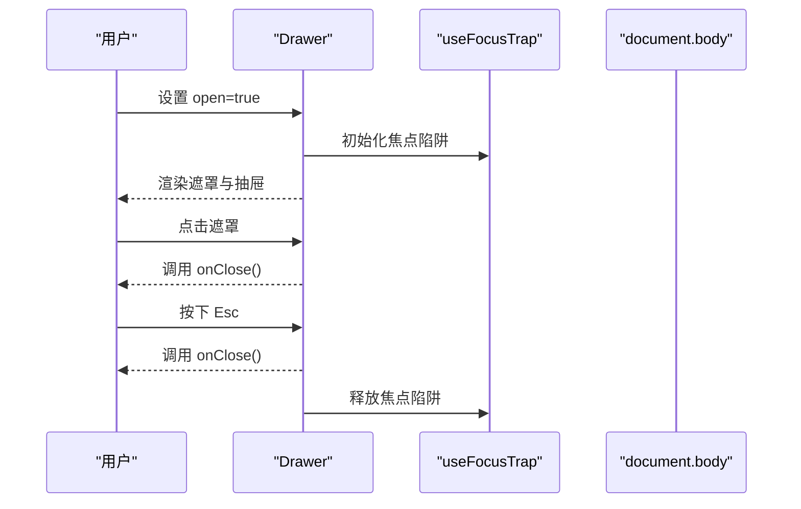
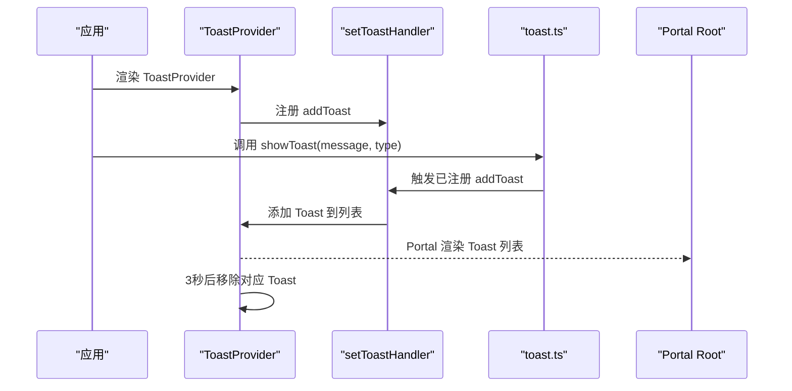
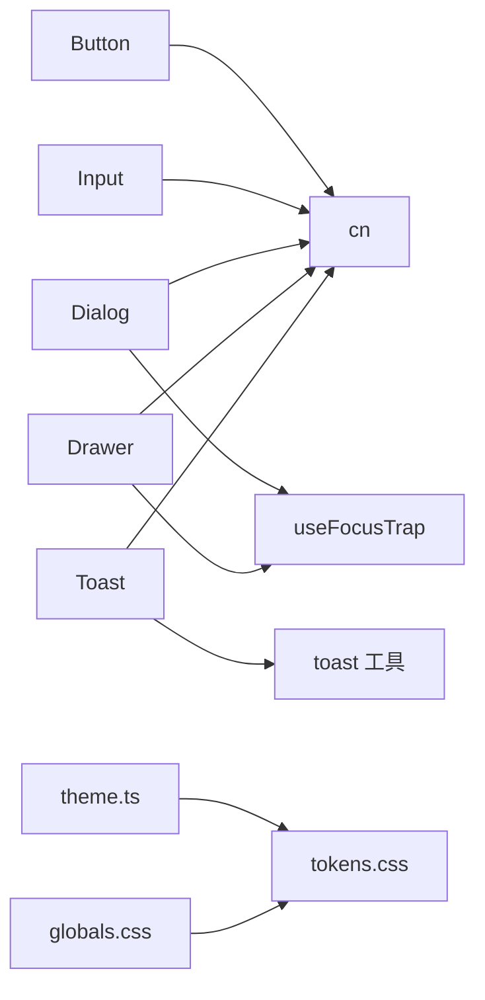

# 基础 UI 组件

<cite>
**本文引用的文件**
- [Button.tsx](file://src/components/ui/Button.tsx)
- [Button.test.tsx](file://src/components/ui/Button.test.tsx)
- [Input.tsx](file://src/components/ui/Input.tsx)
- [Input.test.tsx](file://src/components/ui/Input.test.tsx)
- [Dialog.tsx](file://src/components/ui/Dialog.tsx)
- [Dialog.test.tsx](file://src/components/ui/Dialog.test.tsx)
- [Drawer.tsx](file://src/components/ui/Drawer.tsx)
- [Drawer.test.tsx](file://src/components/ui/Drawer.test.tsx)
- [Toast.tsx](file://src/components/ui/Toast.tsx)
- [useFocusTrap.ts](file://src/lib/useFocusTrap.ts)
- [toast.ts](file://src/lib/toast.ts)
- [cn.ts](file://src/lib/cn.ts)
- [globals.css](file://src/styles/globals.css)
- [tokens.css](file://src/styles/tokens.css)
- [theme.ts](file://src/lib/theme.ts)
</cite>

## 目录

1. [简介](#简介)
2. [项目结构](#项目结构)
3. [核心组件](#核心组件)
4. [架构总览](#架构总览)
5. [详细组件分析](#详细组件分析)
6. [依赖分析](#依赖分析)
7. [性能考量](#性能考量)
8. [故障排查指南](#故障排查指南)
9. [结论](#结论)
10. [附录](#附录)

## 简介

本文件面向 Tab 项目的基础 UI 组件，系统性梳理并说明以下组件的设计与实现：Button（按钮）、Input（输入框）、Dialog（对话框）、Drawer（抽屉）与 Toast（通知）。内容涵盖组件的变体系统与尺寸规格、输入验证与无障碍支持、模态框实现与焦点管理、通知系统与显示策略，并提供 API 参考、属性说明、事件处理、使用示例以及样式定制、主题适配与响应式设计建议。

## 项目结构

基础 UI 组件集中于 src/components/ui 目录，配套的样式变量与主题逻辑位于 src/styles 与 src/lib。组件通过 cn 工具函数合并 Tailwind 类名，借助 useFocusTrap 提供键盘焦点陷阱，Toast 通过全局处理器统一调度。

图表来源

- [Button.tsx:1-41](file://src/components/ui/Button.tsx#L1-L41)
- [Input.tsx:1-21](file://src/components/ui/Input.tsx#L1-L21)
- [Dialog.tsx:1-65](file://src/components/ui/Dialog.tsx#L1-L65)
- [Drawer.tsx:1-62](file://src/components/ui/Drawer.tsx#L1-L62)
- [Toast.tsx:1-62](file://src/components/ui/Toast.tsx#L1-L62)
- [cn.ts:1-7](file://src/lib/cn.ts#L1-L7)
- [useFocusTrap.ts:1-71](file://src/lib/useFocusTrap.ts#L1-L71)
- [toast.ts:1-10](file://src/lib/toast.ts#L1-L10)
- [globals.css:1-147](file://src/styles/globals.css#L1-L147)
- [tokens.css:1-283](file://src/styles/tokens.css#L1-L283)
- [theme.ts:1-123](file://src/lib/theme.ts#L1-L123)

章节来源

- [Button.tsx:1-41](file://src/components/ui/Button.tsx#L1-L41)
- [Input.tsx:1-21](file://src/components/ui/Input.tsx#L1-L21)
- [Dialog.tsx:1-65](file://src/components/ui/Dialog.tsx#L1-L65)
- [Drawer.tsx:1-62](file://src/components/ui/Drawer.tsx#L1-L62)
- [Toast.tsx:1-62](file://src/components/ui/Toast.tsx#L1-L62)
- [cn.ts:1-7](file://src/lib/cn.ts#L1-L7)
- [useFocusTrap.ts:1-71](file://src/lib/useFocusTrap.ts#L1-L71)
- [toast.ts:1-10](file://src/lib/toast.ts#L1-L10)
- [globals.css:1-147](file://src/styles/globals.css#L1-L147)
- [tokens.css:1-283](file://src/styles/tokens.css#L1-L283)
- [theme.ts:1-123](file://src/lib/theme.ts#L1-L123)

## 核心组件

本节概述各组件的关键能力与设计要点：

- Button：提供变体（primary/secondary/ghost/danger）与尺寸（sm/md），基于 CSS 变量与 Tailwind 类实现一致的视觉与交互反馈。
- Input：提供基础输入样式与无障碍属性映射，支持禁用、占位符、默认值等标准行为。
- Dialog：可选标题、点击遮罩关闭、Esc 键关闭、焦点陷阱与无障碍属性，使用 Portal 渲染到指定挂载点。
- Drawer：右侧滑入抽屉、遮罩层、Esc 关闭、焦点陷阱与无障碍属性，使用 translate 动画控制显隐。
- Toast：全局通知容器，自动过期与手动关闭，支持 info/error 两类消息类型。

章节来源

- [Button.tsx:1-41](file://src/components/ui/Button.tsx#L1-L41)
- [Input.tsx:1-21](file://src/components/ui/Input.tsx#L1-L21)
- [Dialog.tsx:1-65](file://src/components/ui/Dialog.tsx#L1-L65)
- [Drawer.tsx:1-62](file://src/components/ui/Drawer.tsx#L1-L62)
- [Toast.tsx:1-62](file://src/components/ui/Toast.tsx#L1-L62)

## 架构总览

下图展示组件间关系与关键依赖：

图表来源

- [Button.tsx:1-41](file://src/components/ui/Button.tsx#L1-L41)
- [Input.tsx:1-21](file://src/components/ui/Input.tsx#L1-L21)
- [Dialog.tsx:1-65](file://src/components/ui/Dialog.tsx#L1-L65)
- [Drawer.tsx:1-62](file://src/components/ui/Drawer.tsx#L1-L62)
- [Toast.tsx:1-62](file://src/components/ui/Toast.tsx#L1-L62)
- [useFocusTrap.ts:1-71](file://src/lib/useFocusTrap.ts#L1-L71)
- [cn.ts:1-7](file://src/lib/cn.ts#L1-L7)

## 详细组件分析

### Button（按钮）

- 变体系统
  - primary：强调色背景与白色文字，带阴影与悬停透明度变化。
  - secondary：强表面背景与边框，悬停切换为弱表面。
  - ghost：透明背景，仅在悬停时应用表面色。
  - danger：红色系背景，悬停保持强度。
- 尺寸规格
  - sm：高度与内边距较小，字号更小。
  - md：默认尺寸，适合大多数场景。
- 交互状态
  - disabled：禁用光标与不透明度。
  - active：按下缩放反馈。
  - hover/focus：基于 CSS 过渡与阴影变化。
- API 参考
  - 属性
    - variant：变体枚举，默认 secondary。
    - size：尺寸枚举，默认 md。
    - 其他 HTMLButton 属性透传。
  - 事件
    - onClick、onMouseDown 等原生事件透传。
  - 使用示例
    - 基本用法：参考 [Button.test.tsx:6-9](file://src/components/ui/Button.test.tsx#L6-L9)。
    - 指定变体：参考 [Button.test.tsx:17-33](file://src/components/ui/Button.test.tsx#L17-L33)。
    - 指定尺寸：参考 [Button.test.tsx:41-45](file://src/components/ui/Button.test.tsx#L41-L45)。
    - 合并自定义类名：参考 [Button.test.tsx:47-51](file://src/components/ui/Button.test.tsx#L47-L51)。
    - 禁用状态：参考 [Button.test.tsx:53-57](file://src/components/ui/Button.test.tsx#L53-L57)。
    - 透传属性：参考 [Button.test.tsx:59-64](file://src/components/ui/Button.test.tsx#L59-L64)。
- 样式定制与主题适配
  - 基于 tokens.css 中的语义变量（如 --surface、--text-primary、--accent、--shadow-\*）进行统一调整。
  - cn 工具函数确保 Tailwind 类合并与冲突修复。
- 响应式设计
  - 组件尺寸与间距使用相对单位，适配不同屏幕密度。

图表来源

- [Button.tsx:12-39](file://src/components/ui/Button.tsx#L12-L39)
- [cn.ts:4-6](file://src/lib/cn.ts#L4-L6)

章节来源

- [Button.tsx:1-41](file://src/components/ui/Button.tsx#L1-L41)
- [Button.test.tsx:1-66](file://src/components/ui/Button.test.tsx#L1-L66)
- [cn.ts:1-7](file://src/lib/cn.ts#L1-L7)
- [tokens.css:1-283](file://src/styles/tokens.css#L1-L283)

### Input（输入框）

- 输入验证与状态管理
  - 支持受控与非受控两种模式（defaultValue、value）。
  - 禁用状态由 disabled 控制。
  - 占位符与类型透传至原生 input。
- 无障碍支持
  - 默认 role 为 textbox；可通过 aria-\* 属性扩展。
- API 参考
  - 属性
    - className：自定义类名。
    - 其他 HTMLInputElement 属性透传。
  - 使用示例
    - 基本渲染：参考 [Input.test.tsx:6-9](file://src/components/ui/Input.test.tsx#L6-L9)。
    - 占位符：参考 [Input.test.tsx:11-14](file://src/components/ui/Input.test.tsx#L11-L14)。
    - 透传类名：参考 [Input.test.tsx:16-20](file://src/components/ui/Input.test.tsx#L16-L20)。
    - 禁用状态：参考 [Input.test.tsx:22-25](file://src/components/ui/Input.test.tsx#L22-L25)。
    - 默认值：参考 [Input.test.tsx:27-31](file://src/components/ui/Input.test.tsx#L27-L31)。
    - 透传 type：参考 [Input.test.tsx:33-37](file://src/components/ui/Input.test.tsx#L33-L37)。
- 样式定制与主题适配
  - 使用 tokens.css 的语义变量（--surface、--text-_、--border、--shadow-_）。
  - cn 合并类名，保证聚焦态高亮与过渡效果。
- 响应式设计
  - 宽度为百分比，配合容器布局自适应。

图表来源

- [Input.tsx:6-20](file://src/components/ui/Input.tsx#L6-L20)
- [cn.ts:4-6](file://src/lib/cn.ts#L4-L6)

章节来源

- [Input.tsx:1-21](file://src/components/ui/Input.tsx#L1-L21)
- [Input.test.tsx:1-39](file://src/components/ui/Input.test.tsx#L1-L39)
- [cn.ts:1-7](file://src/lib/cn.ts#L1-L7)
- [tokens.css:1-283](file://src/styles/tokens.css#L1-L283)

### Dialog（对话框）

- 模态框实现
  - open 控制显隐；关闭回调 onClose。
  - 点击遮罩层或按 Esc 键触发关闭。
  - 背景滚动锁定，避免页面滚动穿透。
- 焦点管理与键盘导航
  - useFocusTrap 在打开时将焦点置于容器或首个可聚焦元素，并循环捕获 Tab。
  - 关闭时恢复先前焦点。
- 无障碍支持
  - role="dialog"、aria-modal="true"、aria-label 标题。
- API 参考
  - 属性
    - open：是否显示。
    - onClose：关闭回调。
    - title：可选标题文本。
    - children：内容节点。
    - className：自定义类名。
  - 使用示例
    - 关闭时无输出：参考 [Dialog.test.tsx:17-22](file://src/components/ui/Dialog.test.tsx#L17-L22)。
    - 打开时渲染内容与标题：参考 [Dialog.test.tsx:24-32](file://src/components/ui/Dialog.test.tsx#L24-L32)。
    - 点击遮罩关闭：参考 [Dialog.test.tsx:34-47](file://src/components/ui/Dialog.test.tsx#L34-L47)。
    - 按 Esc 关闭：参考 [Dialog.test.tsx:49-58](file://src/components/ui/Dialog.test.tsx#L49-L58)。
    - 内容点击不关闭：参考 [Dialog.test.tsx:60-69](file://src/components/ui/Dialog.test.tsx#L60-L69)。
    - 关闭按钮：参考 [Dialog.test.tsx:71-81](file://src/components/ui/Dialog.test.tsx#L71-L81)。
- 样式定制与主题适配
  - 使用 tokens.css 的语义变量与玻璃模糊层效果。
  - Portal 渲染至 #portal-root 或 body。
- 响应式设计
  - 最大宽度与相对定位，适配移动端。

图表来源

- [Dialog.tsx:15-64](file://src/components/ui/Dialog.tsx#L15-L64)
- [useFocusTrap.ts:6-70](file://src/lib/useFocusTrap.ts#L6-L70)

章节来源

- [Dialog.tsx:1-65](file://src/components/ui/Dialog.tsx#L1-L65)
- [Dialog.test.tsx:1-92](file://src/components/ui/Dialog.test.tsx#L1-L92)
- [useFocusTrap.ts:1-71](file://src/lib/useFocusTrap.ts#L1-L71)
- [tokens.css:104-146](file://src/styles/tokens.css#L104-L146)

### Drawer（抽屉）

- 模态框实现
  - open 控制显隐；关闭回调 onClose。
  - 点击遮罩层或按 Esc 键触发关闭。
  - 背景遮罩与右侧滑入动画。
- 焦点管理与键盘导航
  - useFocusTrap 在打开时将焦点置于容器或首个可聚焦元素，并循环捕获 Tab。
  - 关闭时恢复先前焦点。
- 无障碍支持
  - role="dialog"、aria-modal="true"、aria-label 标题。
- API 参考
  - 属性
    - open：是否显示。
    - onClose：关闭回调。
    - title：标题文本。
    - children：内容节点。
  - 使用示例
    - 关闭时隐藏：参考 [Drawer.test.tsx:6-14](file://src/components/ui/Drawer.test.tsx#L6-L14)。
    - 打开时可见并渲染内容：参考 [Drawer.test.tsx:16-25](file://src/components/ui/Drawer.test.tsx#L16-L25)。
    - 标题渲染：参考 [Drawer.test.tsx:27-34](file://src/components/ui/Drawer.test.tsx#L27-L34)。
    - 遮罩点击关闭：参考 [Drawer.test.tsx:36-47](file://src/components/ui/Drawer.test.tsx#L36-L47)。
    - 按 Esc 关闭：参考 [Drawer.test.tsx:49-58](file://src/components/ui/Drawer.test.tsx#L49-L58)。
- 样式定制与主题适配
  - 使用 tokens.css 的语义变量与玻璃模糊层效果。
- 响应式设计
  - 固定宽度与最大宽度限制，适配移动端。

图表来源

- [Drawer.tsx:13-61](file://src/components/ui/Drawer.tsx#L13-L61)
- [useFocusTrap.ts:6-70](file://src/lib/useFocusTrap.ts#L6-L70)

章节来源

- [Drawer.tsx:1-62](file://src/components/ui/Drawer.tsx#L1-L62)
- [Drawer.test.tsx:1-60](file://src/components/ui/Drawer.test.tsx#L1-L60)
- [useFocusTrap.ts:1-71](file://src/lib/useFocusTrap.ts#L1-L71)
- [tokens.css:104-146](file://src/styles/tokens.css#L104-L146)

### Toast（通知）

- 通知系统
  - ToastProvider 管理 toasts 列表，addToast 动态添加消息。
  - 自动 3 秒过期移除，支持手动关闭。
  - 支持 info 与 error 两类消息类型。
- 显示策略
  - 底部右对齐堆叠显示，逐条入场动画。
  - 错误消息使用红色系强调。
- API 参考
  - 组件
    - ToastProvider：包裹应用根节点，注入全局 addToast 处理器。
  - 工具
    - setToastHandler(fn)：注册全局处理器。
    - showToast(message, type)：调用已注册处理器。
  - 使用示例
    - 注册处理器：参考 [Toast.tsx:25-28](file://src/components/ui/Toast.tsx#L25-L28)。
    - 添加通知：参考 [toast.ts:7-9](file://src/lib/toast.ts#L7-L9)。
    - 渲染与关闭：参考 [Toast.tsx:33-59](file://src/components/ui/Toast.tsx#L33-L59)。
- 样式定制与主题适配
  - 使用 tokens.css 的语义变量与玻璃模糊层效果。
  - 错误样式基于 --surface-strong 与红色系变量。
- 响应式设计
  - 固定位置与相对容器布局，适配移动端。

图表来源

- [Toast.tsx:13-61](file://src/components/ui/Toast.tsx#L13-L61)
- [toast.ts:3-9](file://src/lib/toast.ts#L3-L9)

章节来源

- [Toast.tsx:1-62](file://src/components/ui/Toast.tsx#L1-L62)
- [toast.ts:1-10](file://src/lib/toast.ts#L1-L10)
- [tokens.css:104-146](file://src/styles/tokens.css#L104-L146)

## 依赖分析

- 组件耦合
  - Button/Input 仅依赖 cn 工具，低耦合。
  - Dialog/Drawer 依赖 useFocusTrap 与 cn，共同实现无障碍与焦点管理。
  - Toast 依赖 toast 工具与 Portal，实现全局通知。
- 外部依赖
  - Tailwind 与 css 变量：通过 tokens.css 与 globals.css 提供统一设计语言。
  - 主题系统：theme.ts 通过 CSS 类与变量驱动外观切换。
- 循环依赖
  - 未发现循环依赖；组件间均为单向依赖。

图表来源

- [Button.tsx:1-41](file://src/components/ui/Button.tsx#L1-L41)
- [Input.tsx:1-21](file://src/components/ui/Input.tsx#L1-L21)
- [Dialog.tsx:1-65](file://src/components/ui/Dialog.tsx#L1-L65)
- [Drawer.tsx:1-62](file://src/components/ui/Drawer.tsx#L1-L62)
- [Toast.tsx:1-62](file://src/components/ui/Toast.tsx#L1-L62)
- [useFocusTrap.ts:1-71](file://src/lib/useFocusTrap.ts#L1-L71)
- [toast.ts:1-10](file://src/lib/toast.ts#L1-L10)
- [cn.ts:1-7](file://src/lib/cn.ts#L1-L7)
- [globals.css:1-147](file://src/styles/globals.css#L1-L147)
- [tokens.css:1-283](file://src/styles/tokens.css#L1-L283)
- [theme.ts:1-123](file://src/lib/theme.ts#L1-L123)

章节来源

- [Button.tsx:1-41](file://src/components/ui/Button.tsx#L1-L41)
- [Input.tsx:1-21](file://src/components/ui/Input.tsx#L1-L21)
- [Dialog.tsx:1-65](file://src/components/ui/Dialog.tsx#L1-L65)
- [Drawer.tsx:1-62](file://src/components/ui/Drawer.tsx#L1-L62)
- [Toast.tsx:1-62](file://src/components/ui/Toast.tsx#L1-L62)
- [useFocusTrap.ts:1-71](file://src/lib/useFocusTrap.ts#L1-L71)
- [toast.ts:1-10](file://src/lib/toast.ts#L1-L10)
- [cn.ts:1-7](file://src/lib/cn.ts#L1-L7)
- [globals.css:1-147](file://src/styles/globals.css#L1-L147)
- [tokens.css:1-283](file://src/styles/tokens.css#L1-L283)
- [theme.ts:1-123](file://src/lib/theme.ts#L1-L123)

## 性能考量

- 渲染与重绘
  - Button/Input 为纯展示组件，最小化重渲染路径。
  - Dialog/Drawer 使用 Portal 与固定定位，减少布局抖动。
- 动画与过渡
  - tokens.css 定义了统一的过渡时长，减少动画冲突。
  - reduce-motion 与 prefers-reduced-motion 下自动降低动画。
- 计算复杂度
  - useFocusTrap 在激活时扫描容器内可聚焦元素，复杂度 O(n)，n 为子树内可聚焦元素数量；通常规模较小，影响有限。

## 故障排查指南

- Button 未应用预期样式
  - 检查 variant/size 是否正确传入，确认 cn 合并顺序与覆盖规则。
  - 参考：[Button.tsx:24-39](file://src/components/ui/Button.tsx#L24-L39)
- Input 无法聚焦或样式异常
  - 确认未被父级禁用；检查 className 是否覆盖默认样式。
  - 参考：[Input.tsx:6-20](file://src/components/ui/Input.tsx#L6-L20)
- Dialog/Drawer 无法关闭或焦点错乱
  - 确认 open 状态与 onClose 回调；检查 useFocusTrap 的激活时机。
  - 参考：[Dialog.tsx:15-64](file://src/components/ui/Dialog.tsx#L15-L64)、[Drawer.tsx:13-61](file://src/components/ui/Drawer.tsx#L13-L61)、[useFocusTrap.ts:6-70](file://src/lib/useFocusTrap.ts#L6-L70)
- Toast 不显示或无法关闭
  - 确认 ToastProvider 已包裹根节点；检查 Portal 挂载点是否存在。
  - 参考：[Toast.tsx:13-61](file://src/components/ui/Toast.tsx#L13-L61)
- 主题与颜色不一致
  - 检查 theme.ts 是否正确应用 CSS 类与变量；确认 tokens.css 变量值。
  - 参考：[theme.ts:5-45](file://src/lib/theme.ts#L5-L45)、[tokens.css:1-283](file://src/styles/tokens.css#L1-L283)

章节来源

- [Button.tsx:1-41](file://src/components/ui/Button.tsx#L1-L41)
- [Input.tsx:1-21](file://src/components/ui/Input.tsx#L1-L21)
- [Dialog.tsx:1-65](file://src/components/ui/Dialog.tsx#L1-L65)
- [Drawer.tsx:1-62](file://src/components/ui/Drawer.tsx#L1-L62)
- [Toast.tsx:1-62](file://src/components/ui/Toast.tsx#L1-L62)
- [useFocusTrap.ts:1-71](file://src/lib/useFocusTrap.ts#L1-L71)
- [theme.ts:1-123](file://src/lib/theme.ts#L1-L123)
- [tokens.css:1-283](file://src/styles/tokens.css#L1-L283)

## 结论

本项目的基础 UI 组件以简洁、可组合为核心设计原则：Button 与 Input 提供一致的视觉与交互体验；Dialog/Drawer 通过焦点陷阱与无障碍属性保障可用性；Toast 以全局处理器实现统一通知体验。配合 tokens.css 与 theme.ts，组件具备良好的主题适配与响应式表现。建议在业务中优先使用这些组件，以保持一致性与可维护性。

## 附录

- 样式定制清单
  - 颜色体系：--text-_、--surface_、--accent、--border、--overlay。
  - 形状与阴影：--radius-_、--shadow-_。
  - 动画与模糊：--transition-duration、--blur-_、--saturate-_。
  - 玻璃效果：backdrop-blur-glass/backdrop-blur-pop。
- 主题开关
  - light/dark/system：通过 theme.ts 切换 documentElement 类。
  - glass-mode：切换 Tahoe 玻璃风格。
  - reduce-motion：尊重系统偏好并自动应用。
- 响应式建议
  - 使用相对单位与最大宽度约束，确保在窄屏设备上可读可用。
  - 避免在小屏上使用过宽的固定宽度组件。

章节来源

- [tokens.css:1-283](file://src/styles/tokens.css#L1-L283)
- [globals.css:104-146](file://src/styles/globals.css#L104-L146)
- [theme.ts:5-45](file://src/lib/theme.ts#L5-L45)
