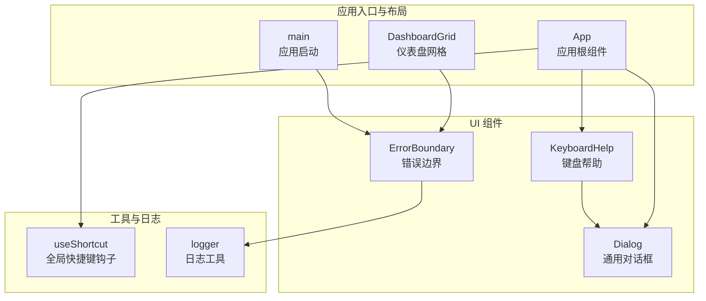
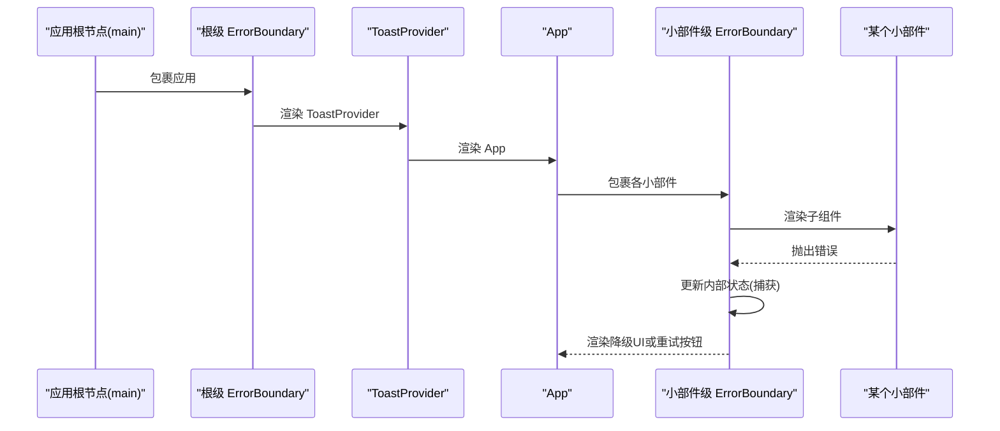
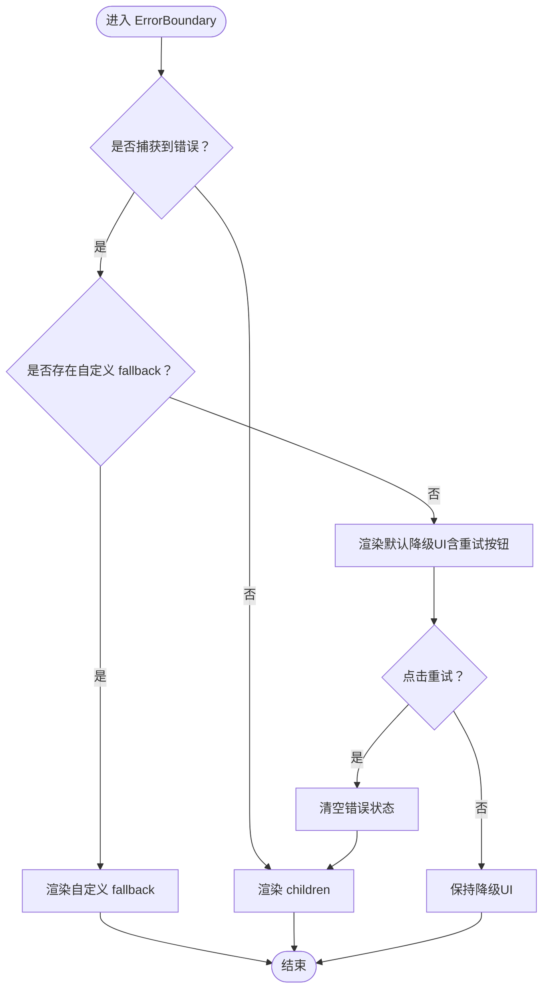
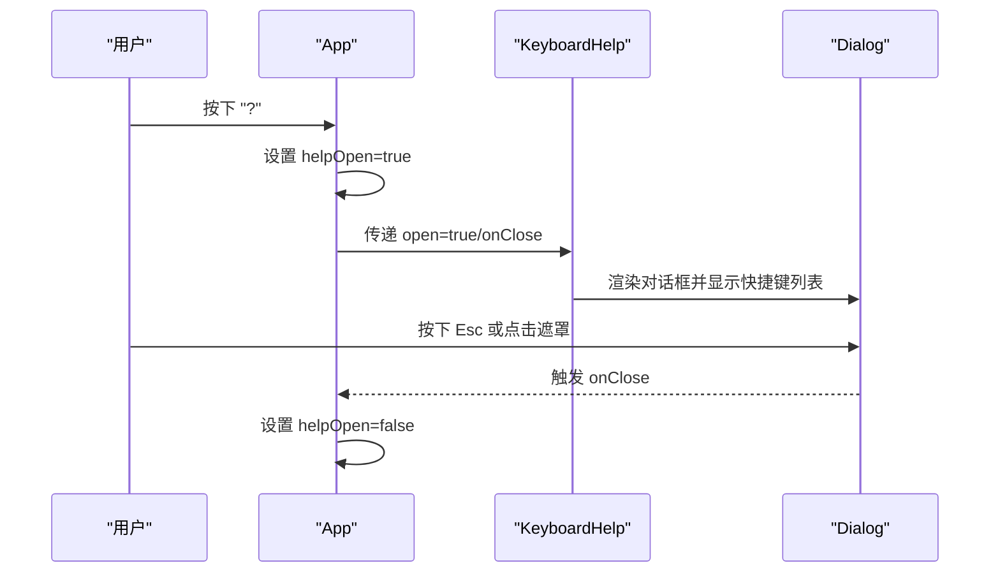
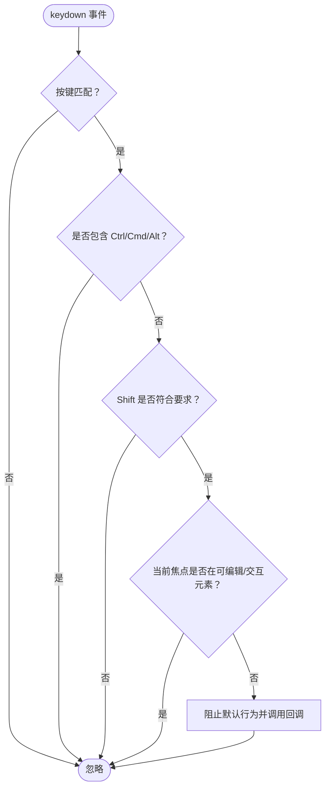
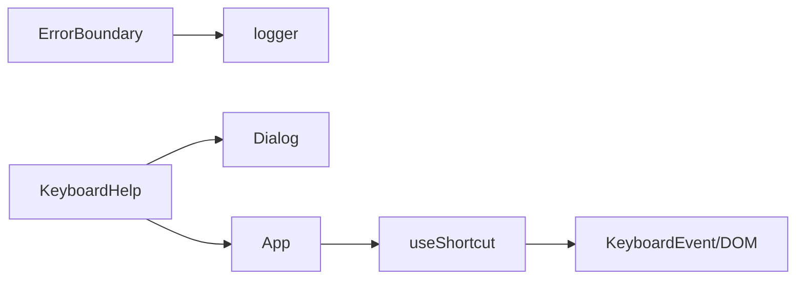

# 辅助组件

<cite>
**本文引用的文件**
- [ErrorBoundary.tsx](file://src/components/ui/ErrorBoundary.tsx)
- [KeyboardHelp.tsx](file://src/components/ui/KeyboardHelp.tsx)
- [Dialog.tsx](file://src/components/ui/Dialog.tsx)
- [useShortcut.ts](file://src/lib/useShortcut.ts)
- [logger.ts](file://src/lib/logger.ts)
- [DashboardGrid.tsx](file://src/components/layout/DashboardGrid.tsx)
- [App.tsx](file://src/newtab/App.tsx)
- [main.tsx](file://src/newtab/main.tsx)
</cite>

## 目录

1. [简介](#简介)
2. [项目结构](#项目结构)
3. [核心组件](#核心组件)
4. [架构总览](#架构总览)
5. [详细组件分析](#详细组件分析)
6. [依赖关系分析](#依赖关系分析)
7. [性能考量](#性能考量)
8. [故障排除指南](#故障排除指南)
9. [结论](#结论)
10. [附录：API 参考与使用示例](#附录api-参考与使用示例)

## 简介

本文件系统性梳理并说明两类辅助组件：错误边界 ErrorBoundary 与键盘帮助 KeyboardHelp。前者负责在组件树内捕获运行时错误，提供降级渲染与重试能力，保障应用整体稳定性；后者通过对话框形式展示全局快捷键，提升用户操作效率与可发现性。文档覆盖错误传播路径、错误状态管理、用户体验保护、配置项与样式定制、集成方法、完整 API 参考、典型场景与最佳实践、以及性能与可靠性分析。

## 项目结构

这两个组件位于 UI 层，分别承担“容错”和“引导”的职责：

- 错误边界 ErrorBoundary：位于 UI 组件目录，作为类组件边界包裹子树，拦截子树抛出的错误。
- 键盘帮助 KeyboardHelp：同样位于 UI 组件目录，基于 Dialog 实现，用于展示快捷键列表。
- 快捷键钩子 useShortcut：位于 lib 目录，为应用提供全局快捷键注册与过滤逻辑，被 App 使用以绑定快捷键行为。

图表来源

- [ErrorBoundary.tsx:1-48](file://src/components/ui/ErrorBoundary.tsx#L1-L48)
- [KeyboardHelp.tsx:1-45](file://src/components/ui/KeyboardHelp.tsx#L1-L45)
- [Dialog.tsx:1-96](file://src/components/ui/Dialog.tsx#L1-L96)
- [useShortcut.ts:1-49](file://src/lib/useShortcut.ts#L1-L49)
- [logger.ts:1-35](file://src/lib/logger.ts#L1-L35)
- [DashboardGrid.tsx:1-110](file://src/components/layout/DashboardGrid.tsx#L1-L110)
- [App.tsx:1-110](file://src/newtab/App.tsx#L1-L110)
- [main.tsx:1-29](file://src/newtab/main.tsx#L1-L29)

章节来源

- [ErrorBoundary.tsx:1-48](file://src/components/ui/ErrorBoundary.tsx#L1-L48)
- [KeyboardHelp.tsx:1-45](file://src/components/ui/KeyboardHelp.tsx#L1-L45)
- [Dialog.tsx:1-96](file://src/components/ui/Dialog.tsx#L1-L96)
- [useShortcut.ts:1-49](file://src/lib/useShortcut.ts#L1-L49)
- [logger.ts:1-35](file://src/lib/logger.ts#L1-L35)
- [DashboardGrid.tsx:1-110](file://src/components/layout/DashboardGrid.tsx#L1-L110)
- [App.tsx:1-110](file://src/newtab/App.tsx#L1-L110)
- [main.tsx:1-29](file://src/newtab/main.tsx#L1-L29)

## 核心组件

- ErrorBoundary：类组件边界，拦截子树错误，记录日志，并提供默认降级 UI 或自定义 fallback 渲染。
- KeyboardHelp：函数组件，基于 Dialog 展示一组预置的全局快捷键条目，提示用户如何高效操作。
- useShortcut：自定义 Hook，封装全局快捷键监听、修饰键过滤、输入焦点判断与事件阻止等逻辑，避免与浏览器/系统快捷键冲突。

章节来源

- [ErrorBoundary.tsx:15-47](file://src/components/ui/ErrorBoundary.tsx#L15-L47)
- [KeyboardHelp.tsx:19-44](file://src/components/ui/KeyboardHelp.tsx#L19-L44)
- [useShortcut.ts:14-48](file://src/lib/useShortcut.ts#L14-L48)

## 架构总览

下图展示了 ErrorBoundary 在应用中的两级使用位置：应用根级与仪表盘小部件级，分别用于兜底顶层渲染错误与单个小部件错误。

图表来源

- [main.tsx:17-24](file://src/newtab/main.tsx#L17-L24)
- [DashboardGrid.tsx:87-89](file://src/components/layout/DashboardGrid.tsx#L87-L89)

章节来源

- [main.tsx:11-26](file://src/newtab/main.tsx#L11-L26)
- [DashboardGrid.tsx:79-93](file://src/components/layout/DashboardGrid.tsx#L79-L93)

## 详细组件分析

### ErrorBoundary 错误边界

- 功能定位
  - 捕获子树抛出的错误，避免整树崩溃。
  - 记录错误信息到日志系统，便于排查。
  - 提供默认降级 UI（失败提示 + 重试按钮），或允许传入自定义 fallback 覆盖。
- 错误传播与状态管理
  - 通过静态生命周期 getDerivedStateFromError 将内部 hasError 置为 true 并保存错误对象。
  - 在 componentDidCatch 中记录错误堆栈到日志。
  - 重试时清空错误状态，恢复 children 渲染。
- 用户体验保护
  - 默认降级 UI 提供明确提示与重试入口，减少用户困惑。
  - 自定义 fallback 可承载更友好的降级内容（如占位骨架、提示文案等）。
- 配置与扩展
  - 支持通过 props.fallback 自定义降级内容。
  - 可结合 Toast 或其他通知系统在捕获错误后提示用户。
- 性能与可靠性
  - 仅在错误发生时渲染降级 UI，正常渲染不引入额外开销。
  - 建议仅包裹可能不稳定的小部件或子树，避免过度包裹导致边界过多。

图表来源

- [ErrorBoundary.tsx:18-28](file://src/components/ui/ErrorBoundary.tsx#L18-L28)
- [ErrorBoundary.tsx:30-46](file://src/components/ui/ErrorBoundary.tsx#L30-L46)

章节来源

- [ErrorBoundary.tsx:15-47](file://src/components/ui/ErrorBoundary.tsx#L15-L47)
- [logger.ts:20-30](file://src/lib/logger.ts#L20-L30)

### KeyboardHelp 键盘帮助

- 功能定位
  - 以对话框形式展示一组全局快捷键，帮助用户快速掌握操作方式。
  - 内置一组常用快捷键条目，包括聚焦搜索框、切换编辑模式、打开设置、显示帮助、关闭弹层、在搜索建议中移动、提交搜索等。
- 交互与可用性
  - 基于 Dialog 实现，支持 Esc 关闭、点击遮罩关闭、焦点陷阱等无障碍特性。
  - 提示输入状态下按键不会触发全局快捷键，避免干扰用户输入。
- 集成方式
  - 在 App 中通过状态控制 open/onClose，配合 useShortcut 注册快捷键 '?' 打开帮助。
  - 可根据需要扩展 SHORTCUTS 列表或自定义样式类名。

图表来源

- [App.tsx:21-24](file://src/newtab/App.tsx#L21-L24)
- [App.tsx:106-107](file://src/newtab/App.tsx#L106-L107)
- [KeyboardHelp.tsx:19-44](file://src/components/ui/KeyboardHelp.tsx#L19-L44)
- [Dialog.tsx:45-55](file://src/components/ui/Dialog.tsx#L45-L55)

章节来源

- [KeyboardHelp.tsx:8-17](file://src/components/ui/KeyboardHelp.tsx#L8-L17)
- [KeyboardHelp.tsx:19-44](file://src/components/ui/KeyboardHelp.tsx#L19-L44)
- [Dialog.tsx:15-96](file://src/components/ui/Dialog.tsx#L15-L96)
- [App.tsx:106-107](file://src/newtab/App.tsx#L106-L107)

### 全局快捷键钩子 useShortcut

- 功能定位
  - 为指定按键注册回调，自动过滤与浏览器/系统快捷键冲突的组合（Ctrl/Cmd/Alt）。
  - 对特定按键（如 Shift 编码的符号）正确识别 Shift 是否必须。
  - 避免在输入框、文本域、可编辑元素或特定 role 的交互元素中触发。
- 使用建议
  - 将回调函数用 useRef 保持引用稳定，避免重复绑定。
  - 在组件卸载时自动清理事件监听，避免内存泄漏。
- 与 KeyboardHelp 的关系
  - App 通过 useShortcut 注册 '?' 打开帮助面板，与 KeyboardHelp 的展示形成闭环。

图表来源

- [useShortcut.ts:21-47](file://src/lib/useShortcut.ts#L21-L47)

章节来源

- [useShortcut.ts:14-48](file://src/lib/useShortcut.ts#L14-L48)
- [App.tsx:21-24](file://src/newtab/App.tsx#L21-L24)

## 依赖关系分析

- ErrorBoundary 依赖
  - 日志工具：记录错误堆栈，便于调试与追踪。
  - 子组件：children 或自定义 fallback。
- KeyboardHelp 依赖
  - Dialog：提供模态对话框、焦点陷阱、Esc 关闭等通用能力。
  - App：通过状态 open/onClose 控制显示。
- useShortcut 依赖
  - 浏览器原生 KeyboardEvent API。
  - DOM 焦点与元素类型检测，避免与输入/编辑场景冲突。

图表来源

- [ErrorBoundary.tsx:22-24](file://src/components/ui/ErrorBoundary.tsx#L22-L24)
- [KeyboardHelp.tsx:19-44](file://src/components/ui/KeyboardHelp.tsx#L19-L44)
- [Dialog.tsx:15-96](file://src/components/ui/Dialog.tsx#L15-L96)
- [useShortcut.ts:21-47](file://src/lib/useShortcut.ts#L21-L47)
- [App.tsx:21-24](file://src/newtab/App.tsx#L21-L24)

章节来源

- [ErrorBoundary.tsx:1-48](file://src/components/ui/ErrorBoundary.tsx#L1-L48)
- [KeyboardHelp.tsx:1-45](file://src/components/ui/KeyboardHelp.tsx#L1-L45)
- [Dialog.tsx:1-96](file://src/components/ui/Dialog.tsx#L1-L96)
- [useShortcut.ts:1-49](file://src/lib/useShortcut.ts#L1-L49)
- [App.tsx:1-110](file://src/newtab/App.tsx#L1-L110)

## 性能考量

- ErrorBoundary
  - 正常渲染无额外成本；仅在错误发生时切换到降级 UI，开销极低。
  - 建议仅包裹可能不稳定的小部件，避免在大量组件上重复包裹造成边界过多。
- KeyboardHelp
  - 仅在 open 为 true 时渲染，且基于 Portal 渲染到 #portal-root 或 body，避免阻塞主渲染树。
  - 列表项数量有限，渲染开销可忽略。
- useShortcut
  - 事件监听在挂载时注册，卸载时清理，避免内存泄漏。
  - 过滤逻辑简单，对主线程影响微乎其微。

[本节为通用性能讨论，无需特定文件引用]

## 故障排除指南

- ErrorBoundary 未生效
  - 确认错误是否由子组件抛出，且未被更外层边界捕获。
  - 检查是否传入了自定义 fallback 导致无法看到默认降级 UI。
  - 查看日志输出，确认错误堆栈是否被记录。
- 降级 UI 不出现
  - 确认 children 是否抛错；若未抛错则不会进入降级分支。
  - 检查 fallback 是否返回了有效内容。
- 重试无效
  - 确认 handleRetry 是否被调用，且状态已清空。
- KeyboardHelp 无法打开
  - 检查 App 中是否正确注册了 '?' 快捷键。
  - 确认 open 状态与 onClose 回调是否正确传递给 KeyboardHelp。
- 快捷键冲突
  - useShortcut 已过滤 Ctrl/Cmd/Alt，但若在输入框中仍会忽略，确保不在可编辑元素中触发。
  - 对于 Shift 编码的特殊符号，确认 key 字符串是否与 requiresShift 的判断一致。

章节来源

- [ErrorBoundary.tsx:18-28](file://src/components/ui/ErrorBoundary.tsx#L18-L28)
- [logger.ts:20-30](file://src/lib/logger.ts#L20-L30)
- [App.tsx:21-24](file://src/newtab/App.tsx#L21-L24)
- [useShortcut.ts:21-47](file://src/lib/useShortcut.ts#L21-L47)

## 结论

ErrorBoundary 与 KeyboardHelp 分别从“稳定性”和“可用性”两个维度增强用户体验：前者通过边界捕获与降级渲染保护应用整体不因局部错误而崩溃；后者通过清晰的快捷键提示降低学习成本，提升操作效率。二者与 useShortcut、Dialog 等基础能力协同工作，构成一个健壮、易用的前端辅助体系。

[本节为总结性内容，无需特定文件引用]

## 附录：API 参考与使用示例

### ErrorBoundary API

- 组件类型：类组件
- 属性
  - children: ReactNode（必填）
  - fallback?: ReactNode（可选，自定义降级内容）
- 行为
  - 捕获子树错误并记录日志
  - 提供默认降级 UI 或自定义 fallback
  - 提供重试入口，恢复 children 渲染
- 使用示例（路径）
  - 应用根级包裹：[main.tsx:17-24](file://src/newtab/main.tsx#L17-L24)
  - 小部件级包裹：[DashboardGrid.tsx:87-89](file://src/components/layout/DashboardGrid.tsx#L87-L89)

章节来源

- [ErrorBoundary.tsx:5-8](file://src/components/ui/ErrorBoundary.tsx#L5-L8)
- [ErrorBoundary.tsx:15-47](file://src/components/ui/ErrorBoundary.tsx#L15-L47)
- [main.tsx:17-24](file://src/newtab/main.tsx#L17-L24)
- [DashboardGrid.tsx:87-89](file://src/components/layout/DashboardGrid.tsx#L87-L89)

### KeyboardHelp API

- 组件类型：函数组件
- 属性
  - open: boolean（必填，控制显示/隐藏）
  - onClose: () => void（必填，关闭回调）
- 行为
  - 基于 Dialog 展示快捷键列表
  - 提示输入状态下按键不会触发全局快捷键
- 使用示例（路径）
  - App 中注册快捷键并控制显示：[App.tsx:21-24](file://src/newtab/App.tsx#L21-L24), [App.tsx:106-107](file://src/newtab/App.tsx#L106-L107)
  - Dialog 基础能力：[Dialog.tsx:15-96](file://src/components/ui/Dialog.tsx#L15-L96)

章节来源

- [KeyboardHelp.tsx:3-6](file://src/components/ui/KeyboardHelp.tsx#L3-L6)
- [KeyboardHelp.tsx:19-44](file://src/components/ui/KeyboardHelp.tsx#L19-L44)
- [App.tsx:21-24](file://src/newtab/App.tsx#L21-L24)
- [App.tsx:106-107](file://src/newtab/App.tsx#L106-L107)
- [Dialog.tsx:15-96](file://src/components/ui/Dialog.tsx#L15-L96)

### useShortcut API

- 函数签名
  - useShortcut(key: string, handler: (event: KeyboardEvent) => void)
- 行为
  - 注册全局快捷键监听
  - 过滤 Ctrl/Cmd/Alt 修饰键
  - 根据按键特征判断是否必须包含 Shift
  - 避免在输入/编辑元素中触发
- 使用示例（路径）
  - App 中注册多个快捷键：[App.tsx:21-24](file://src/newtab/App.tsx#L21-L24)

章节来源

- [useShortcut.ts:14-48](file://src/lib/useShortcut.ts#L14-L48)
- [App.tsx:21-24](file://src/newtab/App.tsx#L21-L24)

### 最佳实践

- ErrorBoundary
  - 仅包裹可能不稳定的小部件或子树，避免边界过多。
  - 为重要页面或关键路径保留根级 ErrorBoundary，确保应用整体稳定。
  - 结合日志系统记录错误，便于后续排查。
- KeyboardHelp
  - 保持快捷键列表简洁、一致，避免与系统/浏览器快捷键冲突。
  - 在输入场景明确提示用户按键不会触发全局快捷键。
- useShortcut
  - 使用 useRef 保持回调引用稳定，避免重复绑定。
  - 对特殊按键（Shift 编码符号）确保 key 字符串与 requiresShift 判断一致。

[本节为通用最佳实践，无需特定文件引用]
