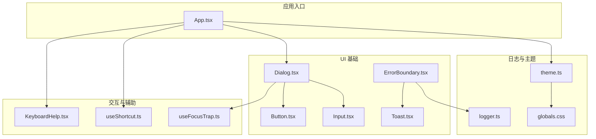
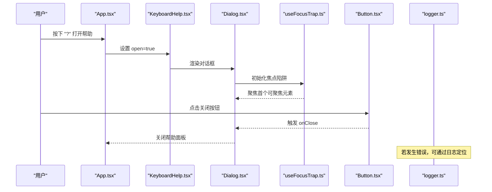
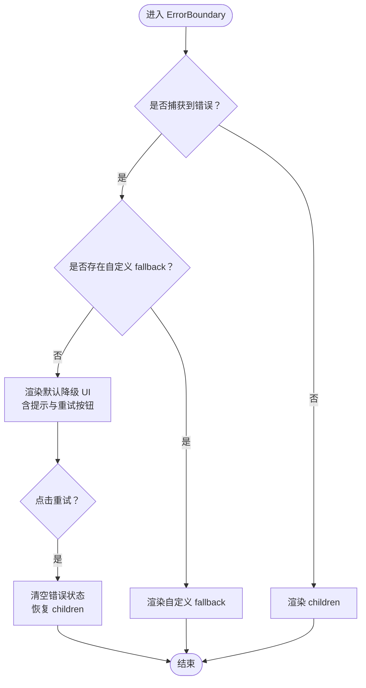
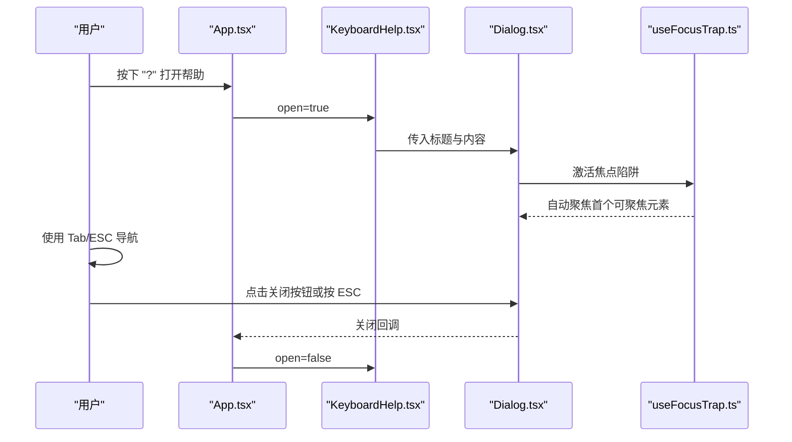
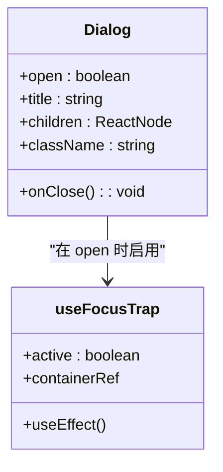
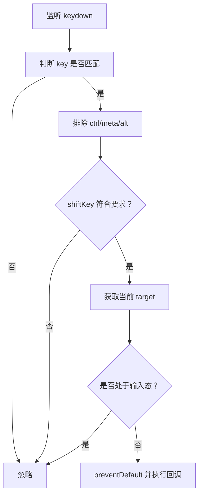
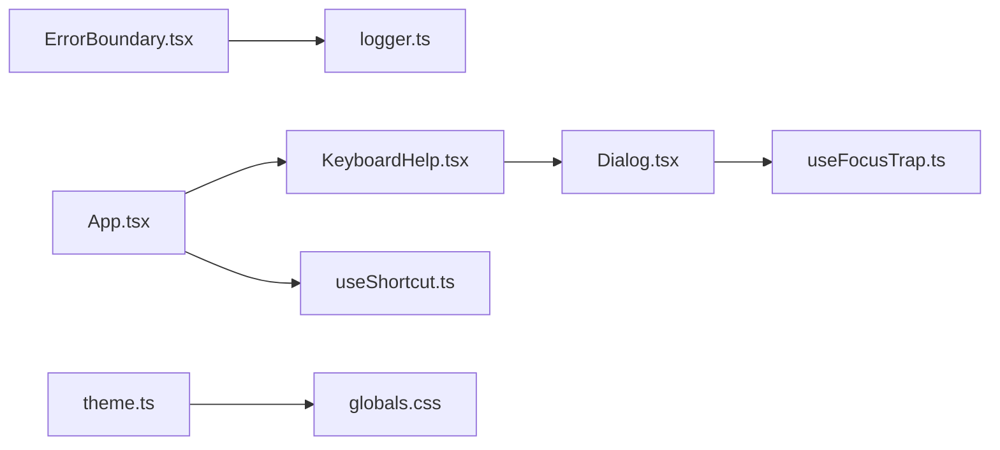

# 无障碍支持与错误处理

<cite>
**本文引用的文件**
- [src/components/ui/ErrorBoundary.tsx](file://src/components/ui/ErrorBoundary.tsx)
- [src/components/ui/KeyboardHelp.tsx](file://src/components/ui/KeyboardHelp.tsx)
- [src/components/ui/Dialog.tsx](file://src/components/ui/Dialog.tsx)
- [src/components/ui/Button.tsx](file://src/components/ui/Button.tsx)
- [src/components/ui/Input.tsx](file://src/components/ui/Input.tsx)
- [src/components/ui/Toast.tsx](file://src/components/ui/Toast.tsx)
- [src/lib/useFocusTrap.ts](file://src/lib/useFocusTrap.ts)
- [src/lib/useShortcut.ts](file://src/lib/useShortcut.ts)
- [src/lib/logger.ts](file://src/lib/logger.ts)
- [src/newtab/App.tsx](file://src/newtab/App.tsx)
- [src/components/ui/Button.test.tsx](file://src/components/ui/Button.test.tsx)
- [src/components/ui/Dialog.test.tsx](file://src/components/ui/Dialog.test.tsx)
- [src/lib/theme.ts](file://src/lib/theme.ts)
- [src/styles/globals.css](file://src/styles/globals.css)
</cite>

## 目录

1. [简介](#简介)
2. [项目结构](#项目结构)
3. [核心组件](#核心组件)
4. [架构总览](#架构总览)
5. [详细组件分析](#详细组件分析)
6. [依赖关系分析](#依赖关系分析)
7. [性能考量](#性能考量)
8. [故障排查指南](#故障排查指南)
9. [结论](#结论)
10. [附录](#附录)

## 简介

本文件聚焦于 Tab 项目在“无障碍支持”与“错误处理”两个维度的实现与最佳实践。内容涵盖：

- 错误边界 ErrorBoundary 的错误捕获机制、错误边界管理与降级显示策略
- 键盘帮助 KeyboardHelp 的快捷键展示、键盘导航与辅助功能实现
- ARIA 属性使用、语义化标记与屏幕阅读器支持
- 无障碍最佳实践、WCAG 合规性检查要点与用户体验优化建议
- 错误处理策略、用户反馈机制与调试工具使用指南

## 项目结构

围绕无障碍与错误处理的关键文件组织如下：

- 错误处理与反馈：ErrorBoundary、Toast、logger
- 键盘交互与帮助：KeyboardHelp、useShortcut、useFocusTrap
- 对话框与语义化：Dialog、Button、Input
- 主应用集成：App 中快捷键绑定与帮助面板调用
- 样式与主题：globals.css、theme.ts

图表来源

- [src/newtab/App.tsx:10-110](file://src/newtab/App.tsx#L10-L110)
- [src/components/ui/Dialog.tsx:15-65](file://src/components/ui/Dialog.tsx#L15-L65)
- [src/components/ui/Button.tsx:24-41](file://src/components/ui/Button.tsx#L24-L41)
- [src/components/ui/Input.tsx:6-21](file://src/components/ui/Input.tsx#L6-L21)
- [src/components/ui/ErrorBoundary.tsx:15-48](file://src/components/ui/ErrorBoundary.tsx#L15-L48)
- [src/components/ui/Toast.tsx:13-62](file://src/components/ui/Toast.tsx#L13-L62)
- [src/components/ui/KeyboardHelp.tsx:19-45](file://src/components/ui/KeyboardHelp.tsx#L19-L45)
- [src/lib/useShortcut.ts:14-49](file://src/lib/useShortcut.ts#L14-L49)
- [src/lib/useFocusTrap.ts:6-71](file://src/lib/useFocusTrap.ts#L6-L71)
- [src/lib/logger.ts:20-35](file://src/lib/logger.ts#L20-L35)
- [src/lib/theme.ts:68-123](file://src/lib/theme.ts#L68-L123)
- [src/styles/globals.css:1-147](file://src/styles/globals.css#L1-L147)

章节来源

- [src/newtab/App.tsx:10-110](file://src/newtab/App.tsx#L10-L110)
- [src/components/ui/Dialog.tsx:15-65](file://src/components/ui/Dialog.tsx#L15-L65)
- [src/components/ui/ErrorBoundary.tsx:15-48](file://src/components/ui/ErrorBoundary.tsx#L15-L48)
- [src/components/ui/KeyboardHelp.tsx:19-45](file://src/components/ui/KeyboardHelp.tsx#L19-L45)
- [src/lib/useShortcut.ts:14-49](file://src/lib/useShortcut.ts#L14-L49)
- [src/lib/useFocusTrap.ts:6-71](file://src/lib/useFocusTrap.ts#L6-L71)
- [src/lib/logger.ts:20-35](file://src/lib/logger.ts#L20-L35)
- [src/lib/theme.ts:68-123](file://src/lib/theme.ts#L68-L123)
- [src/styles/globals.css:1-147](file://src/styles/globals.css#L1-L147)

## 核心组件

- ErrorBoundary：类组件错误边界，捕获子树渲染错误，记录日志，并提供重试降级界面
- KeyboardHelp：快捷键帮助对话框，展示键盘操作说明，使用 kbd 语义元素
- Dialog：语义化对话框容器，内置焦点陷阱与 ESC 关闭逻辑，具备 ARIA 属性
- useShortcut：全局快捷键钩子，避免与浏览器/系统快捷键冲突，过滤输入态目标
- useFocusTrap：焦点陷阱钩子，确保模态期间焦点循环与返回原位
- Toast：全局通知气泡，使用 role="alert" 提示辅助技术
- Button/Input：基础可访问性控件，遵循语义化与禁用状态
- logger：统一日志输出，便于调试与问题定位
- theme/globals：主题与减少动画偏好、壁纸色调适配等影响可访问性的样式策略

章节来源

- [src/components/ui/ErrorBoundary.tsx:15-48](file://src/components/ui/ErrorBoundary.tsx#L15-L48)
- [src/components/ui/KeyboardHelp.tsx:19-45](file://src/components/ui/KeyboardHelp.tsx#L19-L45)
- [src/components/ui/Dialog.tsx:15-65](file://src/components/ui/Dialog.tsx#L15-L65)
- [src/lib/useShortcut.ts:14-49](file://src/lib/useShortcut.ts#L14-L49)
- [src/lib/useFocusTrap.ts:6-71](file://src/lib/useFocusTrap.ts#L6-L71)
- [src/components/ui/Toast.tsx:13-62](file://src/components/ui/Toast.tsx#L13-L62)
- [src/components/ui/Button.tsx:24-41](file://src/components/ui/Button.tsx#L24-L41)
- [src/components/ui/Input.tsx:6-21](file://src/components/ui/Input.tsx#L6-L21)
- [src/lib/logger.ts:20-35](file://src/lib/logger.ts#L20-L35)
- [src/lib/theme.ts:68-123](file://src/lib/theme.ts#L68-L123)
- [src/styles/globals.css:70-90](file://src/styles/globals.css#L70-L90)

## 架构总览

下图展示错误处理与键盘辅助在应用中的协作流程。

图表来源

- [src/newtab/App.tsx:16-24](file://src/newtab/App.tsx#L16-L24)
- [src/components/ui/KeyboardHelp.tsx:19-45](file://src/components/ui/KeyboardHelp.tsx#L19-L45)
- [src/components/ui/Dialog.tsx:15-65](file://src/components/ui/Dialog.tsx#L15-L65)
- [src/lib/useFocusTrap.ts:6-71](file://src/lib/useFocusTrap.ts#L6-L71)
- [src/components/ui/Button.tsx:24-41](file://src/components/ui/Button.tsx#L24-L41)
- [src/lib/logger.ts:20-35](file://src/lib/logger.ts#L20-L35)

## 详细组件分析

### ErrorBoundary 错误边界

- 错误捕获机制
  - 使用静态 getDerivedStateFromError 将 hasError 设为 true 并保存错误对象
  - 在 componentDidCatch 中通过 logger 记录错误与组件栈信息，便于调试
- 错误边界管理
  - 当存在自定义 fallback 时优先渲染；否则渲染默认降级 UI，包含“组件加载失败”提示与“重试”按钮
  - 点击重试会清除错误状态，恢复 children 正常渲染
- 降级显示策略
  - 采用居中布局与次级文本颜色，强调可恢复性
  - 重试按钮具备明确的图标与文案，符合键盘可达性

图表来源

- [src/components/ui/ErrorBoundary.tsx:18-28](file://src/components/ui/ErrorBoundary.tsx#L18-L28)
- [src/components/ui/ErrorBoundary.tsx:30-46](file://src/components/ui/ErrorBoundary.tsx#L30-L46)

章节来源

- [src/components/ui/ErrorBoundary.tsx:15-48](file://src/components/ui/ErrorBoundary.tsx#L15-L48)
- [src/lib/logger.ts:20-35](file://src/lib/logger.ts#L20-L35)

### KeyboardHelp 键盘帮助系统

- 快捷键展示
  - 列表项包含“描述 + 键位组合”，键位使用 kbd 元素，提升可读性与可访问性
- 键盘导航支持
  - 帮助面板由 Dialog 容器承载，内部启用焦点陷阱，Tab 循环受限于对话框容器
  - ESC 键可关闭面板，与 Dialog 的 ESC 处理一致
- 辅助功能实现
  - 标题通过 aria-label 传递给对话框容器，确保屏幕阅读器可识别
  - 关闭按钮具备 aria-label，便于读屏器朗读

图表来源

- [src/newtab/App.tsx:16-24](file://src/newtab/App.tsx#L16-L24)
- [src/components/ui/KeyboardHelp.tsx:19-45](file://src/components/ui/KeyboardHelp.tsx#L19-L45)
- [src/components/ui/Dialog.tsx:15-65](file://src/components/ui/Dialog.tsx#L15-L65)
- [src/lib/useFocusTrap.ts:6-71](file://src/lib/useFocusTrap.ts#L6-L71)

章节来源

- [src/components/ui/KeyboardHelp.tsx:19-45](file://src/components/ui/KeyboardHelp.tsx#L19-L45)
- [src/components/ui/Dialog.tsx:15-65](file://src/components/ui/Dialog.tsx#L15-L65)
- [src/lib/useFocusTrap.ts:6-71](file://src/lib/useFocusTrap.ts#L6-L71)

### Dialog 对话框与焦点陷阱

- 语义化与 ARIA
  - role="dialog"、aria-modal="true"、aria-label 标题，确保读屏可感知
  - 关闭按钮具备 aria-label，便于读屏识别
- 焦点陷阱
  - useFocusTrap 在 open 时激活，自动聚焦容器或首个可聚焦元素
  - 支持 Shift+Tab 循环回退，保持焦点在模态内
- 用户交互
  - 点击遮罩层或按下 ESC 触发 onClose
  - 阻止滚动穿透，保证模态体验

图表来源

- [src/components/ui/Dialog.tsx:15-65](file://src/components/ui/Dialog.tsx#L15-L65)
- [src/lib/useFocusTrap.ts:6-71](file://src/lib/useFocusTrap.ts#L6-L71)

章节来源

- [src/components/ui/Dialog.tsx:15-65](file://src/components/ui/Dialog.tsx#L15-L65)
- [src/lib/useFocusTrap.ts:6-71](file://src/lib/useFocusTrap.ts#L6-L71)

### 键盘快捷键钩子 useShortcut

- 快捷键匹配
  - 严格区分大小写键与 Shift 编码键，避免与浏览器/系统快捷键冲突
  - 过滤掉在 INPUT/TEXTAREA/SELECT 或具有特定 role 的输入区域触发
- 行为控制
  - 阻止默认行为以避免与系统快捷键冲突
  - 仅在非输入态触发，保证全局快捷键的可用性

图表来源

- [src/lib/useShortcut.ts:22-44](file://src/lib/useShortcut.ts#L22-L44)

章节来源

- [src/lib/useShortcut.ts:14-49](file://src/lib/useShortcut.ts#L14-L49)

### 焦点陷阱钩子 useFocusTrap

- 可聚焦选择器
  - 包含链接、按钮、可编辑元素、可聚焦元素等，确保覆盖常见交互控件
- 循环与回退
  - 首次聚焦首个可聚焦元素，若无则聚焦容器自身
  - Shift+Tab 回到末尾，Tab 前进到开头，形成闭环
- 生命周期
  - 组件卸载时恢复先前焦点，避免破坏页面整体可访问性

章节来源

- [src/lib/useFocusTrap.ts:3-71](file://src/lib/useFocusTrap.ts#L3-L71)

### Toast 通知与 ARIA 告警

- 通知类型
  - 支持 info 与 error 两类消息，默认 3 秒后自动消失
- 可访问性
  - 使用 role="alert" 标记通知，向读屏告知重要变化
  - 关闭按钮具备 aria-label，便于键盘与读屏操作

章节来源

- [src/components/ui/Toast.tsx:13-62](file://src/components/ui/Toast.tsx#L13-L62)

### Button 与 Input 基础控件

- Button
  - 默认语义化按钮，支持 variant/size，禁用态具备可访问性状态
- Input
  - 基础输入框，具备聚焦态样式与可访问性属性透传

章节来源

- [src/components/ui/Button.tsx:24-41](file://src/components/ui/Button.tsx#L24-L41)
- [src/components/ui/Input.tsx:6-21](file://src/components/ui/Input.tsx#L6-L21)

### 应用集成与快捷键

- App 中注册全局快捷键
  - “e” 切换编辑模式
  - “,” 打开设置抽屉
  - “?” 打开键盘帮助
- 无障碍属性
  - 头部按钮均提供 aria-label，便于读屏识别

章节来源

- [src/newtab/App.tsx:16-24](file://src/newtab/App.tsx#L16-L24)
- [src/newtab/App.tsx:73-100](file://src/newtab/App.tsx#L73-L100)

## 依赖关系分析

- ErrorBoundary 依赖 logger 进行错误记录
- Dialog 依赖 useFocusTrap 实现焦点陷阱
- KeyboardHelp 依赖 Dialog 实现语义化对话框
- App 通过 useShortcut 注册全局快捷键，联动 KeyboardHelp 与 SettingsDrawer
- theme/globals 影响整体视觉与可读性，间接影响可访问性

图表来源

- [src/components/ui/ErrorBoundary.tsx:1-48](file://src/components/ui/ErrorBoundary.tsx#L1-L48)
- [src/lib/logger.ts:1-35](file://src/lib/logger.ts#L1-L35)
- [src/components/ui/Dialog.tsx:1-65](file://src/components/ui/Dialog.tsx#L1-L65)
- [src/lib/useFocusTrap.ts:1-71](file://src/lib/useFocusTrap.ts#L1-L71)
- [src/components/ui/KeyboardHelp.tsx:1-45](file://src/components/ui/KeyboardHelp.tsx#L1-L45)
- [src/lib/useShortcut.ts:1-49](file://src/lib/useShortcut.ts#L1-L49)
- [src/newtab/App.tsx:1-110](file://src/newtab/App.tsx#L1-L110)
- [src/lib/theme.ts:1-123](file://src/lib/theme.ts#L1-L123)
- [src/styles/globals.css:1-147](file://src/styles/globals.css#L1-L147)

章节来源

- [src/components/ui/ErrorBoundary.tsx:1-48](file://src/components/ui/ErrorBoundary.tsx#L1-L48)
- [src/components/ui/Dialog.tsx:1-65](file://src/components/ui/Dialog.tsx#L1-L65)
- [src/components/ui/KeyboardHelp.tsx:1-45](file://src/components/ui/KeyboardHelp.tsx#L1-L45)
- [src/lib/useShortcut.ts:1-49](file://src/lib/useShortcut.ts#L1-L49)
- [src/lib/useFocusTrap.ts:1-71](file://src/lib/useFocusTrap.ts#L1-L71)
- [src/lib/logger.ts:1-35](file://src/lib/logger.ts#L1-L35)
- [src/newtab/App.tsx:1-110](file://src/newtab/App.tsx#L1-L110)
- [src/lib/theme.ts:1-123](file://src/lib/theme.ts#L1-L123)
- [src/styles/globals.css:1-147](file://src/styles/globals.css#L1-L147)

## 性能考量

- 减少动画偏好
  - 通过 CSS 媒体查询与类名切换，尊重系统“减少动画”偏好，降低视觉干扰与性能消耗
- 动画与过渡
  - 主题与壁纸切换使用较短过渡时间，避免长任务阻塞主线程
- 日志级别
  - logger 提供最小日志级别配置，生产环境可抑制低级别日志，减少 I/O 开销

章节来源

- [src/styles/globals.css:70-90](file://src/styles/globals.css#L70-L90)
- [src/lib/logger.ts:32-35](file://src/lib/logger.ts#L32-L35)

## 故障排查指南

- 错误边界未生效
  - 检查子组件是否抛出渲染异常；确认 ErrorBoundary 是否包裹目标组件
  - 查看 logger 输出，定位错误堆栈与组件位置
- 快捷键无效
  - 确认当前焦点不在输入类元素上；检查 useShortcut 的 key 与修饰键匹配
  - 排查是否被浏览器/系统快捷键拦截
- 对话框无法关闭或焦点异常
  - 确认 Dialog 的 open 状态与 onClose 回调；检查 useFocusTrap 是否正确启用
  - 验证 ESC 事件是否被其他监听器阻止
- 通知未播报
  - 确认 Toast 的 role="alert" 是否生效；检查读屏软件与浏览器兼容性

章节来源

- [src/components/ui/ErrorBoundary.tsx:22-24](file://src/components/ui/ErrorBoundary.tsx#L22-L24)
- [src/lib/logger.ts:20-35](file://src/lib/logger.ts#L20-L35)
- [src/lib/useShortcut.ts:22-44](file://src/lib/useShortcut.ts#L22-L44)
- [src/components/ui/Dialog.tsx:18-28](file://src/components/ui/Dialog.tsx#L18-L28)
- [src/lib/useFocusTrap.ts:62-67](file://src/lib/useFocusTrap.ts#L62-L67)
- [src/components/ui/Toast.tsx:44-54](file://src/components/ui/Toast.tsx#L44-L54)

## 结论

本项目在可访问性与错误处理方面形成了较为完善的体系：通过 ErrorBoundary 保障组件级错误的可控降级，借助 Dialog 与 useFocusTrap 提供语义化与焦点安全的模态体验，结合 KeyboardHelp 与 useShortcut 实现清晰的键盘导航与快捷键系统。同时，theme 与样式策略尊重系统偏好，提升整体可用性。建议持续完善可访问性测试与 WCAG 合规性检查，确保更广泛的用户群体获得一致、可靠的产品体验。

## 附录

### 无障碍最佳实践与 WCAG 合规性检查要点

- 对话框与模态
  - 使用 role="dialog"、aria-modal="true"、aria-label 标题
  - ESC 关闭、点击遮罩关闭、焦点陷阱
- 键盘可达性
  - Tab 循环限制在模态内；提供明确的键盘提示
- 文本与对比度
  - 确保文本与背景对比度满足 WCAG AA/AAA 要求
- 读屏支持
  - 为按钮、图标提供 aria-label；使用 role="alert" 传达重要信息
- 减少动画
  - 尊重系统“减少动画”偏好，避免眩晕与注意力分散

### 用户反馈机制与调试工具使用

- 错误日志
  - 使用 logger 记录错误与警告，必要时调整最小日志级别
- 快捷键调试
  - 在非输入态验证快捷键是否触发；检查修饰键与大小写键匹配
- 对话框与焦点
  - 通过测试用例验证 ESC 关闭与焦点陷阱行为

章节来源

- [src/lib/logger.ts:20-35](file://src/lib/logger.ts#L20-L35)
- [src/lib/useShortcut.ts:22-44](file://src/lib/useShortcut.ts#L22-L44)
- [src/components/ui/Dialog.test.tsx:49-58](file://src/components/ui/Dialog.test.tsx#L49-L58)
- [src/components/ui/Button.test.tsx:53-64](file://src/components/ui/Button.test.tsx#L53-L64)
