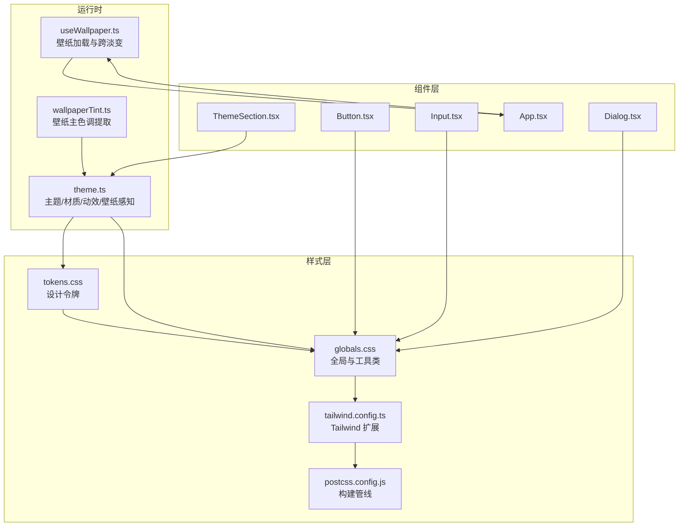
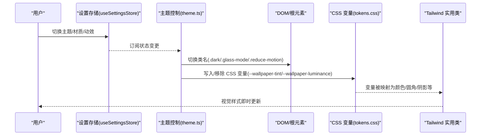
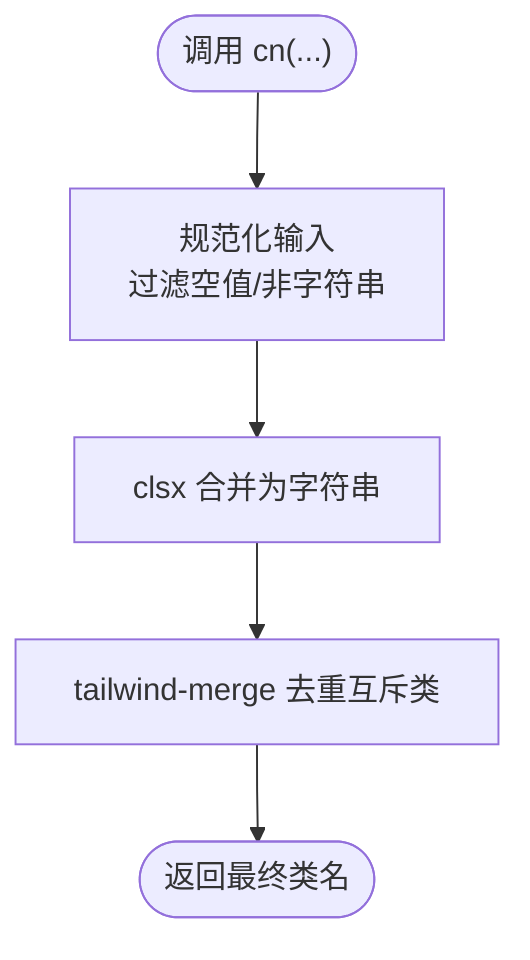
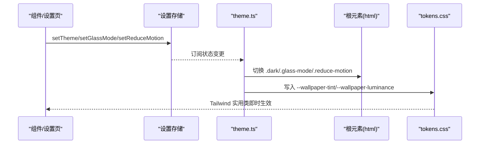
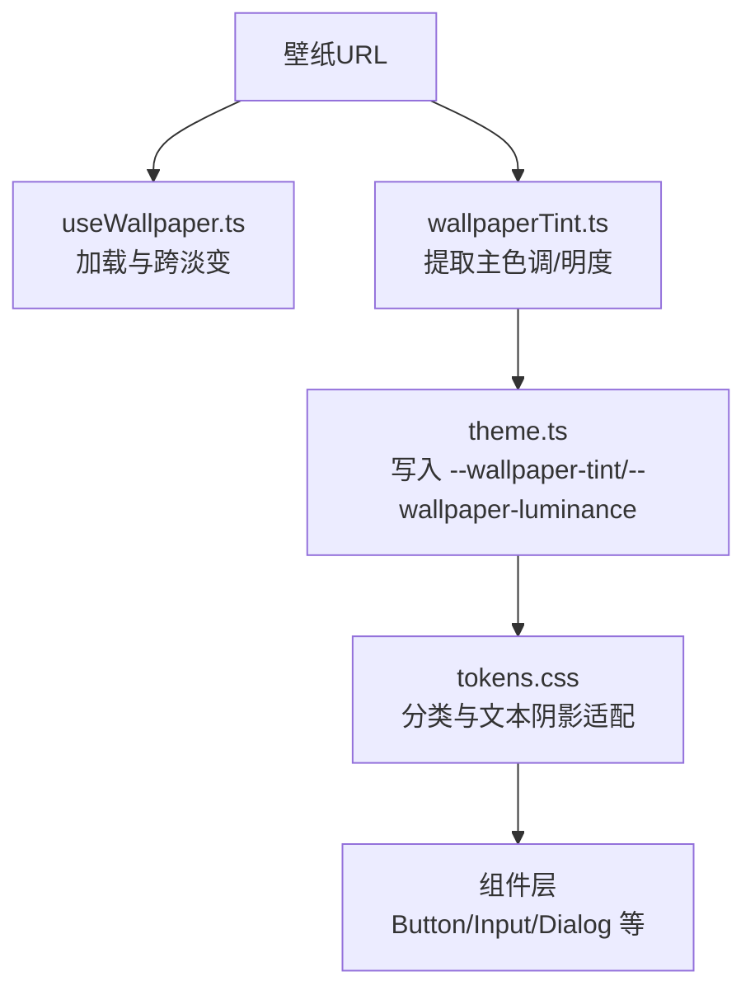
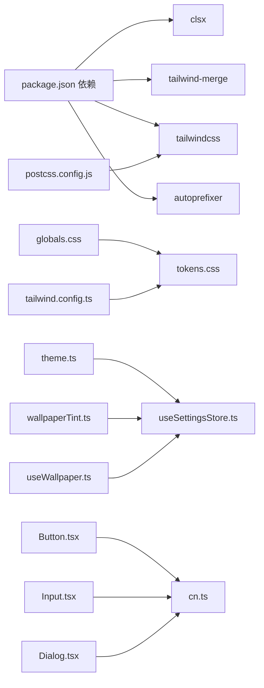

# 设计系统与样式规范

<cite>
**本文引用的文件**
- [cn.ts](file://src/lib/cn.ts)
- [tokens.css](file://src/styles/tokens.css)
- [globals.css](file://src/styles/globals.css)
- [tailwind.config.ts](file://tailwind.config.ts)
- [postcss.config.js](file://postcss.config.js)
- [theme.ts](file://src/lib/theme.ts)
- [wallpaperTint.ts](file://src/lib/wallpaperTint.ts)
- [useWallpaper.ts](file://src/lib/useWallpaper.ts)
- [Button.tsx](file://src/components/ui/Button.tsx)
- [Input.tsx](file://src/components/ui/Input.tsx)
- [Dialog.tsx](file://src/components/ui/Dialog.tsx)
- [ThemeSection.tsx](file://src/components/settings/ThemeSection.tsx)
- [App.tsx](file://src/newtab/App.tsx)
- [useSettingsStore.ts](file://src/store/useSettingsStore.ts)
- [package.json](file://package.json)
</cite>

## 更新摘要

**所做更改**

- 更新了设计令牌分离滚动条样式与核心主题变量的架构说明
- 新增了CSS架构现代化的具体实现细节
- 完善了滚动条样式的分离与定制化机制
- 增强了主题变量与滚动条样式的维护性说明

## 目录

1. [简介](#简介)
2. [项目结构](#项目结构)
3. [核心组件](#核心组件)
4. [架构总览](#架构总览)
5. [详细组件分析](#详细组件分析)
6. [依赖关系分析](#依赖关系分析)
7. [性能考量](#性能考量)
8. [故障排查指南](#故障排查指南)
9. [结论](#结论)
10. [附录](#附录)

## 简介

本文件系统性梳理 Tab 项目的设计系统与样式规范，重点覆盖以下方面：

- cn 工具函数的类名合并机制、条件样式处理与冲突去重策略
- 设计令牌（tokens）系统：颜色、字体、间距、圆角半径、阴影、过渡时长等
- 基于 Tailwind CSS 的原子化样式体系与自定义扩展
- 主题与材质风格（浅色/深色/跟随系统、Sequoia/Tahoe 液态玻璃）
- 壁纸感知与动态着色（主色调提取、明度分类、文本阴影适配）
- 样式定制指南、主题切换机制与响应式设计原则
- 在组件中的应用示例与最佳实践

## 项目结构

设计系统由"设计令牌 + 原子化样式 + 主题与壁纸感知 + 组件层"四层构成，通过 PostCSS 与 Tailwind 进行构建与扩展。

**图示来源**

- [tokens.css:1-291](file://src/styles/tokens.css#L1-L291)
- [globals.css:1-158](file://src/styles/globals.css#L1-L158)
- [tailwind.config.ts:1-42](file://tailwind.config.ts#L1-L42)
- [postcss.config.js:1-7](file://postcss.config.js#L1-L7)
- [theme.ts:1-135](file://src/lib/theme.ts#L1-L135)
- [wallpaperTint.ts:1-226](file://src/lib/wallpaperTint.ts#L1-L226)
- [useWallpaper.ts:1-110](file://src/lib/useWallpaper.ts#L1-L110)
- [Button.tsx:1-41](file://src/components/ui/Button.tsx#L1-L41)
- [Input.tsx:1-21](file://src/components/ui/Input.tsx#L1-L21)
- [Dialog.tsx:1-94](file://src/components/ui/Dialog.tsx#L1-L94)
- [ThemeSection.tsx:1-109](file://src/components/settings/ThemeSection.tsx#L1-L109)
- [App.tsx:1-110](file://src/newtab/App.tsx#L1-L110)

**章节来源**

- [tokens.css:1-291](file://src/styles/tokens.css#L1-L291)
- [globals.css:1-158](file://src/styles/globals.css#L1-L158)
- [tailwind.config.ts:1-42](file://tailwind.config.ts#L1-L42)
- [postcss.config.js:1-7](file://postcss.config.js#L1-L7)

## 核心组件

- cn 工具函数：基于 clsx 与 tailwind-merge，实现条件类名拼接与冲突去重
- 设计令牌：以 CSS 自定义属性形式集中管理颜色、圆角、阴影、过渡、模糊、噪声纹理等
- Tailwind 扩展：将 CSS 变量映射为 Tailwind 颜色、圆角、阴影、字体族
- 主题与材质：通过类名切换实现浅色/深色/跟随系统、Sequoia/Tahoe 材质风格
- 壁纸感知：动态提取主色调与明度，自动调整文本对比度与表面透明度
- 组件层：Button、Input、Dialog 等复用统一的原子化样式与设计令牌

**章节来源**

- [cn.ts:1-7](file://src/lib/cn.ts#L1-L7)
- [tokens.css:1-291](file://src/styles/tokens.css#L1-L291)
- [tailwind.config.ts:1-42](file://tailwind.config.ts#L1-L42)
- [theme.ts:1-135](file://src/lib/theme.ts#L1-L135)
- [wallpaperTint.ts:1-226](file://src/lib/wallpaperTint.ts#L1-L226)
- [Button.tsx:1-41](file://src/components/ui/Button.tsx#L1-L41)
- [Input.tsx:1-21](file://src/components/ui/Input.tsx#L1-L21)
- [Dialog.tsx:1-94](file://src/components/ui/Dialog.tsx#L1-L94)

## 架构总览

设计系统围绕"CSS 变量驱动 + Tailwind 原子化 + 运行时主题切换"的模式工作。CSS 变量承载设计令牌，Tailwind 将其映射为实用类；运行时根据用户选择与系统偏好切换主题、材质与动效，并根据壁纸动态调整颜色与对比度。

**图示来源**

- [useSettingsStore.ts:1-89](file://src/store/useSettingsStore.ts#L1-L89)
- [theme.ts:1-135](file://src/lib/theme.ts#L1-L135)
- [tokens.css:1-291](file://src/styles/tokens.css#L1-L291)
- [tailwind.config.ts:1-42](file://tailwind.config.ts#L1-L42)

## 详细组件分析

### cn 工具函数：类名合并与冲突去重

- 功能要点
  - 支持任意数量的输入参数（字符串、条件表达式、数组、null/undefined）
  - 使用 clsx 进行条件类名拼接与去空
  - 使用 tailwind-merge 对互斥的 Tailwind 类进行冲突去重（如重复的 p-、m-、w- 等）
- 典型用法
  - 组件内部通过 cn 合并默认样式、变体、尺寸与外部传入的 className
- 测试覆盖
  - 合并类名、条件类名、互斥类名去重、空输入、空值处理

**图示来源**

- [cn.ts:1-7](file://src/lib/cn.ts#L1-L7)
- [cn.test.ts:1-26](file://src/lib/cn.test.ts#L1-L26)

**章节来源**

- [cn.ts:1-7](file://src/lib/cn.ts#L1-L7)
- [cn.test.ts:1-26](file://src/lib/cn.test.ts#L1-L26)

### 设计令牌（tokens）系统：颜色、字体、圆角、阴影、过渡

- 颜色系统
  - 表面色(surface/surface-strong/surface-hover)、边框(border)、强调色(accent/accent-hover)
  - 文本色(text-primary/text-secondary/text-tertiary/text-on-dark)
  - 选择背景(selection-bg)、遮罩(overlay)
- 形状系统
  - 卡片圆角(radius-card)、按钮圆角(radius-btn)、胶囊圆角(radius-pill)
- 动画与过渡
  - 标准过渡时长(transition-duration)、慢速过渡(transition-duration-slow)
- 材质风格
  - Sequoia（精确 macOS 材质）与 Tahoe（液态玻璃）两套配色与阴影
  - 模糊强度(blur-widget/blur-pop)、饱和度(saturate-widget)、噪声纹理(noise-texture)
- 壁纸感知
  - wallpaper-dark/mid/light 三档明度分类，自动切换文本阴影与表面透明度
  - 提供 --wallpaper-luminance 与 --wallpaper-tint 供组件读取
- 字体与排版
  - 默认无衬线字体族，适配多语言显示

**章节来源**

- [tokens.css:1-291](file://src/styles/tokens.css#L1-L291)

### Tailwind 扩展与原子化样式

- 扩展内容
  - colors: 将 CSS 变量映射为 tailwind colors（surface、text-\*、border、accent）
  - borderRadius: 将 --radius-_ 映射为 rounded-_
  - boxShadow: 将 --shadow-_ 映射为 shadow-_
  - fontFamily: 设置 sans 字体族
- 构建管线
  - postcss.config.js 启用 tailwindcss 与 autoprefixer 插件
- 全局样式
  - globals.css 引入 tokens.css，按需启用 base/components/utilities 层
  - 定义滚动条、选择背景、减少动效媒体查询、玻璃材质工具类(backdrop-blur-glass、glass-noise、text-shadow-wallpaper)

**章节来源**

- [tailwind.config.ts:1-42](file://tailwind.config.ts#L1-L42)
- [postcss.config.js:1-7](file://postcss.config.js#L1-L7)
- [globals.css:1-158](file://src/styles/globals.css#L1-L158)

### 主题与材质切换机制

- 主题
  - 支持 light/dark/system；当为 system 时监听系统配色变化
- 材质
  - 支持 Sequoia（经典毛玻璃）与 Tahoe（液态玻璃），通过 .glass-mode 控制
- 动效
  - reduce-motion 开关，结合 prefers-reduced-motion 自动同步
- 运行时控制
  - theme.ts 负责类名切换、CSS 变量写入/移除、订阅设置存储变化、节流壁纸着色提取

**图示来源**

- [theme.ts:1-135](file://src/lib/theme.ts#L1-L135)
- [useSettingsStore.ts:1-89](file://src/store/useSettingsStore.ts#L1-L89)
- [tokens.css:1-291](file://src/styles/tokens.css#L1-L291)

**章节来源**

- [theme.ts:1-135](file://src/lib/theme.ts#L1-L135)
- [useSettingsStore.ts:1-89](file://src/store/useSettingsStore.ts#L1-L89)

### 壁纸感知与动态着色

- 主色调提取
  - wallpaperTint.ts 基于采样像素聚类与加权明度计算，输出 rgb/rgba/hex、是否偏暗、相对明度
  - 缓存与去重请求，避免重复解码
- 明度分类
  - theme.ts 将明度分类为 wallpaper-dark/mid/light，并设置 --wallpaper-luminance
- 文本适配
  - mid 明度时自动叠加 text-shadow-adaptive，确保可读性
- 组件联动
  - App.tsx 读取 wallpaperDimming 与 --overlay，实现渐变遮罩与背景色过渡

**图示来源**

- [wallpaperTint.ts:1-226](file://src/lib/wallpaperTint.ts#L1-L226)
- [theme.ts:1-135](file://src/lib/theme.ts#L1-L135)
- [useWallpaper.ts:1-110](file://src/lib/useWallpaper.ts#L1-L110)
- [tokens.css:1-291](file://src/styles/tokens.css#L1-L291)
- [App.tsx:1-110](file://src/newtab/App.tsx#L1-L110)

**章节来源**

- [wallpaperTint.ts:1-226](file://src/lib/wallpaperTint.ts#L1-L226)
- [theme.ts:1-135](file://src/lib/theme.ts#L1-L135)
- [useWallpaper.ts:1-110](file://src/lib/useWallpaper.ts#L1-L110)
- [tokens.css:1-291](file://src/styles/tokens.css#L1-L291)
- [App.tsx:1-110](file://src/newtab/App.tsx#L1-L110)

### 组件中的设计系统应用示例

- Button
  - 通过 cn 合并默认圆角、阴影、过渡与变体/尺寸样式
  - 使用 surface/text/accents 等语义类名
- Input
  - 统一边框、背景、占位符、聚焦态与阴影
- Dialog
  - 使用 pop 阴影、glass 背景、overlay 遮罩与 backdrop-blur 工具类
- 设置页 ThemeSection
  - 使用 cn 动态高亮选中项，结合 surface/accents 实现视觉反馈
- App
  - 使用 glass 工具类与 CSS 变量实现壁纸背景、遮罩与渐变过渡

**章节来源**

- [Button.tsx:1-41](file://src/components/ui/Button.tsx#L1-L41)
- [Input.tsx:1-21](file://src/components/ui/Input.tsx#L1-L21)
- [Dialog.tsx:1-94](file://src/components/ui/Dialog.tsx#L1-L94)
- [ThemeSection.tsx:1-109](file://src/components/settings/ThemeSection.tsx#L1-L109)
- [App.tsx:1-110](file://src/newtab/App.tsx#L1-L110)

### CSS架构现代化：设计令牌分离滚动条样式与核心主题变量

**更新** 设计系统进行了架构现代化升级，将滚动条样式从核心主题变量中分离出来，实现了更好的定制化和维护性。

- **分离架构**
  - 核心主题变量：颜色、圆角、阴影、过渡、模糊、噪声纹理等基础设计元素
  - 滚动条专用变量：独立的 --scrollbar-thumb 和 --scrollbar-thumb-hover 变量
  - 通过 CSS 变量继承机制，滚动条样式自动适应主题变化

- **实现细节**
  - 滚动条样式定义在 globals.css 的 43-60 行区域
  - 使用 var(--scrollbar-thumb) 和 var(--scrollbar-thumb-hover) 引用主题变量
  - 支持 light/dark 主题下的滚动条样式自动切换

- **维护优势**
  - 滚动条样式与核心主题解耦，便于单独定制
  - 保持主题一致性的同时，提供滚动条的特殊定制能力
  - 降低样式冲突风险，提高代码可维护性

**章节来源**

- [tokens.css:29-31](file://src/styles/tokens.css#L29-L31)
- [globals.css:43-60](file://src/styles/globals.css#L43-L60)

## 依赖关系分析

- 样式依赖
  - globals.css 依赖 tokens.css
  - tailwind.config.ts 将 tokens.css 中的 CSS 变量映射为 Tailwind 实用类
  - postcss.config.js 启用 tailwindcss 与 autoprefixer
- 运行时依赖
  - theme.ts 依赖 useSettingsStore 读取持久化设置
  - wallpaperTint.ts 依赖 useSettingsStore 与缓存模块
  - useWallpaper.ts 依赖壁纸缓存与对象 URL 生命周期管理
- 组件依赖
  - 所有 UI 组件依赖 cn 与全局样式（tokens.css + tailwind.config.ts）

**图示来源**

- [package.json:1-56](file://package.json#L1-L56)
- [globals.css:1-158](file://src/styles/globals.css#L1-L158)
- [tailwind.config.ts:1-42](file://tailwind.config.ts#L1-L42)
- [postcss.config.js:1-7](file://postcss.config.js#L1-L7)
- [theme.ts:1-135](file://src/lib/theme.ts#L1-L135)
- [useSettingsStore.ts:1-89](file://src/store/useSettingsStore.ts#L1-L89)
- [wallpaperTint.ts:1-226](file://src/lib/wallpaperTint.ts#L1-L226)
- [useWallpaper.ts:1-110](file://src/lib/useWallpaper.ts#L1-L110)
- [Button.tsx:1-41](file://src/components/ui/Button.tsx#L1-L41)
- [Input.tsx:1-21](file://src/components/ui/Input.tsx#L1-L21)
- [Dialog.tsx:1-94](file://src/components/ui/Dialog.tsx#L1-L94)
- [cn.ts:1-7](file://src/lib/cn.ts#L1-L7)

**章节来源**

- [package.json:1-56](file://package.json#L1-L56)

## 性能考量

- 壁纸主色调提取
  - 采用降采样与聚类统计，避免高分辨率解码开销
  - 缓存与去重请求，防止频繁解码
  - 节流刷新（约 150ms），避免快速切换壁纸导致的抖动
- DOM 与内存
  - useWallpaper.ts 管理对象 URL 生命周期，及时 revoke 避免内存泄漏
- 样式构建
  - Tailwind 按目录扫描生成，建议保持组件命名规范以减少未使用类
  - glass 效果使用 backdrop-filter，注意在低端设备上的性能影响
- 滚动条性能
  - 分离的滚动条样式通过 CSS 变量实现，避免 JavaScript 动态样式计算
  - 支持硬件加速的滚动条渲染

## 故障排查指南

- 类名冲突或样式不生效
  - 检查是否正确使用 cn 合并类名，避免重复的互斥类
  - 确认 tailwind.config.ts 是否正确映射了 CSS 变量
- 主题切换无效
  - 检查 html 根元素是否正确添加 .dark 或 .glass-mode 类
  - 确认 useSettingsStore 的主题/材质设置已持久化且被订阅
- 壁纸着色未生效
  - 确认壁纸 URL 可访问且未触发跨域限制
  - 检查 --wallpaper-tint 与 --wallpaper-luminance 是否写入成功
- 动效异常
  - 检查 reduce-motion 媒体查询与 .reduce-motion 类是否同时生效
  - 确认 CSS transition-duration 是否被覆盖
- 滚动条样式问题
  - 检查 ::-webkit-scrollbar 伪元素是否被其他样式覆盖
  - 确认 var(--scrollbar-thumb) 和 var(--scrollbar-thumb-hover) 变量是否正确设置
  - 验证滚动条样式是否在正确的主题类下生效

**章节来源**

- [cn.ts:1-7](file://src/lib/cn.ts#L1-L7)
- [tailwind.config.ts:1-42](file://tailwind.config.ts#L1-L42)
- [theme.ts:1-135](file://src/lib/theme.ts#L1-L135)
- [wallpaperTint.ts:1-226](file://src/lib/wallpaperTint.ts#L1-L226)
- [globals.css:43-60](file://src/styles/globals.css#L43-L60)

## 结论

Tab 的设计系统以"CSS 变量 + Tailwind 原子化 + 运行时主题与壁纸感知"为核心，实现了高内聚、低耦合的样式体系。通过 cn 工具函数保证类名合并的确定性与一致性，通过 tokens.css 统一管理设计变量，再由 tailwind.config.ts 映射为实用类，最终在组件层稳定落地。该体系支持主题、材质、动效与壁纸感知的灵活组合，既满足可定制性，又兼顾性能与可维护性。

**最新架构现代化升级**进一步提升了系统的可维护性，通过分离滚动条样式与核心主题变量，实现了更精细的样式控制和更好的定制化能力。这种设计使得开发者可以在保持主题一致性的同时，对滚动条等特定组件进行独立的样式定制，为未来的功能扩展奠定了坚实的基础。

## 附录

### 样式定制指南

- 颜色与语义
  - 优先使用 surface/text/accent/border 等语义类，避免硬编码颜色
  - 如需覆盖，仅在 tokens.css 中调整 CSS 变量，不直接修改组件类名
- 圆角与阴影
  - 使用 rounded-btn/rounded-card 与 shadow-card/shadow-pop 等语义类
  - 自定义形状或阴影时，先在 tokens.css 中新增变量，再在 tailwind.config.ts 扩展
- 字体与排版
  - 使用默认 sans 字体族；如需扩展，仅在 tailwind.config.ts 的 fontFamily 中追加
- 响应式与交互
  - 使用 Tailwind 断点与过渡类；如需自定义动画时长，修改 tokens.css 中的 transition-duration
- 滚动条定制
  - 通过 --scrollbar-thumb 和 --scrollbar-thumb-hover 变量定制滚动条外观
  - 利用主题类（.dark、.glass-mode）实现不同主题下的滚动条样式切换

### 主题与材质切换最佳实践

- 通过 useSettingsStore 修改主题/材质/动效，避免直接操作 DOM
- 在组件中使用 cn 合并类名，确保条件样式与互斥类正确去重
- 壁纸相关样式尽量依赖 CSS 变量与类名，减少硬编码
- 利用分离的滚动条样式变量实现主题一致性的滚动条定制

### 响应式设计原则

- 使用 Tailwind 断点（lg/md/sm/xs）组织布局
- 在交互与动画上尊重用户 reduce-motion 偏好
- 在玻璃材质下，优先使用 glass 工具类与噪声纹理增强真实感
- 通过 CSS 变量实现主题间的平滑过渡效果
