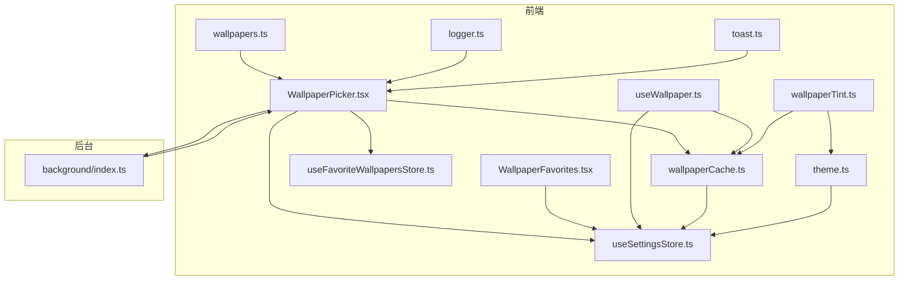
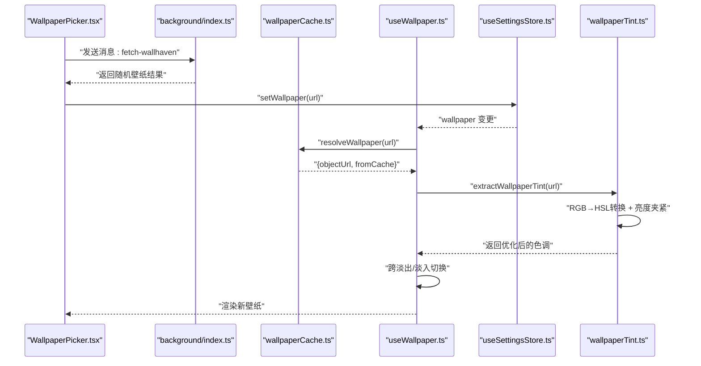
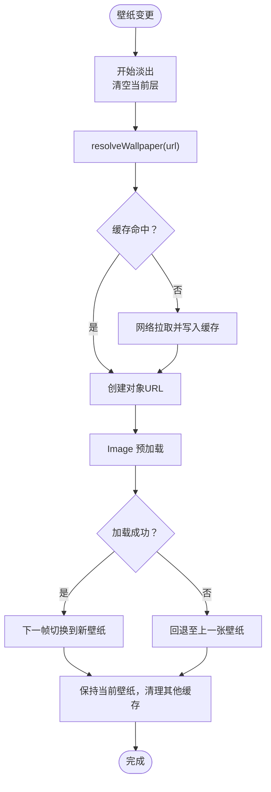
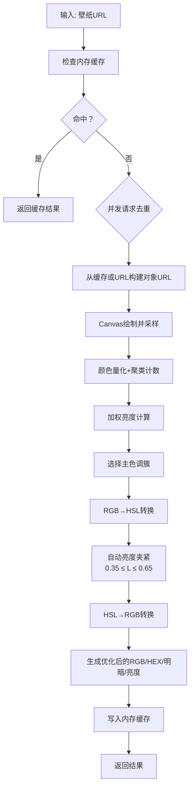
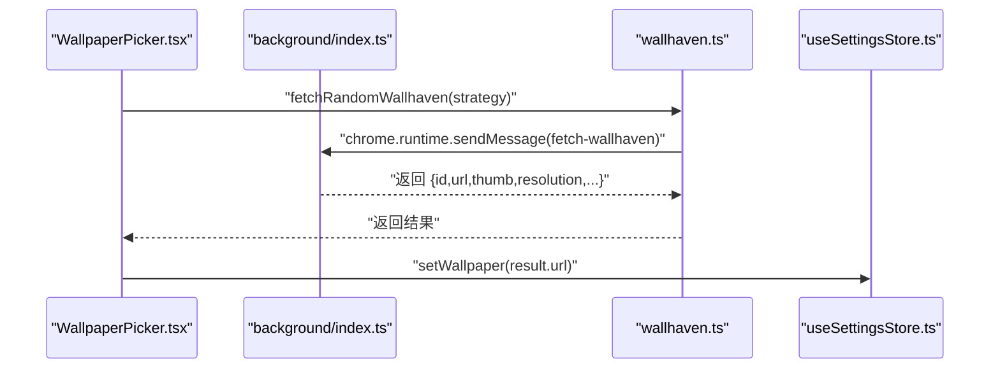
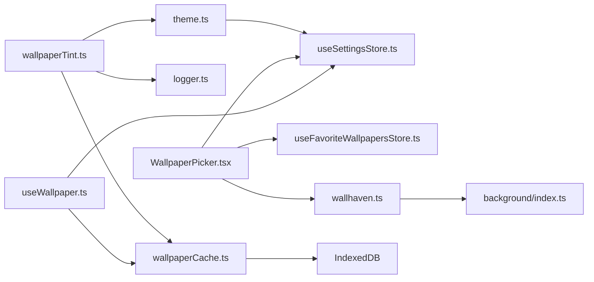

# 壁纸系统

<cite>
**本文引用的文件**
- [useWallpaper.ts](file://src/lib/useWallpaper.ts)
- [wallpaperCache.ts](file://src/lib/wallpaperCache.ts)
- [wallpapers.ts](file://src/lib/wallpapers.ts)
- [wallpaperTint.ts](file://src/lib/wallpaperTint.ts)
- [WallpaperPicker.tsx](file://src/components/settings/WallpaperPicker.tsx)
- [WallpaperFavorites.tsx](file://src/components/settings/WallpaperFavorites.tsx)
- [wallhaven.ts](file://src/lib/wallhaven.ts)
- [index.ts](file://src/background/index.ts)
- [useSettingsStore.ts](file://src/store/useSettingsStore.ts)
- [useFavoriteWallpapersStore.ts](file://src/store/useFavoriteWallpapersStore.ts)
- [globals.css](file://src/styles/globals.css)
- [logger.ts](file://src/lib/logger.ts)
- [toast.ts](file://src/lib/toast.ts)
- [theme.ts](file://src/lib/theme.ts)
</cite>

## 更新摘要

**变更内容**

- 新增RGB到HSL颜色空间转换功能，提升色彩处理精度
- 实现自动亮度夹紧算法，确保提取的壁纸颜色保持最佳对比度
- 改进色调提取算法，通过HSL空间优化颜色亮度分布
- 增强WCAG兼容性的亮度感知与文本对比度计算

## 目录

1. [简介](#简介)
2. [项目结构](#项目结构)
3. [核心组件](#核心组件)
4. [架构总览](#架构总览)
5. [详细组件分析](#详细组件分析)
6. [依赖关系分析](#依赖关系分析)
7. [性能考量](#性能考量)
8. [故障排除指南](#故障排除指南)
9. [结论](#结论)
10. [附录](#附录)

## 简介

本文件为 Tab 项目的壁纸系统技术文档，围绕"壁纸加载机制、缓存策略、对象 URL 管理、渐变过渡效果、预设/自定义/随机壁纸、IndexedDB 缓存设计、色调提取与应用、API 使用与扩展、配置项与监控、故障排除"等主题进行系统化说明。文档以代码为依据，辅以图示帮助不同背景读者理解。

**更新** 本版本新增了RGB到HSL颜色空间转换和自动亮度夹紧功能，显著提升了壁纸着色系统的色彩处理精度和对比度表现。

## 项目结构

壁纸系统主要由以下模块构成：

- 前端状态与逻辑：设置存储、壁纸选择器、收藏夹、色调提取、壁纸加载 Hook
- 后台服务：Wallhaven 随机壁纸抓取（MV3 Service Worker）
- 缓存与存储：IndexedDB 壁纸缓存、浏览器存储持久化
- 样式与主题：基于壁纸亮度的文本阴影与暗化策略



**图表来源**

- [WallpaperPicker.tsx:1-234](file://src/components/settings/WallpaperPicker.tsx#L1-L234)
- [WallpaperFavorites.tsx:1-64](file://src/components/settings/WallpaperFavorites.tsx#L1-L64)
- [useSettingsStore.ts:1-89](file://src/store/useSettingsStore.ts#L1-L89)
- [useFavoriteWallpapersStore.ts:1-51](file://src/store/useFavoriteWallpapersStore.ts#L1-L51)
- [useWallpaper.ts:1-110](file://src/lib/useWallpaper.ts#L1-L110)
- [wallpaperCache.ts:1-94](file://src/lib/wallpaperCache.ts#L1-L94)
- [wallpaperTint.ts:1-226](file://src/lib/wallpaperTint.ts#L1-L226)
- [wallpapers.ts:1-69](file://src/lib/wallpapers.ts#L1-L69)
- [index.ts:1-174](file://src/background/index.ts#L1-L174)
- [logger.ts:1-35](file://src/lib/logger.ts#L1-L35)
- [toast.ts:1-10](file://src/lib/toast.ts#L1-L10)
- [theme.ts:1-135](file://src/lib/theme.ts#L1-L135)

**章节来源**

- [WallpaperPicker.tsx:1-234](file://src/components/settings/WallpaperPicker.tsx#L1-L234)
- [useSettingsStore.ts:1-89](file://src/store/useSettingsStore.ts#L1-L89)
- [useFavoriteWallpapersStore.ts:1-51](file://src/store/useFavoriteWallpapersStore.ts#L1-L51)
- [useWallpaper.ts:1-110](file://src/lib/useWallpaper.ts#L1-L110)
- [wallpaperCache.ts:1-94](file://src/lib/wallpaperCache.ts#L1-L94)
- [wallpaperTint.ts:1-226](file://src/lib/wallpaperTint.ts#L1-L226)
- [wallpapers.ts:1-69](file://src/lib/wallpapers.ts#L1-L69)
- [index.ts:1-174](file://src/background/index.ts#L1-L174)
- [logger.ts:1-35](file://src/lib/logger.ts#L1-L35)
- [toast.ts:1-10](file://src/lib/toast.ts#L1-L10)
- [theme.ts:1-135](file://src/lib/theme.ts#L1-L135)

## 核心组件

- 壁纸加载 Hook：负责跨淡出/淡入过渡、对象 URL 生命周期管理、错误回退与 IndexedDB 清理
- IndexedDB 缓存：统一的壁纸二进制缓存，支持只保留当前壁纸的清理策略
- 色调提取：基于 Canvas 的颜色量化与加权亮度计算，生成主色调与明暗判断，**新增RGB到HSL转换和自动亮度夹紧功能**
- 壁纸选择器：预设、收藏、上传、随机（Wallhaven）与暗化滑块
- 后台消息：Wallhaven 随机壁纸抓取，带降级策略与超时控制
- 设置与收藏：Zustand 持久化存储，支持迁移与多设备同步
- 主题应用：动态壁纸色调应用与亮度分类

**更新** 色调提取组件现在集成了RGB到HSL颜色空间转换和自动亮度夹紧算法，显著提升了色彩处理的准确性和对比度表现。

**章节来源**

- [useWallpaper.ts:1-110](file://src/lib/useWallpaper.ts#L1-L110)
- [wallpaperCache.ts:1-94](file://src/lib/wallpaperCache.ts#L1-L94)
- [wallpaperTint.ts:1-226](file://src/lib/wallpaperTint.ts#L1-L226)
- [WallpaperPicker.tsx:1-234](file://src/components/settings/WallpaperPicker.tsx#L1-L234)
- [wallhaven.ts:1-43](file://src/lib/wallhaven.ts#L1-L43)
- [index.ts:1-174](file://src/background/index.ts#L1-L174)
- [useSettingsStore.ts:1-89](file://src/store/useSettingsStore.ts#L1-L89)
- [useFavoriteWallpapersStore.ts:1-51](file://src/store/useFavoriteWallpapersStore.ts#L1-L51)
- [theme.ts:1-135](file://src/lib/theme.ts#L1-L135)

## 架构总览

壁纸系统采用"前端 Hook + 后台消息 + IndexedDB 缓存"的分层架构：

- 前端通过 Hook 触发加载与过渡，使用缓存模块解析 URL 并返回对象 URL
- 后台负责墙绘（Wallhaven）的搜索与随机挑选，处理速率限制与降级链路
- IndexedDB 存储壁纸二进制，避免重复下载；仅保留当前壁纸以节省空间
- 色调提取用于动态调整文本阴影与暗化强度，提升可读性，**通过HSL颜色空间优化对比度**



**图表来源**

- [WallpaperPicker.tsx:79-102](file://src/components/settings/WallpaperPicker.tsx#L79-L102)
- [wallhaven.ts:14-42](file://src/lib/wallhaven.ts#L14-L42)
- [index.ts:132-173](file://src/background/index.ts#L132-L173)
- [wallpaperCache.ts:75-93](file://src/lib/wallpaperCache.ts#L75-L93)
- [useWallpaper.ts:54-90](file://src/lib/useWallpaper.ts#L54-L90)
- [useSettingsStore.ts](file://src/store/useSettingsStore.ts#L50)
- [wallpaperTint.ts:87-91](file://src/lib/wallpaperTint.ts#L87-L91)

## 详细组件分析

### 组件一：useWallpaper Hook（壁纸加载与过渡）

职责与流程：

- 当壁纸变更时，先清空当前显示层并标记不可见，触发上一层淡出
- 解析壁纸 URL：优先从 IndexedDB 缓存读取，否则网络拉取并写入缓存
- 创建对象 URL 并用 Image 预加载，成功后在下一帧切换到新壁纸，失败则回退至上一张
- 对于新创建的对象 URL 进行跟踪，在组件卸载时统一撤销，防止内存泄漏
- 同步清理 IndexedDB 中非当前壁纸条目，保持最小缓存占用



**图表来源**

- [useWallpaper.ts:21-98](file://src/lib/useWallpaper.ts#L21-L98)
- [wallpaperCache.ts:75-93](file://src/lib/wallpaperCache.ts#L75-L93)

**章节来源**

- [useWallpaper.ts:1-110](file://src/lib/useWallpaper.ts#L1-L110)
- [wallpaperCache.ts:1-94](file://src/lib/wallpaperCache.ts#L1-L94)

### 组件二：IndexedDB 壁纸缓存（wallpaperCache.ts）

设计要点：

- 数据库名与对象存储名固定，版本号 1；首次打开自动建表
- 事务封装：统一读写事务模式，捕获错误并静默失败
- 读写接口：按 URL 键值读取/写入 Blob；写入失败不中断主流程
- 清理策略：evictOthers 仅保留当前壁纸键，其余删除，异常也静默处理

```mermaid
classDiagram
class IndexedDB {
+openDB() Promise
+txBlob(mode, fn) Promise
+readCachedBlob(url) Promise~Blob|null~
+writeCachedBlob(url, blob) Promise~void~
+evictOthers(keepUrl) Promise~void~
}
class CacheAPI {
+resolveWallpaper(url) Promise~{objectUrl, fromCache}~
}
CacheAPI --> IndexedDB : "使用"
```

**图表来源**

- [wallpaperCache.ts:5-93](file://src/lib/wallpaperCache.ts#L5-L93)

**章节来源**

- [wallpaperCache.ts:1-94](file://src/lib/wallpaperCache.ts#L1-L94)

### 组件三：色调提取与应用（wallpaperTint.ts）

**更新** 色调提取系统现已集成RGB到HSL颜色空间转换和自动亮度夹紧功能，显著提升了色彩处理精度。

目标：从壁纸提取主色调，计算整体亮度，决定文本阴影与暗化强度。
实现要点：

- 缓存策略：内存 Map 缓存结果；同一 URL 的并发请求去重
- 数据源：优先使用 IndexedDB 缓存的 Blob -> 对象 URL，否则直接用原 URL
- 算法：Canvas 下采样到 64x64，颜色量化（8 步），统计频次并按彩度加权
- **新增**：RGB到HSL转换函数，提供精确的颜色空间表示
- **新增**：自动亮度夹紧算法，将颜色亮度限制在0.35-0.65范围内，确保最佳对比度
- **新增**：HSL↔RGB双向转换函数，支持颜色空间间的精确转换
- 结果：选取偏好函数最优的颜色簇作为主色调；计算加权平均亮度用于明暗判断
- 输出：RGB/RGBA/HEX、是否偏暗、相对亮度（WCAG）



**图表来源**

- [wallpaperTint.ts:43-162](file://src/lib/wallpaperTint.ts#L43-L162)
- [wallpaperTint.ts:32-91](file://src/lib/wallpaperTint.ts#L32-L91)
- [wallpaperCache.ts:32-47](file://src/lib/wallpaperCache.ts#L32-L47)

**章节来源**

- [wallpaperTint.ts:1-226](file://src/lib/wallpaperTint.ts#L1-L226)
- [wallpaperCache.ts:1-94](file://src/lib/wallpaperCache.ts#L1-L94)

### 组件四：壁纸选择器与收藏（WallpaperPicker.tsx / WallpaperFavorites.tsx）

功能概览：

- 预设壁纸：展示默认预设列表，点击即设为壁纸
- 收藏夹：展示用户收藏的壁纸缩略图，支持移除与一键使用
- 自定义上传：限制大小，转为 data URL 并设为壁纸
- 随机壁纸：调用后台消息获取 Wallhaven 随机壁纸，支持多种榜单策略
- 暗化强度：滑块调节壁纸暗化程度，范围 0–60%，影响前景可读性

交互流程（随机壁纸）：



**图表来源**

- [WallpaperPicker.tsx:79-102](file://src/components/settings/WallpaperPicker.tsx#L79-L102)
- [wallhaven.ts:14-42](file://src/lib/wallhaven.ts#L14-L42)
- [index.ts:132-173](file://src/background/index.ts#L132-L173)
- [useSettingsStore.ts](file://src/store/useSettingsStore.ts#L50)

**章节来源**

- [WallpaperPicker.tsx:1-234](file://src/components/settings/WallpaperPicker.tsx#L1-L234)
- [WallpaperFavorites.tsx:1-64](file://src/components/settings/WallpaperFavorites.tsx#L1-L64)
- [wallhaven.ts:1-43](file://src/lib/wallhaven.ts#L1-L43)
- [index.ts:1-174](file://src/background/index.ts#L1-L174)
- [useSettingsStore.ts:1-89](file://src/store/useSettingsStore.ts#L1-L89)
- [useFavoriteWallpapersStore.ts:1-51](file://src/store/useFavoriteWallpapersStore.ts#L1-L51)

### 组件五：后台消息（Wallhaven 随机壁纸）

- 允许的榜单窗口：1d、3d、1w、1M、3M、6M、1y；前端暴露 1d/1w/1M/1y
- 降级链：若某窗口为空，自动向更宽窗口降级，直至 1y
- 分页与随机：最多采样前 20 页，随机选页再随机选图
- 超时与限流：超时 Abort，429 标记为限流错误
- 响应格式：与前端期望一致，含 id/url/thumb/resolution/requested/actual

**章节来源**

- [index.ts:1-174](file://src/background/index.ts#L1-L174)

### 组件六：设置与收藏（Zustand 持久化）

- 设置项：主题、玻璃模式、搜索引擎、壁纸 URL、主色调、壁纸亮度、暗化强度、动画偏好等
- 收藏项：最大 24 条，记录 id/url/thumb/分辨率/来源/添加时间
- 持久化：Chrome Storage + 版本迁移，支持水合与远程同步

**章节来源**

- [useSettingsStore.ts:1-89](file://src/store/useSettingsStore.ts#L1-L89)
- [useFavoriteWallpapersStore.ts:1-51](file://src/store/useFavoriteWallpapersStore.ts#L1-L51)

### 组件七：样式与可读性增强（globals.css）

- 文本阴影：针对中性亮度壁纸启用自适应文本阴影，提升可读性
- 玻璃态叠加：在玻璃模式下增强文本阴影
- 动画偏好：尊重系统"减少动画"设置

**章节来源**

- [globals.css:91-146](file://src/styles/globals.css#L91-L146)

### 组件八：主题应用与亮度分类（theme.ts）

**更新** 新增了基于连续亮度值的壁纸亮度分类系统，支持更精细的对比度控制。

- 壁纸亮度分类：将亮度值分为"dark"(<0.35)、"mid"(0.35-0.55)、"light"(≥0.55)
- CSS变量应用：设置`--wallpaper-luminance`变量供样式响应
- 动态色调应用：根据壁纸亮度自动调整文本阴影和对比度
- 减少动画支持：尊重系统"减少动画"偏好设置

**章节来源**

- [theme.ts:1-135](file://src/lib/theme.ts#L1-L135)

## 依赖关系分析

- useWallpaper 依赖 wallpaperCache 与 useSettingsStore
- wallpaperTint 依赖 wallpaperCache 与 logger，**新增对 theme.ts 的依赖用于亮度分类**
- WallpaperPicker 依赖 useSettingsStore、useFavoriteWallpapersStore、wallhaven 与后台消息
- background/index.ts 提供 Wallhaven 随机壁纸服务
- 样式依赖壁纸亮度与暗化强度



**图表来源**

- [useWallpaper.ts:1-110](file://src/lib/useWallpaper.ts#L1-L110)
- [wallpaperCache.ts:1-94](file://src/lib/wallpaperCache.ts#L1-L94)
- [wallpaperTint.ts:1-226](file://src/lib/wallpaperTint.ts#L1-L226)
- [WallpaperPicker.tsx:1-234](file://src/components/settings/WallpaperPicker.tsx#L1-L234)
- [wallhaven.ts:1-43](file://src/lib/wallhaven.ts#L1-L43)
- [index.ts:1-174](file://src/background/index.ts#L1-L174)
- [useSettingsStore.ts:1-89](file://src/store/useSettingsStore.ts#L1-L89)
- [useFavoriteWallpapersStore.ts:1-51](file://src/store/useFavoriteWallpapersStore.ts#L1-L51)
- [logger.ts:1-35](file://src/lib/logger.ts#L1-L35)
- [theme.ts:1-135](file://src/lib/theme.ts#L1-L135)

## 性能考量

- IndexedDB 缓存：避免重复下载，仅保留当前壁纸，降低存储压力
- 对象 URL 生命周期：在组件卸载时统一撤销，防止内存泄漏
- Canvas 下采样：64x64 采样平衡精度与性能
- 颜色量化与加权：减少像素扫描成本，提升实时性
- **新增**：HSL颜色空间转换的性能优化：使用高效的数学公式，避免不必要的颜色空间转换
- **新增**：自动亮度夹紧的计算优化：在HSL空间中进行夹紧，比在RGB空间中更高效且更准确
- 跨淡出/淡入：使用 requestAnimationFrame 控制帧切换，平滑过渡
- 动画偏好：尊重系统"减少动画"，在 reduceMotion 场景下禁用过渡动画
- 网络与缓存：resolveWallpaper 在缓存缺失时异步刷新缓存，保证后续命中率

**更新** 新增的HSL颜色空间转换和亮度夹紧功能在保持性能的同时，显著提升了色彩处理的准确性。

**章节来源**

- [useWallpaper.ts:18-106](file://src/lib/useWallpaper.ts#L18-L106)
- [wallpaperCache.ts:49-93](file://src/lib/wallpaperCache.ts#L49-L93)
- [wallpaperTint.ts:17-226](file://src/lib/wallpaperTint.ts#L17-L226)
- [globals.css:70-89](file://src/styles/globals.css#L70-L89)

## 故障排除指南

常见问题与定位建议：

- 随机壁纸获取失败
  - 检查后台消息通道是否正常，确认策略参数合法
  - 关注超时与限流错误，必要时放宽策略或稍后重试
  - 参考：[index.ts:113-121](file://src/background/index.ts#L113-L121)
- 壁纸加载失败或闪烁
  - 确认 resolveWallpaper 是否正确返回对象 URL 或回退原 URL
  - 检查对象 URL 是否被撤销或未创建
  - 参考：[useWallpaper.ts:54-90](file://src/lib/useWallpaper.ts#L54-L90)
- **新增**：色调提取失败或颜色异常
  - 检查 Canvas 上下文创建与跨域属性
  - 查看日志输出，确认缓存与网络路径均尝试过
  - **新增**：验证HSL转换函数是否正确工作，检查亮度夹紧逻辑
  - 参考：[wallpaperTint.ts:65-214](file://src/lib/wallpaperTint.ts#L65-L214)
- 收藏无法使用或重复
  - 检查收藏数量上限与去重逻辑
  - 参考：[useFavoriteWallpapersStore.ts:28-32](file://src/store/useFavoriteWallpapersStore.ts#L28-L32)
- 设置未生效或不同步
  - 确认持久化中间件与水合/远程同步注册
  - **新增**：检查壁纸亮度分类是否正确应用到CSS变量
  - 参考：[useSettingsStore.ts:87-89](file://src/store/useSettingsStore.ts#L87-L89)

**更新** 新增了色调提取和亮度分类相关的故障排除指导。

**章节来源**

- [index.ts:113-121](file://src/background/index.ts#L113-L121)
- [useWallpaper.ts:54-90](file://src/lib/useWallpaper.ts#L54-L90)
- [wallpaperTint.ts:65-214](file://src/lib/wallpaperTint.ts#L65-L214)
- [useFavoriteWallpapersStore.ts:28-32](file://src/store/useFavoriteWallpapersStore.ts#L28-L32)
- [useSettingsStore.ts:87-89](file://src/store/useSettingsStore.ts#L87-L89)

## 结论

该壁纸系统通过"前端 Hook + 后台消息 + IndexedDB 缓存"的组合，实现了高性能、低耦合的壁纸加载与管理能力。其核心优势包括：

- 以对象 URL 与缓存驱动的快速加载
- **新增**：基于RGB到HSL转换和自动亮度夹紧的精确色彩处理，确保最佳对比度
- **新增**：连续亮度值分类系统，支持更精细的对比度控制
- 基于 WCAG 的亮度感知与文本阴影策略
- 多源壁纸（预设/自定义/Wallhaven）与收藏管理
- 渐进式过渡与内存安全的对象 URL 管理
- 可扩展的消息接口与配置项

**更新** 最新的RGB到HSL转换和自动亮度夹紧功能显著提升了壁纸着色系统的色彩处理精度，确保提取的颜色在任何背景下都能保持最佳的可读性和对比度。

## 附录

### 壁纸 API 使用与扩展接口

- 获取随机壁纸
  - 前端：调用 [fetchRandomWallhaven:14-42](file://src/lib/wallhaven.ts#L14-L42)
  - 后台：监听消息类型 [fetch-wallhaven:123-130](file://src/background/index.ts#L123-L130)，返回标准结构
- 设置壁纸
  - 前端：调用 [setWallpaper](file://src/store/useSettingsStore.ts#L50) 更新状态
  - Hook：监听壁纸变化并触发动画与缓存清理
- **新增**：色调提取与亮度分类
  - 调用 [extractWallpaperTint:104-225](file://src/lib/wallpaperTint.ts#L104-L225) 获取优化后的主色调与亮度
  - 应用 [applyWallpaperLuminance:38-53](file://src/lib/theme.ts#L38-L53) 进行亮度分类
- 自定义壁纸源集成步骤
  - 生成标准 URL 或 data URL
  - 将 URL 写入设置存储以触发 Hook 加载
  - 若需缓存，可复用 resolveWallpaper 流程（注意：data/blob URL 不会被 fetch 缓存）
  - **新增**：利用HSL颜色空间转换功能优化自定义壁纸的色调表现
  - 参考：[useWallpaper.ts:54-90](file://src/lib/useWallpaper.ts#L54-L90)、[wallpaperCache.ts:75-93](file://src/lib/wallpaperCache.ts#L75-L93)

**更新** 新增了色调提取和亮度分类相关的API使用说明。

### 配置选项与行为

- 壁纸暗化强度（0–60%）
  - 通过设置项 [wallpaperDimming](file://src/store/useSettingsStore.ts#L19) 控制
  - 影响前景文本可读性，结合样式自适应文本阴影
  - 参考：[WallpaperPicker.tsx:206-226](file://src/components/settings/WallpaperPicker.tsx#L206-L226)、[globals.css:91-101](file://src/styles/globals.css#L91-L101)
- **新增**：壁纸亮度分类
  - 通过设置项 [wallpaperLuminance](file://src/store/useSettingsStore.ts#L17) 存储连续亮度值
  - 影响主题应用和文本对比度
  - 参考：[theme.ts:38-53](file://src/lib/theme.ts#L38-L53)、[useSettingsStore.ts:16-17](file://src/store/useSettingsStore.ts#L16-L17)
- 主题与动画偏好
  - 主题与减少动画设置影响过渡与样式
  - 参考：[useSettingsStore.ts:10-31](file://src/store/useSettingsStore.ts#L10-L31)、[globals.css:70-89](file://src/styles/globals.css#L70-L89)

**更新** 新增了壁纸亮度分类相关的配置说明。

### 性能监控建议

- 记录 resolveWallpaper 的命中率与耗时
- 监控对象 URL 数量与撤销时机
- 统计 Canvas 色调提取耗时与失败率
- **新增**：监控HSL转换和亮度夹紧的性能影响
- **新增**：跟踪连续亮度值的分类准确性
- 参考日志工具：[logger.ts:20-30](file://src/lib/logger.ts#L20-L30)

**更新** 新增了与新功能相关的性能监控建议。
