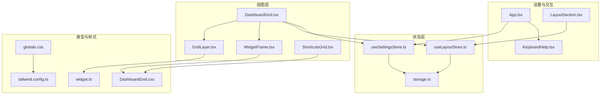
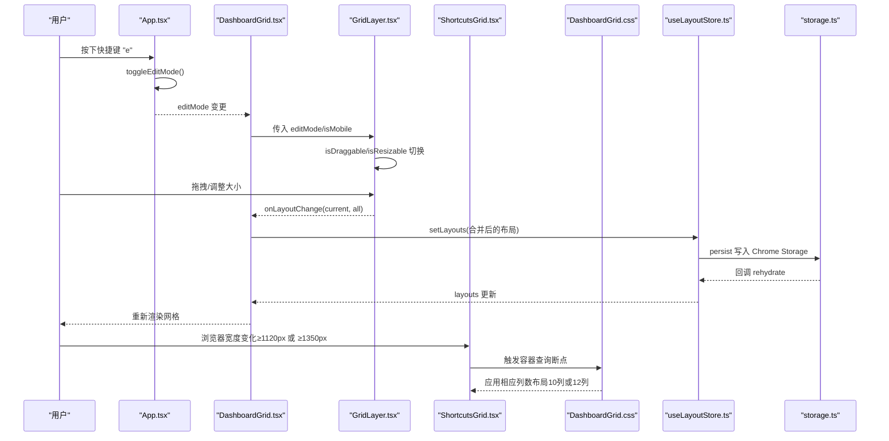
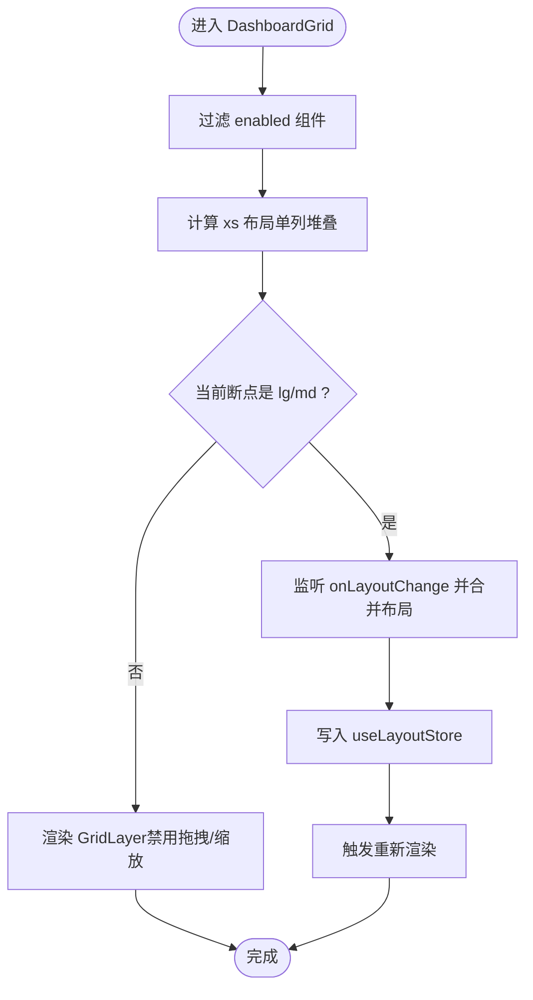
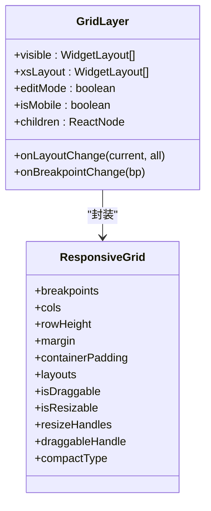
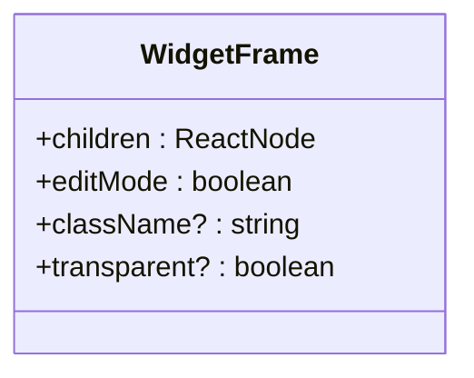
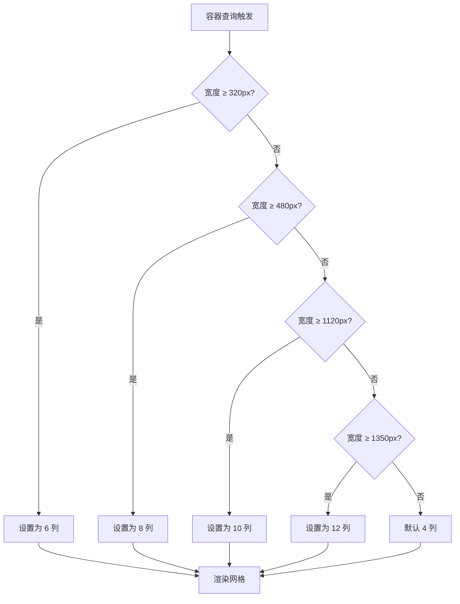
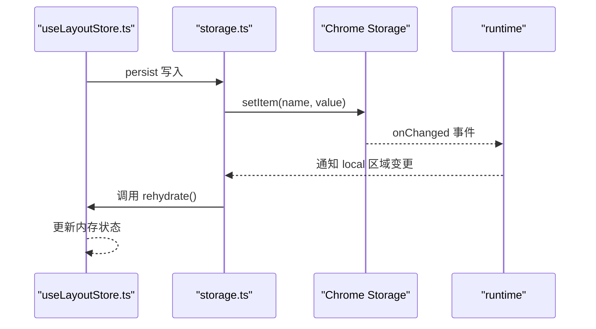
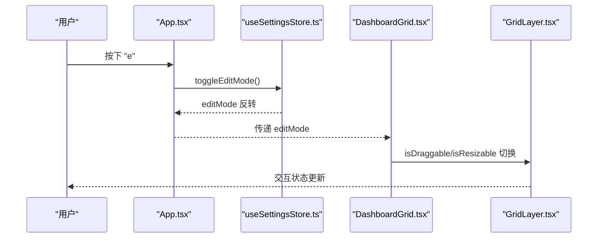
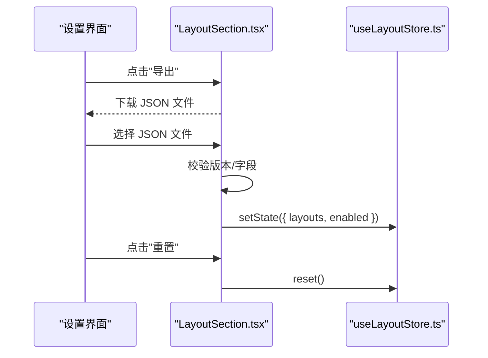
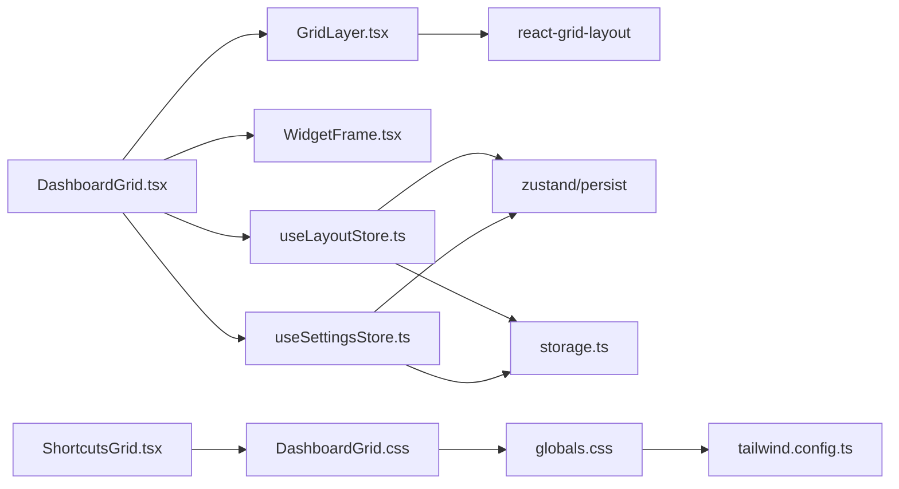

# 布局系统

<cite>
**本文引用的文件**
- [DashboardGrid.tsx](file://src/components/layout/DashboardGrid.tsx)
- [GridLayer.tsx](file://src/components/layout/GridLayer.tsx)
- [WidgetFrame.tsx](file://src/components/layout/WidgetFrame.tsx)
- [DashboardGrid.css](file://src/components/layout/DashboardGrid.css)
- [ShortcutsGrid.tsx](file://src/components/widgets/Shortcuts/ShortcutsGrid.tsx)
- [useLayoutStore.ts](file://src/store/useLayoutStore.ts)
- [storage.ts](file://src/store/storage.ts)
- [widget.ts](file://src/types/widget.ts)
- [LayoutSection.tsx](file://src/components/settings/LayoutSection.tsx)
- [useSettingsStore.ts](file://src/store/useSettingsStore.ts)
- [App.tsx](file://src/newtab/App.tsx)
- [useShortcut.ts](file://src/lib/useShortcut.ts)
- [KeyboardHelp.tsx](file://src/components/ui/KeyboardHelp.tsx)
- [background/index.ts](file://src/background/index.ts)
- [globals.css](file://src/styles/globals.css)
- [tailwind.config.ts](file://src/tailwind.config.ts)
</cite>

## 更新摘要

**所做更改**

- 更新容器查询响应式布局断点：将快捷方式网格的 10 列和 12 列触发条件从 640px 和 960px 提升至 1120px 和 1350px
- 移除 XL 特定的布局约束类，使标准笔记本电脑分辨率（约 1366px）能够保持稳定的布局表现
- 更新响应式设计与断点处理章节，反映新的容器查询断点配置
- 更新故障排查指南，包含新的断点阈值信息

## 目录

1. [简介](#简介)
2. [项目结构](#项目结构)
3. [核心组件](#核心组件)
4. [架构总览](#架构总览)
5. [详细组件分析](#详细组件分析)
6. [依赖关系分析](#依赖关系分析)
7. [性能考量](#性能考量)
8. [故障排查指南](#故障排查指南)
9. [结论](#结论)
10. [附录](#附录)

## 简介

本文件面向"Tab 项目"的布局系统，重点解析可拖拽布局架构与网格系统实现，涵盖以下主题：

- DashboardGrid 的网格系统与响应式断点
- GridLayer 的拖拽交互与 react-grid-layout 集成
- WidgetFrame 的组件包装与视觉样式
- 布局数据的存储与同步（Chrome Storage）
- **更新** 容器查询响应式布局功能与断点处理（断点阈值已提升）
- 布局编辑模式与键盘快捷键支持
- 布局 API 使用、事件处理与性能优化
- 扩展与定制建议

## 项目结构

布局系统由三个主要层次构成：

- 视图层：DashboardGrid 负责布局聚合与渲染；GridLayer 封装 react-grid-layout；WidgetFrame 提供统一的组件容器与视觉样式。
- 状态层：useLayoutStore 管理布局数据与启用状态；useSettingsStore 管理编辑模式等设置；storage.ts 提供跨页面同步与持久化。
- 设置与交互层：App.tsx 提供编辑模式开关与快捷键绑定；KeyboardHelp.tsx 展示快捷键帮助；LayoutSection.tsx 支持布局导出/导入/重置。

**图表来源**

- [DashboardGrid.tsx:1-110](file://src/components/layout/DashboardGrid.tsx#L1-L110)
- [GridLayer.tsx:1-50](file://src/components/layout/GridLayer.tsx#L1-L50)
- [WidgetFrame.tsx:1-31](file://src/components/layout/WidgetFrame.tsx#L1-L31)
- [ShortcutsGrid.tsx:1-38](file://src/components/widgets/Shortcuts/ShortcutsGrid.tsx#L1-L38)
- [useLayoutStore.ts:1-58](file://src/store/useLayoutStore.ts#L1-L58)
- [useSettingsStore.ts:1-89](file://src/store/useSettingsStore.ts#L1-L89)
- [storage.ts:1-63](file://src/store/storage.ts#L1-L63)
- [widget.ts:1-34](file://src/types/widget.ts#L1-L34)
- [DashboardGrid.css:1-97](file://src/components/layout/DashboardGrid.css#L1-L97)
- [globals.css:1-158](file://src/styles/globals.css#L1-L158)
- [tailwind.config.ts:1-42](file://src/tailwind.config.ts#L1-L42)

**章节来源**

- [DashboardGrid.tsx:1-110](file://src/components/layout/DashboardGrid.tsx#L1-L110)
- [GridLayer.tsx:1-50](file://src/components/layout/GridLayer.tsx#L1-L50)
- [WidgetFrame.tsx:1-31](file://src/components/layout/WidgetFrame.tsx#L1-L31)
- [ShortcutsGrid.tsx:1-38](file://src/components/widgets/Shortcuts/ShortcutsGrid.tsx#L1-L38)
- [useLayoutStore.ts:1-58](file://src/store/useLayoutStore.ts#L1-L58)
- [useSettingsStore.ts:1-89](file://src/store/useSettingsStore.ts#L1-L89)
- [storage.ts:1-63](file://src/store/storage.ts#L1-L63)
- [widget.ts:1-34](file://src/types/widget.ts#L1-L34)
- [DashboardGrid.css:1-97](file://src/components/layout/DashboardGrid.css#L1-L97)
- [globals.css:1-158](file://src/styles/globals.css#L1-L158)
- [tailwind.config.ts:1-42](file://src/tailwind.config.ts#L1-L42)

## 核心组件

- DashboardGrid：负责根据启用的组件生成可见布局，计算 xs 断点布局，处理布局变更回调，控制编辑态与移动端行为，并将子组件包裹在 WidgetFrame 中。
- GridLayer：基于 react-grid-layout 的响应式网格容器，配置断点、列数、行列高、边距、拖拽与缩放能力，并通过 draggableHandle 指定拖拽句柄。
- WidgetFrame：为每个小部件提供统一的背景、圆角、阴影、玻璃效果与编辑态高亮边框。
- **更新** ShortcutsGrid：使用容器查询实现响应式快捷方式网格布局，支持多种断点下的列数动态调整，断点阈值已提升至 1120px 和 1350px。
- useLayoutStore：管理布局数组与启用列表，使用 zustand/persist 与 Chrome Storage 同步，支持重置与迁移。
- useSettingsStore：管理编辑模式、主题、玻璃模式、搜索引擎等设置，并提供 toggleEditMode。
- storage.ts：抽象 Chrome Storage 与本地存储，提供水合与远程同步钩子。
- widget.ts：定义 WidgetId 与 WidgetLayout 接口，以及组件标签映射。
- DashboardGrid.css：覆盖 react-grid-layout 的占位、拖拽、缩放手柄样式，配合编辑态类名实现视觉反馈，**更新** 容器查询响应式布局规则（断点阈值已提升）。
- globals.css：全局样式配置，包含容器查询断点定义。
- tailwind.config.ts：Tailwind CSS 配置，支持容器查询断点扩展。
- App.tsx：注册全局快捷键（如切换编辑模式），渲染主界面与工具栏。
- KeyboardHelp.tsx：展示键盘快捷键帮助。
- LayoutSection.tsx：提供布局导出/导入/重置功能，含严格的校验与版本兼容。

**章节来源**

- [DashboardGrid.tsx:42-110](file://src/components/layout/DashboardGrid.tsx#L42-L110)
- [GridLayer.tsx:20-50](file://src/components/layout/GridLayer.tsx#L20-L50)
- [WidgetFrame.tsx:11-31](file://src/components/layout/WidgetFrame.tsx#L11-L31)
- [ShortcutsGrid.tsx:9-38](file://src/components/widgets/Shortcuts/ShortcutsGrid.tsx#L9-L38)
- [useLayoutStore.ts:32-58](file://src/store/useLayoutStore.ts#L32-L58)
- [useSettingsStore.ts:35-89](file://src/store/useSettingsStore.ts#L35-L89)
- [storage.ts:6-32](file://src/store/storage.ts#L6-L32)
- [widget.ts:25-34](file://src/types/widget.ts#L25-L34)
- [DashboardGrid.css:1-97](file://src/components/layout/DashboardGrid.css#L1-L97)
- [globals.css:1-158](file://src/styles/globals.css#L1-L158)
- [tailwind.config.ts:1-42](file://src/tailwind.config.ts#L1-L42)
- [App.tsx:10-24](file://src/newtab/App.tsx#L10-L24)
- [KeyboardHelp.tsx:8-17](file://src/components/ui/KeyboardHelp.tsx#L8-L17)
- [LayoutSection.tsx:100-209](file://src/components/settings/LayoutSection.tsx#L100-L209)

## 架构总览

布局系统采用"视图层 + 状态层 + 设置与交互层"的分层设计，结合 react-grid-layout 实现响应式网格与拖拽交互，使用 zustand 管理状态并通过 Chrome Storage 实现多页面同步。**更新** 容器查询响应式布局为快捷方式网格提供更灵活的断点控制，断点阈值已提升以适配现代显示器分辨率。

**图表来源**

- [App.tsx:21-23](file://src/newtab/App.tsx#L21-L23)
- [DashboardGrid.tsx:60-75](file://src/components/layout/DashboardGrid.tsx#L60-L75)
- [GridLayer.tsx:40-44](file://src/components/layout/GridLayer.tsx#L40-L44)
- [ShortcutsGrid.tsx:18-33](file://src/components/widgets/Shortcuts/ShortcutsGrid.tsx#L18-L33)
- [DashboardGrid.css:68-97](file://src/components/layout/DashboardGrid.css#L68-L97)
- [useLayoutStore.ts:37-44](file://src/store/useLayoutStore.ts#L37-L44)
- [storage.ts:49-62](file://src/store/storage.ts#L49-L62)

## 详细组件分析

### DashboardGrid：网格系统与响应式断点

- 可见布局过滤：仅渲染 enabled 列表中的组件，并对特定组件设置最小高度约束。
- xs 布局生成：在 xs/sm 断点下，将所有可见组件堆叠为单列布局，保证移动端体验。
- 布局变更处理：仅在 lg/md 断点下接收布局变更，避免在 xs/sm 下误写布局导致错乱。
- 编辑态与移动端：编辑态下为非移动端组件提供拖拽句柄；移动端禁用拖拽与缩放以提升稳定性。
- 子组件包装：每个小部件外层包裹 WidgetFrame，支持透明背景与编辑态高亮。

**图表来源**

- [DashboardGrid.tsx:49-75](file://src/components/layout/DashboardGrid.tsx#L49-L75)
- [DashboardGrid.tsx:33-40](file://src/components/layout/DashboardGrid.tsx#L33-L40)
- [DashboardGrid.tsx:77-93](file://src/components/layout/DashboardGrid.tsx#L77-L93)

**章节来源**

- [DashboardGrid.tsx:33-75](file://src/components/layout/DashboardGrid.tsx#L33-L75)
- [DashboardGrid.tsx:77-110](file://src/components/layout/DashboardGrid.tsx#L77-L110)

### GridLayer：react-grid-layout 集成与拖拽交互

- 断点与列数：lg/md/sm/xs 分别配置不同列数与断点阈值，xs 使用 xsLayout 单列。
- 行高与间距：rowHeight、margin、containerPadding 控制网格密度与间距。
- 拖拽与缩放：isDraggable/isResizable 在编辑态且非移动端时启用；resizeHandles 限制为右下角手柄；draggableHandle 指向 WidgetFrame 中的拖拽句柄。
- 布局合并：onLayoutChange 接收当前断点布局或全量布局，与现有布局进行合并更新。

**图表来源**

- [GridLayer.tsx:10-28](file://src/components/layout/GridLayer.tsx#L10-L28)
- [GridLayer.tsx:30-48](file://src/components/layout/GridLayer.tsx#L30-L48)

**章节来源**

- [GridLayer.tsx:20-50](file://src/components/layout/GridLayer.tsx#L20-L50)

### WidgetFrame：组件包装机制

- 背景与玻璃效果：根据 transparent 选择透明或带背景、圆角、阴影与玻璃纹理。
- 编辑态高亮：编辑态下添加强调色边框与偏移，提升可操作性。
- 容器层级：内部提供相对定位与 z-index，确保拖拽句柄与内容层级正确。

**图表来源**

- [WidgetFrame.tsx:4-16](file://src/components/layout/WidgetFrame.tsx#L4-L16)

**章节来源**

- [WidgetFrame.tsx:11-31](file://src/components/layout/WidgetFrame.tsx#L11-L31)
- [DashboardGrid.css:15-66](file://src/components/layout/DashboardGrid.css#L15-L66)

### **更新** ShortcutsGrid：容器查询响应式布局

- 容器查询网格：使用 .shortcut-grid 类实现响应式网格布局。
- 动态列数调整：根据容器宽度自动调整列数，从 4 列到 12 列逐步增加。
- **更新** 断点配置：支持 320px、480px、1120px、1350px 四个断点，列数从 6 列递增到 12 列。10 列触发条件从 640px 提升至 1120px，12 列触发条件从 960px 提升至 1350px。
- 无障碍设计：包含添加快捷方式的按钮和空占位符，确保布局完整性。

**图表来源**

- [ShortcutsGrid.tsx:18-33](file://src/components/widgets/Shortcuts/ShortcutsGrid.tsx#L18-L33)
- [DashboardGrid.css:68-97](file://src/components/layout/DashboardGrid.css#L68-L97)

**章节来源**

- [ShortcutsGrid.tsx:9-38](file://src/components/widgets/Shortcuts/ShortcutsGrid.tsx#L9-L38)
- [DashboardGrid.css:68-97](file://src/components/layout/DashboardGrid.css#L68-L97)

### 布局数据存储与同步

- 数据模型：WidgetLayout 包含位置、尺寸与最小尺寸；WidgetId 限定组件集合。
- 默认布局：初始布局与启用列表在 store 中定义，便于恢复出厂设置。
- 持久化：使用 zustand/persist 与 createJSONStorage，存储后端根据运行环境选择 Chrome Storage 或 localStorage。
- 水合与远程同步：initRemoteSync 订阅 chrome.storage.onChanged，当对应键变化时触发 rehydrate，保持多页面一致。
- 迁移：版本迁移函数确保历史数据兼容新字段（如壁纸亮度）。

**图表来源**

- [useLayoutStore.ts:32-54](file://src/store/useLayoutStore.ts#L32-L54)
- [storage.ts:6-32](file://src/store/storage.ts#L6-L32)
- [storage.ts:53-62](file://src/store/storage.ts#L53-L62)

**章节来源**

- [useLayoutStore.ts:14-58](file://src/store/useLayoutStore.ts#L14-L58)
- [storage.ts:1-63](file://src/store/storage.ts#L1-L63)
- [widget.ts:25-34](file://src/types/widget.ts#L25-L34)

### **更新** 响应式设计与断点处理

- 断点配置：lg=1200px、md=900px、sm=640px、xs=0px，列数分别为 12/12/8/4。
- xs 布局：xs/sm 断点下强制单列堆叠，避免小屏拥挤。
- 移动端策略：移动端禁用拖拽与缩放，仅保留点击交互，减少误触风险。
- 样式覆盖：通过 CSS 类名与编辑态开关控制占位、拖拽手柄与过渡动画。
- **更新** 容器查询断点：.shortcut-grid 支持 320px、480px、1120px、1350px 四个断点，列数从 6 列递增到 12 列。10 列触发条件从 640px 提升至 1120px，12 列触发条件从 960px 提升至 1350px。
- **更新** 断点阈值提升：新的断点阈值更适合现代显示器分辨率，特别是标准笔记本电脑分辨率（约 1366px）能够保持稳定的 10 列或 12 列布局表现。
- **更新** 移除 XL 特定约束：移除了 XL 特定的布局约束类，使标准笔记本电脑分辨率能够稳定保持布局。

**章节来源**

- [GridLayer.tsx:32-37](file://src/components/layout/GridLayer.tsx#L32-L37)
- [DashboardGrid.tsx:77-78](file://src/components/layout/DashboardGrid.tsx#L77-L78)
- [DashboardGrid.css:1-97](file://src/components/layout/DashboardGrid.css#L1-L97)
- [globals.css:1-158](file://src/styles/globals.css#L1-L158)
- [tailwind.config.ts:1-42](file://src/tailwind.config.ts#L1-L42)

### 布局编辑模式与键盘快捷键

- 编辑模式：useSettingsStore.toggleEditMode 切换编辑态，影响 GridLayer 的拖拽/缩放能力与 WidgetFrame 的视觉反馈。
- 全局快捷键：App.tsx 注册多个快捷键，包括切换编辑模式、打开设置、显示帮助等。
- 快捷键帮助：KeyboardHelp.tsx 展示可用快捷键及其描述。
- 小部件级快捷键：例如快捷方式组件支持通过快捷键打开添加对话框。

**图表来源**

- [App.tsx:21-23](file://src/newtab/App.tsx#L21-L23)
- [useSettingsStore.ts:54](file://src/store/useSettingsStore.ts#L54)
- [DashboardGrid.tsx:84-86](file://src/components/layout/DashboardGrid.tsx#L84-L86)
- [GridLayer.tsx:40-44](file://src/components/layout/GridLayer.tsx#L40-L44)

**章节来源**

- [useSettingsStore.ts:35-89](file://src/store/useSettingsStore.ts#L35-L89)
- [App.tsx:10-24](file://src/newtab/App.tsx#L10-L24)
- [KeyboardHelp.tsx:8-17](file://src/components/ui/KeyboardHelp.tsx#L8-L17)
- [useShortcut.ts:14-49](file://src/lib/useShortcut.ts#L14-L49)

### 布局 API 使用与事件处理

- 布局读取：DashboardGrid 通过 useLayoutStore 获取 layouts 与 enabled。
- 布局写入：onLayoutChange 合并断点布局并调用 setLayouts。
- 组件启用/禁用：LayoutSection 提供 toggleWidget，支持批量启用/禁用。
- 导出/导入/重置：LayoutSection 提供导出 JSON、导入 JSON（含版本与字段校验）、重置默认布局。

**图表来源**

- [LayoutSection.tsx:105-150](file://src/components/settings/LayoutSection.tsx#L105-L150)
- [LayoutSection.tsx:190-194](file://src/components/settings/LayoutSection.tsx#L190-L194)
- [LayoutSection.tsx:140-144](file://src/components/settings/LayoutSection.tsx#L140-L144)
- [useLayoutStore.ts:44](file://src/store/useLayoutStore.ts#L44)

**章节来源**

- [DashboardGrid.tsx:43-46](file://src/components/layout/DashboardGrid.tsx#L43-L46)
- [LayoutSection.tsx:100-209](file://src/components/settings/LayoutSection.tsx#L100-L209)
- [useLayoutStore.ts:32-58](file://src/store/useLayoutStore.ts#L32-L58)

## 依赖关系分析

- 组件耦合：DashboardGrid 依赖 GridLayer 与 WidgetFrame；GridLayer 依赖 react-grid-layout；WidgetFrame 依赖 cn 工具与 CSS；**更新** ShortcutsGrid 依赖容器查询样式。
- 状态耦合：DashboardGrid 依赖 useLayoutStore 与 useSettingsStore；LayoutSection 依赖 useLayoutStore 与其他 store。
- 外部依赖：react-grid-layout、zustand、zustand/persist、Chrome Storage API、**更新** Tailwind CSS 容器查询支持。
- 循环依赖：未发现循环依赖迹象。

**图表来源**

- [DashboardGrid.tsx:1-15](file://src/components/layout/DashboardGrid.tsx#L1-L15)
- [GridLayer.tsx:1-8](file://src/components/layout/GridLayer.tsx#L1-L8)
- [useLayoutStore.ts:1-4](file://src/store/useLayoutStore.ts#L1-L4)
- [useSettingsStore.ts:1-4](file://src/store/useSettingsStore.ts#L1-L4)
- [storage.ts:1-4](file://src/store/storage.ts#L1-L4)
- [ShortcutsGrid.tsx:1-8](file://src/components/widgets/Shortcuts/ShortcutsGrid.tsx#L1-L8)
- [DashboardGrid.css:1-97](file://src/components/layout/DashboardGrid.css#L1-L97)
- [globals.css:1-158](file://src/styles/globals.css#L1-L158)
- [tailwind.config.ts:1-42](file://src/tailwind.config.ts#L1-L42)

**章节来源**

- [DashboardGrid.tsx:1-15](file://src/components/layout/DashboardGrid.tsx#L1-L15)
- [GridLayer.tsx:1-8](file://src/components/layout/GridLayer.tsx#L1-L8)
- [useLayoutStore.ts:1-4](file://src/store/useLayoutStore.ts#L1-L4)
- [useSettingsStore.ts:1-4](file://src/store/useSettingsStore.ts#L1-L4)
- [storage.ts:1-4](file://src/store/storage.ts#L1-L4)
- [ShortcutsGrid.tsx:1-8](file://src/components/widgets/Shortcuts/ShortcutsGrid.tsx#L1-L8)
- [DashboardGrid.css:1-97](file://src/components/layout/DashboardGrid.css#L1-L97)
- [globals.css:1-158](file://src/styles/globals.css#L1-L158)
- [tailwind.config.ts:1-42](file://src/tailwind.config.ts#L1-L42)

## 性能考量

- 代码分割：DashboardGrid 对 GridLayer 使用懒加载，首屏不阻塞，编辑态进入仍保持即时体验。
- 渲染优化：useMemo 用于 visible 与 xsLayout 的计算，避免不必要的重算。
- 动画与过渡：编辑态与非编辑态的过渡时长通过 CSS 变量控制，减少硬编码。
- 移动端降级：移动端禁用拖拽与缩放，降低复杂交互带来的性能开销。
- 存储与同步：Chrome Storage 异步写入，避免阻塞主线程；远程同步仅在本地区域变更时触发。
- **更新** 容器查询性能：CSS 容器查询在浏览器层面优化，避免 JavaScript 计算，提升响应速度。新的断点阈值减少了不必要的布局重计算。

**章节来源**

- [DashboardGrid.tsx:20-22](file://src/components/layout/DashboardGrid.tsx#L20-L22)
- [DashboardGrid.tsx:49-56](file://src/components/layout/DashboardGrid.tsx#L49-L56)
- [GridLayer.tsx:40-44](file://src/components/layout/GridLayer.tsx#L40-L44)
- [DashboardGrid.css:62-66](file://src/components/layout/DashboardGrid.css#L62-L66)

## 故障排查指南

- 布局不生效或错乱
  - 检查断点是否为 lg/md：仅在 lg/md 断点下接收布局变更。
  - 检查移动端策略：移动端禁用拖拽/缩放，需切换到桌面端编辑。
  - 参考路径：[DashboardGrid.tsx:60-75](file://src/components/layout/DashboardGrid.tsx#L60-L75)，[GridLayer.tsx:40-44](file://src/components/layout/GridLayer.tsx#L40-L44)
- 拖拽句柄无效
  - 确认 WidgetFrame 中存在拖拽句柄类名，并且 GridLayer 的 draggableHandle 指向该类名。
  - 参考路径：[DashboardGrid.tsx:84-86](file://src/components/layout/DashboardGrid.tsx#L84-L86)，[GridLayer.tsx:43](file://src/components/layout/GridLayer.tsx#L43)
- 布局无法持久化
  - 检查 Chrome Storage 是否可用；若非扩展环境回退到 localStorage。
  - 参考路径：[storage.ts:6-32](file://src/store/storage.ts#L6-L32)
- 多页面不同步
  - 确认 initRemoteSync 已初始化，且注册了对应键的远程同步回调。
  - 参考路径：[storage.ts:53-62](file://src/store/storage.ts#L53-L62)，[useLayoutStore.ts:56-58](file://src/store/useLayoutStore.ts#L56-L58)
- 导入失败
  - 检查 JSON 版本与字段格式；LayoutSection 提供严格校验与错误提示。
  - 参考路径：[LayoutSection.tsx:124-150](file://src/components/settings/LayoutSection.tsx#L124-L150)
- **更新** 容器查询布局异常
  - 检查 .shortcut-grid 类是否正确应用到容器元素。
  - 确认浏览器支持容器查询特性（现代浏览器已支持）。
  - **更新** 验证断点值是否符合新的阈值：320px、480px、1120px、1350px。
  - **更新** 如果在 1120px-1350px 范围内没有看到 10 列布局，在 1350px 以上没有看到 12 列布局，请检查断点阈值配置。
  - 参考路径：[ShortcutsGrid.tsx:18](file://src/components/widgets/Shortcuts/ShortcutsGrid.tsx#L18)，[DashboardGrid.css:68-97](file://src/components/layout/DashboardGrid.css#L68-L97)

**章节来源**

- [DashboardGrid.tsx:60-75](file://src/components/layout/DashboardGrid.tsx#L60-L75)
- [GridLayer.tsx:40-44](file://src/components/layout/GridLayer.tsx#L40-L44)
- [DashboardGrid.tsx:84-86](file://src/components/layout/DashboardGrid.tsx#L84-L86)
- [storage.ts:6-32](file://src/store/storage.ts#L6-L32)
- [storage.ts:53-62](file://src/store/storage.ts#L53-L62)
- [useLayoutStore.ts:56-58](file://src/store/useLayoutStore.ts#L56-L58)
- [LayoutSection.tsx:124-150](file://src/components/settings/LayoutSection.tsx#L124-L150)
- [ShortcutsGrid.tsx:18](file://src/components/widgets/Shortcuts/ShortcutsGrid.tsx#L18)
- [DashboardGrid.css:68-97](file://src/components/layout/DashboardGrid.css#L68-L97)

## 结论

该布局系统通过清晰的分层设计与 react-grid-layout 的深度集成，实现了高性能、可扩展且易维护的可拖拽网格布局。结合 zustand 与 Chrome Storage 的持久化与多页面同步机制，确保用户体验的一致性与可靠性。编辑模式与键盘快捷键进一步提升了交互效率。

**更新的容器查询响应式布局功能**为快捷方式网格提供了更灵活的断点控制，断点阈值已提升至 1120px 和 1350px，更好地适配现代显示器分辨率，特别是标准笔记本电脑分辨率（约 1366px）。移除 XL 特定的布局约束类使布局在标准分辨率下更加稳定。

未来可在以下方面继续优化：

- 增加布局模板与主题预设
- 提供更细粒度的动画与过渡控制
- 扩展移动端拖拽体验（如手势支持）
- **更新** 根据实际使用情况调整断点阈值
- **更新** 进一步优化容器查询断点的细分与优化

## 附录

- 快捷键一览
  - "/"：聚焦搜索框
  - "e"：切换编辑布局
  - ","：打开/关闭设置
  - "?"：显示快捷键帮助
  - "Esc"：关闭弹层/取消输入焦点
  - "Shift + T"：从打开的标签页添加快捷方式
- 数据模型参考
  - WidgetId：限定组件集合
  - WidgetLayout：包含位置、尺寸与最小尺寸
- **更新** 容器查询断点参考
  - .shortcut-grid：支持 320px、480px、1120px、1350px 四个断点（阈值已提升）
  - 断点阈值提升：10 列触发从 640px 提升至 1120px，12 列触发从 960px 提升至 1350px
  - 移除 XL 特定约束：使标准笔记本电脑分辨率（约 1366px）能够稳定保持布局
- 扩展建议
  - 自定义拖拽句柄：通过 draggableHandle 自定义选择器
  - 增加列数与断点：在 GridLayer 中调整 cols 与 breakpoints
  - 添加新组件：在 DashboardGrid 的 WIDGETS 映射中注册新组件
  - **更新** 容器查询扩展：基于 @container 规则创建更多响应式场景，考虑使用新的断点阈值
  - **更新** Tailwind 断点扩展：利用现有的断点配置，但注意与容器查询断点的协调

**章节来源**

- [KeyboardHelp.tsx:8-17](file://src/components/ui/KeyboardHelp.tsx#L8-L17)
- [widget.ts:8-34](file://src/types/widget.ts#L8-L34)
- [GridLayer.tsx:32-37](file://src/components/layout/GridLayer.tsx#L32-L37)
- [DashboardGrid.tsx:24-31](file://src/components/layout/DashboardGrid.tsx#L24-L31)
- [ShortcutsGrid.tsx:18-33](file://src/components/widgets/Shortcuts/ShortcutsGrid.tsx#L18-L33)
- [DashboardGrid.css:68-97](file://src/components/layout/DashboardGrid.css#L68-L97)
- [globals.css:1-158](file://src/styles/globals.css#L1-L158)
- [tailwind.config.ts:1-42](file://src/tailwind.config.ts#L1-L42)
