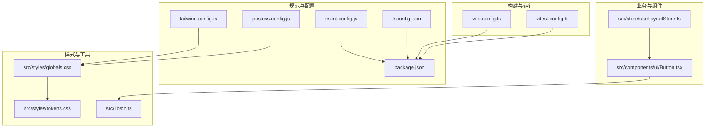
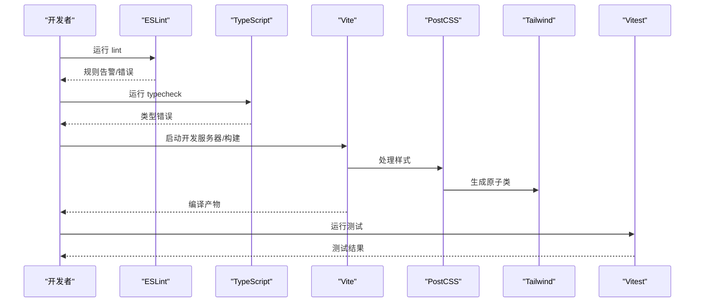
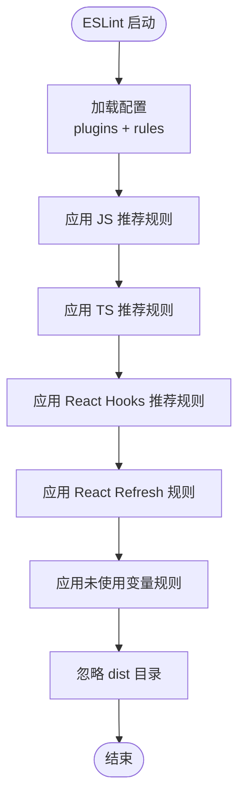
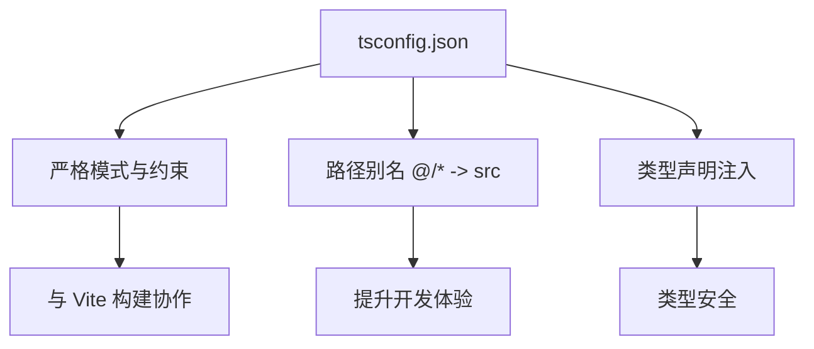
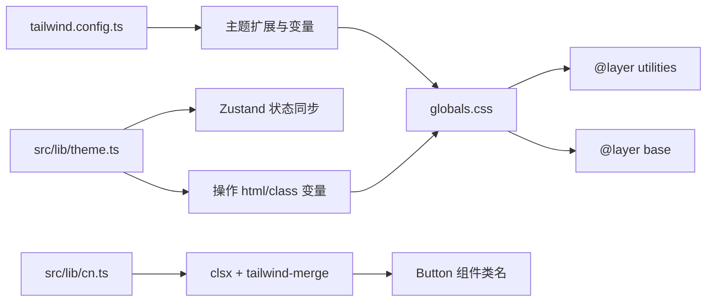
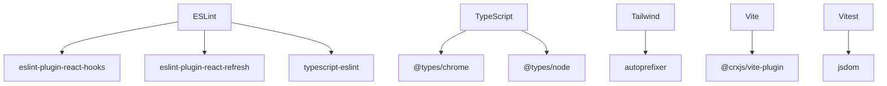

# 代码规范与质量

<cite>
**本文引用的文件**
- [eslint.config.js](file://eslint.config.js)
- [tsconfig.json](file://tsconfig.json)
- [tailwind.config.ts](file://tailwind.config.ts)
- [postcss.config.js](file://postcss.config.js)
- [package.json](file://package.json)
- [vite.config.ts](file://vite.config.ts)
- [vitest.config.ts](file://vitest.config.ts)
- [src/test-setup.ts](file://src/test-setup.ts)
- [src/styles/globals.css](file://src/styles/globals.css)
- [src/styles/tokens.css](file://src/styles/tokens.css)
- [src/lib/cn.ts](file://src/lib/cn.ts)
- [src/lib/theme.ts](file://src/lib/theme.ts)
- [src/components/ui/Button.tsx](file://src/components/ui/Button.tsx)
- [src/components/ui/Button.test.tsx](file://src/components/ui/Button.test.tsx)
- [src/store/useLayoutStore.ts](file://src/store/useLayoutStore.ts)
</cite>

## 目录

1. [引言](#引言)
2. [项目结构](#项目结构)
3. [核心组件](#核心组件)
4. [架构总览](#架构总览)
5. [详细组件分析](#详细组件分析)
6. [依赖关系分析](#依赖关系分析)
7. [性能考量](#性能考量)
8. [故障排查指南](#故障排查指南)
9. [结论](#结论)
10. [附录](#附录)

## 引言

本指南面向本项目的代码规范与质量保证，系统阐述以下方面：

- ESLint 配置规则与作用机制：包括 React Hooks 规则、TypeScript ESLint 规则、React Refresh 规则及其在工程中的落地方式
- TypeScript 类型系统的最佳实践与配置策略：严格模式、未使用变量/参数处理、路径别名与类型声明
- Tailwind CSS 使用规范与样式组织原则：主题变量、暗色模式、玻璃态、工具类合并与层叠管理
- 代码格式化标准与 Prettier 配置：与现有构建链路的衔接（Vite、PostCSS）
- 代码审查检查清单与质量门禁标准：静态检查、类型检查、测试覆盖率与可维护性指标
- 代码异味识别与重构建议：命名、副作用、状态管理、样式组织与可访问性

## 项目结构

本项目采用前端现代化工程栈：Vite + React + TypeScript + Tailwind CSS，并通过 CRXJS 构建 Chrome 扩展。关键规范与质量相关文件分布如下：

- 质量与规范：eslint.config.js、tsconfig.json、postcss.config.js、tailwind.config.ts
- 构建与脚本：package.json、vite.config.ts
- 测试：vitest.config.ts、src/test-setup.ts、各组件测试文件
- 样式：src/styles/globals.css、src/styles/tokens.css、src/lib/cn.ts
- 组件与状态：src/components/ui/Button.tsx、src/store/useLayoutStore.ts 等

图表来源

- [eslint.config.js:1-22](file://eslint.config.js#L1-L22)
- [tsconfig.json:1-27](file://tsconfig.json#L1-L27)
- [tailwind.config.ts:1-42](file://tailwind.config.ts#L1-L42)
- [postcss.config.js:1-7](file://postcss.config.js#L1-L7)
- [package.json:1-56](file://package.json#L1-L56)
- [vite.config.ts:1-46](file://vite.config.ts#L1-L46)
- [vitest.config.ts:1-16](file://vitest.config.ts#L1-L16)
- [src/styles/globals.css:1-147](file://src/styles/globals.css#L1-L147)
- [src/styles/tokens.css](file://src/styles/tokens.css)
- [src/lib/cn.ts:1-7](file://src/lib/cn.ts#L1-L7)
- [src/components/ui/Button.tsx:1-41](file://src/components/ui/Button.tsx#L1-L41)
- [src/store/useLayoutStore.ts:1-58](file://src/store/useLayoutStore.ts#L1-L58)

章节来源

- [package.json:10-17](file://package.json#L10-L17)
- [vite.config.ts:1-46](file://vite.config.ts#L1-L46)
- [vitest.config.ts:1-16](file://vitest.config.ts#L1-L16)

## 核心组件

本节聚焦与质量保障直接相关的配置与工具模块。

- ESLint 配置与规则
  - 基于统一配置入口，启用 JavaScript/TypeScript 推荐规则集，并集成 React Hooks 与 React Refresh 插件
  - 关键规则要点：
    - React Hooks 推荐规则：确保 Hook 使用顺序与依赖声明正确
    - React Refresh：仅导出组件时允许常量导出，避免热更新误报
    - TypeScript：未使用变量忽略下划线前缀参数，减少噪音
  - 忽略目录：dist

- TypeScript 配置与类型策略
  - 编译目标：ES2022；模块解析：bundler；严格模式开启
  - JSX：react-jsx；无输出（noEmit）由 Vite/TSC 协作完成
  - 路径映射：@/\* 指向 src；类型声明：chrome、vite/client、node
  - 严格约束：未使用局部变量与参数、switch 穿透、未覆盖分支等

- Tailwind 与 PostCSS
  - Tailwind：content 覆盖 src 下 ts/tsx/html；暗色模式基于 class；主题扩展颜色、圆角、阴影、字体族
  - PostCSS：启用 tailwindcss 与 autoprefixer 插件

- 测试与断言
  - Vitest：jsdom 环境、全局断言、setupFiles 加载测试前置
  - 测试断言示例：Button 组件的变体、尺寸、禁用状态与属性透传

章节来源

- [eslint.config.js:6-21](file://eslint.config.js#L6-L21)
- [tsconfig.json:2-25](file://tsconfig.json#L2-L25)
- [tailwind.config.ts:3-41](file://tailwind.config.ts#L3-L41)
- [postcss.config.js:1-7](file://postcss.config.js#L1-L7)
- [vitest.config.ts:4-15](file://vitest.config.ts#L4-L15)
- [src/components/ui/Button.test.tsx:1-66](file://src/components/ui/Button.test.tsx#L1-L66)

## 架构总览

从质量保障视角，项目形成“配置—构建—运行—测试—样式”的闭环：

图表来源

- [eslint.config.js:15-19](file://eslint.config.js#L15-L19)
- [tsconfig.json:14-14](file://tsconfig.json#L14-L14)
- [vite.config.ts:7-8](file://vite.config.ts#L7-L8)
- [postcss.config.js:1-7](file://postcss.config.js#L1-L7)
- [tailwind.config.ts:4-4](file://tailwind.config.ts#L4-L4)
- [vitest.config.ts:10-14](file://vitest.config.ts#L10-L14)

## 详细组件分析

### ESLint 配置与规则详解

- 配置入口与插件
  - 使用统一配置数组，启用 js 与 tseslint 推荐规则
  - 插件：react-hooks、react-refresh
- 规则要点
  - react-hooks/recommended：强制正确的 Hook 使用与依赖声明
  - react-refresh/only-export-components：允许常量导出，避免刷新误报
  - @typescript-eslint/no-unused-vars：忽略以下划线开头的参数，提升可读性
- 忽略策略
  - dist 目录不参与检查，减少无关噪声

图表来源

- [eslint.config.js:6-21](file://eslint.config.js#L6-L21)

章节来源

- [eslint.config.js:6-21](file://eslint.config.js#L6-L21)

### TypeScript 类型系统最佳实践与配置策略

- 严格模式与编译选项
  - 严格模式开启，禁止未使用局部变量与参数，避免 switch 穿透
  - JSX 使用 react-jsx，无 emit 交由构建链处理
- 路径别名与类型声明
  - baseUrl 与 paths 统一 @/\* 到 src
  - types 显式声明 chrome、vite/client、node，确保 IDE 与类型推断准确
- 与构建链协作
  - package.json 中 typecheck 与 build 脚本配合 tsc 与 vite

图表来源

- [tsconfig.json:2-25](file://tsconfig.json#L2-L25)
- [package.json:14-14](file://package.json#L14-L14)

章节来源

- [tsconfig.json:2-25](file://tsconfig.json#L2-L25)
- [package.json:14-14](file://package.json#L14-L14)

### Tailwind CSS 使用规范与样式组织原则

- 主题与变量
  - Tailwind 主题扩展颜色、圆角、阴影与字体族，变量来自 CSS 自定义属性
  - 暗色模式基于 class，支持 glass-mode 与壁纸亮度分类
- 样式组织
  - 全局样式通过 globals.css 引入 Tailwind 层叠，再在 tokens.css 定义变量
  - cn 工具函数结合 clsx 与 tailwind-merge 实现类名合并与冲突消解
- 动态主题与壁纸
  - theme.ts 提供主题切换、玻璃态、壁纸色调与亮度、减少动画等能力，并与 Zustand 状态联动

图表来源

- [tailwind.config.ts:3-41](file://tailwind.config.ts#L3-L41)
- [src/styles/globals.css:1-147](file://src/styles/globals.css#L1-L147)
- [src/lib/cn.ts:1-7](file://src/lib/cn.ts#L1-L7)
- [src/lib/theme.ts:1-123](file://src/lib/theme.ts#L1-L123)

章节来源

- [tailwind.config.ts:3-41](file://tailwind.config.ts#L3-L41)
- [src/styles/globals.css:1-147](file://src/styles/globals.css#L1-L147)
- [src/lib/cn.ts:1-7](file://src/lib/cn.ts#L1-L7)
- [src/lib/theme.ts:1-123](file://src/lib/theme.ts#L1-L123)

### 代码格式化标准与 Prettier 配置

- 当前仓库未发现 Prettier 配置文件，但已具备完善的构建与质量链路：
  - ESLint 负责语法与风格规则
  - TypeScript 负责类型与结构约束
  - Vite/PostCSS 负责样式管线
- 建议补充 Prettier 配置以统一缩进、引号、尾逗号等格式细节，并与 ESLint 配合（prettier-vscode 或 ESLint 的 parserOptions），确保编辑器与 CI 行为一致。

[本节为通用建议，不直接分析具体文件，故无章节来源]

### 代码审查检查清单与质量门禁标准

- 静态检查
  - 运行 ESLint：确保 React Hooks 规则、React Refresh 规则与 TypeScript 未使用变量规则通过
  - 运行 TypeScript 类型检查：确保无类型错误
- 构建与运行
  - 本地启动开发服务器，确认热更新与样式生效
  - 构建产物校验：chunk 分离合理、无异常警告
- 测试
  - 运行 Vitest：确保组件行为与交互测试通过
  - 覆盖关键路径：变体、尺寸、禁用、属性透传、状态变更
- 可维护性
  - 命名清晰、职责单一、避免重复逻辑
  - 样式组织清晰，优先使用 Tailwind 原子类与 cn 工具
  - 状态管理集中且可追踪（Zustand）

章节来源

- [eslint.config.js:15-19](file://eslint.config.js#L15-L19)
- [tsconfig.json:16-18](file://tsconfig.json#L16-L18)
- [vite.config.ts:14-33](file://vite.config.ts#L14-L33)
- [vitest.config.ts:10-14](file://vitest.config.ts#L10-L14)
- [src/components/ui/Button.test.tsx:5-65](file://src/components/ui/Button.test.tsx#L5-L65)

### 代码异味识别与重构建议

- 常见异味
  - 未使用的变量或参数：利用 TypeScript 规则忽略下划线前缀，保持简洁
  - 过长函数与复杂条件：拆分函数、引入辅助类型或工具函数
  - 样式硬编码：统一迁移到 Tailwind 与 tokens.css，使用 cn 合并类名
  - 状态分散：Zustand 状态集中管理，避免多处副作用
- 重构建议
  - 将主题与壁纸相关逻辑抽象为独立 hooks，便于复用与测试
  - 对组件 props 进行类型收敛，减少字符串字面量
  - 使用 CSS 自定义属性承载动态值，减少重复计算与 DOM 操作

章节来源

- [eslint.config.js:18-18](file://eslint.config.js#L18-L18)
- [src/lib/cn.ts:1-7](file://src/lib/cn.ts#L1-L7)
- [src/lib/theme.ts:47-95](file://src/lib/theme.ts#L47-L95)
- [src/store/useLayoutStore.ts:32-54](file://src/store/useLayoutStore.ts#L32-L54)

## 依赖关系分析

- 质量与规范依赖
  - ESLint 依赖 React Hooks 与 React Refresh 插件
  - TypeScript 依赖 chrome、vite/client、node 类型声明
  - Tailwind 依赖 PostCSS autoprefixer
- 构建与测试依赖
  - Vite 与 CRXJS 插件负责扩展打包
  - Vitest 依赖 jsdom 与测试前置设置

图表来源

- [eslint.config.js:3-4](file://eslint.config.js#L3-L4)
- [package.json:34-53](file://package.json#L34-L53)
- [postcss.config.js:1-7](file://postcss.config.js#L1-L7)
- [vite.config.ts:3-3](file://vite.config.ts#L3-L3)
- [vitest.config.ts:11-11](file://vitest.config.ts#L11-L11)

章节来源

- [package.json:34-53](file://package.json#L34-L53)
- [vite.config.ts:3-3](file://vite.config.ts#L3-L3)
- [vitest.config.ts:11-11](file://vitest.config.ts#L11-L11)

## 性能考量

- 构建优化
  - Vite Rollup 输出命名与手动分包策略，将 React、Zustand 等第三方库单独拆分为 vendor chunk，降低首屏变更带来的缓存失效
- 开发体验
  - ESLint 与 TypeScript 在开发阶段快速反馈，减少调试成本
  - PostCSS 自动前缀与 Tailwind 原子类减少冗余样式体积
- 样式性能
  - 使用 CSS 自定义属性与 class 切换控制主题与壁纸，避免频繁重排
  - 减少动画与过渡：根据 reduce-motion 条件自动降级

章节来源

- [vite.config.ts:19-31](file://vite.config.ts#L19-L31)
- [src/styles/globals.css:70-89](file://src/styles/globals.css#L70-L89)
- [src/lib/theme.ts:43-45](file://src/lib/theme.ts#L43-L45)

## 故障排查指南

- ESLint 报错
  - React Hooks：检查依赖数组与调用顺序，确保按约定使用
  - React Refresh：若出现非组件常量导出警告，确认导出是否符合 allowConstantExport 策略
  - TypeScript 未使用变量：对下划线前缀参数使用忽略策略，保持接口简洁
- TypeScript 类型错误
  - 检查 tsconfig 的 strict、paths、types 配置是否与实际代码一致
  - 确认类型声明文件存在且版本兼容
- 样式问题
  - Tailwind 未生成预期类：确认 content 路径包含当前文件，重新构建
  - 暗色模式/玻璃态无效：检查 html/class 是否正确添加，CSS 变量是否设置
- 测试失败
  - 确保 jsdom 环境与 setupFiles 正确加载
  - 组件渲染断言需匹配 role 与属性，避免脆弱选择器

章节来源

- [eslint.config.js:15-19](file://eslint.config.js#L15-L19)
- [tsconfig.json:15-19](file://tsconfig.json#L15-L19)
- [tailwind.config.ts:4-4](file://tailwind.config.ts#L4-L4)
- [src/styles/globals.css:1-147](file://src/styles/globals.css#L1-L147)
- [vitest.config.ts:10-14](file://vitest.config.ts#L10-L14)
- [src/components/ui/Button.test.tsx:6-64](file://src/components/ui/Button.test.tsx#L6-L64)

## 结论

本项目已建立完善的质量基线：ESLint + TypeScript + Tailwind + Vitest 的组合能够有效保障代码一致性、类型安全与样式可维护性。建议后续补充 Prettier 配置以统一格式化标准，并持续完善测试覆盖与可访问性检查，进一步提升交付质量与长期可维护性。

## 附录

- 脚本与命令
  - 开发：启动 Vite 开发服务器
  - 构建：先进行类型检查，再执行 Vite 构建
  - 预览：本地预览构建产物
  - 类型检查：仅进行类型检查，不生成输出
  - 代码检查：对 src 目录运行 ESLint
  - 测试：运行 Vitest 测试套件

章节来源

- [package.json:10-16](file://package.json#L10-L16)
