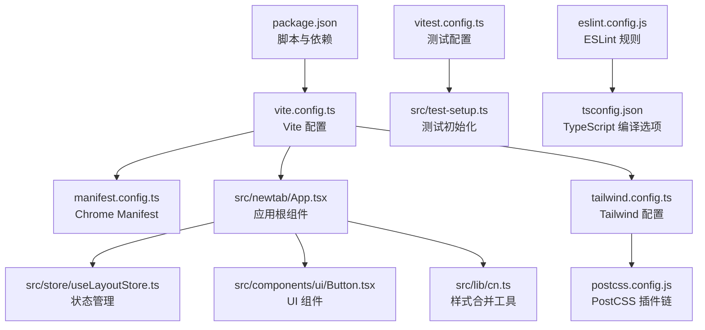
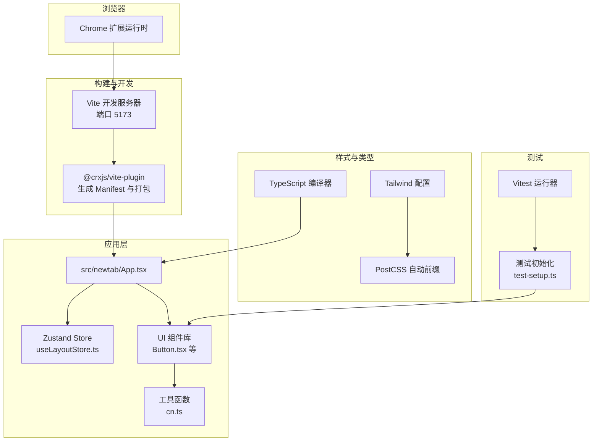
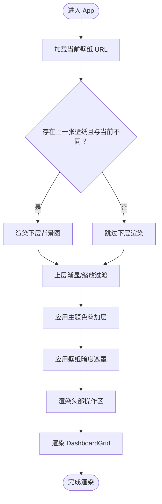
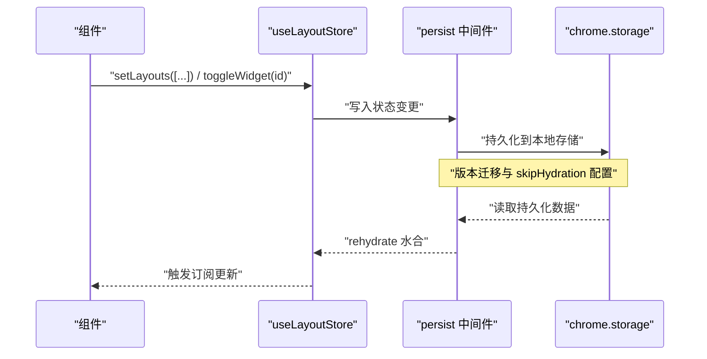
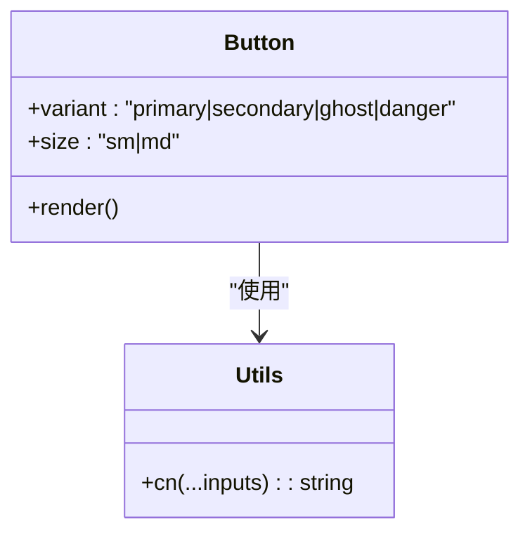
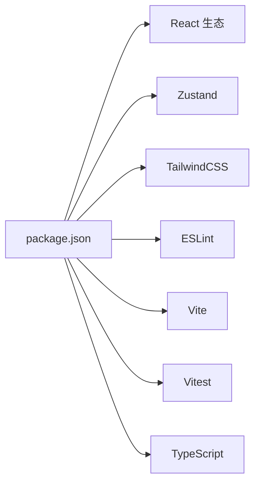

# 开发指南

<cite>
**本文引用的文件**
- [package.json](file://package.json)
- [vite.config.ts](file://vite.config.ts)
- [vitest.config.ts](file://vitest.config.ts)
- [eslint.config.js](file://eslint.config.js)
- [tsconfig.json](file://tsconfig.json)
- [manifest.config.ts](file://manifest.config.ts)
- [tailwind.config.ts](file://tailwind.config.ts)
- [postcss.config.js](file://postcss.config.js)
- [src/test-setup.ts](file://src/test-setup.ts)
- [README.md](file://README.md)
- [src/newtab/App.tsx](file://src/newtab/App.tsx)
- [src/store/useLayoutStore.ts](file://src/store/useLayoutStore.ts)
- [src/components/ui/Button.tsx](file://src/components/ui/Button.tsx)
- [src/lib/cn.ts](file://src/lib/cn.ts)
</cite>

## 目录

1. [简介](#简介)
2. [项目结构](#项目结构)
3. [核心组件](#核心组件)
4. [架构总览](#架构总览)
5. [详细组件分析](#详细组件分析)
6. [依赖分析](#依赖分析)
7. [性能考虑](#性能考虑)
8. [故障排查指南](#故障排查指南)
9. [结论](#结论)
10. [附录](#附录)

## 简介

本指南面向希望参与 Tab 项目的开发者，目标是帮助你快速理解并高效参与开发。内容涵盖开发环境搭建、代码规范与 ESLint 规则、测试策略与 Vitest 配置、构建工具与优化（Vite 插件与生产构建）、TypeScript 类型策略、调试技巧与开发工具、性能优化与质量保障、以及贡献与代码审查流程。

## 项目结构

该项目是一个基于 React + Vite 的 Chrome 新标签页扩展，采用模块化组织方式：

- 源码位于 src/，按功能域划分为 newtab、components、store、lib、styles、types 等子目录
- 构建与开发工具通过 Vite 驱动，使用 CRXJS 插件打包为 Chrome Extension
- 测试使用 Vitest + jsdom，UI 测试借助 Testing Library
- 样式系统基于 TailwindCSS，并通过 PostCSS 自动前缀

图表来源

- [package.json:10-16](file://package.json#L10-L16)
- [vite.config.ts:1-46](file://vite.config.ts#L1-L46)
- [manifest.config.ts:1-38](file://manifest.config.ts#L1-L38)
- [src/newtab/App.tsx:1-110](file://src/newtab/App.tsx#L1-L110)
- [src/store/useLayoutStore.ts:1-58](file://src/store/useLayoutStore.ts#L1-L58)
- [src/components/ui/Button.tsx:1-41](file://src/components/ui/Button.tsx#L1-L41)
- [src/lib/cn.ts:1-7](file://src/lib/cn.ts#L1-L7)
- [tailwind.config.ts:1-42](file://tailwind.config.ts#L1-L42)
- [postcss.config.js:1-7](file://postcss.config.js#L1-L7)
- [vitest.config.ts:1-16](file://vitest.config.ts#L1-L16)
- [src/test-setup.ts:1-2](file://src/test-setup.ts#L1-L2)
- [eslint.config.js:1-22](file://eslint.config.js#L1-L22)
- [tsconfig.json:1-27](file://tsconfig.json#L1-L27)

章节来源

- [README.md:54-68](file://README.md#L54-L68)
- [package.json:10-16](file://package.json#L10-L16)

## 核心组件

- 应用入口与布局：App.tsx 负责壁纸层叠与前景遮罩、编辑模式切换、设置抽屉与快捷键帮助弹窗，并承载 DashboardGrid 布局网格
- 状态管理：useLayoutStore 使用 Zustand + persist 中间件，结合 chrome.storage 实现布局与启用状态的本地持久化与跨标签同步
- UI 组件：Button.tsx 提供多变体与尺寸的按钮，统一使用 cn 合并类名，确保 Tailwind 变量与条件样式的正确合并
- 工具函数：cn.ts 封装 clsx + tailwind-merge，避免重复与冲突的样式类

章节来源

- [src/newtab/App.tsx:10-110](file://src/newtab/App.tsx#L10-L110)
- [src/store/useLayoutStore.ts:32-58](file://src/store/useLayoutStore.ts#L32-L58)
- [src/components/ui/Button.tsx:24-41](file://src/components/ui/Button.tsx#L24-L41)
- [src/lib/cn.ts:4-7](file://src/lib/cn.ts#L4-L7)

## 架构总览

下图展示从浏览器到应用、构建与测试的关键交互路径：

图表来源

- [vite.config.ts:7-45](file://vite.config.ts#L7-L45)
- [manifest.config.ts:4-37](file://manifest.config.ts#L4-L37)
- [src/newtab/App.tsx:10-110](file://src/newtab/App.tsx#L10-L110)
- [src/store/useLayoutStore.ts:32-58](file://src/store/useLayoutStore.ts#L32-L58)
- [src/components/ui/Button.tsx:24-41](file://src/components/ui/Button.tsx#L24-L41)
- [src/lib/cn.ts:4-7](file://src/lib/cn.ts#L4-L7)
- [tailwind.config.ts:3-41](file://tailwind.config.ts#L3-L41)
- [postcss.config.js:1-7](file://postcss.config.js#L1-L7)
- [vitest.config.ts:4-15](file://vitest.config.ts#L4-L15)
- [src/test-setup.ts:1-2](file://src/test-setup.ts#L1-L2)
- [tsconfig.json:2-26](file://tsconfig.json#L2-L26)

## 详细组件分析

### 应用入口与壁纸层叠动画

- 功能要点：双层壁纸（上层当前、下层前一张）在切换时进行淡入淡出与缩放过渡；叠加色板与可调暗度遮罩提升可读性；顶部区域提供编辑、帮助、设置入口
- 关键实现：通过 CSS 变量与内联样式控制透明度与变换，配合 reduceMotion 控制过渡时长
- 交互：键盘快捷键绑定到编辑模式切换、设置抽屉与帮助弹窗的开关

图表来源

- [src/newtab/App.tsx:17-104](file://src/newtab/App.tsx#L17-L104)

章节来源

- [src/newtab/App.tsx:10-110](file://src/newtab/App.tsx#L10-L110)

### 状态管理与持久化（Zustand）

- 设计：以 create 函数创建状态切片，使用 persist 中间件将布局与启用状态存储于 chrome.storage
- 数据模型：包含默认布局数组与启用组件集合，支持重置、切换与批量更新
- 同步：注册水合与远程同步钩子，确保多页面一致

图表来源

- [src/store/useLayoutStore.ts:32-58](file://src/store/useLayoutStore.ts#L32-L58)

章节来源

- [src/store/useLayoutStore.ts:14-58](file://src/store/useLayoutStore.ts#L14-L58)

### UI 组件 Button 与样式合并工具

- Button：提供多变体与尺寸映射，统一圆角、阴影、过渡与禁用态处理
- cn：封装 clsx 与 tailwind-merge，避免重复与冲突类名，确保最终样式正确

图表来源

- [src/components/ui/Button.tsx:24-41](file://src/components/ui/Button.tsx#L24-L41)
- [src/lib/cn.ts:4-7](file://src/lib/cn.ts#L4-L7)

章节来源

- [src/components/ui/Button.tsx:12-39](file://src/components/ui/Button.tsx#L12-L39)
- [src/lib/cn.ts:4-7](file://src/lib/cn.ts#L4-L7)

## 依赖分析

- 运行时依赖：React 生态、Zustand 状态管理、clsx 与 tailwind-merge 样式合并、lucide-react 图标、react-grid-layout 布局网格
- 开发依赖：Vite、@crxjs/vite-plugin、React 插件、TailwindCSS、Autoprefixer、ESLint、TypeScript、Vitest、Testing Library 等
- 版本约束：Node >= 22.13.0，TypeScript 5.x，Vite 8.x

图表来源

- [package.json:18-54](file://package.json#L18-L54)

章节来源

- [package.json:7-54](file://package.json#L7-L54)

## 性能考虑

- 构建优化
  - Vite 目标设为 ESNext，充分利用现代浏览器特性
  - Rollup 分包策略：将 React、ReactDOM、Zustand、Scheduler 等放入独立 vendor chunk，降低应用代码变更对首屏体积的影响
  - 开发服务器绑定 127.0.0.1 并固定端口，避免 IPv6 导致的连接问题
- 样式与资源
  - Tailwind 仅扫描 src 下的 TS/TSX/HTML 文件，减少无用类名扫描
  - PostCSS 自动前缀，确保兼容性同时保持构建简洁
- 运行时体验
  - 通过 reduceMotion 控制过渡时长，兼顾可访问性与性能
  - 壁纸层叠与淡入淡出使用 will-change 与线性时间曲线，保证流畅度

章节来源

- [vite.config.ts:14-44](file://vite.config.ts#L14-L44)
- [tailwind.config.ts:4-41](file://tailwind.config.ts#L4-L41)
- [postcss.config.js:1-7](file://postcss.config.js#L1-L7)
- [src/newtab/App.tsx:18-19](file://src/newtab/App.tsx#L18-L19)

## 故障排查指南

- 开发服务器无法访问
  - 确认 Vite server.host 设置为 127.0.0.1，端口 5173，严格端口占用
  - 若浏览器解析到 IPv6，请检查 hosts 或网络配置
- 扩展无法加载或热更新失败
  - 确保已执行一次构建后再加载 dist/，后续修改由 Vite 自动刷新
  - 检查 manifest.newtab 与 background.service_worker 路径是否正确
- 样式不生效或冲突
  - 确认 Tailwind content 扫描范围覆盖到相关文件
  - 使用 cn 合并类名，避免重复与冲突
- 测试报错
  - 确认 Vitest 环境为 jsdom，setupFiles 引用了测试初始化脚本
  - 如需自定义全局断言，可在测试中引入 @testing-library/jest-dom

章节来源

- [vite.config.ts:34-44](file://vite.config.ts#L34-L44)
- [manifest.config.ts:9-15](file://manifest.config.ts#L9-L15)
- [tailwind.config.ts:4-41](file://tailwind.config.ts#L4-L41)
- [vitest.config.ts:10-14](file://vitest.config.ts#L10-L14)
- [src/test-setup.ts:1-2](file://src/test-setup.ts#L1-L2)

## 结论

本指南提供了从环境搭建到开发、测试、构建与优化的完整路径。遵循本文档的配置与最佳实践，可以显著提升开发效率与代码质量，并确保扩展在多环境下稳定运行。

## 附录

### 开发环境搭建

- 系统要求：Node >= 22.13.0
- 安装依赖：执行安装命令后，先构建一次再加载扩展
- 开发模式：运行开发服务器，自动刷新新标签页
- 加载扩展：在 Chrome 扩展页面启用“开发者模式”，选择 dist/ 目录加载

章节来源

- [package.json:7-9](file://package.json#L7-L9)
- [README.md:20-39](file://README.md#L20-L39)

### 代码规范与 ESLint 配置

- 推荐规则
  - 使用 TypeScript ESLint 推荐规则集
  - 启用 React Hooks 与 React Refresh 规则
  - 忽略未使用变量的错误，允许以下划线开头的参数占位
- 忽略项：dist 目录
- 插件：react-hooks、react-refresh

章节来源

- [eslint.config.js:6-21](file://eslint.config.js#L6-L21)

### 测试策略与 Vitest 配置

- 测试运行：使用 Vitest 运行器，环境为 jsdom
- 全局：启用全局测试 API
- 别名：将 @ 指向 src 目录
- 初始化：引入 @testing-library/jest-dom 的 vitest 断言
- 建议实践
  - 单元测试：针对纯函数与 Hook（如 cn、useShortcut、useWallpaper 辅助逻辑）
  - 集成测试：针对组件组合与用户交互（如 Button、Dialog、Drawer）
  - UI 测试：使用 Testing Library 的查询与事件模拟，覆盖键盘快捷键场景

章节来源

- [vitest.config.ts:4-15](file://vitest.config.ts#L4-L15)
- [src/test-setup.ts:1-2](file://src/test-setup.ts#L1-L2)

### 构建工具与优化策略

- Vite 插件
  - @vitejs/plugin-react：React 热更新与 JSX 转换
  - @crxjs/vite-plugin：生成 Manifest 与扩展打包
- 构建优化
  - 目标：ESNext
  - 分包：将 React、ReactDOM、Zustand、Scheduler 独立为 vendor chunk
  - 输出命名：带哈希的 chunk 文件名
- 开发服务器
  - host: 127.0.0.1
  - port: 5173
  - strictPort: true
  - HMR 端口：5173

章节来源

- [vite.config.ts:7-45](file://vite.config.ts#L7-L45)

### TypeScript 配置与类型策略

- 编译目标：ES2022
- 模块解析：bundler
- JSX：react-jsx
- 严格模式：开启严格检查
- 类型声明：内置 chrome、vite/client、node
- 路径别名：@/_ -> src/_

章节来源

- [tsconfig.json:2-26](file://tsconfig.json#L2-L26)

### 调试技巧与开发工具

- 浏览器 DevTools：检查扩展页面与后台脚本
- Vite HMR：确认端口与 host 设置，避免 IPv6 解析导致的连接问题
- 测试调试：在 Vitest 中使用断点与日志，结合 jsdom 环境验证 DOM 行为
- 样式调试：利用 Tailwind 变量与 CSS 自定义属性，快速切换主题与层级

章节来源

- [vite.config.ts:34-44](file://vite.config.ts#L34-L44)
- [tailwind.config.ts:8-25](file://tailwind.config.ts#L8-L25)

### 贡献指南与代码审查标准

- 提交前检查
  - 通过类型检查与 ESLint 规则
  - 运行测试并确保覆盖率与稳定性
- 代码风格
  - 遵循 ESLint 推荐规则与项目约定
  - 组件与 Hook 命名清晰，职责单一
- 变更范围
  - 小步提交，明确变更动机与影响面
  - 对状态管理与布局变更，提供迁移说明
- 审查关注点
  - 性能影响（分包、渲染开销、网络请求）
  - 可访问性与跨平台兼容性
  - 测试覆盖与边界情况处理

[本节为通用指导，无需列出章节来源]
