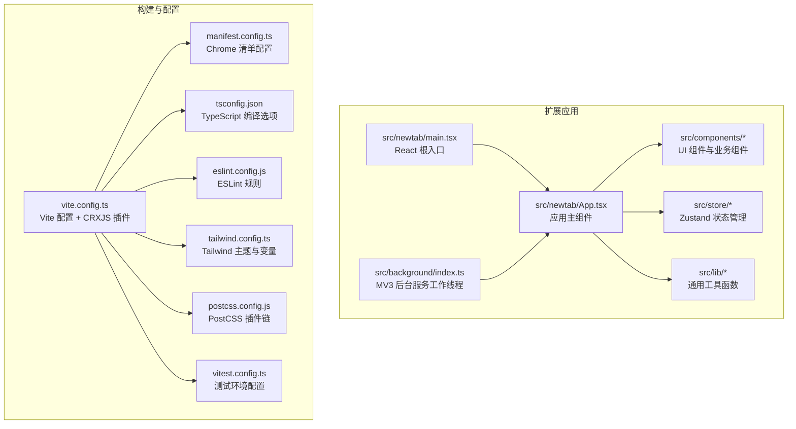
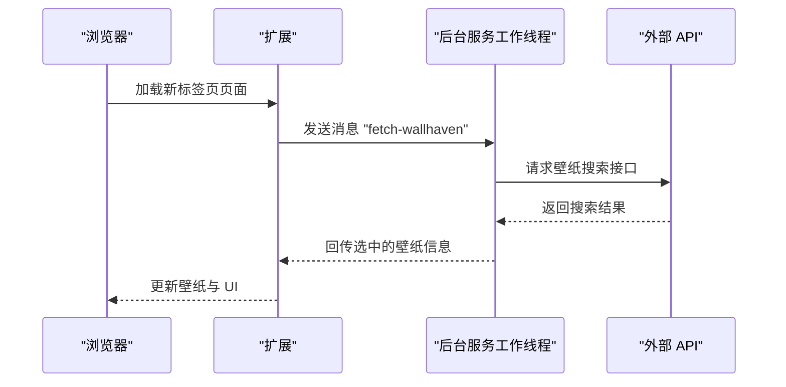
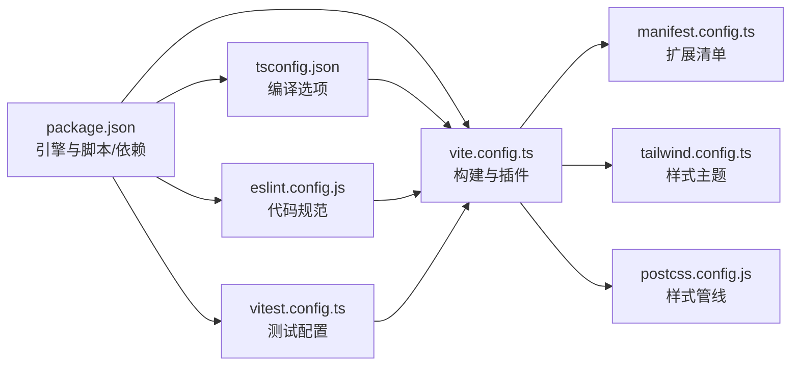

# 开发环境搭建

<cite>
**本文档引用的文件**
- [package.json](file://package.json)
- [tsconfig.json](file://tsconfig.json)
- [vite.config.ts](file://vite.config.ts)
- [manifest.config.ts](file://manifest.config.ts)
- [README.md](file://README.md)
- [eslint.config.js](file://eslint.config.js)
- [tailwind.config.ts](file://tailwind.config.ts)
- [vitest.config.ts](file://vitest.config.ts)
- [postcss.config.js](file://postcss.config.js)
- [src/newtab/main.tsx](file://src/newtab/main.tsx)
- [src/background/index.ts](file://src/background/index.ts)
- [src/newtab/App.tsx](file://src/newtab/App.tsx)
</cite>

## 目录

1. [简介](#简介)
2. [项目结构](#项目结构)
3. [核心组件](#核心组件)
4. [架构总览](#架构总览)
5. [详细组件分析](#详细组件分析)
6. [依赖关系分析](#依赖关系分析)
7. [性能考虑](#性能考虑)
8. [故障排除指南](#故障排除指南)
9. [结论](#结论)
10. [附录](#附录)

## 简介

本指南面向希望在本地搭建并开发该 Chrome 新标签页扩展项目的开发者。项目基于 React + Vite 构建，采用 TypeScript 进行类型安全开发，并通过 CRXJS 插件支持浏览器扩展开发。文档将从 Node.js 与包管理器版本要求开始，逐步讲解依赖安装、开发服务器启动、常用命令、TypeScript 配置以及浏览器扩展开发的特殊要求，并提供常见问题排查与 IDE 配置建议。

## 项目结构

该项目为一个 Chrome MV3 扩展，采用模块化目录组织：

- 源码位于 src/，包含新标签页入口、React 组件、状态管理、工具函数、样式与类型定义
- 构建与开发工具配置位于根目录：Vite、TypeScript、ESLint、TailwindCSS、PostCSS、测试配置等
- 扩展清单由 manifest.config.ts 定义，指向新标签页页面与后台脚本

图表来源

- [src/newtab/main.tsx:1-29](file://src/newtab/main.tsx#L1-L29)
- [src/newtab/App.tsx:1-110](file://src/newtab/App.tsx#L1-L110)
- [src/background/index.ts:1-174](file://src/background/index.ts#L1-L174)
- [vite.config.ts:1-46](file://vite.config.ts#L1-L46)
- [manifest.config.ts:1-38](file://manifest.config.ts#L1-L38)
- [tsconfig.json:1-27](file://tsconfig.json#L1-L27)
- [eslint.config.js:1-22](file://eslint.config.js#L1-L22)
- [tailwind.config.ts:1-42](file://tailwind.config.ts#L1-L42)
- [postcss.config.js:1-7](file://postcss.config.js#L1-L7)
- [vitest.config.ts:1-16](file://vitest.config.ts#L1-L16)

章节来源

- [README.md:54-68](file://README.md#L54-L68)

## 核心组件

- Node.js 版本要求：项目通过 engines 字段声明最低 Node.js 版本为 22.13.0。
- 包管理器：项目使用 npm（package.json 中 type 为 module），同时支持 yarn（常见用法一致）。
- 核心依赖：React 18、React DOM、Zustand、Tailwind Merge、Lucide React、clsx 等。
- 开发依赖：Vite 8、@crxjs/vite-plugin、TypeScript 5、ESLint 10、TailwindCSS 3、PostCSS、React 插件、Vitest 等。

章节来源

- [package.json:7-9](file://package.json#L7-L9)
- [package.json:18-26](file://package.json#L18-L26)
- [package.json:32-54](file://package.json#L32-L54)

## 架构总览

该扩展采用“新标签页页面 + MV3 后台服务工作线程”的双层架构：

- 新标签页页面：React 应用，负责 UI 呈现、用户交互与状态展示
- 后台服务工作线程：处理需要跨域或受限访问的网络请求（如壁纸 API），并通过消息通道与前台页面通信
- 构建系统：Vite + CRXJS 插件，支持热重载与打包，清单由 manifest.config.ts 动态生成

图表来源

- [src/background/index.ts:123-173](file://src/background/index.ts#L123-L173)
- [manifest.config.ts:12-15](file://manifest.config.ts#L12-L15)

## 详细组件分析

### Node.js 与包管理器版本要求

- Node.js：项目要求 Node.js >= 22.13.0，确保使用较新的 ECMAScript 特性与包解析行为。
- 包管理器：使用 npm（package.json 中 type 为 module）。若使用 yarn，需确认其对 ES Modules 的兼容性与版本匹配。

章节来源

- [package.json:7-9](file://package.json#L7-L9)

### 依赖安装流程

- 安装依赖：执行包管理器安装命令以拉取所有依赖与开发依赖。
- 注意 overrides：项目通过 overrides 将 @crxjs/vite-plugin 依赖的 rollup 锁定到特定版本，避免构建冲突。

章节来源

- [package.json:27-31](file://package.json#L27-L31)

### 开发服务器启动与常用命令

- 启动开发服务器：运行开发脚本，Vite 将在 127.0.0.1:5173 提供热重载服务。
- 构建产物：先进行 TypeScript 类型检查，再执行 Vite 打包。
- 预览：本地预览构建产物。
- 类型检查：仅进行类型检查，不输出编译结果。
- 代码质量：运行 ESLint 检查 src 目录。
- 单元测试：使用 Vitest 运行测试。

章节来源

- [package.json:10-16](file://package.json#L10-L16)
- [vite.config.ts:34-44](file://vite.config.ts#L34-L44)

### TypeScript 配置详解

- 目标与模块：目标 ES2022，模块系统为 ESNext，使用 bundler 解析策略，启用 isolatedModules 与 moduleDetection 强制模式，确保 Vite 构建兼容性。
- JSX 与严格模式：启用 react-jsx，开启严格模式与未使用变量/参数检测，防止潜在错误。
- 类型声明：内置 chrome、vite/client、node 类型，便于扩展 API 与构建环境使用。
- 路径别名：配置 @ 指向 src，提升导入可读性。
- include 范围：包含 src、配置文件与测试配置，确保类型检查覆盖全量源码。

章节来源

- [tsconfig.json:2-26](file://tsconfig.json#L2-L26)

### Vite 与 CRXJS 集成

- 插件链：启用 @vitejs/plugin-react 与 @crxjs/vite-plugin，前者用于 React HMR 与 JSX 转换，后者用于 Chrome 扩展打包与清单注入。
- 别名：将 @ 映射到 src，统一路径引用。
- 构建优化：手动分包策略将 React、React DOM、Zustand、Scheduler 独立拆分为 vendor chunk，降低应用代码变更导致的缓存失效。
- 开发服务器：绑定到 127.0.0.1 并固定端口，保证 CRXJS 在扩展中稳定访问开发服务器。

章节来源

- [vite.config.ts:1-46](file://vite.config.ts#L1-L46)

### 清单与扩展权限

- Manifest V3：通过 defineManifest 定义扩展元数据、图标、权限与主机权限。
- 新标签页覆盖：将 chrome_url_overrides.newtab 指向新标签页页面。
- 后台脚本：service_worker 指向后台脚本入口，类型为 module。
- 权限与主机权限：包含存储、书签、无限存储、标签页、地理定位等权限，以及多个外部 API 的主机权限。

章节来源

- [manifest.config.ts:1-38](file://manifest.config.ts#L1-L38)

### 测试与代码质量

- ESLint：基于 typescript-eslint 与 React Hooks、React Refresh 插件，规则包含未使用变量忽略前缀、仅导出组件警告等。
- Vitest：使用 jsdom 环境，全局启用，设置文件指向 src/test-setup.ts。
- PostCSS：启用 TailwindCSS 与 Autoprefixer 插件，配合 Tailwind 配置生成样式。

章节来源

- [eslint.config.js:1-22](file://eslint.config.js#L1-L22)
- [vitest.config.ts:1-16](file://vitest.config.ts#L1-L16)
- [postcss.config.js:1-7](file://postcss.config.js#L1-L7)
- [tailwind.config.ts:1-42](file://tailwind.config.ts#L1-L42)

### 浏览器扩展开发特殊要求

- 开发模式加载：首次构建后，通过 chrome://extensions 的“加载已解压的扩展”选择 dist/ 目录；后续自动刷新。
- 端口绑定：由于 CRXJS 在扩展中访问开发服务器时可能解析到 IPv6，Vite 明确绑定到 127.0.0.1 并固定端口，避免连接失败。
- MV3 后台：部分网络请求（如壁纸 API）在后台服务工作线程中执行，通过消息通道与前台页面通信。

章节来源

- [README.md:20-39](file://README.md#L20-L39)
- [vite.config.ts:34-44](file://vite.config.ts#L34-L44)
- [src/background/index.ts:1-174](file://src/background/index.ts#L1-L174)

## 依赖关系分析

下图展示了关键配置文件之间的依赖关系与职责分工。

图表来源

- [package.json:1-56](file://package.json#L1-L56)
- [tsconfig.json:1-27](file://tsconfig.json#L1-L27)
- [vite.config.ts:1-46](file://vite.config.ts#L1-L46)
- [manifest.config.ts:1-38](file://manifest.config.ts#L1-L38)
- [eslint.config.js:1-22](file://eslint.config.js#L1-L22)
- [tailwind.config.ts:1-42](file://tailwind.config.ts#L1-L42)
- [postcss.config.js:1-7](file://postcss.config.js#L1-L7)
- [vitest.config.ts:1-16](file://vitest.config.ts#L1-L16)

## 性能考虑

- 分包策略：将 React、React DOM、Zustand、Scheduler 独立拆分为 vendor chunk，减少应用代码更新带来的缓存失效。
- HMR 端口：固定 HMR 端口与开发服务器端口，避免端口冲突导致的热更新失败。
- 类型检查：在构建前先进行类型检查，尽早发现潜在问题，减少运行时错误。
- 样式管线：Tailwind 与 PostCSS 结合，按需生成样式，避免冗余 CSS。

章节来源

- [vite.config.ts:14-33](file://vite.config.ts#L14-L33)
- [vite.config.ts:34-44](file://vite.config.ts#L34-L44)
- [tsconfig.json:11-13](file://tsconfig.json#L11-L13)

## 故障排除指南

- Node.js 版本过低
  - 症状：安装或构建时报错，提示 Node 版本不满足要求
  - 处理：升级 Node.js 至 22.13.0 或更高版本
  - 参考：[package.json:7-9](file://package.json#L7-L9)
- IPv6/IPv4 访问问题
  - 症状：扩展无法加载开发服务器资源，或热更新失败
  - 处理：确保开发服务器绑定到 127.0.0.1 并固定端口
  - 参考：[vite.config.ts:34-44](file://vite.config.ts#L34-L44)
- 构建失败（Rollup 冲突）
  - 症状：构建报错，与 Rollup 版本相关
  - 处理：使用项目提供的 overrides，锁定 @crxjs/vite-plugin 依赖的 rollup 版本
  - 参考：[package.json:27-31](file://package.json#L27-L31)
- 类型检查失败
  - 症状：类型错误导致构建中断
  - 处理：先运行类型检查脚本修复错误，再进行构建
  - 参考：[package.json](file://package.json#L14)
- ESLint 报错
  - 症状：代码风格不符合规则
  - 处理：根据 ESLint 输出修复，或在 IDE 中启用自动修复
  - 参考：[eslint.config.js:1-22](file://eslint.config.js#L1-L22)
- 测试环境异常
  - 症状：测试运行失败或环境不正确
  - 处理：确认 jsdom 环境与 setupFiles 配置正确
  - 参考：[vitest.config.ts:10-14](file://vitest.config.ts#L10-L14)

## 结论

本指南提供了从 Node.js 与包管理器版本要求，到依赖安装、开发服务器启动、常用命令、TypeScript 配置、浏览器扩展开发特殊要求，再到常见问题排查与 IDE 配置建议的完整开发环境搭建路径。遵循上述步骤，您可以在本地顺利运行并开发该 Chrome 新标签页扩展项目。

## 附录

### 常用命令速查

- 安装依赖：安装所有依赖与开发依赖
- 开发：启动热重载开发服务器
- 构建：先类型检查，再打包
- 预览：本地预览构建产物
- 类型检查：仅进行类型检查
- 代码质量：运行 ESLint 检查
- 测试：运行单元测试

章节来源

- [package.json:10-16](file://package.json#L10-L16)

### IDE 配置建议与推荐插件

- TypeScript 支持：启用严格模式与类型检查，确保 tsconfig.json 设置生效
- ESLint：在 IDE 中集成 ESLint，启用保存时自动修复
- Prettier：作为格式化工具，与 ESLint 配合使用
- React Developer Tools：调试 React 组件树与状态
- Tailwind CSS IntelliSense：智能补全与颜色预览
- PostCSS Language Support：增强 CSS/PostCSS 开发体验
- Chrome Extension DevTools：辅助扩展调试与清单验证
