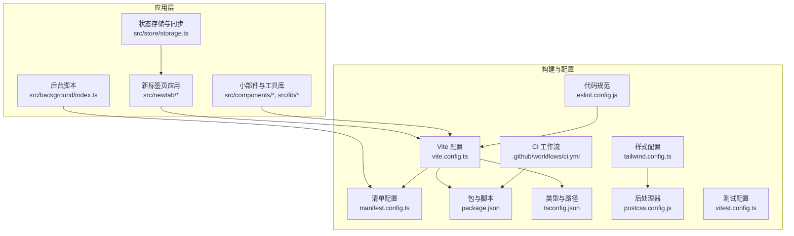
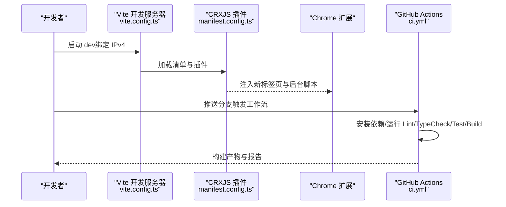
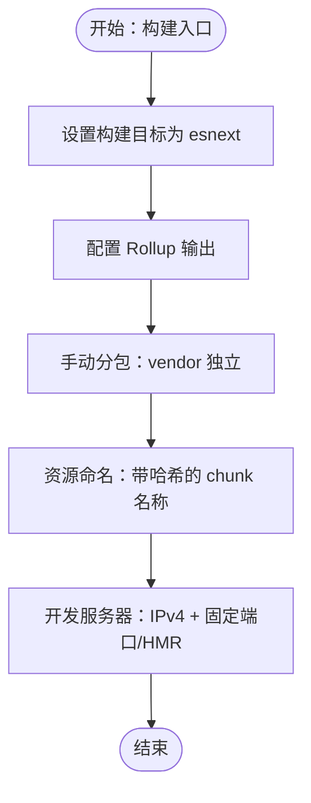
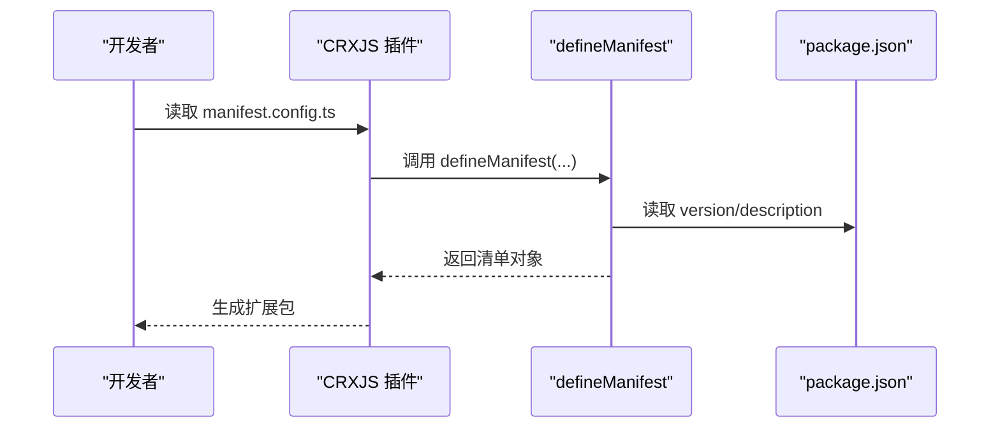
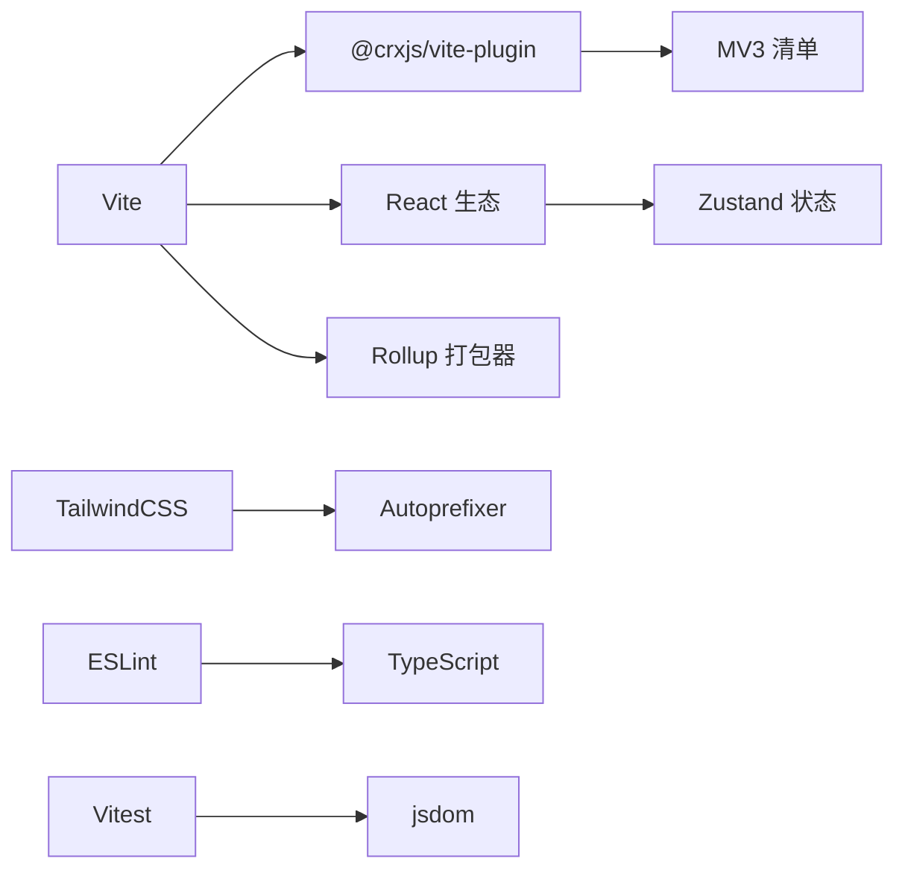

# 构建与优化

<cite>
**本文引用的文件**
- [vite.config.ts](file://vite.config.ts)
- [manifest.config.ts](file://manifest.config.ts)
- [package.json](file://package.json)
- [tailwind.config.ts](file://tailwind.config.ts)
- [.github/workflows/ci.yml](file://.github/workflows/ci.yml)
- [eslint.config.js](file://eslint.config.js)
- [tsconfig.json](file://tsconfig.json)
- [vitest.config.ts](file://vitest.config.ts)
- [src/newtab/main.tsx](file://src/newtab/main.tsx)
- [src/background/index.ts](file://src/background/index.ts)
- [src/store/storage.ts](file://src/store/storage.ts)
- [src/lib/wallpaperCache.ts](file://src/lib/wallpaperCache.ts)
- [src/lib/wallpapers.ts](file://src/lib/wallpapers.ts)
- [src/components/widgets/Weather/useWeather.ts](file://src/components/widgets/Weather/useWeather.ts)
</cite>

## 目录

1. [简介](#简介)
2. [项目结构](#项目结构)
3. [核心组件](#核心组件)
4. [架构总览](#架构总览)
5. [详细组件分析](#详细组件分析)
6. [依赖关系分析](#依赖关系分析)
7. [性能考量](#性能考量)
8. [故障排查指南](#故障排查指南)
9. [结论](#结论)
10. [附录](#附录)

## 简介

本指南面向 Chrome MV3 新标签页扩展的构建与性能优化，围绕 Vite 构建配置、CRXJS 插件集成、生产构建优化、清单文件与版本管理、CI/CD 自动化、性能监控与分析、缓存与资源优化、以及常见构建问题诊断等方面进行系统性说明。文档以仓库现有配置为依据，结合代码实现细节，提供可操作的建议与最佳实践。

## 项目结构

该仓库采用前端工程化的模块化组织方式：React 应用位于新标签页入口，后台逻辑通过 MV3 Service Worker 提供；状态持久化与跨页面同步通过 Chrome Storage 实现；UI 框架与样式由 TailwindCSS 驱动；构建与开发服务器由 Vite 提供；CRXJS 插件负责将产物打包为可安装的扩展包。

图表来源

- [vite.config.ts:1-46](file://vite.config.ts#L1-L46)
- [manifest.config.ts:1-38](file://manifest.config.ts#L1-L38)
- [package.json:1-56](file://package.json#L1-L56)
- [tsconfig.json:1-27](file://tsconfig.json#L1-L27)
- [tailwind.config.ts:1-42](file://tailwind.config.ts#L1-L42)
- [postcss.config.js:1-7](file://postcss.config.js#L1-L7)
- [eslint.config.js:1-22](file://eslint.config.js#L1-L22)
- [vitest.config.ts:1-16](file://vitest.config.ts#L1-L16)
- [ci.yml:1-33](file://.github/workflows/ci.yml#L1-L33)

章节来源

- [vite.config.ts:1-46](file://vite.config.ts#L1-L46)
- [manifest.config.ts:1-38](file://manifest.config.ts#L1-L38)
- [package.json:1-56](file://package.json#L1-L56)
- [tsconfig.json:1-27](file://tsconfig.json#L1-L27)
- [tailwind.config.ts:1-42](file://tailwind.config.ts#L1-L42)
- [postcss.config.js:1-7](file://postcss.config.js#L1-L7)
- [eslint.config.js:1-22](file://eslint.config.js#L1-L22)
- [vitest.config.ts:1-16](file://vitest.config.ts#L1-L16)
- [.github/workflows/ci.yml:1-33](file://.github/workflows/ci.yml#L1-L33)

## 核心组件

- 构建与开发服务器
  - Vite 配置启用 React 插件与 CRXJS 插件，设置别名、目标与 Rollup 输出策略，开发服务器绑定 IPv4 地址以提升兼容性。
  - 参考路径：[vite.config.ts:1-46](file://vite.config.ts#L1-L46)
- 清单与版本管理
  - 使用 CRXJS 的 defineManifest 定义 MV3 清单，从 package.json 注入版本与描述，声明新标签页覆盖、后台脚本、图标与权限/主机权限。
  - 参考路径：[manifest.config.ts:1-38](file://manifest.config.ts#L1-L38)，[package.json:1-56](file://package.json#L1-L56)
- 样式与工具链
  - Tailwind 配置基于内容扫描范围与主题变量映射；PostCSS 启用 Tailwind 与 Autoprefixer；TS 配置严格模式与路径别名。
  - 参考路径：[tailwind.config.ts:1-42](file://tailwind.config.ts#L1-L42)，[postcss.config.js:1-7](file://postcss.config.js#L1-L7)，[tsconfig.json:1-27](file://tsconfig.json#L1-L27)
- 质量与测试
  - ESLint 规则集与 React Hooks/Refresh 插件；Vitest 配置 jsdom 环境与全局 setup 文件。
  - 参考路径：[eslint.config.js:1-22](file://eslint.config.js#L1-L22)，[vitest.config.ts:1-16](file://vitest.config.ts#L1-L16)
- CI/CD
  - GitHub Actions 在 Ubuntu 上安装 Node 22，执行安装、Lint、类型检查、测试与构建。
  - 参考路径：[ci.yml:1-33](file://.github/workflows/ci.yml#L1-L33)

章节来源

- [vite.config.ts:1-46](file://vite.config.ts#L1-L46)
- [manifest.config.ts:1-38](file://manifest.config.ts#L1-L38)
- [package.json:1-56](file://package.json#L1-L56)
- [tailwind.config.ts:1-42](file://tailwind.config.ts#L1-L42)
- [postcss.config.js:1-7](file://postcss.config.js#L1-L7)
- [eslint.config.js:1-22](file://eslint.config.js#L1-L22)
- [vitest.config.ts:1-16](file://vitest.config.ts#L1-L16)
- [.github/workflows/ci.yml:1-33](file://.github/workflows/ci.yml#L1-L33)

## 架构总览

下图展示从开发到生产的端到端流程，涵盖 Vite 开发服务器、CRXJS 插件、MV3 清单与后台脚本、以及 CI/CD 流水线。

图表来源

- [vite.config.ts:34-44](file://vite.config.ts#L34-L44)
- [manifest.config.ts:4-37](file://manifest.config.ts#L4-L37)
- [ci.yml:10-32](file://.github/workflows/ci.yml#L10-L32)

## 详细组件分析

### Vite 构建配置与优化

- 插件与别名
  - 启用 @vitejs/plugin-react 与 @crxjs/vite-plugin；路径别名 @ 指向 src，便于统一导入。
  - 参考路径：[vite.config.ts:1-13](file://vite.config.ts#L1-L13)
- 目标与输出
  - 目标设为 esnext；Rollup 输出策略：
    - 动态分包：将 react、react-dom、zustand、scheduler 独立拆分为 vendor 分包，降低新标签页入口包体变更频率。
    - 入口资源命名：chunkFileNames 使用哈希命名，利于浏览器缓存与长缓存策略。
  - 参考路径：[vite.config.ts:14-33](file://vite.config.ts#L14-L33)
- 开发服务器
  - 绑定 127.0.0.1，固定端口与 HMR 端口，确保 CRXJS 开发模式稳定访问。
  - 参考路径：[vite.config.ts:34-44](file://vite.config.ts#L34-L44)

图表来源

- [vite.config.ts:14-44](file://vite.config.ts#L14-L44)

章节来源

- [vite.config.ts:1-46](file://vite.config.ts#L1-L46)

### CRXJS 插件与清单配置

- 清单生成
  - 使用 defineManifest 定义 MV3 清单，从 package.json 注入版本与描述；声明新标签页覆盖、后台脚本（模块类型）、图标与权限/主机权限。
  - 参考路径：[manifest.config.ts:1-38](file://manifest.config.ts#L1-L38)，[package.json:1-56](file://package.json#L1-L56)
- 版本管理
  - 版本号来自 package.json 的 version 字段，确保构建产物与发布版本一致。
  - 参考路径：[manifest.config.ts:7](file://manifest.config.ts#L7)，[package.json:4](file://package.json#L4)

图表来源

- [manifest.config.ts:1-38](file://manifest.config.ts#L1-L38)
- [package.json:1-56](file://package.json#L1-L56)

章节来源

- [manifest.config.ts:1-38](file://manifest.config.ts#L1-L38)
- [package.json:1-56](file://package.json#L1-L56)

### 生产构建优化策略

- 代码分割与缓存
  - 将 react、react-dom、zustand、scheduler 独立为 vendor 分包，避免业务代码更新导致入口包哈希变化，提升长期缓存命中率。
  - 参考路径：[vite.config.ts:19-29](file://vite.config.ts#L19-L29)
- 资源命名与指纹
  - 使用哈希命名 chunk 文件，便于浏览器缓存与 CDN 缓存策略。
  - 参考路径：[vite.config.ts:18](file://vite.config.ts#L18)
- 类型与路径一致性
  - TS 严格模式与路径别名与 Vite 别名保持一致，减少构建期解析成本与潜在错误。
  - 参考路径：[tsconfig.json:21-23](file://tsconfig.json#L21-L23)，[vite.config.ts:10-12](file://vite.config.ts#L10-L12)

章节来源

- [vite.config.ts:14-33](file://vite.config.ts#L14-L33)
- [tsconfig.json:1-27](file://tsconfig.json#L1-L27)

### CI/CD 流程与自动化

- 工作流步骤
  - 检出代码 → 设置 Node 22 → 缓存 npm 依赖 → 运行 Lint/TypeCheck/Test → 构建产物。
- 最佳实践建议
  - 引入构建产物归档与发布步骤（如使用 GitHub Releases 或扩展商店发布通道）。
  - 对大型依赖或第三方 API 请求增加超时与重试策略，避免流水线波动。
- 参考路径：[ci.yml:1-33](file://.github/workflows/ci.yml#L1-L33)

章节来源

- [.github/workflows/ci.yml:1-33](file://.github/workflows/ci.yml#L1-L33)

### 性能监控与分析

- 前端性能
  - 使用浏览器开发者工具的 Performance 面板记录首屏渲染、交互延迟与内存占用；关注入口包大小与分包命中情况。
  - 结合网络面板观察资源加载时间与缓存命中率。
- 业务层性能
  - 天气小部件采用“缓存优先 + 后台刷新”的策略，减少重复请求与抖动。
  - 参考路径：[useWeather.ts:131-192](file://src/components/widgets/Weather/useWeather.ts#L131-L192)
- 存储与缓存
  - 使用 IndexedDB 实现壁纸二进制缓存，命中时返回 object URL，未命中时异步回写，保证加载体验。
  - 参考路径：[wallpaperCache.ts:1-94](file://src/lib/wallpaperCache.ts#L1-L94)
- 主题与样式
  - Tailwind 主题变量与暗色模式配合，减少运行时样式计算开销。
  - 参考路径：[tailwind.config.ts:6-38](file://tailwind.config.ts#L6-L38)

章节来源

- [useWeather.ts:131-192](file://src/components/widgets/Weather/useWeather.ts#L131-L192)
- [wallpaperCache.ts:1-94](file://src/lib/wallpaperCache.ts#L1-L94)
- [tailwind.config.ts:1-42](file://tailwind.config.ts#L1-L42)

### 缓存策略与资源优化

- 前端缓存
  - 壁纸缓存：IndexedDB 存储 Blob，命中即返回 object URL；缺失时异步拉取并回写。
  - 天气缓存：本地缓存条目含时间戳，采用“新鲜期内直接显示，后台刷新”策略。
  - 参考路径：[wallpaperCache.ts:75-94](file://src/lib/wallpaperCache.ts#L75-L94)，[useWeather.ts:140-174](file://src/components/widgets/Weather/useWeather.ts#L140-L174)
- 存储同步
  - 通过 chrome.storage.onChanged 订阅本地存储变更，多页面保持状态同步。
  - 参考路径：[storage.ts:53-62](file://src/store/storage.ts#L53-L62)
- 资源预设
  - 默认与预设壁纸 URL 采用图片服务参数优化尺寸与质量，降低带宽与解码成本。
  - 参考路径：[wallpapers.ts:1-69](file://src/lib/wallpapers.ts#L1-L69)

章节来源

- [wallpaperCache.ts:1-94](file://src/lib/wallpaperCache.ts#L1-L94)
- [storage.ts:1-63](file://src/store/storage.ts#L1-L63)
- [wallpapers.ts:1-69](file://src/lib/wallpapers.ts#L1-L69)

### 构建问题诊断与解决方案

- 开发服务器无法访问
  - 症状：扩展无法连接到本地开发服务器。
  - 原因：默认 localhost 可能解析为 IPv6，导致扩展无法访问。
  - 解决：将 server.host 设为 127.0.0.1，确保仅监听 IPv4。
  - 参考路径：[vite.config.ts:34-44](file://vite.config.ts#L34-L44)
- 分包未生效或缓存不命中
  - 症状：业务代码更新导致入口包哈希变化。
  - 解决：确认 manualChunks 规则匹配 react、react-dom、zustand、scheduler 路径；确保生产构建开启压缩与哈希命名。
  - 参考路径：[vite.config.ts:19-29](file://vite.config.ts#L19-L29)，[vite.config.ts:18](file://vite.config.ts#L18)
- 清单版本不一致
  - 症状：安装后版本与预期不符。
  - 解决：确保 manifest.config.ts 中 version 来自 package.json 的 version 字段。
  - 参考路径：[manifest.config.ts:7](file://manifest.config.ts#L7)，[package.json:4](file://package.json#L4)
- CI 构建失败
  - 症状：Lint/类型检查/测试/构建任一步骤失败。
  - 解决：在本地复现对应命令，修复问题后再次推送；必要时在 CI 中添加更详细的日志与缓存清理。
  - 参考路径：[ci.yml:20-32](file://.github/workflows/ci.yml#L20-L32)

章节来源

- [vite.config.ts:34-44](file://vite.config.ts#L34-L44)
- [vite.config.ts:18-29](file://vite.config.ts#L18-L29)
- [manifest.config.ts:7](file://manifest.config.ts#L7)
- [package.json:4](file://package.json#L4)
- [.github/workflows/ci.yml:20-32](file://.github/workflows/ci.yml#L20-L32)

## 依赖关系分析

- 构建与运行时依赖
  - Vite 与 CRXJS 插件负责开发与打包；React 生态与 Zustand 状态管理驱动应用；TailwindCSS 提供样式基础。
  - 参考路径：[package.json:18-26](file://package.json#L18-L26)，[package.json:32-54](file://package.json#L32-L54)
- 类型与路径
  - TS 配置中 types 包含 chrome、vite/client、node，确保类型安全；路径别名与 Vite 保持一致。
  - 参考路径：[tsconfig.json:19](file://tsconfig.json#L19)，[tsconfig.json:21-23](file://tsconfig.json#L21-L23)，[vite.config.ts:10-12](file://vite.config.ts#L10-L12)
- 测试与规范
  - Vitest 使用 jsdom 环境；ESLint 集成 TypeScript ESLint 与 React Hooks/Refresh 规则。
  - 参考路径：[vitest.config.ts:10-14](file://vitest.config.ts#L10-L14)，[eslint.config.js:6-21](file://eslint.config.js#L6-L21)

图表来源

- [package.json:18-54](file://package.json#L18-L54)
- [tsconfig.json:19-23](file://tsconfig.json#L19-L23)
- [tailwind.config.ts:1-42](file://tailwind.config.ts#L1-L42)
- [postcss.config.js:1-7](file://postcss.config.js#L1-L7)
- [eslint.config.js:1-22](file://eslint.config.js#L1-L22)
- [vitest.config.ts:1-16](file://vitest.config.ts#L1-L16)

章节来源

- [package.json:1-56](file://package.json#L1-L56)
- [tsconfig.json:1-27](file://tsconfig.json#L1-L27)
- [tailwind.config.ts:1-42](file://tailwind.config.ts#L1-L42)
- [postcss.config.js:1-7](file://postcss.config.js#L1-L7)
- [eslint.config.js:1-22](file://eslint.config.js#L1-L22)
- [vitest.config.ts:1-16](file://vitest.config.ts#L1-L16)

## 性能考量

- 构建层面
  - 使用 esnext 目标与现代打包策略，结合手动分包与哈希命名，提升缓存命中与二次加载速度。
  - 参考路径：[vite.config.ts:15](file://vite.config.ts#L15)，[vite.config.ts:18-29](file://vite.config.ts#L18-L29)
- 运行时层面
  - 壁纸与天气等资源采用缓存与懒加载策略，减少网络与解码开销。
  - 参考路径：[wallpaperCache.ts:75-94](file://src/lib/wallpaperCache.ts#L75-L94)，[useWeather.ts:140-174](file://src/components/widgets/Weather/useWeather.ts#L140-L174)
- 样式与主题
  - Tailwind 主题变量与暗色模式减少运行时样式计算，提升渲染效率。
  - 参考路径：[tailwind.config.ts:6-38](file://tailwind.config.ts#L6-L38)

## 故障排查指南

- 开发阶段
  - 若扩展无法加载：检查 server.host 是否为 127.0.0.1，确认端口与 HMR 配置一致。
  - 参考路径：[vite.config.ts:34-44](file://vite.config.ts#L34-L44)
- 构建阶段
  - 若分包异常：核对 manualChunks 规则是否覆盖 react、react-dom、zustand、scheduler。
  - 参考路径：[vite.config.ts:19-29](file://vite.config.ts#L19-L29)
- 清单与版本
  - 若版本不一致：确认 manifest.config.ts 的 version 来自 package.json。
  - 参考路径：[manifest.config.ts:7](file://manifest.config.ts#L7)，[package.json:4](file://package.json#L4)
- CI 阶段
  - 若流水线不稳定：在本地复现命令，定位具体环节（Lint/TypeCheck/Test/Build），必要时增加日志与缓存清理。
  - 参考路径：[ci.yml:20-32](file://.github/workflows/ci.yml#L20-L32)

章节来源

- [vite.config.ts:34-44](file://vite.config.ts#L34-L44)
- [vite.config.ts:19-29](file://vite.config.ts#L19-L29)
- [manifest.config.ts:7](file://manifest.config.ts#L7)
- [package.json:4](file://package.json#L4)
- [.github/workflows/ci.yml:20-32](file://.github/workflows/ci.yml#L20-L32)

## 结论

本指南基于仓库现有配置与实现，总结了 Vite 构建、CRXJS 插件、MV3 清单与版本管理、CI/CD 自动化、性能优化与缓存策略的关键要点。建议在后续迭代中持续关注分包命中率、缓存策略有效性与 CI 稳定性，并结合浏览器性能工具进行端到端验证。

## 附录

- 关键入口与初始化
  - 新标签页应用入口在 src/newtab/main.tsx，启动时完成状态水合、远程同步、主题初始化与根节点挂载。
  - 参考路径：[main.tsx:11-29](file://src/newtab/main.tsx#L11-L29)
- 后台脚本职责
  - src/background/index.ts 提供 MV3 Service Worker，处理外部 API 请求与消息通信，避免新标签页页面的跨域与 Cookie 限制。
  - 参考路径：[background/index.ts:132-174](file://src/background/index.ts#L132-L174)

章节来源

- [src/newtab/main.tsx:11-29](file://src/newtab/main.tsx#L11-L29)
- [src/background/index.ts:132-174](file://src/background/index.ts#L132-L174)
