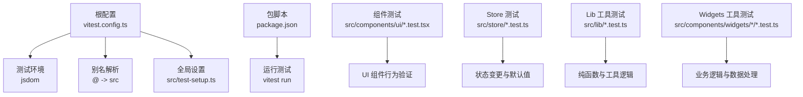
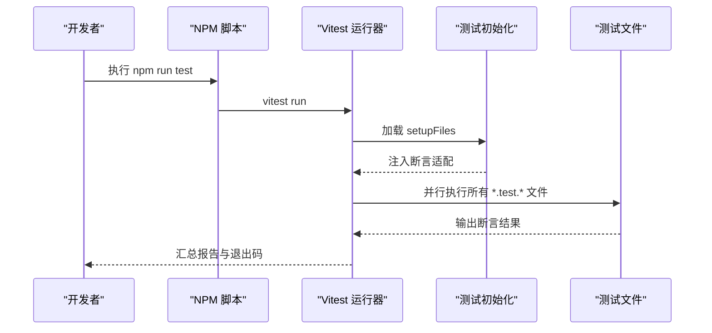
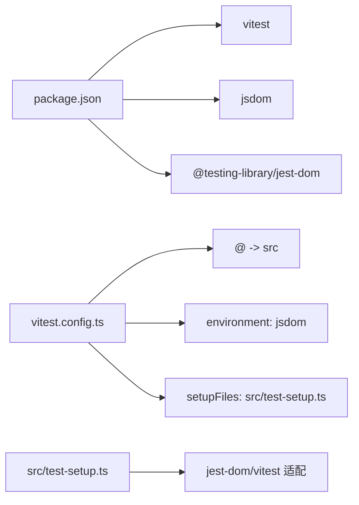

# 测试策略与实践

<cite>
**本文引用的文件**
- [vitest.config.ts](file://vitest.config.ts)
- [package.json](file://package.json)
- [src/test-setup.ts](file://src/test-setup.ts)
- [src/components/ui/Button.test.tsx](file://src/components/ui/Button.test.tsx)
- [src/store/useLayoutStore.test.ts](file://src/store/useLayoutStore.test.ts)
- [src/lib/search.test.ts](file://src/lib/search.test.ts)
- [src/components/widgets/Shortcuts/faviconFetcher.test.ts](file://src/components/widgets/Shortcuts/faviconFetcher.test.ts)
- [src/components/widgets/Shortcuts/useOpenTabs.test.ts](file://src/components/widgets/Shortcuts/useOpenTabs.test.ts)
- [src/lib/wallpaperTint.test.ts](file://src/lib/wallpaperTint.test.ts)
- [src/store/useSettingsStore.test.ts](file://src/store/useSettingsStore.test.ts)
- [src/store/useShortcutsStore.test.ts](file://src/store/useShortcutsStore.test.ts)
- [src/store/useTodoStore.test.ts](file://src/store/useTodoStore.test.ts)
</cite>

## 目录

1. [引言](#引言)
2. [项目结构](#项目结构)
3. [核心组件](#核心组件)
4. [架构总览](#架构总览)
5. [详细组件分析](#详细组件分析)
6. [依赖分析](#依赖分析)
7. [性能考量](#性能考量)
8. [故障排查指南](#故障排查指南)
9. [结论](#结论)
10. [附录](#附录)

## 引言

本文件面向开发与测试团队，系统化阐述本项目的测试策略与实践，涵盖 Vitest 配置与使用、单元测试编写规范与最佳实践、组件测试、Hook/Store 测试示例、测试环境与模拟数据、覆盖率与报告、集成与端到端测试策略，以及调试技巧与常见问题解决。目标是帮助新成员快速上手，同时为持续改进测试质量提供参考。

## 项目结构

本项目采用基于功能模块的组织方式，测试文件与被测代码一一对应或按领域分层（如 store、lib、widgets）。Vitest 作为测试运行器，通过 jsdom 环境支持 DOM API；全局安装了 @testing-library/jest-dom 的适配，便于断言 DOM 属性与可访问性角色。

图表来源

- [vitest.config.ts:1-16](file://vitest.config.ts#L1-L16)
- [src/test-setup.ts:1-2](file://src/test-setup.ts#L1-L2)
- [package.json:10-17](file://package.json#L10-L17)

章节来源

- [vitest.config.ts:1-16](file://vitest.config.ts#L1-L16)
- [src/test-setup.ts:1-2](file://src/test-setup.ts#L1-L2)
- [package.json:10-17](file://package.json#L10-L17)

## 核心组件

- 测试运行器与环境：Vitest 在 jsdom 中运行，具备全局断言能力，并通过 setupFiles 注入测试辅助。
- 断言库：结合 @testing-library/jest-dom 提供 DOM 能力断言（如元素存在、禁用状态、属性等）。
- 别名与路径：通过别名 @ 指向 src，简化导入路径，提升可维护性。
- 命令与脚本：通过 npm scripts 调用 vitest run 执行测试。

章节来源

- [vitest.config.ts:1-16](file://vitest.config.ts#L1-L16)
- [src/test-setup.ts:1-2](file://src/test-setup.ts#L1-L2)
- [package.json:10-17](file://package.json#L10-L17)

## 架构总览

下图展示了测试执行的关键流程：从命令行触发到 Vitest 初始化、加载 setup 文件、运行各测试文件并输出结果。

图表来源

- [package.json:16](file://package.json#L16)
- [vitest.config.ts:10-14](file://vitest.config.ts#L10-L14)
- [src/test-setup.ts:1-2](file://src/test-setup.ts#L1-L2)

## 详细组件分析

### 组件测试：Button

- 关注点：渲染子文本、变体样式类、尺寸类、合并自定义类名、禁用态、透传原生属性。
- 断言要点：使用 role 为按钮进行查询；通过类名包含关系验证样式；对禁用与属性进行断言。
- 最佳实践：优先使用语义化角色查询；避免过度依赖具体类名；对可访问性属性进行显式断言。

章节来源

- [src/components/ui/Button.test.tsx:1-66](file://src/components/ui/Button.test.tsx#L1-L66)

### Store 测试：useLayoutStore

- 关注点：默认布局与启用项、替换布局数组、切换部件显示、重置恢复默认。
- 断言要点：长度、包含关系、状态一致性；确保副作用最小化，仅断言公开接口行为。
- 最佳实践：在 beforeEach 中重置状态；以行为驱动命名测试；覆盖边界条件（空数组、重复操作）。

章节来源

- [src/store/useLayoutStore.test.ts:1-57](file://src/store/useLayoutStore.test.ts#L1-L57)

### Store 测试：useSettingsStore

- 关注点：默认值集合、主题切换、搜索引擎设置、壁纸与色调、编辑模式与动效设置。
- 断言要点：边界值校验（如壁纸亮度在 0-0.6 范围内钳制）；布尔开关的往返切换。
- 最佳实践：集中 reset 方法，统一在 beforeEach 中调用；对数值范围进行边界测试。

章节来源

- [src/store/useSettingsStore.test.ts:1-90](file://src/store/useSettingsStore.test.ts#L1-L90)

### Store 测试：useShortcutsStore

- 关注点：默认快捷方式列表、新增、更新、删除、重排。
- 断言要点：新增后追加至末尾；更新对现有项生效；删除后不再存在；重排替换整段数组。
- 最佳实践：使用稳定默认集合作为基线；对不存在 ID 的操作进行无害性断言。

章节来源

- [src/store/useShortcutsStore.test.ts:1-69](file://src/store/useShortcutsStore.test.ts#L1-L69)

### Store 测试：useTodoStore

- 关注点：添加任务（去空白、前置插入）、切换完成状态、删除、清理已完成。
- 断言要点：时间戳与 ID 存在；前置插入顺序；清理只移除已完成项。
- 最佳实践：利用添加顺序推导预期索引；对空状态与异常输入进行健壮性断言。

章节来源

- [src/store/useTodoStore.test.ts:1-84](file://src/store/useTodoStore.test.ts#L1-L84)

### Lib 工具测试：search

- 关注点：搜索引擎枚举完整性、URL 编码、建议请求返回空数组的边界、解析器与 JSONP 解包。
- 断言要点：引擎字段完整性；编码字符集；AbortSignal 场景；不同格式的解析器健壮性。
- 最佳实践：针对不同引擎差异编写针对性用例；对异常输入与空数据进行兜底断言。

章节来源

- [src/lib/search.test.ts:1-99](file://src/lib/search.test.ts#L1-L99)

### Lib 工具测试：wallpaperTint

- 关注点：异步提取壁纸色调、缓存去重与 Promise 复用。
- 断言要点：返回 Promise 实例；相同 URL 返回同一 in-flight Promise；不同 URL 返回不同 Promise。
- 最佳实践：关注并发场景下的缓存一致性；对异步行为进行时序与引用断言。

章节来源

- [src/lib/wallpaperTint.test.ts:1-29](file://src/lib/wallpaperTint.test.ts#L1-L29)

### Widgets 工具测试：faviconFetcher

- 关注点：Favicon URL 生成、初始字符、颜色生成、多源 URL 构造。
- 断言要点：域名提取、ip3 与 .ico 后缀、Google s2 参数、chrome://favicon2 编码。
- 最佳实践：对无效输入返回空结果；对合法输入的三路源进行逐一断言。

章节来源

- [src/components/widgets/Shortcuts/faviconFetcher.test.ts:1-82](file://src/components/widgets/Shortcuts/faviconFetcher.test.ts#L1-L82)

### Widgets 工具测试：useOpenTabs

- 关注点：URL 规范化、可用标签过滤、去重（按规范 URL 与标题长度）、构建开放标签、按窗口分组。
- 断言要点：内部协议拒绝、负 ID 拒绝、尾斜杠变体视为相同、当前窗口优先、chrome://favicon 掉落。
- 最佳实践：构造贴近真实 chrome.tabs.Tab 的样例；对 tie-break 规则进行显式断言。

章节来源

- [src/components/widgets/Shortcuts/useOpenTabs.test.ts:1-153](file://src/components/widgets/Shortcuts/useOpenTabs.test.ts#L1-L153)

## 依赖分析

- 测试运行器：Vitest
- DOM 环境：jsdom
- 断言扩展：@testing-library/jest-dom
- React 渲染：@testing-library/react（由 jest-dom 的 vitest 适配间接提供）
- 别名解析：Vitest resolve.alias 将 @ 指向 src
- 全局注入：setupFiles 指向 src/test-setup.ts，用于注册断言适配

图表来源

- [package.json:32-53](file://package.json#L32-L53)
- [vitest.config.ts:4-14](file://vitest.config.ts#L4-L14)
- [src/test-setup.ts:1-2](file://src/test-setup.ts#L1-L2)

章节来源

- [package.json:32-53](file://package.json#L32-L53)
- [vitest.config.ts:4-14](file://vitest.config.ts#L4-L14)
- [src/test-setup.ts:1-2](file://src/test-setup.ts#L1-L2)

## 性能考量

- 测试并行：Vitest 默认并行执行测试文件，减少整体耗时。
- 轻量断言：优先使用语义化查询与可访问性断言，避免昂贵的 DOM 结构比对。
- 状态隔离：在 beforeEach 中重置 Store 状态，避免跨用例污染。
- 异步断言：对 Promise 行为进行引用相等性断言，减少不必要的等待与重试。
- 覆盖率：建议在 CI 中开启覆盖率统计，聚焦关键路径与分支。

## 故障排查指南

- 症状：测试中无法找到元素或断言失败
  - 排查：确认是否使用 role 查询；检查类名拼写与包含关系；核对 props 是否正确透传。
  - 参考：组件测试中的角色查询与属性断言实践。
- 症状：Store 测试间相互影响
  - 排查：确认是否在 beforeEach 中重置状态；避免在测试间共享可变状态。
  - 参考：Store 测试的 beforeEach 重置模式。
- 症状：异步行为不稳定
  - 排查：对 Promise 引用进行断言；避免在测试中直接等待外部资源。
  - 参考：wallpaperTint 的 Promise 缓存与复用断言。
- 症状：URL 处理不一致
  - 排查：核对 normalize 与编码逻辑；对边界输入（空字符串、大小写、特殊字符）进行断言。
  - 参考：useOpenTabs 与 faviconFetcher 的 URL 处理测试。

章节来源

- [src/components/ui/Button.test.tsx:1-66](file://src/components/ui/Button.test.tsx#L1-L66)
- [src/store/useLayoutStore.test.ts:16-18](file://src/store/useLayoutStore.test.ts#L16-L18)
- [src/lib/wallpaperTint.test.ts:14-27](file://src/lib/wallpaperTint.test.ts#L14-L27)
- [src/components/widgets/Shortcuts/useOpenTabs.test.ts:23-44](file://src/components/widgets/Shortcuts/useOpenTabs.test.ts#L23-L44)
- [src/components/widgets/Shortcuts/faviconFetcher.test.ts:4-20](file://src/components/widgets/Shortcuts/faviconFetcher.test.ts#L4-L20)

## 结论

本项目已建立完善的前端测试体系：以 Vitest 为核心，配合 jsdom 与 @testing-library/jest-dom，覆盖组件、Store、工具函数与业务逻辑。通过明确的断言策略、状态隔离与异步行为验证，保证了关键功能的稳定性。建议在现有基础上进一步引入覆盖率与报告生成，并规划集成与端到端测试策略，以实现更全面的质量保障。

## 附录

### 测试配置与使用指南

- 运行测试：通过 npm run test 执行 Vitest。
- 环境与别名：Vitest 在 jsdom 中运行，别名 @ 指向 src；全局断言适配由 setupFiles 注入。
- 断言风格：优先使用语义化角色查询与可访问性断言，避免脆弱的选择器与类名耦合。

章节来源

- [package.json:16](file://package.json#L16)
- [vitest.config.ts:10-14](file://vitest.config.ts#L10-L14)
- [src/test-setup.ts:1-2](file://src/test-setup.ts#L1-L2)

### 单元测试编写规范与最佳实践

- 命名：以行为或场景为中心，清晰表达期望。
- 结构：先 setup（必要时），再执行，最后断言；避免在测试间共享可变状态。
- 断言：使用语义化查询与可访问性断言；对边界值与异常输入进行覆盖。
- 异步：对 Promise 进行引用相等性断言；避免对不可控外部资源做强等待。

### 组件测试示例

- Button：验证变体、尺寸、禁用与属性透传。
- 参考：[src/components/ui/Button.test.tsx:1-66](file://src/components/ui/Button.test.tsx#L1-L66)

### Hook/Store 测试示例

- useLayoutStore：默认值、切换与重置。
- useSettingsStore：默认值、主题与壁纸设置、编辑模式与动效。
- useShortcutsStore：增删改与重排。
- useTodoStore：添加、切换、删除与清理。
- 参考：
  - [src/store/useLayoutStore.test.ts:1-57](file://src/store/useLayoutStore.test.ts#L1-L57)
  - [src/store/useSettingsStore.test.ts:1-90](file://src/store/useSettingsStore.test.ts#L1-L90)
  - [src/store/useShortcutsStore.test.ts:1-69](file://src/store/useShortcutsStore.test.ts#L1-L69)
  - [src/store/useTodoStore.test.ts:1-84](file://src/store/useTodoStore.test.ts#L1-L84)

### 工具函数测试示例

- search：引擎枚举、编码、建议返回与解析器。
- wallpaperTint：异步提取与缓存去重。
- faviconFetcher：Favicon URL 生成与颜色计算。
- useOpenTabs：URL 规范化、去重与分组。
- 参考：
  - [src/lib/search.test.ts:1-99](file://src/lib/search.test.ts#L1-L99)
  - [src/lib/wallpaperTint.test.ts:1-29](file://src/lib/wallpaperTint.test.ts#L1-L29)
  - [src/components/widgets/Shortcuts/faviconFetcher.test.ts:1-82](file://src/components/widgets/Shortcuts/faviconFetcher.test.ts#L1-L82)
  - [src/components/widgets/Shortcuts/useOpenTabs.test.ts:1-153](file://src/components/widgets/Shortcuts/useOpenTabs.test.ts#L1-L153)

### 测试环境与模拟数据

- 环境：jsdom 提供 DOM API；globals 开启全局断言。
- 设置：setupFiles 注入 jest-dom 适配。
- 模拟数据：Store 测试通过 beforeEach 重置；工具函数测试通过构造参数与返回值断言。
- 参考：
  - [vitest.config.ts:10-14](file://vitest.config.ts#L10-L14)
  - [src/test-setup.ts:1-2](file://src/test-setup.ts#L1-L2)

### 覆盖率与报告

- 建议：在 CI 中启用覆盖率统计，关注关键路径与分支；生成 HTML 报告以便本地审查。
- 当前仓库未包含覆盖率配置文件，请根据团队规范在 Vitest 中添加覆盖率选项。

### 集成测试与端到端测试策略

- 集成测试：验证组件与 Store 的交互、工具函数与外部 API 的协作；优先使用内存态或受控假数据。
- 端到端测试：在浏览器环境中验证用户完整工作流；建议使用独立的 e2e 测试套件与专用环境。
- 注意：本仓库未包含集成或端到端测试文件，建议后续补充。
