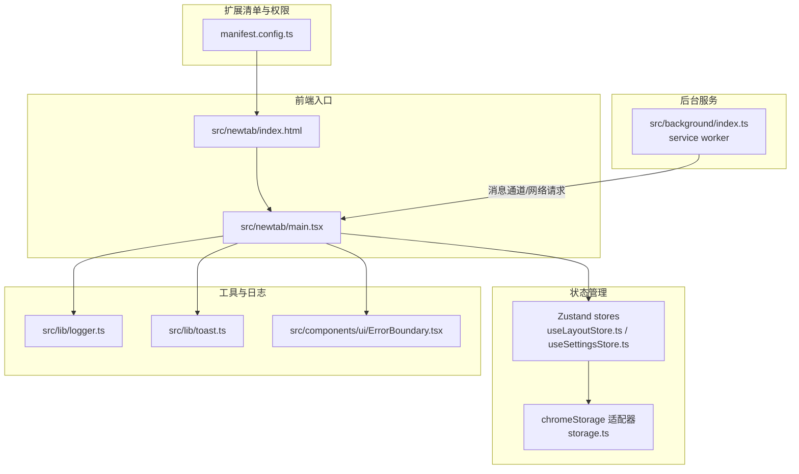
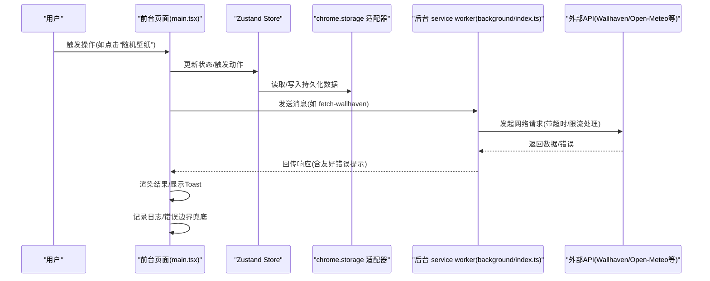
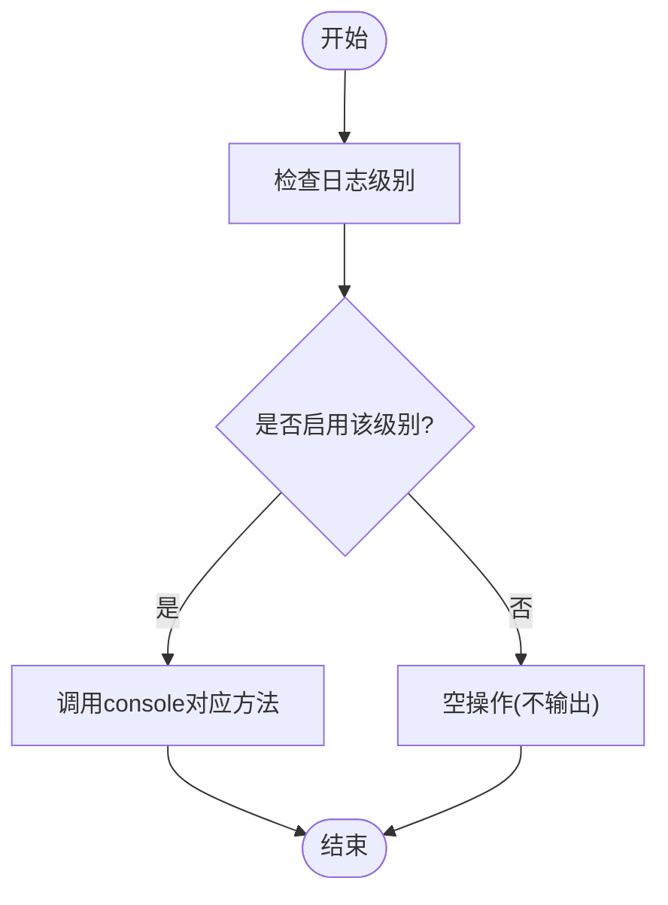
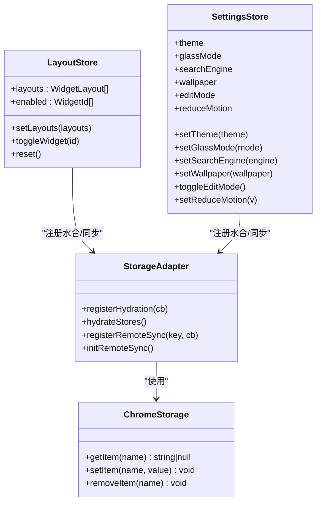
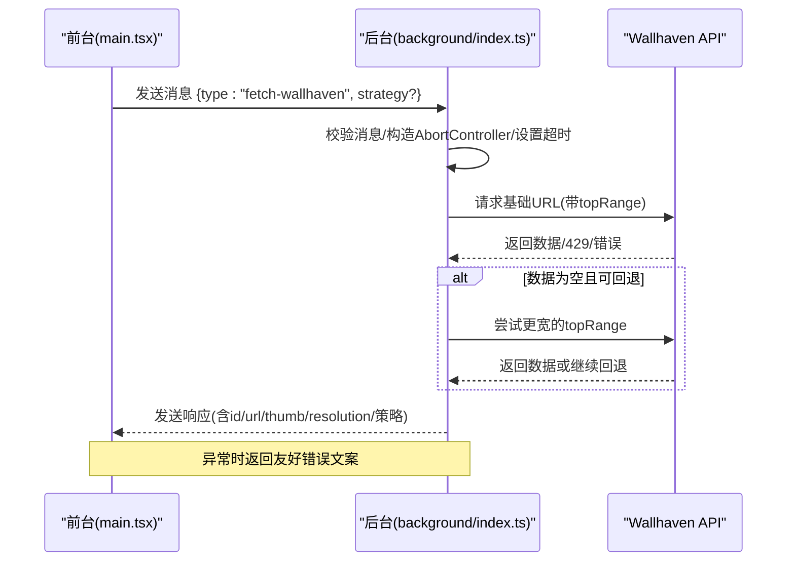
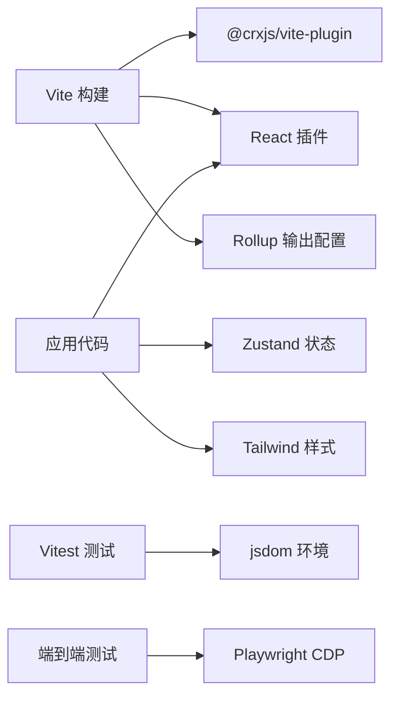

# 调试与开发工具

<cite>
**本文引用的文件**
- [README.md](file://README.md)
- [package.json](file://package.json)
- [vite.config.ts](file://vite.config.ts)
- [manifest.config.ts](file://manifest.config.ts)
- [src/background/index.ts](file://src/background/index.ts)
- [src/newtab/main.tsx](file://src/newtab/main.tsx)
- [src/lib/logger.ts](file://src/lib/logger.ts)
- [src/store/storage.ts](file://src/store/storage.ts)
- [src/store/useLayoutStore.ts](file://src/store/useLayoutStore.ts)
- [src/store/useSettingsStore.ts](file://src/store/useSettingsStore.ts)
- [src/components/ui/ErrorBoundary.tsx](file://src/components/ui/ErrorBoundary.tsx)
- [src/lib/toast.ts](file://src/lib/toast.ts)
- [vitest.config.ts](file://vitest.config.ts)
- [.agents/skills/testing-xtab-extension/SKILL.md](file://.agents/skills/testing-xtab-extension/SKILL.md)
</cite>

## 目录

1. [简介](#简介)
2. [项目结构](#项目结构)
3. [核心组件](#核心组件)
4. [架构总览](#架构总览)
5. [详细组件分析](#详细组件分析)
6. [依赖关系分析](#依赖关系分析)
7. [性能考量](#性能考量)
8. [故障排查指南](#故障排查指南)
9. [结论](#结论)
10. [附录](#附录)

## 简介

本指南面向Chrome扩展开发者，围绕本项目的实际代码与构建配置，系统讲解如何在开发与调试过程中高效使用浏览器开发者工具、React DevTools、Redux（Zustand）DevTools、日志与错误追踪、断点与条件断点、性能分析与内存泄漏检测、异步操作与Chrome API调试，以及常见问题的调试思路与解决方案。文档内容均基于仓库中现有源码与配置进行提炼，确保可操作性与可验证性。

## 项目结构

该项目为一个基于React + Vite + Manifest V3的Chrome新标签页扩展，采用模块化组织方式：入口HTML与React根节点位于newtab目录；UI组件与业务组件分层存放；状态管理使用Zustand并结合chrome.storage持久化；后台逻辑通过service worker处理需要跨域或同源限制的网络请求。

图表来源

- [manifest.config.ts:1-38](file://manifest.config.ts#L1-L38)
- [src/newtab/main.tsx:1-29](file://src/newtab/main.tsx#L1-L29)
- [src/store/storage.ts:1-63](file://src/store/storage.ts#L1-L63)
- [src/store/useLayoutStore.ts:1-58](file://src/store/useLayoutStore.ts#L1-L58)
- [src/store/useSettingsStore.ts:1-89](file://src/store/useSettingsStore.ts#L1-L89)
- [src/background/index.ts:1-174](file://src/background/index.ts#L1-L174)
- [src/lib/logger.ts:1-35](file://src/lib/logger.ts#L1-L35)
- [src/lib/toast.ts:1-10](file://src/lib/toast.ts#L1-L10)
- [src/components/ui/ErrorBoundary.tsx:1-48](file://src/components/ui/ErrorBoundary.tsx#L1-L48)

章节来源

- [README.md:54-68](file://README.md#L54-L68)
- [manifest.config.ts:1-38](file://manifest.config.ts#L1-L38)
- [vite.config.ts:1-46](file://vite.config.ts#L1-L46)

## 核心组件

- 日志与错误输出
  - 自定义logger模块提供分级日志能力，支持在开发环境开启debug/info/warn，在生产环境抑制低级别日志，error始终输出。可通过设置最小级别控制输出范围。
  - 错误边界捕获子组件渲染异常，记录堆栈信息并提供重试按钮，提升用户体验与可观测性。
  - Toast提供全局通知通道，便于在异步流程中反馈用户可见的信息。
- 状态管理与持久化
  - 使用Zustand配合persist中间件，结合chrome.storage.local适配器实现本地持久化与多页面同步。
  - 提供注册水合与远程变更监听机制，保证多标签页间状态一致性。
- 后台服务与消息通道
  - service worker负责处理需要同源或跨域限制的网络请求（如Wallhaven），并通过runtime消息通道与前台通信，返回结果或错误信息。
- 开发服务器与热更新
  - Vite配置启用CRX插件与热更新，绑定IPv4地址以确保扩展能稳定访问开发服务器。

章节来源

- [src/lib/logger.ts:1-35](file://src/lib/logger.ts#L1-L35)
- [src/components/ui/ErrorBoundary.tsx:1-48](file://src/components/ui/ErrorBoundary.tsx#L1-L48)
- [src/lib/toast.ts:1-10](file://src/lib/toast.ts#L1-L10)
- [src/store/storage.ts:1-63](file://src/store/storage.ts#L1-L63)
- [src/store/useLayoutStore.ts:1-58](file://src/store/useLayoutStore.ts#L1-L58)
- [src/store/useSettingsStore.ts:1-89](file://src/store/useSettingsStore.ts#L1-L89)
- [src/background/index.ts:1-174](file://src/background/index.ts#L1-L174)
- [vite.config.ts:1-46](file://vite.config.ts#L1-L46)

## 架构总览

下图展示从用户交互到数据流的端到端路径：前台React应用通过Zustand状态与chrome.storage交互；后台service worker处理外部API请求并通过消息通道返回结果；日志与错误边界贯穿全链路，保障可观测性与稳定性。

图表来源

- [src/newtab/main.tsx:1-29](file://src/newtab/main.tsx#L1-L29)
- [src/store/storage.ts:1-63](file://src/store/storage.ts#L1-L63)
- [src/store/useLayoutStore.ts:1-58](file://src/store/useLayoutStore.ts#L1-L58)
- [src/store/useSettingsStore.ts:1-89](file://src/store/useSettingsStore.ts#L1-L89)
- [src/background/index.ts:123-174](file://src/background/index.ts#L123-L174)
- [src/lib/logger.ts:1-35](file://src/lib/logger.ts#L1-L35)
- [src/components/ui/ErrorBoundary.tsx:1-48](file://src/components/ui/ErrorBoundary.tsx#L1-L48)

## 详细组件分析

### 组件A：日志与错误追踪

- 日志模块
  - 支持debug/info/warn/error四档级别，运行时根据最小级别动态启用对应方法。
  - error方法始终可用，适合不可忽略的异常与错误。
- 错误边界
  - 捕获子树渲染异常，记录错误与组件栈信息，提供重试入口。
- Toast通知
  - 全局回调式通知，便于在异步流程中向用户反馈状态变化。

图表来源

- [src/lib/logger.ts:16-25](file://src/lib/logger.ts#L16-L25)

章节来源

- [src/lib/logger.ts:1-35](file://src/lib/logger.ts#L1-L35)
- [src/components/ui/ErrorBoundary.tsx:1-48](file://src/components/ui/ErrorBoundary.tsx#L1-L48)
- [src/lib/toast.ts:1-10](file://src/lib/toast.ts#L1-L10)

### 组件B：状态管理与持久化（Zustand + chrome.storage）

- 存储适配器
  - 在非扩展环境下回退到localStorage，保证测试与非扩展环境可用。
  - 写入/删除时检查chrome.runtime.lastError，统一记录错误日志。
- 远程同步
  - 监听chrome.storage.onChanged事件，按key路由到对应store的rehydrate回调，实现多标签页同步。
- Store示例
  - 布局与设置Store均使用persist中间件，配置chromeStorage作为存储后端，并注册水合与远程同步回调。

图表来源

- [src/store/storage.ts:1-63](file://src/store/storage.ts#L1-L63)
- [src/store/useLayoutStore.ts:1-58](file://src/store/useLayoutStore.ts#L1-L58)
- [src/store/useSettingsStore.ts:1-89](file://src/store/useSettingsStore.ts#L1-L89)

章节来源

- [src/store/storage.ts:1-63](file://src/store/storage.ts#L1-L63)
- [src/store/useLayoutStore.ts:1-58](file://src/store/useLayoutStore.ts#L1-L58)
- [src/store/useSettingsStore.ts:1-89](file://src/store/useSettingsStore.ts#L1-L89)

### 组件C：后台服务与消息通道（Wallhaven抓取）

- 功能概述
  - 在MV3 service worker中实现Wallhaven图片抓取，避免前台页面的同源/CORS限制。
  - 提供消息类型校验、超时控制、速率限制与降级策略。
- 关键流程
  - 前台发送“fetch-wallhaven”消息，后台启动AbortController计时器。
  - 按策略尝试不同topRange，若首页为空则沿回退链扩大范围。
  - 返回友好错误文案或图片元数据，保持消息通道长期打开以支持异步响应。

图表来源

- [src/background/index.ts:123-174](file://src/background/index.ts#L123-L174)
- [src/background/index.ts:82-111](file://src/background/index.ts#L82-L111)
- [src/background/index.ts:65-74](file://src/background/index.ts#L65-L74)

章节来源

- [src/background/index.ts:1-174](file://src/background/index.ts#L1-L174)

### 组件D：开发服务器与热更新

- Vite配置要点
  - 使用@crxjs/vite-plugin集成CRX开发模式，自动注入manifest。
  - 主机绑定127.0.0.1与固定端口，避免IPv6导致的连接问题。
  - 通过manualChunks将React、Zustand等依赖拆分为独立vendor包，降低主包体积波动。

章节来源

- [vite.config.ts:1-46](file://vite.config.ts#L1-L46)

## 依赖关系分析

- 构建与打包
  - Vite + @crxjs/vite-plugin负责开发与打包；React插件提供组件热更新；Rollup输出配置优化chunk拆分。
- 运行时依赖
  - React生态与Zustand用于UI与状态；Tailwind用于样式；部分第三方库用于UI组件与图标。
- 开发与测试
  - Vitest + jsdom用于单元测试；Playwright CDP用于端到端场景（见技能文档）。

图表来源

- [vite.config.ts:1-46](file://vite.config.ts#L1-L46)
- [package.json:18-54](file://package.json#L18-L54)
- [vitest.config.ts:1-16](file://vitest.config.ts#L1-L16)
- [.agents/skills/testing-xtab-extension/SKILL.md:35-55](file://.agents/skills/testing-xtab-extension/SKILL.md#L35-L55)

章节来源

- [package.json:18-54](file://package.json#L18-L54)
- [vite.config.ts:1-46](file://vite.config.ts#L1-L46)
- [vitest.config.ts:1-16](file://vitest.config.ts#L1-L16)
- [.agents/skills/testing-xtab-extension/SKILL.md:1-89](file://.agents/skills/testing-xtab-extension/SKILL.md#L1-L89)

## 性能考量

- 代码分割与缓存
  - 通过manualChunks将React、Zustand等依赖拆分为vendor包，减少主包变动对缓存的影响。
- 网络请求与超时
  - 后台请求设置超时与AbortController，避免长时间挂起；对429进行明确错误处理与回退策略。
- 日志开销控制
  - 在开发环境启用debug/info/warn，在生产环境仅保留error，降低日志输出成本。
- UI渲染与动画
  - 设置store提供reduceMotion开关，便于在性能较差设备上关闭动画。

章节来源

- [vite.config.ts:14-33](file://vite.config.ts#L14-L33)
- [src/background/index.ts:24-25](file://src/background/index.ts#L24-L25)
- [src/background/index.ts:141-142](file://src/background/index.ts#L141-L142)
- [src/store/useSettingsStore.ts:20-21](file://src/store/useSettingsStore.ts#L20-L21)

## 故障排查指南

- 开发者工具与React DevTools
  - 在扩展详情页“服务工作线程”中打开后台面板，观察后台脚本日志与网络请求。
  - 在前台页面右键检查元素，使用React DevTools查看组件树、Props与State。
- Redux（Zustand）DevTools
  - 可通过浏览器扩展安装Zustand DevTools，观察store变更历史、Action与State快照，定位状态异常。
- 日志与错误追踪
  - 使用自定义logger输出关键路径日志；错误边界捕获渲染异常并记录堆栈；Toast用于用户可见的错误提示。
- 断点与条件断点
  - 在后台脚本与前台页面分别设置断点；对高频事件（如标签页变更）使用条件断点过滤无关分支。
- 性能分析与内存泄漏
  - 使用Performance面板录制交互过程，关注长任务与重排；使用Memory面板定期拍照，对比泄漏迹象。
- 异步操作与Chrome API
  - 对chrome.storage与chrome.tabs等API调用，优先检查chrome.runtime.lastError；对网络请求，结合后台面板的网络面板与日志定位超时与429。
- 常见问题与思路
  - 新标签页未更新：确认已重新加载dist/并启用开发者模式；检查manifest声明的权限与host_permissions。
  - 键盘事件未到达页面：在NTP-like页面，字母键会进入omnibox；可通过CDP直接派发按键事件绕过此行为。
  - 多标签页不同步：确认已注册remote sync回调并监听chrome.storage.onChanged。

章节来源

- [src/lib/logger.ts:1-35](file://src/lib/logger.ts#L1-L35)
- [src/components/ui/ErrorBoundary.tsx:1-48](file://src/components/ui/ErrorBoundary.tsx#L1-L48)
- [src/lib/toast.ts:1-10](file://src/lib/toast.ts#L1-L10)
- [src/store/storage.ts:18-30](file://src/store/storage.ts#L18-L30)
- [src/store/storage.ts:53-62](file://src/store/storage.ts#L53-L62)
- [src/background/index.ts:141-169](file://src/background/index.ts#L141-L169)
- [.agents/skills/testing-xtab-extension/SKILL.md:29-55](file://.agents/skills/testing-xtab-extension/SKILL.md#L29-L55)
- [README.md:27-39](file://README.md#L27-L39)

## 结论

本指南基于仓库现有代码与配置，提供了从开发环境搭建、日志与错误追踪、断点与性能分析，到异步与Chrome API调试的完整实践路径。建议在开发过程中结合React DevTools与Zustand DevTools进行可视化调试，并通过后台面板与网络面板定位跨域与超时问题，最终形成可验证、可复现的调试闭环。

## 附录

- 快速参考
  - 开发与热更新：执行开发命令后，确保扩展以“已加载的解压”方式从dist/加载。
  - 权限核对：在扩展详情页“权限”区域核对声明的权限与host权限。
  - 端到端测试：可使用Playwright CDP连接chrome://inspect中的后台面板，直接派发按键事件绕过omnibox拦截。

章节来源

- [README.md:20-39](file://README.md#L20-L39)
- [.agents/skills/testing-xtab-extension/SKILL.md:10-28](file://.agents/skills/testing-xtab-extension/SKILL.md#L10-L28)
