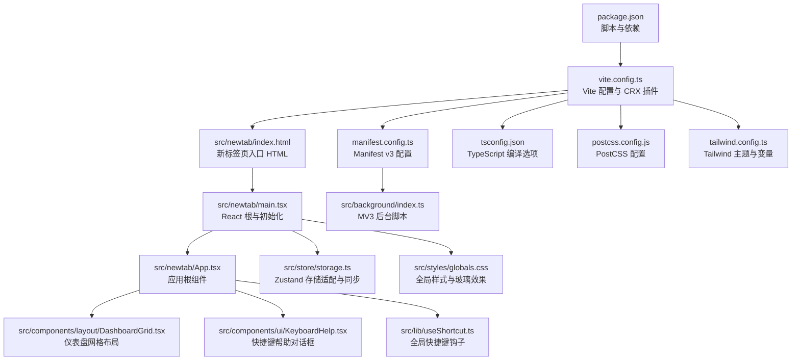
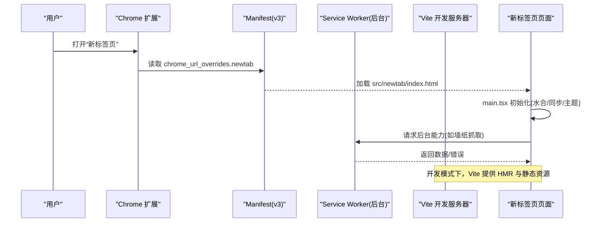
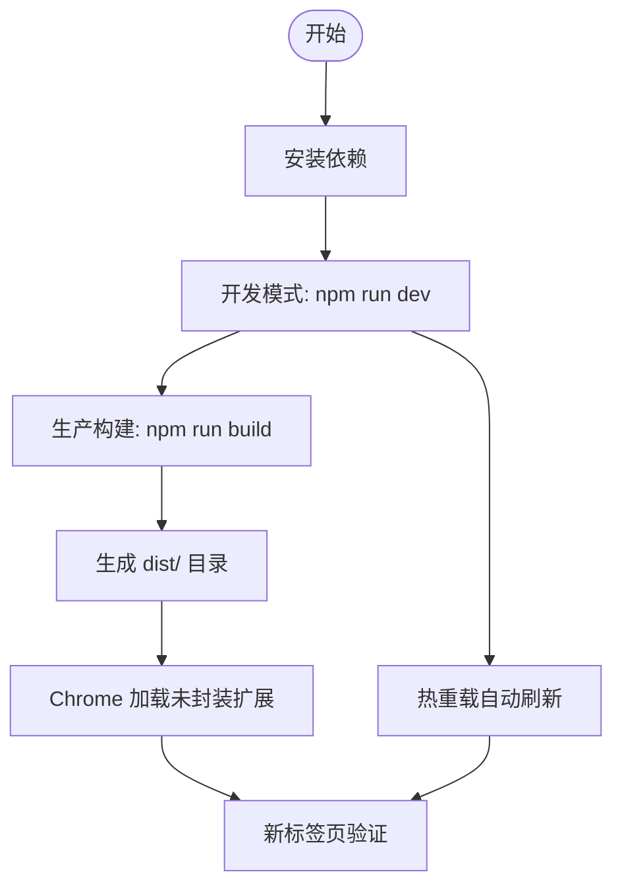
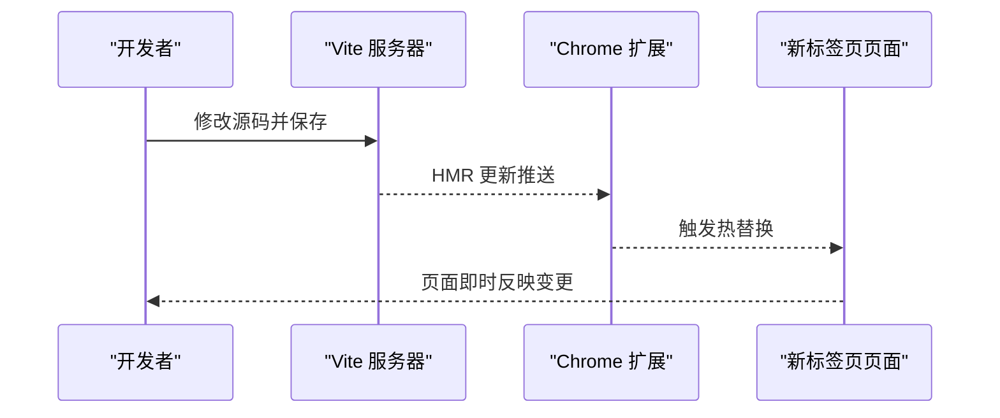
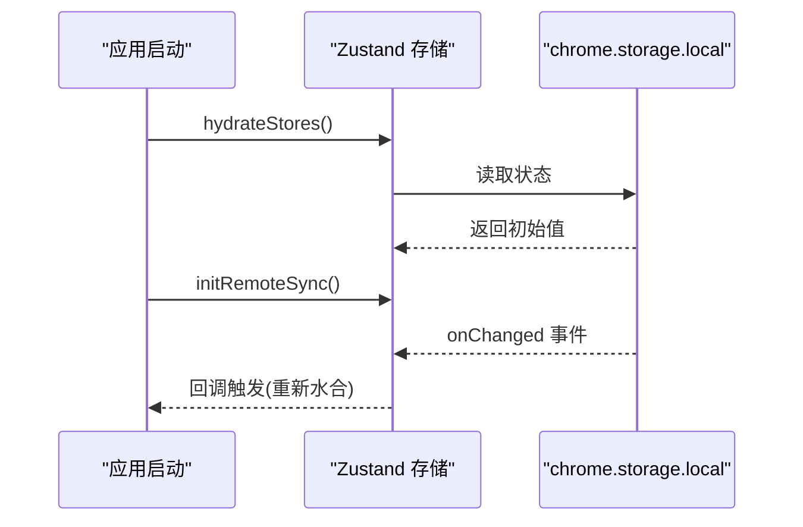
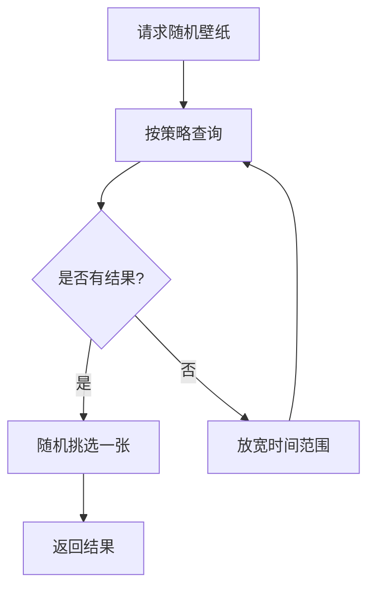
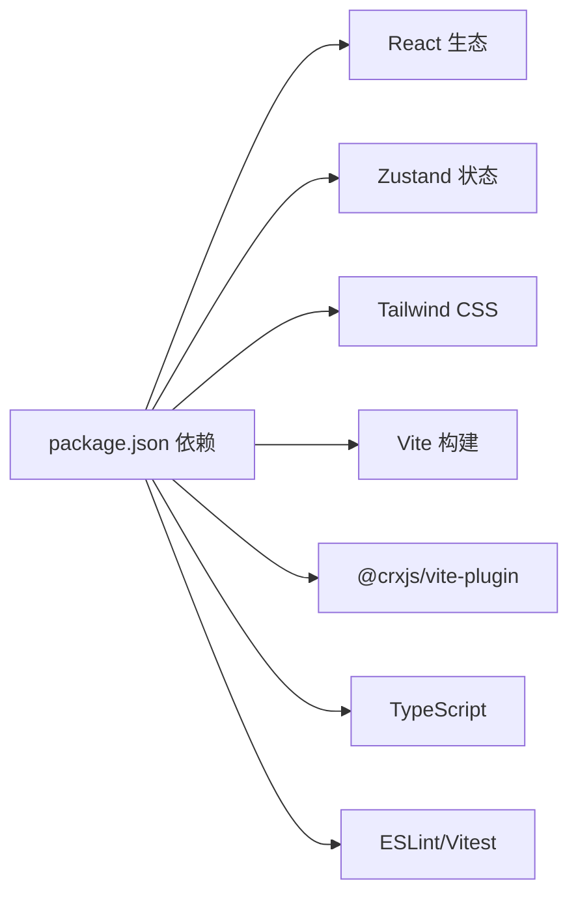

# 快速开始

<cite>
**本文引用的文件**
- [package.json](file://package.json)
- [README.md](file://README.md)
- [vite.config.ts](file://vite.config.ts)
- [manifest.config.ts](file://manifest.config.ts)
- [tsconfig.json](file://tsconfig.json)
- [postcss.config.js](file://postcss.config.js)
- [tailwind.config.ts](file://tailwind.config.ts)
- [src/newtab/index.html](file://src/newtab/index.html)
- [src/newtab/main.tsx](file://src/newtab/main.tsx)
- [src/newtab/App.tsx](file://src/newtab/App.tsx)
- [src/lib/useShortcut.ts](file://src/lib/useShortcut.ts)
- [src/components/ui/KeyboardHelp.tsx](file://src/components/ui/KeyboardHelp.tsx)
- [src/store/storage.ts](file://src/store/storage.ts)
- [src/background/index.ts](file://src/background/index.ts)
- [src/components/layout/DashboardGrid.tsx](file://src/components/layout/DashboardGrid.tsx)
- [src/styles/globals.css](file://src/styles/globals.css)
</cite>

## 目录

1. [简介](#简介)
2. [项目结构](#项目结构)
3. [核心组件](#核心组件)
4. [架构总览](#架构总览)
5. [详细组件分析](#详细组件分析)
6. [依赖分析](#依赖分析)
7. [性能考虑](#性能考虑)
8. [故障排除指南](#故障排除指南)
9. [结论](#结论)
10. [附录](#附录)

## 简介

本指南面向希望快速搭建 Tab 项目开发与运行环境的新手开发者，目标是在约 15 分钟内完成：

- 环境准备（Node.js 版本、浏览器要求）
- 依赖安装与开发构建
- 生产构建与打包
- 开发模式与热重载工作原理
- Chrome 扩展安装与验证
- 常见问题排查
- 键盘快捷键清单与基本使用示例

## 项目结构

该项目是一个基于 React + Vite 的 Chrome 新标签页扩展，采用模块化组织：

- 源码位于 src/，包含入口页面、React 应用、组件、状态管理、工具库、样式与类型定义
- 构建由 Vite 驱动，通过 CRXJS 插件生成可安装的扩展包
- Manifest v3 配置集中于 manifest.config.ts，声明权限、图标、覆盖新标签页等

图表来源

- [package.json:1-56](file://package.json#L1-L56)
- [vite.config.ts:1-46](file://vite.config.ts#L1-L46)
- [manifest.config.ts:1-38](file://manifest.config.ts#L1-L38)
- [src/newtab/index.html:1-14](file://src/newtab/index.html#L1-L14)
- [src/newtab/main.tsx:1-29](file://src/newtab/main.tsx#L1-L29)
- [src/newtab/App.tsx:1-110](file://src/newtab/App.tsx#L1-L110)
- [src/components/layout/DashboardGrid.tsx:1-110](file://src/components/layout/DashboardGrid.tsx#L1-L110)
- [src/components/ui/KeyboardHelp.tsx:1-45](file://src/components/ui/KeyboardHelp.tsx#L1-L45)
- [src/lib/useShortcut.ts:1-49](file://src/lib/useShortcut.ts#L1-L49)
- [src/store/storage.ts:1-63](file://src/store/storage.ts#L1-L63)
- [src/background/index.ts:1-174](file://src/background/index.ts#L1-L174)
- [tsconfig.json:1-27](file://tsconfig.json#L1-L27)
- [postcss.config.js:1-7](file://postcss.config.js#L1-L7)
- [tailwind.config.ts:1-42](file://tailwind.config.ts#L1-L42)
- [src/styles/globals.css:1-147](file://src/styles/globals.css#L1-L147)

章节来源

- [README.md:54-68](file://README.md#L54-L68)

## 核心组件

- 入口与初始化：新标签页 HTML 与 React 根挂载，启动存储水合、远程同步与主题初始化
- 应用根组件：负责壁纸渲染、遮罩层、设置抽屉与快捷键帮助面板
- 布局系统：基于 react-grid-layout 的可拖拽网格布局，支持移动端断点与最小高度约束
- 全局快捷键：统一处理按键事件、修饰键与交互元素过滤
- 存储与同步：Zustand 状态持久化到 chrome.storage.local，并监听多页面同步
- 后台脚本：为墙纸随机抓取等需要同源访问的场景提供 MV3 Service Worker 能力

章节来源

- [src/newtab/main.tsx:11-29](file://src/newtab/main.tsx#L11-L29)
- [src/newtab/App.tsx:10-110](file://src/newtab/App.tsx#L10-L110)
- [src/components/layout/DashboardGrid.tsx:42-110](file://src/components/layout/DashboardGrid.tsx#L42-L110)
- [src/lib/useShortcut.ts:14-49](file://src/lib/useShortcut.ts#L14-L49)
- [src/store/storage.ts:41-63](file://src/store/storage.ts#L41-L63)
- [src/background/index.ts:132-174](file://src/background/index.ts#L132-L174)

## 架构总览

下图展示从浏览器新标签页加载到用户交互的关键路径，以及开发服务器与扩展的协作关系。

图表来源

- [manifest.config.ts:9-11](file://manifest.config.ts#L9-L11)
- [src/newtab/index.html:1-14](file://src/newtab/index.html#L1-L14)
- [src/newtab/main.tsx:11-29](file://src/newtab/main.tsx#L11-L29)
- [src/background/index.ts:132-174](file://src/background/index.ts#L132-L174)

## 详细组件分析

### 开发与构建流程

- 依赖安装：使用 npm 安装工程依赖
- 开发模式：启动 Vite 开发服务器，绑定 127.0.0.1 并启用 HMR；首次构建后可在 Chrome 加载 dist/ 作为未封装扩展
- 生产构建：执行 TypeScript 类型检查与 Vite 构建，输出可分包的静态资源
- 预览：本地预览生产构建产物

章节来源

- [package.json:10-17](file://package.json#L10-L17)
- [vite.config.ts:34-44](file://vite.config.ts#L34-L44)
- [README.md:20-39](file://README.md#L20-L39)

### 环境要求

- Node.js：工程通过 engines 字段要求 Node 版本满足最低版本
- 浏览器：Chrome（用于加载扩展与验证功能）

章节来源

- [package.json:7-9](file://package.json#L7-L9)

### 开发模式与热重载原理

- Vite 服务器绑定到 127.0.0.1:5173，避免 IPv6 解析导致无法访问
- HMR 端口固定为 5173，确保扩展能稳定连接
- 新标签页页面通过 module script 引入 main.tsx，React 根在运行时挂载
- 修改源码后，Vite 自动重建并推送更新至浏览器

图表来源

- [vite.config.ts:34-44](file://vite.config.ts#L34-L44)
- [src/newtab/index.html:11](file://src/newtab/index.html#L11)
- [src/newtab/main.tsx:17-25](file://src/newtab/main.tsx#L17-L25)

### Chrome 扩展安装步骤

- 在 Chrome 中打开扩展管理页，启用开发者模式
- 点击“加载已解压的扩展程序”，选择构建输出目录 dist/
- 打开新的标签页，确认扩展生效

章节来源

- [README.md:27-31](file://README.md#L27-L31)

### 键盘快捷键与使用示例

- 快捷键帮助：在应用中打开快捷键帮助面板，查看所有可用快捷键
- 常用操作：聚焦搜索、切换编辑模式、从打开的标签页添加快捷方式、打开/关闭设置、显示帮助、关闭弹窗/取消输入焦点、在搜索建议中上下移动、提交搜索（支持在新标签页打开）

章节来源

- [src/components/ui/KeyboardHelp.tsx:8-17](file://src/components/ui/KeyboardHelp.tsx#L8-L17)
- [src/lib/useShortcut.ts:14-49](file://src/lib/useShortcut.ts#L14-L49)
- [src/newtab/App.tsx:21-23](file://src/newtab/App.tsx#L21-L23)

### 存储与同步机制

- 存储适配：在扩展环境中使用 chrome.storage.local，在非扩展环境回退到 localStorage
- 水合与远程同步：应用启动时水合状态，注册远程变更监听以保持多页面同步

图表来源

- [src/store/storage.ts:41-63](file://src/store/storage.ts#L41-L63)

章节来源

- [src/store/storage.ts:41-63](file://src/store/storage.ts#L41-L63)

### 壁纸与后台能力

- MV3 Service Worker：为墙纸随机抓取等需要同源访问的场景提供消息通道
- 失败降级链：当窄时间窗口无结果时，自动放宽筛选条件继续尝试

图表来源

- [src/background/index.ts:82-111](file://src/background/index.ts#L82-L111)
- [src/background/index.ts:132-174](file://src/background/index.ts#L132-L174)

章节来源

- [src/background/index.ts:132-174](file://src/background/index.ts#L132-L174)

## 依赖分析

- 运行时依赖：React、React DOM、Zustand、Tailwind Merge、Lucide React、React Grid Layout
- 开发依赖：Vite、CRXJS 插件、React 插件、Tailwind CSS、PostCSS、TypeScript、ESLint、Vitest
- TypeScript：严格模式、bundler 模块解析、路径别名 @/\*
- PostCSS：Tailwind CSS 与 Autoprefixer
- Tailwind：深色模式、CSS 变量映射与自定义主题

图表来源

- [package.json:18-54](file://package.json#L18-L54)
- [tsconfig.json:19](file://tsconfig.json#L19)
- [postcss.config.js:1-7](file://postcss.config.js#L1-7)
- [tailwind.config.ts:1-42](file://tailwind.config.ts#L1-L42)

章节来源

- [package.json:18-54](file://package.json#L18-L54)
- [tsconfig.json:19](file://tsconfig.json#L19)
- [postcss.config.js:1-7](file://postcss.config.js#L1-7)
- [tailwind.config.ts:1-42](file://tailwind.config.ts#L1-L42)

## 性能考虑

- 代码分割：Vite 将 React、Zustand、Scheduler 等放入独立 vendor chunk，降低新标签页入口包体积波动
- 懒加载：网格布局相关模块在首屏后按需加载，缩短首屏时间
- 减少动画：尊重系统“减少动态效果”偏好，降低过渡动画时长
- 样式优化：Tailwind 动态类与 CSS 变量配合，实现主题与玻璃效果的高效渲染

章节来源

- [vite.config.ts:19-31](file://vite.config.ts#L19-L31)
- [src/components/layout/DashboardGrid.tsx:20-22](file://src/components/layout/DashboardGrid.tsx#L20-L22)
- [src/styles/globals.css:70-90](file://src/styles/globals.css#L70-L90)

## 故障排除指南

- Node 版本不满足：请升级 Node 至满足 engines 要求的版本
- 开发服务器无法访问：确认 Vite 绑定地址为 127.0.0.1，端口 5173
- 扩展无法加载：确保已启用开发者模式并正确选择 dist/ 目录
- 快捷键无效：确认未处于输入/可编辑元素中，且未按下冲突的组合键（如 Ctrl/Cmd/Alt）
- 壁纸请求失败：检查网络连通性与 API 限制提示，稍后重试

章节来源

- [package.json:7-9](file://package.json#L7-L9)
- [vite.config.ts:34-44](file://vite.config.ts#L34-L44)
- [README.md:27-31](file://README.md#L27-L31)
- [src/lib/useShortcut.ts:24-41](file://src/lib/useShortcut.ts#L24-L41)
- [src/background/index.ts:113-121](file://src/background/index.ts#L113-L121)

## 结论

按照本指南，您可以在 15 分钟内完成环境准备、依赖安装、开发与生产构建、扩展安装与验证，并掌握常用快捷键。遇到问题时，可依据故障排除章节逐项排查。随着对项目结构与配置的理解加深，您可以进一步定制主题、布局与功能。

## 附录

### 快速命令清单

- 安装依赖：npm install
- 开发模式：npm run dev
- 生产构建：npm run build
- 预览构建：npm run preview
- 类型检查：npm run typecheck
- 代码检查：npm run lint
- 单元测试：npm run test

章节来源

- [package.json:10-17](file://package.json#L10-L17)

### 键盘快捷键一览

- 聚焦搜索：/
- 切换编辑布局：e
- 从打开的标签页添加快捷方式：Shift + T
- 打开/关闭设置：,
- 显示快捷键帮助：?
- 关闭弹窗/取消输入焦点：Esc
- 在搜索建议中移动：↑ / ↓
- 提交搜索（新标签打开）：⌘/Ctrl + ↵

章节来源

- [src/components/ui/KeyboardHelp.tsx:8-17](file://src/components/ui/KeyboardHelp.tsx#L8-L17)
- [src/newtab/App.tsx:21-23](file://src/newtab/App.tsx#L21-L23)
