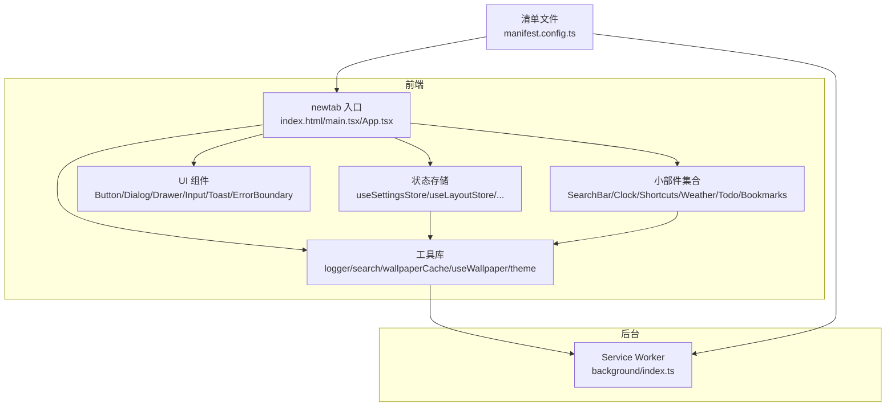
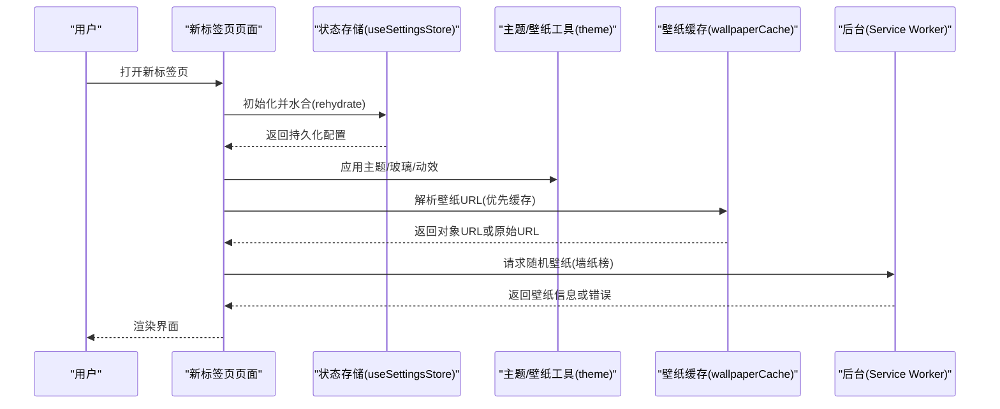
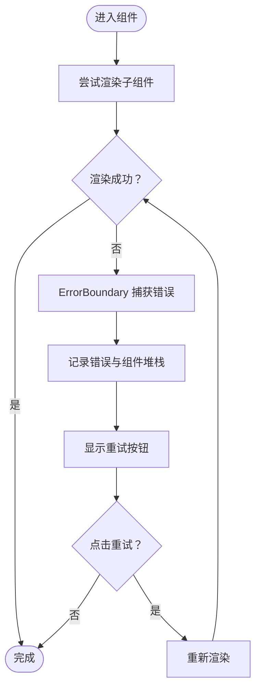
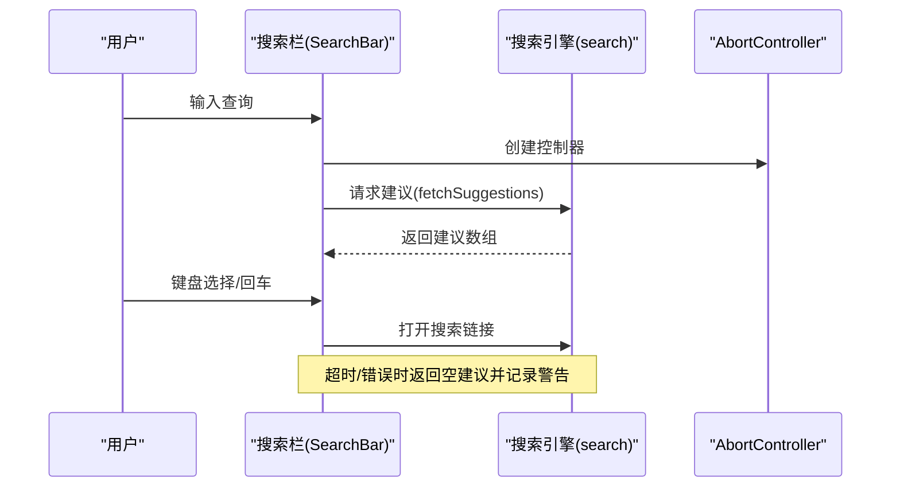
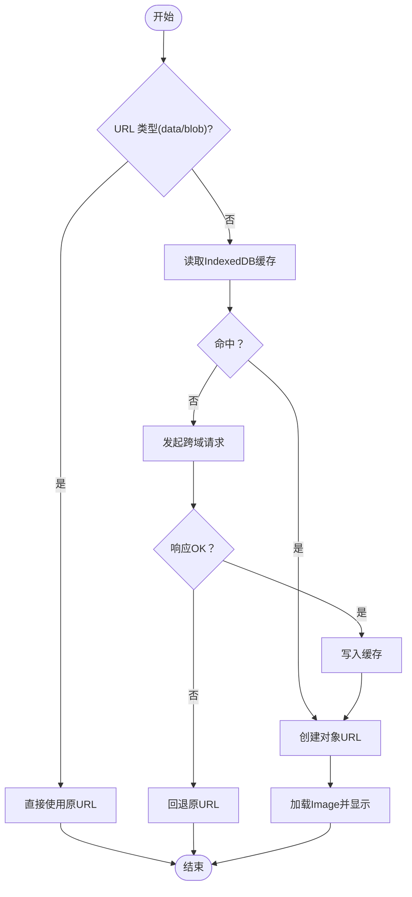
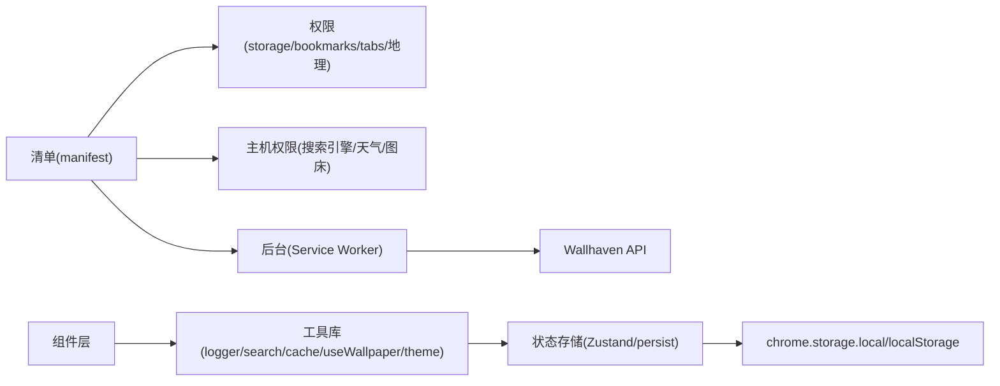

# 故障排除与常见问题

<cite>
**本文引用的文件**
- [README.md](file://README.md)
- [package.json](file://package.json)
- [manifest.config.ts](file://manifest.config.ts)
- [src/background/index.ts](file://src/background/index.ts)
- [src/lib/logger.ts](file://src/lib/logger.ts)
- [src/lib/search.ts](file://src/lib/search.ts)
- [src/lib/wallpaperCache.ts](file://src/lib/wallpaperCache.ts)
- [src/lib/useWallpaper.ts](file://src/lib/useWallpaper.ts)
- [src/lib/theme.ts](file://src/lib/theme.ts)
- [src/store/storage.ts](file://src/store/storage.ts)
- [src/store/useSettingsStore.ts](file://src/store/useSettingsStore.ts)
- [src/components/ui/ErrorBoundary.tsx](file://src/components/ui/ErrorBoundary.tsx)
- [src/components/widgets/SearchBar/SearchBar.tsx](file://src/components/widgets/SearchBar/SearchBar.tsx)
- [src/components/settings/WallpaperPicker.tsx](file://src/components/settings/WallpaperPicker.tsx)
</cite>

## 目录

1. [简介](#简介)
2. [项目结构](#项目结构)
3. [核心组件](#核心组件)
4. [架构总览](#架构总览)
5. [详细组件分析](#详细组件分析)
6. [依赖关系分析](#依赖关系分析)
7. [性能考虑](#性能考虑)
8. [故障排除指南](#故障排除指南)
9. [结论](#结论)
10. [附录](#附录)

## 简介

本指南面向用户与开发者，聚焦于扩展安装与配置、性能诊断与优化、Chrome 权限问题排查、数据丢失与存储恢复、壁纸加载失败、搜索功能异常、组件渲染问题、日志与调试技巧、兼容性与浏览器版本适配，以及社区支持与问题反馈流程。内容基于仓库中的实际实现进行归纳总结。

## 项目结构

该 Chrome 新标签页扩展采用 React + Vite 构建，核心模块包括：

- 入口与页面：newtab 入口 HTML 与 React 根节点
- 组件层：布局、设置抽屉、UI 控件、小部件（搜索栏、时钟、快捷方式、天气、待办、书签）
- 存储层：Zustand 状态 + chrome.storage.local 适配器，支持水合与跨标签页同步
- 工具库：日志、主题与壁纸色调、搜索建议解析、壁纸缓存与对象 URL 管理
- 后台服务：MV3 Service Worker，负责墙纸随机 API 请求与降级策略

图表来源

- [manifest.config.ts:1-38](file://manifest.config.ts#L1-L38)
- [src/background/index.ts:1-174](file://src/background/index.ts#L1-L174)
- [src/lib/logger.ts:1-35](file://src/lib/logger.ts#L1-L35)
- [src/lib/search.ts:1-109](file://src/lib/search.ts#L1-L109)
- [src/lib/wallpaperCache.ts:1-94](file://src/lib/wallpaperCache.ts#L1-L94)
- [src/lib/useWallpaper.ts:1-110](file://src/lib/useWallpaper.ts#L1-L110)
- [src/lib/theme.ts:1-123](file://src/lib/theme.ts#L1-L123)
- [src/store/storage.ts:1-63](file://src/store/storage.ts#L1-L63)
- [src/store/useSettingsStore.ts:1-89](file://src/store/useSettingsStore.ts#L1-L89)

章节来源

- [README.md:54-68](file://README.md#L54-L68)

## 核心组件

- 日志系统：统一的 debug/info/warn/error 输出控制，便于在开发与生产环境间切换日志级别
- 存储适配器：在扩展环境中使用 chrome.storage.local，在非扩展环境回退到 localStorage；提供错误上报与远程变更监听
- 主题与壁纸：根据壁纸提取主色与明度，动态应用 CSS 变量与类名，支持减少动画偏好
- 搜索建议：多引擎统一接口，支持 JSONP 包装解析与取消控制
- 壁纸缓存：IndexedDB 缓存图片 Blob，支持跨域资源加载与对象 URL 回收
- 错误边界：捕获子组件渲染错误，提供重试入口
- 后台消息：Wallhaven 壁纸随机请求，带超时与速率限制友好提示

章节来源

- [src/lib/logger.ts:1-35](file://src/lib/logger.ts#L1-L35)
- [src/store/storage.ts:1-63](file://src/store/storage.ts#L1-L63)
- [src/lib/theme.ts:1-123](file://src/lib/theme.ts#L1-L123)
- [src/lib/search.ts:1-109](file://src/lib/search.ts#L1-L109)
- [src/lib/wallpaperCache.ts:1-94](file://src/lib/wallpaperCache.ts#L1-L94)
- [src/components/ui/ErrorBoundary.tsx:1-48](file://src/components/ui/ErrorBoundary.tsx#L1-L48)
- [src/background/index.ts:1-174](file://src/background/index.ts#L1-L174)

## 架构总览

扩展由清单声明新标签页覆盖、后台 Service Worker 与前端 React 应用组成。前端通过 Zustand 管理状态，持久化到 chrome.storage.local，并在多标签页之间保持同步。壁纸与搜索等网络请求通过后台消息或直接 fetch 完成，同时具备缓存与降级策略。

图表来源

- [src/store/useSettingsStore.ts:1-89](file://src/store/useSettingsStore.ts#L1-L89)
- [src/lib/theme.ts:1-123](file://src/lib/theme.ts#L1-L123)
- [src/lib/wallpaperCache.ts:1-94](file://src/lib/wallpaperCache.ts#L1-L94)
- [src/background/index.ts:1-174](file://src/background/index.ts#L1-L174)

## 详细组件分析

### 组件 A：错误边界与组件渲染问题

- 功能要点：捕获子组件渲染错误，记录堆栈信息，提供“重试”按钮恢复显示
- 常见症状：某小部件反复报错导致区域空白
- 排查步骤：
  - 观察是否出现“组件加载失败”提示与“重试”按钮
  - 查看控制台日志（见“日志查看与调试技巧”）
  - 若重试无效，检查对应小部件的数据源或网络访问权限
- 优化建议：为易出错的小部件包裹 ErrorBoundary，避免影响整体渲染

图表来源

- [src/components/ui/ErrorBoundary.tsx:1-48](file://src/components/ui/ErrorBoundary.tsx#L1-L48)
- [src/lib/logger.ts:1-35](file://src/lib/logger.ts#L1-L35)

章节来源

- [src/components/ui/ErrorBoundary.tsx:1-48](file://src/components/ui/ErrorBoundary.tsx#L1-L48)
- [src/lib/logger.ts:1-35](file://src/lib/logger.ts#L1-L35)

### 组件 B：搜索功能异常

- 功能要点：根据所选搜索引擎生成搜索 URL，异步获取建议列表；支持键盘导航与快捷键
- 常见症状：输入无建议、建议加载慢、回车无法打开结果
- 排查步骤：
  - 检查网络请求是否被拦截（如广告屏蔽插件）
  - 确认清单文件 hosts 权限包含对应搜索引擎域名
  - 使用 AbortController 取消过时请求，避免竞态
  - 检查 JSONP 包装解析逻辑对特定返回格式的兼容性
- 优化建议：降低防抖延迟、增加超时与错误提示；必要时切换到其他搜索引擎

图表来源

- [src/components/widgets/SearchBar/SearchBar.tsx:1-116](file://src/components/widgets/SearchBar/SearchBar.tsx#L1-L116)
- [src/lib/search.ts:1-109](file://src/lib/search.ts#L1-L109)

章节来源

- [src/components/widgets/SearchBar/SearchBar.tsx:1-116](file://src/components/widgets/SearchBar/SearchBar.tsx#L1-L116)
- [src/lib/search.ts:1-109](file://src/lib/search.ts#L1-L109)

### 组件 C：壁纸加载失败与缓存

- 功能要点：优先从 IndexedDB 缓存读取，否则通过 fetch 获取并写入缓存；支持对象 URL 复用与回收；跨标签页仅保留当前壁纸
- 常见症状：壁纸不显示、闪烁、内存占用上升
- 排查步骤：
  - 检查壁纸 URL 是否为 data:/blob:，此类 URL 不参与缓存
  - 确认 fetch 返回状态码与响应体
  - 查看对象 URL 是否正确创建与回收
  - 在后台 Service Worker 中确认墙纸榜请求是否超时或触发速率限制
- 优化建议：启用壁纸暗化以提升可读性；清理旧缓存；避免频繁切换壁纸

图表来源

- [src/lib/wallpaperCache.ts:1-94](file://src/lib/wallpaperCache.ts#L1-L94)
- [src/lib/useWallpaper.ts:1-110](file://src/lib/useWallpaper.ts#L1-L110)
- [src/background/index.ts:1-174](file://src/background/index.ts#L1-L174)

章节来源

- [src/lib/wallpaperCache.ts:1-94](file://src/lib/wallpaperCache.ts#L1-L94)
- [src/lib/useWallpaper.ts:1-110](file://src/lib/useWallpaper.ts#L1-L110)
- [src/background/index.ts:1-174](file://src/background/index.ts#L1-L174)

### 组件 D：主题与壁纸色调

- 功能要点：根据系统偏好与用户设置应用深浅主题、玻璃模式、减少动画；从壁纸提取主色与明度，动态设置 CSS 变量
- 常见症状：文字颜色对比度不足、主题切换不同步
- 排查步骤：
  - 检查 documentElement 上的 class 与 CSS 变量
  - 确认订阅回调是否生效
  - 验证壁纸明度为空时的回退逻辑
- 优化建议：首次加载时应用缓存值避免闪烁；合理设置壁纸暗化强度

章节来源

- [src/lib/theme.ts:1-123](file://src/lib/theme.ts#L1-L123)
- [src/store/useSettingsStore.ts:1-89](file://src/store/useSettingsStore.ts#L1-L89)

### 组件 E：设置与存储

- 功能要点：Zustand + persist + 自定义 JSON Storage；支持水合与跨标签页同步；迁移逻辑兼容历史字段
- 常见症状：设置丢失、跨标签页不同步
- 排查步骤：
  - 检查 chrome.storage.local 是否可用与权限
  - 观察 onChanged 监听是否触发
  - 确认迁移版本号与字段映射
- 优化建议：定期导出/导入配置；避免超出存储配额

章节来源

- [src/store/storage.ts:1-63](file://src/store/storage.ts#L1-L63)
- [src/store/useSettingsStore.ts:1-89](file://src/store/useSettingsStore.ts#L1-L89)

## 依赖关系分析

- 清单权限与主机权限决定网络访问范围；后台消息用于墙纸榜请求
- 前端组件依赖工具库与状态存储；工具库内部存在网络与缓存依赖
- 错误边界与日志系统贯穿组件层，便于定位问题

图表来源

- [manifest.config.ts:1-38](file://manifest.config.ts#L1-L38)
- [src/background/index.ts:1-174](file://src/background/index.ts#L1-L174)
- [src/lib/logger.ts:1-35](file://src/lib/logger.ts#L1-L35)
- [src/lib/search.ts:1-109](file://src/lib/search.ts#L1-L109)
- [src/lib/wallpaperCache.ts:1-94](file://src/lib/wallpaperCache.ts#L1-L94)
- [src/lib/useWallpaper.ts:1-110](file://src/lib/useWallpaper.ts#L1-L110)
- [src/lib/theme.ts:1-123](file://src/lib/theme.ts#L1-L123)
- [src/store/storage.ts:1-63](file://src/store/storage.ts#L1-L63)
- [src/store/useSettingsStore.ts:1-89](file://src/store/useSettingsStore.ts#L1-L89)

章节来源

- [manifest.config.ts:1-38](file://manifest.config.ts#L1-L38)
- [src/store/storage.ts:1-63](file://src/store/storage.ts#L1-L63)

## 性能考虑

- 建议
  - 减少壁纸切换频率，避免频繁触发 Canvas 解码
  - 合理设置壁纸暗化强度，平衡可读性与性能
  - 使用缓存与对象 URL 复用，避免重复下载与内存泄漏
  - 对搜索建议请求设置合理的防抖与超时
  - 关闭不必要的动画以降低渲染压力
- 可观测点
  - 控制台日志级别调整
  - 壁纸缓存命中率与对象 URL 数量
  - 搜索建议响应时间与错误率

[本节为通用指导，无需列出章节来源]

## 故障排除指南

### 安装与配置问题

- 症状：扩展无法加载、新标签页未替换
  - 检查 Node 版本是否满足要求
  - 确认已启用开发者模式并加载 dist/ 文件夹
  - 验证清单声明的新标签页覆盖与后台脚本路径
- 症状：设置丢失或跨标签页不同步
  - 检查 chrome.storage.local 权限与配额
  - 确认 onChanged 监听与 rehydrate 流程
  - 导出/导入配置进行恢复

章节来源

- [README.md:20-39](file://README.md#L20-L39)
- [package.json:7-9](file://package.json#L7-L9)
- [manifest.config.ts:9-15](file://manifest.config.ts#L9-L15)
- [src/store/storage.ts:53-62](file://src/store/storage.ts#L53-L62)

### Chrome 权限相关问题

- 症状：搜索建议失败、天气/地理位置不可用、无法读取书签
  - 检查清单中的 permissions 与 host_permissions
  - 确认网络请求域名在 host_permissions 列表中
  - 若受限于同源策略，后台消息通道可用于墙纸榜请求
- 症状：无法上传自定义壁纸
  - 检查文件大小限制与 MIME 类型
  - 确认 FileReader 成功转换为 data URL

章节来源

- [manifest.config.ts:21-36](file://manifest.config.ts#L21-L36)
- [src/components/settings/WallpaperPicker.tsx:61-77](file://src/components/settings/WallpaperPicker.tsx#L61-L77)

### 数据丢失与存储问题

- 症状：设置重置、收藏失效
  - 使用设置抽屉的导入/导出功能备份配置
  - 检查持久化版本迁移逻辑与字段映射
  - 如需彻底重置，清除 chrome.storage.local 并重启扩展
- 症状：跨标签页不同步
  - 确认注册了远程同步回调并在 onChanged 事件中触发 rehydrate

章节来源

- [src/store/useSettingsStore.ts:57-84](file://src/store/useSettingsStore.ts#L57-L84)
- [src/store/storage.ts:37-62](file://src/store/storage.ts#L37-L62)

### 壁纸加载失败

- 症状：壁纸不显示、闪烁、内存增长
  - 检查 URL 类型与缓存命中情况
  - 确认 fetch 响应与 Blob 创建
  - 查看对象 URL 是否正确创建与回收
  - 后台请求是否超时或触发速率限制
- 症状：切换壁纸卡顿
  - 降低切换频率，避免连续快速切换
  - 启用壁纸暗化提升可读性

章节来源

- [src/lib/wallpaperCache.ts:75-93](file://src/lib/wallpaperCache.ts#L75-L93)
- [src/lib/useWallpaper.ts:54-98](file://src/lib/useWallpaper.ts#L54-L98)
- [src/background/index.ts:144-173](file://src/background/index.ts#L144-L173)

### 搜索功能异常

- 症状：无建议、建议乱码、回车打开失败
  - 检查 JSONP 包装与解析逻辑
  - 确认 AbortController 正确取消过时请求
  - 切换搜索引擎验证网络连通性
- 症状：键盘快捷键无效
  - 检查焦点是否在输入框内
  - 确认快捷键绑定与事件冒泡

章节来源

- [src/lib/search.ts:24-38](file://src/lib/search.ts#L24-L38)
- [src/lib/search.ts:88-108](file://src/lib/search.ts#L88-L108)
- [src/components/widgets/SearchBar/SearchBar.tsx:18-63](file://src/components/widgets/SearchBar/SearchBar.tsx#L18-L63)

### 组件渲染问题

- 症状：某小部件区域空白
  - 使用 ErrorBoundary 重试
  - 查看组件日志与堆栈信息
  - 检查依赖数据源与网络权限

章节来源

- [src/components/ui/ErrorBoundary.tsx:15-47](file://src/components/ui/ErrorBoundary.tsx#L15-L47)
- [src/lib/logger.ts:20-30](file://src/lib/logger.ts#L20-L30)

### 日志查看与调试技巧

- 调整日志级别：通过设置最小日志级别输出 debug/info/warn
- 关键位置：
  - 搜索建议失败会记录警告
  - 壁纸缓存写入失败会被忽略（不影响主流程）
  - 壁纸加载错误会撤销对象 URL 并回退
  - 墙纸榜请求错误会转为友好提示
- 建议：
  - 开发时开启较低日志级别以便定位问题
  - 在后台面板与扩展页面分别查看控制台

章节来源

- [src/lib/logger.ts:32-35](file://src/lib/logger.ts#L32-L35)
- [src/lib/search.ts:103-107](file://src/lib/search.ts#L103-L107)
- [src/lib/wallpaperCache.ts:44-46](file://src/lib/wallpaperCache.ts#L44-L46)
- [src/lib/useWallpaper.ts:73-85](file://src/lib/useWallpaper.ts#L73-L85)
- [src/background/index.ts:113-121](file://src/background/index.ts#L113-L121)

### 兼容性与浏览器版本适配

- Node 版本要求：满足 engines 字段
- 清单版本：使用 Manifest V3（chrome_url_overrides、service_worker）
- 权限模型：storage/bookmarks/unlimitedStorage/tabs/geolocation
- 建议：
  - 在不同 Chrome 版本上测试键盘快捷键与后台消息
  - 关注 fetch 与 IndexedDB 行为差异

章节来源

- [package.json:7-9](file://package.json#L7-L9)
- [manifest.config.ts:4-15](file://manifest.config.ts#L4-L15)
- [manifest.config.ts:21-29](file://manifest.config.ts#L21-L29)

### 社区支持与问题反馈流程

- 当前仓库未提供官方社区渠道与问题模板
- 建议：
  - 在扩展页面提交反馈
  - 提供复现步骤、日志截图与浏览器版本信息
  - 附带导出的配置文件以便复现

[本节为通用指导，无需列出章节来源]

## 结论

本指南围绕安装配置、权限、存储、壁纸与搜索等核心功能提供了系统化的故障排除路径与优化建议。通过日志与调试技巧、跨标签页同步机制与缓存策略，可有效定位并解决大多数使用问题。建议在开发与测试阶段开启适当日志级别，并利用导入/导出功能做好配置备份。

## 附录

### 常用操作速查

- 重新加载扩展：在扩展管理页点击刷新或重新加载
- 查看后台页面：在扩展管理页点击“服务工作线程”
- 清除存储：在扩展管理页点击“清除所有数据”
- 导入/导出设置：在设置抽屉中使用导入/导出功能

[本节为通用指导，无需列出章节来源]
