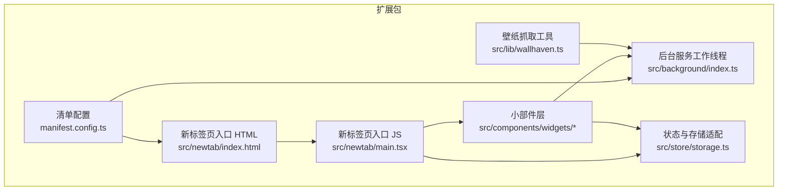
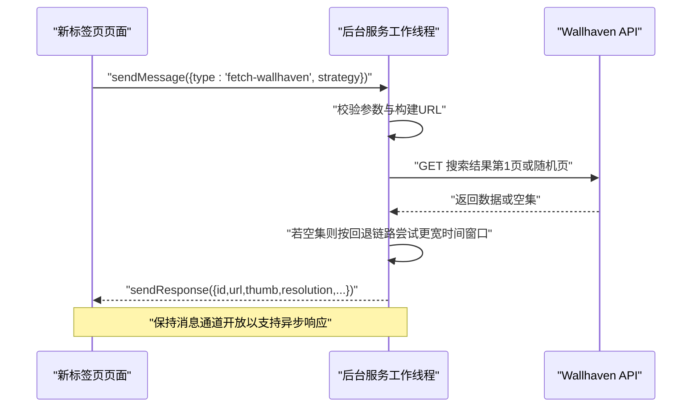
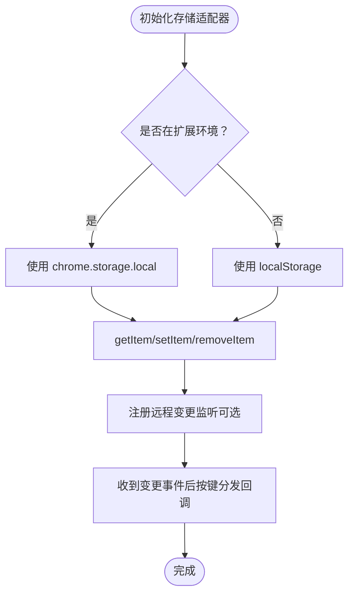
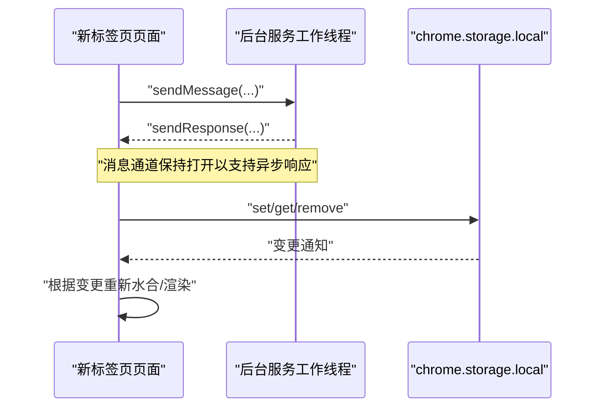
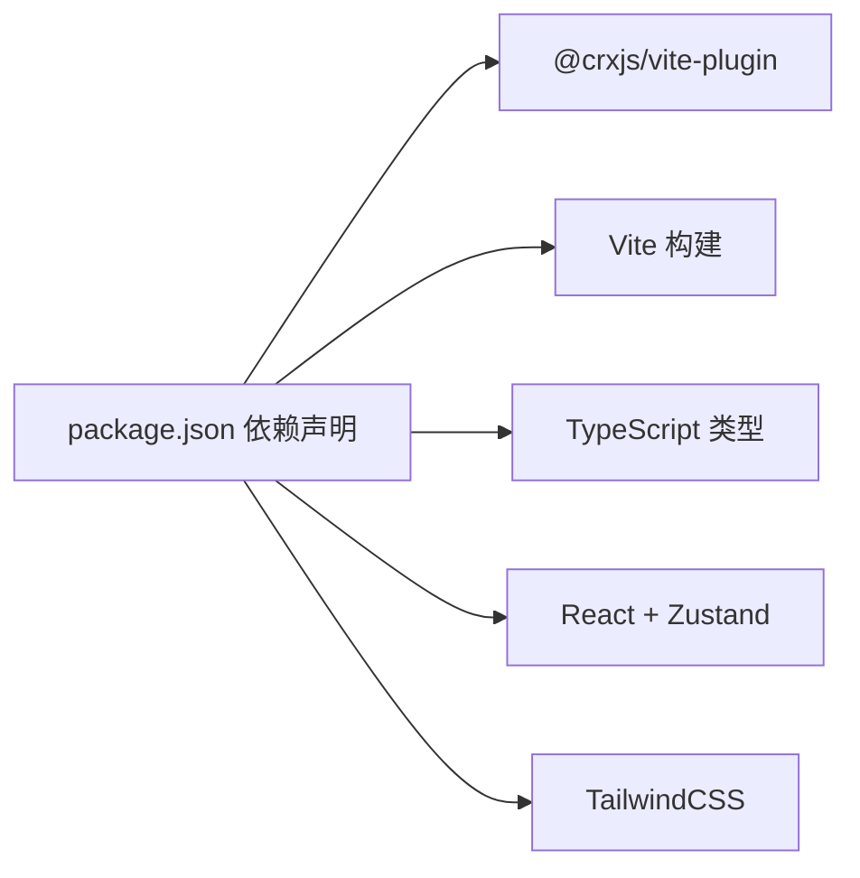

# Chrome 扩展集成

<cite>
**本文引用的文件**
- [manifest.config.ts](file://manifest.config.ts)
- [package.json](file://package.json)
- [src/background/index.ts](file://src/background/index.ts)
- [src/newtab/index.html](file://src/newtab/index.html)
- [src/newtab/main.tsx](file://src/newtab/main.tsx)
- [src/store/storage.ts](file://src/store/storage.ts)
- [src/lib/wallhaven.ts](file://src/lib/wallhaven.ts)
- [src/components/widgets/Bookmarks/useBookmarks.ts](file://src/components/widgets/Bookmarks/useBookmarks.ts)
- [src/components/widgets/Shortcuts/useOpenTabs.ts](file://src/components/widgets/Shortcuts/useOpenTabs.ts)
- [src/lib/theme.ts](file://src/lib/theme.ts)
- [src/lib/logger.ts](file://src/lib/logger.ts)
- [README.md](file://README.md)
</cite>

## 目录

1. [简介](#简介)
2. [项目结构](#项目结构)
3. [核心组件](#核心组件)
4. [架构总览](#架构总览)
5. [详细组件分析](#详细组件分析)
6. [依赖分析](#依赖分析)
7. [性能考虑](#性能考虑)
8. [故障排查指南](#故障排查指南)
9. [结论](#结论)
10. [附录](#附录)

## 简介

本文件面向希望将 Tab 项目适配为 Chrome 扩展的开发者，系统性说明其在 Manifest V3 架构下的集成方式。重点覆盖以下方面：

- 扩展清单文件的配置项与权限声明，包括 storage、bookmarks、tabs、geolocation、unlimitedStorage 等的作用与边界
- 后台服务工作线程（MV3 service worker）的职责与消息传递机制
- 扩展生命周期（安装、更新、卸载）在当前实现中的处理现状
- 扩展与网页（新标签页页面）的通信机制：消息传递、存储同步、事件订阅
- 提供扩展架构图与权限流程图，帮助理解扩展在浏览器生态中的位置与交互关系

## 项目结构

Tab 项目采用 React + Vite 构建，通过 CRXJS 插件生成 Chrome 扩展包。核心目录与职责如下：

- src/newtab：新标签页入口页面与 React 根节点，作为 chrome_url_overrides.newtab 的承载页面
- src/background：MV3 服务工作线程，负责跨域资源访问、消息处理等后台逻辑
- src/store：基于 Zustand 的状态管理，结合 chrome.storage.local 实现持久化与多页面同步
- src/lib：通用工具模块，如主题、日志、壁纸抓取等
- src/components/widgets：小部件层，包含书签树、快捷方式、天气、时钟等
- manifest.config.ts：定义清单 v3、权限、图标、URL 覆盖与后台脚本等



图表来源

- [manifest.config.ts:1-38](file://manifest.config.ts#L1-L38)
- [src/background/index.ts:1-174](file://src/background/index.ts#L1-L174)
- [src/newtab/index.html:1-14](file://src/newtab/index.html#L1-L14)
- [src/newtab/main.tsx:1-29](file://src/newtab/main.tsx#L1-L29)
- [src/store/storage.ts:1-63](file://src/store/storage.ts#L1-L63)
- [src/lib/wallhaven.ts:1-43](file://src/lib/wallhaven.ts#L1-L43)

章节来源

- [README.md:54-68](file://README.md#L54-L68)
- [manifest.config.ts:1-38](file://manifest.config.ts#L1-L38)
- [src/newtab/index.html:1-14](file://src/newtab/index.html#L1-L14)
- [src/newtab/main.tsx:1-29](file://src/newtab/main.tsx#L1-L29)
- [src/store/storage.ts:1-63](file://src/store/storage.ts#L1-L63)

## 核心组件

- 清单与打包
  - 使用 CRXJS 定义 Manifest V3，设置 newtab 页面覆盖、后台服务工作线程、图标与权限
  - 版本号与描述来自 package.json
- 后台服务工作线程（SW）
  - 暴露消息处理器，用于从新标签页请求壁纸数据；内部实现限流、降级策略与错误友好提示
- 新标签页页面
  - React 应用入口，初始化状态、主题与错误边界；按需向后台发送消息
- 存储与同步
  - 基于 chrome.storage.local 的适配器，支持 getItem/setItem/removeItem；支持多页面远程变更同步
- 小部件与权限使用
  - 书签树：使用 chrome.bookmarks API 获取与监听变更
  - 打开标签页：使用 chrome.tabs API 查询与监听状态变化
  - 地理位置：声明 geolocation 权限（当前未在 UI 中直接使用）

章节来源

- [manifest.config.ts:1-38](file://manifest.config.ts#L1-L38)
- [src/background/index.ts:1-174](file://src/background/index.ts#L1-L174)
- [src/newtab/main.tsx:1-29](file://src/newtab/main.tsx#L1-L29)
- [src/store/storage.ts:1-63](file://src/store/storage.ts#L1-L63)
- [src/components/widgets/Bookmarks/useBookmarks.ts:1-55](file://src/components/widgets/Bookmarks/useBookmarks.ts#L1-L55)
- [src/components/widgets/Shortcuts/useOpenTabs.ts:102-144](file://src/components/widgets/Shortcuts/useOpenTabs.ts#L102-L144)

## 架构总览

下图展示了扩展在浏览器生态系统中的位置与交互关系：浏览器内核加载扩展、新标签页由扩展覆盖、页面与后台通过消息通道通信、存储通过 chrome.storage.local 同步。

```mermaid
graph TB
Browser["浏览器内核"]
Ext["扩展Manifest V3"]
NTP["新标签页页面<br/>chrome_url_overrides.newtab"]
SW["后台服务工作线程<br/>service_worker"]
Storage["chrome.storage.local"]
APIs["Chrome APIs<br/>bookmarks / tabs / storage / geolocation"]
Browser --> Ext
Ext --> NTP
Ext --> SW
NTP <- --> SW
NTP --> Storage
SW --> Storage
Ext --> APIs
NTP --> APIs
SW --> APIs
```

图表来源

- [manifest.config.ts:9-21](file://manifest.config.ts#L9-L21)
- [src/background/index.ts:132-173](file://src/background/index.ts#L132-L173)
- [src/store/storage.ts:4-32](file://src/store/storage.ts#L4-L32)
- [src/components/widgets/Bookmarks/useBookmarks.ts:24-51](file://src/components/widgets/Bookmarks/useBookmarks.ts#L24-L51)
- [src/components/widgets/Shortcuts/useOpenTabs.ts:102-144](file://src/components/widgets/Shortcuts/useOpenTabs.ts#L102-L144)

## 详细组件分析

### 清单与权限配置

- 清单版本与覆盖
  - manifest_version: 3
  - chrome_url_overrides.newtab 指向新标签页入口 HTML
- 后台与图标
  - background.service_worker 指向后台脚本，类型为 module
  - icons 提供多尺寸图标路径
- 权限与主机权限
  - 权限：storage、bookmarks、unlimitedStorage、tabs、geolocation
  - 主机权限：列举了多个搜索建议与天气、图片、地理编码等 API 的域名前缀

章节来源

- [manifest.config.ts:4-38](file://manifest.config.ts#L4-L38)
- [package.json:1-56](file://package.json#L1-L56)

### 后台服务工作线程（消息与业务）

- 职责
  - 接收来自新标签页的消息，执行跨域请求与数据处理，返回统一格式结果
  - 对外部暴露单一消息类型：fetch-wallhaven
- 处理流程
  - 校验消息类型与参数范围
  - 构建请求 URL，按策略拉取第一页或随机页
  - 遇到空结果时按回退链路逐步放宽时间窗口
  - 超时控制与错误友好提示
  - 返回包含 id、url、缩略图、分辨率、实际策略等字段的结果



图表来源

- [src/lib/wallhaven.ts:14-42](file://src/lib/wallhaven.ts#L14-L42)
- [src/background/index.ts:123-173](file://src/background/index.ts#L123-L173)

章节来源

- [src/background/index.ts:1-174](file://src/background/index.ts#L1-L174)
- [src/lib/wallhaven.ts:1-43](file://src/lib/wallhaven.ts#L1-L43)

### 新标签页页面与状态初始化

- 入口 HTML
  - 提供根容器与 portal 容器，加载入口脚本
- 入口 JS
  - 异步引导：水合状态、初始化远程同步、初始化主题
  - 创建 React 根并渲染应用
- 主题初始化
  - 应用主题、玻璃模式、减少动画偏好
  - 延迟提取壁纸色调并缓存，避免闪烁

章节来源

- [src/newtab/index.html:1-14](file://src/newtab/index.html#L1-L14)
- [src/newtab/main.tsx:1-29](file://src/newtab/main.tsx#L1-L29)
- [src/lib/theme.ts:80-135](file://src/lib/theme.ts#L80-L135)

### 存储与多页面同步

- 存储适配器
  - 在扩展环境中使用 chrome.storage.local，在非扩展环境回退到 localStorage
  - 统一 getItem/setItem/removeItem 接口，并记录 runtime.lastError
- 远程同步
  - 注册远程变更监听，当指定键发生变更时触发回调重新水合
  - 支持多个 store 的键空间隔离与独立回调



图表来源

- [src/store/storage.ts:4-32](file://src/store/storage.ts#L4-L32)
- [src/store/storage.ts:53-62](file://src/store/storage.ts#L53-L62)

章节来源

- [src/store/storage.ts:1-63](file://src/store/storage.ts#L1-L63)

### 与网页的通信机制

- 消息传递
  - 新标签页通过 chrome.runtime.sendMessage 发送消息给后台
  - 后台通过 chrome.runtime.onMessage 添加监听器，处理并返回响应
- 事件监听
  - 书签树：监听 chrome.bookmarks 的创建/删除/变更/移动事件，自动刷新
  - 打开标签页：监听 chrome.tabs 的状态变化，按需去抖刷新
- 存储同步
  - 通过 chrome.storage.onChanged 订阅本地存储变更，确保多页面一致



图表来源

- [src/lib/wallhaven.ts:14-42](file://src/lib/wallhaven.ts#L14-L42)
- [src/background/index.ts:132-173](file://src/background/index.ts#L132-L173)
- [src/store/storage.ts:53-62](file://src/store/storage.ts#L53-L62)
- [src/components/widgets/Bookmarks/useBookmarks.ts:24-51](file://src/components/widgets/Bookmarks/useBookmarks.ts#L24-L51)
- [src/components/widgets/Shortcuts/useOpenTabs.ts:102-144](file://src/components/widgets/Shortcuts/useOpenTabs.ts#L102-L144)

章节来源

- [src/lib/wallhaven.ts:1-43](file://src/lib/wallhaven.ts#L1-L43)
- [src/background/index.ts:1-174](file://src/background/index.ts#L1-L174)
- [src/store/storage.ts:1-63](file://src/store/storage.ts#L1-L63)
- [src/components/widgets/Bookmarks/useBookmarks.ts:1-55](file://src/components/widgets/Bookmarks/useBookmarks.ts#L1-L55)
- [src/components/widgets/Shortcuts/useOpenTabs.ts:102-144](file://src/components/widgets/Shortcuts/useOpenTabs.ts#L102-L144)

### 权限与作用域说明

- storage
  - 用于本地持久化用户配置与状态，支持 unlimitedStorage
- bookmarks
  - 读取与监听书签树变更，驱动“书签”小部件
- tabs
  - 查询与监听打开的标签页，驱动“快捷方式”小部件中的标签页选择
- geolocation
  - 声明地理位置权限，当前未在 UI 中直接使用
- host_permissions
  - 明确允许访问的第三方域名前缀，涵盖搜索建议、天气、图片与地理编码等

章节来源

- [manifest.config.ts:21-36](file://manifest.config.ts#L21-L36)

### 生命周期管理

- 当前实现中，未显式监听扩展安装/更新/卸载事件
- 建议新增后台监听以处理首次安装初始化、版本迁移与清理任务

章节来源

- [src/background/index.ts:1-174](file://src/background/index.ts#L1-L174)

## 依赖分析

- 构建与打包
  - @crxjs/vite-plugin 用于生成扩展包
  - Vite + TypeScript + React 生态
- 运行时依赖
  - Zustand 用于状态管理
  - TailwindCSS 与样式工具
- 开发依赖
  - ESLint、Vitest、@types/chrome 等



图表来源

- [package.json:18-54](file://package.json#L18-L54)

章节来源

- [package.json:1-56](file://package.json#L1-56)

## 性能考虑

- 壁纸抓取策略
  - 优先尝试较短时间窗口，遇空集自动回退至更宽窗口，避免长时间等待
  - 限制最大采样页数与请求超时，提升稳定性
- 去抖与节流
  - 标签页列表刷新使用去抖，仅在必要字段变化时触发
- 主题提取
  - 壁纸色调提取加入去抖，避免频繁解码导致性能抖动
- 存储写入
  - 写入后检查 chrome.runtime.lastError 并记录，便于定位异常

章节来源

- [src/background/index.ts:82-111](file://src/background/index.ts#L82-L111)
- [src/components/widgets/Shortcuts/useOpenTabs.ts:123-144](file://src/components/widgets/Shortcuts/useOpenTabs.ts#L123-L144)
- [src/lib/theme.ts:99-107](file://src/lib/theme.ts#L99-L107)
- [src/store/storage.ts:17-30](file://src/store/storage.ts#L17-L30)

## 故障排查指南

- 日志级别控制
  - 通过日志工具统一输出，错误级别始终输出，便于定位问题
- 常见错误场景
  - 壁纸 API 限流：返回友好提示
  - 请求超时：AbortController 触发，提示稍后再试
  - 存储写入失败：检查 chrome.runtime.lastError 并记录
  - 书签/标签页 API 失败：捕获 chrome.runtime.lastError 并记录
- 开发调试
  - 使用 chrome://extensions 查看扩展详情与权限
  - 在新标签页按 “/” 可聚焦搜索框，避免被 Omnibox 抢占键盘事件

章节来源

- [src/lib/logger.ts:1-35](file://src/lib/logger.ts#L1-L35)
- [src/background/index.ts:113-121](file://src/background/index.ts#L113-L121)
- [src/store/storage.ts:17-30](file://src/store/storage.ts#L17-L30)
- [src/components/widgets/Bookmarks/useBookmarks.ts:28-38](file://src/components/widgets/Bookmarks/useBookmarks.ts#L28-L38)
- [src/components/widgets/Shortcuts/useOpenTabs.ts:106-114](file://src/components/widgets/Shortcuts/useOpenTabs.ts#L106-L114)
- [.agents/skills/testing-xtab-extension/SKILL.md:29-31](file://.agents/skills/testing-xtab-extension/SKILL.md#L29-L31)

## 结论

Tab 项目已完整适配 Chrome 扩展的 MV3 架构：通过清单配置覆盖新标签页、后台服务工作线程处理跨域请求、消息通道实现页面与后台通信、chrome.storage.local 实现状态持久化与多页面同步。建议后续补充扩展生命周期事件监听，以完善安装/更新/卸载阶段的自动化处理。

## 附录

- 开发与安装
  - 构建后在 chrome://extensions 启用开发者模式并加载已打包目录
  - 新标签页应显示扩展界面；如仍显示默认新标签页，关闭旧标签后新建
- 键盘快捷键
  - 支持多种快捷键操作，便于在新标签页中高效使用

章节来源

- [README.md:20-52](file://README.md#L20-L52)
