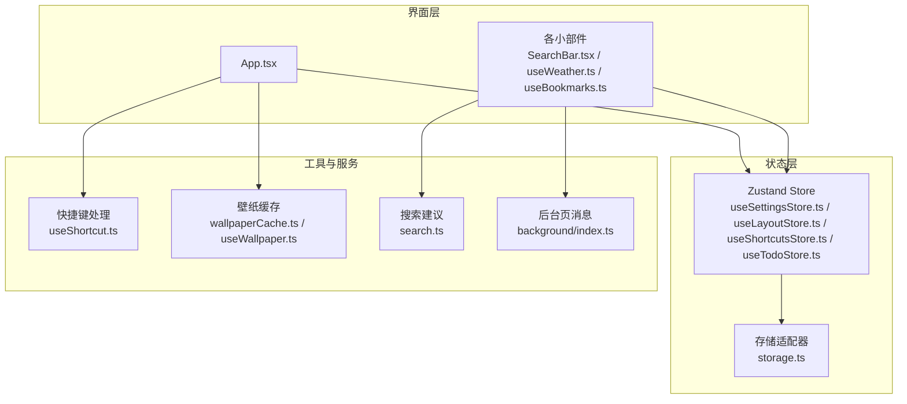
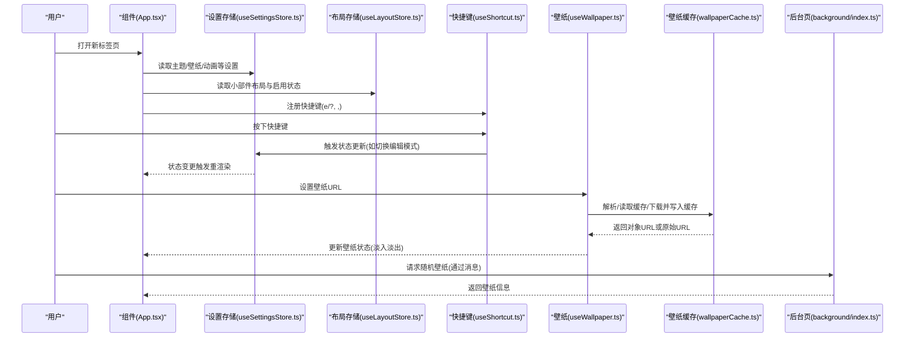
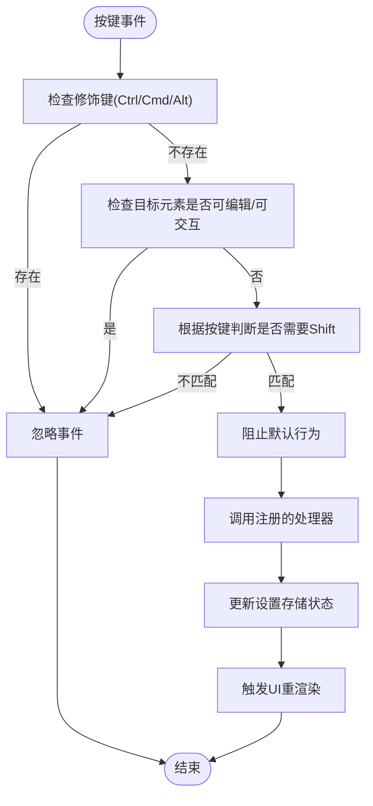
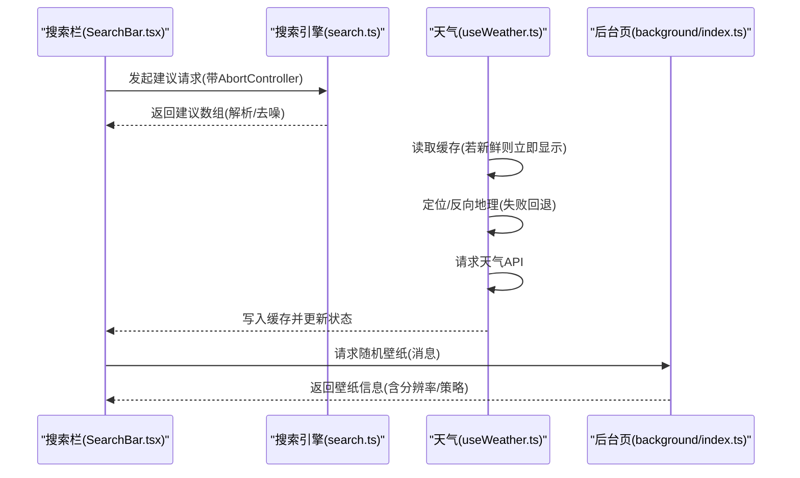
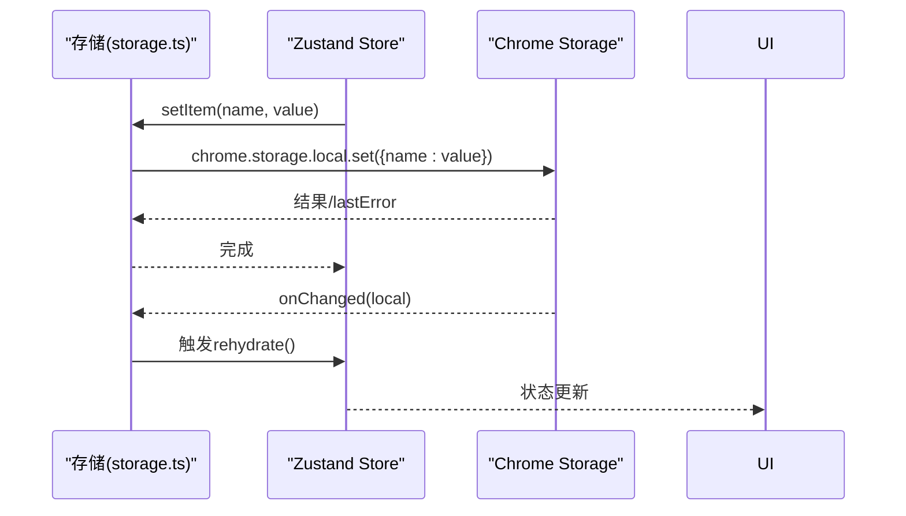
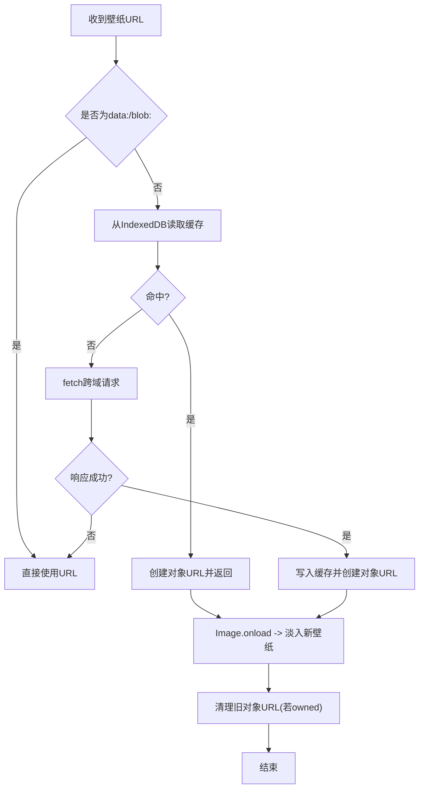
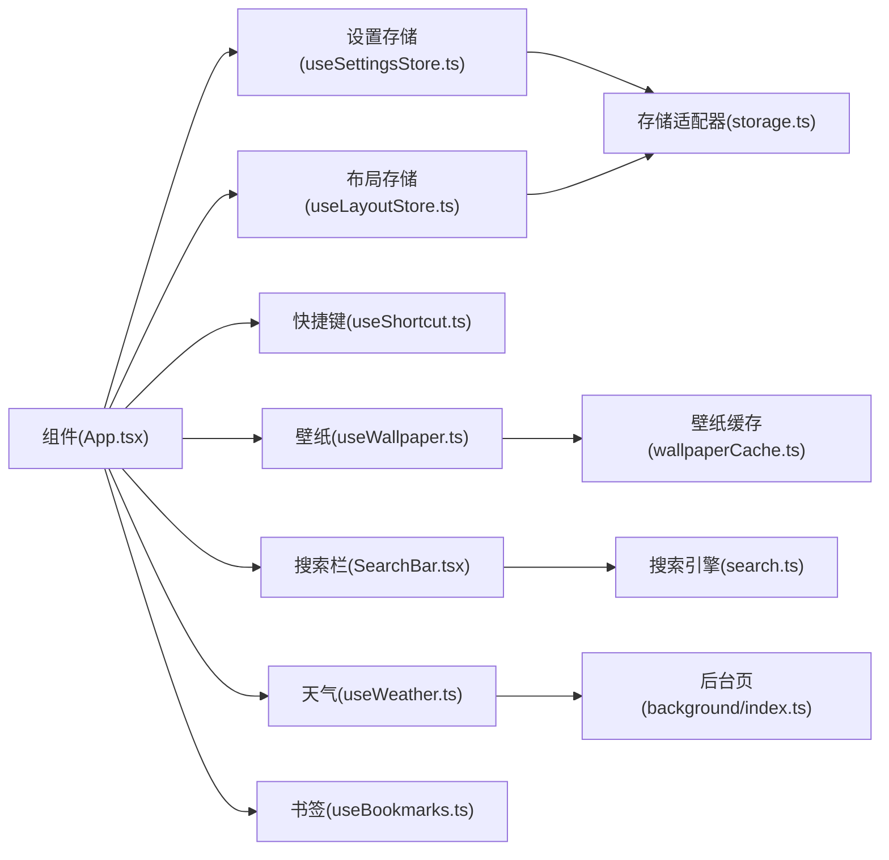

# 数据流设计

<cite>
**本文引用的文件**
- [App.tsx](file://src/newtab/App.tsx)
- [useLayoutStore.ts](file://src/store/useLayoutStore.ts)
- [useSettingsStore.ts](file://src/store/useSettingsStore.ts)
- [storage.ts](file://src/store/storage.ts)
- [wallpaperCache.ts](file://src/lib/wallpaperCache.ts)
- [useWallpaper.ts](file://src/lib/useWallpaper.ts)
- [SearchBar.tsx](file://src/components/widgets/SearchBar/SearchBar.tsx)
- [useWeather.ts](file://src/components/widgets/Weather/useWeather.ts)
- [useBookmarks.ts](file://src/components/widgets/Bookmarks/useBookmarks.ts)
- [useShortcut.ts](file://src/lib/useShortcut.ts)
- [search.ts](file://src/lib/search.ts)
- [useShortcutsStore.ts](file://src/store/useShortcutsStore.ts)
- [useTodoStore.ts](file://src/store/useTodoStore.ts)
- [wallpapers.ts](file://src/lib/wallpapers.ts)
- [index.ts](file://src/background/index.ts)
</cite>

## 目录

1. [简介](#简介)
2. [项目结构](#项目结构)
3. [核心组件](#核心组件)
4. [架构总览](#架构总览)
5. [详细组件分析](#详细组件分析)
6. [依赖关系分析](#依赖关系分析)
7. [性能考量](#性能考量)
8. [故障排查指南](#故障排查指南)
9. [结论](#结论)
10. [附录](#附录)

## 简介

本设计文档聚焦于 Tab 项目的数据流设计，系统性阐述从用户交互到状态更新再到 UI 重新渲染的完整数据流。文档覆盖三类数据流：

- 用户输入数据流：键盘快捷键与鼠标点击等交互事件如何驱动状态变更与 UI 更新。
- 异步数据流：网络请求、Chrome API 调用与后台脚本消息通信，以及相关的错误处理与重试策略。
- 持久化数据流：基于 Chrome Extension Storage 的本地存储与跨页面同步。

同时，文档解释了数据转换与验证机制（输入规范化、参数校验、错误降级），并给出缓存策略（IndexedDB 对象 URL 缓存、localStorage/chrome.storage 缓存）与性能优化建议（内存管理、对象 URL 回收、节流与防抖、可见性感知刷新）。

## 项目结构

Tab 新标签页应用采用“组件 + 存储 + 工具库”的分层组织方式：

- 组件层：负责 UI 呈现与用户交互，如搜索栏、天气、书签、时钟等小部件。
- 存储层：使用 Zustand + 持久化中间件，结合自定义存储适配器实现本地存储与跨页面同步。
- 工具库：封装通用能力，如快捷键处理、壁纸缓存、搜索建议解析、天气定位与缓存、背景页消息通信等。

图表来源

- [App.tsx:1-110](file://src/newtab/App.tsx#L1-L110)
- [useSettingsStore.ts:1-89](file://src/store/useSettingsStore.ts#L1-L89)
- [useLayoutStore.ts:1-58](file://src/store/useLayoutStore.ts#L1-L58)
- [useShortcutsStore.ts:1-54](file://src/store/useShortcutsStore.ts#L1-L54)
- [useTodoStore.ts:1-59](file://src/store/useTodoStore.ts#L1-L59)
- [storage.ts:1-63](file://src/store/storage.ts#L1-L63)
- [useShortcut.ts:1-49](file://src/lib/useShortcut.ts#L1-L49)
- [wallpaperCache.ts:1-94](file://src/lib/wallpaperCache.ts#L1-L94)
- [useWallpaper.ts:1-110](file://src/lib/useWallpaper.ts#L1-L110)
- [search.ts:1-109](file://src/lib/search.ts#L1-L109)
- [index.ts:1-174](file://src/background/index.ts#L1-L174)

章节来源

- [App.tsx:1-110](file://src/newtab/App.tsx#L1-L110)
- [useSettingsStore.ts:1-89](file://src/store/useSettingsStore.ts#L1-L89)
- [useLayoutStore.ts:1-58](file://src/store/useLayoutStore.ts#L1-L58)
- [useShortcutsStore.ts:1-54](file://src/store/useShortcutsStore.ts#L1-L54)
- [useTodoStore.ts:1-59](file://src/store/useTodoStore.ts#L1-L59)
- [storage.ts:1-63](file://src/store/storage.ts#L1-L63)
- [useShortcut.ts:1-49](file://src/lib/useShortcut.ts#L1-L49)
- [wallpaperCache.ts:1-94](file://src/lib/wallpaperCache.ts#L1-L94)
- [useWallpaper.ts:1-110](file://src/lib/useWallpaper.ts#L1-L110)
- [search.ts:1-109](file://src/lib/search.ts#L1-L109)
- [index.ts:1-174](file://src/background/index.ts#L1-L174)

## 核心组件

- 设置存储（主题、搜索引擎、壁纸、动画偏好等）
  - 提供状态读取与写入接口，并通过持久化中间件与存储适配器实现本地存储与跨页面同步。
- 布局存储（小部件布局与启用状态）
  - 记录小部件位置、尺寸与启用列表，支持重置与迁移。
- 快捷键钩子
  - 在全局键盘事件上进行过滤与去抖，避免与浏览器/操作系统快捷键冲突。
- 壁纸缓存与加载
  - 使用 IndexedDB 存储壁纸二进制，结合对象 URL 实现跨淡入淡出切换；自动回收不再使用的对象 URL。
- 搜索建议与提交
  - 支持多搜索引擎，统一建议解析与 JSONP 包装处理；带防抖与取消控制。
- 天气数据
  - 定位 + 反向地理 + 天气 API，采用“先缓存后刷新”策略，可见性变化触发刷新。
- 书签数据
  - 通过 Chrome Bookmarks API 获取树形结构，监听变更事件实时更新。
- 后台页消息
  - 为受限环境（如墙纸 API）提供 MV2/MV3 兼容的消息通道。

章节来源

- [useSettingsStore.ts:1-89](file://src/store/useSettingsStore.ts#L1-L89)
- [useLayoutStore.ts:1-58](file://src/store/useLayoutStore.ts#L1-L58)
- [useShortcut.ts:1-49](file://src/lib/useShortcut.ts#L1-L49)
- [wallpaperCache.ts:1-94](file://src/lib/wallpaperCache.ts#L1-L94)
- [useWallpaper.ts:1-110](file://src/lib/useWallpaper.ts#L1-L110)
- [search.ts:1-109](file://src/lib/search.ts#L1-L109)
- [useWeather.ts:1-192](file://src/components/widgets/Weather/useWeather.ts#L1-L192)
- [useBookmarks.ts:1-55](file://src/components/widgets/Bookmarks/useBookmarks.ts#L1-L55)
- [index.ts:1-174](file://src/background/index.ts#L1-L174)

## 架构总览

下图展示了从用户交互到状态更新再到 UI 重新渲染的端到端数据流，以及异步数据源与持久化层的集成点。

图表来源

- [App.tsx:1-110](file://src/newtab/App.tsx#L1-L110)
- [useSettingsStore.ts:1-89](file://src/store/useSettingsStore.ts#L1-L89)
- [useLayoutStore.ts:1-58](file://src/store/useLayoutStore.ts#L1-L58)
- [useShortcut.ts:1-49](file://src/lib/useShortcut.ts#L1-L49)
- [useWallpaper.ts:1-110](file://src/lib/useWallpaper.ts#L1-L110)
- [wallpaperCache.ts:1-94](file://src/lib/wallpaperCache.ts#L1-L94)
- [index.ts:1-174](file://src/background/index.ts#L1-L174)

## 详细组件分析

### 用户输入数据流：键盘快捷键与鼠标点击

- 快捷键过滤规则
  - 避免与浏览器/操作系统快捷键冲突（排除 Ctrl/Cmd/Alt）。
  - 对需要 Shift 的字符进行严格匹配，防止误触。
  - 仅在非可编辑/非交互元素焦点时生效，避免干扰输入。
- 点击与设置面板
  - 编辑模式切换、设置抽屉、帮助面板开关均通过设置存储的状态变更驱动 UI 切换。

图表来源

- [useShortcut.ts:1-49](file://src/lib/useShortcut.ts#L1-L49)
- [App.tsx:21-23](file://src/newtab/App.tsx#L21-L23)

章节来源

- [useShortcut.ts:1-49](file://src/lib/useShortcut.ts#L1-L49)
- [App.tsx:21-23](file://src/newtab/App.tsx#L21-L23)

### 异步数据流：网络请求、Chrome API 调用与后台消息

- 搜索建议
  - 输入防抖 + 取消控制器，避免频繁请求与竞态。
  - 统一解析 OpenSearch 协议与特定引擎返回格式，处理 JSONP 包装。
- 天气数据
  - 定位失败时回退至默认城市；反向地理缓存减少重复请求。
  - “先显示缓存，再刷新”的策略提升首屏体验；可见性变化触发刷新。
- 书签数据
  - 通过 Chrome Bookmarks API 获取树形结构，监听变更事件实时更新。
- 壁纸随机获取
  - 通过后台页消息桥接受限 API，支持策略回退链与速率限制友好处理。

图表来源

- [SearchBar.tsx:20-32](file://src/components/widgets/SearchBar/SearchBar.tsx#L20-L32)
- [search.ts:88-109](file://src/lib/search.ts#L88-L109)
- [useWeather.ts:131-192](file://src/components/widgets/Weather/useWeather.ts#L131-L192)
- [index.ts:132-174](file://src/background/index.ts#L132-L174)

章节来源

- [SearchBar.tsx:20-32](file://src/components/widgets/SearchBar/SearchBar.tsx#L20-L32)
- [search.ts:88-109](file://src/lib/search.ts#L88-L109)
- [useWeather.ts:131-192](file://src/components/widgets/Weather/useWeather.ts#L131-L192)
- [index.ts:132-174](file://src/background/index.ts#L132-L174)

### 持久化数据流：存储读写与跨页面同步

- 存储适配器
  - 自动检测运行环境（扩展 vs Web），选择 chrome.storage.local 或 localStorage。
  - 封装 getItem/setItem/removeItem 并处理 runtime.lastError。
- Zustand 持久化
  - 通过 persist 中间件与 createJSONStorage 包装存储适配器，实现状态序列化与恢复。
  - 支持版本迁移与跳过水合（skipHydration）以避免 SSR 不一致。
- 跨页面同步
  - 监听 chrome.storage.onChanged，按键名分发回调，触发对应 store 的 rehydrate。

图表来源

- [storage.ts:1-63](file://src/store/storage.ts#L1-L63)
- [useSettingsStore.ts:35-84](file://src/store/useSettingsStore.ts#L35-L84)
- [useLayoutStore.ts:32-54](file://src/store/useLayoutStore.ts#L32-L54)

章节来源

- [storage.ts:1-63](file://src/store/storage.ts#L1-L63)
- [useSettingsStore.ts:35-84](file://src/store/useSettingsStore.ts#L35-L84)
- [useLayoutStore.ts:32-54](file://src/store/useLayoutStore.ts#L32-L54)

### 壁纸数据流：对象 URL 管理与缓存策略

- 解析流程
  - 对于 data:/blob: 直接返回；否则尝试 IndexedDB 缓存命中；未命中则发起跨域请求并写入缓存。
- 渲染与淡入
  - 旧壁纸作为底层保留，新壁纸加载完成后淡入；失败时回退至上一张壁纸。
- 内存管理
  - 记录已创建的对象 URL，组件卸载时统一回收，避免内存泄漏。

图表来源

- [useWallpaper.ts:1-110](file://src/lib/useWallpaper.ts#L1-L110)
- [wallpaperCache.ts:1-94](file://src/lib/wallpaperCache.ts#L1-L94)

章节来源

- [useWallpaper.ts:1-110](file://src/lib/useWallpaper.ts#L1-L110)
- [wallpaperCache.ts:1-94](file://src/lib/wallpaperCache.ts#L1-L94)

### 数据转换与验证机制

- 输入规范化
  - 搜索建议解析：统一解析 OpenSearch 协议，对特定引擎（如百度）进行自定义解析与 JSONP 包装剥离。
  - 快捷键：对大小写敏感字符与特殊符号进行严格匹配，避免误触发。
- 错误处理
  - 搜索建议：捕获异常并返回空数组；对 AbortError 进行静默处理。
  - 天气：定位失败回退默认城市；API 失败记录错误并保持上次可用数据。
  - 书签：捕获 runtime.lastError 并记录日志，向 UI 抛出错误状态。
  - 壁纸：对象 URL 加载失败回退至上一张壁纸并回收对象 URL。
- 参数校验
  - 设置存储对壁纸亮度进行裁剪，确保合法范围。

章节来源

- [search.ts:16-38](file://src/lib/search.ts#L16-L38)
- [search.ts:88-109](file://src/lib/search.ts#L88-L109)
- [useWeather.ts:115-129](file://src/components/widgets/Weather/useWeather.ts#L115-L129)
- [useBookmarks.ts:28-38](file://src/components/widgets/Bookmarks/useBookmarks.ts#L28-L38)
- [useWallpaper.ts:73-85](file://src/lib/useWallpaper.ts#L73-L85)
- [useSettingsStore.ts:33](file://src/store/useSettingsStore.ts#L33)

## 依赖关系分析

- 组件与存储
  - App 与各小部件通过 hooks 读取/更新设置与布局存储，形成单向数据流。
- 存储与适配器
  - 存储适配器向上游暴露统一的 getItem/setItem/removeItem 接口，屏蔽运行时差异。
- 工具库与外部服务
  - 搜索建议依赖搜索引擎元数据与解析器；天气依赖定位与第三方 API；书签依赖 Chrome Bookmarks API；壁纸依赖后台页消息。
- 后台页与前台页
  - 前台页通过 chrome.runtime.sendMessage 与后台页建立消息通道，后台页负责受限 API 的访问与策略回退。

图表来源

- [App.tsx:1-110](file://src/newtab/App.tsx#L1-L110)
- [useSettingsStore.ts:1-89](file://src/store/useSettingsStore.ts#L1-L89)
- [useLayoutStore.ts:1-58](file://src/store/useLayoutStore.ts#L1-L58)
- [storage.ts:1-63](file://src/store/storage.ts#L1-L63)
- [useShortcut.ts:1-49](file://src/lib/useShortcut.ts#L1-L49)
- [useWallpaper.ts:1-110](file://src/lib/useWallpaper.ts#L1-L110)
- [wallpaperCache.ts:1-94](file://src/lib/wallpaperCache.ts#L1-L94)
- [SearchBar.tsx:1-116](file://src/components/widgets/SearchBar/SearchBar.tsx#L1-L116)
- [search.ts:1-109](file://src/lib/search.ts#L1-L109)
- [useWeather.ts:1-192](file://src/components/widgets/Weather/useWeather.ts#L1-L192)
- [useBookmarks.ts:1-55](file://src/components/widgets/Bookmarks/useBookmarks.ts#L1-L55)
- [index.ts:1-174](file://src/background/index.ts#L1-L174)

章节来源

- [App.tsx:1-110](file://src/newtab/App.tsx#L1-L110)
- [storage.ts:1-63](file://src/store/storage.ts#L1-L63)
- [search.ts:1-109](file://src/lib/search.ts#L1-L109)
- [useWeather.ts:1-192](file://src/components/widgets/Weather/useWeather.ts#L1-L192)
- [useBookmarks.ts:1-55](file://src/components/widgets/Bookmarks/useBookmarks.ts#L1-L55)
- [index.ts:1-174](file://src/background/index.ts#L1-L174)

## 性能考量

- 缓存策略
  - IndexedDB 对象 URL 缓存：减少重复下载与解码开销，支持命中即返回对象 URL。
  - localStorage/chrome.storage 缓存：天气与反向地理结果短期复用，降低请求频率。
- 内存管理
  - 对象 URL 回收：组件卸载时统一撤销，避免内存泄漏。
  - 仅保留当前壁纸缓存：定期清理其他条目，控制数据库体积。
- 请求优化
  - 搜索建议防抖与取消：避免高频请求与竞态。
  - 天气刷新策略：可见性变化触发刷新，减少后台消耗。
- 动画与渲染
  - 减少动画偏好：通过设置存储控制过渡时间，降低重排成本。

章节来源

- [wallpaperCache.ts:49-68](file://src/lib/wallpaperCache.ts#L49-L68)
- [useWallpaper.ts:18-29](file://src/lib/useWallpaper.ts#L18-L29)
- [SearchBar.tsx:20-32](file://src/components/widgets/SearchBar/SearchBar.tsx#L20-L32)
- [useWeather.ts:176-188](file://src/components/widgets/Weather/useWeather.ts#L176-L188)
- [useSettingsStore.ts:13](file://src/store/useSettingsStore.ts#L13)

## 故障排查指南

- 搜索建议无响应
  - 检查 AbortController 是否提前取消；确认网络请求返回状态码与解析逻辑。
- 天气数据不更新
  - 确认缓存是否新鲜；检查定位权限与反向地理缓存；关注可见性事件绑定。
- 书签加载失败
  - 查看 runtime.lastError 日志；确认扩展权限与 Bookmarks API 可用性。
- 壁纸无法显示
  - 检查对象 URL 是否被回收；确认图片加载回调与错误回退逻辑。
- 存储读写异常
  - 检查 chrome.storage.local 的 lastError；确认运行环境（扩展 vs Web）与存储适配器行为。

章节来源

- [search.ts:103-108](file://src/lib/search.ts#L103-L108)
- [useWeather.ts:165-169](file://src/components/widgets/Weather/useWeather.ts#L165-L169)
- [useBookmarks.ts:28-38](file://src/components/widgets/Bookmarks/useBookmarks.ts#L28-L38)
- [useWallpaper.ts:73-85](file://src/lib/useWallpaper.ts#L73-L85)
- [storage.ts:18-30](file://src/store/storage.ts#L18-L30)

## 结论

本设计文档系统梳理了 Tab 项目的数据流：用户交互通过快捷键与小部件驱动状态变更，Zustand 持久化保证跨页面一致性，工具库与后台页协同处理异步与受限资源，缓存与内存管理共同保障性能与稳定性。通过清晰的分层与严格的错误处理，系统在复杂异步场景下仍能保持良好的用户体验与可维护性。

## 附录

- 关键流程图与时序图已在相应章节中给出，便于快速定位问题与优化方向。
- 建议在新增功能时遵循现有数据流模式：优先使用 hooks 读取状态，必要时通过消息或存储进行跨页同步，始终注意错误处理与资源回收。
