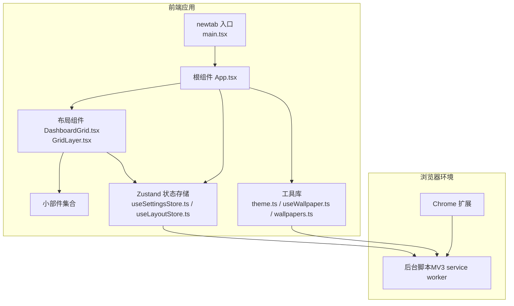
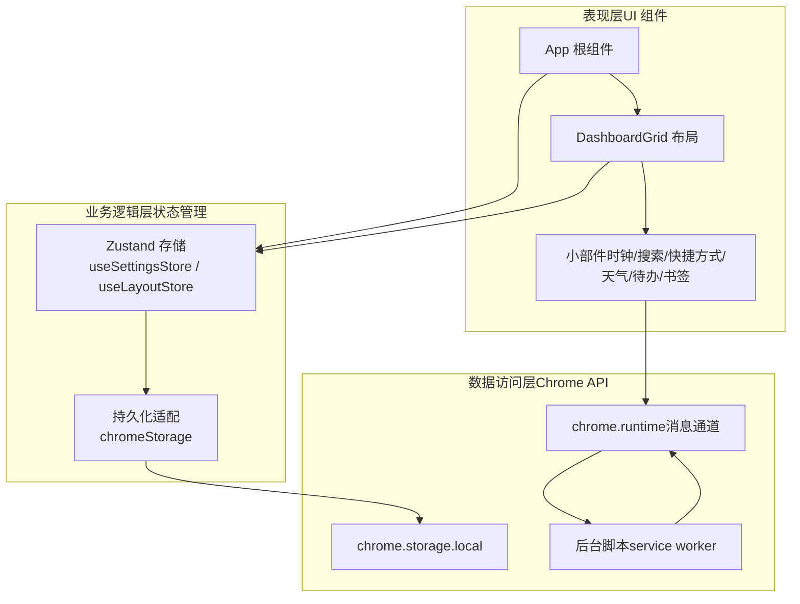
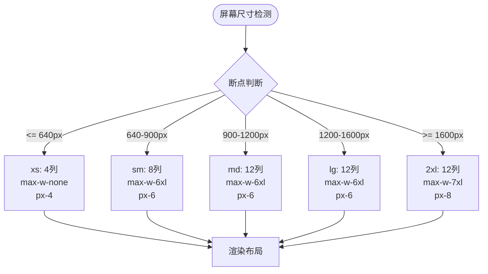
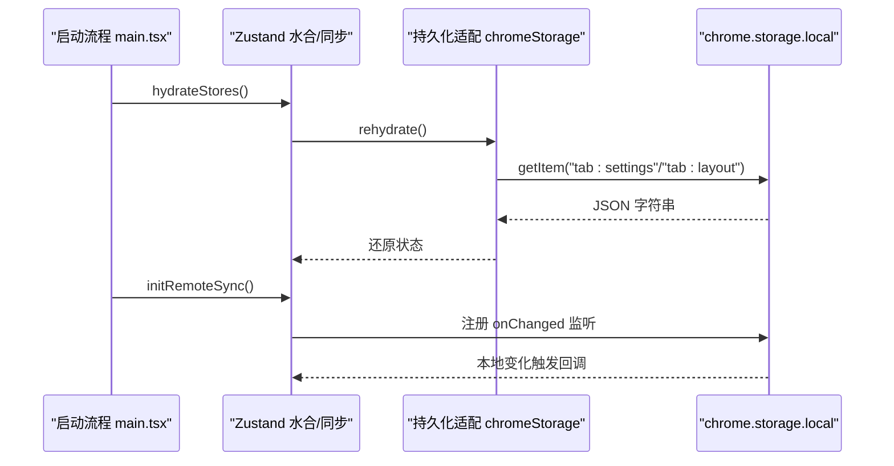
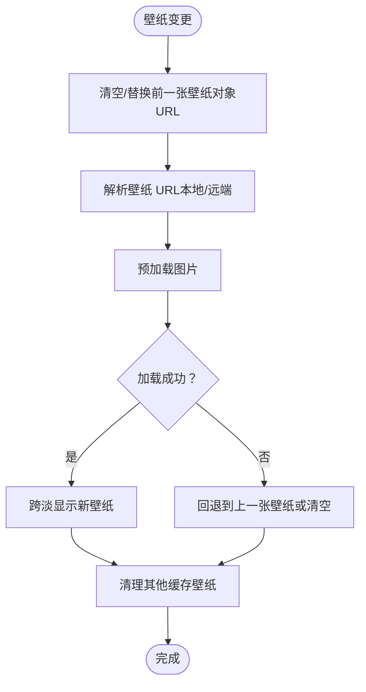
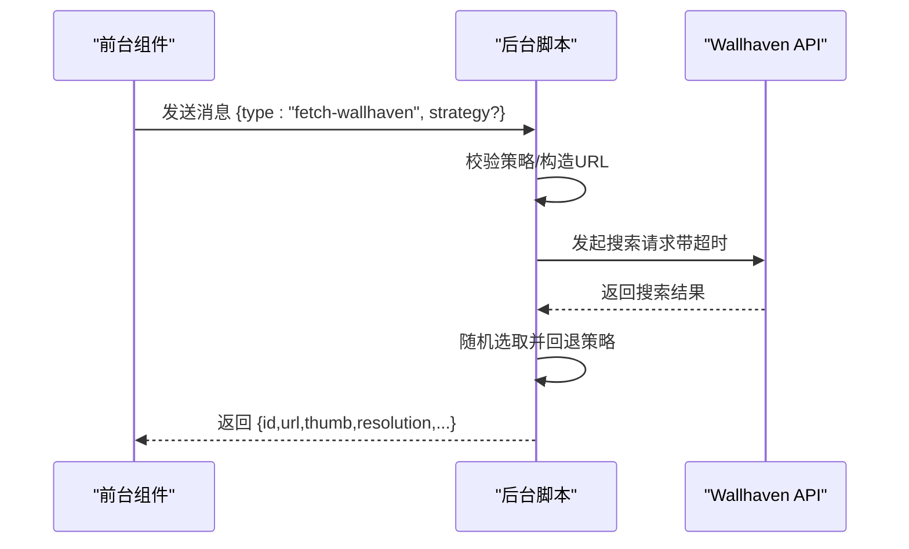
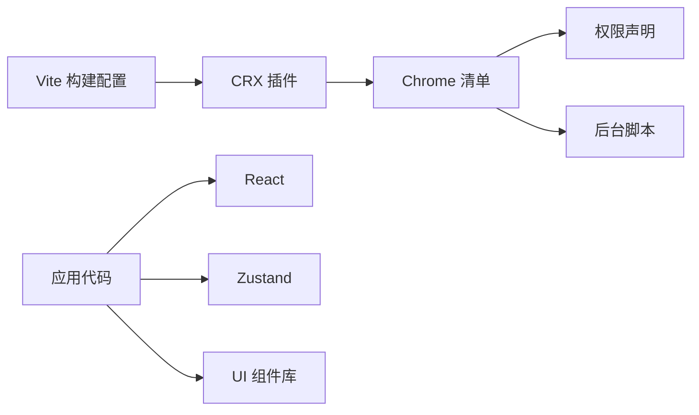

# 整体架构概览

<cite>
**本文引用的文件**
- [README.md](file://README.md)
- [manifest.config.ts](file://manifest.config.ts)
- [package.json](file://package.json)
- [vite.config.ts](file://vite.config.ts)
- [src/newtab/main.tsx](file://src/newtab/main.tsx)
- [src/newtab/App.tsx](file://src/newtab/App.tsx)
- [src/store/storage.ts](file://src/store/storage.ts)
- [src/store/useSettingsStore.ts](file://src/store/useSettingsStore.ts)
- [src/store/useLayoutStore.ts](file://src/store/useLayoutStore.ts)
- [src/components/layout/DashboardGrid.tsx](file://src/components/layout/DashboardGrid.tsx)
- [src/components/layout/GridLayer.tsx](file://src/components/layout/GridLayer.tsx)
- [src/components/layout/DashboardGrid.css](file://src/components/layout/DashboardGrid.css)
- [src/lib/useWallpaper.ts](file://src/lib/useWallpaper.ts)
- [src/lib/theme.ts](file://src/lib/theme.ts)
- [src/lib/wallpapers.ts](file://src/lib/wallpapers.ts)
- [src/background/index.ts](file://src/background/index.ts)
- [src/types/widget.ts](file://src/types/widget.ts)
- [tailwind.config.ts](file://tailwind.config.ts)
- [src/styles/globals.css](file://src/styles/globals.css)
</cite>

## 更新摘要

**变更内容**

- 更新了应用布局响应式断点的描述，从 max-w-6xl 扩展到 xl:max-w-7xl 和 2xl:max-w-7xl，移除了 XL 特定的最大宽度类
- 修正了布局系统的响应式设计分析，反映实际的断点配置
- 更新了组件化架构中布局层的技术实现细节

## 目录

1. [引言](#引言)
2. [项目结构](#项目结构)
3. [核心组件](#核心组件)
4. [架构总览](#架构总览)
5. [详细组件分析](#详细组件分析)
6. [依赖分析](#依赖分析)
7. [性能考虑](#性能考虑)
8. [故障排查指南](#故障排查指南)
9. [结论](#结论)
10. [附录](#附录)

## 引言

本文件面向 Tab 项目，提供整体架构概览与系统边界说明。项目采用 React + Vite + Chrome 扩展技术栈，构建一个 macOS 风格的 Chrome 新标签页扩展。系统以"表现层（UI 组件）—业务逻辑层（状态管理）—数据访问层（Chrome API）"的三层架构组织，强调组件化设计与可维护性。

- 表现层：由 React 组件构成，负责界面渲染、交互与动画效果。
- 业务逻辑层：通过 Zustand 状态管理，实现跨组件的状态共享与持久化。
- 数据访问层：封装 Chrome API（如 chrome.storage、chrome.runtime），并处理网络请求与权限模型。

系统边界清晰：新标签页页面为入口，后台脚本（service worker）承载部分受限网络请求，扩展清单定义权限与生命周期。

## 项目结构

项目采用按功能域划分的目录组织方式，便于模块化开发与测试隔离：

- src/newtab：新标签页入口 HTML 与 React 根组件
- src/components：UI 组件、布局、小部件与设置抽屉
- src/store：Zustand 状态存储与持久化适配
- src/lib：通用工具函数（主题、壁纸、搜索等）
- src/background：后台脚本（MV3 service worker）
- src/types：共享类型定义
- 构建与清单：Vite 配置、Chrome 清单与包管理



**图表来源**

- [src/newtab/main.tsx:1-29](file://src/newtab/main.tsx#L1-L29)
- [src/newtab/App.tsx:1-110](file://src/newtab/App.tsx#L1-L110)
- [src/components/layout/DashboardGrid.tsx:1-110](file://src/components/layout/DashboardGrid.tsx#L1-L110)
- [src/store/useSettingsStore.ts:1-89](file://src/store/useSettingsStore.ts#L1-L89)
- [src/store/useLayoutStore.ts:1-58](file://src/store/useLayoutStore.ts#L1-L58)
- [src/lib/theme.ts:1-123](file://src/lib/theme.ts#L1-L123)
- [src/lib/useWallpaper.ts:1-110](file://src/lib/useWallpaper.ts#L1-L110)
- [src/background/index.ts:1-174](file://src/background/index.ts#L1-L174)

**章节来源**

- [README.md:54-68](file://README.md#L54-L68)
- [vite.config.ts:1-46](file://vite.config.ts#L1-L46)

## 核心组件

- 应用根组件 App：协调壁纸层叠、主题与键盘快捷键，承载设置抽屉与帮助面板，并注入 DashboardGrid 布局容器。
- 状态存储层：使用 Zustand + persist 中间件，结合自定义的 chromeStorage 适配器，实现本地持久化与多页面同步。
- 布局与小部件：DashboardGrid 负责响应式网格布局与拖拽重排；各小部件（时钟、搜索、快捷方式、天气、待办、书签）按需懒加载，降低首屏体积。
- 工具库：主题初始化与动态切换、壁纸解析与跨淡过渡、壁纸预设与调色提取。

**章节来源**

- [src/newtab/App.tsx:10-110](file://src/newtab/App.tsx#L10-L110)
- [src/store/useSettingsStore.ts:35-89](file://src/store/useSettingsStore.ts#L35-L89)
- [src/store/useLayoutStore.ts:32-58](file://src/store/useLayoutStore.ts#L32-L58)
- [src/components/layout/DashboardGrid.tsx:42-110](file://src/components/layout/DashboardGrid.tsx#L42-L110)
- [src/lib/theme.ts:68-123](file://src/lib/theme.ts#L68-L123)
- [src/lib/useWallpaper.ts:11-110](file://src/lib/useWallpaper.ts#L11-L110)
- [src/lib/wallpapers.ts:1-69](file://src/lib/wallpapers.ts#L1-L69)

## 架构总览

下图展示了三层架构在运行时的交互关系与数据流向：



**图表来源**

- [src/newtab/App.tsx:10-110](file://src/newtab/App.tsx#L10-L110)
- [src/components/layout/DashboardGrid.tsx:42-110](file://src/components/layout/DashboardGrid.tsx#L42-L110)
- [src/store/storage.ts:1-63](file://src/store/storage.ts#L1-L63)
- [src/store/useSettingsStore.ts:35-89](file://src/store/useSettingsStore.ts#L35-L89)
- [src/store/useLayoutStore.ts:32-58](file://src/store/useLayoutStore.ts#L32-L58)
- [src/background/index.ts:132-174](file://src/background/index.ts#L132-L174)

## 详细组件分析

### 响应式布局系统与断点配置

**更新** 应用布局的响应式断点配置已调整，移除了 XL 特定的最大宽度类

- 断点配置
  - 主容器使用 `max-w-6xl 2xl:max-w-7xl` 实现渐进式宽度扩展
  - 内边距采用 `px-6 2xl:px-8` 支持不同屏幕密度
  - 移除了 XL 特定的最大宽度类（xl:max-w-7xl），避免在标准桌面环境中出现意外布局扩展
- 技术实现
  - GridLayer 组件维持原有的响应式断点配置（lg: 1200px, md: 900px, sm: 640px, xs: 0px）
  - 快捷方式网格通过容器查询优化布局，支持从 4 列到 12 列的自适应
- 设计考量
  - 保持移动端紧凑布局的同时，充分利用桌面端大屏空间
  - 通过容器查询优化快捷方式网格布局，支持从 4 列到 12 列的自适应
  - 移除 XL 特定断点避免常见笔记本分辨率导致的意外布局扩展



**图表来源**

- [src/newtab/App.tsx:102](file://src/newtab/App.tsx#L102)
- [src/components/layout/GridLayer.tsx:32-33](file://src/components/layout/GridLayer.tsx#L32-L33)
- [src/components/layout/DashboardGrid.css:68-97](file://src/components/layout/DashboardGrid.css#L68-L97)

**章节来源**

- [src/newtab/App.tsx:102](file://src/newtab/App.tsx#L102)
- [src/components/layout/GridLayer.tsx:32-33](file://src/components/layout/GridLayer.tsx#L32-L33)
- [src/components/layout/DashboardGrid.css:68-97](file://src/components/layout/DashboardGrid.css#L68-L97)

### 状态管理与持久化（Zustand）

- 设计要点
  - 使用 Zustand 简化状态订阅与更新，避免样板代码。
  - 结合 persist 中间件与 createJSONStorage，将状态序列化到 chrome.storage.local 或开发环境的 localStorage。
  - 提供注册水合与远程同步回调，确保多实例新标签页一致。
- 关键流程
  - 启动阶段：main.tsx 调用 hydrateStores 完成初始水合；initRemoteSync 订阅 storage 变更事件。
  - 设置存储：useSettingsStore 持久化主题、玻璃模式、搜索引擎、壁纸、编辑模式与动效偏好。
  - 布局存储：useLayoutStore 持久化小部件布局与启用状态。
- 技术权衡
  - 选择 Zustand 而非 Redux 的原因：更轻量、API 更简洁、无需中间件链与样板代码；对 Chrome 扩展场景足够高效且易维护。
  - 远程同步：通过 chrome.storage.onChanged 实现跨页面一致性，避免竞态与不一致。



**图表来源**

- [src/newtab/main.tsx:11-29](file://src/newtab/main.tsx#L11-L29)
- [src/store/storage.ts:41-62](file://src/store/storage.ts#L41-L62)
- [src/store/useSettingsStore.ts:87-89](file://src/store/useSettingsStore.ts#L87-L89)
- [src/store/useLayoutStore.ts:56-58](file://src/store/useLayoutStore.ts#L56-L58)

**章节来源**

- [src/store/storage.ts:1-63](file://src/store/storage.ts#L1-L63)
- [src/store/useSettingsStore.ts:35-89](file://src/store/useSettingsStore.ts#L35-L89)
- [src/store/useLayoutStore.ts:32-58](file://src/store/useLayoutStore.ts#L32-L58)
- [src/newtab/main.tsx:11-29](file://src/newtab/main.tsx#L11-L29)

### 主题与壁纸系统

- 主题初始化与动态切换：theme.ts 在应用启动时读取设置并应用到 documentElement，同时监听系统偏好变化与用户设置变更。
- 壁纸解析与跨淡：useWallpaper.ts 将壁纸 URL 解析为对象 URL 并进行跨淡过渡，避免闪烁；同时清理不再使用的对象 URL，防止内存泄漏。
- 壁纸预设与调色：wallpapers.ts 提供内置预设；theme.ts 通过壁纸调色计算对比度，驱动 UI 文字可读性。



**图表来源**

- [src/lib/useWallpaper.ts:21-98](file://src/lib/useWallpaper.ts#L21-L98)
- [src/lib/theme.ts:47-106](file://src/lib/theme.ts#L47-L106)
- [src/lib/wallpapers.ts:1-69](file://src/lib/wallpapers.ts#L1-L69)

**章节来源**

- [src/lib/theme.ts:68-123](file://src/lib/theme.ts#L68-L123)
- [src/lib/useWallpaper.ts:11-110](file://src/lib/useWallpaper.ts#L11-L110)
- [src/lib/wallpapers.ts:1-69](file://src/lib/wallpapers.ts#L1-L69)

### 布局与小部件

- DashboardGrid：根据启用的小部件生成可见布局，支持响应式断点与移动端适配；在编辑模式下提供拖拽句柄与最小尺寸约束。
- GridLayer：封装 react-grid-layout，支持多断点布局（lg: 1200px, md: 900px, sm: 640px, xs: 0px），提供 4-12 列网格系统。
- 小部件懒加载：通过 React.lazy 与 Suspense 延迟加载 react-grid-layout 及其样式，优化首屏性能。
- 类型安全：widget.ts 定义小部件 ID、标签与布局接口，保证跨模块一致性。

```mermaid
classDiagram
class DashboardGrid {
+visible : WidgetLayout[]
+editMode : boolean
+onLayoutChange()
+onBreakpointChange()
}
class GridLayer {
+breakpoints : {lg : 1200,md : 900,sm : 640,xs : 0}
+cols : {lg : 12,md : 12,sm : 8,xs : 4}
+rowHeight : 60
+margin : [16,16]
}
class WidgetFrame {
+editMode : boolean
+transparent : boolean
}
class Widget_SearchBar
class Widget_Clock
class Widget_ShortcutsGrid
class Widget_Weather
class Widget_TodoList
class Widget_BookmarksTree
DashboardGrid --> GridLayer : "包装"
GridLayer --> WidgetFrame : "渲染"
WidgetFrame --> Widget_SearchBar : "渲染"
WidgetFrame --> Widget_Clock : "渲染"
WidgetFrame --> Widget_ShortcutsGrid : "渲染"
WidgetFrame --> Widget_Weather : "渲染"
WidgetFrame --> Widget_TodoList : "渲染"
WidgetFrame --> Widget_BookmarksTree : "渲染"
```

**图表来源**

- [src/components/layout/DashboardGrid.tsx:42-110](file://src/components/layout/DashboardGrid.tsx#L42-L110)
- [src/components/layout/GridLayer.tsx:20-49](file://src/components/layout/GridLayer.tsx#L20-L49)
- [src/types/widget.ts:8-34](file://src/types/widget.ts#L8-L34)

**章节来源**

- [src/components/layout/DashboardGrid.tsx:17-22](file://src/components/layout/DashboardGrid.tsx#L17-L22)
- [src/components/layout/GridLayer.tsx:32-33](file://src/components/layout/GridLayer.tsx#L32-L33)
- [src/types/widget.ts:1-34](file://src/types/widget.ts#L1-L34)

### 后台脚本与网络请求

- 角色定位：后台脚本承载需要同源或受限网络访问的逻辑，例如 Wallhaven 随机壁纸抓取。
- 请求策略：按时间窗口降级回退，提升成功率；带超时控制与友好错误提示。
- 消息通道：前台通过 chrome.runtime.sendMessage 触发后台任务，后台异步返回结果。



**图表来源**

- [src/background/index.ts:132-174](file://src/background/index.ts#L132-L174)
- [src/background/index.ts:82-111](file://src/background/index.ts#L82-L111)

**章节来源**

- [src/background/index.ts:1-174](file://src/background/index.ts#L1-L174)

## 依赖分析

- 构建与打包：Vite + CRXJS 插件，别名 @ 指向 src；手动分包策略将 React/Zustand 等第三方库拆分为 vendor chunk，降低新标签页入口包体波动。
- 运行时依赖：React、Zustand、lucide-react、react-grid-layout、Tailwind 生态。
- 清单与权限：声明 MV3、service worker、chrome_url_overrides、storage、bookmarks、unlimitedStorage、tabs、geolocation 等权限与 host 权限白名单。



**图表来源**

- [vite.config.ts:7-46](file://vite.config.ts#L7-L46)
- [manifest.config.ts:4-38](file://manifest.config.ts#L4-L38)
- [package.json:18-26](file://package.json#L18-L26)

**章节来源**

- [vite.config.ts:1-46](file://vite.config.ts#L1-L46)
- [manifest.config.ts:1-38](file://manifest.config.ts#L1-L38)
- [package.json:1-56](file://package.json#L1-L56)

## 性能考虑

- 代码分割与懒加载：DashboardGrid 对 react-grid-layout 进行懒加载，减少首屏 JS 体积。
- 第三方库分包：Vite 手动分包策略将 React/Zustand 独立为 vendor chunk，避免应用代码改动导致大包体变化。
- 动画与渲染：App 使用 will-change 与 CSS 变量驱动过渡，减少强制同步布局；useWallpaper 控制跨淡时长与可选动画。
- 存储与同步：Zustand 持久化仅在必要时写入，chrome.storage 错误路径有日志记录，避免阻塞主线程。
- 响应式优化：通过容器查询优化快捷方式网格布局，减少不必要的重排。

**章节来源**

- [src/components/layout/DashboardGrid.tsx:17-22](file://src/components/layout/DashboardGrid.tsx#L17-L22)
- [vite.config.ts:19-32](file://vite.config.ts#L19-L32)
- [src/newtab/App.tsx:18-19](file://src/newtab/App.tsx#L18-L19)
- [src/store/storage.ts:6-32](file://src/store/storage.ts#L6-L32)
- [src/components/layout/DashboardGrid.css:68-97](file://src/components/layout/DashboardGrid.css#L68-L97)

## 故障排查指南

- 新标签页无法加载或空白
  - 检查入口元素 #root 是否存在，确认 main.tsx 的挂载逻辑。
  - 确认 hydrateStores 是否执行成功，检查 chrome.storage.local 读取是否报错。
- 壁纸不显示或闪烁
  - 检查 useWallpaper 的对象 URL 生命周期与 revoke 逻辑；确认图片 onload/onerror 分支。
  - 确认壁纸预设 URL 可达性与跨域策略。
- 主题/动效未生效
  - 检查 theme.ts 的订阅与 applyXXX 函数调用顺序；确认系统偏好变化监听是否注册。
- 多标签页不同步
  - 确认 initRemoteSync 是否被调用；检查 chrome.storage.onChanged 回调是否正确注册。
- 后台脚本请求失败
  - 查看后台脚本的超时与回退策略；确认 host 权限是否包含目标域名。
- 响应式布局异常
  - 检查断点配置是否正确，确认 2xl 断点的内边距设置。
  - 验证 GridLayer 的响应式断点与列数配置。

**章节来源**

- [src/newtab/main.tsx:15-25](file://src/newtab/main.tsx#L15-L25)
- [src/store/storage.ts:41-62](file://src/store/storage.ts#L41-L62)
- [src/lib/useWallpaper.ts:21-98](file://src/lib/useWallpaper.ts#L21-L98)
- [src/lib/theme.ts:97-122](file://src/lib/theme.ts#L97-L122)
- [src/background/index.ts:141-173](file://src/background/index.ts#L141-L173)
- [src/newtab/App.tsx:102](file://src/newtab/App.tsx#L102)
- [src/components/layout/GridLayer.tsx:32-33](file://src/components/layout/GridLayer.tsx#L32-L33)

## 结论

Tab 项目通过 React + Vite + Chrome 扩展的组合，实现了清晰的三层架构与组件化设计。Zustand 的引入简化了状态管理与持久化，配合自定义的 chromeStorage 适配，满足扩展场景下的数据一致性需求。后台脚本承担受限网络请求，保障用户体验与权限合规。整体架构在性能、可维护性与扩展性之间取得良好平衡，适合进一步迭代与功能拓展。

**更新后的响应式布局系统** 通过移除 XL 特定断点，提供了更一致的布局行为，避免常见笔记本分辨率导致的意外布局扩展，同时保持了从移动端到桌面端的完整响应式体验。

## 附录

- 开发与安装：参考 README 的安装与热重载说明。
- 键盘快捷键：README 的快捷键表格。
- 项目结构概览：README 的目录结构说明。

**章节来源**

- [README.md:20-53](file://README.md#L20-L53)
- [README.md:54-68](file://README.md#L54-L68)
