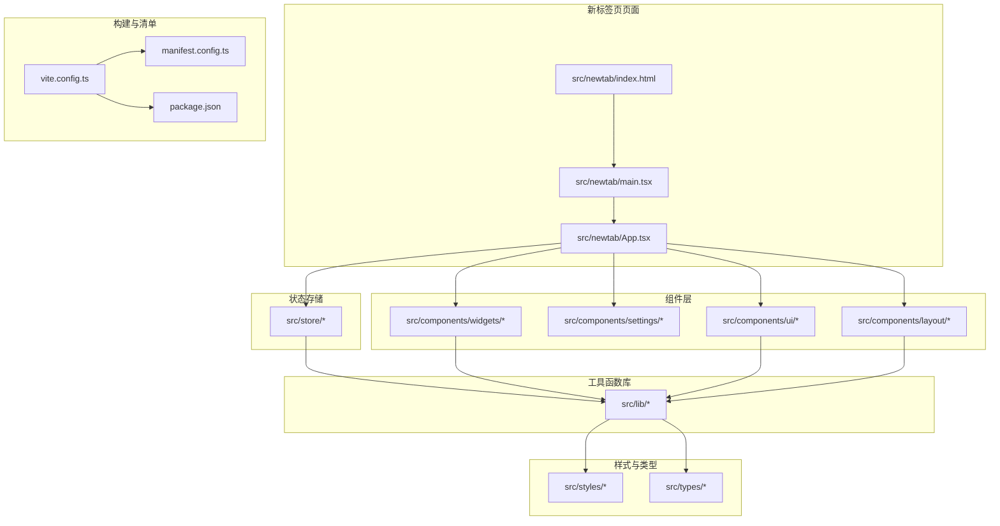
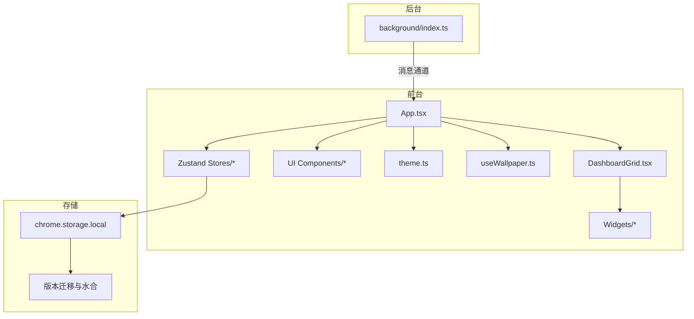
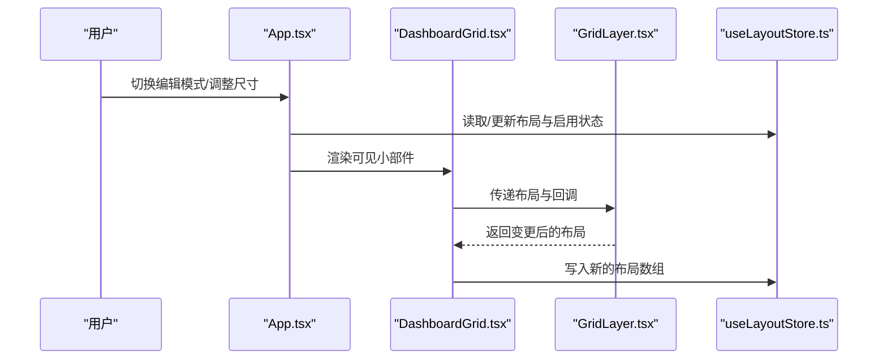
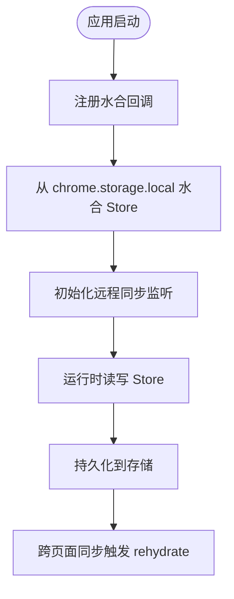
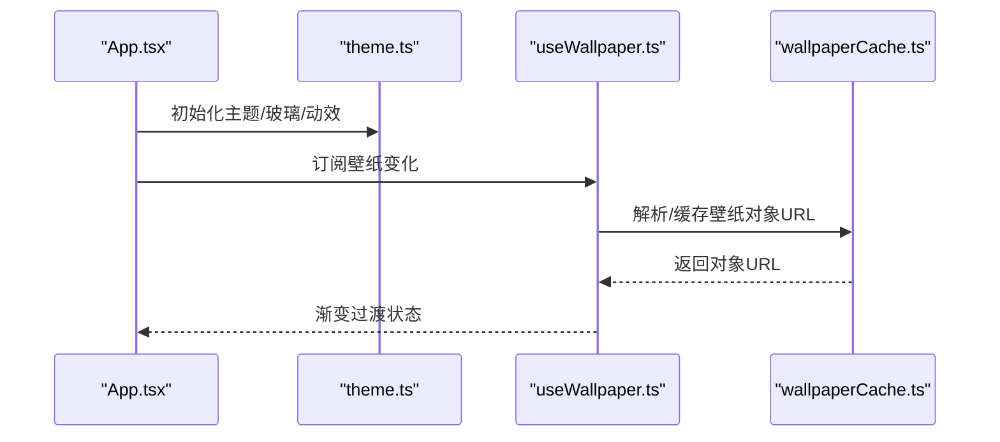
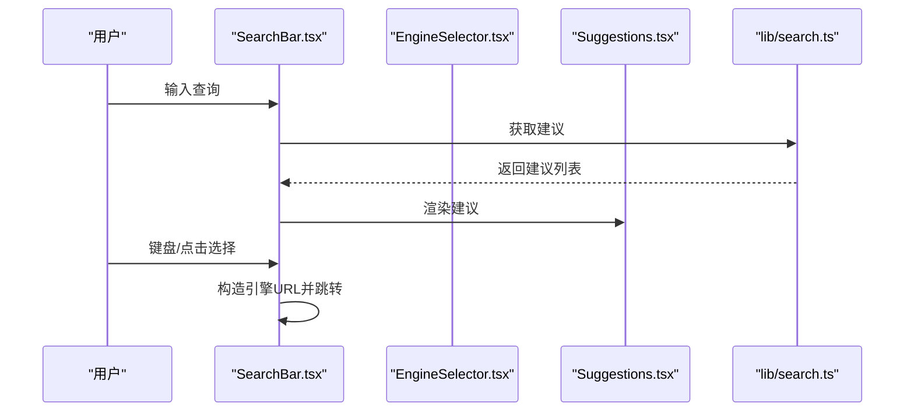
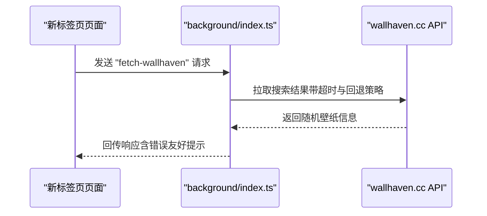
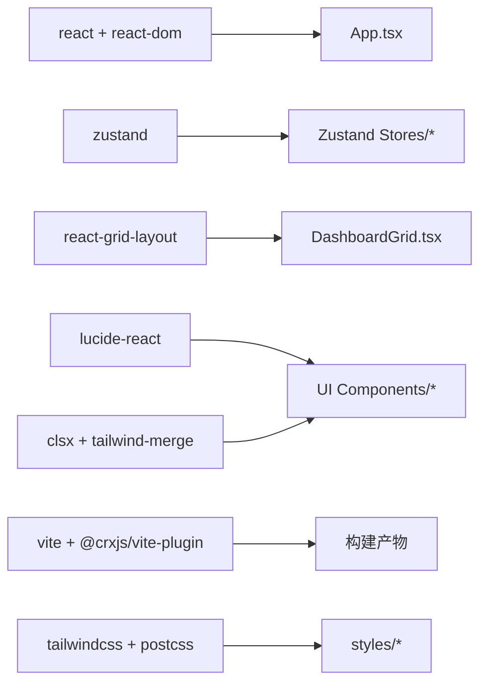

# 架构设计

<cite>
**本文引用的文件**
- [package.json](file://package.json)
- [vite.config.ts](file://vite.config.ts)
- [manifest.config.ts](file://manifest.config.ts)
- [README.md](file://README.md)
- [src/newtab/App.tsx](file://src/newtab/App.tsx)
- [src/newtab/main.tsx](file://src/newtab/main.tsx)
- [src/newtab/index.html](file://src/newtab/index.html)
- [src/components/layout/DashboardGrid.tsx](file://src/components/layout/DashboardGrid.tsx)
- [src/components/layout/GridLayer.tsx](file://src/components/layout/GridLayer.tsx)
- [src/components/layout/WidgetFrame.tsx](file://src/components/layout/WidgetFrame.tsx)
- [src/components/settings/SettingsDrawer.tsx](file://src/components/settings/SettingsDrawer.tsx)
- [src/components/settings/LayoutSection.tsx](file://src/components/settings/LayoutSection.tsx)
- [src/components/settings/ThemeSection.tsx](file://src/components/settings/ThemeSection.tsx)
- [src/components/settings/WallpaperFavorites.tsx](file://src/components/settings/WallpaperFavorites.tsx)
- [src/components/settings/WallpaperPicker.tsx](file://src/components/settings/WallpaperPicker.tsx)
- [src/components/ui/Button.tsx](file://src/components/ui/Button.tsx)
- [src/components/ui/Dialog.tsx](file://src/components/ui/Dialog.tsx)
- [src/components/ui/Drawer.tsx](file://src/components/ui/Drawer.tsx)
- [src/components/ui/Input.tsx](file://src/components/ui/Input.tsx)
- [src/components/ui/Toast.tsx](file://src/components/ui/Toast.tsx)
- [src/components/widgets/SearchBar/SearchBar.tsx](file://src/components/widgets/SearchBar/SearchBar.tsx)
- [src/components/widgets/SearchBar/EngineSelector.tsx](file://src/components/widgets/SearchBar/EngineSelector.tsx)
- [src/components/widgets/SearchBar/Suggestions.tsx](file://src/components/widgets/SearchBar/Suggestions.tsx)
- [src/components/widgets/Clock/Clock.tsx](file://src/components/widgets/Clock/Clock.tsx)
- [src/components/widgets/Shortcuts/ShortcutsGrid.tsx](file://src/components/widgets/Shortcuts/ShortcutsGrid.tsx)
- [src/components/widgets/Shortcuts/AddShortcutDialog.tsx](file://src/components/widgets/Shortcuts/AddShortcutDialog.tsx)
- [src/components/widgets/Shortcuts/TabsPickerPanel.tsx](file://src/components/widgets/Shortcuts/TabsPickerPanel.tsx)
- [src/components/widgets/Weather/Weather.tsx](file://src/components/widgets/Weather/Weather.tsx)
- [src/components/widgets/Todo/TodoList.tsx](file://src/components/widgets/Todo/TodoList.tsx)
- [src/components/widgets/Bookmarks/BookmarksTree.tsx](file://src/components/widgets/Bookmarks/BookmarksTree.tsx)
- [src/components/widgets/Bookmarks/useBookmarks.ts](file://src/components/widgets/Bookmarks/useBookmarks.ts)
- [src/components/widgets/Shortcuts/useOpenTabs.ts](file://src/components/widgets/Shortcuts/useOpenTabs.ts)
- [src/components/widgets/Shortcuts/faviconFetcher.ts](file://src/components/widgets/Shortcuts/faviconFetcher.ts)
- [src/lib/cn.ts](file://src/lib/cn.ts)
- [src/lib/theme.ts](file://src/lib/theme.ts)
- [src/lib/search.ts](file://src/lib/search.ts)
- [src/lib/useShortcut.ts](file://src/lib/useShortcut.ts)
- [src/lib/useWallpaper.ts](file://src/lib/useWallpaper.ts)
- [src/lib/wallpapers.ts](file://src/lib/wallpapers.ts)
- [src/lib/wallpaperCache.ts](file://src/lib/wallpaperCache.ts)
- [src/lib/wallpaperTint.ts](file://src/lib/wallpaperTint.ts)
- [src/lib/logger.ts](file://src/lib/logger.ts)
- [src/store/storage.ts](file://src/store/storage.ts)
- [src/store/useSettingsStore.ts](file://src/store/useSettingsStore.ts)
- [src/store/useLayoutStore.ts](file://src/store/useLayoutStore.ts)
- [src/store/useShortcutsStore.ts](file://src/store/useShortcutsStore.ts)
- [src/store/useBookmarksUiStore.ts](file://src/store/useBookmarksUiStore.ts)
- [src/store/useFavoriteWallpapersStore.ts](file://src/store/useFavoriteWallpapersStore.ts)
- [src/store/useSettingsStore.test.ts](file://src/store/useSettingsStore.test.ts)
- [src/store/useLayoutStore.test.ts](file://src/store/useLayoutStore.test.ts)
- [src/store/useShortcutsStore.test.ts](file://src/store/useShortcutsStore.test.ts)
- [src/store/useTodoStore.test.ts](file://src/store/useTodoStore.test.ts)
- [src/types/widget.ts](file://src/types/widget.ts)
- [src/styles/globals.css](file://src/styles/globals.css)
- [src/styles/tokens.css](file://src/styles/tokens.css)
- [tailwind.config.ts](file://tailwind.config.ts)
- [postcss.config.ts](file://postcss.config.ts)
- [tsconfig.json](file://tsconfig.json)
- [eslint.config.js](file://eslint.config.js)
- [vitest.config.ts](file://vitest.config.ts)
</cite>

## 目录

1. [引言](#引言)
2. [项目结构](#项目结构)
3. [核心组件](#核心组件)
4. [架构总览](#架构总览)
5. [详细组件分析](#详细组件分析)
6. [依赖分析](#依赖分析)
7. [性能考虑](#性能考虑)
8. [故障排查指南](#故障排查指南)
9. [结论](#结论)
10. [附录](#附录)

## 引言

本项目是一个基于 React + Vite 的 Chrome 新标签页扩展，目标是提供一个简洁、可定制且具备 macOS 风格的浏览体验。系统围绕“组件化 + 状态管理”的架构展开，采用 Zustand 进行轻量级状态管理，并通过 Chrome MV3 Service Worker 提供跨页面同步与网络访问能力。本文档从系统边界、数据流、组件交互等维度，系统性阐述整体架构与设计决策。

## 项目结构

项目采用按功能域划分的目录组织方式：入口页面、组件层（布局/设置/UI/小部件）、状态存储（Zustand）、工具函数库、类型定义与样式资源。核心入口为新标签页页面与背景服务脚本，分别承担前台渲染与后台逻辑。

**图表来源**

- [src/newtab/index.html](file://src/newtab/index.html)
- [src/newtab/main.tsx](file://src/newtab/main.tsx)
- [src/newtab/App.tsx](file://src/newtab/App.tsx)
- [vite.config.ts](file://vite.config.ts)
- [manifest.config.ts](file://manifest.config.ts)
- [package.json](file://package.json)

**章节来源**

- [README.md:54-68](file://README.md#L54-L68)
- [package.json:10-16](file://package.json#L10-L16)

## 核心组件

- 应用根组件：负责全局主题、壁纸、键盘快捷键与设置抽屉的协调。
- 布局系统：基于可拖拽网格的仪表盘，支持响应式断点与移动端适配。
- 小部件：搜索栏、时钟、快捷方式、天气、待办、书签等，每个小部件独立封装。
- 设置抽屉：主题、玻璃模式、搜索引擎、壁纸选择与布局重置等功能。
- 状态管理：Zustand Store 负责设置、布局、快捷方式等状态持久化与跨页面同步。
- 工具函数库：主题应用、搜索建议、壁纸缓存与提取、通用类名合并等。
- 背景服务：MV3 Service Worker，处理墙纸随机抓取与消息通道。

**章节来源**

- [src/newtab/App.tsx:10-110](file://src/newtab/App.tsx#L10-L110)
- [src/components/layout/DashboardGrid.tsx:42-110](file://src/components/layout/DashboardGrid.tsx#L42-L110)
- [src/store/useSettingsStore.ts:35-89](file://src/store/useSettingsStore.ts#L35-L89)
- [src/store/useLayoutStore.ts:32-58](file://src/store/useLayoutStore.ts#L32-L58)
- [src/store/useShortcutsStore.ts:23-54](file://src/store/useShortcutsStore.ts#L23-L54)
- [src/lib/theme.ts:68-123](file://src/lib/theme.ts#L68-L123)
- [src/lib/useWallpaper.ts:11-110](file://src/lib/useWallpaper.ts#L11-L110)
- [src/background/index.ts:132-174](file://src/background/index.ts#L132-L174)

## 架构总览

系统采用“前台 React 应用 + 后台 Service Worker + 持久化存储”的三段式架构。前台负责 UI 渲染与用户交互；后台负责网络请求与跨页面同步；状态通过 Zustand + Chrome Storage 实现本地持久化与版本迁移。

**图表来源**

- [src/newtab/App.tsx:10-110](file://src/newtab/App.tsx#L10-L110)
- [src/components/layout/DashboardGrid.tsx:42-110](file://src/components/layout/DashboardGrid.tsx#L42-L110)
- [src/lib/theme.ts:68-123](file://src/lib/theme.ts#L68-L123)
- [src/lib/useWallpaper.ts:11-110](file://src/lib/useWallpaper.ts#L11-L110)
- [src/store/storage.ts:6-32](file://src/store/storage.ts#L6-L32)
- [src/background/index.ts:132-174](file://src/background/index.ts#L132-L174)

## 详细组件分析

### 前台应用与布局系统

- 应用根组件负责壁纸渐变过渡、遮罩与顶栏控制，统一订阅设置状态并应用主题与动效策略。
- 仪表盘网格使用延迟加载的网格层组件，避免首屏包体膨胀；在编辑模式下提供拖拽句柄与断点切换。
- 小部件按可见集合动态渲染，支持最小高度调整与移动端布局生成。

**图表来源**

- [src/newtab/App.tsx:10-110](file://src/newtab/App.tsx#L10-L110)
- [src/components/layout/DashboardGrid.tsx:42-110](file://src/components/layout/DashboardGrid.tsx#L42-L110)
- [src/store/useLayoutStore.ts:32-58](file://src/store/useLayoutStore.ts#L32-L58)

**章节来源**

- [src/newtab/App.tsx:10-110](file://src/newtab/App.tsx#L10-L110)
- [src/components/layout/DashboardGrid.tsx:42-110](file://src/components/layout/DashboardGrid.tsx#L42-L110)
- [src/components/layout/GridLayer.tsx](file://src/components/layout/GridLayer.tsx)
- [src/store/useLayoutStore.ts:32-58](file://src/store/useLayoutStore.ts#L32-L58)

### 状态管理与持久化（Zustand）

- 选择理由：轻量、零样板代码、易于测试与调试；与 React Hooks 自然契合；支持中间件（持久化、版本迁移）。
- 实现模式：每个领域一个 Store，使用 persist 中间件结合自定义 StateStorage（Chrome Storage 或 LocalStorage），并在应用启动时注册水合与远程同步。
- 数据边界：设置、布局、快捷方式、收藏壁纸等均以独立 Store 管理，避免全局状态耦合。

**图表来源**

- [src/store/storage.ts:37-63](file://src/store/storage.ts#L37-L63)
- [src/store/useSettingsStore.ts:87-89](file://src/store/useSettingsStore.ts#L87-L89)
- [src/store/useLayoutStore.ts:56-58](file://src/store/useLayoutStore.ts#L56-L58)
- [src/store/useShortcutsStore.ts:52-54](file://src/store/useShortcutsStore.ts#L52-L54)

**章节来源**

- [src/store/storage.ts:1-63](file://src/store/storage.ts#L1-L63)
- [src/store/useSettingsStore.ts:35-89](file://src/store/useSettingsStore.ts#L35-L89)
- [src/store/useLayoutStore.ts:32-58](file://src/store/useLayoutStore.ts#L32-L58)
- [src/store/useShortcutsStore.ts:23-54](file://src/store/useShortcutsStore.ts#L23-L54)

### 主题与壁纸系统

- 主题应用：根据系统偏好与用户设置切换明暗主题、玻璃模式与动效策略；支持壁纸色调与亮度的分类与 CSS 变量注入。
- 壁纸处理：使用对象 URL 与 Image 预加载实现淡入淡出过渡；自动清理不再使用的对象 URL；仅保留当前壁纸于缓存中。

**图表来源**

- [src/lib/theme.ts:68-123](file://src/lib/theme.ts#L68-L123)
- [src/lib/useWallpaper.ts:11-110](file://src/lib/useWallpaper.ts#L11-L110)
- [src/lib/wallpaperCache.ts](file://src/lib/wallpaperCache.ts)

**章节来源**

- [src/lib/theme.ts:5-46](file://src/lib/theme.ts#L5-L46)
- [src/lib/useWallpaper.ts:21-98](file://src/lib/useWallpaper.ts#L21-L98)
- [src/lib/wallpapers.ts:1-69](file://src/lib/wallpapers.ts#L1-L69)

### 搜索与快捷方式

- 搜索栏：支持多引擎、输入防抖、建议列表与键盘导航；提交时根据是否按住修饰键决定新标签页打开。
- 快捷方式：支持添加、编辑、删除、排序；从已开标签页选择快速导入；自动抓取站点图标。

**图表来源**

- [src/components/widgets/SearchBar/SearchBar.tsx:9-116](file://src/components/widgets/SearchBar/SearchBar.tsx#L9-L116)
- [src/components/widgets/SearchBar/EngineSelector.tsx](file://src/components/widgets/SearchBar/EngineSelector.tsx)
- [src/components/widgets/SearchBar/Suggestions.tsx](file://src/components/widgets/SearchBar/Suggestions.tsx)
- [src/lib/search.ts](file://src/lib/search.ts)

**章节来源**

- [src/components/widgets/SearchBar/SearchBar.tsx:9-116](file://src/components/widgets/SearchBar/SearchBar.tsx#L9-L116)
- [src/components/widgets/Shortcuts/ShortcutsGrid.tsx](file://src/components/widgets/Shortcuts/ShortcutsGrid.tsx)
- [src/components/widgets/Shortcuts/AddShortcutDialog.tsx](file://src/components/widgets/Shortcuts/AddShortcutDialog.tsx)
- [src/components/widgets/Shortcuts/TabsPickerPanel.tsx](file://src/components/widgets/Shortcuts/TabsPickerPanel.tsx)
- [src/components/widgets/Shortcuts/faviconFetcher.ts](file://src/components/widgets/Shortcuts/faviconFetcher.ts)
- [src/components/widgets/Shortcuts/useOpenTabs.ts](file://src/components/widgets/Shortcuts/useOpenTabs.ts)

### 设置抽屉与主题配置

- 设置抽屉包含主题、玻璃模式、搜索引擎、壁纸选择与布局重置等区域；支持键盘快捷键与无障碍属性。
- 主题区通过 CSS 类与变量驱动 UI 变化，确保一致的视觉反馈。

**章节来源**

- [src/components/settings/SettingsDrawer.tsx](file://src/components/settings/SettingsDrawer.tsx)
- [src/components/settings/ThemeSection.tsx](file://src/components/settings/ThemeSection.tsx)
- [src/components/settings/LayoutSection.tsx](file://src/components/settings/LayoutSection.tsx)
- [src/components/settings/WallpaperFavorites.tsx](file://src/components/settings/WallpaperFavorites.tsx)
- [src/components/settings/WallpaperPicker.tsx](file://src/components/settings/WallpaperPicker.tsx)

### UI 组件库

- 统一的按钮、输入框、对话框、抽屉与提示组件，采用组合变体与尺寸映射，保证风格一致性与可维护性。
- 使用工具函数进行类名合并，减少重复样式逻辑。

**章节来源**

- [src/components/ui/Button.tsx:24-41](file://src/components/ui/Button.tsx#L24-L41)
- [src/components/ui/Dialog.tsx](file://src/components/ui/Dialog.tsx)
- [src/components/ui/Drawer.tsx](file://src/components/ui/Drawer.tsx)
- [src/components/ui/Input.tsx](file://src/components/ui/Input.tsx)
- [src/components/ui/Toast.tsx](file://src/components/ui/Toast.tsx)
- [src/lib/cn.ts](file://src/lib/cn.ts)

### 背景服务与扩展架构

- 作为 MV3 Service Worker，负责墙纸随机抓取与消息通道；通过消息类型与参数校验，确保安全与稳定性。
- 清单声明了新标签页覆盖、后台脚本、权限与主机权限，满足功能需求与隐私约束。

**图表来源**

- [src/background/index.ts:132-174](file://src/background/index.ts#L132-L174)
- [manifest.config.ts:4-38](file://manifest.config.ts#L4-L38)

**章节来源**

- [src/background/index.ts:1-174](file://src/background/index.ts#L1-L174)
- [manifest.config.ts:1-38](file://manifest.config.ts#L1-L38)

## 依赖分析

- 技术栈选择：React 用于组件化 UI；Vite 提供开发与构建；CRXJS 插件支持 Chrome 扩展打包；TailwindCSS + PostCSS 提供样式体系。
- 关键外部依赖：Zustand 轻量状态管理；react-grid-layout 支持拖拽布局；lucide-react 图标；clsx/tailwind-merge 辅助类名处理。
- 构建优化：手动分包策略将 React/Zustand 等第三方库拆分为独立 vendor chunk，降低新标签页入口体积波动。

**图表来源**

- [package.json:18-26](file://package.json#L18-L26)
- [vite.config.ts:14-33](file://vite.config.ts#L14-L33)
- [tailwind.config.ts](file://tailwind.config.ts)
- [postcss.config.ts](file://postcss.config.ts)

**章节来源**

- [package.json:18-54](file://package.json#L18-L54)
- [vite.config.ts:1-46](file://vite.config.ts#L1-L46)

## 性能考虑

- 代码分割与懒加载：网格层组件延迟加载，首屏不阻塞；对象 URL 在使用后及时撤销，避免内存泄漏。
- 构建分包：第三方库独立 chunk，减少入口文件变动带来的缓存失效。
- 动效与节流：主题与壁纸色调提取加入去抖；搜索建议防抖与超时控制。
- 存储与同步：仅保留当前壁纸于缓存，避免无限增长；跨页面同步通过 onChanged 事件触发 rehydrate。

**章节来源**

- [src/components/layout/DashboardGrid.tsx:17-22](file://src/components/layout/DashboardGrid.tsx#L17-L22)
- [src/lib/useWallpaper.ts:18-20](file://src/lib/useWallpaper.ts#L18-L20)
- [vite.config.ts:19-30](file://vite.config.ts#L19-L30)
- [src/lib/theme.ts:87-95](file://src/lib/theme.ts#L87-L95)
- [src/lib/search.ts](file://src/lib/search.ts)
- [src/store/storage.ts:53-62](file://src/store/storage.ts#L53-L62)

## 故障排查指南

- 壁纸加载失败：检查对象 URL 是否被撤销；确认图片加载回调与错误分支；查看控制台错误与运行时 lastError。
- 主题未生效：确认主题初始化流程与订阅回调；检查 CSS 变量与类名是否正确设置。
- 搜索建议异常：检查防抖与 AbortController；确认引擎参数与跨域权限。
- 跨页面不同步：确认 chrome.storage.onChanged 监听是否注册；检查 rehydrate 触发时机。
- 开发环境无法热更：确认 Vite server 绑定地址为 127.0.0.1；端口与 HMR 配置一致。

**章节来源**

- [src/lib/useWallpaper.ts:21-98](file://src/lib/useWallpaper.ts#L21-L98)
- [src/lib/theme.ts:68-123](file://src/lib/theme.ts#L68-L123)
- [src/lib/search.ts](file://src/lib/search.ts)
- [src/store/storage.ts:53-62](file://src/store/storage.ts#L53-L62)
- [vite.config.ts:34-44](file://vite.config.ts#L34-L44)

## 结论

本项目通过 React + Vite + Zustand 的组合，实现了简洁而强大的 Chrome 新标签页扩展。前台组件化清晰、后台服务职责单一、状态持久化与跨页面同步可靠。MV3 清单与权限设计满足功能需求，同时兼顾隐私与性能。整体架构在可维护性、可扩展性与用户体验之间取得良好平衡。

## 附录

- 项目特性概览与安装说明参见 README。
- 类型定义集中在 types/widget.ts，统一小部件 ID、布局与快捷方式结构。
- 样式系统由 Tailwind + CSS 变量构成，主题与玻璃模式通过类名切换与变量注入实现。

**章节来源**

- [README.md:1-73](file://README.md#L1-L73)
- [src/types/widget.ts:1-34](file://src/types/widget.ts#L1-L34)
- [src/styles/globals.css](file://src/styles/globals.css)
- [src/styles/tokens.css](file://src/styles/tokens.css)
