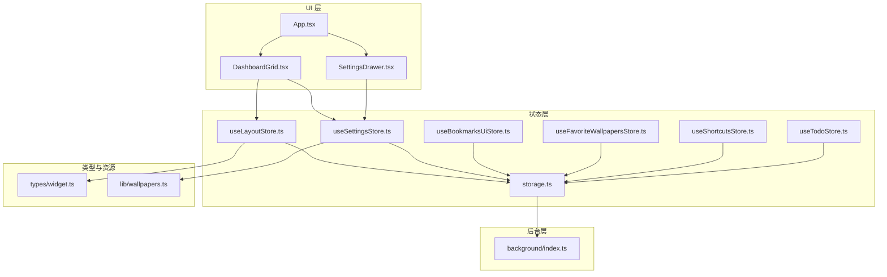
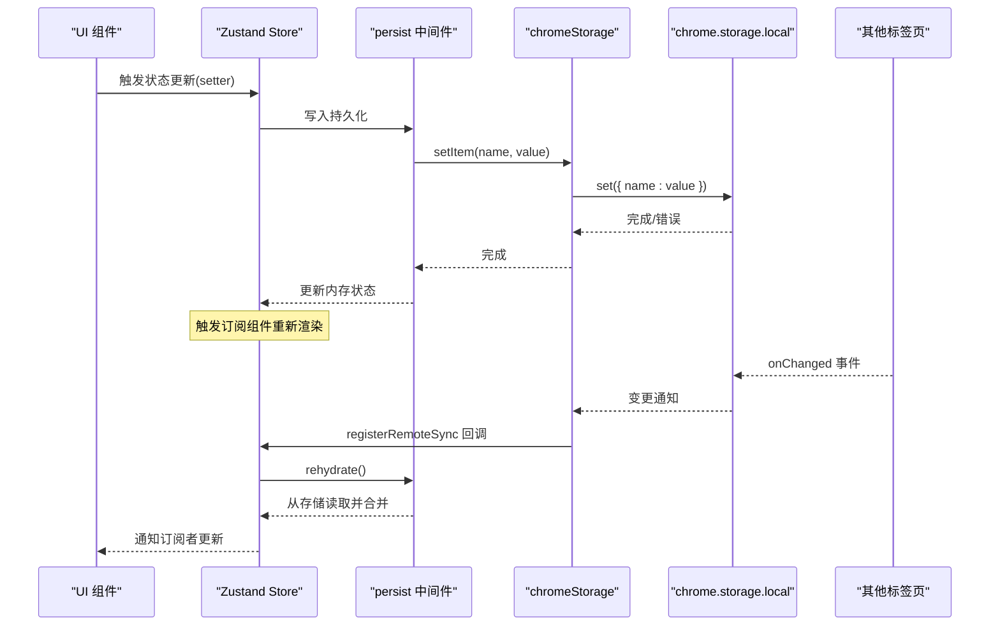
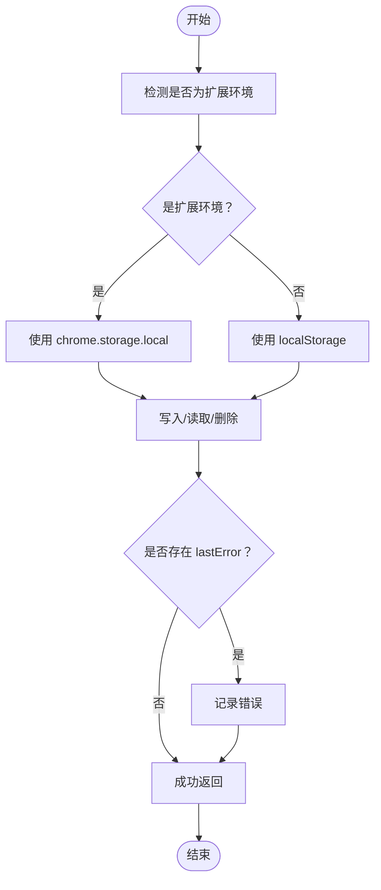
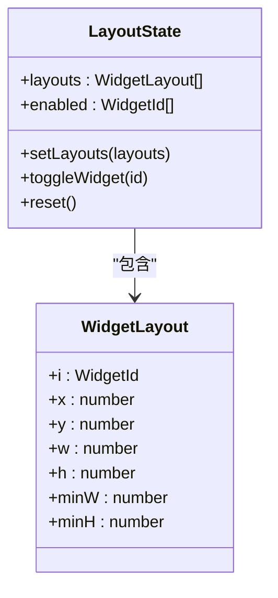
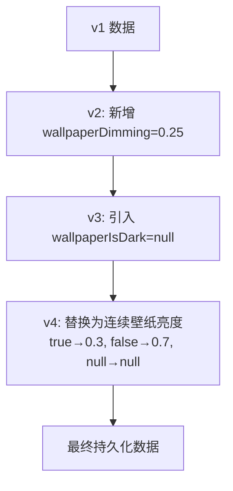
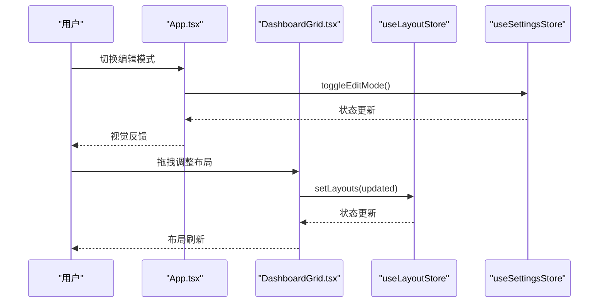
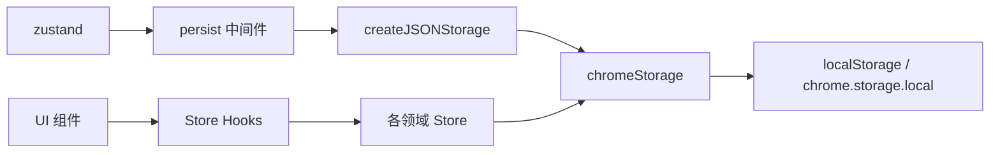

# 状态管理架构

<cite>
**本文引用的文件**
- [src/store/storage.ts](file://src/store/storage.ts)
- [src/store/useLayoutStore.ts](file://src/store/useLayoutStore.ts)
- [src/store/useSettingsStore.ts](file://src/store/useSettingsStore.ts)
- [src/store/useBookmarksUiStore.ts](file://src/store/useBookmarksUiStore.ts)
- [src/store/useFavoriteWallpapersStore.ts](file://src/store/useFavoriteWallpapersStore.ts)
- [src/store/useShortcutsStore.ts](file://src/store/useShortcutsStore.ts)
- [src/store/useTodoStore.ts](file://src/store/useTodoStore.ts)
- [src/types/widget.ts](file://src/types/widget.ts)
- [src/lib/wallpapers.ts](file://src/lib/wallpapers.ts)
- [src/background/index.ts](file://src/background/index.ts)
- [src/components/layout/DashboardGrid.tsx](file://src/components/layout/DashboardGrid.tsx)
- [src/components/settings/SettingsDrawer.tsx](file://src/components/settings/SettingsDrawer.tsx)
- [src/newtab/App.tsx](file://src/newtab/App.tsx)
- [package.json](file://package.json)
- [src/store/useLayoutStore.test.ts](file://src/store/useLayoutStore.test.ts)
- [src/store/useSettingsStore.test.ts](file://src/store/useSettingsStore.test.ts)
- [src/store/useShortcutsStore.test.ts](file://src/store/useShortcutsStore.test.ts)
- [src/store/useTodoStore.test.ts](file://src/store/useTodoStore.test.ts)
</cite>

## 目录

1. [引言](#引言)
2. [项目结构](#项目结构)
3. [核心组件](#核心组件)
4. [架构总览](#架构总览)
5. [详细组件分析](#详细组件分析)
6. [依赖关系分析](#依赖关系分析)
7. [性能考量](#性能考量)
8. [故障排查指南](#故障排查指南)
9. [结论](#结论)
10. [附录](#附录)

## 引言

本文件系统性阐述基于 Zustand 的状态管理架构与实现，覆盖以下要点：

- 为什么选择 Zustand：无样板代码、类型安全、易于测试与调试。
- 在 Chrome 扩展中的优势：与 Chrome Storage API 的无缝集成、跨标签页同步、持久化迁移策略。
- 分层状态设计：布局状态、设置状态、业务状态（如快捷方式、待办、收藏壁纸）。
- 持久化与同步：本地存储适配器、Hydration 初始化、远程变更监听与重水合。
- 状态流转与存储结构：状态在应用内的传播路径与持久化流程。

## 项目结构

状态管理相关代码集中在 src/store 目录，采用“按领域划分”的 Store 文件组织方式；UI 组件通过 Hook 订阅状态；后台脚本负责网络与资源拉取；类型定义位于 src/types 与 src/lib。

图表来源

- [src/store/useLayoutStore.ts:1-58](file://src/store/useLayoutStore.ts#L1-L58)
- [src/store/useSettingsStore.ts:1-89](file://src/store/useSettingsStore.ts#L1-L89)
- [src/store/useBookmarksUiStore.ts:1-34](file://src/store/useBookmarksUiStore.ts#L1-L34)
- [src/store/useFavoriteWallpapersStore.ts:1-51](file://src/store/useFavoriteWallpapersStore.ts#L1-L51)
- [src/store/useShortcutsStore.ts:1-54](file://src/store/useShortcutsStore.ts#L1-L54)
- [src/store/useTodoStore.ts:1-59](file://src/store/useTodoStore.ts#L1-L59)
- [src/store/storage.ts:1-63](file://src/store/storage.ts#L1-L63)
- [src/components/layout/DashboardGrid.tsx:1-110](file://src/components/layout/DashboardGrid.tsx#L1-L110)
- [src/components/settings/SettingsDrawer.tsx:1-22](file://src/components/settings/SettingsDrawer.tsx#L1-L22)
- [src/newtab/App.tsx:1-110](file://src/newtab/App.tsx#L1-L110)
- [src/types/widget.ts:1-34](file://src/types/widget.ts#L1-L34)
- [src/lib/wallpapers.ts:1-69](file://src/lib/wallpapers.ts#L1-L69)
- [src/background/index.ts:1-174](file://src/background/index.ts#L1-L174)

章节来源

- [src/store/useLayoutStore.ts:1-58](file://src/store/useLayoutStore.ts#L1-L58)
- [src/store/useSettingsStore.ts:1-89](file://src/store/useSettingsStore.ts#L1-L89)
- [src/store/useBookmarksUiStore.ts:1-34](file://src/store/useBookmarksUiStore.ts#L1-L34)
- [src/store/useFavoriteWallpapersStore.ts:1-51](file://src/store/useFavoriteWallpapersStore.ts#L1-L51)
- [src/store/useShortcutsStore.ts:1-54](file://src/store/useShortcutsStore.ts#L1-L54)
- [src/store/useTodoStore.ts:1-59](file://src/store/useTodoStore.ts#L1-L59)
- [src/store/storage.ts:1-63](file://src/store/storage.ts#L1-L63)
- [src/components/layout/DashboardGrid.tsx:1-110](file://src/components/layout/DashboardGrid.tsx#L1-L110)
- [src/components/settings/SettingsDrawer.tsx:1-22](file://src/components/settings/SettingsDrawer.tsx#L1-L22)
- [src/newtab/App.tsx:1-110](file://src/newtab/App.tsx#L1-L110)
- [src/types/widget.ts:1-34](file://src/types/widget.ts#L1-L34)
- [src/lib/wallpapers.ts:1-69](file://src/lib/wallpapers.ts#L1-L69)
- [src/background/index.ts:1-174](file://src/background/index.ts#L1-L174)

## 核心组件

- 存储适配器与同步
  - chromeStorage：统一的 StateStorage 实现，自动在扩展环境与开发环境间切换到 chrome.storage.local 或 localStorage，并提供错误日志。
  - Hydration 注册与远程同步：通过 registerHydration 与 registerRemoteSync 将各 Store 的 rehydrate 生命周期接入全局初始化与 onChange 监听。
  - 远程同步初始化：initRemoteSync 建立 chrome.storage.onChanged 监听，按键名触发对应 Store 的 rehydrate，确保多标签页一致。
- 布局状态 useLayoutStore
  - 管理小部件布局与启用列表，支持重排、开关小部件、重置默认布局。
  - 使用 persist 中间件与自定义 JSON 存储，skipHydration 配合全局 Hydration。
- 设置状态 useSettingsStore
  - 主题、玻璃模式、搜索引擎、壁纸、明暗对比与动效偏好等。
  - 提供版本化迁移策略，兼容历史字段（如壁纸亮度）。
- 业务状态
  - 快捷方式 useShortcutsStore：增删改与排序。
  - 待办事项 useTodoStore：增删改与清理已完成。
  - 收藏壁纸 useFavoriteWallpapersStore：去重、上限、时间戳。
  - 书签 UI useBookmarksUiStore：展开/折叠状态。
- 类型与资源
  - WidgetId、WidgetLayout、Shortcut 等类型定义。
  - 默认壁纸与预设资源。

章节来源

- [src/store/storage.ts:1-63](file://src/store/storage.ts#L1-L63)
- [src/store/useLayoutStore.ts:1-58](file://src/store/useLayoutStore.ts#L1-L58)
- [src/store/useSettingsStore.ts:1-89](file://src/store/useSettingsStore.ts#L1-L89)
- [src/store/useShortcutsStore.ts:1-54](file://src/store/useShortcutsStore.ts#L1-L54)
- [src/store/useTodoStore.ts:1-59](file://src/store/useTodoStore.ts#L1-L59)
- [src/store/useFavoriteWallpapersStore.ts:1-51](file://src/store/useFavoriteWallpapersStore.ts#L1-L51)
- [src/store/useBookmarksUiStore.ts:1-34](file://src/store/useBookmarksUiStore.ts#L1-L34)
- [src/types/widget.ts:1-34](file://src/types/widget.ts#L1-L34)
- [src/lib/wallpapers.ts:1-69](file://src/lib/wallpapers.ts#L1-L69)

## 架构总览

Zustand Store 通过 persist 中间件与自定义 JSON 存储器对接 chrome.storage.local；UI 通过 Hook 订阅状态；后台脚本处理外部资源请求；onChange 事件驱动 Store 重水合，实现多标签页一致性。

图表来源

- [src/store/storage.ts:6-32](file://src/store/storage.ts#L6-L32)
- [src/store/storage.ts:49-62](file://src/store/storage.ts#L49-L62)
- [src/store/useLayoutStore.ts:32-54](file://src/store/useLayoutStore.ts#L32-L54)
- [src/store/useSettingsStore.ts:35-84](file://src/store/useSettingsStore.ts#L35-L84)

## 详细组件分析

### 存储适配器与同步机制

- 设计要点
  - 条件判断运行环境，优先使用 chrome.storage.local；开发环境回退到 localStorage。
  - 统一错误处理：写入/删除失败时记录 lastError。
  - Hydration 与远程同步注册：为每个 Store 提供 rehydrate 入口，集中执行。
  - onChange 监听：仅处理 area === 'local' 的变更，按键名匹配处理器并异步触发。
- 关键接口
  - getItem/setItem/removeItem：与 Zustand StateStorage 接口对齐。
  - registerHydration/hydrateStores：集中初始化。
  - registerRemoteSync/initRemoteSync：跨标签页同步。

图表来源

- [src/store/storage.ts:4-32](file://src/store/storage.ts#L4-L32)

章节来源

- [src/store/storage.ts:1-63](file://src/store/storage.ts#L1-L63)

### 布局状态 useLayoutStore

- 职责
  - 维护 WidgetLayout 列表与启用集合，支持 setLayouts、toggleWidget、reset。
  - 默认布局与默认启用项固化在 Store 内部。
- 持久化与同步
  - 使用 persist 中间件，存储键名为 tab:layout，版本 1，跳过初次水合，由全局 Hydration 统一触发。
  - 注册远程同步，确保多标签页布局变更即时生效。

图表来源

- [src/store/useLayoutStore.ts:6-12](file://src/store/useLayoutStore.ts#L6-L12)
- [src/types/widget.ts:25-33](file://src/types/widget.ts#L25-L33)

章节来源

- [src/store/useLayoutStore.ts:1-58](file://src/store/useLayoutStore.ts#L1-L58)
- [src/types/widget.ts:1-34](file://src/types/widget.ts#L1-L34)

### 设置状态 useSettingsStore

- 职责
  - 主题、玻璃模式、搜索引擎、壁纸、明暗对比与动效偏好。
  - 壁纸亮度字段迁移策略：v1→v2 新增壁纸明暗度；v3→v4 替换二值字段为连续值。
- 持久化与同步
  - 存储键名为 tab:settings，版本 4，跳过初次水合，统一 Hydration。
  - 注册远程同步，确保多标签页设置一致。

图表来源

- [src/store/useSettingsStore.ts:62-82](file://src/store/useSettingsStore.ts#L62-L82)

章节来源

- [src/store/useSettingsStore.ts:1-89](file://src/store/useSettingsStore.ts#L1-L89)
- [src/lib/wallpapers.ts:1-69](file://src/lib/wallpapers.ts#L1-L69)

### 业务状态：快捷方式、待办、收藏壁纸、书签 UI

- 快捷方式 useShortcutsStore
  - 默认项、新增、更新、删除、重排。
- 待办事项 useTodoStore
  - 新增（自动去空白、前置插入）、切换完成、删除、清理已完成。
- 收藏壁纸 useFavoriteWallpapersStore
  - 去重、上限控制、时间戳、增删清空。
- 书签 UI useBookmarksUiStore
  - 展开/折叠状态，按节点 ID 维护数组。

章节来源

- [src/store/useShortcutsStore.ts:1-54](file://src/store/useShortcutsStore.ts#L1-L54)
- [src/store/useTodoStore.ts:1-59](file://src/store/useTodoStore.ts#L1-L59)
- [src/store/useFavoriteWallpapersStore.ts:1-51](file://src/store/useFavoriteWallpapersStore.ts#L1-L51)
- [src/store/useBookmarksUiStore.ts:1-34](file://src/store/useBookmarksUiStore.ts#L1-L34)

### UI 与状态交互

- App.tsx
  - 订阅设置状态（编辑模式、动效、壁纸明暗），绑定快捷键，协调壁纸淡入淡出与遮罩层。
- DashboardGrid.tsx
  - 订阅布局与设置状态，根据启用的小部件生成可见布局，处理拖拽布局变更并写回 Store。
- SettingsDrawer.tsx
  - 打开设置抽屉，承载主题、壁纸与布局设置子区域。

图表来源

- [src/newtab/App.tsx:10-24](file://src/newtab/App.tsx#L10-L24)
- [src/components/layout/DashboardGrid.tsx:42-75](file://src/components/layout/DashboardGrid.tsx#L42-L75)
- [src/store/useLayoutStore.ts:32-45](file://src/store/useLayoutStore.ts#L32-L45)
- [src/store/useSettingsStore.ts:47-55](file://src/store/useSettingsStore.ts#L47-L55)

章节来源

- [src/newtab/App.tsx:1-110](file://src/newtab/App.tsx#L1-L110)
- [src/components/layout/DashboardGrid.tsx:1-110](file://src/components/layout/DashboardGrid.tsx#L1-L110)

### 后台脚本与状态的关系

- background/index.ts
  - 提供 fetch-wallhaven 消息处理，用于从墙绘 API 获取随机壁纸，供前台 UI 使用。
  - 该脚本不直接操作前端 Store，但为 UI 提供壁纸数据来源，间接影响设置状态中的壁纸字段。

章节来源

- [src/background/index.ts:123-173](file://src/background/index.ts#L123-L173)

## 依赖关系分析

- 外部依赖
  - Zustand 作为核心状态库，配合 persist 中间件与 JSON 存储器。
  - React 与 React DOM 用于 UI 渲染。
- 内部依赖
  - 各 Store 依赖 storage.ts 提供的 StateStorage 与同步机制。
  - UI 组件依赖 Store 的选择器式订阅，降低重渲染范围。
  - 类型模块与资源模块为 Store 提供强类型约束与默认值。

图表来源

- [package.json:18-26](file://package.json#L18-L26)
- [src/store/storage.ts:1-63](file://src/store/storage.ts#L1-L63)
- [src/store/useLayoutStore.ts:1-58](file://src/store/useLayoutStore.ts#L1-L58)
- [src/store/useSettingsStore.ts:1-89](file://src/store/useSettingsStore.ts#L1-L89)

章节来源

- [package.json:1-56](file://package.json#L1-L56)
- [src/store/storage.ts:1-63](file://src/store/storage.ts#L1-L63)

## 性能考量

- 无样板代码与轻量中间件
  - Zustand 的原生 API 与 persist 中间件组合，避免冗余样板，减少打包体积与运行时开销。
- 选择器订阅
  - UI 通过选择器订阅 Store 的部分状态，避免无关状态变化引发的重渲染。
- 持久化策略
  - skipHydration + 全局 Hydration：集中初始化，避免重复水合。
  - 版本化迁移：在升级时平滑转换旧数据，减少异常与回滚成本。
- 跨标签页同步
  - 通过 onChange 事件触发 rehydrate，确保一致性的同时尽量减少不必要的重计算。

## 故障排查指南

- 持久化失败
  - 现象：设置或布局未保存或丢失。
  - 排查：检查 chrome.runtime.lastError 是否存在；确认 chrome.storage.local 可用且未超过配额。
- 多标签页不一致
  - 现象：一个标签页修改后，另一个标签页未更新。
  - 排查：确认 initRemoteSync 已调用；检查 registerRemoteSync 是否正确注册；验证 onChange 事件是否触发。
- 测试验证
  - 使用 Vitest 测试 Store 行为：默认值、setter、边界条件与迁移逻辑。
  - 示例测试覆盖布局切换、设置更新、快捷方式增删改、待办切换与清理。

章节来源

- [src/store/storage.ts:18-31](file://src/store/storage.ts#L18-L31)
- [src/store/storage.ts:53-62](file://src/store/storage.ts#L53-L62)
- [src/store/useLayoutStore.test.ts:1-57](file://src/store/useLayoutStore.test.ts#L1-L57)
- [src/store/useSettingsStore.test.ts:1-90](file://src/store/useSettingsStore.test.ts#L1-L90)
- [src/store/useShortcutsStore.test.ts:1-69](file://src/store/useShortcutsStore.test.ts#L1-L69)
- [src/store/useTodoStore.test.ts:1-84](file://src/store/useTodoStore.test.ts#L1-L84)

## 结论

本项目以 Zustand 为核心，结合自定义存储适配器与版本化迁移策略，在 Chrome 扩展中实现了简洁、可维护、可测试且跨标签页一致的状态管理方案。通过分层状态设计与选择器订阅，既保证了性能，又提升了开发体验。建议后续持续完善后台消息与 Store 的解耦，以及增加更多边界场景的测试覆盖。

## 附录

- 状态持久化键名一览
  - 布局：tab:layout
  - 设置：tab:settings
  - 书签 UI：tab:bookmarks-ui
  - 收藏壁纸：tab:favorite-wallpapers
  - 快捷方式：tab:shortcuts
  - 待办：tab:todo
