# 组件架构设计

<cite>
**本文引用的文件**
- [src/components/layout/DashboardGrid.tsx](file://src/components/layout/DashboardGrid.tsx)
- [src/components/layout/GridLayer.tsx](file://src/components/layout/GridLayer.tsx)
- [src/components/layout/WidgetFrame.tsx](file://src/components/layout/WidgetFrame.tsx)
- [src/components/widgets/SearchBar/SearchBar.tsx](file://src/components/widgets/SearchBar/SearchBar.tsx)
- [src/components/widgets/Clock/Clock.tsx](file://src/components/widgets/Clock/Clock.tsx)
- [src/components/widgets/Shortcuts/ShortcutsGrid.tsx](file://src/components/widgets/Shortcuts/ShortcutsGrid.tsx)
- [src/components/widgets/Weather/Weather.tsx](file://src/components/widgets/Weather/Weather.tsx)
- [src/components/widgets/Todo/TodoList.tsx](file://src/components/widgets/Todo/TodoList.tsx)
- [src/components/widgets/Bookmarks/BookmarksTree.tsx](file://src/components/widgets/Bookmarks/BookmarksTree.tsx)
- [src/components/ui/ErrorBoundary.tsx](file://src/components/ui/ErrorBoundary.tsx)
- [src/components/ui/Button.tsx](file://src/components/ui/Button.tsx)
- [src/store/useLayoutStore.ts](file://src/store/useLayoutStore.ts)
- [src/store/useSettingsStore.ts](file://src/store/useSettingsStore.ts)
- [src/store/useShortcutsStore.ts](file://src/store/useShortcutsStore.ts)
- [src/store/useTodoStore.ts](file://src/store/useTodoStore.ts)
- [src/store/useBookmarksUiStore.ts](file://src/store/useBookmarksUiStore.ts)
- [src/types/widget.ts](file://src/types/widget.ts)
- [src/lib/useShortcut.ts](file://src/lib/useShortcut.ts)
</cite>

## 目录

1. [简介](#简介)
2. [项目结构](#项目结构)
3. [核心组件](#核心组件)
4. [架构总览](#架构总览)
5. [详细组件分析](#详细组件分析)
6. [依赖分析](#依赖分析)
7. [性能考虑](#性能考虑)
8. [故障排查指南](#故障排查指南)
9. [结论](#结论)
10. [附录](#附录)

## 简介

本文件系统化梳理 Tab 项目的组件架构设计，聚焦以下目标：

- 组件分层：布局组件（DashboardGrid、WidgetFrame、GridLayer）、业务组件（widgets 下各小部件）、基础 UI 组件（ui 文件夹）。
- 组件通信：props 传递、事件冒泡与状态提升；跨组件状态通过 Zustand store 管理。
- 复用性设计：WidgetFrame 统一外观与行为；ErrorBoundary 提升稳定性。
- 生命周期与性能：懒加载、虚拟化与节流防抖策略。
- 关系与数据流：组件依赖图与数据流图，直观展示交互模式。

## 项目结构

项目采用按“职责域”组织的目录结构：

- 布局层：负责网格布局、拖拽与响应式断点控制。
- 业务层：各小部件实现具体功能（时钟、搜索、快捷方式、天气、待办、书签）。
- 基础 UI 层：通用控件与辅助组件（按钮、对话框、错误边界等）。
- 状态层：Zustand stores 管理布局、设置、小部件数据。
- 类型层：统一定义小部件 ID、布局结构等类型。

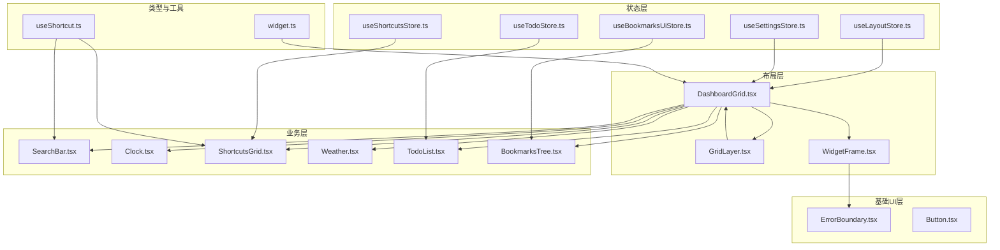

图表来源

- [src/components/layout/DashboardGrid.tsx:1-110](file://src/components/layout/DashboardGrid.tsx#L1-L110)
- [src/components/layout/GridLayer.tsx:1-50](file://src/components/layout/GridLayer.tsx#L1-L50)
- [src/components/layout/WidgetFrame.tsx:1-31](file://src/components/layout/WidgetFrame.tsx#L1-L31)
- [src/components/widgets/SearchBar/SearchBar.tsx:1-116](file://src/components/widgets/SearchBar/SearchBar.tsx#L1-L116)
- [src/components/widgets/Clock/Clock.tsx:1-112](file://src/components/widgets/Clock/Clock.tsx#L1-L112)
- [src/components/widgets/Shortcuts/ShortcutsGrid.tsx:1-38](file://src/components/widgets/Shortcuts/ShortcutsGrid.tsx#L1-L38)
- [src/components/widgets/Weather/Weather.tsx:1-81](file://src/components/widgets/Weather/Weather.tsx#L1-L81)
- [src/components/widgets/Todo/TodoList.tsx:1-69](file://src/components/widgets/Todo/TodoList.tsx#L1-L69)
- [src/components/widgets/Bookmarks/BookmarksTree.tsx:1-88](file://src/components/widgets/Bookmarks/BookmarksTree.tsx#L1-L88)
- [src/components/ui/ErrorBoundary.tsx:1-48](file://src/components/ui/ErrorBoundary.tsx#L1-L48)
- [src/components/ui/Button.tsx:1-41](file://src/components/ui/Button.tsx#L1-L41)
- [src/store/useLayoutStore.ts:1-58](file://src/store/useLayoutStore.ts#L1-L58)
- [src/store/useSettingsStore.ts:1-89](file://src/store/useSettingsStore.ts#L1-L89)
- [src/store/useShortcutsStore.ts](file://src/store/useShortcutsStore.ts)
- [src/store/useTodoStore.ts](file://src/store/useTodoStore.ts)
- [src/store/useBookmarksUiStore.ts](file://src/store/useBookmarksUiStore.ts)
- [src/types/widget.ts:1-34](file://src/types/widget.ts#L1-L34)
- [src/lib/useShortcut.ts:1-49](file://src/lib/useShortcut.ts#L1-L49)

章节来源

- [src/components/layout/DashboardGrid.tsx:1-110](file://src/components/layout/DashboardGrid.tsx#L1-L110)
- [src/components/layout/GridLayer.tsx:1-50](file://src/components/layout/GridLayer.tsx#L1-L50)
- [src/components/layout/WidgetFrame.tsx:1-31](file://src/components/layout/WidgetFrame.tsx#L1-L31)
- [src/types/widget.ts:1-34](file://src/types/widget.ts#L1-L34)

## 核心组件

- DashboardGrid：网格容器与布局协调者，负责可见小部件筛选、移动端布局生成、编辑态拖拽与尺寸调整、懒加载 GridLayer。
- GridLayer：基于 react-grid-layout 的响应式网格，处理拖拽、缩放、断点切换与布局持久化回调。
- WidgetFrame：小部件外观与行为的统一包装器，支持透明/非透明背景、编辑态高亮、内容区内外边距。
- 小部件：SearchBar、Clock、ShortcutsGrid、WeatherWidget、TodoList、BookmarksTree，各自封装业务逻辑与状态。
- 基础 UI：ErrorBoundary、Button 等，提供可复用的交互与容错能力。
- 状态管理：useLayoutStore、useSettingsStore、useShortcutsStore、useTodoStore、useBookmarksUiStore，集中管理布局、设置与各小部件数据。

章节来源

- [src/components/layout/DashboardGrid.tsx:42-110](file://src/components/layout/DashboardGrid.tsx#L42-L110)
- [src/components/layout/GridLayer.tsx:20-50](file://src/components/layout/GridLayer.tsx#L20-L50)
- [src/components/layout/WidgetFrame.tsx:11-31](file://src/components/layout/WidgetFrame.tsx#L11-L31)
- [src/store/useLayoutStore.ts:32-58](file://src/store/useLayoutStore.ts#L32-L58)
- [src/store/useSettingsStore.ts:35-89](file://src/store/useSettingsStore.ts#L35-L89)

## 架构总览

组件分层与职责：

- 布局层：负责网格渲染、拖拽/缩放、断点与响应式布局；通过懒加载降低首屏体积。
- 业务层：每个小部件自包含数据与交互，通过 store 或本地状态驱动 UI。
- 基础 UI 层：提供通用控件与错误兜底，提升一致性与健壮性。
- 状态层：以 ZUSTAND 为中心，跨组件共享布局、设置与业务数据，支持浏览器存储与远程同步。

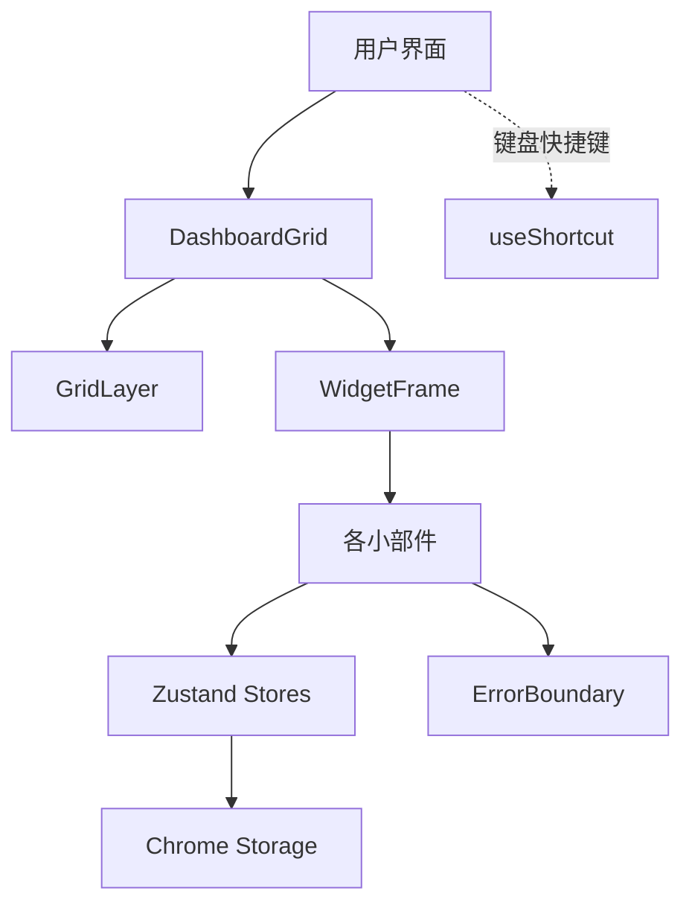

图表来源

- [src/components/layout/DashboardGrid.tsx:1-110](file://src/components/layout/DashboardGrid.tsx#L1-L110)
- [src/components/layout/GridLayer.tsx:1-50](file://src/components/layout/GridLayer.tsx#L1-L50)
- [src/components/layout/WidgetFrame.tsx:1-31](file://src/components/layout/WidgetFrame.tsx#L1-L31)
- [src/components/ui/ErrorBoundary.tsx:1-48](file://src/components/ui/ErrorBoundary.tsx#L1-L48)
- [src/lib/useShortcut.ts:1-49](file://src/lib/useShortcut.ts#L1-L49)
- [src/store/useLayoutStore.ts:1-58](file://src/store/useLayoutStore.ts#L1-L58)
- [src/store/useSettingsStore.ts:1-89](file://src/store/useSettingsStore.ts#L1-L89)

## 详细组件分析

### DashboardGrid：网格容器与布局协调

- 职责
  - 读取布局与启用状态，过滤可见小部件并生成移动端 xs 布局。
  - 懒加载 GridLayer，首屏不阻塞。
  - 在编辑态为小部件注入拖拽手柄，并通过 ErrorBoundary 包裹子组件。
  - 响应断点变化与布局变更，合并更新全局布局。
- 关键交互
  - props：visible、xsLayout、editMode、isMobile、onLayoutChange、onBreakpointChange。
  - 事件：断点切换、布局变化回调。
  - 状态：breakpoint、editMode（来自设置 store）。
- 性能
  - 使用 useMemo 缓存 visible 与 xsLayout，减少重复计算。
  - lazy + Suspense 延迟加载网格库，优化首屏。
- 可复用性
  - 通过 WIDGETS 映射统一管理小部件注册与透明度属性，便于扩展。

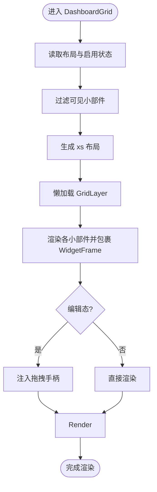

图表来源

- [src/components/layout/DashboardGrid.tsx:42-110](file://src/components/layout/DashboardGrid.tsx#L42-L110)

章节来源

- [src/components/layout/DashboardGrid.tsx:1-110](file://src/components/layout/DashboardGrid.tsx#L1-L110)
- [src/types/widget.ts:1-34](file://src/types/widget.ts#L1-L34)

### GridLayer：响应式网格与拖拽/缩放

- 职责
  - 基于 react-grid-layout 提供拖拽、缩放、断点切换与布局持久化。
  - 支持不同断点下的列数与布局数组，compactType 垂直紧凑。
- 关键交互
  - props：visible、xsLayout、editMode、isMobile、onLayoutChange、onBreakpointChange。
  - 行为：根据 editMode 控制拖拽/缩放可用性；拖拽句柄选择器限定在 .widget-drag-handle。
- 性能
  - 仅在编辑态启用拖拽/缩放，避免不必要的交互开销。

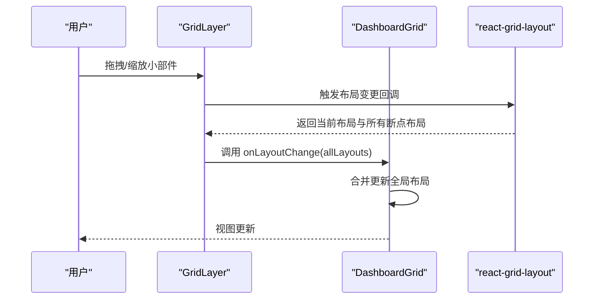

图表来源

- [src/components/layout/GridLayer.tsx:20-50](file://src/components/layout/GridLayer.tsx#L20-L50)
- [src/components/layout/DashboardGrid.tsx:60-75](file://src/components/layout/DashboardGrid.tsx#L60-L75)

章节来源

- [src/components/layout/GridLayer.tsx:1-50](file://src/components/layout/GridLayer.tsx#L1-L50)
- [src/components/layout/DashboardGrid.tsx:60-75](file://src/components/layout/DashboardGrid.tsx#L60-L75)

### WidgetFrame：统一外观与行为

- 职责
  - 统一小部件容器的背景、圆角、阴影、玻璃模糊等视觉样式。
  - 在编辑态下添加高亮边框，增强可操作性。
  - 支持透明/非透明两种模式，非透明时提供内边距。
- 设计要点
  - 通过 props 透传 children，保持对内部小部件的零侵入。
  - 使用条件类名组合实现主题与模式切换。

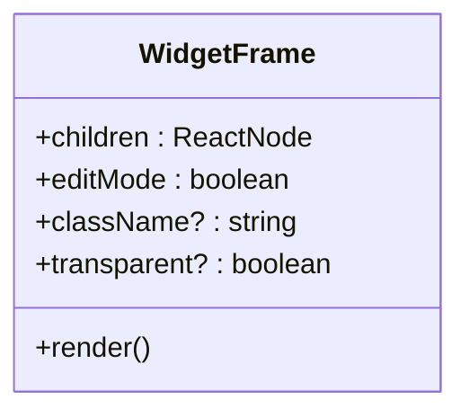

图表来源

- [src/components/layout/WidgetFrame.tsx:1-31](file://src/components/layout/WidgetFrame.tsx#L1-L31)

章节来源

- [src/components/layout/WidgetFrame.tsx:1-31](file://src/components/layout/WidgetFrame.tsx#L1-L31)

### 小部件：SearchBar

- 功能
  - 搜索输入、引擎切换、建议列表、键盘导航与提交。
  - 使用节流与 AbortController 控制建议请求，避免频繁网络调用。
  - 通过 useShortcut 实现全局快捷键触发焦点。
- 通信
  - 从 useSettingsStore 读取当前搜索引擎。
  - 通过内部状态管理 query、suggestions、activeIndex、focused。
- 可访问性
  - 正确设置 aria-\* 属性，支持键盘操作与屏幕阅读器。

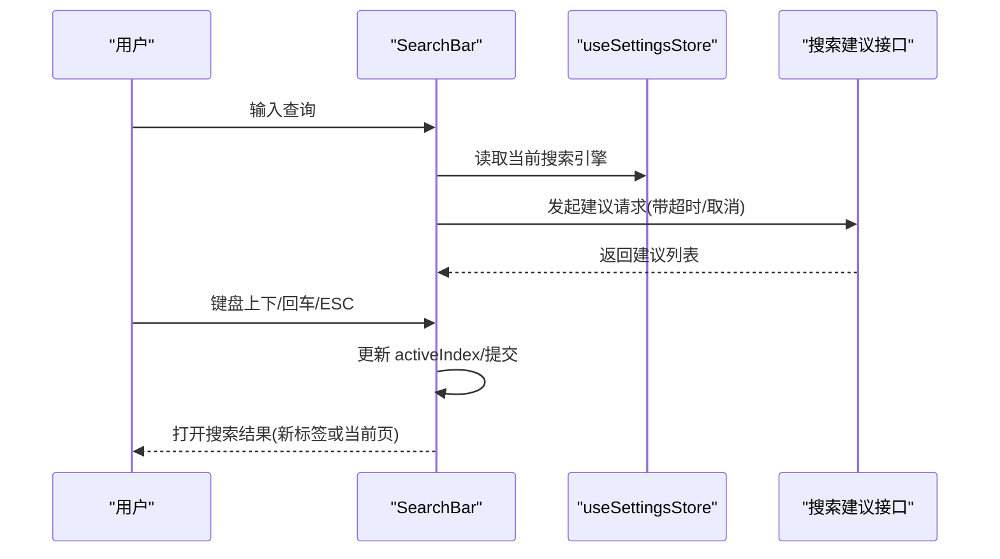

图表来源

- [src/components/widgets/SearchBar/SearchBar.tsx:9-116](file://src/components/widgets/SearchBar/SearchBar.tsx#L9-L116)
- [src/store/useSettingsStore.ts:10-31](file://src/store/useSettingsStore.ts#L10-L31)

章节来源

- [src/components/widgets/SearchBar/SearchBar.tsx:1-116](file://src/components/widgets/SearchBar/SearchBar.tsx#L1-L116)
- [src/lib/useShortcut.ts:14-49](file://src/lib/useShortcut.ts#L14-L49)

### 小部件：Clock

- 功能
  - 分、秒显示，日期与星期中文格式化。
  - 秒级渲染独立拆分，减少每秒重渲染范围。
- 生命周期
  - 使用 document.visibilitychange 与定时器，在页面隐藏时暂停，恢复时重置计时。
- 性能
  - 仅在可见时更新秒数，降低不必要的 diff。

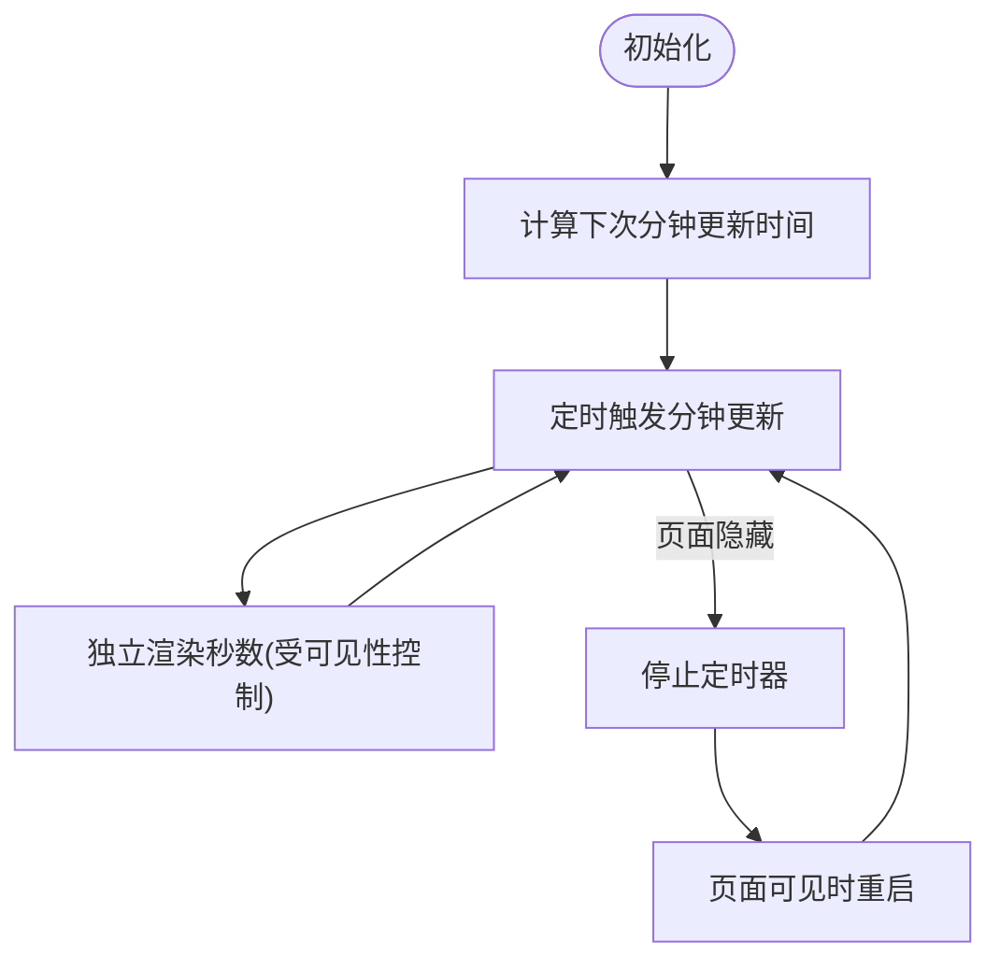

图表来源

- [src/components/widgets/Clock/Clock.tsx:61-95](file://src/components/widgets/Clock/Clock.tsx#L61-L95)

章节来源

- [src/components/widgets/Clock/Clock.tsx:1-112](file://src/components/widgets/Clock/Clock.tsx#L1-L112)

### 小部件：ShortcutsGrid

- 功能
  - 快捷方式网格展示，支持添加快捷方式弹窗。
  - 通过 useShortcut 触发添加对话框。
- 状态
  - 从 useShortcutsStore 读取快捷方式列表。
  - 从 useSettingsStore 读取编辑态开关，决定是否允许编辑。

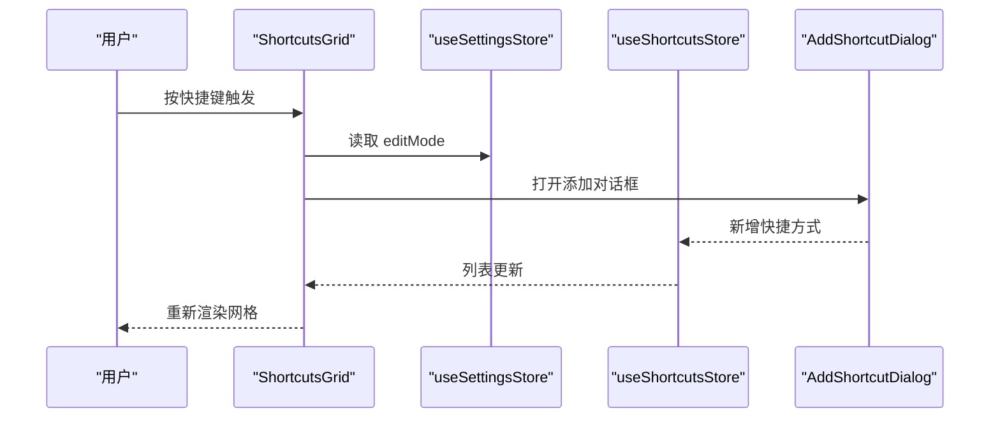

图表来源

- [src/components/widgets/Shortcuts/ShortcutsGrid.tsx:9-38](file://src/components/widgets/Shortcuts/ShortcutsGrid.tsx#L9-L38)
- [src/store/useShortcutsStore.ts](file://src/store/useShortcutsStore.ts)
- [src/store/useSettingsStore.ts:10-31](file://src/store/useSettingsStore.ts#L10-L31)

章节来源

- [src/components/widgets/Shortcuts/ShortcutsGrid.tsx:1-38](file://src/components/widgets/Shortcuts/ShortcutsGrid.tsx#L1-L38)
- [src/lib/useShortcut.ts:14-49](file://src/lib/useShortcut.ts#L14-L49)

### 小部件：WeatherWidget

- 功能
  - 根据天气代码映射图标与描述，展示温度、风速与定位信息。
  - 异常与加载态分别处理。
- 数据
  - 通过 useWeather 获取天气数据，内部使用查找表进行映射。

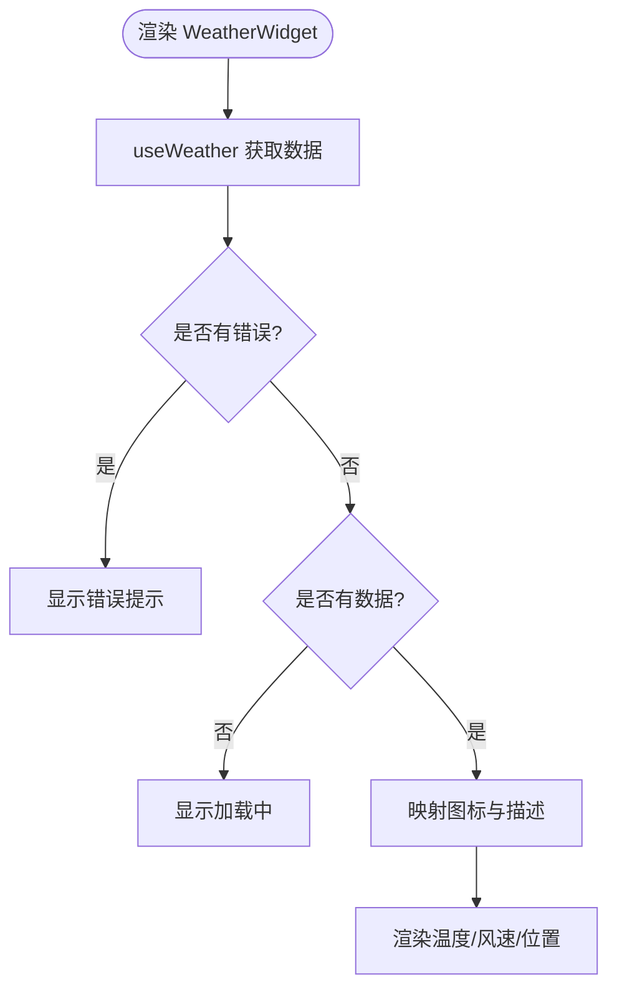

图表来源

- [src/components/widgets/Weather/Weather.tsx:36-81](file://src/components/widgets/Weather/Weather.tsx#L36-L81)

章节来源

- [src/components/widgets/Weather/Weather.tsx:1-81](file://src/components/widgets/Weather/Weather.tsx#L1-L81)

### 小部件：TodoList

- 功能
  - 添加待办、标记完成、清理已完成项。
  - 顶部显示未完成数量，底部列表滚动展示。
- 状态
  - 从 useTodoStore 读取 items、add、clearCompleted。

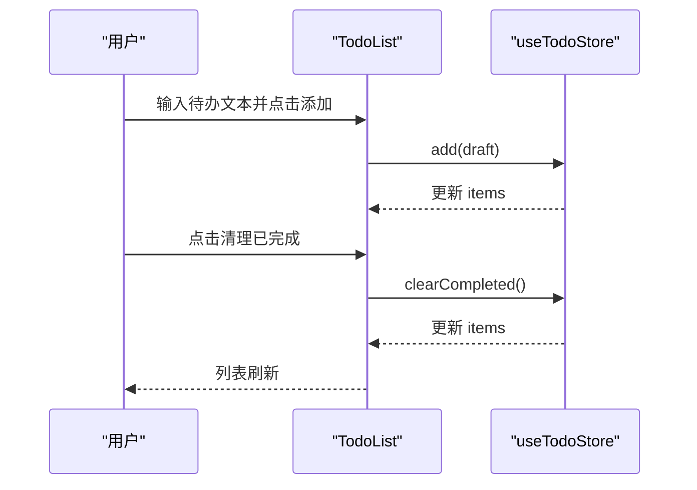

图表来源

- [src/components/widgets/Todo/TodoList.tsx:6-69](file://src/components/widgets/Todo/TodoList.tsx#L6-L69)
- [src/store/useTodoStore.ts](file://src/store/useTodoStore.ts)

章节来源

- [src/components/widgets/Todo/TodoList.tsx:1-69](file://src/components/widgets/Todo/TodoList.tsx#L1-L69)

### 小部件：BookmarksTree

- 功能
  - 书签树形展示，支持展开/折叠与递归渲染。
  - 使用 memo 优化渲染性能。
- 状态
  - 从 useBookmarksUiStore 读取展开状态，控制节点展开/收起。

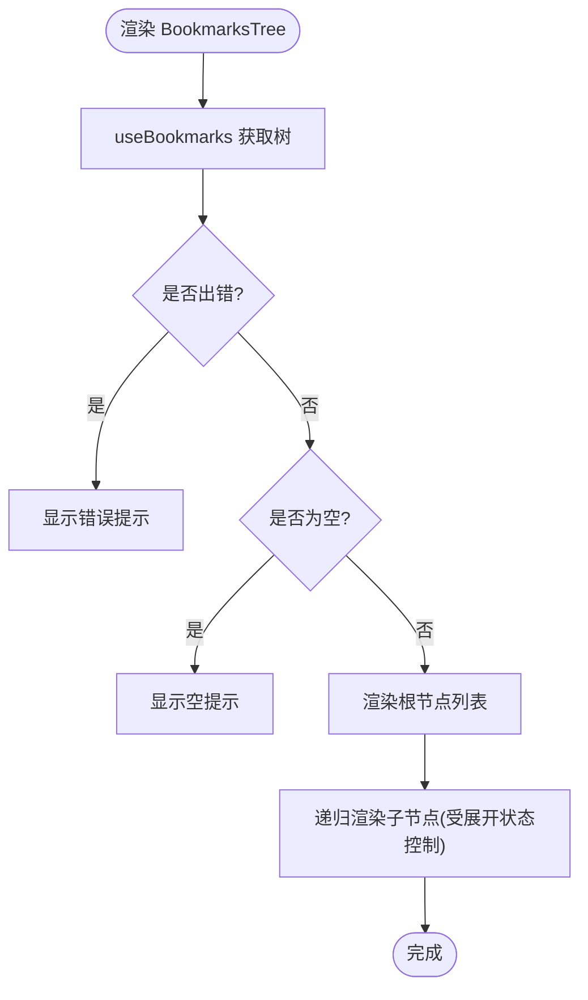

图表来源

- [src/components/widgets/Bookmarks/BookmarksTree.tsx:56-88](file://src/components/widgets/Bookmarks/BookmarksTree.tsx#L56-L88)

章节来源

- [src/components/widgets/Bookmarks/BookmarksTree.tsx:1-88](file://src/components/widgets/Bookmarks/BookmarksTree.tsx#L1-L88)

### 基础 UI：ErrorBoundary

- 职责
  - 捕获子树异常，记录日志并提供重试入口。
- 设计
  - 通过静态 getDerivedStateFromError 升级到错误态；fallback 可选。

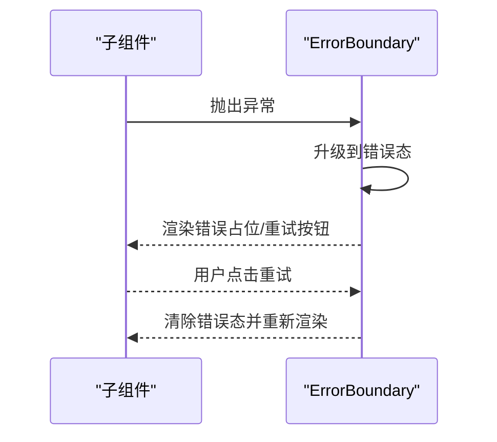

图表来源

- [src/components/ui/ErrorBoundary.tsx:15-47](file://src/components/ui/ErrorBoundary.tsx#L15-L47)

章节来源

- [src/components/ui/ErrorBoundary.tsx:1-48](file://src/components/ui/ErrorBoundary.tsx#L1-L48)

### 基础 UI：Button

- 职责
  - 提供多种变体与尺寸的按钮，支持禁用态与过渡动画。
- 设计
  - 使用 forwardRef 透传 ref；通过 className 组合样式。

章节来源

- [src/components/ui/Button.tsx:1-41](file://src/components/ui/Button.tsx#L1-L41)

## 依赖分析

- 组件耦合
  - DashboardGrid 与 GridLayer、WidgetFrame 强耦合，负责布局与外观。
  - 小部件之间弱耦合，通过 store 或 props 通信。
- 外部依赖
  - react-grid-layout：网格拖拽/缩放。
  - lucide-react：图标库。
  - Zustand：状态管理。
- 状态依赖
  - useLayoutStore：全局布局与启用状态。
  - useSettingsStore：编辑态、搜索引擎、壁纸等设置。
  - 各小部件 store：快捷方式、待办、书签 UI 状态。

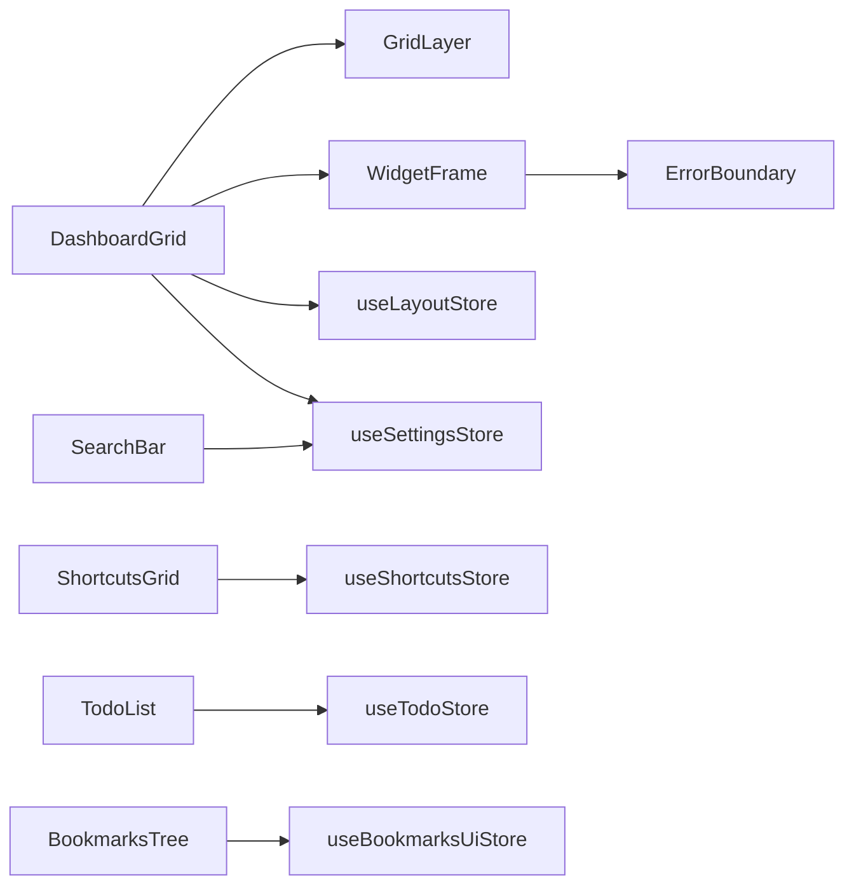

图表来源

- [src/components/layout/DashboardGrid.tsx:1-15](file://src/components/layout/DashboardGrid.tsx#L1-L15)
- [src/store/useLayoutStore.ts:1-58](file://src/store/useLayoutStore.ts#L1-L58)
- [src/store/useSettingsStore.ts:1-89](file://src/store/useSettingsStore.ts#L1-L89)
- [src/store/useShortcutsStore.ts](file://src/store/useShortcutsStore.ts)
- [src/store/useTodoStore.ts](file://src/store/useTodoStore.ts)
- [src/store/useBookmarksUiStore.ts](file://src/store/useBookmarksUiStore.ts)
- [src/components/ui/ErrorBoundary.tsx:1-48](file://src/components/ui/ErrorBoundary.tsx#L1-L48)

章节来源

- [src/store/useLayoutStore.ts:1-58](file://src/store/useLayoutStore.ts#L1-L58)
- [src/store/useSettingsStore.ts:1-89](file://src/store/useSettingsStore.ts#L1-L89)

## 性能考虑

- 懒加载
  - DashboardGrid 对 GridLayer 使用 lazy + Suspense，首屏不阻塞网格库加载。
- 计算缓存
  - DashboardGrid 使用 useMemo 缓存 visible 与 xsLayout，避免重复计算。
- 渲染优化
  - BookmarksTree 使用 memo 优化树节点渲染。
  - Clock 将秒渲染拆分为独立组件，减少每秒重渲染范围。
- 请求节流与取消
  - SearchBar 使用 AbortController 与延迟，避免频繁网络请求。
- 交互降噪
  - useShortcut 过滤无效修饰键与交互元素，避免与浏览器/系统快捷键冲突。
- 布局与渲染
  - GridLayer 在编辑态才启用拖拽/缩放，减少非必要交互开销。

章节来源

- [src/components/layout/DashboardGrid.tsx:17-22](file://src/components/layout/DashboardGrid.tsx#L17-L22)
- [src/components/widgets/Bookmarks/BookmarksTree.tsx:7-54](file://src/components/widgets/Bookmarks/BookmarksTree.tsx#L7-L54)
- [src/components/widgets/Clock/Clock.tsx:25-59](file://src/components/widgets/Clock/Clock.tsx#L25-L59)
- [src/components/widgets/SearchBar/SearchBar.tsx:20-32](file://src/components/widgets/SearchBar/SearchBar.tsx#L20-L32)
- [src/components/layout/GridLayer.tsx:40-43](file://src/components/layout/GridLayer.tsx#L40-L43)
- [src/lib/useShortcut.ts:21-47](file://src/lib/useShortcut.ts#L21-L47)

## 故障排查指南

- 小部件渲染失败
  - 使用 ErrorBoundary 包裹 WidgetFrame 内容，出现异常会显示“组件加载失败”与“重试”按钮。
  - 查看日志输出定位具体组件与堆栈。
- 搜索建议无响应
  - 检查搜索引擎配置与网络请求是否被 AbortController 取消。
  - 确认输入框焦点与键盘事件未被其他交互元素拦截。
- 布局保存异常
  - 确认 useLayoutStore 是否正确持久化至 Chrome Storage。
  - 若跨设备不同步，检查 registerRemoteSync 是否生效。
- 编辑态拖拽无效
  - 确认 editMode 开启且非移动端；检查拖拽句柄选择器与 isDraggable/isResizable 设置。

章节来源

- [src/components/ui/ErrorBoundary.tsx:15-47](file://src/components/ui/ErrorBoundary.tsx#L15-L47)
- [src/store/useLayoutStore.ts:56-58](file://src/store/useLayoutStore.ts#L56-L58)
- [src/store/useSettingsStore.ts:87-89](file://src/store/useSettingsStore.ts#L87-L89)

## 结论

该架构以 DashboardGrid 为核心，结合 GridLayer 与 WidgetFrame 实现了可编辑、响应式的网格布局；小部件围绕自身职责自包含，通过 store 与 props 进行解耦通信；基础 UI 组件提供一致的交互与容错能力。整体设计强调可维护性、可扩展性与性能优化，适合持续演进与团队协作。

## 附录

- 组件关系图（概念示意）

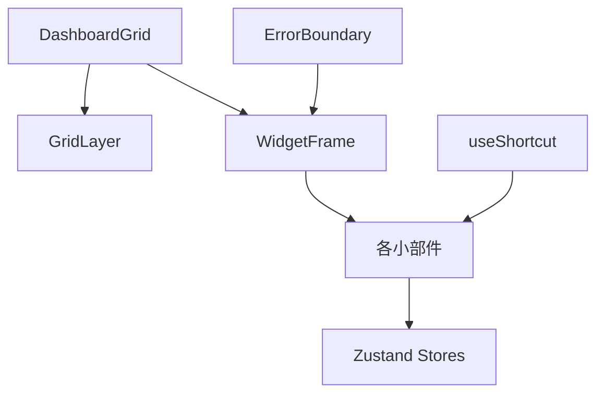
