# 书签组件

<cite>
**本文档引用的文件**
- [BookmarksTree.tsx](file://src/components/widgets/Bookmarks/BookmarksTree.tsx)
- [useBookmarks.ts](file://src/components/widgets/Bookmarks/useBookmarks.ts)
- [useBookmarksUiStore.ts](file://src/store/useBookmarksUiStore.ts)
- [storage.ts](file://src/store/storage.ts)
- [DashboardGrid.tsx](file://src/components/layout/DashboardGrid.tsx)
- [App.tsx](file://src/newtab/App.tsx)
- [widget.ts](file://src/types/widget.ts)
- [globals.css](file://src/styles/globals.css)
</cite>

## 更新摘要

**变更内容**

- 增强了错误状态和空状态处理机制
- 添加了上下文图标和解释性文本的用户界面
- 完善了书签加载失败和无书签数据的用户体验

## 目录

1. [简介](#简介)
2. [项目结构](#项目结构)
3. [核心组件](#核心组件)
4. [架构概览](#架构概览)
5. [详细组件分析](#详细组件分析)
6. [错误状态和空状态处理](#错误状态和空状态处理)
7. [依赖关系分析](#依赖关系分析)
8. [性能考虑](#性能考虑)
9. [故障排除指南](#故障排除指南)
10. [结论](#结论)

## 简介

书签组件是 Tab 新标签页扩展中的一个核心功能模块，它提供了与 Chrome 浏览器书签系统的深度集成。该组件实现了完整的书签树形结构渲染、动态加载、用户交互控制以及与浏览器书签系统的实时同步机制。

**更新** 组件现已增强了错误状态和空状态处理，为用户提供更友好的上下文反馈和操作指导。

该组件的主要特点包括：

- 基于 Chrome Bookmarks API 的完整集成
- 实时书签状态监听和自动更新
- 树形结构的层级展开/折叠功能
- 用户界面状态持久化存储
- 与多标签页环境的同步机制
- **增强的错误状态和空状态处理**

## 项目结构

书签组件位于组件库的 `widgets/Bookmarks` 目录下，采用模块化设计，包含以下关键文件：

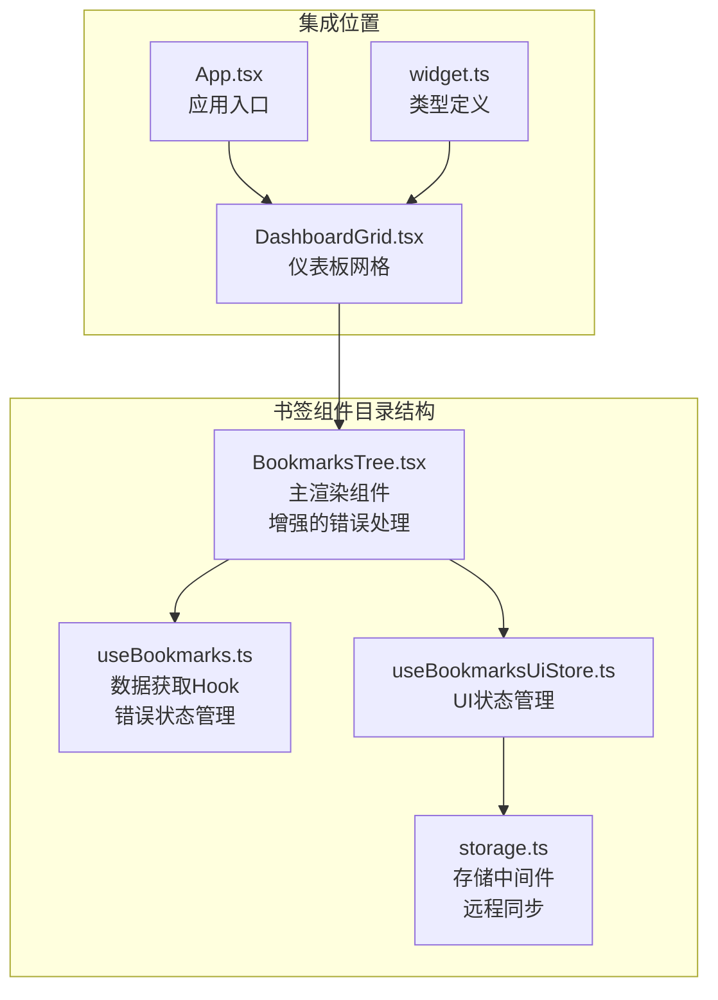

**图表来源**

- [BookmarksTree.tsx:1-110](file://src/components/widgets/Bookmarks/BookmarksTree.tsx#L1-L110)
- [useBookmarks.ts:1-55](file://src/components/widgets/Bookmarks/useBookmarks.ts#L1-L55)
- [useBookmarksUiStore.ts:1-34](file://src/store/useBookmarksUiStore.ts#L1-L34)

**章节来源**

- [BookmarksTree.tsx:1-110](file://src/components/widgets/Bookmarks/BookmarksTree.tsx#L1-L110)
- [useBookmarks.ts:1-55](file://src/components/widgets/Bookmarks/useBookmarks.ts#L1-L55)
- [useBookmarksUiStore.ts:1-34](file://src/store/useBookmarksUiStore.ts#L1-L34)

## 核心组件

### 数据模型定义

书签组件的核心数据结构基于 Chrome 浏览器的书签树节点定义：

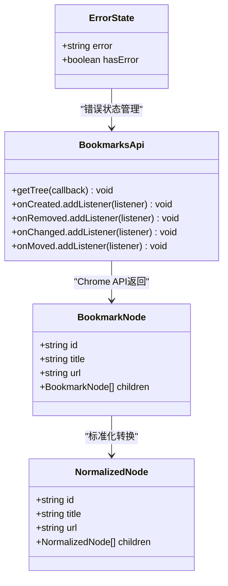

**图表来源**

- [useBookmarks.ts:4-18](file://src/components/widgets/Bookmarks/useBookmarks.ts#L4-L18)

### 主要组件职责

1. **BookmarksTree 组件**：负责书签树的渲染和用户交互，**新增错误状态和空状态处理**
2. **useBookmarks Hook**：封装 Chrome Bookmarks API 的数据获取和监听，**增强错误状态管理**
3. **useBookmarksUiStore**：管理书签树的 UI 状态（展开/折叠）
4. **存储中间件**：提供跨标签页的状态同步能力

**章节来源**

- [BookmarksTree.tsx:56-110](file://src/components/widgets/Bookmarks/BookmarksTree.tsx#L56-L110)
- [useBookmarks.ts:20-55](file://src/components/widgets/Bookmarks/useBookmarks.ts#L20-L55)
- [useBookmarksUiStore.ts:10-34](file://src/store/useBookmarksUiStore.ts#L10-L34)

## 架构概览

书签组件采用分层架构设计，实现了清晰的关注点分离：

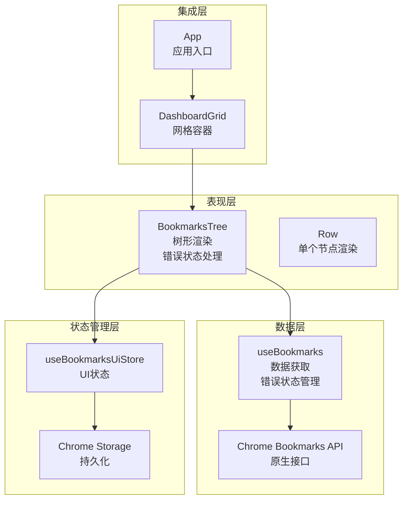

**图表来源**

- [BookmarksTree.tsx:3-5](file://src/components/widgets/Bookmarks/BookmarksTree.tsx#L3-L5)
- [useBookmarks.ts:24-51](file://src/components/widgets/Bookmarks/useBookmarks.ts#L24-L51)
- [useBookmarksUiStore.ts:10-30](file://src/store/useBookmarksUiStore.ts#L10-L30)

### 数据流处理

书签组件的数据流遵循以下模式：

1. **初始化阶段**：组件挂载时通过 useBookmarks Hook 获取初始书签数据
2. **监听阶段**：注册 Chrome Bookmarks API 的事件监听器
3. **更新阶段**：当浏览器书签发生变化时，自动触发重新加载
4. **渲染阶段**：根据 UI 状态渲染树形结构，**新增错误状态和空状态渲染**
5. **错误处理阶段**：当发生错误时，显示上下文图标和解释性文本

**章节来源**

- [useBookmarks.ts:24-51](file://src/components/widgets/Bookmarks/useBookmarks.ts#L24-L51)

## 详细组件分析

### BookmarksTree 组件分析

BookmarksTree 是书签组件的主渲染组件，负责整个书签树的可视化展示。**经过更新，现在具备完整的错误状态和空状态处理能力**：

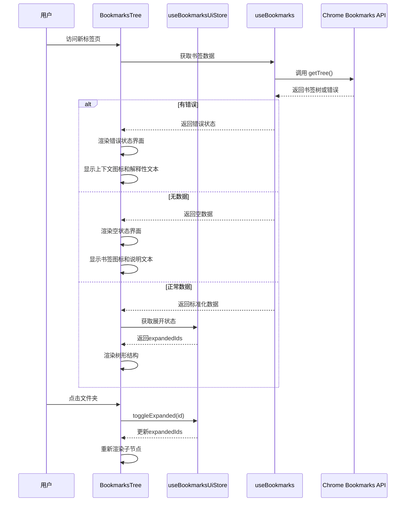

**图表来源**

- [BookmarksTree.tsx:56-110](file://src/components/widgets/Bookmarks/BookmarksTree.tsx#L56-L110)
- [useBookmarks.ts:24-51](file://src/components/widgets/Bookmarks/useBookmarks.ts#L24-L51)

#### 树形结构渲染逻辑

组件实现了智能的树形结构渲染，包括：

1. **层级展开/折叠**：通过 `expandedIds` 状态控制节点的显示/隐藏
2. **深度计算**：使用 `depth` 参数计算缩进距离
3. **条件渲染**：根据节点类型（文件夹/书签）渲染不同组件
4. **动态样式**：根据展开状态动态调整图标旋转角度
5. \***\*新增** 错误状态处理\*\*：当 API 调用失败时显示错误界面
6. \***\*新增** 空状态处理\*\*：当没有书签数据时显示空状态界面

**章节来源**

- [BookmarksTree.tsx:7-54](file://src/components/widgets/Bookmarks/BookmarksTree.tsx#L7-L54)

### useBookmarks Hook 分析

useBookmarks Hook 封装了与 Chrome Bookmarks API 的交互，并**增强了错误状态管理**：

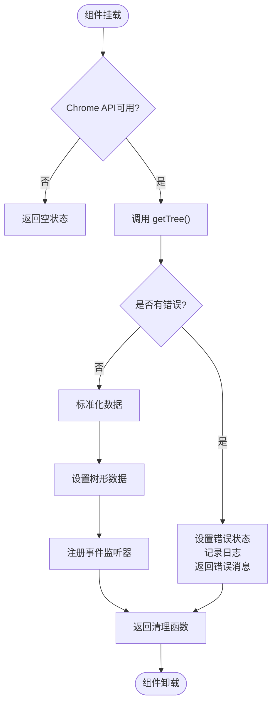

**图表来源**

- [useBookmarks.ts:24-51](file://src/components/widgets/Bookmarks/useBookmarks.ts#L24-L51)

#### 事件监听机制

组件监听以下 Chrome Bookmarks API 事件：

1. **onCreated**：书签创建时触发
2. **onRemoved**：书签删除时触发
3. **onChanged**：书签属性变化时触发
4. **onMoved**：书签位置移动时触发

这些事件确保组件能够实时反映浏览器书签系统的变化。

**章节来源**

- [useBookmarks.ts:43-50](file://src/components/widgets/Bookmarks/useBookmarks.ts#L43-L50)

### UI 状态管理分析

useBookmarksUiStore 使用 Zustand 进行状态管理，实现了以下功能：

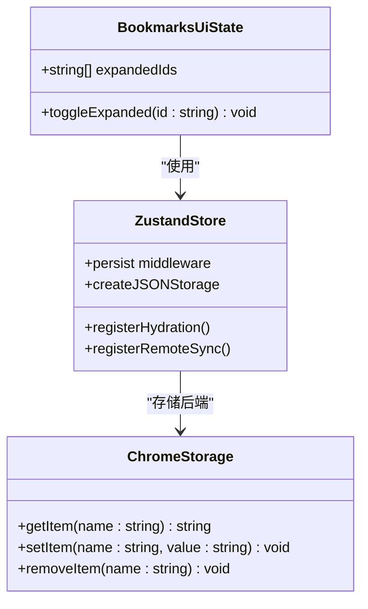

**图表来源**

- [useBookmarksUiStore.ts:5-30](file://src/store/useBookmarksUiStore.ts#L5-L30)

#### 状态持久化策略

1. **本地存储**：使用 `chrome.storage.local` 持久化用户偏好
2. **跨标签页同步**：通过 `registerRemoteSync` 实现多标签页状态同步
3. **水合机制**：应用启动时从存储中恢复状态
4. **版本迁移**：支持状态格式的版本升级

**章节来源**

- [useBookmarksUiStore.ts:10-34](file://src/store/useBookmarksUiStore.ts#L10-L34)
- [storage.ts:49-62](file://src/store/storage.ts#L49-L62)

### 集成点分析

书签组件在应用架构中的集成点：

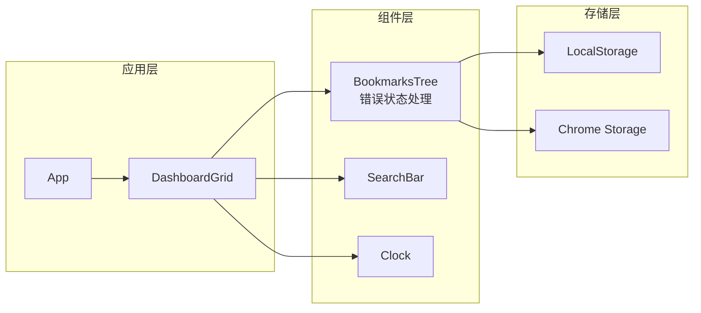

**图表来源**

- [DashboardGrid.tsx:24-31](file://src/components/layout/DashboardGrid.tsx#L24-L31)
- [App.tsx:10-110](file://src/newtab/App.tsx#L10-L110)

**章节来源**

- [DashboardGrid.tsx:13-31](file://src/components/layout/DashboardGrid.tsx#L13-L31)
- [widget.ts:8-23](file://src/types/widget.ts#L8-L23)

## 错误状态和空状态处理

**新增** 书签组件现在具备完善的错误状态和空状态处理机制，为用户提供清晰的上下文反馈。

### 错误状态处理

当 Chrome Bookmarks API 调用失败时，组件会显示专门的错误界面：

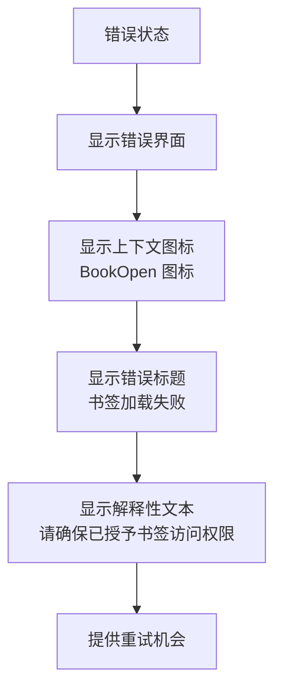

**错误界面特性**：

- **上下文图标**：使用 BookOpen 图标表示书签相关错误
- **清晰标题**：显示 "书签加载失败" 的明确信息
- **解释性文本**：提供 "请确保已授予书签访问权限" 的具体指导
- **友好设计**：使用半透明背景和适当的间距

### 空状态处理

当没有书签数据时，组件会显示专门的空状态界面：

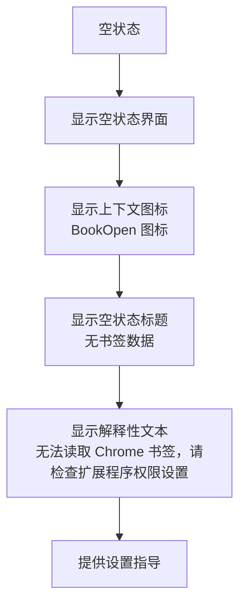

**空状态界面特性**：

- **上下文图标**：使用 BookOpen 图标表示书签相关状态
- **清晰标题**：显示 "无书签数据" 的明确信息
- **解释性文本**：提供 "无法读取 Chrome 书签，请检查扩展程序权限设置" 的具体指导
- **用户引导**：帮助用户理解问题所在并提供解决方向

### 状态切换逻辑

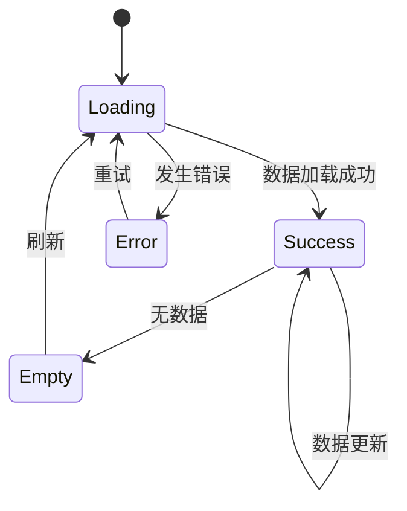

**状态处理流程**：

1. **初始化**：组件挂载时进入加载状态
2. **成功状态**：正常加载书签数据时显示树形结构
3. **错误状态**：API 调用失败时显示错误界面
4. **空状态**：无书签数据时显示空状态界面
5. **状态切换**：根据数据变化自动在不同状态间切换

**章节来源**

- [BookmarksTree.tsx:59-95](file://src/components/widgets/Bookmarks/BookmarksTree.tsx#L59-L95)
- [useBookmarks.ts:28-38](file://src/components/widgets/Bookmarks/useBookmarks.ts#L28-L38)

## 依赖关系分析

书签组件的依赖关系图展示了各模块间的耦合程度：

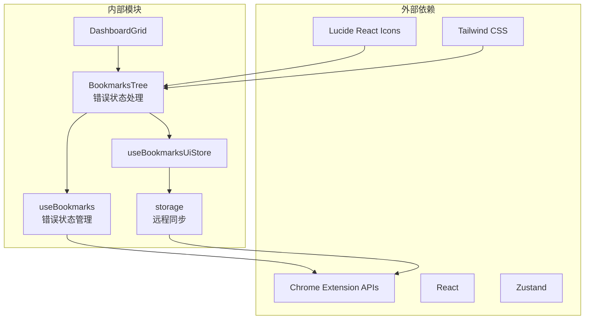

**图表来源**

- [BookmarksTree.tsx:2-5](file://src/components/widgets/Bookmarks/BookmarksTree.tsx#L2-L5)
- [useBookmarks.ts:1-2](file://src/components/widgets/Bookmarks/useBookmarks.ts#L1-L2)
- [useBookmarksUiStore.ts:1-3](file://src/store/useBookmarksUiStore.ts#L1-L3)

### 关键依赖特性

1. **低耦合设计**：各模块职责明确，相互独立
2. **可测试性**：Hook 和 Store 可以独立测试
3. **可维护性**：清晰的模块边界便于代码维护
4. **可扩展性**：新的功能可以按需添加而不影响现有代码
5. \***\*新增** 错误处理独立性\*\*：错误状态处理逻辑与主要业务逻辑分离

**章节来源**

- [BookmarksTree.tsx:1-110](file://src/components/widgets/Bookmarks/BookmarksTree.tsx#L1-L110)
- [useBookmarks.ts:1-55](file://src/components/widgets/Bookmarks/useBookmarks.ts#L1-L55)

## 性能考虑

### 当前实现的性能特征

书签组件在设计上考虑了以下性能因素：

1. **懒加载机制**：组件按需渲染，避免不必要的计算
2. **记忆化优化**：使用 React.memo 防止不必要的重渲染
3. **事件监听优化**：只在需要时注册和移除事件监听器
4. **状态持久化**：避免重复的 API 调用
5. \***\*新增** 错误状态快速响应\*\*：错误状态界面无需复杂计算

### 大数据集处理建议

针对大型书签集合，建议实施以下优化策略：

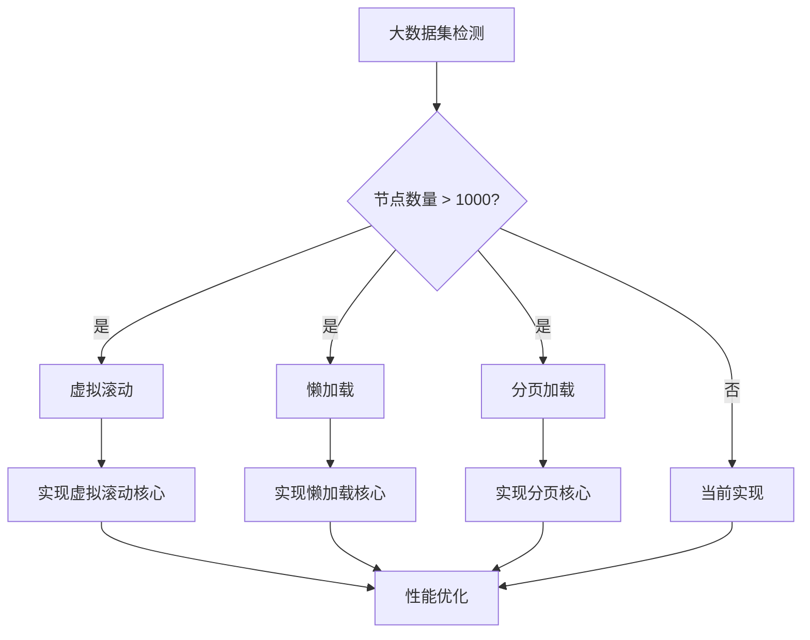

### 虚拟滚动实现方案

对于超大书签集合，建议实现虚拟滚动：

1. **可见区域计算**：只渲染可视区域内的节点
2. **滚动事件处理**：动态计算需要渲染的节点范围
3. **高度缓存**：缓存节点高度以提高滚动性能
4. **占位符机制**：为未渲染的节点提供占位符

### 懒加载策略

实现懒加载以减少初始渲染负担：

1. **按需加载**：仅在用户展开文件夹时加载子节点
2. **预加载机制**：在用户接近底部时预加载更多节点
3. **缓存策略**：缓存已加载的节点以提高后续访问速度
4. **错误处理**：处理加载失败的情况并提供重试机制

## 故障排除指南

### 常见问题及解决方案

#### 1. 权限问题

**症状**：书签加载失败，显示权限错误提示

**原因**：扩展程序缺少书签访问权限

**解决方案**：

- 检查 manifest 文件中的权限配置
- 在浏览器扩展设置中启用书签访问权限
- 提供用户友好的权限申请流程
- **新增** 错误状态界面提供具体的权限设置指导

#### 2. 同步问题

**症状**：多标签页间书签状态不一致

**原因**：状态同步机制失效

**解决方案**：

- 检查 `registerRemoteSync` 的注册情况
- 验证 `chrome.storage.onChanged` 事件监听
- 确保状态序列化/反序列化正确
- **新增** 错误状态界面提供同步问题的诊断信息

#### 3. 性能问题

**症状**：大量书签导致渲染缓慢

**原因**：全量渲染所有节点

**解决方案**：

- 实施虚拟滚动或懒加载
- 优化 React 组件的重渲染
- 添加加载状态和进度指示
- **新增** 错误状态界面提供性能问题的诊断

### 调试技巧

1. **开发者工具**：使用浏览器开发者工具监控 Chrome API 调用
2. **日志记录**：在关键路径添加详细的日志信息
3. **状态检查**：定期检查 Zustand store 的状态变化
4. **性能分析**：使用 React Profiler 分析组件渲染性能
5. \***\*新增** 错误状态调试\*\*：利用错误状态界面提供的详细错误信息进行调试

## 结论

书签组件展现了现代浏览器扩展开发的最佳实践，具有以下突出特点：

### 设计优势

1. **架构清晰**：分层设计使得代码易于理解和维护
2. **功能完整**：实现了从数据获取到用户交互的完整闭环
3. **用户体验**：提供了流畅的交互体验和良好的视觉反馈
4. **可扩展性**：模块化设计便于功能扩展和定制
5. \***\*新增** 错误处理完善\*\*：具备完整的错误状态和空状态处理机制

### 技术亮点

1. **实时同步**：通过 Chrome API 实现与浏览器书签系统的实时同步
2. **状态管理**：使用 Zustand 实现轻量级但功能强大的状态管理
3. **跨标签页同步**：通过 Chrome Storage 实现多标签页状态一致性
4. **性能优化**：采用多种优化策略确保在大数据集下的良好性能
5. \***\*新增** 用户体验优化\*\*：通过上下文图标和解释性文本提升用户满意度

### 改进建议

1. **搜索功能**：当前版本缺少书签搜索功能，建议添加关键词匹配和结果高亮
2. **拖拽排序**：实现书签的拖拽排序和移动功能
3. **虚拟滚动**：为超大书签集合实现虚拟滚动优化
4. **主题定制**：提供更多样式的定制选项
5. \***\*新增** 错误恢复机制\*\*：实现自动重试和错误恢复功能

书签组件为 Tab 扩展提供了坚实的基础，其设计理念和实现方式值得其他类似组件参考和借鉴。**新增的错误状态和空状态处理功能显著提升了用户体验，为用户提供了更清晰的问题诊断和操作指导**。
