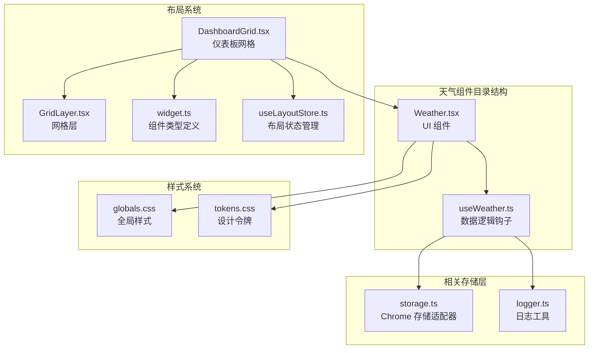
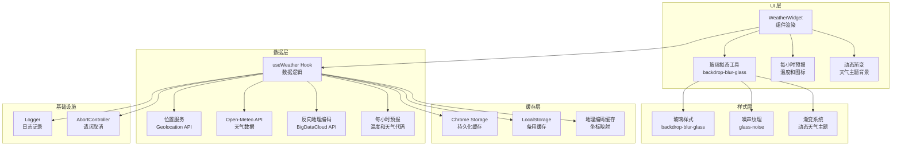
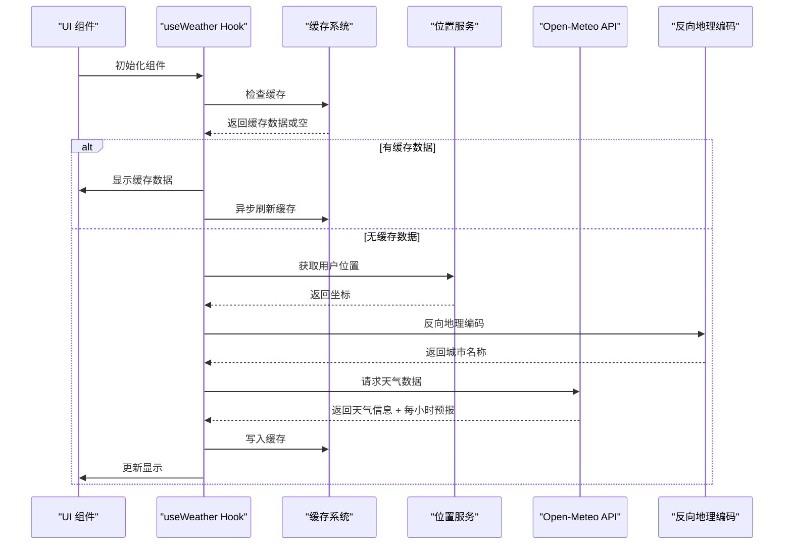
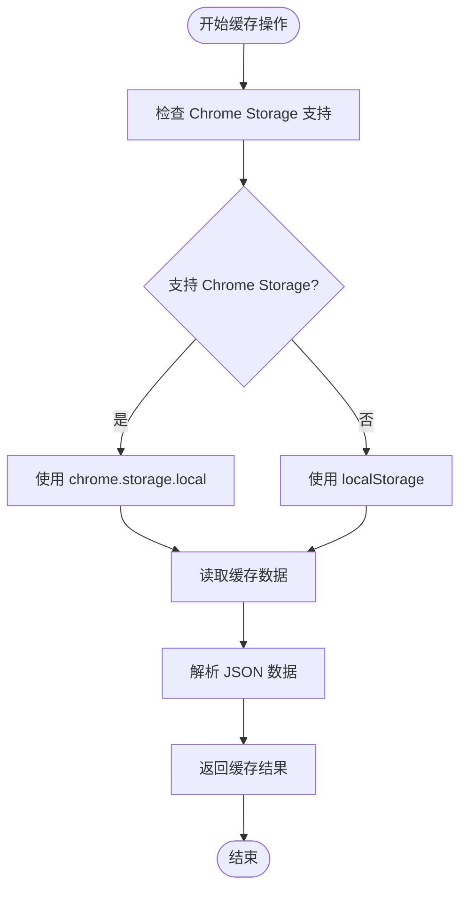
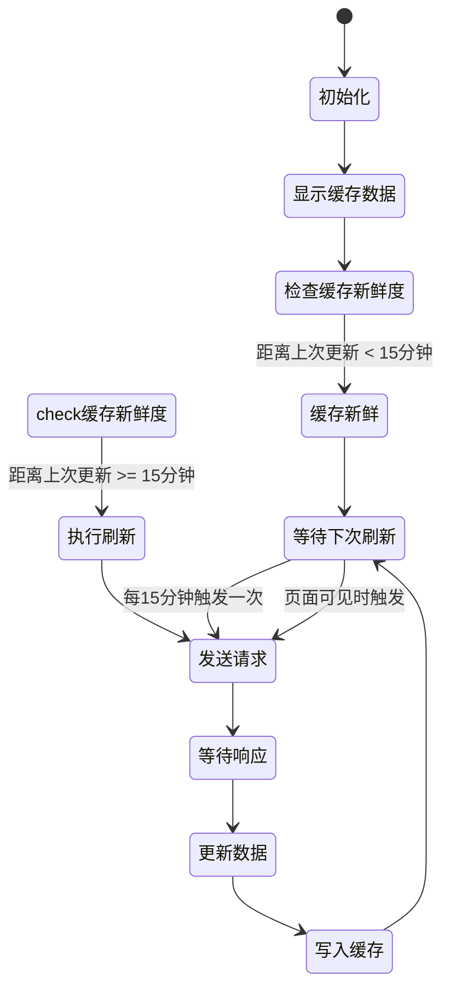
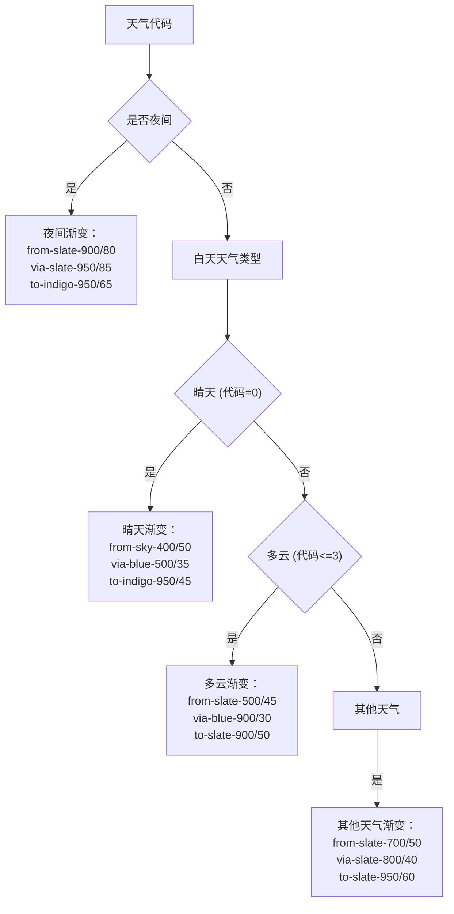
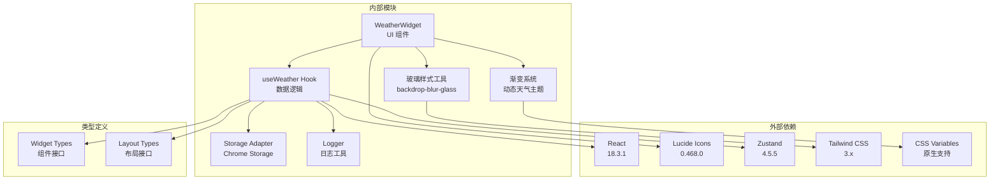

# 天气组件

<cite>
**本文档引用的文件**
- [Weather.tsx](file://src/components/widgets/Weather/Weather.tsx)
- [useWeather.ts](file://src/components/widgets/Weather/useWeather.ts)
- [globals.css](file://src/styles/globals.css)
- [tokens.css](file://src/styles/tokens.css)
- [DashboardGrid.tsx](file://src/components/layout/DashboardGrid.tsx)
- [GridLayer.tsx](file://src/components/layout/GridLayer.tsx)
- [widget.ts](file://src/types/widget.ts)
- [useLayoutStore.ts](file://src/store/useLayoutStore.ts)
- [storage.ts](file://src/store/storage.ts)
- [logger.ts](file://src/lib/logger.ts)
- [wallpaperCache.ts](file://src/lib/wallpaperCache.ts)
- [useSettingsStore.ts](file://src/store/useSettingsStore.ts)
</cite>

## 更新摘要

**变更内容**

- 更新了玻璃拟态设计系统的实现细节
- 新增了动态天气主题渐变功能
- 增强了温度显示格式和样式
- 添加了每小时天气预报功能
- 集成了自定义SVG图标系统

## 目录

1. [简介](#简介)
2. [项目结构](#项目结构)
3. [核心组件](#核心组件)
4. [架构概览](#架构概览)
5. [详细组件分析](#详细组件分析)
6. [玻璃拟态设计系统](#玻璃拟态设计系统)
7. [依赖关系分析](#依赖关系分析)
8. [性能考虑](#性能考虑)
9. [故障排除指南](#故障排除指南)
10. [结论](#结论)

## 简介

天气组件是 Tab 新标签页扩展中的一个核心功能模块，它集成了 Open-Meteo API 来提供实时天气信息。该组件实现了完整的地理位置获取、天气数据请求、缓存机制和用户界面展示功能。通过智能的缓存策略和错误处理机制，确保了良好的用户体验和性能表现。

**最新更新**：组件现已实现完整的玻璃拟态设计系统，包括动态天气主题渐变、温度显示增强、每小时预报功能和自定义SVG图标。

## 项目结构

天气组件位于 `src/components/widgets/Weather/` 目录下，采用模块化设计，包含以下关键文件：

**图表来源**

- [Weather.tsx:1-162](file://src/components/widgets/Weather/Weather.tsx#L1-L162)
- [useWeather.ts:1-233](file://src/components/widgets/Weather/useWeather.ts#L1-L233)
- [globals.css:1-158](file://src/styles/globals.css#L1-L158)
- [tokens.css:1-291](file://src/styles/tokens.css#L1-L291)

**章节来源**

- [Weather.tsx:1-162](file://src/components/widgets/Weather/Weather.tsx#L1-L162)
- [useWeather.ts:1-233](file://src/components/widgets/Weather/useWeather.ts#L1-L233)
- [globals.css:1-158](file://src/styles/globals.css#L1-L158)
- [tokens.css:1-291](file://src/styles/tokens.css#L1-L291)

## 核心组件

### WeatherWidget 组件

WeatherWidget 是天气组件的 UI 展示层，负责将天气数据渲染为用户友好的界面。该组件实现了以下核心功能：

- **玻璃拟态设计**：使用 backdrop-blur 和 glass-noise 实现真实的玻璃效果
- **动态天气主题渐变**：根据天气状况和昼夜变化生成相应的渐变背景
- **温度显示增强**：改进的温度数字显示格式和样式
- **每小时预报功能**：显示未来6小时的天气预报
- **自定义SVG图标**：使用 Lucide React 图标库提供丰富的天气图标
- **本地化支持**：使用中文显示天气状况描述
- **响应式布局**：适应不同屏幕尺寸的显示需求
- **错误状态处理**：优雅地处理加载失败的情况

### useWeather Hook

useWeather 是天气组件的核心数据逻辑钩子，实现了完整的数据获取和缓存机制：

- **地理位置获取**：通过浏览器 Geolocation API 获取用户位置
- **反向地理编码**：将坐标转换为城市名称
- **天气数据请求**：调用 Open-Meteo API 获取实时天气信息
- **智能缓存策略**：实现 stale-while-revalidate 缓存模式
- **每小时预报数据**：获取未来6小时的天气预报信息

**章节来源**

- [Weather.tsx:36-162](file://src/components/widgets/Weather/Weather.tsx#L36-L162)
- [useWeather.ts:172-233](file://src/components/widgets/Weather/useWeather.ts#L172-L233)

## 架构概览

天气组件采用分层架构设计，各层职责明确，耦合度低：

**图表来源**

- [Weather.tsx:1-162](file://src/components/widgets/Weather/Weather.tsx#L1-L162)
- [useWeather.ts:1-233](file://src/components/widgets/Weather/useWeather.ts#L1-L233)
- [globals.css:95-138](file://src/styles/globals.css#L95-L138)
- [tokens.css:80-128](file://src/styles/tokens.css#L80-L128)

## 详细组件分析

### 数据流处理

天气组件的数据流遵循严格的处理顺序，确保数据的一致性和准确性：

**图表来源**

- [useWeather.ts:181-215](file://src/components/widgets/Weather/useWeather.ts#L181-L215)

### 缓存机制设计

天气组件实现了多层次的缓存策略，确保最佳的性能和用户体验：

#### 主要缓存策略

1. **stale-while-revalidate 模式**：立即显示缓存数据，同时在后台刷新
2. **地理位置缓存**：缓存坐标到城市名称的映射
3. **Chrome Storage 集成**：跨会话持久化缓存数据

#### 缓存键设计

**图表来源**

- [useWeather.ts:47-70](file://src/components/widgets/Weather/useWeather.ts#L47-L70)

**章节来源**

- [useWeather.ts:33-70](file://src/components/widgets/Weather/useWeather.ts#L33-L70)

### 错误处理与降级策略

天气组件实现了完善的错误处理机制，确保在各种异常情况下都能提供良好的用户体验：

#### 错误分类处理

1. **网络异常处理**：超时、连接失败等网络问题
2. **API 限制处理**：API 服务不可用、限流等情况
3. **地理位置失败**：GPS 定位失败时的降级方案
4. **缓存失效处理**：缓存数据损坏或过期的情况

#### 降级策略

当主要数据源不可用时，组件会自动降级到备用方案：

- **地理位置降级**：使用默认城市（北京）作为后备
- **天气数据降级**：显示最后缓存的天气数据
- **网络异常降级**：保持上次成功获取的数据

**章节来源**

- [useWeather.ts:106-122](file://src/components/widgets/Weather/useWeather.ts#L106-L122)
- [useWeather.ts:193-210](file://src/components/widgets/Weather/useWeather.ts#L193-L210)

### 实时更新机制

天气组件实现了智能的实时更新机制，平衡了数据新鲜度和性能：

#### 自动刷新策略

**图表来源**

- [useWeather.ts:217-229](file://src/components/widgets/Weather/useWeather.ts#L217-L229)

#### 手动刷新功能

组件支持多种手动刷新触发方式：

- **页面可见性变化**：当标签页重新获得焦点时自动刷新
- **用户交互**：通过点击或其他交互事件触发刷新
- **定时器机制**：每15分钟自动检查和更新数据

**章节来源**

- [useWeather.ts:217-229](file://src/components/widgets/Weather/useWeather.ts#L217-L229)

### 天气数据处理流程

天气组件对从 API 获取的原始数据进行了多层处理，确保数据的准确性和可用性：

#### 温度转换处理

- **四舍五入处理**：将浮点数温度转换为整数，提高可读性
- **单位固定**：始终以摄氏度显示温度
- **风速处理**：保留原始风速值，四舍五入显示

#### 天气代码映射

组件使用预定义的映射表将 Open-Meteo 的天气代码转换为用户友好的中文描述：

| 天气代码范围 | 中文描述 | 图标 |
| ------------ | -------- | ---- |
| 0            | 晴       | ☀️   |
| 1-3          | 多云     | ⛅   |
| 48           | 雾       | 🌫️   |
| 57           | 毛毛雨   | 🌧️   |
| 67           | 雨       | 🌧️   |
| 77           | 雪       | ❄️   |
| 82           | 阵雨     | 🌩️   |
| 86           | 阵雪     | 🌩️   |
| 99           | 雷暴     | ⚡   |

#### 每小时预报处理

组件实现了智能的每小时预报功能：

- **时间匹配**：根据当前时间匹配对应的小时数据
- **数据截取**：提取未来6小时的天气预报
- **温度格式化**：四舍五入显示温度值
- **图标映射**：为每小时数据映射相应的天气图标

**章节来源**

- [Weather.tsx:4-24](file://src/components/widgets/Weather/Weather.tsx#L4-L24)
- [Weather.tsx:138-158](file://src/components/widgets/Weather/Weather.tsx#L138-L158)
- [useWeather.ts:124-170](file://src/components/widgets/Weather/useWeather.ts#L124-L170)

## 玻璃拟态设计系统

### 动态天气主题渐变

天气组件实现了完整的玻璃拟态设计系统，包括动态天气主题渐变：

#### 渐变系统设计

**图表来源**

- [Weather.tsx:69-84](file://src/components/widgets/Weather/Weather.tsx#L69-L84)

#### 玻璃拟态样式

组件使用了完整的玻璃拟态样式系统：

- **backdrop-blur-glass**：主容器的玻璃模糊效果
- **glass-noise**：噪声纹理叠加，增强玻璃质感
- **border-white/5**：微妙的边框，模拟玻璃边缘
- **transition-all duration-500**：平滑的过渡动画

#### 自定义SVG图标系统

组件集成了 Lucide React 图标库，提供丰富的天气图标：

- **Sun**：晴天图标
- **Cloud**：多云图标
- **CloudFog**：雾天图标
- **CloudRain**：雨天图标
- **CloudSnow**：雪天图标
- **CloudLightning**：雷暴图标

**章节来源**

- [Weather.tsx:39-104](file://src/components/widgets/Weather/Weather.tsx#L39-L104)
- [Weather.tsx:107-158](file://src/components/widgets/Weather/Weather.tsx#L107-L158)

### 温度显示增强

组件实现了增强的温度显示功能：

#### 数字格式化

- **大字体显示**：52px 的主温度数字
- **小数点样式**：使用 2xl 字体显示 ° 符号
- **等宽数字**：使用 tabular-nums 确保数字对齐
- **温度范围**：显示最高温和最低温

#### 布局优化

- **堆叠显示**：温度数字和单位垂直排列
- **对齐优化**：使用 -mt-0.5 调整垂直对齐
- **颜色层次**：主温度白色，单位半透明

**章节来源**

- [Weather.tsx:107-133](file://src/components/widgets/Weather/Weather.tsx#L107-L133)

## 依赖关系分析

天气组件的依赖关系清晰明确，遵循单一职责原则：

**图表来源**

- [package.json:18-26](file://package.json#L18-L26)
- [Weather.tsx:1](file://src/components/widgets/Weather/Weather.tsx#L1)
- [useWeather.ts:1](file://src/components/widgets/Weather/useWeather.ts#L1)

### 关键依赖特性

1. **React 生态系统**：利用 React Hooks 和函数组件的优势
2. **图标系统**：使用 Lucide React 提供丰富的天气图标
3. **样式系统**：结合 Tailwind CSS 和 CSS 变量实现灵活的样式定制
4. **状态管理**：结合 Zustand 实现轻量级状态管理
5. **玻璃拟态**：利用原生 CSS backdrop-filter 实现真实的玻璃效果

**章节来源**

- [package.json:18-26](file://package.json#L18-L26)
- [useWeather.ts:1-2](file://src/components/widgets/Weather/useWeather.ts#L1-L2)

## 性能考虑

天气组件在设计时充分考虑了性能优化，采用了多种策略来提升用户体验：

### 缓存优化策略

#### 数据缓存策略

- **缓存时间控制**：15分钟的新鲜度阈值平衡数据新鲜度和性能
- **增量更新**：使用 stale-while-revalidate 模式避免闪烁
- **跨会话持久化**：确保用户离开后重新访问时仍能快速加载

#### 请求去重机制

- **AbortController 使用**：防止并发请求造成的数据竞争
- **请求取消**：组件卸载时自动取消进行中的请求
- **内存泄漏防护**：及时清理定时器和事件监听器

### 玻璃拟态性能优化

#### 样式优化

- **硬件加速**：使用 transform 和 opacity 属性启用 GPU 加速
- **backdrop-filter 优化**：合理设置模糊半径避免过度性能消耗
- **噪声纹理优化**：使用 SVG 数据 URI 减少 HTTP 请求

#### 渲染性能优化

- **条件渲染**：仅在需要时渲染组件内容
- **懒加载**：网格系统采用动态导入优化首屏加载
- **虚拟滚动**：对于大量组件时考虑虚拟化方案

**章节来源**

- [useWeather.ts:33-34](file://src/components/widgets/Weather/useWeather.ts#L33-L34)
- [useWeather.ts:217-229](file://src/components/widgets/Weather/useWeather.ts#L217-L229)
- [globals.css:95-138](file://src/styles/globals.css#L95-L138)

## 故障排除指南

### 常见问题诊断

#### 地理位置获取失败

**症状**：组件显示默认城市或定位错误

**可能原因**：

- 用户拒绝了位置权限
- 浏览器地理位置服务不可用
- 网络环境限制了地理位置访问

**解决方案**：

1. 检查浏览器位置权限设置
2. 确认网络连接正常
3. 尝试在其他浏览器中验证

#### 天气数据获取失败

**症状**：组件显示加载状态或错误信息

**可能原因**：

- Open-Meteo API 服务暂时不可用
- 网络连接不稳定
- API 请求被防火墙阻止

**解决方案**：

1. 检查网络连接状态
2. 稍后重试或手动刷新
3. 检查是否有网络代理或防火墙限制

#### 玻璃拟态样式问题

**症状**：玻璃效果显示异常或性能问题

**可能原因**：

- 浏览器不支持 backdrop-filter
- 模糊效果过于复杂导致性能下降
- 噪声纹理加载失败

**解决方案**：

1. 检查浏览器兼容性
2. 调整模糊半径设置
3. 确认 SVG 数据 URI 正常

#### 缓存问题

**症状**：组件显示过期的天气数据

**可能原因**：

- 缓存数据损坏
- 浏览器存储空间不足
- Chrome Storage 权限问题

**解决方案**：

1. 清除浏览器缓存
2. 检查存储空间
3. 重新授权扩展权限

### 调试技巧

#### 日志查看

组件使用统一的日志系统记录重要事件：

- **警告级别**：位置获取失败、API 调用异常
- **错误级别**：严重错误，如网络超时
- **调试级别**：开发时用于详细信息记录

#### 性能监控

- **请求时间监控**：记录 API 调用耗时
- **缓存命中率**：统计缓存使用效率
- **内存使用情况**：监控组件内存占用

**章节来源**

- [logger.ts:1-35](file://src/lib/logger.ts#L1-L35)
- [useWeather.ts:106-122](file://src/components/widgets/Weather/useWeather.ts#L106-L122)

## 结论

天气组件是一个设计精良、功能完整的模块化组件，它成功地将复杂的天气数据获取、处理和展示功能整合在一个简洁的接口中。通过智能的缓存策略、完善的错误处理机制、优雅的用户界面和完整的玻璃拟态设计系统，该组件为用户提供了可靠的天气信息服务。

### 主要优势

1. **可靠性强**：多重缓存和降级策略确保服务稳定性
2. **性能优秀**：智能缓存和请求优化提供流畅体验
3. **用户体验好**：响应式设计、玻璃拟态和本地化支持提升可用性
4. **维护性强**：清晰的架构和完整的类型定义便于维护
5. **视觉效果佳**：真实的玻璃拟态设计提供现代化的视觉体验

### 技术亮点

- **stale-while-revalidate 缓存模式**：平衡数据新鲜度和性能
- **多层错误处理**：从网络到业务逻辑的全方位保护
- **智能地理位置服务**：自动定位和降级策略
- **动态天气主题渐变**：根据天气状况实时调整视觉效果
- **玻璃拟态设计系统**：完整的 backdrop-blur 和噪声纹理实现
- **每小时预报功能**：提供更详细的短期天气预测
- **自定义SVG图标系统**：丰富的天气图标选择

该组件为 Tab 扩展提供了坚实的基础，展示了现代前端开发的最佳实践，包括模块化设计、性能优化、用户体验优先的设计理念和创新的视觉设计技术。
