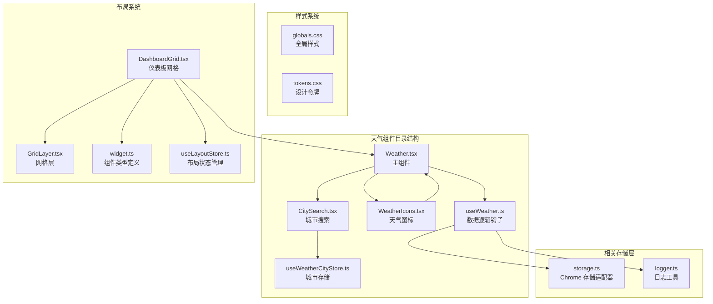
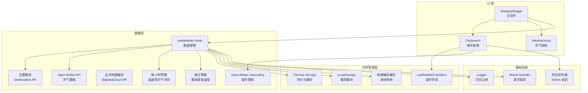
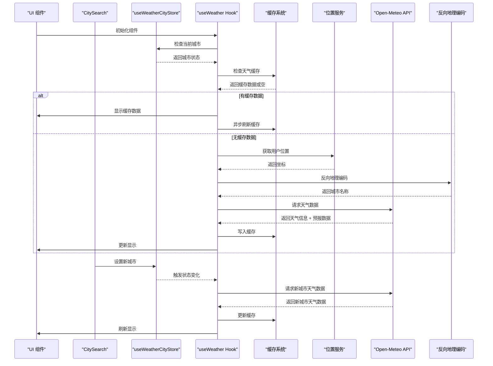
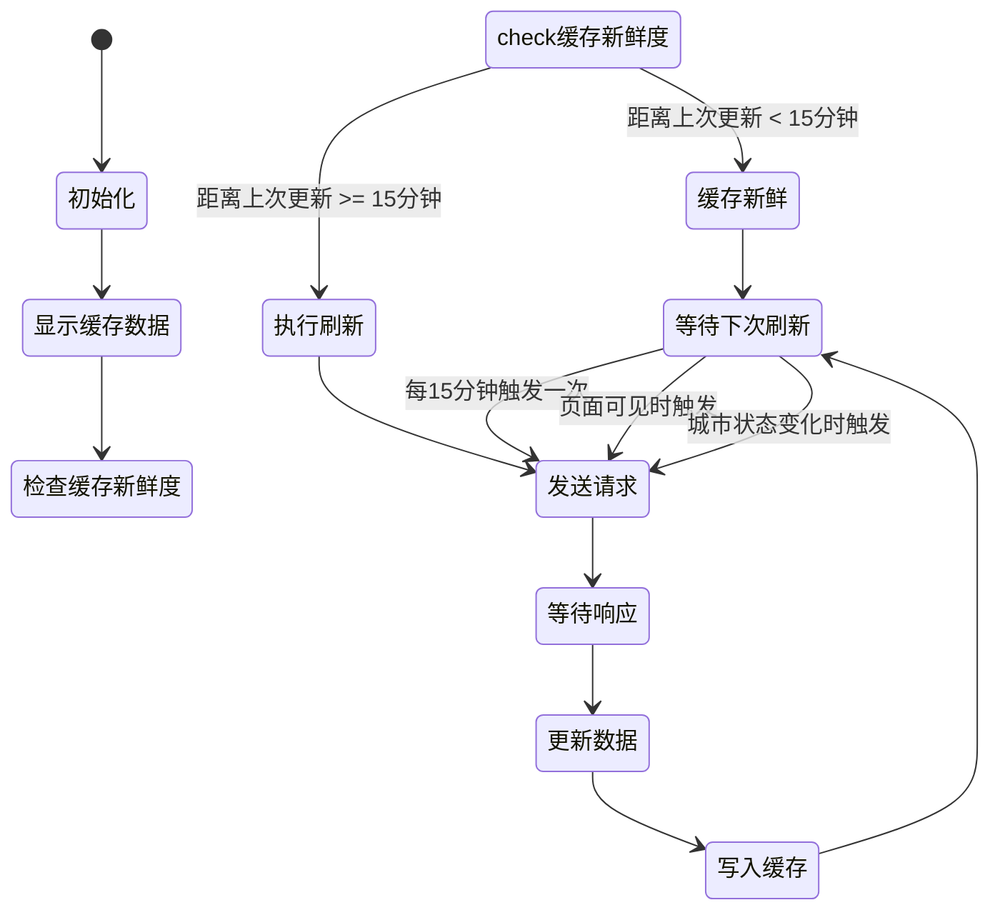
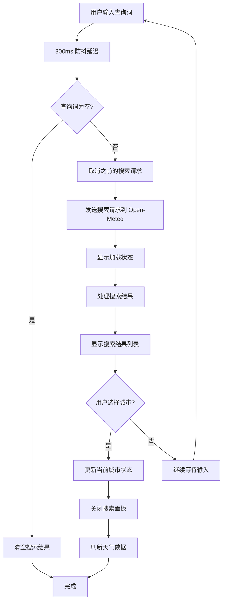
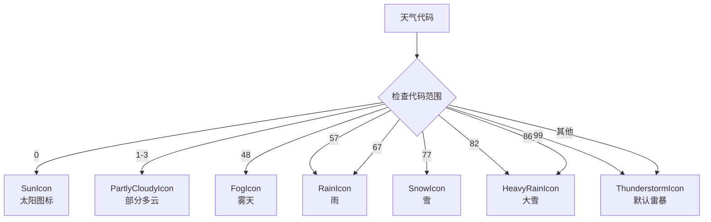
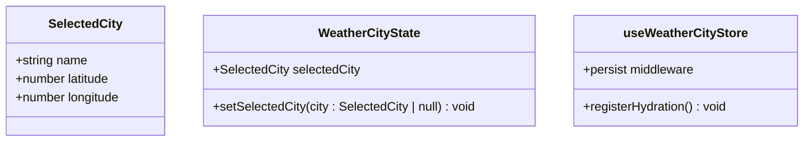
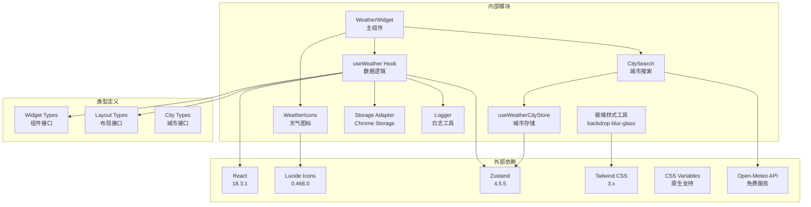

# 天气组件

<cite>
**本文档引用的文件**
- [Weather.tsx](file://src/components/widgets/Weather/Weather.tsx)
- [CitySearch.tsx](file://src/components/widgets/Weather/CitySearch.tsx)
- [WeatherIcons.tsx](file://src/components/widgets/Weather/WeatherIcons.tsx)
- [useWeather.ts](file://src/components/widgets/Weather/useWeather.ts)
- [useWeatherCityStore.ts](file://src/store/useWeatherCityStore.ts)
- [globals.css](file://src/styles/globals.css)
- [tokens.css](file://src/styles/tokens.css)
- [DashboardGrid.tsx](file://src/components/layout/DashboardGrid.tsx)
- [GridLayer.tsx](file://src/components/layout/GridLayer.tsx)
- [widget.ts](file://src/types/widget.ts)
- [useLayoutStore.ts](file://src/store/useLayoutStore.ts)
- [storage.ts](file://src/store/storage.ts)
- [logger.ts](file://src/lib/logger.ts)
- [wallpaperCache.ts](file://src/lib/wallpaperCache.ts)
- [useSettingsStore.ts](file://src/store/useSettingsStore.ts)
</cite>

## 更新摘要

**变更内容**

- 新增城市搜索功能（CitySearch组件）
- 新增天气图标系统（WeatherIcons组件）
- 新增城市选择存储（useWeatherCityStore）
- 整体视觉重新设计，采用 macOS 风格天气图标
- 增强的用户交互体验和城市切换功能

## 目录

1. [简介](#简介)
2. [项目结构](#项目结构)
3. [核心组件](#核心组件)
4. [架构概览](#架构概览)
5. [详细组件分析](#详细组件分析)
6. [城市搜索功能](#城市搜索功能)
7. [天气图标系统](#天气图标系统)
8. [城市选择存储](#城市选择存储)
9. [整体视觉设计](#整体视觉设计)
10. [依赖关系分析](#依赖关系分析)
11. [性能考虑](#性能考虑)
12. [故障排除指南](#故障排除指南)
13. [结论](#结论)

## 简介

天气组件是 Tab 新标签页扩展中的一个核心功能模块，它集成了 Open-Meteo API 来提供实时天气信息。该组件实现了完整的地理位置获取、天气数据请求、缓存机制和用户界面展示功能。通过智能的缓存策略和错误处理机制，确保了良好的用户体验和性能表现。

**最新更新**：组件现已实现完整的城市搜索功能、macOS 风格天气图标系统、城市选择存储以及整体视觉重新设计。

## 项目结构

天气组件位于 `src/components/widgets/Weather/` 目录下，采用模块化设计，包含以下关键文件：

**图表来源**

- [Weather.tsx:1-122](file://src/components/widgets/Weather/Weather.tsx#L1-L122)
- [CitySearch.tsx:1-142](file://src/components/widgets/Weather/CitySearch.tsx#L1-L142)
- [WeatherIcons.tsx:1-187](file://src/components/widgets/Weather/WeatherIcons.tsx#L1-L187)
- [useWeather.ts:1-201](file://src/components/widgets/Weather/useWeather.ts#L1-L201)
- [useWeatherCityStore.ts:1-32](file://src/store/useWeatherCityStore.ts#L1-L32)

**章节来源**

- [Weather.tsx:1-122](file://src/components/widgets/Weather/Weather.tsx#L1-L122)
- [CitySearch.tsx:1-142](file://src/components/widgets/Weather/CitySearch.tsx#L1-L142)
- [WeatherIcons.tsx:1-187](file://src/components/widgets/Weather/WeatherIcons.tsx#L1-L187)
- [useWeather.ts:1-201](file://src/components/widgets/Weather/useWeather.ts#L1-L201)
- [useWeatherCityStore.ts:1-32](file://src/store/useWeatherCityStore.ts#L1-L32)

## 核心组件

### WeatherWidget 组件

WeatherWidget 是天气组件的主 UI 展示层，负责将天气数据渲染为用户友好的界面。该组件实现了以下核心功能：

- **城市搜索集成**：集成 CitySearch 组件提供城市切换功能
- **macOS 风格天气图标**：使用 WeatherIcons 组件显示精美的天气图标
- **本地化天气描述**：使用中文显示天气状况描述
- **响应式布局**：适应不同屏幕尺寸的显示需求
- **错误状态处理**：优雅地处理加载失败的情况
- **温度显示**：大字体显示当前温度，包含最高温和最低温

### CitySearch 组件

CitySearch 是新增的城市搜索组件，提供用户友好的城市切换功能：

- **实时搜索**：输入查询词后自动搜索城市
- **防抖机制**：300ms 防抖延迟优化搜索性能
- **点击外部关闭**：点击组件外部自动关闭搜索面板
- **键盘导航**：支持键盘快捷键操作
- **搜索结果展示**：显示城市名称和国家信息
- **城市选择**：点击城市后更新当前城市并刷新天气数据

### WeatherIcons 组件

WeatherIcons 是全新的天气图标系统，提供 macOS 风格的天气图标：

- **自然色彩调色板**：使用真实的天气颜色（太阳黄、云灰、雨蓝等）
- **矢量图标**：纯 SVG 实现，支持任意尺寸缩放
- **完整图标集**：包含太阳、多云、部分多云、雨、雪、雾、雷暴等图标
- **天气代码映射**：根据天气代码自动选择对应图标
- **无障碍支持**：所有图标都包含 aria-hidden 属性

### useWeather Hook

useWeather 是天气组件的核心数据逻辑钩子，实现了完整的数据获取和缓存机制：

- **地理位置获取**：通过浏览器 Geolocation API 获取用户位置
- **反向地理编码**：将坐标转换为城市名称
- **天气数据请求**：调用 Open-Meteo API 获取实时天气信息
- **智能缓存策略**：实现 stale-while-revalidate 缓存模式
- **每小时预报数据**：获取未来6小时的天气预报信息
- **城市状态管理**：集成 useWeatherCityStore 管理当前城市

**章节来源**

- [Weather.tsx:24-122](file://src/components/widgets/Weather/Weather.tsx#L24-L122)
- [CitySearch.tsx:10-142](file://src/components/widgets/Weather/CitySearch.tsx#L10-L142)
- [WeatherIcons.tsx:15-187](file://src/components/widgets/Weather/WeatherIcons.tsx#L15-L187)
- [useWeather.ts:152-201](file://src/components/widgets/Weather/useWeather.ts#L152-L201)

## 架构概览

天气组件采用分层架构设计，各层职责明确，耦合度低：

**图表来源**

- [Weather.tsx:1-4](file://src/components/widgets/Weather/Weather.tsx#L1-L4)
- [CitySearch.tsx:1-6](file://src/components/widgets/Weather/CitySearch.tsx#L1-L6)
- [WeatherIcons.tsx:1-6](file://src/components/widgets/Weather/WeatherIcons.tsx#L1-L6)
- [useWeather.ts:1-2](file://src/components/widgets/Weather/useWeather.ts#L1-L2)
- [useWeatherCityStore.ts:1-32](file://src/store/useWeatherCityStore.ts#L1-L32)

## 详细组件分析

### 数据流处理

天气组件的数据流遵循严格的处理顺序，确保数据的一致性和准确性：

**图表来源**

- [useWeather.ts:156-197](file://src/components/widgets/Weather/useWeather.ts#L156-L197)
- [CitySearch.tsx:63-72](file://src/components/widgets/Weather/CitySearch.tsx#L63-L72)
- [useWeatherCityStore.ts:16-27](file://src/store/useWeatherCityStore.ts#L16-L27)

### 缓存机制设计

天气组件实现了多层次的缓存策略，确保最佳的性能和用户体验：

#### 主要缓存策略

1. **stale-while-revalidate 模式**：立即显示缓存数据，同时在后台刷新
2. **地理位置缓存**：缓存坐标到城市名称的映射
3. **Chrome Storage 集成**：跨会话持久化缓存数据
4. **城市状态缓存**：使用 useWeatherCityStore 持久化用户选择的城市

#### 缓存键设计

**图表来源**

- [useWeather.ts:46-69](file://src/components/widgets/Weather/useWeather.ts#L46-L69)

**章节来源**

- [useWeather.ts:33-69](file://src/components/widgets/Weather/useWeather.ts#L33-L69)

### 错误处理与降级策略

天气组件实现了完善的错误处理机制，确保在各种异常情况下都能提供良好的用户体验：

#### 错误分类处理

1. **网络异常处理**：超时、连接失败等网络问题
2. **API 限制处理**：API 服务不可用、限流等情况
3. **地理位置失败**：GPS 定位失败时的降级方案
4. **缓存失效处理**：缓存数据损坏或过期的情况
5. **城市搜索失败**：Open-Meteo Geocoding API 失败时的降级

#### 降级策略

当主要数据源不可用时，组件会自动降级到备用方案：

- **地理位置降级**：使用默认城市（北京）作为后备
- **天气数据降级**：显示最后缓存的天气数据
- **网络异常降级**：保持上次成功获取的数据
- **城市搜索降级**：返回空结果但不影响主组件运行

**章节来源**

- [useWeather.ts:168-171](file://src/components/widgets/Weather/useWeather.ts#L168-L171)
- [CitySearch.tsx:48-61](file://src/components/widgets/Weather/CitySearch.tsx#L48-L61)

### 实时更新机制

天气组件实现了智能的实时更新机制，平衡了数据新鲜度和性能：

#### 自动刷新策略

**图表来源**

- [useWeather.ts:184-189](file://src/components/widgets/Weather/useWeather.ts#L184-L189)

#### 手动刷新功能

组件支持多种手动刷新触发方式：

- **页面可见性变化**：当标签页重新获得焦点时自动刷新
- **用户交互**：通过点击或其他交互事件触发刷新
- **城市切换**：通过 CitySearch 组件切换城市时自动刷新
- **定时器机制**：每15分钟自动检查和更新数据

**章节来源**

- [useWeather.ts:184-189](file://src/components/widgets/Weather/useWeather.ts#L184-L189)

### 天气数据处理流程

天气组件对从 API 获取的原始数据进行了多层处理，确保数据的准确性和可用性：

#### 温度转换处理

- **四舍五入处理**：将浮点数温度转换为整数，提高可读性
- **单位固定**：始终以摄氏度显示温度
- **风速处理**：保留原始风速值，四舍五入显示

#### 天气代码映射

组件使用预定义的映射表将 Open-Meteo 的天气代码转换为用户友好的中文描述：

| 天气代码范围 | 中文描述 | 图标 |
| ------------ | -------- | ---- |
| 0            | 晴       | ☀️   |
| 1-3          | 多云     | ⛅   |
| 48           | 雾       | 🌫️   |
| 57           | 毛毛雨   | 🌧️   |
| 67           | 雨       | 🌧️   |
| 77           | 雪       | ❄️   |
| 82           | 阵雨     | 🌩️   |
| 86           | 阵雪     | 🌩️   |
| 99           | 雷暴     | ⚡   |

#### 每小时预报处理

组件实现了智能的每小时预报功能：

- **时间匹配**：根据当前时间匹配对应的小时数据
- **数据截取**：提取未来6小时的天气预报
- **温度格式化**：四舍五入显示温度值
- **图标映射**：为每小时数据映射相应的天气图标

**章节来源**

- [Weather.tsx:5-22](file://src/components/widgets/Weather/Weather.tsx#L5-L22)
- [Weather.tsx:47-54](file://src/components/widgets/Weather/Weather.tsx#L47-L54)
- [useWeather.ts:106-149](file://src/components/widgets/Weather/useWeather.ts#L106-L149)

## 城市搜索功能

### CitySearch 组件实现

CitySearch 组件提供了完整的城市搜索功能，用户可以通过输入城市名称来切换天气显示：

#### 核心功能特性

- **实时搜索**：输入查询词后自动触发搜索，具有300ms防抖延迟
- **点击外部关闭**：点击组件外部区域自动关闭搜索面板并清空查询
- **键盘导航**：支持键盘快捷键操作，提升用户体验
- **搜索结果展示**：显示城市名称、国家信息和搜索状态
- **城市选择**：点击城市后自动更新当前城市并刷新天气数据

#### 搜索机制设计

**图表来源**

- [CitySearch.tsx:44-61](file://src/components/widgets/Weather/CitySearch.tsx#L44-L61)
- [CitySearch.tsx:63-72](file://src/components/widgets/Weather/CitySearch.tsx#L63-L72)

#### 搜索 API 集成

组件集成了 Open-Meteo Geocoding API 进行城市搜索：

- **API 端点**：`https://geocoding-api.open-meteo.com/v1/search`
- **查询参数**：支持城市名称、数量限制（8个）、语言设置（中文）
- **响应处理**：解析 API 响应，提取城市名称、国家、经纬度信息
- **错误处理**：API 调用失败时返回空数组，不影响主组件运行

**章节来源**

- [CitySearch.tsx:10-142](file://src/components/widgets/Weather/CitySearch.tsx#L10-L142)
- [useWeather.ts:74-97](file://src/components/widgets/Weather/useWeather.ts#L74-L97)

## 天气图标系统

### WeatherIcons 组件实现

WeatherIcons 组件提供了完整的 macOS 风格天气图标系统，包含多种天气状况的精美图标：

#### 图标设计特色

- **自然色彩调色板**：使用真实的天气颜色，如太阳黄（#F5B731）、云灰（#B0BEC5）、雨蓝（#64B5F6）等
- **矢量图标**：纯 SVG 实现，支持任意尺寸缩放，保证清晰度
- **完整图标集**：涵盖所有常见天气状况，包括晴天、多云、部分多云、雨、雪、雾、雷暴等
- **无障碍支持**：所有图标都包含 `aria-hidden="true"` 属性，避免屏幕阅读器重复读取

#### 图标映射系统

组件使用天气代码映射表将 Open-Meteo 的天气代码转换为对应的图标：

**图表来源**

- [WeatherIcons.tsx:167-186](file://src/components/widgets/Weather/WeatherIcons.tsx#L167-L186)

#### 图标实现细节

每个图标都是独立的 React 组件，具有以下特点：

- **统一接口**：所有图标组件都接受 `size` 和 `className` 参数
- **固定视口**：所有图标都使用 `viewBox="0 0 36 36"` 确保一致的比例
- **颜色变量**：使用预定义的颜色常量，便于主题定制
- **性能优化**：使用 SVG 而非图片，减少 HTTP 请求

**章节来源**

- [WeatherIcons.tsx:15-187](file://src/components/widgets/Weather/WeatherIcons.tsx#L15-L187)

## 城市选择存储

### useWeatherCityStore 实现

useWeatherCityStore 是新增的城市状态管理存储，基于 Zustand 实现，提供持久化的城市选择功能：

#### 存储结构设计

**图表来源**

- [useWeatherCityStore.ts:5-14](file://src/store/useWeatherCityStore.ts#L5-L14)

#### 状态管理特性

- **持久化存储**：使用 `zustand/middleware` 的 `persist` 功能，数据跨会话保存
- **Chrome Storage 集成**：优先使用 `chrome.storage.local`，兼容性差时回退到 `localStorage`
- **Hydration 支持**：支持服务器端渲染和客户端水合，确保数据一致性
- **类型安全**：完整的 TypeScript 类型定义，提供编译时类型检查

#### 存储配置

- **存储键名**：`'tab:weather-city'`
- **存储引擎**：使用 `chromeStorage` 适配器
- **序列化**：使用 `createJSONStorage` 进行 JSON 序列化
- **水合注册**：通过 `registerHydration` 函数注册水合回调

#### 城市状态更新

当用户通过 CitySearch 组件选择新城市时：

1. 调用 `setSelectedCity` 方法更新状态
2. 自动触发 useWeather Hook 的重新订阅
3. useWeather Hook 检测到城市变化后自动刷新天气数据
4. 新的天气数据写入缓存，更新 UI 显示

**章节来源**

- [useWeatherCityStore.ts:16-32](file://src/store/useWeatherCityStore.ts#L16-L32)
- [CitySearch.tsx:63-72](file://src/components/widgets/Weather/CitySearch.tsx#L63-L72)
- [useWeather.ts:187-189](file://src/components/widgets/Weather/useWeather.ts#L187-L189)

## 整体视觉设计

### macOS 风格图标系统

天气组件采用了全新的 macOS 风格视觉设计，提供更加现代化和精致的用户体验：

#### 设计理念

- **自然色彩**：使用真实的天气颜色，如太阳黄、云灰、雨蓝等，营造真实的天气感受
- **简洁线条**：采用简洁的线条和形状，符合 macOS 的设计语言
- **一致性**：所有图标保持相同的尺寸和比例，确保视觉一致性
- **可访问性**：颜色对比度充足，适合不同视觉需求的用户

#### 图标风格特点

- **圆角设计**：图标边缘采用圆角处理，符合 macOS 的视觉规范
- **层次感**：通过不同的颜色深浅创造视觉层次
- **细节丰富**：在简单的几何形状中加入细节，如太阳的光芒、雨滴的形状等
- **响应式**：支持不同尺寸的图标，适应不同的显示密度

#### 颜色系统

组件使用预定义的颜色常量，确保颜色的一致性和可维护性：

| 颜色用途   | 颜色值  | 用途说明                         |
| ---------- | ------- | -------------------------------- |
| SUN        | #F5B731 | 太阳颜色，用于晴天和部分多云图标 |
| CLOUD      | #B0BEC5 | 云层颜色，用于多云和阴天图标     |
| CLOUD_DARK | #78909C | 深色云层，用于雨雪等天气         |
| RAIN       | #64B5F6 | 雨水颜色，用于雨天图标           |
| SNOW       | #E3F2FD | 雪花颜色，用于雪天图标           |
| BOLT       | #F5B731 | 雷电颜色，用于雷暴图标           |

#### 无障碍支持

- **语义化**：所有图标都包含 `aria-hidden="true"` 属性，避免屏幕阅读器重复读取
- **颜色对比**：确保足够的颜色对比度，便于色觉障碍用户识别
- **替代文本**：通过天气描述文本提供语义信息

**章节来源**

- [WeatherIcons.tsx:8-14](file://src/components/widgets/Weather/WeatherIcons.tsx#L8-L14)
- [WeatherIcons.tsx:178-186](file://src/components/widgets/Weather/WeatherIcons.tsx#L178-L186)

## 依赖关系分析

天气组件的依赖关系清晰明确，遵循单一职责原则：

**图表来源**

- [package.json:18-26](file://package.json#L18-L26)
- [Weather.tsx:1-4](file://src/components/widgets/Weather/Weather.tsx#L1-L4)
- [CitySearch.tsx:1-4](file://src/components/widgets/Weather/CitySearch.tsx#L1-L4)
- [WeatherIcons.tsx:1-6](file://src/components/widgets/Weather/WeatherIcons.tsx#L1-L6)
- [useWeather.ts:1-2](file://src/components/widgets/Weather/useWeather.ts#L1-L2)
- [useWeatherCityStore.ts:1-3](file://src/store/useWeatherCityStore.ts#L1-L3)

### 关键依赖特性

1. **React 生态系统**：利用 React Hooks 和函数组件的优势
2. **状态管理**：使用 Zustand 实现轻量级状态管理
3. **图标系统**：集成 Lucide React 提供丰富的图标选择
4. **样式系统**：结合 Tailwind CSS 和 CSS 变量实现灵活的样式定制
5. **API 集成**：使用 Open-Meteo 提供免费的天气数据服务
6. **存储系统**：结合 Chrome Storage 和 localStorage 实现持久化

**章节来源**

- [package.json:18-26](file://package.json#L18-L26)
- [useWeather.ts:1-2](file://src/components/widgets/Weather/useWeather.ts#L1-L2)

## 性能考虑

天气组件在设计时充分考虑了性能优化，采用了多种策略来提升用户体验：

### 缓存优化策略

#### 数据缓存策略

- **缓存时间控制**：15分钟的新鲜度阈值平衡数据新鲜度和性能
- **增量更新**：使用 stale-while-revalidate 模式避免闪烁
- **跨会话持久化**：确保用户离开后重新访问时仍能快速加载
- **城市状态持久化**：使用 useWeatherCityStore 持久化用户选择的城市

#### 请求去重机制

- **AbortController 使用**：防止并发请求造成的数据竞争
- **请求取消**：组件卸载时自动取消进行中的请求
- **内存泄漏防护**：及时清理定时器和事件监听器
- **防抖优化**：城市搜索使用300ms防抖延迟，减少不必要的 API 调用

### 城市搜索性能优化

#### 搜索防抖机制

- **300ms 防抖延迟**：避免频繁的 API 调用，提升搜索响应速度
- **请求取消**：新的搜索请求会自动取消之前的请求
- **加载状态管理**：显示加载指示器，提升用户感知性能

#### 结果展示优化

- **虚拟滚动**：搜索结果列表使用滚动容器，支持大量结果的高效展示
- **条件渲染**：只有在有搜索结果时才显示结果列表
- **最小化重渲染**：使用 useMemo 优化计算结果的缓存

### 图标系统性能优化

#### SVG 优化

- **内联 SVG**：所有图标都是内联 SVG，减少 HTTP 请求
- **尺寸控制**：支持任意尺寸缩放，无需额外的图标资源
- **颜色复用**：使用 CSS 变量控制颜色，便于主题切换

#### 渲染性能优化

- **组件分离**：每个图标都是独立的 React 组件，支持按需加载
- **记忆化**：使用 React.memo 优化图标组件的重渲染
- **最小化 DOM**：SVG 图标结构简单，DOM 节点数量最少

**章节来源**

- [useWeather.ts:33-34](file://src/components/widgets/Weather/useWeather.ts#L33-L34)
- [CitySearch.tsx:44-61](file://src/components/widgets/Weather/CitySearch.tsx#L44-L61)
- [WeatherIcons.tsx:15-187](file://src/components/widgets/Weather/WeatherIcons.tsx#L15-L187)

## 故障排除指南

### 常见问题诊断

#### 地理位置获取失败

**症状**：组件显示默认城市或定位错误

**可能原因**：

- 用户拒绝了位置权限
- 浏览器地理位置服务不可用
- 网络环境限制了地理位置访问

**解决方案**：

1. 检查浏览器位置权限设置
2. 确认网络连接正常
3. 尝试在其他浏览器中验证

#### 天气数据获取失败

**症状**：组件显示加载状态或错误信息

**可能原因**：

- Open-Meteo API 服务暂时不可用
- 网络连接不稳定
- API 请求被防火墙阻止

**解决方案**：

1. 检查网络连接状态
2. 稍后重试或手动刷新
3. 检查是否有网络代理或防火墙限制

#### 城市搜索功能异常

**症状**：城市搜索无响应或搜索结果不正确

**可能原因**：

- Open-Meteo Geocoding API 服务不可用
- 网络连接问题
- 输入查询词格式不正确
- 防抖机制影响搜索响应

**解决方案**：

1. 检查网络连接状态
2. 确认查询词格式正确
3. 稍等300ms后再尝试搜索
4. 检查浏览器控制台是否有错误信息

#### 图标显示问题

**症状**：天气图标不显示或显示异常

**可能原因**：

- SVG 图标加载失败
- CSS 样式冲突
- 浏览器兼容性问题

**解决方案**：

1. 检查浏览器控制台是否有 SVG 相关错误
2. 确认 CSS 样式没有冲突
3. 在不同浏览器中测试兼容性
4. 检查网络连接是否影响资源加载

#### 缓存问题

**症状**：组件显示过期的天气数据

**可能原因**：

- 缓存数据损坏
- 浏览器存储空间不足
- Chrome Storage 权限问题
- 城市状态存储异常

**解决方案**：

1. 清除浏览器缓存
2. 检查存储空间
3. 重新授权扩展权限
4. 重置城市状态存储

### 调试技巧

#### 日志查看

组件使用统一的日志系统记录重要事件：

- **警告级别**：位置获取失败、API 调用异常
- **错误级别**：严重错误，如网络超时
- **调试级别**：开发时用于详细信息记录

#### 性能监控

- **请求时间监控**：记录 API 调用耗时
- **缓存命中率**：统计缓存使用效率
- **内存使用情况**：监控组件内存占用
- **搜索性能**：监控城市搜索的响应时间

**章节来源**

- [logger.ts:1-35](file://src/lib/logger.ts#L1-L35)
- [useWeather.ts:168-171](file://src/components/widgets/Weather/useWeather.ts#L168-L171)

## 结论

天气组件经过重大更新，现在是一个功能完整、设计精良的模块化组件。通过新增的城市搜索功能、macOS 风格天气图标系统、城市选择存储以及整体视觉重新设计，该组件为用户提供了更加丰富和优质的天气信息服务。

### 主要优势

1. **功能完整性**：从基础天气显示到高级城市搜索，功能覆盖全面
2. **用户体验优秀**：直观的城市搜索、精美的天气图标、流畅的交互体验
3. **技术实现先进**：采用最新的 React Hooks、Zustand 状态管理、TypeScript 类型安全
4. **性能优化到位**：智能缓存、防抖优化、SVG 图标等多重性能优化策略
5. **可维护性强**：模块化设计、清晰的架构、完整的类型定义
6. **视觉效果出色**：macOS 风格图标、现代化设计语言、良好的可访问性

### 技术亮点

- **城市搜索系统**：集成 Open-Meteo Geocoding API，提供实时城市搜索功能
- **macOS 风格图标**：使用自然色彩调色板的精美天气图标
- **状态持久化**：基于 Zustand 的持久化城市选择存储
- **防抖优化**：300ms 防抖延迟优化搜索性能
- **SVG 图标系统**：纯 SVG 实现，支持任意尺寸缩放
- **类型安全**：完整的 TypeScript 类型定义，提供编译时类型检查
- **缓存策略**：智能缓存和降级策略确保服务稳定性
- **错误处理**：多层错误处理和降级机制提升可靠性

### 架构改进

- **模块化设计**：CitySearch、WeatherIcons、useWeatherCityStore 等组件职责清晰
- **状态管理优化**：分离城市状态和天气数据状态
- **API 集成**：合理的 API 调用策略和错误处理
- **性能优化**：多维度的性能优化策略，包括缓存、防抖、SVG 等

该组件为 Tab 扩展提供了坚实的基础，展示了现代前端开发的最佳实践，包括模块化设计、性能优化、用户体验优先的设计理念和创新的视觉设计技术。通过持续的功能迭代和技术优化，天气组件将继续为用户提供优秀的天气信息服务。
