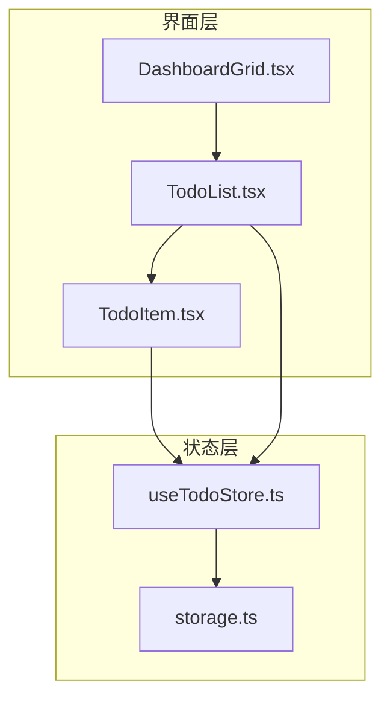
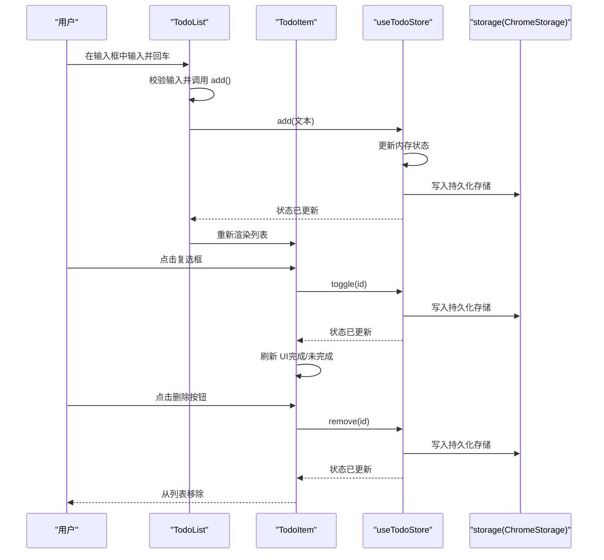
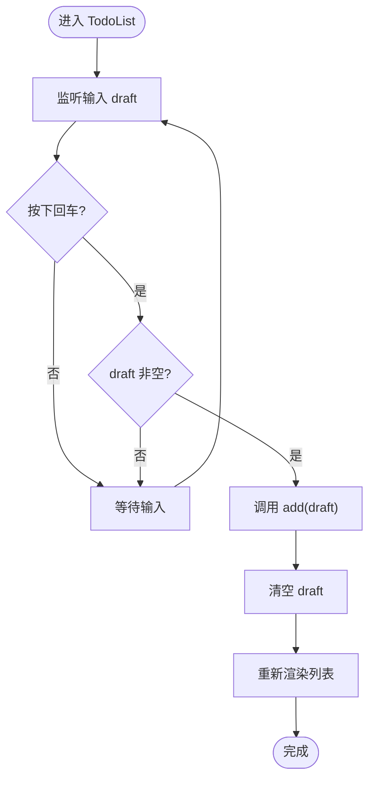
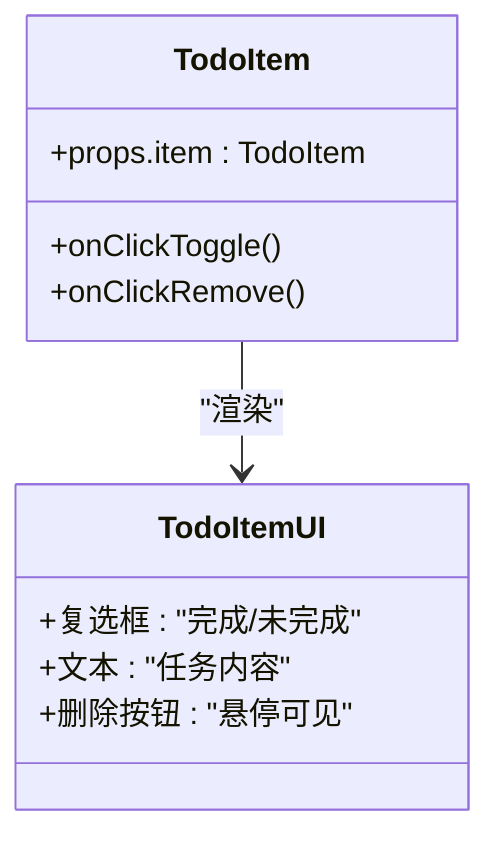
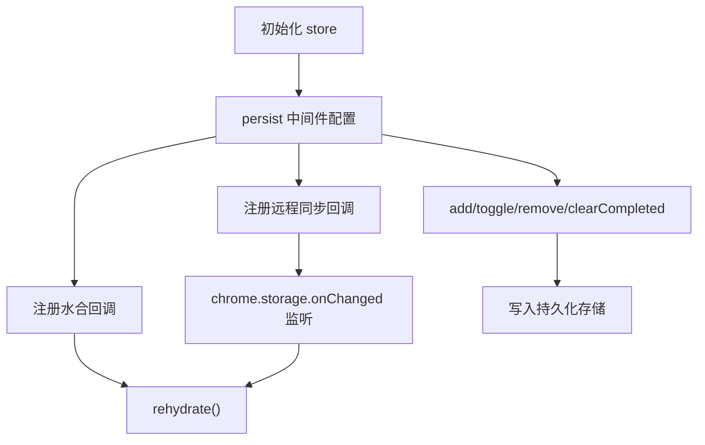
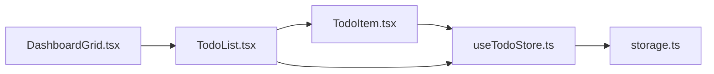

# 待办事项组件

<cite>
**本文引用的文件**
- [TodoItem.tsx](file://src/components/widgets/Todo/TodoItem.tsx)
- [TodoList.tsx](file://src/components/widgets/Todo/TodoList.tsx)
- [useTodoStore.ts](file://src/store/useTodoStore.ts)
- [storage.ts](file://src/store/storage.ts)
- [TodoItem.test.tsx](file://src/components/widgets/Todo/TodoItem.test.tsx)
- [useTodoStore.test.ts](file://src/store/useTodoStore.test.ts)
- [DashboardGrid.tsx](file://src/components/layout/DashboardGrid.tsx)
- [App.tsx](file://src/newtab/App.tsx)
- [useShortcut.ts](file://src/lib/useShortcut.ts)
- [README.md](file://README.md)
</cite>

## 目录

1. [简介](#简介)
2. [项目结构](#项目结构)
3. [核心组件](#核心组件)
4. [架构总览](#架构总览)
5. [详细组件分析](#详细组件分析)
6. [依赖关系分析](#依赖关系分析)
7. [性能考量](#性能考量)
8. [故障排查指南](#故障排查指南)
9. [结论](#结论)
10. [附录：API 接口与可扩展性建议](#附录api-接口与可扩展性建议)

## 简介

本文件针对“待办事项”组件进行系统化技术文档梳理，覆盖以下主题：

- 任务管理核心功能：创建、完成、删除、清理由已完成的任务组成。
- Zustand 状态管理：包含本地持久化（Chrome Extension 或浏览器本地存储）、水合（hydration）与跨标签页同步（remote sync）机制。
- TodoItem 交互设计：复选框状态、悬停可见的删除按钮、无障碍标签与视觉反馈。
- 过滤与展示：当前仅支持“全部任务”的列表展示；未提供“未完成/已完成”筛选器或排序逻辑。
- 完整 API 接口说明：基于当前实现列出 CRUD 与状态变更事件。
- 可扩展性建议：任务分类、优先级、截止日期等增强功能的设计方向。

## 项目结构

待办事项组件位于 widgets 子目录中，由一个容器组件 TodoList 负责输入与列表渲染，子组件 TodoItem 负责单个任务项的渲染与交互；状态管理通过 Zustand 的 useTodoStore 实现，并使用持久化中间件与自定义存储适配器实现跨页面同步。

图表来源

- [DashboardGrid.tsx:24-31](file://src/components/layout/DashboardGrid.tsx#L24-L31)
- [TodoList.tsx:3](file://src/components/widgets/Todo/TodoList.tsx#L3)
- [TodoItem.tsx:3](file://src/components/widgets/Todo/TodoItem.tsx#L3)
- [useTodoStore.ts:20-55](file://src/store/useTodoStore.ts#L20-L55)
- [storage.ts:6-32](file://src/store/storage.ts#L6-L32)

章节来源

- [DashboardGrid.tsx:24-31](file://src/components/layout/DashboardGrid.tsx#L24-L31)
- [TodoList.tsx:1-69](file://src/components/widgets/Todo/TodoList.tsx#L1-L69)
- [TodoItem.tsx:1-46](file://src/components/widgets/Todo/TodoItem.tsx#L1-L46)
- [useTodoStore.ts:1-59](file://src/store/useTodoStore.ts#L1-L59)
- [storage.ts:1-63](file://src/store/storage.ts#L1-L63)

## 核心组件

- TodoList：负责输入框、添加任务、统计未完成数量、条件性显示“清除已完成”按钮以及渲染任务列表。
- TodoItem：负责单个任务项的渲染，包含复选框（切换完成状态）、文本展示（完成时带删除线）、悬停可见的删除按钮。
- useTodoStore：Zustand 状态容器，提供 add/toggle/remove/clearCompleted 四类操作，并通过 persist 中间件实现本地持久化与跨页面同步。

章节来源

- [TodoList.tsx:6-68](file://src/components/widgets/Todo/TodoList.tsx#L6-L68)
- [TodoItem.tsx:10-45](file://src/components/widgets/Todo/TodoItem.tsx#L10-L45)
- [useTodoStore.ts:20-55](file://src/store/useTodoStore.ts#L20-L55)

## 架构总览

下图展示了从用户交互到状态更新与持久化的端到端流程：

图表来源

- [TodoList.tsx:12-16](file://src/components/widgets/Todo/TodoList.tsx#L12-L16)
- [TodoItem.tsx:16-27](file://src/components/widgets/Todo/TodoItem.tsx#L16-L27)
- [useTodoStore.ts:24-45](file://src/store/useTodoStore.ts#L24-L45)
- [storage.ts:6-32](file://src/store/storage.ts#L6-L32)

## 详细组件分析

### TodoList 组件

- 输入与提交：受控输入 draft，回车触发添加；添加后清空输入。
- 统计与清理：顶部显示“待办 · 未完成数”，当存在已完成项时显示“清除已完成”按钮。
- 列表渲染：空态提示；非空时遍历渲染 TodoItem。

图表来源

- [TodoList.tsx:10-16](file://src/components/widgets/Todo/TodoList.tsx#L10-L16)
- [TodoList.tsx:20-65](file://src/components/widgets/Todo/TodoList.tsx#L20-L65)

章节来源

- [TodoList.tsx:6-68](file://src/components/widgets/Todo/TodoList.tsx#L6-L68)

### TodoItem 组件

- 复选框：点击切换任务完成状态；根据完成状态决定边框/背景与图标显示。
- 文本样式：完成时应用删除线与弱化文字色；未完成时使用主文字色。
- 删除按钮：默认不可见，鼠标悬停时显示，点击删除对应任务。

图表来源

- [TodoItem.tsx:10-45](file://src/components/widgets/Todo/TodoItem.tsx#L10-L45)

章节来源

- [TodoItem.tsx:10-45](file://src/components/widgets/Todo/TodoItem.tsx#L10-L45)

### Zustand 状态管理与持久化

- 数据模型：TodoItem 包含 id、text、done、createdAt。
- 动作函数：add、toggle、remove、clearCompleted。
- 持久化策略：使用 persist 中间件，存储位置根据运行环境选择 chrome.storage.local 或 localStorage；通过 createJSONStorage 包装。
- 水合与同步：注册水合回调与远程同步回调；初始化时在 storage 层启动 onChanged 监听，确保多新标签页保持一致。

图表来源

- [useTodoStore.ts:20-55](file://src/store/useTodoStore.ts#L20-L55)
- [storage.ts:37-62](file://src/store/storage.ts#L37-L62)

章节来源

- [useTodoStore.ts:5-18](file://src/store/useTodoStore.ts#L5-L18)
- [useTodoStore.ts:20-55](file://src/store/useTodoStore.ts#L20-L55)
- [storage.ts:1-63](file://src/store/storage.ts#L1-L63)

### 交互与可访问性

- TodoItem 使用 aria-label 标注复选框与删除按钮，提升可访问性。
- TodoList 对“清除已完成”按钮采用条件渲染，避免无意义的操作入口。
- 键盘快捷键：全局通过 useShortcut 控制 App 行为（例如切换编辑模式），但 TodoList 本身未绑定全局快捷键。

章节来源

- [TodoItem.tsx:24-41](file://src/components/widgets/Todo/TodoItem.tsx#L24-L41)
- [TodoList.tsx:26-34](file://src/components/widgets/Todo/TodoList.tsx#L26-L34)
- [useShortcut.ts:14-48](file://src/lib/useShortcut.ts#L14-L48)
- [App.tsx:21-23](file://src/newtab/App.tsx#L21-L23)

## 依赖关系分析

- TodoList 与 TodoItem 均依赖 useTodoStore 的状态与动作。
- useTodoStore 依赖 storage.ts 提供的 ChromeStorage 封装。
- DashboardGrid 将 TodoList 作为可用小部件之一进行渲染。

图表来源

- [DashboardGrid.tsx:24-31](file://src/components/layout/DashboardGrid.tsx#L24-L31)
- [TodoList.tsx:3](file://src/components/widgets/Todo/TodoList.tsx#L3)
- [TodoItem.tsx:3](file://src/components/widgets/Todo/TodoItem.tsx#L3)
- [useTodoStore.ts:20-55](file://src/store/useTodoStore.ts#L20-L55)
- [storage.ts:6-32](file://src/store/storage.ts#L6-L32)

章节来源

- [DashboardGrid.tsx:24-31](file://src/components/layout/DashboardGrid.tsx#L24-L31)
- [TodoList.tsx:3](file://src/components/widgets/Todo/TodoList.tsx#L3)
- [TodoItem.tsx:3](file://src/components/widgets/Todo/TodoItem.tsx#L3)
- [useTodoStore.ts:20-55](file://src/store/useTodoStore.ts#L20-L55)
- [storage.ts:6-32](file://src/store/storage.ts#L6-L32)

## 性能考量

- 列表渲染：TodoList 使用 map 渲染子项，未见分页或虚拟滚动，适合中小规模任务集。
- 状态粒度：TodoItem 仅订阅 toggle/remove，避免无关重渲染；TodoList 订阅 items 以响应新增/删除/切换。
- 持久化写入：每次状态变更都会写入存储，频繁操作可能带来额外开销；可通过节流或批量更新优化（建议）。
- 水合与同步：初始化时一次性 rehydrate，onChanged 触发时按需 rehydrate，避免重复加载。

## 故障排查指南

- 添加失败：确认输入非空且去除首尾空白；检查持久化写入是否成功。
- 切换无效：确认传入的 id 是否存在于当前 items；检查持久化存储是否被其他标签页覆盖。
- 删除异常：确认删除按钮仅在悬停时出现；检查是否误触输入框导致事件冒泡。
- 同步问题：确认 chrome.storage.onChanged 是否生效；检查 remoteChangeHandlers 注册是否正确。

章节来源

- [useTodoStore.test.ts:13-26](file://src/store/useTodoStore.test.ts#L13-L26)
- [useTodoStore.test.ts:37-51](file://src/store/useTodoStore.test.ts#L37-L51)
- [TodoItem.test.tsx:31-45](file://src/components/widgets/Todo/TodoItem.test.tsx#L31-L45)
- [storage.ts:53-62](file://src/store/storage.ts#L53-L62)

## 结论

当前实现提供了简洁可靠的待办事项基础能力：任务增删改查与完成状态切换，并通过 Zustand 的持久化与远程同步机制保证数据一致性与跨页面体验。界面交互遵循无障碍与视觉反馈规范。若需进一步增强，可在不破坏现有架构的前提下引入筛选、排序、分类、优先级与截止日期等特性。

## 附录：API 接口与可扩展性建议

### 当前 API 接口（基于实现）

- 数据模型
  - TodoItem：id、text、done、createdAt
- 动作函数（在状态容器中）
  - add(text: string) -> void
  - toggle(id: string) -> void
  - remove(id: string) -> void
  - clearCompleted() -> void
- 状态字段
  - items: TodoItem[]

章节来源

- [useTodoStore.ts:5-18](file://src/store/useTodoStore.ts#L5-L18)
- [useTodoStore.ts:20-45](file://src/store/useTodoStore.ts#L20-L45)

### 可扩展性建议

- 筛选与排序
  - 新增 filter 状态（全部/未完成/已完成）与 sort 字段（创建时间、完成时间、标题等），在 TodoList 中暴露筛选器与排序控制。
- 任务属性
  - 分类：新增 category 字段，支持多分类与分类筛选。
  - 优先级：新增 priority 字段（高/中/低），支持按优先级排序与高亮。
  - 截止日期：新增 dueDate 与 isOverdue 标记，支持到期提醒与过期高亮。
- 交互增强
  - 双击编辑：TodoItem 支持双击进入编辑模式，失焦或回车保存。
  - 批量操作：全选、批量删除、批量完成。
- 性能优化
  - 虚拟列表：大列表场景使用虚拟滚动。
  - 持久化节流：合并多次写入，降低存储压力。
- 可访问性
  - 为筛选器与排序控件提供键盘导航与屏幕阅读器标签。
