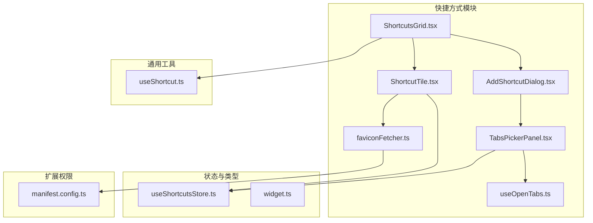
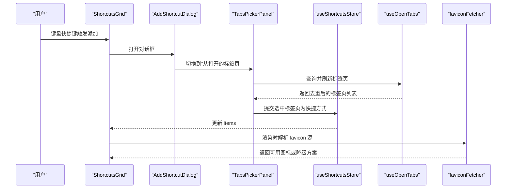
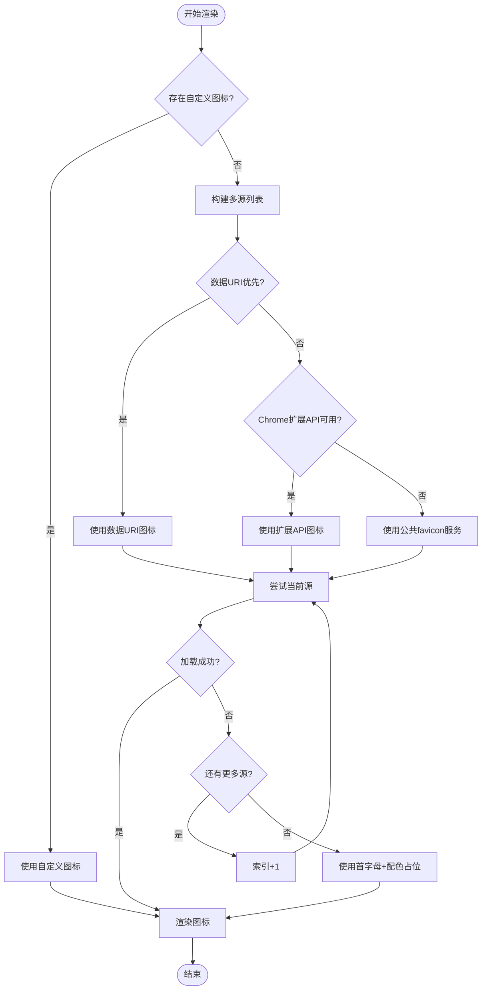
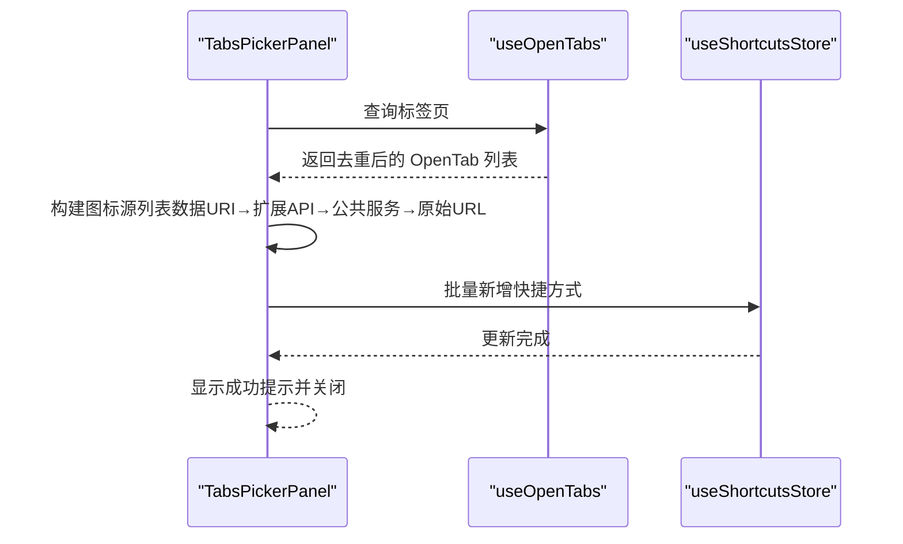
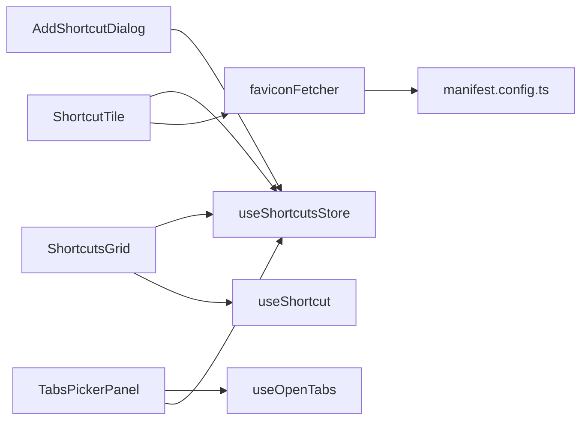
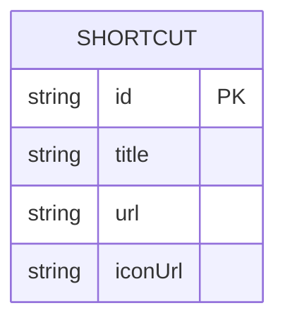
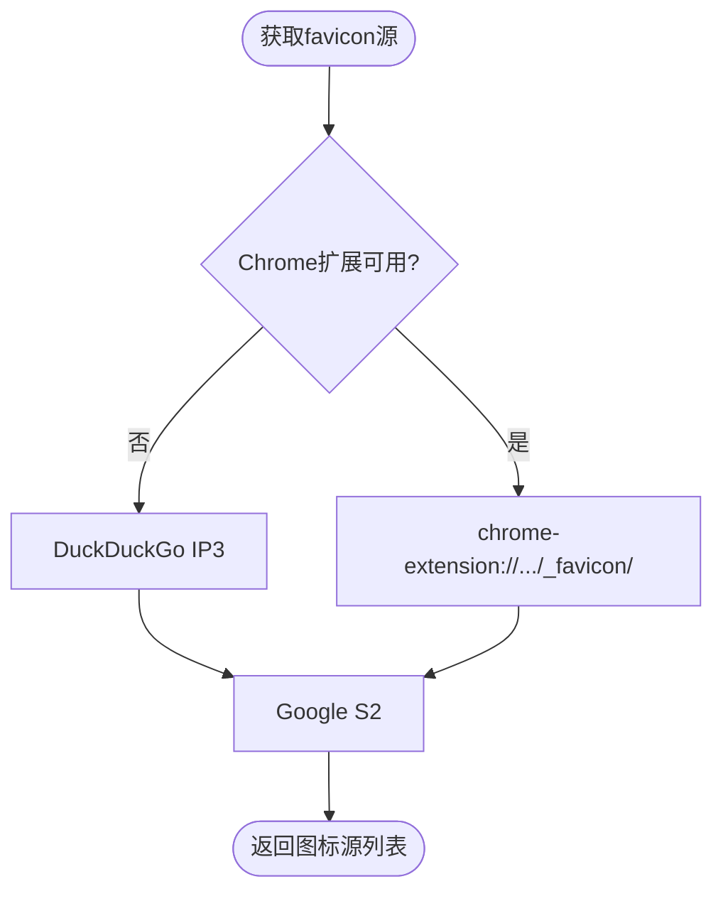

# 快捷方式组件

<cite>
**本文引用的文件**
- [ShortcutsGrid.tsx](file://src/components/widgets/Shortcuts/ShortcutsGrid.tsx)
- [ShortcutTile.tsx](file://src/components/widgets/Shortcuts/ShortcutTile.tsx)
- [AddShortcutDialog.tsx](file://src/components/widgets/Shortcuts/AddShortcutDialog.tsx)
- [TabsPickerPanel.tsx](file://src/components/widgets/Shortcuts/TabsPickerPanel.tsx)
- [faviconFetcher.ts](file://src/components/widgets/Shortcuts/faviconFetcher.ts)
- [useOpenTabs.ts](file://src/components/widgets/Shortcuts/useOpenTabs.ts)
- [useShortcutsStore.ts](file://src/store/useShortcutsStore.ts)
- [widget.ts](file://src/types/widget.ts)
- [useShortcut.ts](file://src/lib/useShortcut.ts)
- [ShortcutTile.test.tsx](file://src/components/widgets/Shortcuts/ShortcutTile.test.tsx)
- [faviconFetcher.test.ts](file://src/components/widgets/Shortcuts/faviconFetcher.test.ts)
- [useOpenTabs.test.ts](file://src/components/widgets/Shortcuts/useOpenTabs.test.ts)
- [useShortcutsStore.test.ts](file://src/store/useShortcutsStore.test.ts)
- [manifest.config.ts](file://manifest.config.ts)
</cite>

## 目录

1. [简介](#简介)
2. [项目结构](#项目结构)
3. [核心组件](#核心组件)
4. [架构总览](#架构总览)
5. [详细组件分析](#详细组件分析)
6. [依赖关系分析](#依赖关系分析)
7. [性能考量](#性能考量)
8. [故障排查指南](#故障排查指南)
9. [结论](#结论)
10. [附录](#附录)

## 简介

本文件为"快捷方式组件"的综合技术文档，覆盖以下主题：

- 快捷方式的管理能力：添加、删除、编辑（进入/退出编辑模式）、以及拖拽排序（通过布局系统集成）。
- favicon 获取机制：**增强的多源回退策略**，包括 Chrome 扩展 API 访问、数据 URI 优先级和 CORS 绕过技术。
- 图标获取流程：浏览器书签图标与动态图标加载。
- 数据结构与存储：快捷方式模型、Zustand 持久化存储与迁移。
- 标签页选择器 TabsPickerPanel：按窗口分组、搜索过滤、批量选择与提交。
- 性能优化：虚拟滚动与懒加载策略建议。
- 使用示例：批量操作与自定义配置。

## 项目结构

快捷方式组件位于 widgets/Shortcuts 目录下，围绕 Store、UI 组件与工具函数协同工作，形成"数据—视图—交互"的清晰分层。

**图表来源**

- [ShortcutsGrid.tsx:1-38](file://src/components/widgets/Shortcuts/ShortcutsGrid.tsx#L1-L38)
- [ShortcutTile.tsx:1-79](file://src/components/widgets/Shortcuts/ShortcutTile.tsx#L1-L79)
- [AddShortcutDialog.tsx:1-115](file://src/components/widgets/Shortcuts/AddShortcutDialog.tsx#L1-L115)
- [TabsPickerPanel.tsx:1-296](file://src/components/widgets/Shortcuts/TabsPickerPanel.tsx#L1-L296)
- [faviconFetcher.ts:1-50](file://src/components/widgets/Shortcuts/faviconFetcher.ts#L1-L50)
- [useOpenTabs.ts:1-176](file://src/components/widgets/Shortcuts/useOpenTabs.ts#L1-L176)
- [useShortcutsStore.ts:1-54](file://src/store/useShortcutsStore.ts#L1-L54)
- [widget.ts:1-34](file://src/types/widget.ts#L1-L34)
- [useShortcut.ts:1-49](file://src/lib/useShortcut.ts#L1-L49)
- [manifest.config.ts:21](file://manifest.config.ts#L21)

**章节来源**

- [ShortcutsGrid.tsx:1-38](file://src/components/widgets/Shortcuts/ShortcutsGrid.tsx#L1-L38)
- [useShortcutsStore.ts:1-54](file://src/store/useShortcutsStore.ts#L1-L54)

## 核心组件

- ShortcutsGrid：渲染快捷方式网格，支持键盘触发"添加"对话框，根据设置决定是否进入编辑模式。
- ShortcutTile：单个快捷方式卡片，负责图标加载与回退、删除按钮、可访问性标签等。
- AddShortcutDialog：添加快捷方式的对话框，支持"从打开的标签页"和"手动输入"两种模式。
- TabsPickerPanel：浏览并批量选择当前浏览器打开的标签页，生成快捷方式。
- faviconFetcher：**增强的 favicon 多源回退与初始字符、颜色派生**，包括 Chrome 扩展 API 访问和 CORS 绕过。
- useOpenTabs：封装浏览器标签页查询、去重、分组与变更监听。
- useShortcutsStore：Zustand 状态管理，持久化存储快捷方式列表，支持增删改与重排。
- widget 类型：定义快捷方式数据结构与小部件标识。

**章节来源**

- [ShortcutsGrid.tsx:9-37](file://src/components/widgets/Shortcuts/ShortcutsGrid.tsx#L9-L37)
- [ShortcutTile.tsx:13-78](file://src/components/widgets/Shortcuts/ShortcutTile.tsx#L13-L78)
- [AddShortcutDialog.tsx:24-87](file://src/components/widgets/Shortcuts/AddShortcutDialog.tsx#L24-L87)
- [TabsPickerPanel.tsx:21-201](file://src/components/widgets/Shortcuts/TabsPickerPanel.tsx#L21-L201)
- [faviconFetcher.ts:3-50](file://src/components/widgets/Shortcuts/faviconFetcher.ts#L3-L50)
- [useOpenTabs.ts:98-158](file://src/components/widgets/Shortcuts/useOpenTabs.ts#L98-L158)
- [useShortcutsStore.ts:23-50](file://src/store/useShortcutsStore.ts#L23-L50)
- [widget.ts:1-6](file://src/types/widget.ts#L1-L6)

## 架构总览

快捷方式组件采用"状态驱动 UI"的架构，Store 负责数据持久化与变更；UI 组件仅负责展示与交互；工具函数提供图标与标签页处理逻辑。

**图表来源**

- [ShortcutsGrid.tsx:14-14](file://src/components/widgets/Shortcuts/ShortcutsGrid.tsx#L14-L14)
- [AddShortcutDialog.tsx:24-87](file://src/components/widgets/Shortcuts/AddShortcutDialog.tsx#L24-L87)
- [TabsPickerPanel.tsx:21-110](file://src/components/widgets/Shortcuts/TabsPickerPanel.tsx#L21-L110)
- [useOpenTabs.ts:98-158](file://src/components/widgets/Shortcuts/useOpenTabs.ts#L98-L158)
- [useShortcutsStore.ts:27-40](file://src/store/useShortcutsStore.ts#L27-L40)
- [faviconFetcher.ts:13-26](file://src/components/widgets/Shortcuts/faviconFetcher.ts#L13-L26)

## 详细组件分析

### ShortcutsGrid：网格容器与入口

- 功能要点
  - 读取快捷方式列表与编辑模式。
  - 提供"添加"按钮与键盘快捷键触发对话框。
  - 渲染每个快捷方式卡片。
- 关键行为
  - 编辑模式下卡片不可点击，仅作为占位。
  - 非编辑模式下卡片为链接，跳转至目标 URL。
- 交互与可访问性
  - 提供"添加"按钮的 aria-label。
  - 键盘快捷键由通用 hook 管理，避免与浏览器默认快捷键冲突。

**章节来源**

- [ShortcutsGrid.tsx:9-37](file://src/components/widgets/Shortcuts/ShortcutsGrid.tsx#L9-L37)
- [useShortcut.ts:14-48](file://src/lib/useShortcut.ts#L14-L48)

### ShortcutTile：单个快捷方式卡片

- 功能要点
  - 支持自定义 iconUrl 优先显示。
  - 若无自定义图标，则尝试多种 favicon 源回退。
  - **增强的图标加载策略**：优先使用数据 URI（开发服务器动态图标），然后是 Chrome 扩展 API（绕过 CORS），最后是公共 favicon 服务。
  - 图标加载失败时自动切换下一个源，直至降级为标题首字母与配色。
  - 编辑模式下显示"删除"按钮。
- 错误处理与降级
  - 图片 onError 回调递增索引，顺序尝试多个源。
  - 全部失败时以标题首字母与哈希配色生成占位图标。
- 可访问性
  - 编辑模式使用 div 并带 aria-label；非编辑模式为链接并设置 rel、target。

**图表来源**

- [ShortcutTile.tsx:17-55](file://src/components/widgets/Shortcuts/ShortcutTile.tsx#L17-L55)
- [faviconFetcher.ts:13-34](file://src/components/widgets/Shortcuts/faviconFetcher.ts#L13-L34)

**章节来源**

- [ShortcutTile.tsx:13-78](file://src/components/widgets/Shortcuts/ShortcutTile.tsx#L13-L78)
- [faviconFetcher.ts:28-50](file://src/components/widgets/Shortcuts/faviconFetcher.ts#L28-L50)

### AddShortcutDialog：添加对话框

- 功能要点
  - 两种模式："从打开的标签页"和"手动输入"。
  - 手动输入时进行 URL 规范化（自动补全协议）。
  - "从打开的标签页"模式委托给 TabsPickerPanel。
- 用户体验
  - Tab 切换栏明确区分来源。
  - 提交后关闭对话框并清空输入。

**章节来源**

- [AddShortcutDialog.tsx:24-87](file://src/components/widgets/Shortcuts/AddShortcutDialog.tsx#L24-L87)

### TabsPickerPanel：标签页选择器

- 功能要点
  - 查询当前浏览器所有打开的标签页，过滤无效协议与重复 URL。
  - 按窗口分组，当前窗口置顶。
  - 支持搜索标题与 URL，批量勾选，去重提交。
  - 保持选择状态跨刷新，但仅对当前可见标签页生效。
- **增强的图标获取策略**
  - **数据 URI 优先级**：优先使用 `data:` 协议的 favicon（开发服务器动态图标）。
  - **Chrome 扩展 API 访问**：通过 `chrome-extension://.../_favicon/` 获取图标，绕过 CORP/CORS 限制。
  - **公共 favicon 服务回退**：使用 DuckDuckGo 和 Google favicon 服务。
  - **原始 HTTP URL 作为最后手段**：当上述方法都失败时使用原始 favicon URL。
- 关键算法
  - URL 规范化：统一大小写、去除多余斜杠、保留查询与哈希。
  - 去重策略：相同规范 URL 时优先较长标题，若相等则优先当前窗口。
  - 分组策略：按 windowId 分组，并将当前窗口置于首位。
- 错误处理
  - 浏览器 API 失败时显示错误信息与重试按钮。
- 提交流程
  - 将选中的标签页映射为 {title, url}，交由 Store 新增为快捷方式。
  - 成功后提示数量并清空选择。

**图表来源**

- [TabsPickerPanel.tsx:21-110](file://src/components/widgets/Shortcuts/TabsPickerPanel.tsx#L21-L110)
- [useOpenTabs.ts:80-94](file://src/components/widgets/Shortcuts/useOpenTabs.ts#L80-L94)
- [useShortcutsStore.ts:27-40](file://src/store/useShortcutsStore.ts#L27-L40)

**章节来源**

- [TabsPickerPanel.tsx:21-201](file://src/components/widgets/Shortcuts/TabsPickerPanel.tsx#L21-L201)
- [useOpenTabs.ts:36-94](file://src/components/widgets/Shortcuts/useOpenTabs.ts#L36-L94)
- [useOpenTabs.test.ts:23-152](file://src/components/widgets/Shortcuts/useOpenTabs.test.ts#L23-L152)

### faviconFetcher：图标获取与回退

- **增强的多源回退策略**
  - **Chrome 扩展 API 优先级**：当检测到 Chrome 扩展环境时，优先使用 `chrome-extension://.../_favicon/` 获取图标，绕过 CORS 限制。
  - DuckDuckGo IP3：基于域名的通用图标服务。
  - Google S2：标准 favicon 服务。
- 降级方案
  - 无法解析 URL 时返回空或空数组。
  - 图标加载失败时在组件内顺序尝试下一源。
  - 最终降级为标题首字母与固定色板的配色。
- 工具函数
  - getInitial：提取标题首字母大写，空值时使用占位符。
  - getColorFor：基于字符串哈希的稳定配色。

**章节来源**

- [faviconFetcher.ts:3-50](file://src/components/widgets/Shortcuts/faviconFetcher.ts#L3-L50)
- [faviconFetcher.test.ts:4-87](file://src/components/widgets/Shortcuts/faviconFetcher.test.ts#L4-L87)

### useOpenTabs：标签页查询与处理

- 能力概览
  - 查询所有标签页，过滤内部协议与无效条目。
  - 去重：同一规范 URL 优先较长标题，相等时优先当前窗口。
  - 分组：按 windowId 分组，当前窗口优先。
  - 变更监听：对 tabs 的更新、创建、移除事件进行防抖刷新。
- 关键导出
  - normalizeUrlKey：URL 规范化。
  - isUsableTab：过滤不可用标签页。
  - dedupByUrl：去重策略。
  - buildOpenTabs：组装 OpenTab 列表。
  - groupTabsByWindow：按窗口分组。
  - useOpenTabs：React Hook，返回 tabs、error、refresh。

**章节来源**

- [useOpenTabs.ts:36-158](file://src/components/widgets/Shortcuts/useOpenTabs.ts#L36-L158)
- [useOpenTabs.test.ts:104-152](file://src/components/widgets/Shortcuts/useOpenTabs.test.ts#L104-L152)

### useShortcutsStore：数据结构与存储

- 数据模型
  - Shortcut：包含 id、title、url、可选 iconUrl。
- 存储与同步
  - 使用 Zustand + persist，存储于 Chrome Storage。
  - 版本迁移与水合注册，支持远程同步。
- 操作接口
  - add：追加新快捷方式（自动生成 id）。
  - update：按 id 更新字段。
  - remove：按 id 删除。
  - reorder：替换整组顺序。
- 默认项
  - 包含一组示例快捷方式，便于首次使用。

**章节来源**

- [useShortcutsStore.ts:6-50](file://src/store/useShortcutsStore.ts#L6-L50)
- [widget.ts:1-6](file://src/types/widget.ts#L1-L6)
- [useShortcutsStore.test.ts:17-68](file://src/store/useShortcutsStore.test.ts#L17-L68)

## 依赖关系分析

- 组件耦合
  - ShortcutsGrid 依赖 useShortcutsStore 与 useSettingsStore 的 editMode。
  - ShortcutTile 依赖 useShortcutsStore 的 remove 与 faviconFetcher。
  - AddShortcutDialog 依赖 useShortcutsStore 的 add。
  - TabsPickerPanel 依赖 useOpenTabs 与 useShortcutsStore。
- **扩展权限依赖**
  - faviconFetcher 依赖 Chrome 扩展环境检测。
  - manifest.config.ts 提供 favicon 权限。
- 外部依赖
  - 浏览器 Tabs API：查询标签页、监听变更。
  - Chrome Storage：持久化存储快捷方式。
- 可能的循环依赖
  - 当前文件间无直接循环导入。

**图表来源**

- [ShortcutsGrid.tsx:3-6](file://src/components/widgets/Shortcuts/ShortcutsGrid.tsx#L3-L6)
- [ShortcutTile.tsx:3-5](file://src/components/widgets/Shortcuts/ShortcutTile.tsx#L3-L5)
- [AddShortcutDialog.tsx:5-7](file://src/components/widgets/Shortcuts/AddShortcutDialog.tsx#L5-L7)
- [TabsPickerPanel.tsx:9-13](file://src/components/widgets/Shortcuts/TabsPickerPanel.tsx#L9-L13)
- [useOpenTabs.ts:1-1](file://src/components/widgets/Shortcuts/useOpenTabs.ts#L1-L1)
- [useShortcut.ts:1-1](file://src/lib/useShortcut.ts#L1-L1)
- [faviconFetcher.ts:20-22](file://src/components/widgets/Shortcuts/faviconFetcher.ts#L20-L22)
- [manifest.config.ts:21](file://manifest.config.ts#L21)

**章节来源**

- [ShortcutsGrid.tsx:1-37](file://src/components/widgets/Shortcuts/ShortcutsGrid.tsx#L1-L37)
- [ShortcutTile.tsx:1-79](file://src/components/widgets/Shortcuts/ShortcutTile.tsx#L1-L79)
- [AddShortcutDialog.tsx:1-115](file://src/components/widgets/Shortcuts/AddShortcutDialog.tsx#L1-L115)
- [TabsPickerPanel.tsx:1-296](file://src/components/widgets/Shortcuts/TabsPickerPanel.tsx#L1-L296)
- [useOpenTabs.ts:1-176](file://src/components/widgets/Shortcuts/useOpenTabs.ts#L1-L176)
- [useShortcutsStore.ts:1-54](file://src/store/useShortcutsStore.ts#L1-L54)
- [useShortcut.ts:1-49](file://src/lib/useShortcut.ts#L1-L49)

## 性能考量

- **图标加载性能**
  - **增强的多源回退与 onError 自动切换**，减少单源失败影响。
  - **数据 URI 优先级**：开发服务器动态图标无需网络请求，提升加载速度。
  - **Chrome 扩展 API 优先级**：绕过 CORS 限制，避免跨域请求失败。
  - 降级为首字母与配色，避免长时间空白。
- 列表渲染
  - 使用 memo 包裹卡片组件，减少重渲染。
  - 列表项 key 包含 id/url/icon，确保更新正确性。
- 标签页刷新
  - 对 tabs 变更事件进行防抖刷新，降低频繁查询成本。
- 拖拽排序
  - 快捷方式本身不直接实现拖拽排序，而是通过布局系统（DashboardGrid/GridLayer）提供拖拽句柄与排序能力。组件通过 Store 的 reorder 接口接收新的顺序并持久化。
- 虚拟滚动与懒加载
  - 当前实现未引入虚拟滚动或懒加载。若未来列表规模扩大，建议：
    - 引入虚拟列表以限制 DOM 节点数量。
    - 对图标加载进行惰性触发，仅在可见区域时请求。
    - 对 TabsPickerPanel 的长列表进行虚拟滚动优化。

**章节来源**

- [ShortcutTile.tsx:1-79](file://src/components/widgets/Shortcuts/ShortcutTile.tsx#L1-L79)
- [TabsPickerPanel.tsx:161-189](file://src/components/widgets/Shortcuts/TabsPickerPanel.tsx#L161-L189)
- [useOpenTabs.ts:96-155](file://src/components/widgets/Shortcuts/useOpenTabs.ts#L96-L155)
- [useShortcutsStore.ts:10-11](file://src/store/useShortcutsStore.ts#L10-L11)

## 故障排查指南

- **图标不显示或一直闪烁**
  - 检查网络连通性与第三方服务可用性。
  - 确认 URL 是否有效，必要时提供自定义 iconUrl。
  - **检查 Chrome 扩展环境**：确保 `chrome.runtime.id` 可用。
  - **验证数据 URI**：开发服务器动态图标应以 `data:` 开头。
  - 查看 onError 回退链路是否正常执行。
- 无法添加快捷方式
  - 手动输入模式需确保 URL 有效且包含协议。
  - 标签页模式需确认浏览器 Tabs API 可用且未被拦截。
- 标签页列表为空或不更新
  - 检查过滤规则（内部协议、无效 id/url）。
  - 确认变更监听是否生效（更新/创建/移除事件）。
- **CORS 相关问题**
  - **Chrome 扩展 API 应该自动绕过 CORS 限制**。
  - 如果仍然失败，检查 manifest.config.ts 中的权限配置。
- 存储异常
  - 检查 Chrome Storage 权限与持久化配置。
  - 如需迁移，确认版本号与迁移函数正确。

**章节来源**

- [faviconFetcher.ts:1-50](file://src/components/widgets/Shortcuts/faviconFetcher.ts#L1-L50)
- [AddShortcutDialog.tsx:17-22](file://src/components/widgets/Shortcuts/AddShortcutDialog.tsx#L17-L22)
- [useOpenTabs.ts:19-58](file://src/components/widgets/Shortcuts/useOpenTabs.ts#L19-L58)
- [useShortcutsStore.ts:42-50](file://src/store/useShortcutsStore.ts#L42-L50)

## 结论

快捷方式组件通过清晰的职责划分与**增强的 favicon 获取能力**，实现了从"标签页采集—图标加载—持久化存储—UI 展示"的完整闭环。编辑模式与键盘快捷键提升了易用性；**Chrome 扩展 API 优先级、数据 URI 优先级和 CORS 绕过技术**显著提升了图标加载的可靠性和性能。未来可在大规模列表场景引入虚拟滚动与懒加载，进一步提升性能。

## 附录

### 快捷方式数据模型

**图表来源**

- [widget.ts:1-6](file://src/types/widget.ts#L1-L6)

### 增强的 favicon 获取流程

**图表来源**

- [faviconFetcher.ts:13-34](file://src/components/widgets/Shortcuts/faviconFetcher.ts#L13-L34)
- [TabsPickerPanel.tsx:260-273](file://src/components/widgets/Shortcuts/TabsPickerPanel.tsx#L260-L273)

### 常用操作与示例路径

- 添加快捷方式（手动）
  - 示例路径：[AddShortcutDialog.tsx:37-42](file://src/components/widgets/Shortcuts/AddShortcutDialog.tsx#L37-L42)
- 添加快捷方式（从标签页）
  - 示例路径：[TabsPickerPanel.tsx:91-110](file://src/components/widgets/Shortcuts/TabsPickerPanel.tsx#L91-L110)
- 删除快捷方式
  - 示例路径：[ShortcutTile.tsx:58-70](file://src/components/widgets/Shortcuts/ShortcutTile.tsx#L58-L70)
- 更新快捷方式
  - 示例路径：[useShortcutsStore.ts:34-37](file://src/store/useShortcutsStore.ts#L34-L37)
- 批量操作（标签页选择）
  - 示例路径：[TabsPickerPanel.tsx:61-89](file://src/components/widgets/Shortcuts/TabsPickerPanel.tsx#L61-L89)
- 自定义图标
  - 示例路径：[ShortcutTile.tsx:19-22](file://src/components/widgets/Shortcuts/ShortcutTile.tsx#L19-L22)
- **Chrome 扩展权限配置**
  - 示例路径：[manifest.config.ts:21](file://manifest.config.ts#L21)
