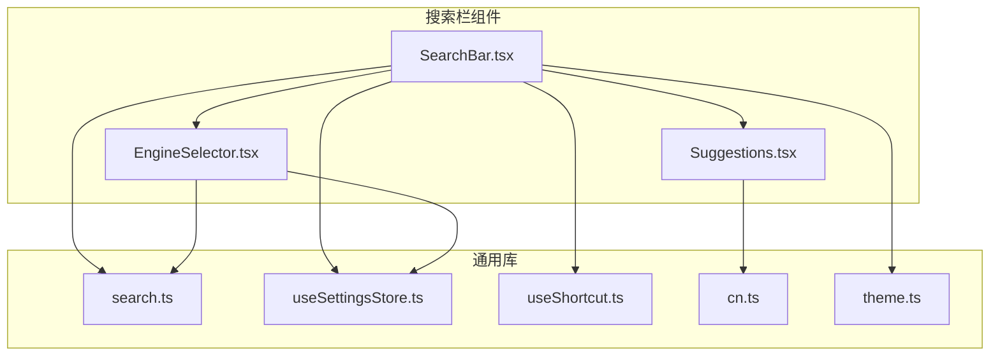
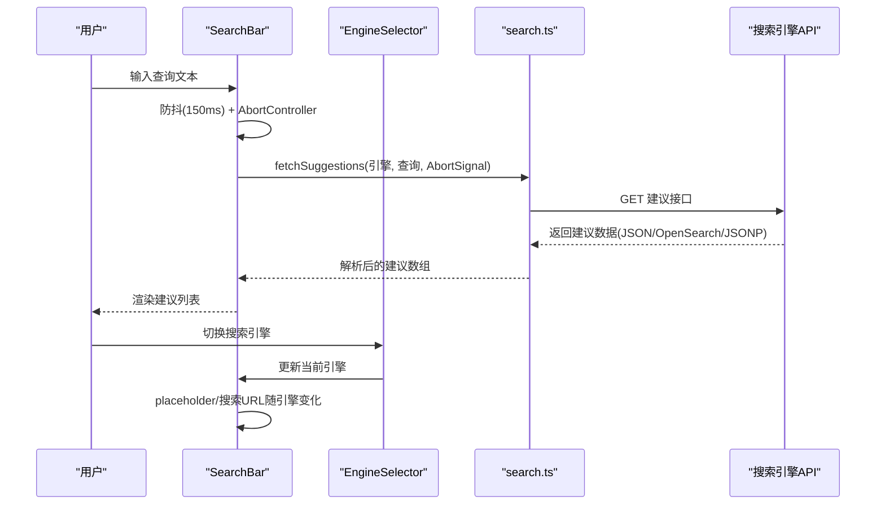
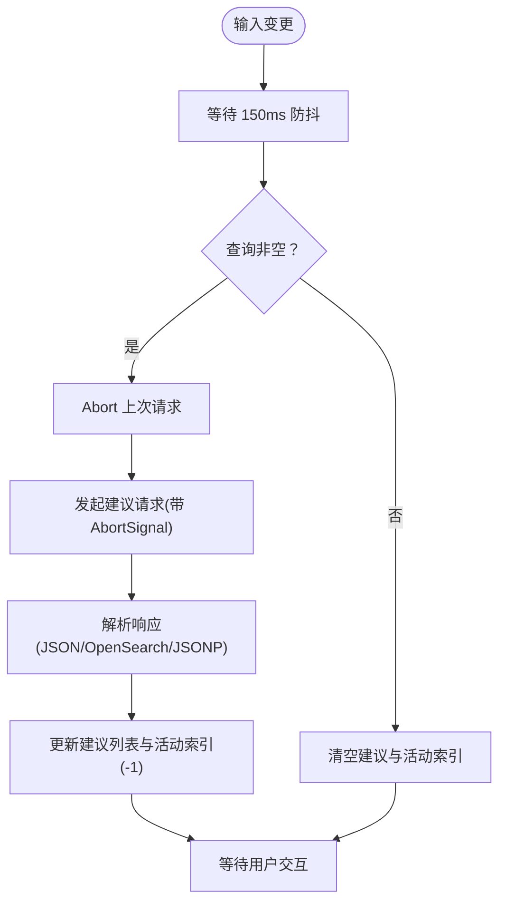
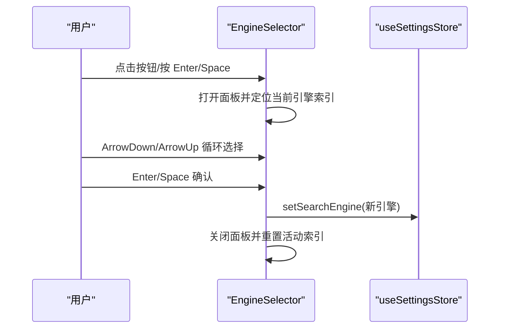
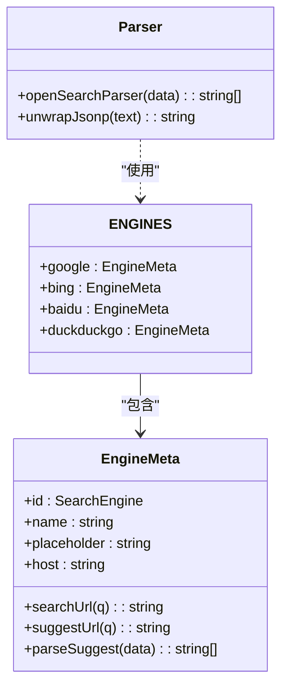
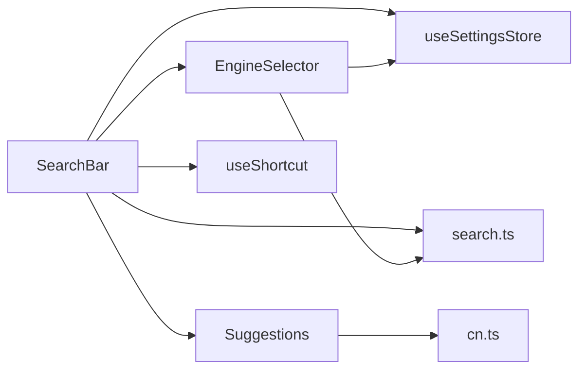

# 搜索栏组件

<cite>
**本文引用的文件**
- [SearchBar.tsx](file://src/components/widgets/SearchBar/SearchBar.tsx)
- [EngineSelector.tsx](file://src/components/widgets/SearchBar/EngineSelector.tsx)
- [Suggestions.tsx](file://src/components/widgets/SearchBar/Suggestions.tsx)
- [search.ts](file://src/lib/search.ts)
- [search.test.ts](file://src/lib/search.test.ts)
- [useSettingsStore.ts](file://src/store/useSettingsStore.ts)
- [useShortcut.ts](file://src/lib/useShortcut.ts)
- [cn.ts](file://src/lib/cn.ts)
- [theme.ts](file://src/lib/theme.ts)
- [App.tsx](file://src/newtab/App.tsx)
- [DashboardGrid.tsx](file://src/components/layout/DashboardGrid.tsx)
</cite>

## 更新摘要

**变更内容**

- 更新响应式宽度支持：从 max-w-2xl 扩展到支持 xl:max-w-3xl 和 2xl:max-w-4xl 断点
- 增强大屏幕设备的搜索栏显示效果
- 保持原有功能不变，仅优化布局适配

## 目录

1. [简介](#简介)
2. [项目结构](#项目结构)
3. [核心组件](#核心组件)
4. [架构总览](#架构总览)
5. [详细组件分析](#详细组件分析)
6. [响应式宽度增强](#响应式宽度增强)
7. [依赖关系分析](#依赖关系分析)
8. [性能考量](#性能考量)
9. [故障排查指南](#故障排查指南)
10. [结论](#结论)
11. [附录](#附录)

## 简介

本文件系统性解析搜索栏组件，涵盖多搜索引擎支持（Google、Bing、Baidu、DuckDuckGo）的配置与切换逻辑；自动建议功能的实现原理（防抖、AbortController 取消请求、键盘导航）；组件状态管理（查询状态、焦点状态、活动索引）；无障碍访问支持（ARIA 属性与键盘快捷键）；以及使用示例与扩展新搜索引擎的实践方法。

**更新** 搜索栏组件现已支持更宽的响应式布局，在桌面和大屏设备上提供更好的用户体验。

## 项目结构

搜索栏组件位于 widgets/SearchBar 目录下，由三个子组件与一个通用库模块组成：

- SearchBar：主输入框与提交逻辑
- EngineSelector：搜索引擎选择器
- Suggestions：建议列表渲染
- search.ts：引擎元数据、建议抓取与解析工具
- useSettingsStore.ts：全局设置（含当前搜索引擎）
- useShortcut.ts：全局快捷键钩子
- cn.ts：类名合并工具
- theme.ts：主题与玻璃模式应用（影响视觉表现）

**图表来源**

- [SearchBar.tsx:1-116](file://src/components/widgets/SearchBar/SearchBar.tsx#L1-L116)
- [EngineSelector.tsx:1-118](file://src/components/widgets/SearchBar/EngineSelector.tsx#L1-L118)
- [Suggestions.tsx:1-40](file://src/components/widgets/SearchBar/Suggestions.tsx#L1-L40)
- [search.ts:1-109](file://src/lib/search.ts#L1-L109)
- [useSettingsStore.ts:1-89](file://src/store/useSettingsStore.ts#L1-L89)
- [useShortcut.ts:1-49](file://src/lib/useShortcut.ts#L1-L49)
- [cn.ts:1-7](file://src/lib/cn.ts#L1-L7)
- [theme.ts:1-123](file://src/lib/theme.ts#L1-L123)

**章节来源**

- [SearchBar.tsx:1-116](file://src/components/widgets/SearchBar/SearchBar.tsx#L1-L116)
- [EngineSelector.tsx:1-118](file://src/components/widgets/SearchBar/EngineSelector.tsx#L1-L118)
- [Suggestions.tsx:1-40](file://src/components/widgets/SearchBar/Suggestions.tsx#L1-L40)
- [search.ts:1-109](file://src/lib/search.ts#L1-L109)
- [useSettingsStore.ts:1-89](file://src/store/useSettingsStore.ts#L1-L89)
- [useShortcut.ts:1-49](file://src/lib/useShortcut.ts#L1-L49)
- [cn.ts:1-7](file://src/lib/cn.ts#L1-L7)
- [theme.ts:1-123](file://src/lib/theme.ts#L1-L123)

## 核心组件

- 搜索栏主组件：负责输入、建议请求、键盘导航、提交行为与无障碍属性。
- 引擎选择器：提供搜索引擎切换、键盘导航、焦点管理。
- 建议列表：渲染建议项、高亮活动项、处理点击与悬停。
- 引擎库：集中定义各搜索引擎的元信息、搜索与建议接口、建议解析策略。
- 设置存储：持久化当前搜索引擎，供组件读取与更新。
- 快捷键钩子：提供全局快捷键绑定能力（如快速聚焦）。

**章节来源**

- [SearchBar.tsx:9-116](file://src/components/widgets/SearchBar/SearchBar.tsx#L9-L116)
- [EngineSelector.tsx:9-118](file://src/components/widgets/SearchBar/EngineSelector.tsx#L9-L118)
- [Suggestions.tsx:11-40](file://src/components/widgets/SearchBar/Suggestions.tsx#L11-L40)
- [search.ts:40-109](file://src/lib/search.ts#L40-L109)
- [useSettingsStore.ts:35-56](file://src/store/useSettingsStore.ts#L35-L56)
- [useShortcut.ts:14-49](file://src/lib/useShortcut.ts#L14-L49)

## 架构总览

搜索栏采用"组件分层 + 库函数"的架构：

- 视图层：SearchBar、EngineSelector、Suggestions
- 业务层：search.ts 提供引擎元数据与建议抓取/解析
- 状态层：useSettingsStore 提供当前搜索引擎
- 交互层：useShortcut 提供全局快捷键
- 工具层：cn 合并类名，theme 影响视觉主题

**图表来源**

- [SearchBar.tsx:20-32](file://src/components/widgets/SearchBar/SearchBar.tsx#L20-L32)
- [search.ts:88-109](file://src/lib/search.ts#L88-L109)
- [EngineSelector.tsx:31-35](file://src/components/widgets/SearchBar/EngineSelector.tsx#L31-L35)

## 详细组件分析

### 搜索栏主组件（SearchBar）

职责与特性

- 状态管理：查询文本、建议列表、焦点状态、活动索引
- 自动建议：防抖 150ms，AbortController 取消过期请求
- 键盘导航：上下箭头切换活动项，回车提交，Esc 失焦
- 提交行为：根据 Ctrl/Meta 新标签页打开或当前页跳转
- 无障碍：组合框角色与 ARIA 属性联动
- 全局快捷键：/ 聚焦输入框

**更新** 响应式宽度增强：容器现在支持 xl:max-w-3xl 和 2xl:max-w-4xl 断点，提供更好的大屏设备体验。

关键实现要点

- 防抖与取消：在每次输入变更后启动定时器，同时创建 AbortController；清理阶段清除定时器并 abort 请求，避免竞态与内存泄漏。
- 焦点管理：使用延时器在失焦后短暂延迟再收起建议，防止点击建议时误收起。
- 键盘事件：统一处理 ArrowDown/ArrowUp/Enter/Escape，确保默认行为被阻止以避免页面滚动等副作用。
- 提交逻辑：根据当前引擎生成搜索 URL，支持新标签页打开。
- ARIA 属性：动态控制 aria-expanded、aria-controls、aria-activedescendant，确保屏幕阅读器可感知建议状态。

**图表来源**

- [SearchBar.tsx:20-32](file://src/components/widgets/SearchBar/SearchBar.tsx#L20-L32)
- [search.ts:88-109](file://src/lib/search.ts#L88-L109)

**章节来源**

- [SearchBar.tsx:9-116](file://src/components/widgets/SearchBar/SearchBar.tsx#L9-L116)
- [useShortcut.ts:14-49](file://src/lib/useShortcut.ts#L14-L49)

### 引擎选择器（EngineSelector）

职责与特性

- 列表展开/收起与键盘导航：上下箭头循环选择，Enter/Space 确认，Escape 收起
- 焦点管理：失焦后延时收起，避免点击冲突
- 当前引擎高亮：通过 aria-selected 标识选中项
- 与设置存储联动：更新当前搜索引擎并关闭面板

**图表来源**

- [EngineSelector.tsx:37-67](file://src/components/widgets/SearchBar/EngineSelector.tsx#L37-L67)
- [useSettingsStore.ts:49](file://src/store/useSettingsStore.ts#L49)

**章节来源**

- [EngineSelector.tsx:1-118](file://src/components/widgets/SearchBar/EngineSelector.tsx#L1-L118)
- [useSettingsStore.ts:35-56](file://src/store/useSettingsStore.ts#L35-L56)

### 建议列表（Suggestions）

职责与特性

- 渲染建议项：每个建议项包含图标与文本
- 活动高亮：根据活动索引高亮对应项
- 交互处理：鼠标按下阻止默认行为，点击触发 onPick；悬停触发 onHover
- ARIA 属性：role=listbox、role=option、aria-selected

**更新** 响应式宽度增强：建议列表现在支持 xl:max-w-3xl 和 2xl:max-w-4xl 断点，确保在大屏幕上保持合适的宽度比例。

**章节来源**

- [Suggestions.tsx:11-40](file://src/components/widgets/SearchBar/Suggestions.tsx#L11-L40)

### 引擎库（search.ts）

职责与特性

- 引擎元数据：定义引擎 ID、名称、占位符、搜索 URL、建议 URL、建议解析器、主机
- 建议抓取：根据引擎建议 URL 发起请求，支持 AbortSignal
- 数据解析：
  - OpenSearch 格式：openSearchParser 提取第二元素数组
  - 百度特殊格式：baidu 的 parseSuggest 过滤字段 q 并截断至最大数量
  - JSONP 包装：unwrapJsonp 去除回调包装以便 JSON.parse
- 错误处理：捕获 AbortError 与其它异常，记录日志并返回空数组

**图表来源**

- [search.ts:6-14](file://src/lib/search.ts#L6-L14)
- [search.ts:40-86](file://src/lib/search.ts#L40-L86)
- [search.ts:16-19](file://src/lib/search.ts#L16-L19)
- [search.ts:24-38](file://src/lib/search.ts#L24-L38)

**章节来源**

- [search.ts:1-109](file://src/lib/search.ts#L1-L109)
- [search.test.ts:1-99](file://src/lib/search.test.ts#L1-L99)

### 设置存储（useSettingsStore）

职责与特性

- 类型定义：SearchEngine 为枚举类型，包含 google、bing、baidu、duckduckgo
- 状态：包含当前搜索引擎
- 持久化：基于浏览器存储，支持水合与远程同步
- 订阅：主题、玻璃模式、减少动画等变更时应用到根节点

**章节来源**

- [useSettingsStore.ts:8](file://src/store/useSettingsStore.ts#L8)
- [useSettingsStore.ts:35-56](file://src/store/useSettingsStore.ts#L35-L56)
- [useSettingsStore.ts:57-85](file://src/store/useSettingsStore.ts#L57-L85)

### 快捷键钩子（useShortcut）

职责与特性

- 全局快捷键：监听键盘事件，过滤修饰键与交互元素
- Shift 特殊处理：根据按键是否需要 Shift 决定是否允许
- 预防冲突：避免与浏览器/操作系统快捷键冲突

**章节来源**

- [useShortcut.ts:14-49](file://src/lib/useShortcut.ts#L14-L49)

## 响应式宽度增强

### 增强概览

搜索栏组件现已支持更宽的响应式布局断点，从原有的 max-w-2xl 扩展到支持 xl:max-w-3xl 和 2xl:max-w-4xl 断点。这一增强确保了在不同屏幕尺寸下的最佳用户体验。

### 具体变更

- **SearchBar 容器**：在第72行和第104行的容器 div 中增加响应式宽度断点
- **Suggestions 容器**：在第17行的容器 div 中增加响应式宽度断点
- **断点支持**：
  - 默认：max-w-2xl（原尺寸）
  - 大屏：xl:max-w-3xl（新增）
  - 超大屏：2xl:max-w-4xl（新增）

### 断点含义

- **max-w-2xl**：适用于笔记本电脑和中等桌面显示器
- **xl:max-w-3xl**：适用于大桌面显示器和宽屏设备
- **2xl:max-w-4xl**：适用于超宽屏显示器和专业工作台

### 实际效果

- 在标准桌面显示器上：保持原有的紧凑布局
- 在大屏显示器上：搜索栏宽度增加到 3xl（约 48rem）
- 在超宽屏显示器上：搜索栏宽度进一步增加到 4xl（约 64rem）
- 建议列表同样按比例扩大，确保内容可读性和交互友好性

**章节来源**

- [SearchBar.tsx:72](file://src/components/widgets/SearchBar/SearchBar.tsx#L72)
- [SearchBar.tsx:104](file://src/components/widgets/SearchBar/SearchBar.tsx#L104)
- [Suggestions.tsx:17](file://src/components/widgets/SearchBar/Suggestions.tsx#L17)

## 依赖关系分析

- 组件耦合
  - SearchBar 依赖 EngineSelector 与 Suggestions，依赖 useSettingsStore 读取引擎，依赖 useShortcut 提供快捷键，依赖 search.ts 抓取建议
  - EngineSelector 依赖 useSettingsStore 与 search.ts
  - Suggestions 依赖 cn 工具
- 外部依赖
  - 浏览器 fetch 与 AbortController
  - 浏览器存储（Chrome Storage）用于设置持久化
- 潜在循环依赖
  - 无直接循环，组件间为单向依赖

**图表来源**

- [SearchBar.tsx:3-7](file://src/components/widgets/SearchBar/SearchBar.tsx#L3-L7)
- [EngineSelector.tsx:2-5](file://src/components/widgets/SearchBar/EngineSelector.tsx#L2-L5)
- [Suggestions.tsx:1-2](file://src/components/widgets/SearchBar/Suggestions.tsx#L1-L2)
- [search.ts:1](file://src/lib/search.ts#L1)
- [useSettingsStore.ts:1-3](file://src/store/useSettingsStore.ts#L1-L3)
- [useShortcut.ts:1](file://src/lib/useShortcut.ts#L1)
- [cn.ts:1-7](file://src/lib/cn.ts#L1-L7)

## 性能考量

- 防抖与取消
  - 建议请求采用 150ms 防抖与 AbortController，有效降低网络请求频率与资源浪费
- 建议数量限制
  - 最大建议数限制为 8，避免渲染过多项导致卡顿
- 焦点延迟收起
  - 建议面板在失焦后 120ms 收起，兼顾交互流畅性与点击命中率
- JSONP 解析
  - 对百度等返回 JSONP 的场景进行包裹剥离，保证解析稳定性
- 主题与玻璃模式
  - 主题与玻璃模式通过 CSS 类切换，避免不必要的重排与重绘
- 响应式优化
  - 新增的断点支持确保在不同屏幕尺寸下保持最佳性能和用户体验

**章节来源**

- [SearchBar.tsx:20-32](file://src/components/widgets/SearchBar/SearchBar.tsx#L20-L32)
- [search.ts:4](file://src/lib/search.ts#L4)
- [search.ts:88-109](file://src/lib/search.ts#L88-L109)
- [theme.ts:11-13](file://src/lib/theme.ts#L11-L13)

## 故障排查指南

- 建议不显示
  - 检查查询是否为空或仅空白字符
  - 确认当前引擎是否配置了 suggestUrl
  - 查看网络面板是否存在跨域或 4xx/5xx
- 建议闪烁或错乱
  - 确保 AbortController 正确 abort 旧请求
  - 检查防抖时间是否过短导致频繁切换
- 键盘导航异常
  - 确认未在输入框内按住 Ctrl/Meta/Alt 导致快捷键被拦截
  - 检查 aria-\* 属性是否正确更新
- JSONP 解析失败
  - 检查 unwrapJsonp 是否正确剥离回调包裹
  - 确认 parseSuggest 是否按引擎格式实现
- 响应式布局问题
  - 检查断点设置是否正确应用
  - 确认容器类名中包含 xl:max-w-3xl 和 2xl:max-w-4xl

**章节来源**

- [SearchBar.tsx:20-32](file://src/components/widgets/SearchBar/SearchBar.tsx#L20-L32)
- [search.ts:88-109](file://src/lib/search.ts#L88-L109)
- [search.test.ts:26-42](file://src/lib/search.test.ts#L26-L42)
- [search.test.ts:60-76](file://src/lib/search.test.ts#L60-L76)
- [search.test.ts:78-98](file://src/lib/search.test.ts#L78-L98)

## 结论

搜索栏组件通过清晰的分层设计与完善的无障碍支持，实现了多搜索引擎的无缝切换与高效的自动建议体验。其防抖与取消机制、JSONP 解析策略与键盘导航逻辑共同保障了性能与可用性。通过设置存储与全局快捷键钩子，组件具备良好的扩展性与一致性。

**更新** 最新的响应式宽度增强进一步提升了大屏设备的用户体验，确保在各种屏幕尺寸下都能提供最佳的搜索体验。

## 附录

### 使用示例与配置选项

- 基本用法
  - 在页面中引入 SearchBar 即可使用，默认搜索引擎为 Google
- 切换搜索引擎
  - 通过 EngineSelector 下拉菜单选择 Bing/Baidu/DuckDuckGo 或 Google
- 自定义搜索行为
  - 修改 ENGINES 中的 searchUrl/suggestUrl/parseSuggest
  - 为新引擎添加占位符与主机信息
- 添加新搜索引擎
  - 在 ENGINES 中新增条目，提供必需字段
  - 如建议接口返回 JSONP 或非标准格式，实现 parseSuggest
  - 在 useSettingsStore 的枚举类型中加入新引擎 ID
- 无障碍与键盘
  - 支持组合框 ARIA 属性，配合屏幕阅读器使用
  - 支持 / 快捷键聚焦输入框
- 响应式配置
  - 支持 max-w-2xl（默认）、xl:max-w-3xl（大屏）、2xl:max-w-4xl（超大屏）断点
  - 在不同屏幕尺寸下自动调整搜索栏宽度

**章节来源**

- [search.ts:40-86](file://src/lib/search.ts#L40-L86)
- [useSettingsStore.ts:8](file://src/store/useSettingsStore.ts#L8)
- [useShortcut.ts:14-49](file://src/lib/useShortcut.ts#L14-L49)
- [SearchBar.tsx:80-85](file://src/components/widgets/SearchBar/SearchBar.tsx#L80-L85)
