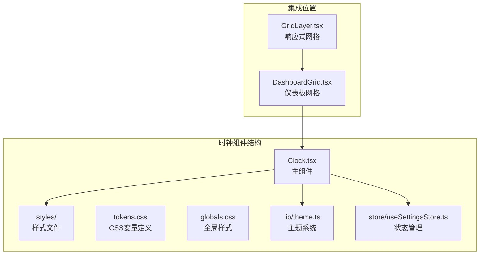
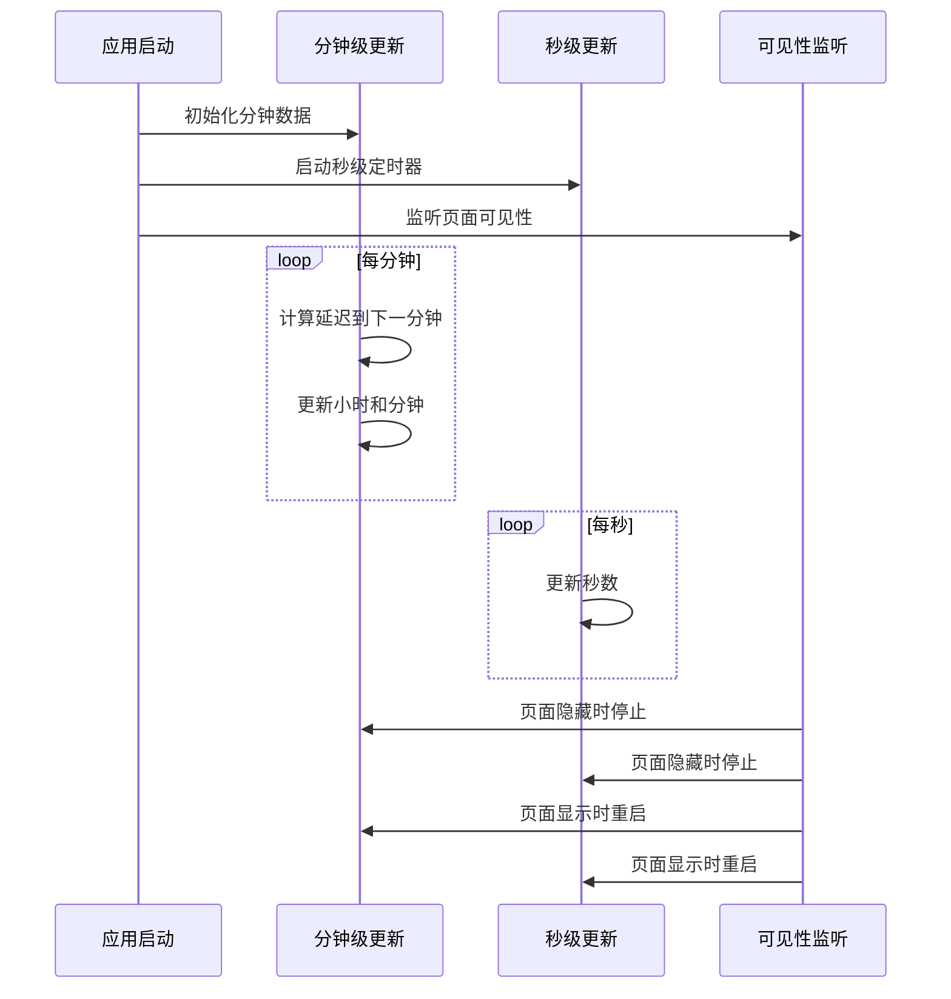
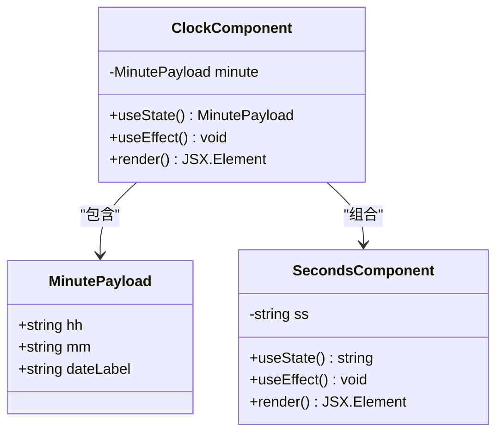
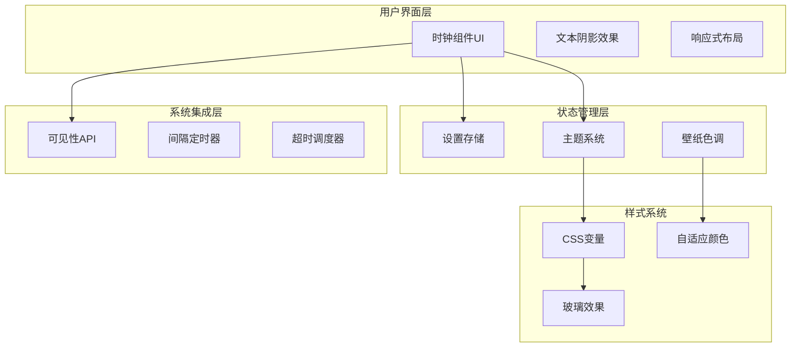
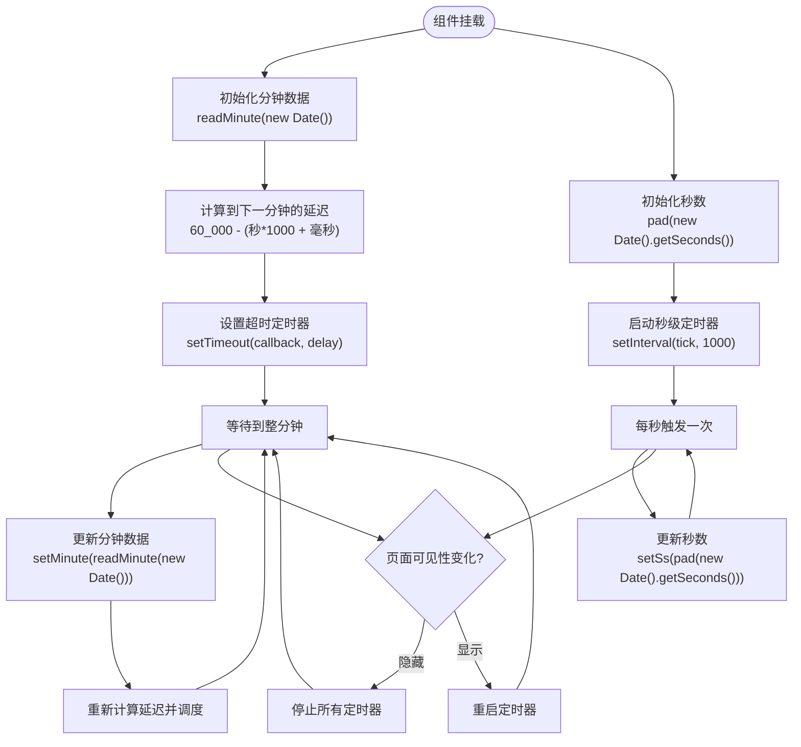
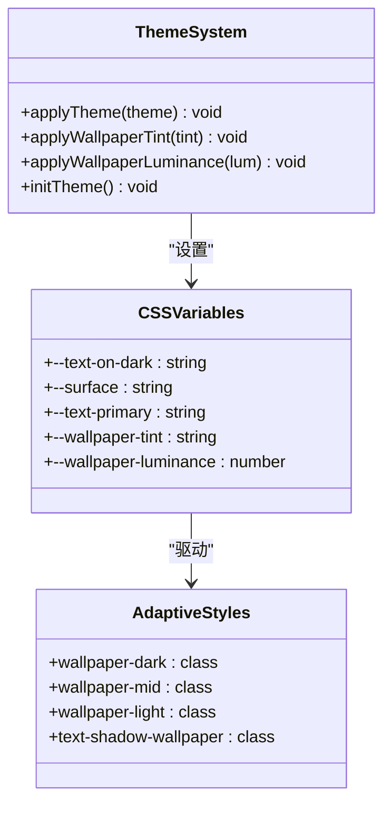
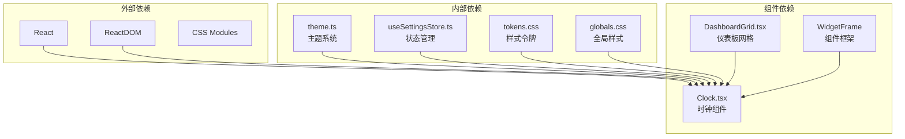
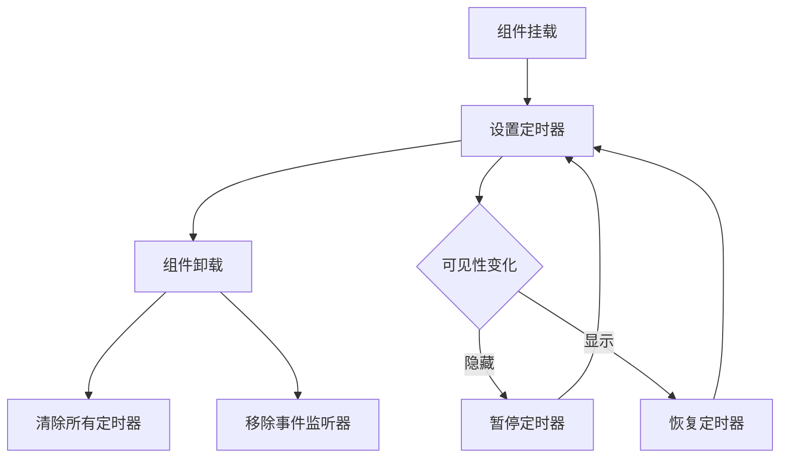

# 时钟组件

<cite>
**本文档引用的文件**
- [Clock.tsx](file://src/components/widgets/Clock/Clock.tsx)
- [theme.ts](file://src/lib/theme.ts)
- [tokens.css](file://src/styles/tokens.css)
- [globals.css](file://src/styles/globals.css)
- [useSettingsStore.ts](file://src/store/useSettingsStore.ts)
- [DashboardGrid.tsx](file://src/components/layout/DashboardGrid.tsx)
- [GridLayer.tsx](file://src/components/layout/GridLayer.tsx)
</cite>

## 目录

1. [简介](#简介)
2. [项目结构](#项目结构)
3. [核心组件](#核心组件)
4. [架构概览](#架构概览)
5. [详细组件分析](#详细组件分析)
6. [依赖关系分析](#依赖关系分析)
7. [性能考虑](#性能考虑)
8. [故障排除指南](#故障排除指南)
9. [结论](#结论)
10. [附录](#附录)

## 简介

时钟组件是新标签页应用中的一个核心功能模块，负责显示实时时间信息。该组件实现了高效的实时时间更新机制，支持响应式布局设计，并具备完善的主题适配能力。组件采用分层的时间更新策略，通过秒级和分钟级更新分离来优化性能，同时提供了对壁纸主题的智能适配。

## 项目结构

时钟组件位于组件目录的 widgets 子目录中，采用简洁的文件组织结构：



**图表来源**

- [Clock.tsx:1-112](file://src/components/widgets/Clock/Clock.tsx#L1-L112)
- [DashboardGrid.tsx:1-109](file://src/components/layout/DashboardGrid.tsx#L1-L109)

**章节来源**

- [Clock.tsx:1-112](file://src/components/widgets/Clock/Clock.tsx#L1-L112)
- [DashboardGrid.tsx:1-109](file://src/components/layout/DashboardGrid.tsx#L1-L109)

## 核心组件

### 时间更新机制

时钟组件采用了创新的分层更新策略，将秒级和分钟级更新分离：



**图表来源**

- [Clock.tsx:61-95](file://src/components/widgets/Clock/Clock.tsx#L61-L95)
- [Clock.tsx:25-59](file://src/components/widgets/Clock/Clock.tsx#L25-L59)

### 数据结构设计

组件使用简洁的数据结构来封装时间信息：



**图表来源**

- [Clock.tsx:9-21](file://src/components/widgets/Clock/Clock.tsx#L9-L21)
- [Clock.tsx:61-112](file://src/components/widgets/Clock/Clock.tsx#L61-L112)

**章节来源**

- [Clock.tsx:1-112](file://src/components/widgets/Clock/Clock.tsx#L1-L112)

## 架构概览

时钟组件在整个应用架构中扮演着重要的角色，通过以下层次实现：



**图表来源**

- [theme.ts:1-123](file://src/lib/theme.ts#L1-L123)
- [tokens.css:1-283](file://src/styles/tokens.css#L1-L283)
- [useSettingsStore.ts:1-89](file://src/store/useSettingsStore.ts#L1-L89)

## 详细组件分析

### 时间更新算法

时钟组件实现了精确的时间更新算法，确保在毫秒级别上的准确性：



**图表来源**

- [Clock.tsx:64-95](file://src/components/widgets/Clock/Clock.tsx#L64-L95)
- [Clock.tsx:28-52](file://src/components/widgets/Clock/Clock.tsx#L28-L52)

### 本地化和格式化处理

组件当前实现了简体中文的本地化支持，主要体现在星期名称和日期格式上：

| 组件     | 功能         | 实现方式                       |
| -------- | ------------ | ------------------------------ |
| 星期名称 | 中文星期显示 | 固定数组常量 `WEEKDAYS_CN`     |
| 日期格式 | 年-月-日格式 | 字符串模板拼接                 |
| 时间格式 | 24小时制     | `getHours()` 和 `getMinutes()` |

**章节来源**

- [Clock.tsx:7-21](file://src/components/widgets/Clock/Clock.tsx#L7-L21)

### 主题适配系统

时钟组件通过 CSS 变量系统实现了完整的主题适配：



**图表来源**

- [theme.ts:15-41](file://src/lib/theme.ts#L15-L41)
- [tokens.css:181-248](file://src/styles/tokens.css#L181-L248)

**章节来源**

- [theme.ts:1-123](file://src/lib/theme.ts#L1-L123)
- [tokens.css:1-283](file://src/styles/tokens.css#L1-L283)

### 响应式布局设计

组件支持多种屏幕尺寸的自适应布局：

| 断点 | 列数 | 行高度 | 最小宽度     |
| ---- | ---- | ------ | ------------ |
| lg   | 12   | 60px   | 1200px+      |
| md   | 12   | 60px   | 900px-1199px |
| sm   | 8    | 60px   | 640px-899px  |
| xs   | 4    | 60px   | 0-639px      |

**章节来源**

- [GridLayer.tsx:32-37](file://src/components/layout/GridLayer.tsx#L32-L37)

## 依赖关系分析

时钟组件的依赖关系体现了清晰的分层架构：



**图表来源**

- [Clock.tsx:1](file://src/components/widgets/Clock/Clock.tsx#L1)
- [DashboardGrid.tsx:9](file://src/components/layout/DashboardGrid.tsx#L9)

**章节来源**

- [Clock.tsx:1-112](file://src/components/widgets/Clock/Clock.tsx#L1-L112)
- [DashboardGrid.tsx:1-109](file://src/components/layout/DashboardGrid.tsx#L1-L109)

## 性能考虑

### 节流和防抖策略

时钟组件实现了多层次的性能优化：

1. **分层更新策略**：将秒级和分钟级更新分离，避免不必要的重渲染
2. **可见性感知**：页面隐藏时自动暂停定时器，恢复时重新启动
3. **精确调度**：使用 `setTimeout` 精确计算到下一分钟的时间点

### 内存管理和清理

组件确保在卸载时正确清理所有定时器：



**图表来源**

- [Clock.tsx:80-95](file://src/components/widgets/Clock/Clock.tsx#L80-L95)
- [Clock.tsx:41-52](file://src/components/widgets/Clock/Clock.tsx#L41-L52)

**章节来源**

- [Clock.tsx:64-95](file://src/components/widgets/Clock/Clock.tsx#L64-L95)

## 故障排除指南

### 常见问题及解决方案

| 问题类型         | 症状                     | 可能原因               | 解决方案                         |
| ---------------- | ------------------------ | ---------------------- | -------------------------------- |
| 时间不同步       | 显示时间与系统时间有偏差 | 定时器精度问题         | 检查浏览器性能和系统负载         |
| 页面切换后不更新 | 切换标签页后时间停止     | 可见性API未正确处理    | 确认 `visibilitychange` 事件监听 |
| 主题颜色异常     | 文字颜色与背景对比度不足 | CSS变量未正确应用      | 检查壁纸色调提取是否成功         |
| 性能问题         | 组件渲染卡顿             | 定时器过多或重渲染频繁 | 使用分层更新策略                 |

**章节来源**

- [Clock.tsx:80-95](file://src/components/widgets/Clock/Clock.tsx#L80-L95)
- [theme.ts:47-66](file://src/lib/theme.ts#L47-L66)

## 结论

时钟组件展现了现代前端开发的最佳实践，通过精心设计的分层更新策略、完善的主题适配系统和响应式布局，为用户提供了流畅且美观的时间显示体验。组件的架构设计充分考虑了性能优化和可维护性，为后续的功能扩展奠定了良好的基础。

## 附录

### 使用示例

#### 自定义时钟显示格式

要修改时钟的显示格式，可以调整 `readMinute` 函数中的日期格式化逻辑：

```typescript
// 示例：修改为 12 小时制格式
function readMinute(d: Date): MinutePayload {
  const hours = d.getHours()
  const formattedHours = hours % 12 || 12
  const period = hours >= 12 ? 'PM' : 'AM'

  return {
    hh: pad(formattedHours),
    mm: pad(d.getMinutes()),
    dateLabel: `${d.getFullYear()}年${d.getMonth() + 1}月${d.getDate()}日 · ${period}`,
  }
}
```

#### 自定义样式

通过修改 CSS 变量来自定义时钟样式：

```css
/* 修改时钟文字颜色 */
:root {
  --text-on-dark: #ffffff; /* 白色文字 */
}

/* 修改时钟大小 */
.text-8xl {
  font-size: 6rem; /* 调整小时数字大小 */
}

.text-3xl {
  font-size: 2rem; /* 调整秒数字大小 */
}
```

#### 支持更多时区

要添加多时区支持，可以在组件中添加时区参数：

```typescript
interface ClockProps {
  timezone?: string
  locale?: string
}

export function Clock({ timezone = 'local', locale = 'zh-CN' }: ClockProps) {
  // 使用 Intl.DateTimeFormat 支持多时区
  const formatter = new Intl.DateTimeFormat(locale, {
    timeZone: timezone,
    hour: '2-digit',
    minute: '2-digit',
    second: '2-digit',
    hour12: false,
  })

  // ... 其他实现
}
```

**章节来源**

- [Clock.tsx:15-21](file://src/components/widgets/Clock/Clock.tsx#L15-L21)
- [Clock.tsx:61-112](file://src/components/widgets/Clock/Clock.tsx#L61-L112)
