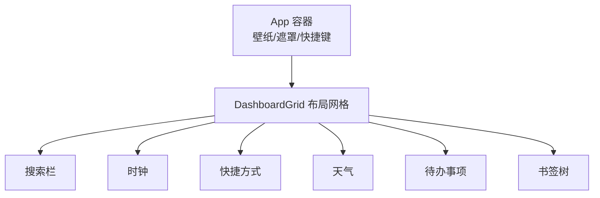
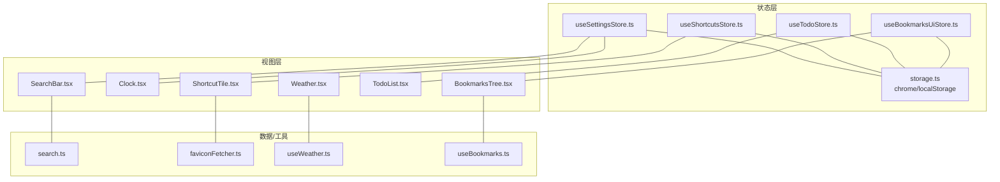
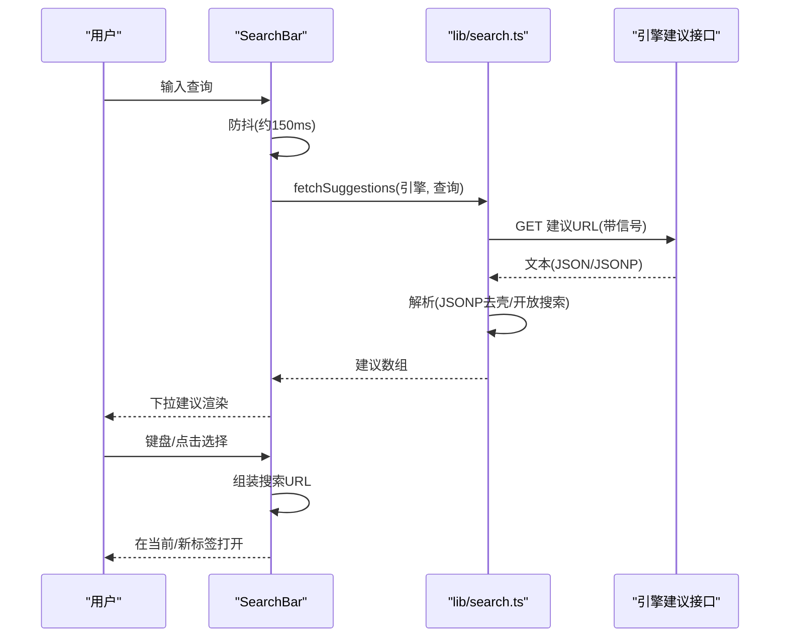
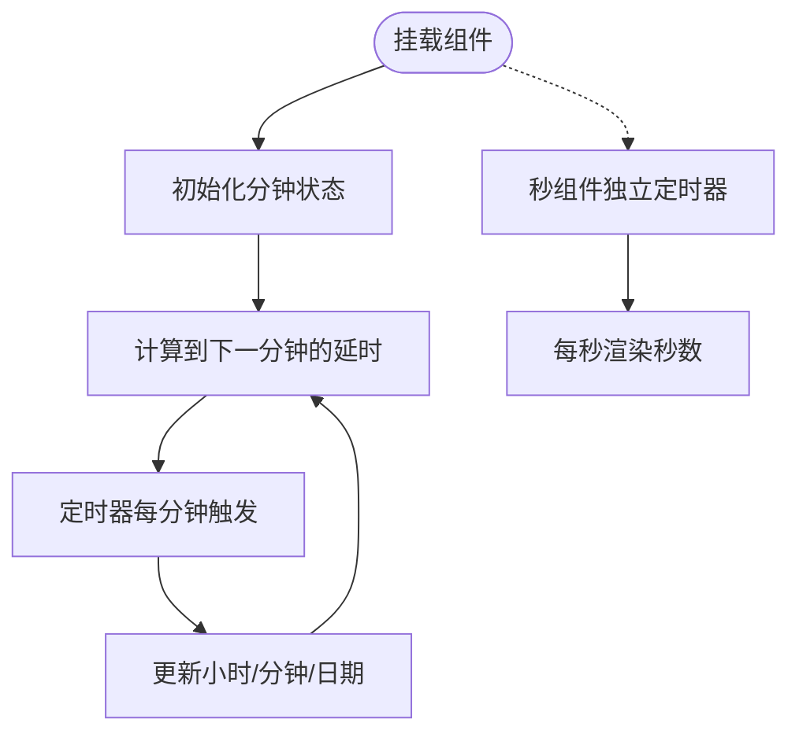
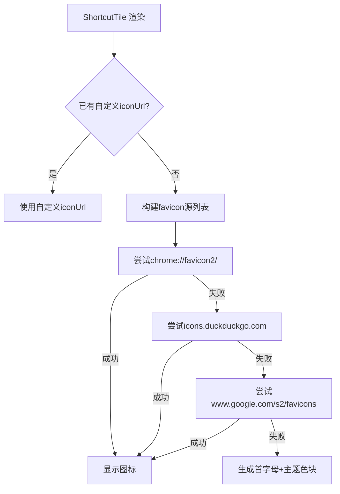
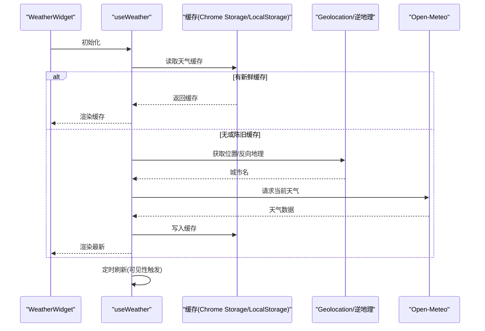
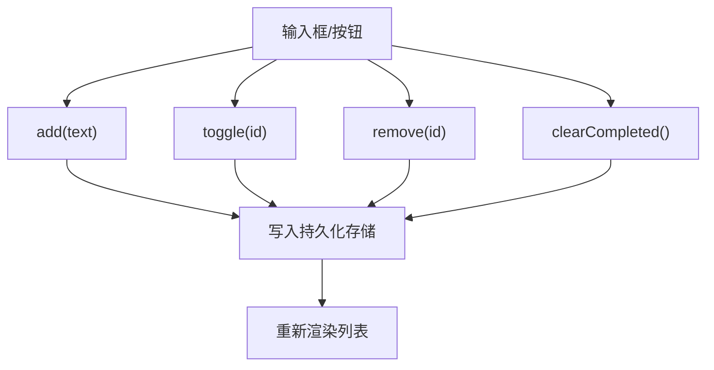
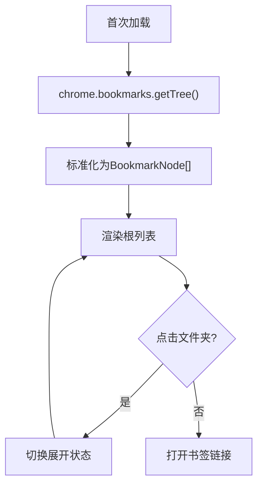
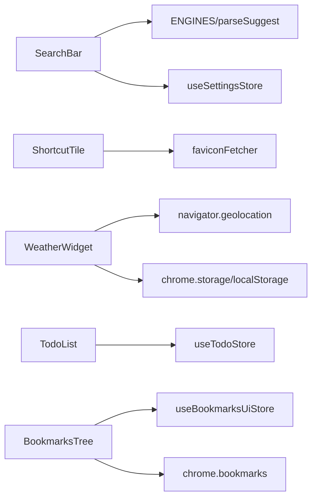

# 核心功能模块

<cite>
**本文引用的文件**
- [src/newtab/App.tsx](file://src/newtab/App.tsx)
- [src/components/widgets/SearchBar/SearchBar.tsx](file://src/components/widgets/SearchBar/SearchBar.tsx)
- [src/lib/search.ts](file://src/lib/search.ts)
- [src/components/widgets/Clock/Clock.tsx](file://src/components/widgets/Clock/Clock.tsx)
- [src/components/widgets/Shortcuts/ShortcutTile.tsx](file://src/components/widgets/Shortcuts/ShortcutTile.tsx)
- [src/components/widgets/Shortcuts/faviconFetcher.ts](file://src/components/widgets/Shortcuts/faviconFetcher.ts)
- [src/components/widgets/Weather/Weather.tsx](file://src/components/widgets/Weather/Weather.tsx)
- [src/components/widgets/Weather/useWeather.ts](file://src/components/widgets/Weather/useWeather.ts)
- [src/components/widgets/Todo/TodoList.tsx](file://src/components/widgets/Todo/TodoList.tsx)
- [src/components/widgets/Bookmarks/BookmarksTree.tsx](file://src/components/widgets/Bookmarks/BookmarksTree.tsx)
- [src/components/widgets/Bookmarks/useBookmarks.ts](file://src/components/widgets/Bookmarks/useBookmarks.ts)
- [src/store/useSettingsStore.ts](file://src/store/useSettingsStore.ts)
- [src/store/useShortcutsStore.ts](file://src/store/useShortcutsStore.ts)
- [src/store/useTodoStore.ts](file://src/store/useTodoStore.ts)
- [src/store/useBookmarksUiStore.ts](file://src/store/useBookmarksUiStore.ts)
- [src/store/storage.ts](file://src/store/storage.ts)
- [src/types/widget.ts](file://src/types/widget.ts)
</cite>

## 目录

1. [简介](#简介)
2. [项目结构](#项目结构)
3. [核心组件](#核心组件)
4. [架构总览](#架构总览)
5. [详细组件分析](#详细组件分析)
6. [依赖分析](#依赖分析)
7. [性能考量](#性能考量)
8. [故障排查指南](#故障排查指南)
9. [结论](#结论)
10. [附录](#附录)

## 简介

本文件聚焦于 Tab 新标签页扩展的核心功能模块，系统性梳理以下组件的设计与实现：搜索栏（多引擎与自动建议）、时钟（实时显示与本地化）、快捷方式（favicon 获取与回退策略）、天气（Open-Meteo 集成与缓存）、待办事项（任务管理与持久化）、书签（树形展示与分类）。文档从架构、数据流、交互体验、性能优化与最佳实践等维度进行说明，并给出组件间协作关系与使用示例。

## 项目结构

新标签页应用以“页面容器 + 布局网格 + 小部件”的分层组织：

- 页面容器负责壁纸、遮罩、全局状态与快捷键
- 布局网格承载小部件的拖拽与自适应排列
- 各小部件封装自身状态、UI 与数据源

图表来源

- [src/newtab/App.tsx:10-110](file://src/newtab/App.tsx#L10-L110)

章节来源

- [src/newtab/App.tsx:10-110](file://src/newtab/App.tsx#L10-L110)

## 核心组件

- 搜索栏：支持多搜索引擎、输入防抖触发建议、键盘导航与快捷键聚焦
- 时钟：按分钟节拍更新，秒数独立渲染；页面隐藏时节流
- 快捷方式：动态 favicon 获取与回退、标题首字母与着色
- 天气：Open-Meteo 实时天气、逆地理编码、缓存与刷新策略
- 待办事项：本地存储、增删改清空、无障碍提示
- 书签：Chrome 书签树读取、展开/折叠 UI 状态、响应式变更

章节来源

- [src/components/widgets/SearchBar/SearchBar.tsx:9-116](file://src/components/widgets/SearchBar/SearchBar.tsx#L9-L116)
- [src/lib/search.ts:88-109](file://src/lib/search.ts#L88-L109)
- [src/components/widgets/Clock/Clock.tsx:61-112](file://src/components/widgets/Clock/Clock.tsx#L61-L112)
- [src/components/widgets/Shortcuts/ShortcutTile.tsx:13-79](file://src/components/widgets/Shortcuts/ShortcutTile.tsx#L13-L79)
- [src/components/widgets/Shortcuts/faviconFetcher.ts:1-42](file://src/components/widgets/Shortcuts/faviconFetcher.ts#L1-L42)
- [src/components/widgets/Weather/Weather.tsx:36-81](file://src/components/widgets/Weather/Weather.tsx#L36-L81)
- [src/components/widgets/Weather/useWeather.ts:131-192](file://src/components/widgets/Weather/useWeather.ts#L131-L192)
- [src/components/widgets/Todo/TodoList.tsx:6-69](file://src/components/widgets/Todo/TodoList.tsx#L6-L69)
- [src/components/widgets/Bookmarks/BookmarksTree.tsx:56-88](file://src/components/widgets/Bookmarks/BookmarksTree.tsx#L56-L88)
- [src/components/widgets/Bookmarks/useBookmarks.ts:20-55](file://src/components/widgets/Bookmarks/useBookmarks.ts#L20-L55)

## 架构总览

组件间通过 Zustand 状态与 Chrome 扩展 API 协作，实现跨页面同步与本地持久化。

图表来源

- [src/store/useSettingsStore.ts:35-89](file://src/store/useSettingsStore.ts#L35-L89)
- [src/store/useShortcutsStore.ts:23-54](file://src/store/useShortcutsStore.ts#L23-L54)
- [src/store/useTodoStore.ts:20-59](file://src/store/useTodoStore.ts#L20-L59)
- [src/store/useBookmarksUiStore.ts:10-34](file://src/store/useBookmarksUiStore.ts#L10-L34)
- [src/store/storage.ts:6-32](file://src/store/storage.ts#L6-L32)
- [src/components/widgets/SearchBar/SearchBar.tsx:9-116](file://src/components/widgets/SearchBar/SearchBar.tsx#L9-L116)
- [src/lib/search.ts:88-109](file://src/lib/search.ts#L88-L109)
- [src/components/widgets/Shortcuts/ShortcutTile.tsx:13-79](file://src/components/widgets/Shortcuts/ShortcutTile.tsx#L13-L79)
- [src/components/widgets/Shortcuts/faviconFetcher.ts:1-42](file://src/components/widgets/Shortcuts/faviconFetcher.ts#L1-L42)
- [src/components/widgets/Weather/Weather.tsx:36-81](file://src/components/widgets/Weather/Weather.tsx#L36-L81)
- [src/components/widgets/Weather/useWeather.ts:131-192](file://src/components/widgets/Weather/useWeather.ts#L131-L192)
- [src/components/widgets/Todo/TodoList.tsx:6-69](file://src/components/widgets/Todo/TodoList.tsx#L6-L69)
- [src/components/widgets/Bookmarks/BookmarksTree.tsx:56-88](file://src/components/widgets/Bookmarks/BookmarksTree.tsx#L56-L88)
- [src/components/widgets/Bookmarks/useBookmarks.ts:20-55](file://src/components/widgets/Bookmarks/useBookmarks.ts#L20-L55)

## 详细组件分析

### 搜索栏组件

- 多搜索引擎支持：通过引擎元数据定义搜索与建议接口，支持 Google、Bing、百度、DuckDuckGo
- 自动建议：输入防抖 + AbortController 取消过时请求；建议解析统一为开放搜索格式或特定解析器
- 键盘交互：方向键选择、回车确认、组合键在新标签打开
- 可访问性：ARIA combobox、列表、活动项标识
- 性能：延迟触发、信号取消、空查询短路

图表来源

- [src/components/widgets/SearchBar/SearchBar.tsx:20-32](file://src/components/widgets/SearchBar/SearchBar.tsx#L20-L32)
- [src/lib/search.ts:88-109](file://src/lib/search.ts#L88-L109)

章节来源

- [src/components/widgets/SearchBar/SearchBar.tsx:9-116](file://src/components/widgets/SearchBar/SearchBar.tsx#L9-L116)
- [src/lib/search.ts:40-86](file://src/lib/search.ts#L40-L86)
- [src/lib/search.ts:88-109](file://src/lib/search.ts#L88-L109)

### 时钟组件

- 设计要点：分钟级主显示 + 秒级独立组件，减少重渲染
- 本地化：中文星期映射、年月日格式化
- 节流策略：页面隐藏时停止定时器，可见时恢复；每分钟调度一次更新
- 视觉：可读性强的等宽字体、阴影适配壁纸

图表来源

- [src/components/widgets/Clock/Clock.tsx:61-112](file://src/components/widgets/Clock/Clock.tsx#L61-L112)

章节来源

- [src/components/widgets/Clock/Clock.tsx:1-112](file://src/components/widgets/Clock/Clock.tsx#L1-L112)

### 快捷方式组件

- favicon 获取链路：优先使用浏览器内置图标，其次 DuckDuckGo Google 图标服务
- 回退策略：逐个尝试源，失败则切换下一个；全部失败则生成标题首字母与主题色背景
- 可编辑态：支持删除按钮与禁用跳转
- 性能：预取多个源地址，错误时快速切换，避免阻塞渲染

图表来源

- [src/components/widgets/Shortcuts/ShortcutTile.tsx:13-79](file://src/components/widgets/Shortcuts/ShortcutTile.tsx#L13-L79)
- [src/components/widgets/Shortcuts/faviconFetcher.ts:13-26](file://src/components/widgets/Shortcuts/faviconFetcher.ts#L13-L26)

章节来源

- [src/components/widgets/Shortcuts/ShortcutTile.tsx:1-79](file://src/components/widgets/Shortcuts/ShortcutTile.tsx#L1-L79)
- [src/components/widgets/Shortcuts/faviconFetcher.ts:1-42](file://src/components/widgets/Shortcuts/faviconFetcher.ts#L1-L42)

### 天气组件

- 数据源：Open-Meteo 实时天气接口
- 位置获取：优先浏览器 Geolocation API，失败回退默认城市；逆地理编码使用 BigDataCloud
- 缓存策略：stale-while-revalidate，缓存键按经纬度四舍五入到百米级别
- UI 映射：天气码映射图标与中文描述；风速四舍五入；定位不可用时标注
- 错误处理：异常时显示错误信息；支持 AbortController 取消请求

图表来源

- [src/components/widgets/Weather/Weather.tsx:36-81](file://src/components/widgets/Weather/Weather.tsx#L36-L81)
- [src/components/widgets/Weather/useWeather.ts:131-192](file://src/components/widgets/Weather/useWeather.ts#L131-L192)

章节来源

- [src/components/widgets/Weather/Weather.tsx:1-81](file://src/components/widgets/Weather/Weather.tsx#L1-L81)
- [src/components/widgets/Weather/useWeather.ts:1-192](file://src/components/widgets/Weather/useWeather.ts#L1-L192)

### 待办事项组件

- 状态模型：每项含 id、文本、完成状态、创建时间
- 持久化：Zustand + 持久化中间件，基于 chrome.storage.local 或 localStorage
- 交互：新增、切换完成、删除、清空已完成；输入回车即提交
- 无障碍：数量提示、原子更新通知

图表来源

- [src/components/widgets/Todo/TodoList.tsx:6-69](file://src/components/widgets/Todo/TodoList.tsx#L6-L69)
- [src/store/useTodoStore.ts:20-59](file://src/store/useTodoStore.ts#L20-L59)

章节来源

- [src/components/widgets/Todo/TodoList.tsx:1-69](file://src/components/widgets/Todo/TodoList.tsx#L1-L69)
- [src/store/useTodoStore.ts:1-59](file://src/store/useTodoStore.ts#L1-L59)

### 书签组件

- 数据来源：chrome.bookmarks.getTree，标准化为树节点
- 展示逻辑：文件夹可折叠，子项递归渲染；普通书签直接链接
- UI 状态：展开/收起由独立 UI Store 管理，支持跨组件同步
- 变更监听：订阅书签事件，自动刷新

图表来源

- [src/components/widgets/Bookmarks/BookmarksTree.tsx:56-88](file://src/components/widgets/Bookmarks/BookmarksTree.tsx#L56-L88)
- [src/components/widgets/Bookmarks/useBookmarks.ts:20-55](file://src/components/widgets/Bookmarks/useBookmarks.ts#L20-L55)
- [src/store/useBookmarksUiStore.ts:10-34](file://src/store/useBookmarksUiStore.ts#L10-L34)

章节来源

- [src/components/widgets/Bookmarks/BookmarksTree.tsx:1-88](file://src/components/widgets/Bookmarks/BookmarksTree.tsx#L1-L88)
- [src/components/widgets/Bookmarks/useBookmarks.ts:1-55](file://src/components/widgets/Bookmarks/useBookmarks.ts#L1-L55)
- [src/store/useBookmarksUiStore.ts:1-34](file://src/store/useBookmarksUiStore.ts#L1-L34)

## 依赖分析

- 组件耦合
  - 搜索栏依赖设置中的引擎配置与建议解析工具
  - 快捷方式依赖 favicon 工具与图标源
  - 天气依赖地理位置与第三方 API，内部维护缓存
  - 待办与书签依赖各自状态存储
- 外部依赖
  - Chrome 扩展 API：bookmarks、storage、geolocation
  - 第三方服务：Open-Meteo、BigDataCloud、favicon 服务
- 状态同步
  - 使用 chrome.storage.onChanged 订阅远程变化，确保多标签页一致

图表来源

- [src/components/widgets/SearchBar/SearchBar.tsx:9-116](file://src/components/widgets/SearchBar/SearchBar.tsx#L9-L116)
- [src/lib/search.ts:40-86](file://src/lib/search.ts#L40-L86)
- [src/components/widgets/Shortcuts/ShortcutTile.tsx:13-79](file://src/components/widgets/Shortcuts/ShortcutTile.tsx#L13-L79)
- [src/components/widgets/Shortcuts/faviconFetcher.ts:1-42](file://src/components/widgets/Shortcuts/faviconFetcher.ts#L1-L42)
- [src/components/widgets/Weather/useWeather.ts:131-192](file://src/components/widgets/Weather/useWeather.ts#L131-L192)
- [src/components/widgets/Todo/TodoList.tsx:6-69](file://src/components/widgets/Todo/TodoList.tsx#L6-L69)
- [src/store/useTodoStore.ts:20-59](file://src/store/useTodoStore.ts#L20-L59)
- [src/components/widgets/Bookmarks/BookmarksTree.tsx:56-88](file://src/components/widgets/Bookmarks/BookmarksTree.tsx#L56-L88)
- [src/store/useBookmarksUiStore.ts:10-34](file://src/store/useBookmarksUiStore.ts#L10-L34)
- [src/components/widgets/Bookmarks/useBookmarks.ts:20-55](file://src/components/widgets/Bookmarks/useBookmarks.ts#L20-L55)

章节来源

- [src/store/storage.ts:34-63](file://src/store/storage.ts#L34-L63)

## 性能考量

- 搜索建议
  - 防抖与 AbortController，避免频繁网络请求与内存泄漏
  - 建议数量上限控制，降低渲染压力
- 时钟
  - 分钟与秒分离渲染，减少不必要的重渲染
  - 页面隐藏时暂停定时器，可见时再恢复
- 天气
  - stale-while-revalidate 缓存，首次即刻渲染，后台刷新
  - 逆地理缓存键按经纬度精度聚合，降低重复请求
  - 定时刷新与可见性事件驱动，避免常驻轮询
- 快捷方式
  - 多源回退与错误边界，保证可用性与流畅性
- 待办/书签
  - 持久化中间件减少手动序列化开销
  - 仅在必要时重渲染（局部状态）

## 故障排查指南

- 搜索建议无返回
  - 检查网络与 AbortController 是否提前终止
  - 确认引擎是否配置了建议接口与解析器
- favicon 加载失败
  - 检查 URL 合法性与网络可达性
  - 确认回退源可用性
- 天气显示错误
  - 查看定位权限与超时设置
  - 检查 Open-Meteo 与 BigDataCloud 的可用性
  - 清理缓存后重试
- 书签不显示
  - 检查扩展权限与 chrome.bookmarks API 可用性
  - 关注 runtime.lastError 输出
- 状态未同步
  - 确认 chrome.storage.onChanged 订阅是否生效
  - 检查持久化存储键名与版本迁移

章节来源

- [src/lib/search.ts:103-108](file://src/lib/search.ts#L103-L108)
- [src/components/widgets/Weather/useWeather.ts:165-169](file://src/components/widgets/Weather/useWeather.ts#L165-L169)
- [src/components/widgets/Bookmarks/useBookmarks.ts:28-34](file://src/components/widgets/Bookmarks/useBookmarks.ts#L28-L34)
- [src/store/storage.ts:53-62](file://src/store/storage.ts#L53-L62)

## 结论

本项目通过清晰的组件边界、稳定的外部依赖与完善的持久化机制，实现了高可用的新标签页体验。搜索、时钟、快捷方式、天气、待办与书签六大模块各司其职，配合状态层与布局网格，形成可扩展、可维护且高性能的整体架构。

## 附录

- 使用示例与配置选项
  - 搜索引擎：在设置中切换 google/bing/baidu/duckduckgo
  - 快捷方式：支持添加/编辑/删除，可指定自定义图标
  - 待办事项：支持清空已完成，输入回车新增
  - 书签：点击文件夹展开/折叠，点击书签在新标签打开
  - 天气：自动定位，定位失败显示默认城市；支持刷新与缓存
- 最佳实践
  - 保持 UI 与数据层解耦，优先使用 hooks 抽象副作用
  - 对网络请求与定时器进行清理，避免内存泄漏
  - 利用缓存与节流策略提升性能与用户体验
  - 为关键路径提供降级方案（如 favicon 多源回退、天气缓存）
