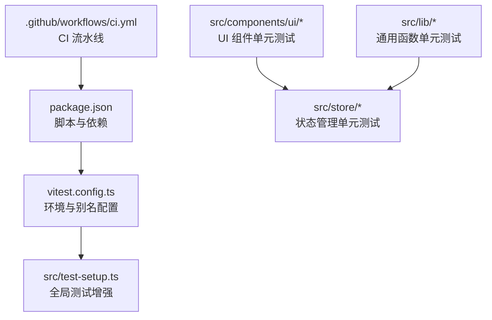
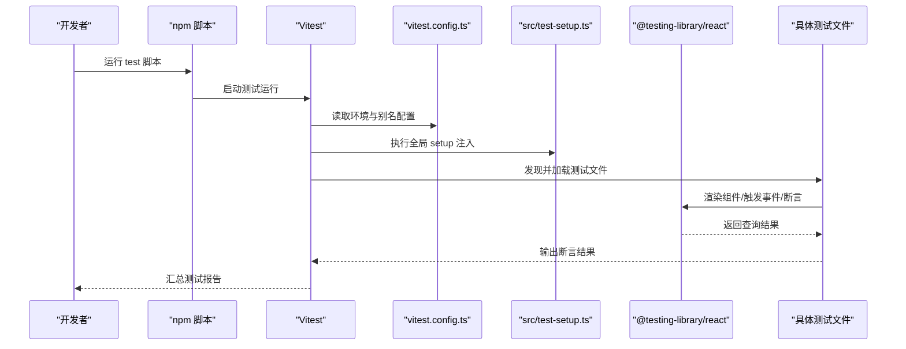
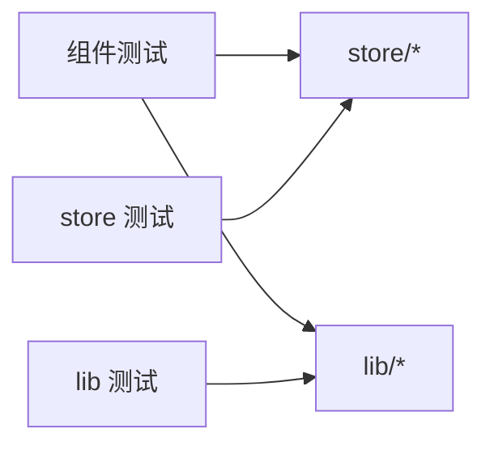

# 测试策略

<cite>
**本文引用的文件**
- [vitest.config.ts](file://vitest.config.ts)
- [package.json](file://package.json)
- [.github/workflows/ci.yml](file://.github/workflows/ci.yml)
- [src/test-setup.ts](file://src/test-setup.ts)
- [src/components/ui/Button.test.tsx](file://src/components/ui/Button.test.tsx)
- [src/components/widgets/Shortcuts/ShortcutTile.test.tsx](file://src/components/widgets/Shortcuts/ShortcutTile.test.tsx)
- [src/store/useLayoutStore.test.ts](file://src/store/useLayoutStore.test.ts)
- [src/store/useSettingsStore.test.ts](file://src/store/useSettingsStore.test.ts)
- [src/store/useShortcutsStore.test.ts](file://src/store/useShortcutsStore.test.ts)
- [src/store/useTodoStore.test.ts](file://src/store/useTodoStore.test.ts)
- [src/lib/search.test.ts](file://src/lib/search.test.ts)
- [src/lib/theme.test.ts](file://src/lib/theme.test.ts)
- [src/lib/wallpaperTint.test.ts](file://src/lib/wallpaperTint.test.ts)
- [README.md](file://README.md)
</cite>

## 目录

1. [引言](#引言)
2. [项目结构](#项目结构)
3. [核心组件](#核心组件)
4. [架构总览](#架构总览)
5. [详细组件分析](#详细组件分析)
6. [依赖分析](#依赖分析)
7. [性能考虑](#性能考虑)
8. [故障排查指南](#故障排查指南)
9. [结论](#结论)
10. [附录](#附录)

## 引言

本文件系统化梳理 Tab 项目的测试策略与质量保证体系，覆盖单元测试、组件测试、状态管理测试、集成测试设计思路、测试工具配置与环境搭建、测试数据与模拟策略、性能优化与持续集成配置，以及测试报告解读与质量指标建议。目标是帮助开发者在不深入源码的前提下理解测试现状，并据此完善测试覆盖率与质量度量。

## 项目结构

- 测试运行器：Vitest（基于 jsdom 环境）
- 测试入口与全局设置：通过 Vitest 配置与全局 setup 文件注入测试环境能力
- 测试组织：按功能模块分层，组件测试位于对应组件目录下，状态管理测试位于 store 目录，通用库函数测试位于 lib 目录
- 持续集成：GitHub Actions 在 Ubuntu 上执行 Lint、Type Check、Test、Build 四步流水线

图表来源

- [package.json:10-17](file://package.json#L10-L17)
- [vitest.config.ts:4-15](file://vitest.config.ts#L4-L15)
- [src/test-setup.ts:1-2](file://src/test-setup.ts#L1-L2)
- [.github/workflows/ci.yml:10-33](file://.github/workflows/ci.yml#L10-L33)

章节来源

- [README.md:54-68](file://README.md#L54-L68)
- [package.json:10-17](file://package.json#L10-L17)
- [vitest.config.ts:4-15](file://vitest.config.ts#L4-L15)
- [.github/workflows/ci.yml:10-33](file://.github/workflows/ci.yml#L10-L33)

## 核心组件

- 测试运行器与环境
  - 使用 Vitest 运行测试，jsdom 作为 DOM 环境，支持 @testing-library/react 的查询与断言
  - 通过别名 @ 指向 src，简化导入路径
  - 全局注入 @testing-library/jest-dom/vitest 能力，扩展 DOM 断言
- 测试脚本与 CI
  - 本地通过 npm run test 执行测试
  - CI 中依次执行 Lint、Type Check、Test、Build，确保质量门槛
- 覆盖率与报告
  - 当前仓库未显式配置覆盖率收集与报告生成；建议在 Vitest 配置中启用覆盖率统计与阈值控制，以形成可追踪的质量指标

章节来源

- [vitest.config.ts:4-15](file://vitest.config.ts#L4-L15)
- [src/test-setup.ts:1-2](file://src/test-setup.ts#L1-L2)
- [package.json:10-17](file://package.json#L10-L17)
- [.github/workflows/ci.yml:22-29](file://.github/workflows/ci.yml#L22-L29)

## 架构总览

下图展示测试架构的关键交互：测试脚本调用 Vitest，Vitest 加载配置与全局设置，再驱动 @testing-library/react 渲染组件或调用 store 函数进行断言。

图表来源

- [package.json:16](file://package.json#L16)
- [vitest.config.ts:10-14](file://vitest.config.ts#L10-L14)
- [src/test-setup.ts:1](file://src/test-setup.ts#L1-L2)

## 详细组件分析

### 单元测试最佳实践

- 命名与组织
  - 使用 describe/it/expect 分层组织测试，每个测试聚焦单一行为
  - 将测试文件与被测代码同名或同路径，便于维护与定位
- 断言风格
  - 优先使用语义化断言（如已启用的 jest-dom），避免对内部实现细节的脆弱断言
  - 对样式类名等易变内容，采用“存在性”或“模式匹配”断言
- 边界与异常
  - 对空输入、非法参数、异常流程进行覆盖，确保健壮性
  - 对异步函数返回 Promise 实例进行断言，验证缓存/去重等并发策略

示例参考

- UI 组件渲染与交互测试：[src/components/ui/Button.test.tsx:1-66](file://src/components/ui/Button.test.tsx#L1-L66)
- 工具函数解析与编码测试：[src/lib/search.test.ts:1-99](file://src/lib/search.test.ts#L1-L99)
- 主题亮度分类与 CSS 变量设置：[src/lib/theme.test.ts:1-44](file://src/lib/theme.test.ts#L1-L44)
- 壁纸色调提取缓存一致性：[src/lib/wallpaperTint.test.ts:1-29](file://src/lib/wallpaperTint.test.ts#L1-L29)

章节来源

- [src/components/ui/Button.test.tsx:1-66](file://src/components/ui/Button.test.tsx#L1-L66)
- [src/lib/search.test.ts:1-99](file://src/lib/search.test.ts#L1-L99)
- [src/lib/theme.test.ts:1-44](file://src/lib/theme.test.ts#L1-L44)
- [src/lib/wallpaperTint.test.ts:1-29](file://src/lib/wallpaperTint.test.ts#L1-L29)

### 组件测试最佳实践（React 组件）

- 渲染测试
  - 使用 screen.getByRole/getByText 等语义化查询，确保断言与用户感知一致
  - 验证默认属性、变体与尺寸类名是否正确应用
- 交互测试
  - 使用 fireEvent 或 @testing-library/react 提供的用户事件方法，模拟点击、键盘等交互
  - 验证交互后状态变化与副作用（如 store 更新、DOM 属性变更）
- 状态测试
  - 通过 store.getState()/setState() 直接操作状态，验证增删改查与边界条件
  - 对不可用图标回退、编辑态切换等分支进行覆盖

示例参考

- 快捷方式卡片渲染与移除：[src/components/widgets/Shortcuts/ShortcutTile.test.tsx:1-71](file://src/components/widgets/Shortcuts/ShortcutTile.test.tsx#L1-L71)
- 设置项默认值与更新：[src/store/useSettingsStore.test.ts:1-90](file://src/store/useSettingsStore.test.ts#L1-L90)
- 待办事项增删与完成切换：[src/store/useTodoStore.test.ts:1-84](file://src/store/useTodoStore.test.ts#L1-L84)

章节来源

- [src/components/widgets/Shortcuts/ShortcutTile.test.tsx:1-71](file://src/components/widgets/Shortcuts/ShortcutTile.test.tsx#L1-L71)
- [src/store/useSettingsStore.test.ts:1-90](file://src/store/useSettingsStore.test.ts#L1-L90)
- [src/store/useTodoStore.test.ts:1-84](file://src/store/useTodoStore.test.ts#L1-L84)

### 状态管理测试策略（Zustand Store）

- 默认状态与初始化
  - 校验默认值集合与边界范围，确保初始一致性
- 功能性操作
  - 针对增删改查、排序、开关切换等动作进行断言
  - 对异常 ID、重复调用等边界进行健壮性测试
- 重置与恢复
  - 提供 reset 恢复默认的能力验证，确保配置可回滚

示例参考

- 布局与可见性切换：[src/store/useLayoutStore.test.ts:1-57](file://src/store/useLayoutStore.test.ts#L1-L57)
- 快捷方式列表维护：[src/store/useShortcutsStore.test.ts:1-69](file://src/store/useShortcutsStore.test.ts#L1-L69)

章节来源

- [src/store/useLayoutStore.test.ts:1-57](file://src/store/useLayoutStore.test.ts#L1-L57)
- [src/store/useShortcutsStore.test.ts:1-69](file://src/store/useShortcutsStore.test.ts#L1-L69)

### 集成测试设计思路

- 组件-Store 集成
  - 通过渲染组件并触发交互，验证 store 状态变更与 UI 同步
  - 示例：快捷方式卡片在编辑态显示删除按钮并在点击后从 store 移除
- 组件-外部依赖集成
  - 对网络请求（如建议接口）进行 mock，验证解析器与错误处理
  - 示例：搜索建议空查询、AbortSignal 场景、JSONP 解析
- 主题与壁纸集成
  - 验证主题亮度分类与 CSS 变量联动，确保 UI 适配

示例参考

- 搜索引擎与建议解析：[src/lib/search.test.ts:26-42](file://src/lib/search.test.ts#L26-L42)
- 主题亮度与 CSS 变量：[src/lib/theme.test.ts:10-36](file://src/lib/theme.test.ts#L10-L36)

章节来源

- [src/lib/search.test.ts:26-42](file://src/lib/search.test.ts#L26-L42)
- [src/lib/theme.test.ts:10-36](file://src/lib/theme.test.ts#L10-L36)

### 测试数据准备与模拟策略

- Mock 与 Stub
  - 对外部依赖（如网络请求、浏览器 API）进行最小化模拟，确保测试稳定
  - 对异步函数返回 Promise，验证缓存/去重逻辑
- 测试夹具
  - 使用固定默认值与基础数据，减少测试间耦合
  - 在 beforeEach 中重置状态，避免跨用例污染
- 数据边界
  - 覆盖空字符串、特殊字符、越界数值等边界条件

示例参考

- 搜索建议与 JSONP 解析：[src/lib/search.test.ts:60-98](file://src/lib/search.test.ts#L60-L98)
- 壁纸色调提取缓存：[src/lib/wallpaperTint.test.ts:14-27](file://src/lib/wallpaperTint.test.ts#L14-L27)

章节来源

- [src/lib/search.test.ts:60-98](file://src/lib/search.test.ts#L60-L98)
- [src/lib/wallpaperTint.test.ts:14-27](file://src/lib/wallpaperTint.test.ts#L14-L27)

### 测试工具配置与环境搭建

- 本地运行
  - 安装依赖后执行 npm run test 运行所有测试
- 环境与别名
  - Vitest 配置启用 jsdom、全局断言与别名 @，提升开发体验
- CI 集成
  - GitHub Actions 在 Ubuntu 上安装 Node.js 22，执行 Lint、Type Check、Test、Build

章节来源

- [package.json:10-17](file://package.json#L10-L17)
- [vitest.config.ts:4-15](file://vitest.config.ts#L4-L15)
- [.github/workflows/ci.yml:10-33](file://.github/workflows/ci.yml#L10-L33)

## 依赖分析

- 测试框架与库
  - Vitest：测试运行与断言
  - @testing-library/react：语义化查询与用户事件
  - @testing-library/jest-dom：DOM 断言扩展
  - jsdom：DOM 环境
- 项目内依赖关系
  - 组件测试依赖 store 与 lib；store 测试独立于 UI；lib 测试独立于 UI 与 store

图表来源

- [src/components/widgets/Shortcuts/ShortcutTile.test.tsx:1-71](file://src/components/widgets/Shortcuts/ShortcutTile.test.tsx#L1-L71)
- [src/store/useSettingsStore.test.ts:1-90](file://src/store/useSettingsStore.test.ts#L1-L90)
- [src/lib/search.test.ts:1-99](file://src/lib/search.test.ts#L1-L99)

## 性能考虑

- 测试并发与缓存
  - 对异步函数进行缓存/去重验证，避免重复请求与重复计算
- 测试隔离
  - 使用 beforeEach 重置状态，减少跨用例干扰
- CI 并行
  - 在 CI 中可考虑拆分任务（Lint/Type/Unit/Build），缩短反馈周期

章节来源

- [src/lib/wallpaperTint.test.ts:14-27](file://src/lib/wallpaperTint.test.ts#L14-L27)
- [src/store/useSettingsStore.test.ts:5-19](file://src/store/useSettingsStore.test.ts#L5-L19)

## 故障排查指南

- 常见问题
  - DOM 查询失败：确认使用语义化查询（如 getByRole），避免脆弱的选择器
  - 状态未重置：检查 beforeEach 是否正确重置 store 状态
  - 异步断言失败：确保对 Promise 进行 await 或使用异步断言
- 调试建议
  - 在测试中打印关键状态或使用调试断点
  - 缩小测试范围，逐步排除无关因素

章节来源

- [src/components/widgets/Shortcuts/ShortcutTile.test.tsx:1-71](file://src/components/widgets/Shortcuts/ShortcutTile.test.tsx#L1-L71)
- [src/store/useSettingsStore.test.ts:5-19](file://src/store/useSettingsStore.test.ts#L5-L19)

## 结论

当前 Tab 项目已建立完善的前端测试基础设施：Vitest + jsdom + @testing-library 生态，配合明确的模块化测试组织。建议下一步引入覆盖率统计与阈值控制、补充端到端测试场景、在 CI 中增加覆盖率报告与质量门禁，以进一步提升质量保障水平。

## 附录

### 测试覆盖率与质量指标建议

- 覆盖率维度
  - 行覆盖率、分支覆盖率、函数覆盖率、指令覆盖率
- 阈值建议
  - 语句与函数：≥80%
  - 分支与指令：≥70%
- 报告与门禁
  - 在 Vitest 中启用覆盖率输出，并在 CI 中设置失败阈值

章节来源

- [vitest.config.ts:10-14](file://vitest.config.ts#L10-L14)
