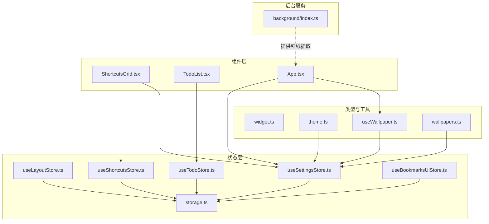
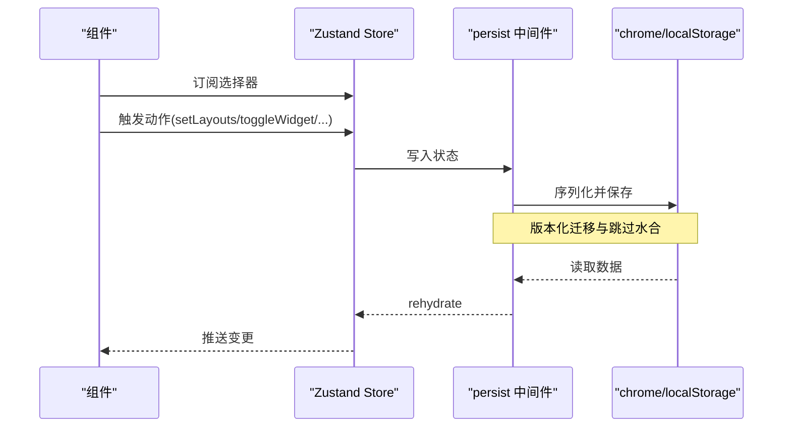
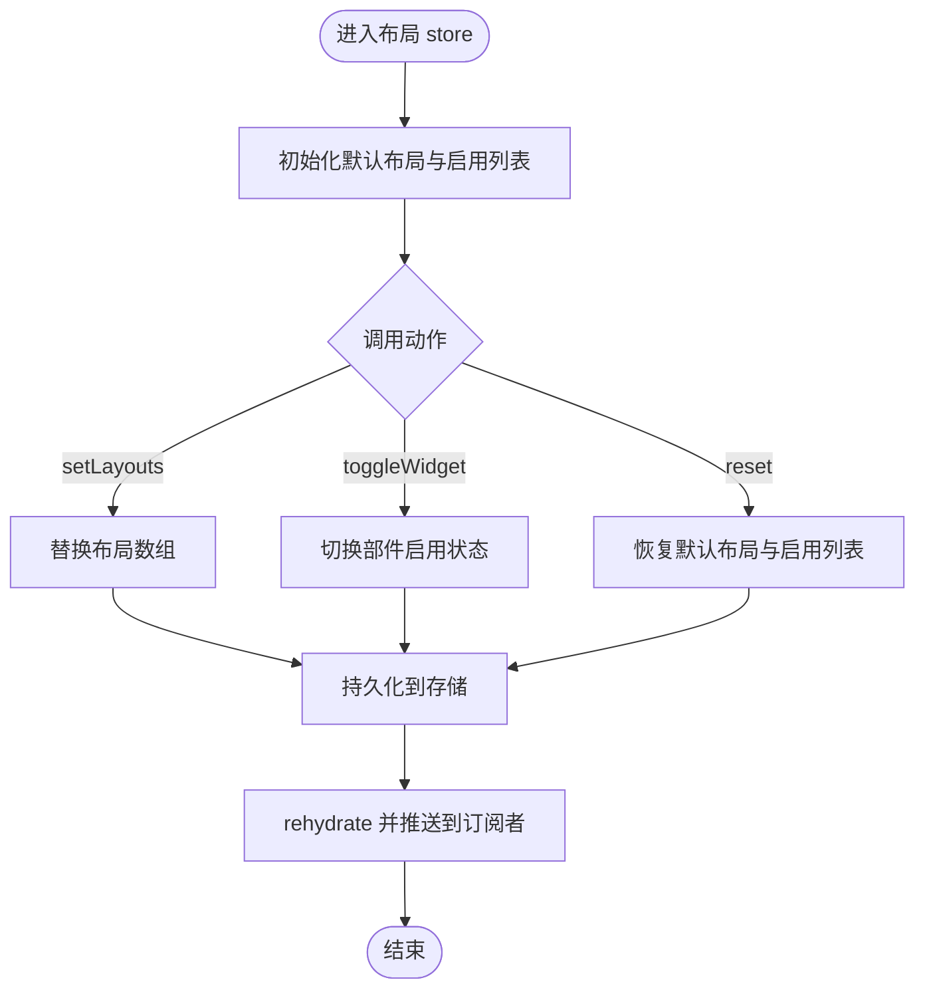
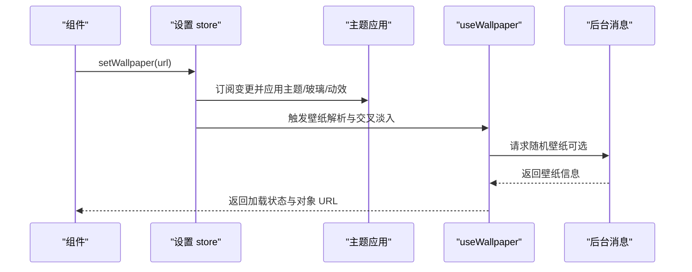
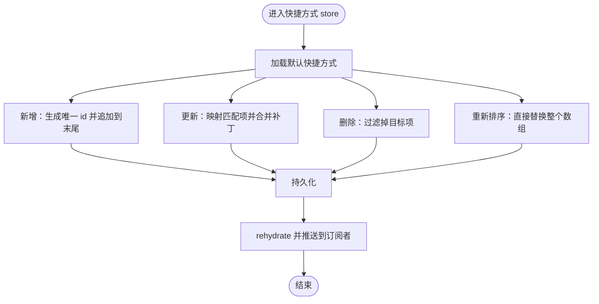
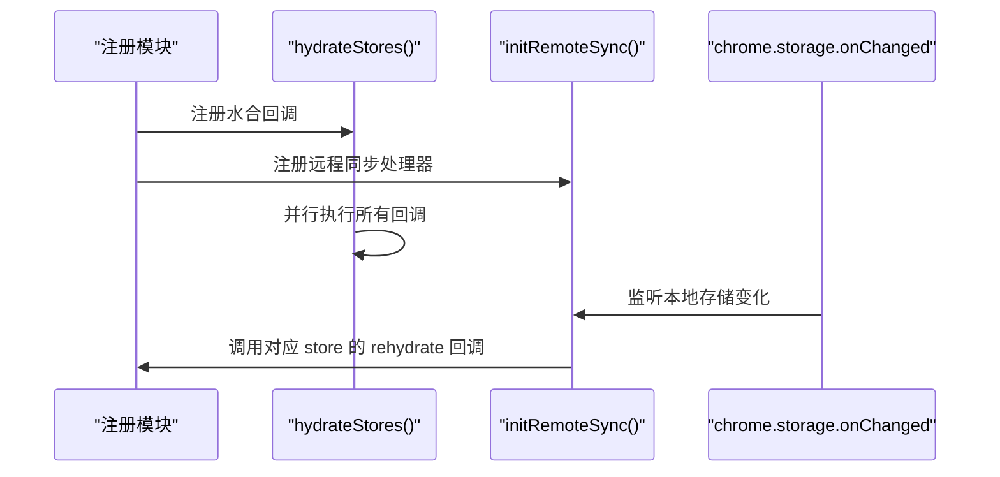
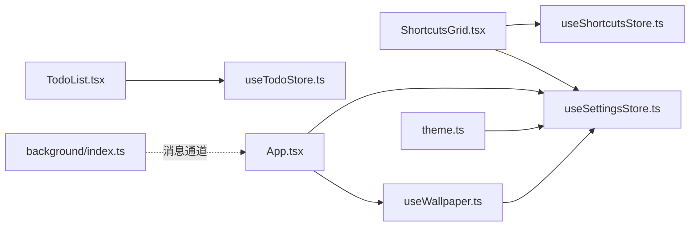

# Zustand Store 架构

<cite>
**本文引用的文件**
- [useLayoutStore.ts](file://src/store/useLayoutStore.ts)
- [useSettingsStore.ts](file://src/store/useSettingsStore.ts)
- [useShortcutsStore.ts](file://src/store/useShortcutsStore.ts)
- [useTodoStore.ts](file://src/store/useTodoStore.ts)
- [useBookmarksUiStore.ts](file://src/store/useBookmarksUiStore.ts)
- [storage.ts](file://src/store/storage.ts)
- [widget.ts](file://src/types/widget.ts)
- [useLayoutStore.test.ts](file://src/store/useLayoutStore.test.ts)
- [useSettingsStore.test.ts](file://src/store/useSettingsStore.test.ts)
- [useShortcutsStore.test.ts](file://src/store/useShortcutsStore.test.ts)
- [ShortcutsGrid.tsx](file://src/components/widgets/Shortcuts/ShortcutsGrid.tsx)
- [TodoList.tsx](file://src/components/widgets/Todo/TodoList.tsx)
- [App.tsx](file://src/newtab/App.tsx)
- [theme.ts](file://src/lib/theme.ts)
- [useWallpaper.ts](file://src/lib/useWallpaper.ts)
- [wallpapers.ts](file://src/lib/wallpapers.ts)
- [index.ts](file://src/background/index.ts)
</cite>

## 目录

1. [引言](#引言)
2. [项目结构](#项目结构)
3. [核心组件](#核心组件)
4. [架构总览](#架构总览)
5. [详细组件分析](#详细组件分析)
6. [依赖关系分析](#依赖关系分析)
7. [性能考量](#性能考量)
8. [故障排查指南](#故障排查指南)
9. [结论](#结论)
10. [附录](#附录)

## 引言

本文件系统性梳理该项目中基于 Zustand 的状态管理架构，重点阐述以下方面：

- 设计理念与应用方式：以“原子化 store + 持久化中间件”的模式组织状态，强调可测试性与可维护性。
- store 创建模式：统一采用 create + persist + 自定义 JSON 存储的组合；通过注册水合与远程同步机制保证多页面一致性。
- 状态结构设计：明确接口定义、默认值与迁移策略；对复杂字段（如壁纸亮度）进行类型约束与边界处理。
- 动作函数实现：围绕不可变更新、批量替换、条件切换等常见模式构建。
- 组件间依赖与通信：通过 store 订阅与选择器实现松耦合通信；部分场景由背景页提供跨域能力。
- 扩展与定制最佳实践：版本化迁移、错误边界、性能优化与内存管理。
- 调试方法与测试用例路径：结合单元测试定位问题。

## 项目结构

本项目的状态层位于 src/store，按功能拆分为多个独立的 store；同时提供通用的存储适配层与水合/同步机制。组件层通过选择器订阅所需状态，避免不必要的重渲染。

图表来源

- [useLayoutStore.ts:1-58](file://src/store/useLayoutStore.ts#L1-L58)
- [useSettingsStore.ts:1-89](file://src/store/useSettingsStore.ts#L1-L89)
- [useShortcutsStore.ts:1-54](file://src/store/useShortcutsStore.ts#L1-L54)
- [useTodoStore.ts:1-59](file://src/store/useTodoStore.ts#L1-L59)
- [useBookmarksUiStore.ts:1-34](file://src/store/useBookmarksUiStore.ts#L1-L34)
- [storage.ts:1-63](file://src/store/storage.ts#L1-L63)
- [widget.ts:1-34](file://src/types/widget.ts#L1-L34)
- [theme.ts:1-123](file://src/lib/theme.ts#L1-L123)
- [useWallpaper.ts:1-110](file://src/lib/useWallpaper.ts#L1-L110)
- [wallpapers.ts:1-69](file://src/lib/wallpapers.ts#L1-L69)
- [ShortcutsGrid.tsx:1-38](file://src/components/widgets/Shortcuts/ShortcutsGrid.tsx#L1-L38)
- [TodoList.tsx:1-69](file://src/components/widgets/Todo/TodoList.tsx#L1-L69)
- [App.tsx:1-110](file://src/newtab/App.tsx#L1-L110)
- [index.ts:1-174](file://src/background/index.ts#L1-L174)

章节来源

- [useLayoutStore.ts:1-58](file://src/store/useLayoutStore.ts#L1-L58)
- [useSettingsStore.ts:1-89](file://src/store/useSettingsStore.ts#L1-L89)
- [useShortcutsStore.ts:1-54](file://src/store/useShortcutsStore.ts#L1-L54)
- [useTodoStore.ts:1-59](file://src/store/useTodoStore.ts#L1-L59)
- [useBookmarksUiStore.ts:1-34](file://src/store/useBookmarksUiStore.ts#L1-L34)
- [storage.ts:1-63](file://src/store/storage.ts#L1-L63)
- [widget.ts:1-34](file://src/types/widget.ts#L1-L34)

## 核心组件

- 布局 store（useLayoutStore）
  - 状态：布局数组与启用的部件 ID 列表
  - 动作：设置布局、切换部件显示、重置为默认
  - 持久化：Chrome Storage 或本地存储，版本化迁移
- 设置 store（useSettingsStore）
  - 状态：主题、玻璃模式、搜索引擎、壁纸、亮度/遮罩、编辑态、动效偏好
  - 动作：设置主题/引擎/壁纸等；计算并限制壁纸遮罩范围
  - 持久化：版本化迁移，兼容旧字段到新字段
- 快捷方式 store（useShortcutsStore）
  - 状态：快捷方式列表
  - 动作：新增、更新、删除、重新排序
  - 持久化：版本化迁移
- 待办 store（useTodoStore）
  - 状态：待办项列表
  - 动作：新增、切换完成、删除、清理已完成
- 书签 UI store（useBookmarksUiStore）
  - 状态：展开的分组 ID 列表
  - 动作：切换展开/收起
- 存储适配层（storage.ts）
  - 统一读写接口：Chrome Storage 或浏览器本地存储
  - 水合注册与远程同步：支持多标签页一致性和跨页面通知

章节来源

- [useLayoutStore.ts:6-58](file://src/store/useLayoutStore.ts#L6-L58)
- [useSettingsStore.ts:10-89](file://src/store/useSettingsStore.ts#L10-L89)
- [useShortcutsStore.ts:6-54](file://src/store/useShortcutsStore.ts#L6-L54)
- [useTodoStore.ts:12-59](file://src/store/useTodoStore.ts#L12-L59)
- [useBookmarksUiStore.ts:5-34](file://src/store/useBookmarksUiStore.ts#L5-L34)
- [storage.ts:6-63](file://src/store/storage.ts#L6-L63)

## 架构总览

Zustand 在本项目中的应用遵循“单一职责 + 可测试 + 可持久化”的原则。所有 store 都通过 persist 中间件与自定义存储适配层集成，确保状态在刷新或重启后仍可恢复。组件通过选择器订阅所需字段，减少重渲染范围。

图表来源

- [useLayoutStore.ts:32-58](file://src/store/useLayoutStore.ts#L32-L58)
- [useSettingsStore.ts:35-89](file://src/store/useSettingsStore.ts#L35-L89)
- [useShortcutsStore.ts:23-54](file://src/store/useShortcutsStore.ts#L23-L54)
- [useTodoStore.ts:20-59](file://src/store/useTodoStore.ts#L20-L59)
- [useBookmarksUiStore.ts:10-34](file://src/store/useBookmarksUiStore.ts#L10-L34)
- [storage.ts:6-63](file://src/store/storage.ts#L6-L63)

## 详细组件分析

### 布局 store（useLayoutStore）

- 接口与类型
  - 状态接口包含布局数组与启用部件 ID 数组
  - 使用 WidgetId 与 WidgetLayout 类型约束
- 默认值与行为
  - 提供默认布局与默认启用部件集合
  - 支持设置布局数组、切换部件显示、重置为默认
- 持久化与迁移
  - 使用 JSON 存储适配层，版本号为 1，迁移函数保留原样
  - 注册水合与远程同步，确保多页面一致
- 与组件交互
  - 组件通过选择器订阅布局与启用状态，动作触发后自动持久化

图表来源

- [useLayoutStore.ts:14-58](file://src/store/useLayoutStore.ts#L14-L58)
- [widget.ts:8-33](file://src/types/widget.ts#L8-L33)

章节来源

- [useLayoutStore.ts:6-58](file://src/store/useLayoutStore.ts#L6-L58)
- [widget.ts:1-34](file://src/types/widget.ts#L1-L34)
- [useLayoutStore.test.ts:1-57](file://src/store/useLayoutStore.test.ts#L1-L57)

### 设置 store（useSettingsStore）

- 接口与类型
  - 主题、玻璃模式、搜索引擎枚举
  - 壁纸相关：URL、色调、亮度、遮罩强度
  - 编辑态与动效偏好
- 默认值与边界处理
  - 壁纸遮罩范围限制在 0~0.6
  - 版本化迁移：从二元暗色字段迁移到连续亮度字段
- 与主题/壁纸管线协作
  - 主题应用、玻璃模式、动效偏好通过订阅实时生效
  - 壁纸色调与亮度提取与缓存，避免重复解码

图表来源

- [useSettingsStore.ts:35-89](file://src/store/useSettingsStore.ts#L35-L89)
- [theme.ts:47-122](file://src/lib/theme.ts#L47-L122)
- [useWallpaper.ts:11-110](file://src/lib/useWallpaper.ts#L11-L110)
- [index.ts:132-173](file://src/background/index.ts#L132-L173)

章节来源

- [useSettingsStore.ts:10-89](file://src/store/useSettingsStore.ts#L10-L89)
- [theme.ts:1-123](file://src/lib/theme.ts#L1-L123)
- [useSettingsStore.test.ts:1-90](file://src/store/useSettingsStore.test.ts#L1-L90)
- [wallpapers.ts:1-69](file://src/lib/wallpapers.ts#L1-L69)

### 快捷方式 store（useShortcutsStore）

- 接口与类型
  - 快捷方式接口包含 id、title、url、iconUrl
  - WidgetId 类型用于布局联动
- 默认值与行为
  - 提供默认快捷方式集合
  - 新增时生成唯一 id；更新/删除/重新排序均返回全新数组
- 与组件交互
  - 组件订阅 items 与编辑态，动作触发后自动持久化

图表来源

- [useShortcutsStore.ts:14-54](file://src/store/useShortcutsStore.ts#L14-L54)
- [widget.ts:1-6](file://src/types/widget.ts#L1-L6)

章节来源

- [useShortcutsStore.ts:6-54](file://src/store/useShortcutsStore.ts#L6-L54)
- [useShortcutsStore.test.ts:1-69](file://src/store/useShortcutsStore.test.ts#L1-L69)

### 待办 store（useTodoStore）

- 接口与类型
  - 待办项接口包含 id、text、done、createdAt
- 行为
  - 新增时生成唯一 id、去除空白、置于顶部
  - 切换完成状态、删除单个、清理已完成
- 与组件交互
  - 组件订阅 items 并调用动作，状态持久化

章节来源

- [useTodoStore.ts:5-59](file://src/store/useTodoStore.ts#L5-L59)
- [TodoList.tsx:1-69](file://src/components/widgets/Todo/TodoList.tsx#L1-L69)

### 书签 UI store（useBookmarksUiStore）

- 接口与类型
  - 展开的分组 ID 列表
- 行为
  - 切换展开/收起指定分组
- 与组件交互
  - 组件订阅展开状态并触发切换

章节来源

- [useBookmarksUiStore.ts:5-34](file://src/store/useBookmarksUiStore.ts#L5-L34)

### 存储适配层（storage.ts）

- 统一接口
  - getItem/setItem/removeItem 支持扩展环境与浏览器本地存储回退
- 水合与远程同步
  - 注册水合回调，集中执行 rehydrate
  - 注册远程同步处理器，监听 chrome.storage.onChanged 并触发对应 store 的 rehydrate
- 错误处理
  - 对 Chrome Storage 写入/删除异常进行记录

图表来源

- [storage.ts:34-63](file://src/store/storage.ts#L34-L63)

章节来源

- [storage.ts:1-63](file://src/store/storage.ts#L1-L63)

## 依赖关系分析

- 组件与 store
  - ShortcutsGrid 订阅快捷方式列表与设置 store 的编辑态
  - TodoList 订阅待办列表并调用新增/清理动作
  - App 订阅设置 store 的编辑态、动效与壁纸遮罩，并消费 useWallpaper 的加载状态
- store 与存储
  - 各 store 通过 persist + JSON 存储适配层实现持久化
- 主题与壁纸管线
  - theme.ts 订阅设置 store 的变更并应用到 DOM
  - useWallpaper.ts 基于设置 store 的壁纸 URL 解析并管理对象 URL 生命周期
- 背景页服务
  - background/index.ts 提供壁纸抓取消息通道，供前端异步获取随机壁纸

图表来源

- [ShortcutsGrid.tsx:9-38](file://src/components/widgets/Shortcuts/ShortcutsGrid.tsx#L9-L38)
- [TodoList.tsx:6-69](file://src/components/widgets/Todo/TodoList.tsx#L6-L69)
- [App.tsx:10-110](file://src/newtab/App.tsx#L10-L110)
- [theme.ts:47-122](file://src/lib/theme.ts#L47-L122)
- [useWallpaper.ts:11-110](file://src/lib/useWallpaper.ts#L11-L110)
- [index.ts:132-173](file://src/background/index.ts#L132-L173)

章节来源

- [ShortcutsGrid.tsx:1-38](file://src/components/widgets/Shortcuts/ShortcutsGrid.tsx#L1-L38)
- [TodoList.tsx:1-69](file://src/components/widgets/Todo/TodoList.tsx#L1-L69)
- [App.tsx:1-110](file://src/newtab/App.tsx#L1-L110)
- [theme.ts:1-123](file://src/lib/theme.ts#L1-L123)
- [useWallpaper.ts:1-110](file://src/lib/useWallpaper.ts#L1-L110)
- [index.ts:1-174](file://src/background/index.ts#L1-L174)

## 性能考量

- 选择器订阅与最小化重渲染
  - 组件仅订阅所需字段，避免因无关状态变更导致的重渲染
- 不可变更新与批量替换
  - 多数动作返回全新数组/对象，便于 React 识别变更
- 持久化与水合策略
  - skipHydration 避免首屏闪烁；版本化迁移减少迁移成本
- 壁纸加载与内存管理
  - useWallpaper 管理对象 URL 的创建与撤销，防止内存泄漏
  - 交叉淡入/淡出动画时长可随 reduceMotion 动态调整
- 主题与壁纸提取去抖
  - 主题管线对壁纸色调提取进行去抖，避免频繁解码

章节来源

- [useWallpaper.ts:18-106](file://src/lib/useWallpaper.ts#L18-L106)
- [theme.ts:87-95](file://src/lib/theme.ts#L87-L95)
- [App.tsx:18-19](file://src/newtab/App.tsx#L18-L19)

## 故障排查指南

- 水合失败或状态未恢复
  - 检查 storage.ts 中的注册是否正确，确认 hydrateStores 是否被调用
  - 确认 persist 配置的 name、version 与 migrate 是否匹配
- 远程同步不生效
  - 确认 initRemoteSync 已在扩展环境中注册监听
  - 检查 registerRemoteSync 的 key 与 persist.name 是否一致
- 壁纸无法加载或内存泄漏
  - 检查 useWallpaper 的对象 URL 撤销逻辑是否执行
  - 确认组件卸载时是否清理定时器与事件监听
- 主题/玻璃/动效未生效
  - 检查 theme.ts 的订阅回调是否被触发
  - 确认 DOM 上的 CSS 类与变量是否正确设置

章节来源

- [storage.ts:34-63](file://src/store/storage.ts#L34-L63)
- [useWallpaper.ts:95-106](file://src/lib/useWallpaper.ts#L95-L106)
- [theme.ts:97-122](file://src/lib/theme.ts#L97-L122)

## 结论

本项目的 Zustand 架构以“单一 store + 持久化 + 选择器订阅”为核心，实现了清晰的职责划分与良好的可测试性。通过版本化迁移、水合与远程同步机制，确保了状态的一致性与可靠性。配合主题/壁纸管线与内存管理策略，整体性能与用户体验得到保障。建议在后续扩展中继续坚持“小而专”的 store 设计，保持动作的纯函数式更新，并完善边界条件与错误处理。

## 附录

- 测试用例参考路径
  - [useLayoutStore.test.ts:1-57](file://src/store/useLayoutStore.test.ts#L1-L57)
  - [useSettingsStore.test.ts:1-90](file://src/store/useSettingsStore.test.ts#L1-L90)
  - [useShortcutsStore.test.ts:1-69](file://src/store/useShortcutsStore.test.ts#L1-L69)
- 关键实现参考路径
  - [useLayoutStore.ts:1-58](file://src/store/useLayoutStore.ts#L1-L58)
  - [useSettingsStore.ts:1-89](file://src/store/useSettingsStore.ts#L1-L89)
  - [useShortcutsStore.ts:1-54](file://src/store/useShortcutsStore.ts#L1-L54)
  - [useTodoStore.ts:1-59](file://src/store/useTodoStore.ts#L1-L59)
  - [useBookmarksUiStore.ts:1-34](file://src/store/useBookmarksUiStore.ts#L1-L34)
  - [storage.ts:1-63](file://src/store/storage.ts#L1-L63)
  - [widget.ts:1-34](file://src/types/widget.ts#L1-L34)
  - [theme.ts:1-123](file://src/lib/theme.ts#L1-L123)
  - [useWallpaper.ts:1-110](file://src/lib/useWallpaper.ts#L1-L110)
  - [wallpapers.ts:1-69](file://src/lib/wallpapers.ts#L1-L69)
  - [index.ts:1-174](file://src/background/index.ts#L1-L174)
