# 存储集成机制

<cite>
**本文档引用的文件**
- [src/store/storage.ts](file://src/store/storage.ts)
- [src/newtab/main.tsx](file://src/newtab/main.tsx)
- [src/store/useLayoutStore.ts](file://src/store/useLayoutStore.ts)
- [src/store/useSettingsStore.ts](file://src/store/useSettingsStore.ts)
- [src/store/useShortcutsStore.ts](file://src/store/useShortcutsStore.ts)
- [src/store/useTodoStore.ts](file://src/store/useTodoStore.ts)
- [src/lib/logger.ts](file://src/lib/logger.ts)
- [src/types/widget.ts](file://src/types/widget.ts)
- [manifest.config.ts](file://manifest.config.ts)
- [package.json](file://package.json)
</cite>

## 目录

1. [简介](#简介)
2. [项目结构](#项目结构)
3. [核心组件](#核心组件)
4. [架构概览](#架构概览)
5. [详细组件分析](#详细组件分析)
6. [依赖关系分析](#依赖关系分析)
7. [性能考虑](#性能考虑)
8. [故障排除指南](#故障排除指南)
9. [结论](#结论)
10. [附录](#附录)

## 简介

本项目实现了基于 Chrome Extension 的存储集成机制，采用 Zustand 状态管理库与自定义存储适配器相结合的方式，提供了完整的数据持久化、水合（hydration）和远程同步功能。该系统支持在 Chrome 扩展环境中使用 `chrome.storage.local` 进行数据持久化，同时在非扩展环境（如开发模式）下回退到 `localStorage`。

系统的核心特性包括：

- 自定义存储适配器设计，无缝支持 Chrome 扩展和 Web 环境
- 水合（hydration）过程，确保应用启动时状态的正确恢复
- 远程同步机制，保持多标签页间的实时一致性
- 版本迁移策略，支持数据结构的向后兼容
- 错误处理和调试工具

## 项目结构

项目的存储相关文件组织遵循模块化设计原则，主要分布在以下目录：

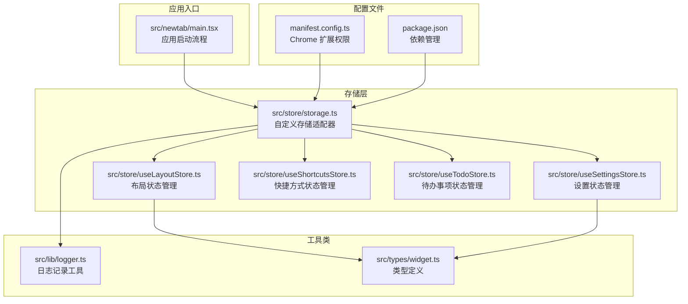

**图表来源**

- [src/store/storage.ts:1-63](file://src/store/storage.ts#L1-L63)
- [src/newtab/main.tsx:1-28](file://src/newtab/main.tsx#L1-L28)
- [src/store/useLayoutStore.ts:1-58](file://src/store/useLayoutStore.ts#L1-L58)
- [src/store/useSettingsStore.ts:1-89](file://src/store/useSettingsStore.ts#L1-L89)
- [src/store/useShortcutsStore.ts:1-54](file://src/store/useShortcutsStore.ts#L1-L54)
- [src/store/useTodoStore.ts:1-59](file://src/store/useTodoStore.ts#L1-L59)

**章节来源**

- [src/store/storage.ts:1-63](file://src/store/storage.ts#L1-L63)
- [src/newtab/main.tsx:1-28](file://src/newtab/main.tsx#L1-L28)
- [manifest.config.ts:1-38](file://manifest.config.ts#L1-L38)

## 核心组件

### 自定义存储适配器

系统的核心是 `chromeStorage` 对象，它实现了 Zustand 的 `StateStorage` 接口，提供了统一的数据持久化抽象：

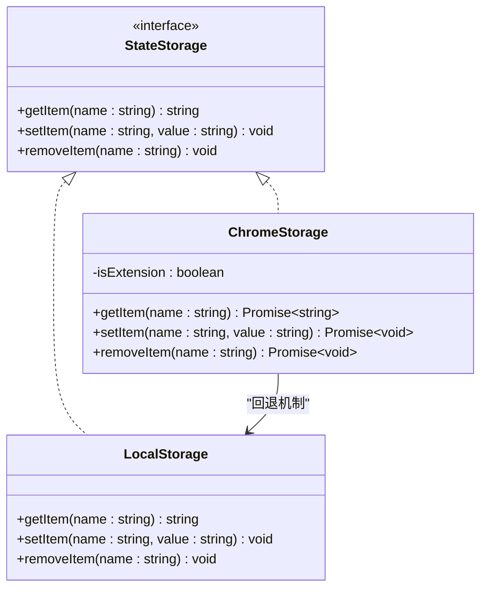

**图表来源**

- [src/store/storage.ts:6-32](file://src/store/storage.ts#L6-L32)

该适配器的关键特性：

- **环境检测**：通过检查 `chrome.storage.local` 来确定运行环境
- **异步操作**：所有存储操作都是异步的，支持 Promise
- **错误处理**：利用 `chrome.runtime.lastError` 进行错误检测
- **回退机制**：在非扩展环境下自动使用 `localStorage`

### 水合（Hydration）系统

水合过程确保应用启动时能够从持久化存储中恢复状态：

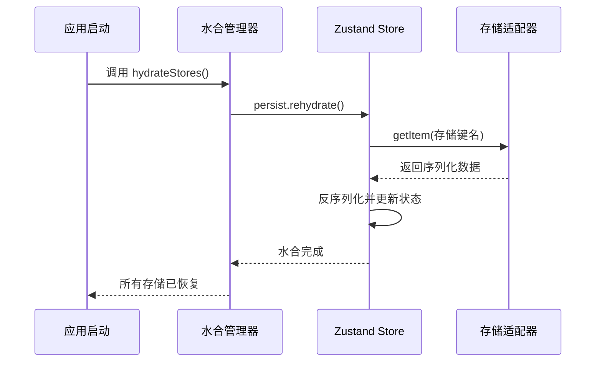

**图表来源**

- [src/store/storage.ts:34-43](file://src/store/storage.ts#L34-L43)
- [src/newtab/main.tsx:11-13](file://src/newtab/main.tsx#L11-L13)

### 远程同步机制

系统实现了跨标签页的实时同步，通过监听 `chrome.storage.onChanged` 事件：

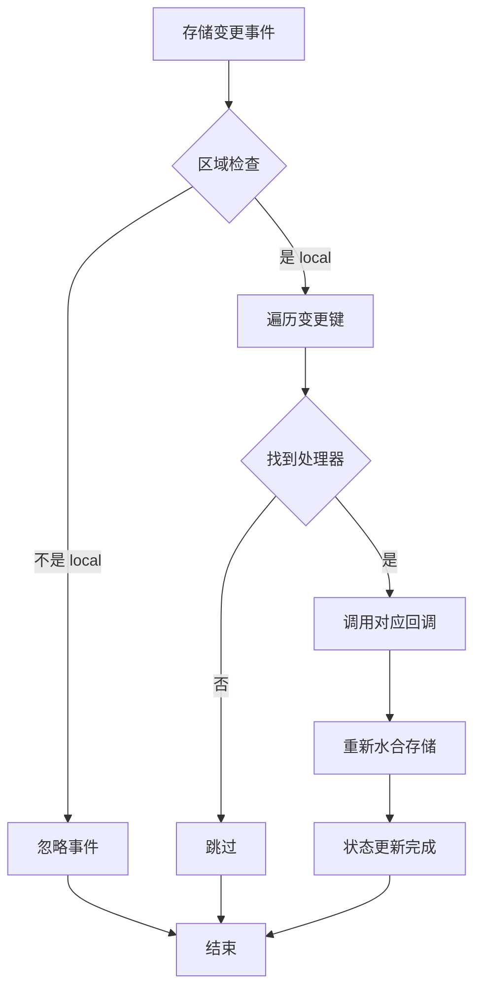

**图表来源**

- [src/store/storage.ts:53-62](file://src/store/storage.ts#L53-L62)

**章节来源**

- [src/store/storage.ts:1-63](file://src/store/storage.ts#L1-L63)
- [src/newtab/main.tsx:1-28](file://src/newtab/main.tsx#L1-L28)

## 架构概览

整个存储系统的架构设计体现了分层和解耦的原则：

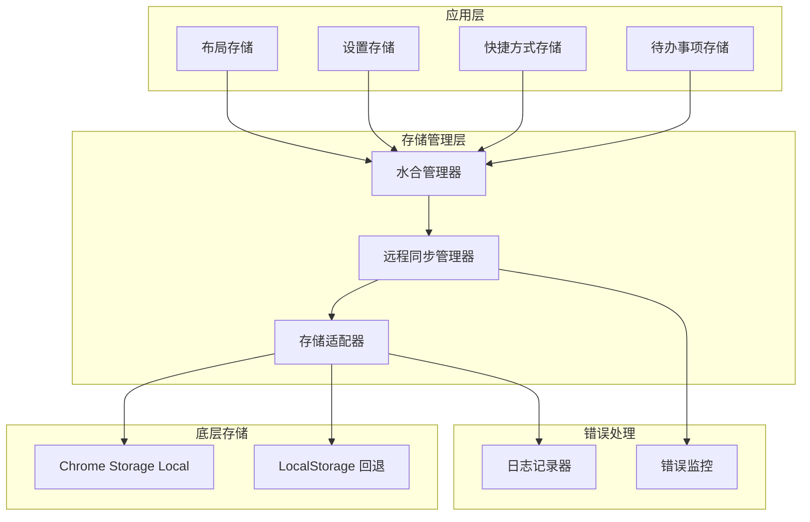

**图表来源**

- [src/store/storage.ts:4-32](file://src/store/storage.ts#L4-L32)
- [src/lib/logger.ts:20-35](file://src/lib/logger.ts#L20-L35)

该架构的主要优势：

- **单一职责**：每个存储管理器专注于特定的状态域
- **可扩展性**：新的存储域可以轻松添加
- **错误隔离**：错误处理集中在适配器层
- **环境适应性**：自动适应不同的运行环境

## 详细组件分析

### 布局存储（useLayoutStore）

布局存储管理仪表板的组件布局和可见性设置：

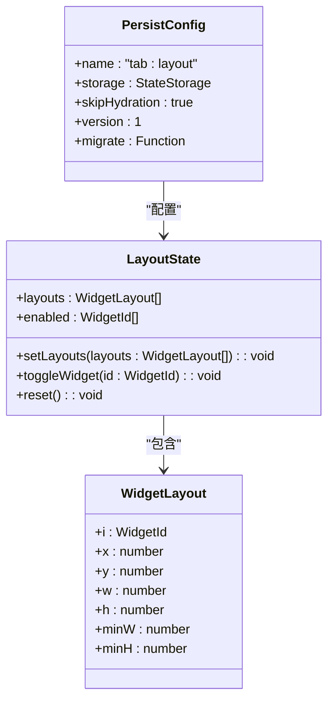

**图表来源**

- [src/store/useLayoutStore.ts:6-12](file://src/store/useLayoutStore.ts#L6-L12)
- [src/store/useLayoutStore.ts:25-33](file://src/store/useLayoutStore.ts#L25-L33)

布局存储的默认配置：

- **预设布局**：包含时钟、搜索、快捷方式、天气、待办、书签等组件
- **启用状态**：默认启用所有组件
- **持久化名称**：使用 `"tab:layout"` 作为存储键
- **版本控制**：当前版本为 1

**章节来源**

- [src/store/useLayoutStore.ts:1-58](file://src/store/useLayoutStore.ts#L1-L58)
- [src/types/widget.ts:25-33](file://src/types/widget.ts#L25-L33)

### 设置存储（useSettingsStore）

设置存储管理用户界面主题、壁纸和其他个性化设置：

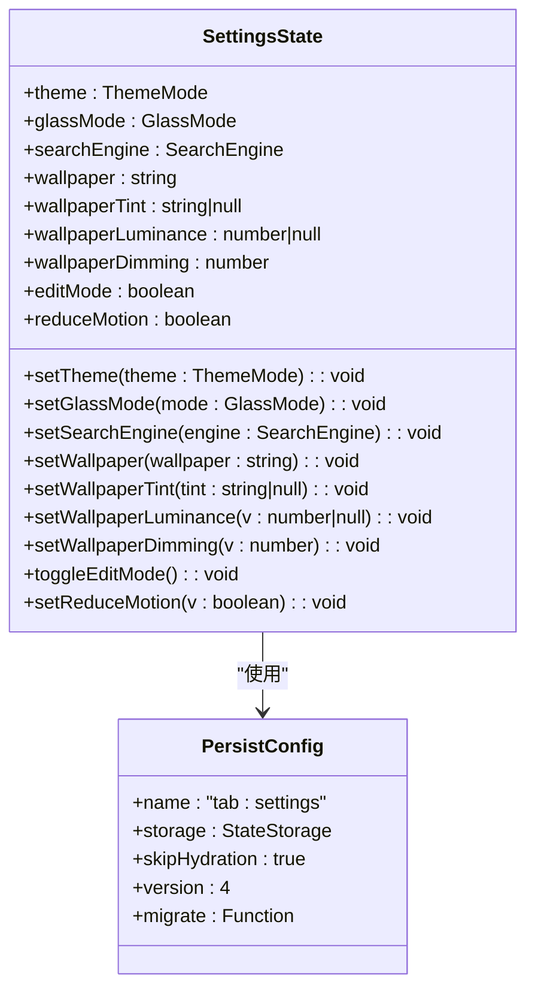

**图表来源**

- [src/store/useSettingsStore.ts:10-31](file://src/store/useSettingsStore.ts#L10-L31)
- [src/store/useSettingsStore.ts:57-84](file://src/store/useSettingsStore.ts#L57-L84)

设置存储的版本迁移策略：

- **v1 → v2**：引入 `wallpaperDimming` 字段，默认值为 0.25
- **v2 → v3**：引入 `wallpaperIsDark` 字段，用于表示壁纸明暗
- **v3 → v4**：将二元的 `wallpaperIsDark` 替换为连续的 `wallpaperLuminance` 值

**章节来源**

- [src/store/useSettingsStore.ts:1-89](file://src/store/useSettingsStore.ts#L1-L89)

### 快捷方式存储（useShortcutsStore）

快捷方式存储管理用户定义的网站快捷方式：

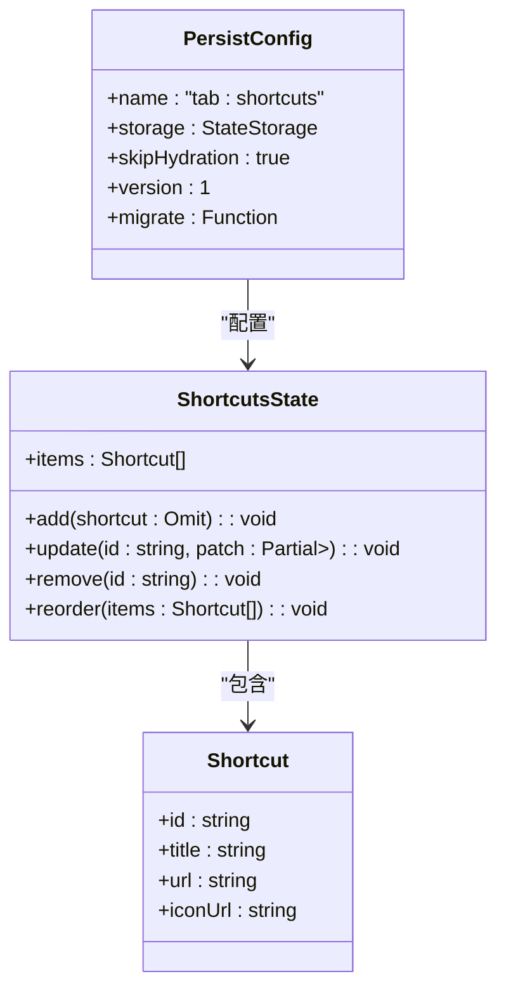

**图表来源**

- [src/store/useShortcutsStore.ts:6-12](file://src/store/useShortcutsStore.ts#L6-L12)
- [src/store/useShortcutsStore.ts:23-50](file://src/store/useShortcutsStore.ts#L23-L50)

快捷方式存储的默认配置：

- **预设项目**：包含 Google、GitHub、YouTube、Twitter、ChatGPT、Claude 等常用网站
- **唯一标识符**：使用 `crypto.randomUUID()` 生成唯一的快捷方式 ID
- **持久化名称**：使用 `"tab:shortcuts"` 作为存储键

**章节来源**

- [src/store/useShortcutsStore.ts:1-54](file://src/store/useShortcutsStore.ts#L1-L54)

### 待办事项存储（useTodoStore）

待办事项存储管理用户的任务列表：

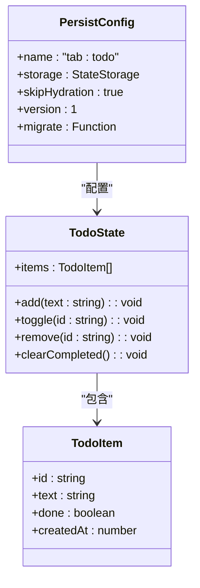

**图表来源**

- [src/store/useTodoStore.ts:12-18](file://src/store/useTodoStore.ts#L12-L18)
- [src/store/useTodoStore.ts:20-54](file://src/store/useTodoStore.ts#L20-L54)

待办事项存储的特点：

- **动态 ID 生成**：每个新任务都生成唯一的 ID
- **时间戳记录**：记录任务创建的时间
- **状态切换**：支持任务的完成/未完成状态切换
- **批量清理**：提供清理已完成任务的功能

**章节来源**

- [src/store/useTodoStore.ts:1-59](file://src/store/useTodoStore.ts#L1-L59)

## 依赖关系分析

存储系统的依赖关系体现了清晰的层次结构：

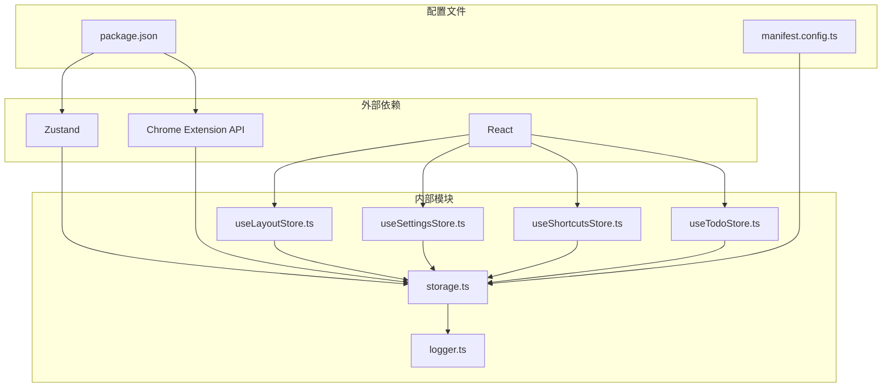

**图表来源**

- [package.json:18-26](file://package.json#L18-L26)
- [manifest.config.ts:21](file://manifest.config.ts#L21)
- [src/store/storage.ts:1](file://src/store/storage.ts#L1)

**章节来源**

- [package.json:1-56](file://package.json#L1-L56)
- [manifest.config.ts:1-38](file://manifest.config.ts#L1-L38)

## 性能考虑

### 存储性能优化策略

系统采用了多种性能优化措施：

1. **异步存储操作**：所有存储操作都是异步的，避免阻塞主线程
2. **批量水合**：使用 `Promise.all()` 并行处理多个存储的水合过程
3. **条件同步**：只处理 `chrome.storage.local` 区域的变更事件
4. **最小化重渲染**：通过精确的状态更新减少不必要的组件重渲染

### 数据压缩策略

虽然当前实现没有内置数据压缩功能，但可以考虑以下优化方案：

1. **序列化优化**：使用更高效的 JSON 序列化方法
2. **增量更新**：只存储状态的变化部分而非完整状态
3. **数据去重**：对于重复的数据结构进行去重处理
4. **懒加载**：对于大型数据集采用延迟加载策略

### 内存管理

系统在内存管理方面的考虑：

- **及时释放**：在不需要时及时释放存储引用
- **垃圾回收**：避免创建不必要的闭包和循环引用
- **状态清理**：提供状态重置功能，便于内存回收

## 故障排除指南

### 常见问题诊断

#### 存储权限问题

**症状**：存储操作失败或抛出权限错误

**诊断步骤**：

1. 检查 Chrome 扩展权限配置
2. 验证 `chrome.storage` API 的可用性
3. 查看浏览器控制台中的错误信息

**解决方案**：

- 确保 `manifest.config.ts` 中包含正确的权限声明
- 在非扩展环境中自动回退到 `localStorage`
- 实现适当的错误处理和降级策略

#### 水合失败问题

**症状**：应用启动时状态丢失或显示默认值

**诊断步骤**：

1. 检查存储键名是否正确
2. 验证数据格式的兼容性
3. 确认版本迁移逻辑的正确性

**解决方案**：

- 使用 `skipHydration: true` 配置手动控制水合时机
- 实现健壮的版本迁移逻辑
- 添加数据验证和清理机制

#### 远程同步问题

**症状**：多标签页间状态不同步

**诊断步骤**：

1. 检查 `chrome.storage.onChanged` 事件监听器
2. 验证存储键名的匹配性
3. 确认回调函数的执行顺序

**解决方案**：

- 确保每个存储都有对应的远程同步处理器
- 实现幂等的水合操作
- 添加同步冲突解决机制

### 调试工具和技巧

#### 日志记录

系统使用统一的日志记录工具，支持不同级别的日志输出：

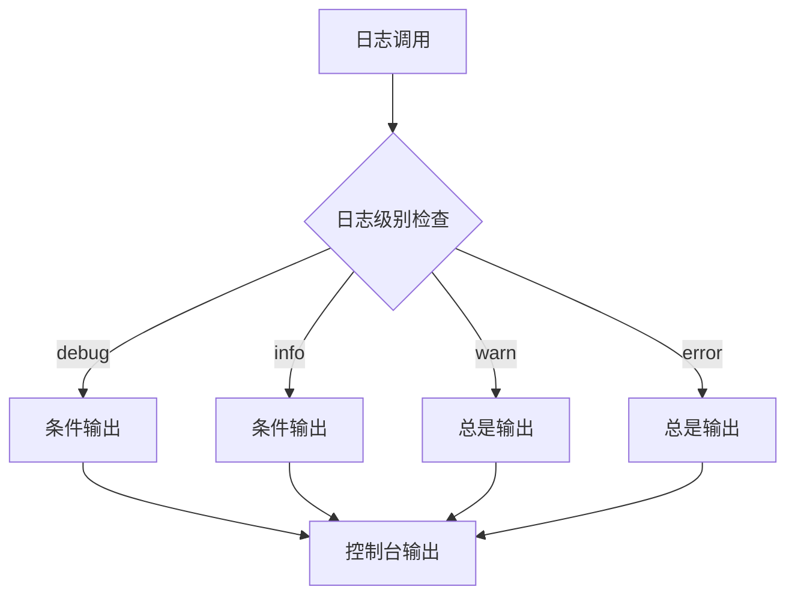

**图表来源**

- [src/lib/logger.ts:20-35](file://src/lib/logger.ts#L20-L35)

#### 存储监控

建议实现的监控功能：

- **存储大小监控**：跟踪存储使用情况
- **操作计数统计**：记录读写操作的频率
- **错误率统计**：监控存储操作的成功率
- **性能指标**：测量存储操作的响应时间

**章节来源**

- [src/lib/logger.ts:1-35](file://src/lib/logger.ts#L1-L35)
- [src/store/storage.ts:18-30](file://src/store/storage.ts#L18-L30)

## 结论

本存储集成机制成功实现了 Chrome Extension 环境下的数据持久化需求，具有以下特点：

**优势**：

- **环境适应性强**：自动适配 Chrome 扩展和 Web 环境
- **架构清晰**：模块化设计，职责分离明确
- **扩展性好**：易于添加新的存储域和功能
- **错误处理完善**：提供了全面的错误检测和处理机制

**改进方向**：

- **性能优化**：可以考虑添加数据压缩和缓存机制
- **监控增强**：增加更详细的性能监控和调试工具
- **安全性提升**：考虑添加数据加密和访问控制
- **测试覆盖**：扩展现有的单元测试和集成测试

该系统为 Chrome 新标签页扩展提供了一个可靠、高效且易于维护的存储解决方案，为后续的功能扩展奠定了坚实的基础。

## 附录

### 最佳实践指南

#### 存储设计最佳实践

1. **明确数据边界**：每个存储域应该有清晰的职责范围
2. **版本化管理**：始终维护数据结构的版本信息
3. **错误处理**：为所有异步操作提供适当的错误处理
4. **性能考虑**：避免不必要的存储操作和数据传输

#### 代码示例路径

以下是一些关键实现的参考路径：

- [自定义存储适配器实现:6-32](file://src/store/storage.ts#L6-L32)
- [水合管理器实现:34-43](file://src/store/storage.ts#L34-L43)
- [远程同步初始化:53-62](file://src/store/storage.ts#L53-L62)
- [布局存储配置:32-54](file://src/store/useLayoutStore.ts#L32-L54)
- [设置存储迁移逻辑:62-82](file://src/store/useSettingsStore.ts#L62-L82)

#### 配置参考

**Chrome 扩展权限配置**：

- `storage`: 访问本地存储
- `bookmarks`: 访问书签数据
- `unlimitedStorage`: 无限存储空间
- `tabs`: 访问标签页信息
- `geolocation`: 获取地理位置信息

**章节来源**

- [manifest.config.ts:21](file://manifest.config.ts#L21)
- [src/store/storage.ts:4](file://src/store/storage.ts#L4)
- [src/store/useSettingsStore.ts:62-82](file://src/store/useSettingsStore.ts#L62-L82)
