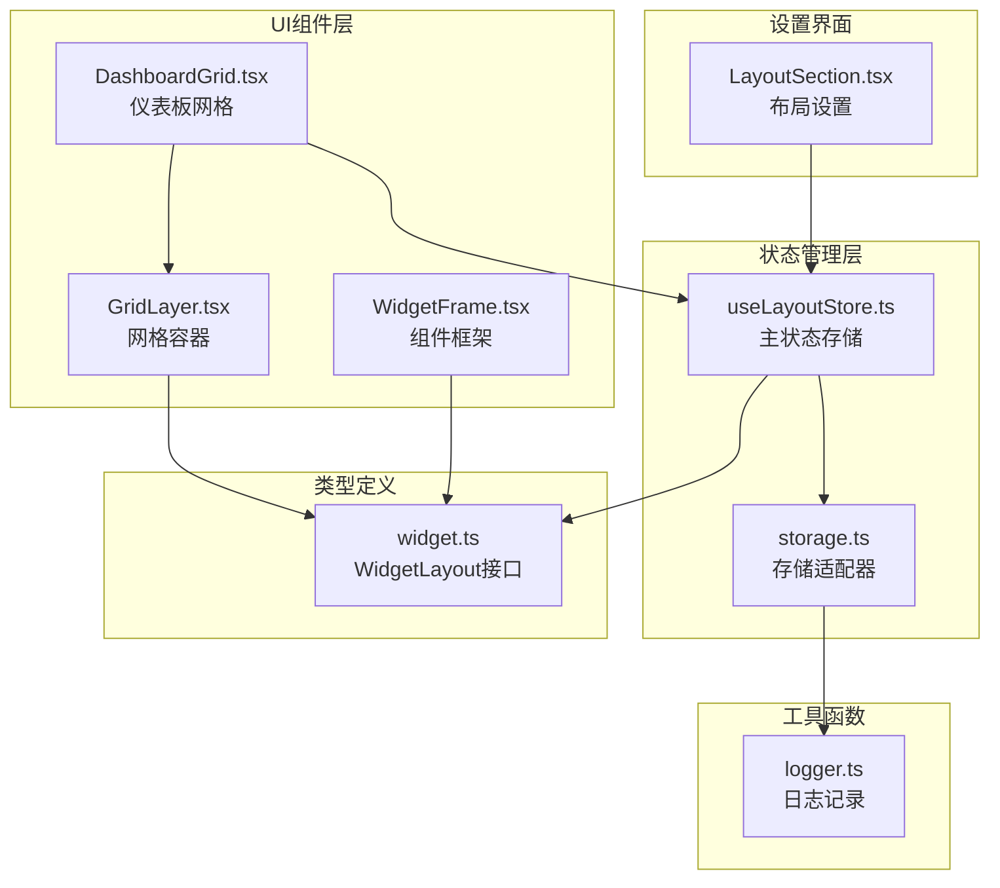
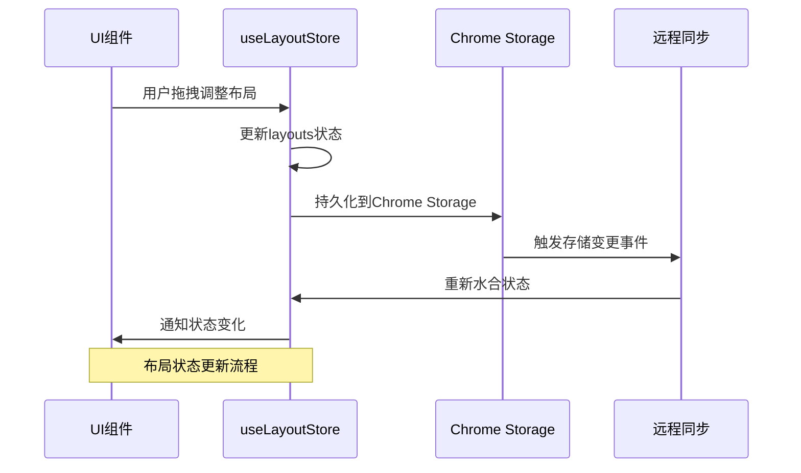
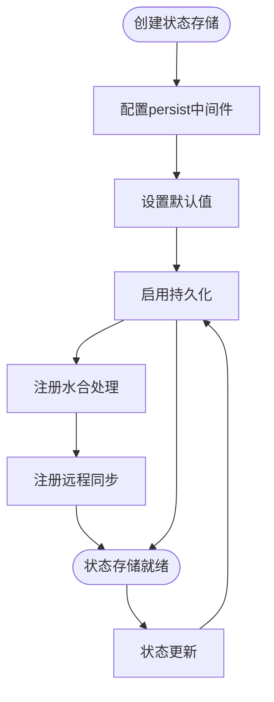
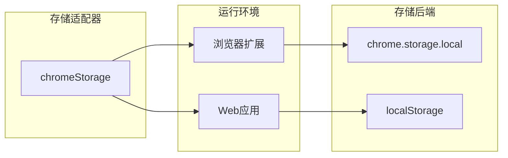
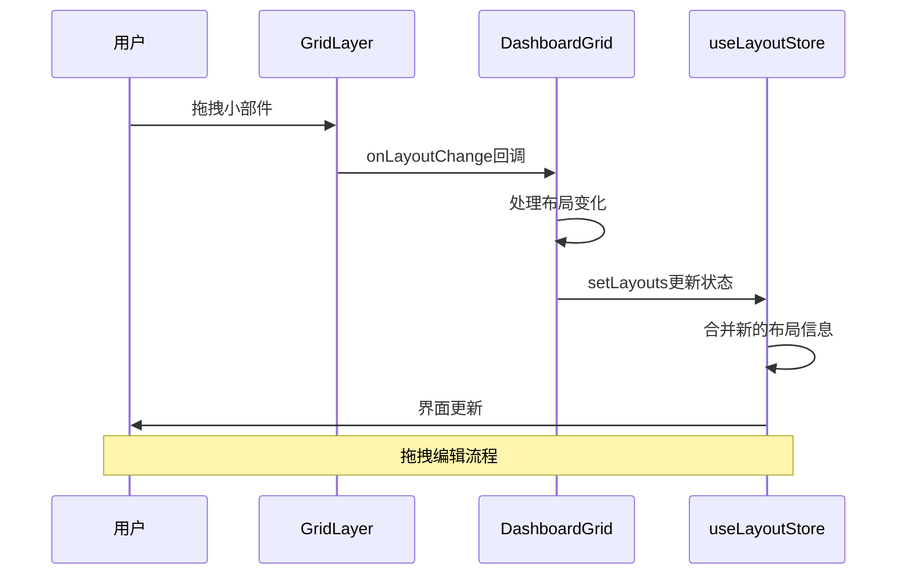
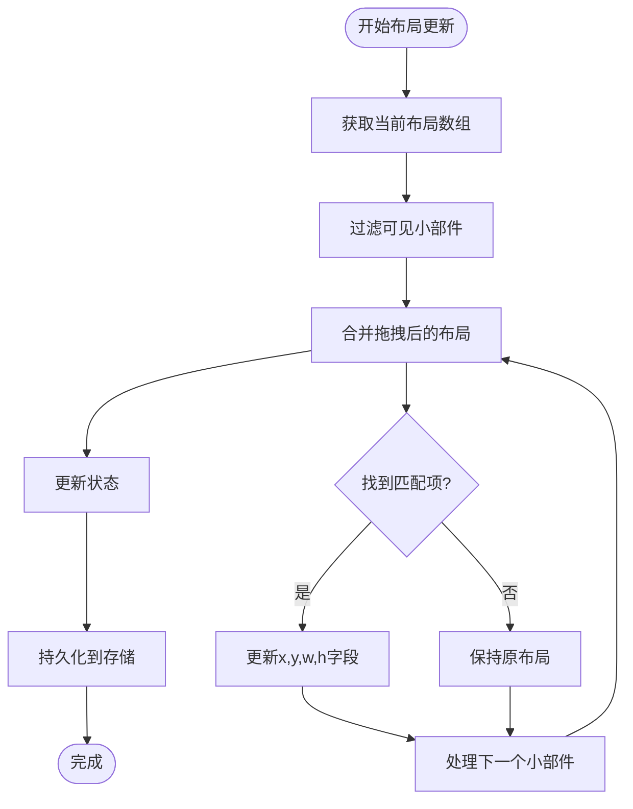
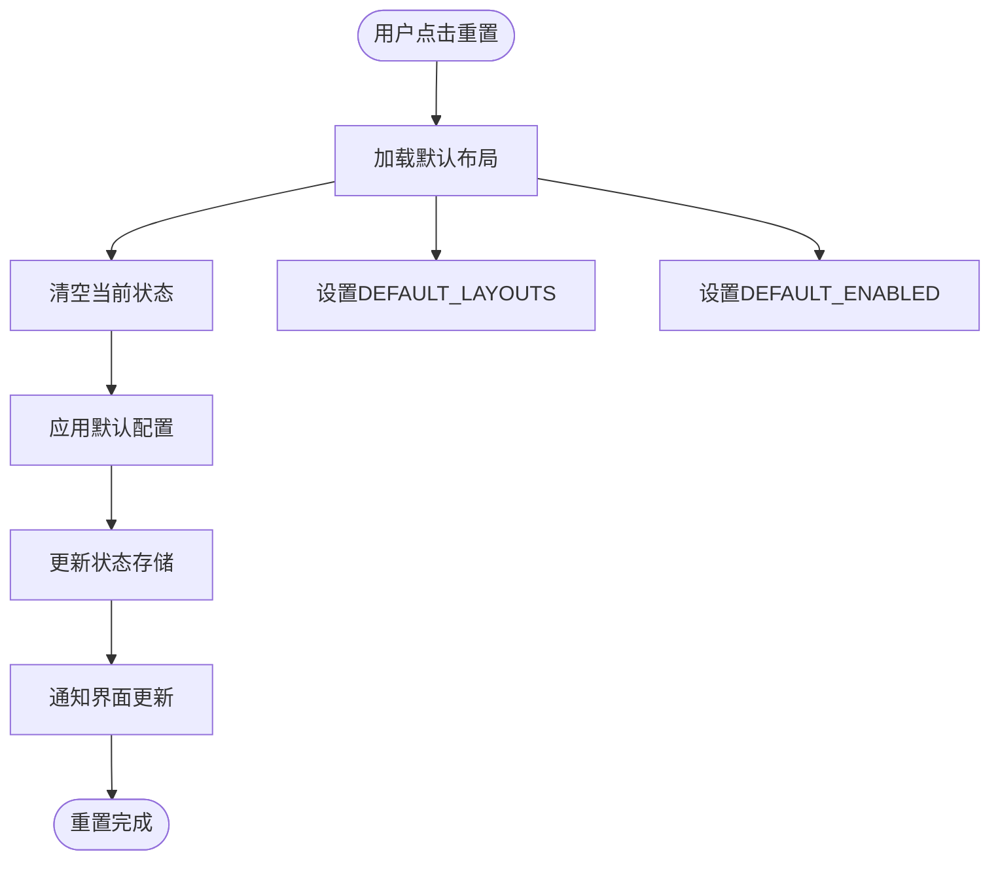
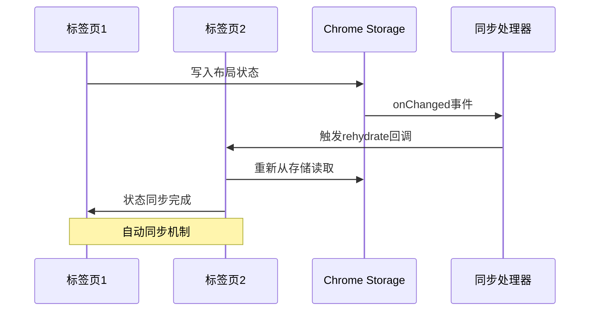
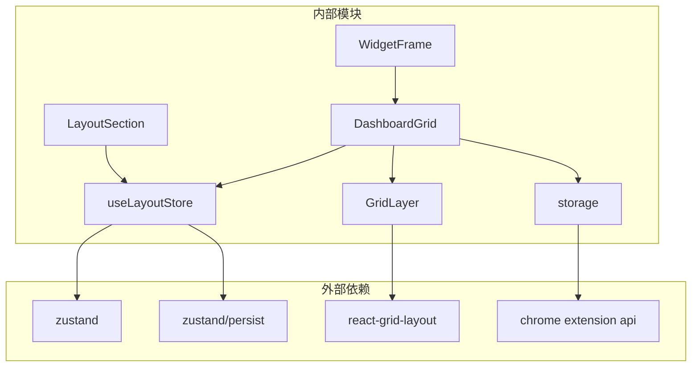
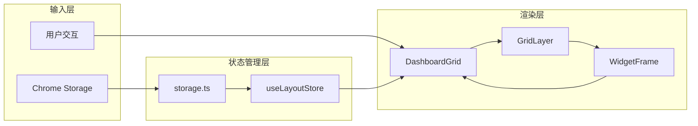

# 布局状态管理

<cite>
**本文档引用的文件**
- [useLayoutStore.ts](file://src/store/useLayoutStore.ts)
- [storage.ts](file://src/store/storage.ts)
- [widget.ts](file://src/types/widget.ts)
- [DashboardGrid.tsx](file://src/components/layout/DashboardGrid.tsx)
- [GridLayer.tsx](file://src/components/layout/GridLayer.tsx)
- [WidgetFrame.tsx](file://src/components/layout/WidgetFrame.tsx)
- [LayoutSection.tsx](file://src/components/settings/LayoutSection.tsx)
- [logger.ts](file://src/lib/logger.ts)
- [useLayoutStore.test.ts](file://src/store/useLayoutStore.test.ts)
</cite>

## 目录

1. [简介](#简介)
2. [项目结构](#项目结构)
3. [核心组件](#核心组件)
4. [架构概览](#架构概览)
5. [详细组件分析](#详细组件分析)
6. [依赖关系分析](#依赖关系分析)
7. [性能考虑](#性能考虑)
8. [故障排除指南](#故障排除指南)
9. [结论](#结论)

## 简介

本文件深入分析了新标签页扩展的布局状态管理系统，重点围绕 `useLayoutStore` 的实现细节。该系统提供了完整的布局状态管理、持久化存储、跨页面同步以及拖拽编辑功能。通过使用 Zustand 状态管理库和 Chrome Storage API，实现了高性能且可靠的布局状态持久化方案。

## 项目结构

布局状态管理相关的文件组织如下：



**图表来源**

- [useLayoutStore.ts:1-58](file://src/store/useLayoutStore.ts#L1-L58)
- [storage.ts:1-63](file://src/store/storage.ts#L1-L63)
- [widget.ts:1-34](file://src/types/widget.ts#L1-L34)

**章节来源**

- [useLayoutStore.ts:1-58](file://src/store/useLayoutStore.ts#L1-L58)
- [storage.ts:1-63](file://src/store/storage.ts#L1-L63)
- [widget.ts:1-34](file://src/types/widget.ts#L1-L34)

## 核心组件

### 布局状态接口设计

`useLayoutStore` 实现了一个专门的状态管理接口，包含以下关键属性：

- **layouts**: WidgetLayout[] - 存储所有小部件的布局信息
- **enabled**: WidgetId[] - 存储当前启用的小部件ID列表
- **setLayouts**: (layouts: WidgetLayout[]) => void - 更新布局数组的方法
- **toggleWidget**: (id: WidgetId) => void - 切换小部件显示状态
- **reset**: () => void - 重置为默认布局

### 默认布局配置

系统预设了6个标准小部件的默认布局，每个小部件都有特定的位置、尺寸和约束条件：

| 小部件              | 位置(x,y) | 尺寸(w,h) | 最小尺寸(minW,minH) |
| ------------------- | --------- | --------- | ------------------- |
| 时钟(clock)         | (0,0)     | 12×3      | 4×2                 |
| 搜索(search)        | (0,3)     | 12×1      | 4×1                 |
| 快捷方式(shortcuts) | (0,4)     | 12×3      | 4×2                 |
| 天气(weather)       | (0,7)     | 4×4       | 3×3                 |
| 待办(todo)          | (4,7)     | 4×4       | 3×3                 |
| 书签(bookmarks)     | (8,7)     | 4×4       | 3×3                 |

**章节来源**

- [useLayoutStore.ts:14-30](file://src/store/useLayoutStore.ts#L14-L30)
- [useLayoutStore.ts:32-54](file://src/store/useLayoutStore.ts#L32-L54)

## 架构概览

布局状态管理系统采用分层架构设计，确保了良好的模块分离和可维护性：



**图表来源**

- [useLayoutStore.ts:32-54](file://src/store/useLayoutStore.ts#L32-L54)
- [storage.ts:53-62](file://src/store/storage.ts#L53-L62)

## 详细组件分析

### WidgetLayout 接口详解

WidgetLayout 接口定义了小部件布局的核心数据结构：

```mermaid
classDiagram
class WidgetLayout {
+WidgetId i
+number x
+number y
+number w
+number h
+number minW
+number minH
}
class WidgetId {
<<enumeration>>
"search"
"clock"
"shortcuts"
"weather"
"todo"
"bookmarks"
}
WidgetLayout --> WidgetId : "使用"
```

**图表来源**

- [widget.ts:25-33](file://src/types/widget.ts#L25-L33)
- [widget.ts:8-15](file://src/types/widget.ts#L8-L15)

#### 字段含义说明

- **i**: 小部件唯一标识符，对应 WidgetId 枚举值
- **x, y**: 小部件在网格中的位置坐标（以网格单元为单位）
- **w, h**: 小部件的宽度和高度（以网格单元为单位）
- **minW, minH**: 小部件的最小宽度和高度约束

**章节来源**

- [widget.ts:25-33](file://src/types/widget.ts#L25-L33)

### 布局状态存储实现

#### Zustand 状态管理

使用 Zustand 创建了专门的布局状态存储，集成了持久化中间件：



**图表来源**

- [useLayoutStore.ts:32-54](file://src/store/useLayoutStore.ts#L32-L54)

#### Chrome Storage 集成

存储适配器提供了浏览器环境和开发环境的统一接口：



**图表来源**

- [storage.ts:6-32](file://src/store/storage.ts#L6-L32)

**章节来源**

- [useLayoutStore.ts:1-58](file://src/store/useLayoutStore.ts#L1-L58)
- [storage.ts:1-63](file://src/store/storage.ts#L1-L63)

### 拖拽布局编辑机制

#### 响应式网格系统

系统使用 react-grid-layout 实现响应式拖拽布局编辑：



**图表来源**

- [GridLayer.tsx:30-45](file://src/components/layout/GridLayer.tsx#L30-L45)
- [DashboardGrid.tsx:60-75](file://src/components/layout/DashboardGrid.tsx#L60-L75)

#### 布局合并算法

当用户拖拽调整布局时，系统执行智能合并算法：



**图表来源**

- [DashboardGrid.tsx:63-74](file://src/components/layout/DashboardGrid.tsx#L63-L74)

**章节来源**

- [GridLayer.tsx:1-50](file://src/components/layout/GridLayer.tsx#L1-L50)
- [DashboardGrid.tsx:1-110](file://src/components/layout/DashboardGrid.tsx#L1-L110)

### 布局重置与默认管理

#### 重置功能实现

重置功能提供了简单而有效的布局恢复机制：



**图表来源**

- [useLayoutStore.ts:44](file://src/store/useLayoutStore.ts#L44)
- [useLayoutStore.ts:23-30](file://src/store/useLayoutStore.ts#L23-L30)

**章节来源**

- [useLayoutStore.ts:44](file://src/store/useLayoutStore.ts#L44)
- [useLayoutStore.ts:23-30](file://src/store/useLayoutStore.ts#L23-L30)

### 跨页面同步机制

#### 远程存储监听

系统实现了完整的跨页面同步机制，确保多标签页间的布局状态一致性：



**图表来源**

- [storage.ts:53-62](file://src/store/storage.ts#L53-L62)
- [useLayoutStore.ts:56-57](file://src/store/useLayoutStore.ts#L56-L57)

**章节来源**

- [storage.ts:45-62](file://src/store/storage.ts#L45-L62)
- [useLayoutStore.ts:56-57](file://src/store/useLayoutStore.ts#L56-L57)

## 依赖关系分析

### 组件依赖图



**图表来源**

- [useLayoutStore.ts:1-3](file://src/store/useLayoutStore.ts#L1-L3)
- [GridLayer.tsx:1-3](file://src/components/layout/GridLayer.tsx#L1-L3)

### 数据流依赖

系统遵循单向数据流原则，确保状态管理的可预测性和可调试性：



**图表来源**

- [useLayoutStore.ts:32-54](file://src/store/useLayoutStore.ts#L32-L54)
- [DashboardGrid.tsx:42-56](file://src/components/layout/DashboardGrid.tsx#L42-L56)

**章节来源**

- [useLayoutStore.ts:1-58](file://src/store/useLayoutStore.ts#L1-L58)
- [DashboardGrid.tsx:1-110](file://src/components/layout/DashboardGrid.tsx#L1-L110)

## 性能考虑

### 优化策略

#### 1. 懒加载机制

- react-grid-layout 仅在首次渲染时加载，避免首屏包体积膨胀
- 使用 React.lazy 和 Suspense 实现按需加载

#### 2. 计算优化

- 使用 useMemo 缓存计算结果，减少不必要的重新渲染
- 布局过滤和转换操作仅在依赖变化时执行

#### 3. 存储优化

- 使用 JSON 序列化存储，确保数据传输效率
- 智能的增量更新机制，避免全量重绘

### 性能监控建议

#### 调试指标

- 布局更新频率统计
- 渲染帧率监控
- 存储访问延迟测量

#### 优化建议

- 对频繁更新的布局进行节流处理
- 实施布局缓存策略
- 监控内存使用情况

## 故障排除指南

### 常见问题及解决方案

#### 1. 布局状态不同步

**症状**: 多标签页间布局状态不一致

**诊断步骤**:

1. 检查 Chrome Storage 同步是否正常工作
2. 验证 `initRemoteSync` 是否正确初始化
3. 确认 `registerRemoteSync` 回调是否注册成功

**解决方案**:

```typescript
// 确保同步机制正确初始化
if (typeof chrome !== 'undefined' && chrome.storage.onChanged) {
  initRemoteSync()
}
```

#### 2. 布局持久化失败

**症状**: 页面刷新后布局丢失

**诊断步骤**:

1. 检查 chrome.storage.local 可用性
2. 验证存储权限配置
3. 查看控制台错误信息

**解决方案**:

```typescript
// 添加存储错误处理
try {
  await chrome.storage.local.set({ key: value })
} catch (error) {
  console.error('存储失败:', error)
  // 回退到本地存储
  localStorage.setItem(key, value)
}
```

#### 3. 拖拽功能异常

**症状**: 小部件无法拖拽或拖拽无效

**诊断步骤**:

1. 检查 editMode 状态
2. 验证移动端禁用拖拽逻辑
3. 确认 draggableHandle 配置

**解决方案**:

```typescript
// 确保拖拽功能正确配置
const isDraggable = editMode && !isMobile
const isResizable = editMode && !isMobile
```

**章节来源**

- [storage.ts:12-31](file://src/store/storage.ts#L12-L31)
- [GridLayer.tsx:40-44](file://src/components/layout/GridLayer.tsx#L40-L44)

### 调试方法

#### 1. 状态检查

使用浏览器开发者工具的 Redux DevTools 或自定义调试输出：

```typescript
// 在关键节点添加调试信息
console.log('当前布局状态:', useLayoutStore.getState())
```

#### 2. 存储监控

监控 Chrome Storage 的变更事件：

```typescript
chrome.storage.onChanged.addListener((changes, area) => {
  console.log('存储变更:', changes)
})
```

#### 3. 性能分析

使用 React Profiler 分析组件渲染性能：

```typescript
// 包装需要分析的组件
React.useMemo(() => <DashboardGrid />, [])
```

**章节来源**

- [logger.ts:1-35](file://src/lib/logger.ts#L1-L35)
- [useLayoutStore.test.ts:1-57](file://src/store/useLayoutStore.test.ts#L1-L57)

## 结论

布局状态管理系统通过精心设计的架构实现了以下目标：

1. **可靠性**: 使用 Chrome Storage 确保存储持久化和跨页面同步
2. **性能**: 采用懒加载、计算缓存等优化策略提升用户体验
3. **可维护性**: 清晰的模块分离和类型安全的设计便于长期维护
4. **可扩展性**: 灵活的接口设计支持未来功能扩展

该系统为新标签页扩展提供了稳定、高效的布局管理能力，为用户创造了流畅的个性化体验。通过完善的错误处理和调试支持，确保了系统的可靠性和可维护性。
