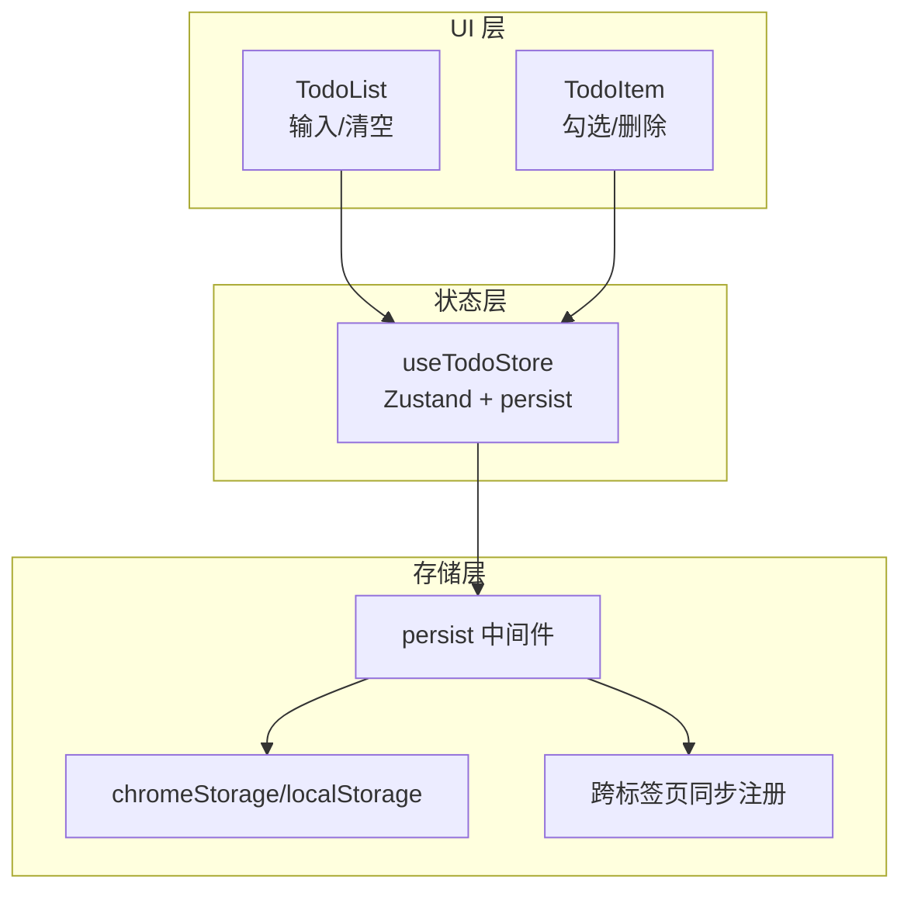
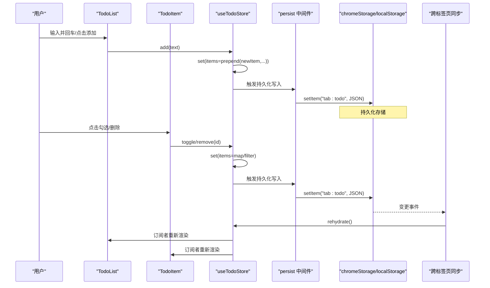
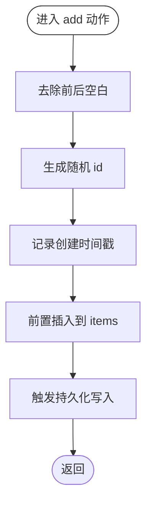
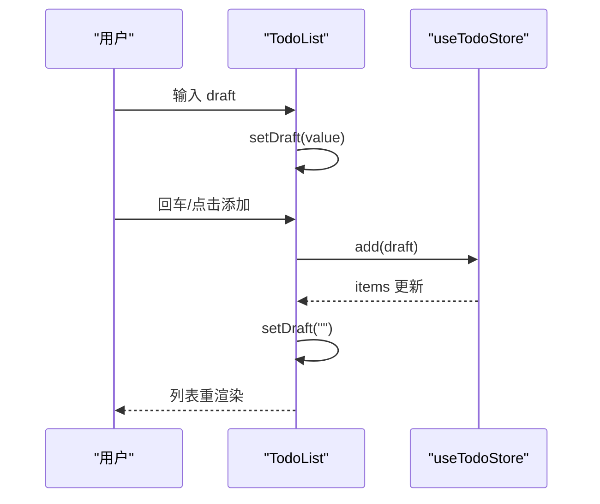
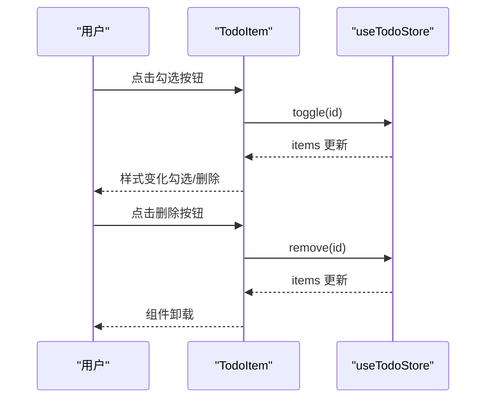
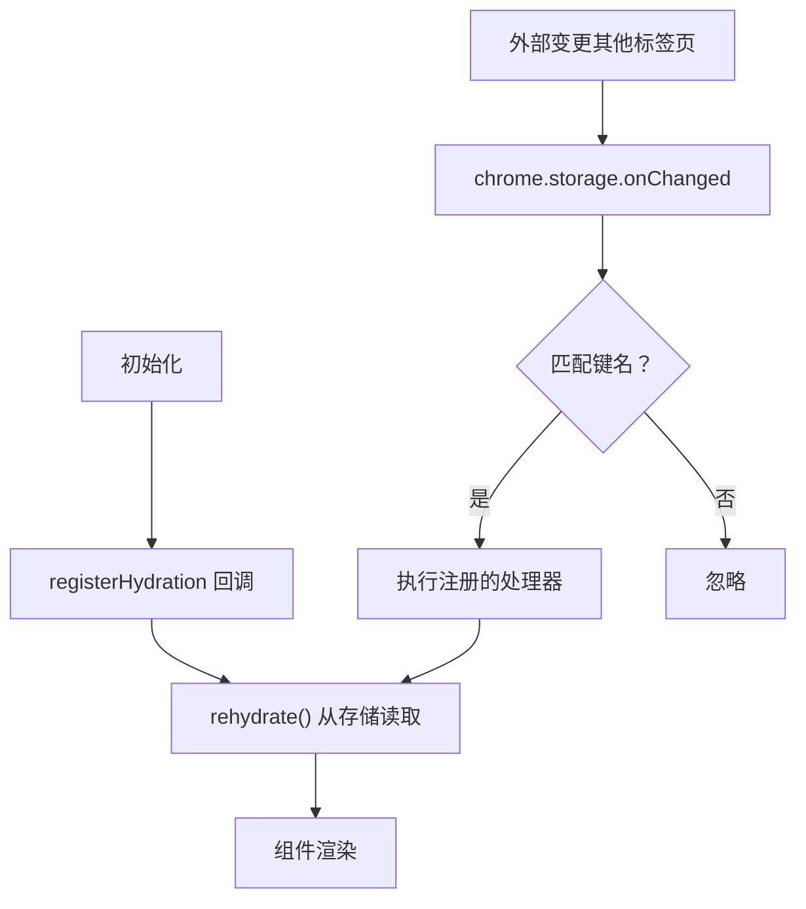
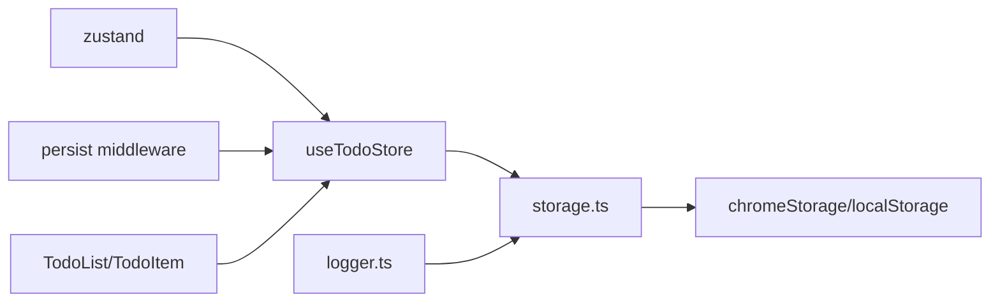

# 待办事项状态管理

<cite>
**本文引用的文件**
- [useTodoStore.ts](file://src/store/useTodoStore.ts)
- [useTodoStore.test.ts](file://src/store/useTodoStore.test.ts)
- [TodoList.tsx](file://src/components/widgets/Todo/TodoList.tsx)
- [TodoItem.tsx](file://src/components/widgets/Todo/TodoItem.tsx)
- [storage.ts](file://src/store/storage.ts)
- [logger.ts](file://src/lib/logger.ts)
- [App.tsx](file://src/newtab/App.tsx)
- [TodoItem.test.tsx](file://src/components/widgets/Todo/TodoItem.test.tsx)
- [package.json](file://package.json)
</cite>

## 目录

1. [简介](#简介)
2. [项目结构](#项目结构)
3. [核心组件](#核心组件)
4. [架构总览](#架构总览)
5. [详细组件分析](#详细组件分析)
6. [依赖分析](#依赖分析)
7. [性能考虑](#性能考虑)
8. [故障排查指南](#故障排查指南)
9. [结论](#结论)
10. [附录：扩展与最佳实践](#附录扩展与最佳实践)

## 简介

本文件围绕待办事项状态管理进行系统性技术文档梳理，重点分析 useTodoStore 的实现架构、数据模型与状态管理策略，覆盖创建、完成、删除、清空等操作的状态处理流程；解释待办事项列表的排序与过滤机制；阐述持久化存储与状态恢复能力；说明跨组件同步机制；并提供调试方法与性能优化建议。文档同时给出可直接定位到源码位置的路径，便于进一步阅读与扩展。

## 项目结构

待办事项功能由“状态层（Zustand）+ UI 组件（React）+ 存储中间件（Chrome Storage/本地存储）”三层构成：

- 状态层：useTodoStore 使用 Zustand 管理待办事项集合与动作函数
- UI 层：TodoList 负责输入与展示，TodoItem 负责单条目渲染与交互
- 存储层：通过 persist 中间件结合自定义 storage.ts 实现跨标签页同步与本地持久化

图表来源

- [useTodoStore.ts:20-58](file://src/store/useTodoStore.ts#L20-L58)
- [TodoList.tsx:6-68](file://src/components/widgets/Todo/TodoList.tsx#L6-L68)
- [TodoItem.tsx:10-45](file://src/components/widgets/Todo/TodoItem.tsx#L10-L45)
- [storage.ts:6-32](file://src/store/storage.ts#L6-L32)

章节来源

- [useTodoStore.ts:1-59](file://src/store/useTodoStore.ts#L1-L59)
- [TodoList.tsx:1-69](file://src/components/widgets/Todo/TodoList.tsx#L1-L69)
- [TodoItem.tsx:1-46](file://src/components/widgets/Todo/TodoItem.tsx#L1-L46)
- [storage.ts:1-63](file://src/store/storage.ts#L1-L63)

## 核心组件

- 数据模型 TodoItem
  - 字段：id、text、done、createdAt
  - 语义：唯一标识、文本内容、完成状态、创建时间戳
- 状态接口 TodoState
  - 字段：items: TodoItem[]
  - 动作：add、toggle、remove、clearCompleted
- 存储策略
  - 使用 persist 中间件，存储键名 tab:todo，JSON 序列化
  - skipHydration: true，避免初次渲染时的 hydration 冲突
  - 版本号 version: 1，迁移函数当前透传
- 同步机制
  - registerHydration 注册水合回调
  - registerRemoteSync 注册跨标签页变更监听
  - initRemoteSync 在扩展环境中订阅 chrome.storage.onChanged

章节来源

- [useTodoStore.ts:5-18](file://src/store/useTodoStore.ts#L5-L18)
- [useTodoStore.ts:20-58](file://src/store/useTodoStore.ts#L20-L58)
- [storage.ts:34-62](file://src/store/storage.ts#L34-L62)

## 架构总览

下图展示了从用户输入到状态更新再到持久化的完整链路，以及跨标签页同步的触发点。

图表来源

- [TodoList.tsx:12-16](file://src/components/widgets/Todo/TodoList.tsx#L12-L16)
- [TodoItem.tsx:16-42](file://src/components/widgets/Todo/TodoItem.tsx#L16-L42)
- [useTodoStore.ts:24-45](file://src/store/useTodoStore.ts#L24-L45)
- [storage.ts:49-62](file://src/store/storage.ts#L49-L62)

## 详细组件分析

### useTodoStore 状态管理器

- 设计要点
  - 使用 create 创建 Zustand store，内部通过 set 推导式更新 items
  - add：生成随机 id、trim 文本、createdAt 当前时间、前置插入以保持最新在前
  - toggle：按 id 映射翻转 done 状态
  - remove：按 id 过滤移除
  - clearCompleted：仅保留未完成项
- 复杂度分析
  - add：O(n)（数组前置插入）
  - toggle/remove/clearCompleted：O(n)（线性遍历/过滤）
- 错误处理
  - toggle 对不存在 id 的安全处理：不改变原数组
- 持久化与恢复
  - persist 配置使用 createJSONStorage 包装 chromeStorage
  - skipHydration 避免 SSR/Hydration 冲突
  - registerHydration 与 registerRemoteSync 提供水合与跨标签页同步入口

图表来源

- [useTodoStore.ts:24-35](file://src/store/useTodoStore.ts#L24-L35)

章节来源

- [useTodoStore.ts:20-58](file://src/store/useTodoStore.ts#L20-L58)
- [useTodoStore.test.ts:13-35](file://src/store/useTodoStore.test.ts#L13-L35)

### TodoList 列表组件

- 功能职责
  - 维护 draft 输入框状态
  - 调用 add 添加新任务，清空 draft
  - 条件显示“清除已完成”按钮（存在已完成项时）
  - 渲染 items 列表，空态提示
- 交互细节
  - 回车触发添加
  - 禁用态控制基于 draft 是否为空
  - 无障碍属性：aria-live、aria-atomic、aria-label

图表来源

- [TodoList.tsx:10-16](file://src/components/widgets/Todo/TodoList.tsx#L10-L16)
- [TodoList.tsx:6-68](file://src/components/widgets/Todo/TodoList.tsx#L6-L68)

章节来源

- [TodoList.tsx:1-69](file://src/components/widgets/Todo/TodoList.tsx#L1-L69)

### TodoItem 单项组件

- 功能职责
  - 勾选按钮：调用 toggle 切换 done
  - 删除按钮：调用 remove 移除该项
  - 样式：根据 done 应用不同文本样式与边框颜色
- 无障碍与交互
  - aria-label 明确按钮语义
  - 悬停显示删除按钮，提升可用性

图表来源

- [TodoItem.tsx:16-42](file://src/components/widgets/Todo/TodoItem.tsx#L16-L42)

章节来源

- [TodoItem.tsx:1-46](file://src/components/widgets/Todo/TodoItem.tsx#L1-L46)

### 存储与跨标签页同步

- 存储适配
  - chromeStorage：在扩展环境使用 chrome.storage.local，否则回退到 localStorage
  - 错误处理：写入/删除时检查 chrome.runtime.lastError 并记录日志
- 水合与同步
  - registerHydration：注册 rehydrate 回调，用于启动时从存储恢复
  - registerRemoteSync：为指定键名注册远程变更处理器
  - initRemoteSync：订阅 chrome.storage.onChanged，匹配键名后触发对应处理器

图表来源

- [storage.ts:37-62](file://src/store/storage.ts#L37-L62)

章节来源

- [storage.ts:1-63](file://src/store/storage.ts#L1-L63)

## 依赖分析

- 外部依赖
  - zustand：状态管理库
  - zustand/middleware：persist 中间件
  - lucide-react：图标库
  - react/react-dom：UI 框架
- 内部依赖
  - useTodoStore 依赖 storage.ts 提供的 chromeStorage 与同步工具
  - TodoList/TodoItem 依赖 useTodoStore 的状态与动作
  - logger.ts 为存储层错误输出提供统一入口

图表来源

- [package.json:18-26](file://package.json#L18-L26)
- [useTodoStore.ts:1-3](file://src/store/useTodoStore.ts#L1-L3)
- [storage.ts:1-32](file://src/store/storage.ts#L1-L32)
- [logger.ts:1-35](file://src/lib/logger.ts#L1-L35)

章节来源

- [package.json:18-56](file://package.json#L18-L56)
- [useTodoStore.ts:1-59](file://src/store/useTodoStore.ts#L1-L59)
- [storage.ts:1-63](file://src/store/storage.ts#L1-L63)
- [logger.ts:1-35](file://src/lib/logger.ts#L1-L35)

## 性能考虑

- 列表渲染
  - TodoItem 使用 React.memo，减少不必要的重渲染
  - TodoList 通过选择器订阅 items，避免无关状态导致的重渲染
- 状态更新复杂度
  - add/toggle/remove/clearCompleted 均为 O(n)，对小规模待办列表影响有限
  - 若未来需要大规模列表，可考虑：
    - 使用有序索引或 Map 结构以支持 O(1) 查找与更新
    - 分页/虚拟滚动以降低渲染开销
- 持久化写入
  - 每次状态变更都会触发写入，频繁操作可能带来 I/O 压力
  - 可引入节流/防抖策略，合并多次变更后再写入
- 同步开销
  - 跨标签页同步会触发 rehydrate，建议在高频变更场景下限制同步频率

章节来源

- [TodoItem.tsx:1-5](file://src/components/widgets/Todo/TodoItem.tsx#L1-L5)
- [TodoList.tsx:6-8](file://src/components/widgets/Todo/TodoList.tsx#L6-L8)
- [useTodoStore.ts:24-45](file://src/store/useTodoStore.ts#L24-L45)

## 故障排查指南

- 常见问题与定位
  - 状态未持久化：检查 chrome.storage.local 或 localStorage 是否可用；确认 persist 配置正确
  - 跨标签页不同步：确认 initRemoteSync 已在扩展环境中启用；检查键名是否一致
  - toggle/remove 无效：确认传入的 id 是否存在于 items 中；测试用例覆盖了非存在 id 的安全行为
- 调试方法
  - 启用调试日志：通过 logger.ts 的 setLoggerMinLevel 控制最小日志级别
  - 断点与日志：在 storage.ts 的 setItem/removeItem 中添加断点，观察 lastError
  - 测试验证：参考 useTodoStore.test.ts 与 TodoItem.test.tsx 的用例，逐项验证行为
- 性能观测
  - 使用 React DevTools Profiler 观察渲染热点
  - 在高频变更场景下，评估是否需要节流/去抖与虚拟化

章节来源

- [storage.ts:18-31](file://src/store/storage.ts#L18-L31)
- [logger.ts:32-35](file://src/lib/logger.ts#L32-L35)
- [useTodoStore.test.ts:47-51](file://src/store/useTodoStore.test.ts#L47-L51)
- [TodoItem.test.tsx:31-37](file://src/components/widgets/Todo/TodoItem.test.tsx#L31-L37)

## 结论

useTodoStore 采用轻量、直观的 Zustand 架构，结合 persist 中间件与自定义存储适配，实现了待办事项的本地持久化与跨标签页同步。UI 层通过细粒度的选择器订阅与 memo 化优化，保证了良好的交互体验与性能表现。当前实现满足基础需求，若业务规模扩大，可在数据结构、持久化策略与渲染优化方面进一步演进。

## 附录：扩展与最佳实践

- 新增字段与动作
  - 扩展 TodoItem：在接口中新增字段，更新 add/toggle/remove/clearCompleted 的映射逻辑
  - 新增动作：在 TodoState 中声明新方法，并在 persist 回调中实现状态更新
- 排序与过滤
  - 当前默认按创建时间倒序（最新在前），可通过在 UI 层增加排序选项（按完成状态、文本等）
  - 过滤：可增加“仅显示未完成”等筛选条件，配合 UI 层状态管理
- 编辑功能
  - 当前仅支持勾选与删除，可扩展为双击编辑文本，或在 UI 层维护编辑态
- 性能优化
  - 引入节流/防抖：对高频输入与切换进行节流
  - 虚拟化：当列表增长到一定规模时，采用虚拟滚动
  - 选择器优化：确保 UI 组件只订阅必要的状态片段
- 调试与可观测性
  - 在 storage.ts 中增加更详细的错误日志与埋点
  - 在开发模式下开启更详细的 Zustand 日志（可通过第三方中间件或调试工具）

章节来源

- [useTodoStore.ts:5-18](file://src/store/useTodoStore.ts#L5-L18)
- [TodoList.tsx:18-34](file://src/components/widgets/Todo/TodoList.tsx#L18-L34)
- [storage.ts:18-31](file://src/store/storage.ts#L18-L31)
